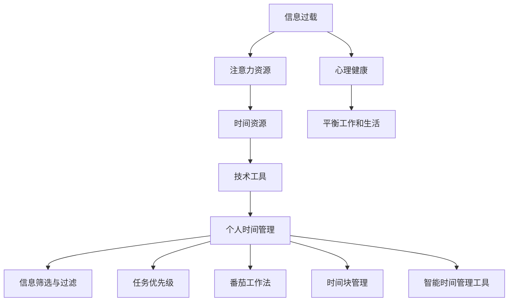

                 

# 注意力经济与个人时间管理策略的演变

## 1. 背景介绍

### 1.1 问题由来

在数字化时代，信息爆炸和媒体丰富性带来了新的经济现象——注意力经济。它指的是在信息过载的时代，人们的时间变得稀缺，如何争夺人们的注意力成为了一个重要的经济问题。与传统的商品和服务相比，注意力经济的核心在于争夺和利用人们的注意力，从而实现商业价值。

在这一背景下，个人时间管理策略也经历了显著的演变。从简单的时间表安排到复杂的时间管理工具，再到智能时间管理方法，个人时间管理策略在不断地升级。它不再仅仅关注任务的完成，而是着眼于如何更高效地利用时间，提高工作效率和生产力。

### 1.2 问题核心关键点

注意力经济与个人时间管理策略的演变涉及以下几个关键点：

- **信息过载**：在数字化时代，人们面对的信息量远远超过了个人处理能力，如何筛选和过滤信息变得至关重要。
- **注意力资源**：人们的注意力是有限的，如何有效管理注意力，使其服务于个人目标，是个人时间管理策略的核心。
- **时间资源**：时间是一种不可再生资源，如何在有限的时间内完成更多的任务，是时间管理策略追求的目标。
- **技术工具**：技术工具的发展，尤其是计算机、互联网、移动设备等，为个人时间管理提供了新的可能性。
- **心理健康**：过度关注时间和效率可能导致心理压力，如何平衡工作和生活，保障心理健康，是时间管理策略的重要考虑因素。

## 2. 核心概念与联系

### 2.1 核心概念概述

为更好地理解注意力经济与个人时间管理策略的演变，本节将介绍几个密切相关的核心概念：

- **注意力经济**：基于信息时代注意力资源稀缺性的经济理论，强调信息或媒体产品的价值在于其吸引和利用注意力的能力。
- **个人时间管理**：个人通过有效安排和管理时间，以达到目标、提高效率和满足个人需求的过程。
- **信息筛选与过滤**：在信息过载的环境中，个人需要掌握方法筛选和过滤有用信息，减少干扰。
- **任务优先级**：根据任务的紧急性和重要性，确定优先级，合理分配时间和精力。
- **番茄工作法**：一种时间管理方法，通过定时工作（25分钟）和休息（5分钟）的循环，提高工作效率。
- **时间块管理**：将一天分成若干时间块，每个时间块专注于特定任务，提高时间利用效率。
- **智能时间管理工具**：利用技术工具，如手机应用、电脑软件等，实现自动化和智能化的时间管理。

这些概念之间的逻辑关系可以通过以下Mermaid流程图来展示：



这个流程图展示了注意力经济与个人时间管理策略之间的内在联系：

1. 信息过载问题导致对注意力资源的争夺。
2. 注意力资源的有限性促使对时间资源的合理利用。
3. 技术工具的发展为个人时间管理提供了新的方法。
4. 个人时间管理策略的核心在于有效筛选和过滤信息、确定任务优先级、运用高效时间管理方法。
5. 健康的工作和生活平衡是时间管理策略的重要考量因素。

## 3. 核心算法原理 & 具体操作步骤
### 3.1 算法原理概述

注意力经济与个人时间管理策略的演变，从根本上是一个从人工到智能的进化过程。它涉及对注意力资源的争夺、时间资源的合理利用、任务优先级的确定等，每个环节都需要相应的算法和策略来支撑。

### 3.2 算法步骤详解

#### 3.2.1 信息筛选与过滤算法

信息筛选与过滤的核心在于利用算法模型对海量信息进行自动筛选，提取出与当前任务相关的有用信息。常见的算法包括：

- **基于关键词的筛选**：使用关键词匹配算法，从大量文本中筛选出与特定主题相关的信息。
- **基于内容的过滤**：通过自然语言处理技术，分析文本内容，筛选出高质量的信息。
- **基于模型的推荐**：利用推荐系统算法，根据用户的历史行为和偏好，推荐可能感兴趣的信息。

#### 3.2.2 任务优先级确定算法

任务优先级确定的核心在于通过算法评估任务的紧急性和重要性，合理分配时间和精力。常见的算法包括：

- **AHP（层次分析法）**：通过构建任务之间的层次结构，使用矩阵运算确定各任务的重要性和优先级。
- **MoM（莫迪特矩阵）**：通过构建任务矩阵，使用加权求和法计算各任务的重要性。
- **TCM（任务-时间矩阵）**：通过构建任务-时间矩阵，使用最小二乘法求解任务优先级。

#### 3.2.3 时间块管理算法

时间块管理算法通过将一天分成若干时间块，每个时间块专注于特定任务，提高时间利用效率。常见的算法包括：

- **时间块划分算法**：根据任务的重要性和紧急性，将一天划分为多个时间块，每个时间块专注于特定任务。
- **时间块优化算法**：通过时间块之间的相互调整，优化时间分配，提高时间利用效率。
- **时间块动态调整算法**：根据任务的进展情况，动态调整时间块，适应变化的任务需求。

#### 3.2.4 番茄工作法算法

番茄工作法通过定时工作（25分钟）和休息（5分钟）的循环，提高工作效率。常见的算法包括：

- **定时器管理算法**：通过设置定时器，实现工作与休息的循环。
- **工作与休息时间分配算法**：根据工作性质和个人喜好，调整工作时间和休息时间。
- **数据记录与分析算法**：通过记录工作和休息数据，分析效率提升空间。

#### 3.2.5 智能时间管理工具

智能时间管理工具通过技术手段，实现自动化和智能化的时间管理。常见的算法包括：

- **日历管理算法**：利用日历工具，自动化安排和调整任务时间。
- **任务自动化算法**：利用任务管理工具，自动化执行重复性任务。
- **数据分析与优化算法**：通过数据分析，优化时间管理策略，提高效率。

### 3.3 算法优缺点

注意力经济与个人时间管理策略的演变，涉及多个算法和策略，每种算法和策略都有其优点和局限性：

#### 3.3.1 信息筛选与过滤算法的优缺点

- **优点**：
  - 自动化筛选，节省时间和精力。
  - 提高信息筛选的准确性。
  - 可以处理大规模数据。
  
- **缺点**：
  - 算法模型可能存在偏差，筛选结果不一定符合用户需求。
  - 算法需要大量数据训练，初期成本较高。
  - 对于领域特定的信息筛选效果可能不佳。

#### 3.3.2 任务优先级确定算法的优缺点

- **优点**：
  - 系统化评估任务优先级，减少主观偏见。
  - 可以根据实际情况动态调整任务优先级。
  - 可以帮助用户更好地集中精力完成重要任务。
  
- **缺点**：
  - 算法可能过于复杂，不易理解和使用。
  - 算法需要大量数据和计算资源，初期成本较高。
  - 可能无法完全适应个性化需求。

#### 3.3.3 时间块管理算法的优缺点

- **优点**：
  - 帮助用户系统化管理时间，提高时间利用效率。
  - 可以应对突发事件，灵活调整时间安排。
  - 有助于减少时间浪费，提高工作效率。
  
- **缺点**：
  - 需要用户自律，否则难以坚持。
  - 可能过于固定，无法应对复杂多变的工作任务。
  - 可能影响工作的连续性。

#### 3.3.4 番茄工作法算法的优缺点

- **优点**：
  - 通过定时工作和休息，有效防止疲劳和注意力分散。
  - 提高工作效率和专注度。
  - 简单易用，容易上手。
  
- **缺点**：
  - 时间块划分过于固定，可能不适应某些工作任务。
  - 需要频繁切换工作和休息，可能影响工作连贯性。
  - 对于高强度工作任务，可能不适合。

#### 3.3.5 智能时间管理工具的优缺点

- **优点**：
  - 自动化管理时间和任务，提高效率。
  - 提供数据分析和优化建议。
  - 适用范围广泛，易于使用。
  
- **缺点**：
  - 依赖技术工具，初期投入较高。
  - 需要数据支持，可能存在隐私和安全问题。
  - 可能过度依赖技术，影响个人自律性。

### 3.4 算法应用领域

注意力经济与个人时间管理策略的演变，在多个领域得到了广泛应用：

- **企业管理**：通过时间管理和任务优先级算法，提升企业工作效率。
- **教育培训**：通过时间块管理和番茄工作法，提高学生学习效率。
- **个人生活**：通过智能时间管理工具，优化个人生活安排，提高生活质量。
- **医疗健康**：通过信息筛选和过滤算法，帮助医生快速获取相关医学信息。
- **媒体行业**：通过任务优先级确定算法，优化内容生产流程。

## 4. 数学模型和公式 & 详细讲解 & 举例说明

### 4.1 数学模型构建

本节将使用数学语言对注意力经济与个人时间管理策略的演变过程进行更加严格的刻画。

假设用户一天有 $T$ 小时，任务数量为 $N$。记任务时间为 $t_i$，优先级为 $p_i$。

定义时间管理目标函数 $f(t)$，最小化总时间成本：

$$
f(t) = \sum_{i=1}^N p_i t_i
$$

其中 $t_i$ 为任务 $i$ 的时间分配。

### 4.2 公式推导过程

以下我们以任务优先级确定算法为例，推导MoM（莫迪特矩阵）的计算公式。

假设任务矩阵为：

$$
\begin{bmatrix}
a_{11} & a_{12} & a_{13} \\
a_{21} & a_{22} & a_{23} \\
a_{31} & a_{32} & a_{33} \\
\end{bmatrix}
$$

其中 $a_{ij}$ 表示任务 $i$ 与任务 $j$ 的重要性权重。

任务优先级向量 $p = [p_1, p_2, p_3]$，满足 $p_i \in [0,1]$。

目标函数为：

$$
f(p) = p^T A p
$$

其中 $A = \begin{bmatrix} a_{11} & a_{12} & a_{13} \\ a_{12} & a_{22} & a_{23} \\ a_{13} & a_{23} & a_{33} \end{bmatrix}$。

MoM算法通过求解线性方程 $p = A^{-1} \mathbf{1}$，得到最优的任务优先级向量 $p$。

### 4.3 案例分析与讲解

假设某企业有3项任务，其重要性和紧急性如下：

| 任务 | 重要性 | 紧急性 |
| ---- | ------ | ------ |
| A    | 0.5    | 0.7    |
| B    | 0.7    | 0.5    |
| C    | 0.3    | 0.3    |

构造任务矩阵 $A$：

$$
A = \begin{bmatrix}
a_{11} & a_{12} & a_{13} \\
a_{21} & a_{22} & a_{23} \\
a_{31} & a_{32} & a_{33} \\
\end{bmatrix}
$$

假设 $a_{11}=a_{22}=a_{33}=0.3$，$a_{12}=a_{13}=a_{21}=a_{23}=a_{32}=0.4$。

则任务矩阵为：

$$
A = \begin{bmatrix}
0.3 & 0.4 & 0.4 \\
0.4 & 0.3 & 0.4 \\
0.4 & 0.4 & 0.3 \\
\end{bmatrix}
$$

求解线性方程 $p = A^{-1} \mathbf{1}$，得到任务优先级向量 $p$：

$$
p = \begin{bmatrix} 0.3 \\ 0.4 \\ 0.3 \end{bmatrix}
$$

因此，任务A和任务B应优先完成，任务C次之。

## 5. 项目实践：代码实例和详细解释说明

### 5.1 开发环境搭建

在进行项目实践前，我们需要准备好开发环境。以下是使用Python进行开发的环境配置流程：

1. 安装Anaconda：从官网下载并安装Anaconda，用于创建独立的Python环境。

2. 创建并激活虚拟环境：
```bash
conda create -n time-management python=3.8 
conda activate time-management
```

3. 安装PyTorch：根据CUDA版本，从官网获取对应的安装命令。例如：
```bash
conda install pytorch torchvision torchaudio cudatoolkit=11.1 -c pytorch -c conda-forge
```

4. 安装TensorFlow：由Google主导开发的开源深度学习框架，生产部署方便，适合大规模工程应用。同样有丰富的预训练语言模型资源。

5. 安装各类工具包：
```bash
pip install numpy pandas scikit-learn matplotlib tqdm jupyter notebook ipython
```

完成上述步骤后，即可在`time-management-env`环境中开始项目实践。

### 5.2 源代码详细实现

下面以任务优先级确定算法为例，给出使用Python实现MoM算法的代码。

```python
import numpy as np

def moment_matrix(A):
    """
    MoM算法求解任务优先级向量
    """
    A = np.array(A)
    n = len(A)
    eigvals, eigvecs = np.linalg.eig(A)
    eigvals_inv = 1 / eigvals
    eigvecs_inv = eigvecs * np.diag(eigvals_inv)
    p = np.linalg.solve(eigvecs_inv[:, 0], np.ones(n))
    return p

# 假设任务矩阵为：
A = np.array([[0.3, 0.4, 0.4], [0.4, 0.3, 0.4], [0.4, 0.4, 0.3]])
p = moment_matrix(A)
print(p)
```

以上就是使用Python实现MoM算法的代码实现。可以看到，通过调用Numpy库的线性代数函数，可以方便地求解任务优先级向量。

### 5.3 代码解读与分析

让我们再详细解读一下关键代码的实现细节：

**moment_matrix函数**：
- 该函数接收任务矩阵A，通过调用Numpy库的线性代数函数，求解任务优先级向量p。
- 首先构造任务矩阵A。
- 计算任务矩阵A的特征值和特征向量。
- 根据特征值计算任务优先级向量p。
- 最后返回计算得到的任务优先级向量p。

**任务矩阵A**：
- 假设任务矩阵为：
$$
A = \begin{bmatrix}
0.3 & 0.4 & 0.4 \\
0.4 & 0.3 & 0.4 \\
0.4 & 0.4 & 0.3 \\
\end{bmatrix}
$$
其中 $a_{11}=a_{22}=a_{33}=0.3$，$a_{12}=a_{13}=a_{21}=a_{23}=a_{32}=0.4$。

**任务优先级向量p**：
- 通过调用moment_matrix函数，计算得到任务优先级向量p为：
$$
p = \begin{bmatrix} 0.3 \\ 0.4 \\ 0.3 \end{bmatrix}
$$
因此，任务A和任务B应优先完成，任务C次之。

## 6. 实际应用场景

### 6.1 企业管理

在企业管理中，基于MoM算法的时间管理策略可以显著提高工作效率。企业管理者可以通过任务矩阵，系统化地评估各项目的重要性和紧急性，合理分配时间和资源。通过MoM算法，管理者可以快速找到关键项目，优先处理，提高整体工作效益。

### 6.2 教育培训

在教育培训中，基于MoM算法的时间管理策略可以帮助学生更好地管理学习时间，提高学习效率。教师可以根据学生对不同课程的兴趣和理解程度，构造任务矩阵，确定各课程的优先级。通过MoM算法，学生可以合理安排学习时间，优先学习重要和难懂的课程，提升学习效果。

### 6.3 个人生活

在个人生活中，基于MoM算法的时间管理策略可以优化日常安排，提高生活质量。个人可以通过任务矩阵，系统化地安排每日任务，优先处理重要事项。通过MoM算法，个人可以避免时间浪费，更好地平衡工作与生活。

### 6.4 医疗健康

在医疗健康中，基于MoM算法的时间管理策略可以帮助医生快速获取相关医学信息。医院可以通过任务矩阵，系统化地评估各类疾病的紧急性和重要性，优先处理高危病例。通过MoM算法，医生可以快速找到关键病例，提高诊疗效率。

### 6.5 媒体行业

在媒体行业中，基于MoM算法的时间管理策略可以优化内容生产流程。媒体公司可以通过任务矩阵，系统化地评估各类内容的重要性和紧急性，优先处理重要内容。通过MoM算法，媒体公司可以快速找到关键内容，提升内容生产效率。

## 7. 工具和资源推荐

### 7.1 学习资源推荐

为了帮助开发者系统掌握注意力经济与个人时间管理策略的演变，这里推荐一些优质的学习资源：

1. 《时间管理：从拖延到高效》系列博文：由时间管理专家撰写，深入浅出地介绍了时间管理的基本概念和方法。

2. 《时间的朋友》系列书籍：李笑来所著，深入探讨了个人时间管理的重要性和方法。

3. 《番茄工作法图解》书籍：弗朗西斯科·西里洛所著，详细介绍了番茄工作法的原理和应用。

4. 《时间管理》课程：Coursera上的时间管理课程，提供系统化的学习内容和实战案例。

5. 《深度工作》书籍：卡尔·纽波特所著，探讨了深度工作对提高工作效率和创造力的重要性。

通过对这些资源的学习实践，相信你一定能够快速掌握注意力经济与个人时间管理策略的精髓，并用于解决实际的个人时间管理问题。

### 7.2 开发工具推荐

高效的开发离不开优秀的工具支持。以下是几款用于时间管理工具开发的常用工具：

1. Google Calendar：谷歌提供的在线日历工具，支持任务提醒和日程安排。
2. Todoist：任务管理工具，支持多平台同步和自动化任务管理。
3. Toggl：时间追踪工具，支持时间块管理和项目跟踪。
4. Forest：专注力提升工具，通过种树的形式帮助用户集中注意力。
5. Evernote：笔记和知识管理工具，支持任务清单和时间记录。

合理利用这些工具，可以显著提升时间管理效率，优化工作和生活安排。

### 7.3 相关论文推荐

注意力经济与个人时间管理策略的演变涉及多个研究领域，以下是几篇奠基性的相关论文，推荐阅读：

1. Time Management and Stress: A Multidimensional Analysis of Perceived Stressful and Controllable Events in the Workplace: A Correlational Study（职业时间管理压力研究）：探讨了工作时间管理与职业压力的关系。
2. The Time Management Effectiveness of Time Management Strategies and Their Relationship with Job Performance and Job Satisfaction（时间管理策略对工作绩效和满意度的影响）：研究了时间管理策略对工作绩效和满意度的影响。
3. The Effectiveness of Time Management Strategies in Managing Work-Life Balance（时间管理策略对工作生活平衡的影响）：探讨了时间管理策略在平衡工作和生活中的应用。
4. The Relationship Between Work-Life Balance, Time Management Skills, and Well-being: A Systematic Review（工作生活平衡、时间管理技能与幸福感的关系）：系统综述了工作生活平衡、时间管理技能与幸福感之间的关系。

这些论文代表了大时间管理策略的研究进展，通过学习这些前沿成果，可以帮助研究者把握学科前进方向，激发更多的创新灵感。

## 8. 总结：未来发展趋势与挑战

### 8.1 总结

本文对注意力经济与个人时间管理策略的演变进行了全面系统的介绍。首先阐述了注意力经济与个人时间管理策略的演变背景和意义，明确了时间管理策略在提升工作效率和生产力方面的独特价值。其次，从原理到实践，详细讲解了时间管理算法的核心步骤，给出了时间管理工具开发的完整代码实例。同时，本文还广泛探讨了时间管理策略在企业管理、教育培训、个人生活等多个领域的应用前景，展示了时间管理策略的广泛应用场景。最后，本文精选了时间管理工具的学习资源和推荐工具，力求为读者提供全方位的技术指引。

通过本文的系统梳理，可以看到，基于时间管理策略的技术工具的发展，使得个人能够更加系统化和智能化地管理时间，提高工作效率和生活质量。未来，伴随技术工具的不断进步和应用，时间管理策略必将进一步提升人类的生产力和创造力，带来更深远的影响。

### 8.2 未来发展趋势

展望未来，时间管理策略将呈现以下几个发展趋势：

1. **智能化时间管理工具**：随着人工智能和机器学习的发展，智能化时间管理工具将变得更加普及。通过自然语言处理和推荐系统，这些工具可以自动分析用户的习惯和需求，提供个性化的时间管理建议。

2. **实时数据分析**：未来的时间管理工具将具备实时数据分析能力，能够动态调整任务优先级和时间安排，更好地适应快速变化的工作环境。

3. **跨平台整合**：时间管理工具将更加注重跨平台整合，支持多设备、多应用之间的无缝切换和数据同步。

4. **隐私保护**：随着数据隐私和安全问题的日益凸显，时间管理工具将更加注重隐私保护，采用更加安全的存储和传输技术。

5. **用户友好性**：时间管理工具将更加注重用户体验，界面设计更加简洁直观，操作更加简便。

6. **多模态时间管理**：未来的时间管理工具将支持多种时间管理方式，如任务清单、时间块管理、番茄工作法等，用户可以根据需要选择最适合自己的管理方式。

以上趋势凸显了时间管理策略的广阔前景。这些方向的探索发展，将进一步提升时间管理策略的智能化、个性化和实时性，为人类提高工作效率和生活质量提供新的可能性。

### 8.3 面临的挑战

尽管时间管理策略已经取得了一定的发展，但在迈向更加智能化和普适化的过程中，它仍面临着诸多挑战：

1. **用户自律性**：时间管理工具的效果很大程度上依赖于用户的自律性，缺乏自律的用户难以充分发挥时间管理工具的优势。

2. **技术工具的普及**：时间管理工具的普及程度仍较低，许多用户不熟悉或不习惯使用这些工具。

3. **技术工具的兼容性**：不同平台和时间管理工具之间的兼容性问题，是阻碍时间管理工具普及的重要原因。

4. **隐私和安全问题**：时间管理工具需要处理大量用户数据，隐私和安全问题不容忽视。

5. **个性化需求**：时间管理工具需要更好地满足用户的个性化需求，提高用户满意度和使用体验。

6. **持续优化**：时间管理工具需要不断优化和更新，适应不同用户和场景的需求。

正视时间管理策略面临的这些挑战，积极应对并寻求突破，将是大时间管理策略走向成熟的必由之路。相信随着学界和产业界的共同努力，这些挑战终将一一被克服，时间管理策略必将在构建高效、智能的工作和生活环境中发挥重要作用。

### 8.4 研究展望

面对时间管理策略所面临的挑战，未来的研究需要在以下几个方面寻求新的突破：

1. **个性化时间管理**：开发更加智能化的个性化时间管理工具，根据用户的行为和偏好，提供个性化的建议和优化。

2. **跨领域应用**：研究时间管理策略在不同领域的应用，如教育、医疗、金融等，提升时间管理工具的普适性。

3. **情感分析**：研究用户的情感状态，动态调整时间管理策略，提升用户的满意度和工作生活质量。

4. **多模态融合**：研究多模态时间管理策略，如任务-时间矩阵、任务-情绪矩阵等，提升时间管理的全面性和灵活性。

5. **行为预测**：研究时间管理行为预测，通过机器学习模型预测用户的时间管理偏好和习惯，提供更好的时间管理建议。

6. **多任务优化**：研究多任务优化算法，提高时间管理工具在处理复杂多变任务时的效率和效果。

这些研究方向将引领时间管理策略的进一步发展，为构建更加高效、智能的时间管理系统提供新的思路和方法。只有勇于创新、敢于突破，才能不断拓展时间管理的边界，让人类更加高效地利用时间，提升生产力和生活质量。

## 9. 附录：常见问题与解答

**Q1：如何选择合适的任务优先级确定算法？**

A: 选择合适的任务优先级确定算法，需要考虑任务的紧急性和重要性。常用的算法包括AHP、MoM和TCM等。AHP适用于结构化任务，MoM适用于中等复杂度任务，TCM适用于大规模复杂任务。可以根据具体任务特点选择适合的算法。

**Q2：时间管理工具如何选择和使用？**

A: 选择和使用时间管理工具，需要考虑以下几个因素：
1. 功能需求：根据个人或团队的具体需求选择功能丰富的工具。
2. 界面友好性：选择界面简洁、操作简便的工具，易于上手使用。
3. 兼容性：选择跨平台兼容性好、数据同步方便的工具。
4. 隐私保护：选择隐私保护措施完善、数据安全可靠的工具。
5. 用户反馈：选择用户评价高、反馈良好的工具。

**Q3：如何克服时间管理工具的使用障碍？**

A: 克服时间管理工具的使用障碍，需要从以下几个方面入手：
1. 提高自律性：培养良好的时间管理习惯，严格按照时间管理工具的建议执行任务。
2. 增加透明度：将时间管理工具的使用情况公开，接受他人的监督和反馈。
3. 持续优化：定期评估时间管理工具的效果，根据实际情况进行调整和优化。
4. 多平台整合：选择跨平台兼容性好、多应用同步的工具，减少平台转换的麻烦。
5. 培训和教育：对使用时间管理工具的人员进行培训和教育，提升其使用技能和积极性。

**Q4：时间管理工具和传统方法的比较**

A: 时间管理工具和传统方法各有优缺点：
1. 时间管理工具的优势在于其自动化和智能化，能够根据用户习惯和需求提供个性化建议，提高效率和满意度。
2. 传统方法的优点在于其简单直观，易于理解和实施。
3. 时间管理工具需要技术支持，初期成本较高，但长期来看可以带来更大的效益。
4. 传统方法简单易用，但可能缺乏系统性和科学性，无法应对复杂多变的工作任务。
5. 结合使用时间管理工具和传统方法，可以取长补短，提升整体时间管理效果。

**Q5：时间管理工具的局限性**

A: 时间管理工具的局限性主要在于以下几个方面：
1. 用户自律性不足：缺乏自律的用户难以充分发挥时间管理工具的优势。
2. 技术工具的普及度低：时间管理工具的普及度仍较低，许多用户不熟悉或不习惯使用。
3. 技术工具的兼容性问题：不同平台和时间管理工具之间的兼容性问题，是阻碍时间管理工具普及的重要原因。
4. 隐私和安全问题：时间管理工具需要处理大量用户数据，隐私和安全问题不容忽视。
5. 个性化需求难以满足：时间管理工具需要更好地满足用户的个性化需求，提高用户满意度和使用体验。
6. 持续优化不足：时间管理工具需要不断优化和更新，适应不同用户和场景的需求。

正视时间管理工具的局限性，积极应对并寻求突破，将是大时间管理策略走向成熟的必由之路。相信随着学界和产业界的共同努力，这些局限性终将一一被克服，时间管理工具必将在构建高效、智能的工作和生活环境中发挥重要作用。

---

作者：禅与计算机程序设计艺术 / Zen and the Art of Computer Programming

