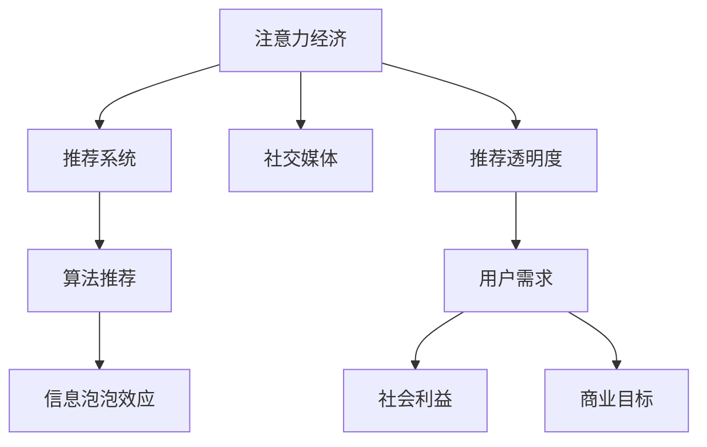

                 

## 1. 背景介绍

随着互联网技术的普及和社交媒体的兴起，人们获取信息的方式已经发生了深刻的变化。从过去的报纸、电视等传统媒介，转变为由算法推荐驱动的社交媒体平台。这种变化不仅改变了人们的消费习惯，也使得信息传播和获取变得前所未有的高效和个性化。然而，这种基于算法的“信息定制化”背后，存在诸多复杂的经济和社会因素。

### 1.1 问题的由来

社交媒体平台如Facebook、Twitter、Instagram等，通过算法推荐系统向用户推送新闻、广告、视频等内容，这些系统能够根据用户的浏览历史、点赞、评论等行为数据，动态调整推荐结果。用户每天通过这些平台接收到的信息量，远超过传统媒体所能提供的。这种基于算法的“信息定制化”，被一些学者称为“注意力经济”。

然而，这种注意力经济的背后，引发了一系列伦理、隐私和公平性问题。例如，算法推荐的精准度往往以用户的长期关注和点击率为指标，可能带来信息泡泡效应（Filter Bubble），即用户只看到自己感兴趣的内容，而忽视了其他重要的信息。此外，由于数据和算法不透明，用户对自己的信息被如何利用和传播缺乏足够的知情权和控制权。

本文将探讨注意力经济与社交媒体算法，探讨算法推荐系统的设计原则、机制及其影响，以及如何平衡用户需求、社会利益和商业目标。

## 2. 核心概念与联系

### 2.1 核心概念概述

为更好地理解注意力经济与社交媒体算法，本节将介绍几个密切相关的核心概念：

- **注意力经济（Attention Economy）**：指在信息爆炸的互联网时代，用户时间和注意力的有限性，导致信息传播和消费方式向个性化、定制化发展，以争夺用户注意力为经济竞争的核心。
- **推荐系统（Recommendation System）**：通过分析用户的历史行为和偏好，预测并推荐可能感兴趣的内容，从而提高用户满意度和平台用户留存率。
- **社交媒体（Social Media）**：以用户生成内容（UGC）为特征，通过网络社交关系，实现信息传播和互动的媒体平台。
- **算法推荐（Algorithmic Recommendation）**：基于用户行为数据和机器学习算法，自动化的内容推荐技术，是现代推荐系统的核心。
- **信息泡泡效应（Filter Bubble）**：指用户在算法推荐下，只看到自己感兴趣的内容，逐渐失去对多样性信息的接触和理解。
- **推荐透明度（Transparency）**：指用户对其推荐结果的生成机制和决策依据的知情权和理解度。

这些核心概念之间的逻辑关系可以通过以下Mermaid流程图来展示：



这个流程图展示了几者之间的相互关系：

1. 注意力经济驱动了推荐系统的产生和优化。
2. 推荐系统是社交媒体内容消费的核心机制。
3. 算法推荐依赖于用户数据和机器学习算法。
4. 信息泡泡效应可能削弱用户的认知多样性。
5. 推荐透明度关乎用户信任和平台公信力。

## 3. 核心算法原理 & 具体操作步骤
### 3.1 算法原理概述

社交媒体平台上的算法推荐系统，通常基于用户行为数据和机器学习算法，动态调整内容推荐列表。其核心目标是最大化用户参与度（如点击率、停留时间、互动量等），从而提高平台用户留存率和商业收益。

推荐算法的核心原理包括：

1. **协同过滤（Collaborative Filtering）**：通过分析用户行为数据，推荐用户可能感兴趣的内容。协同过滤可以进一步细分为基于用户的协同过滤（User-Based Collaborative Filtering）和基于物品的协同过滤（Item-Based Collaborative Filtering）。
2. **内容过滤（Content-Based Filtering）**：通过分析用户的历史行为和内容特征，推荐与用户兴趣相似的内容。
3. **混合推荐（Hybrid Recommendation）**：结合协同过滤和内容过滤的优点，综合不同维度数据，提高推荐效果。
4. **实时推荐（Real-time Recommendation）**：通过实时收集用户行为数据，动态调整推荐结果，提升推荐的相关性和时效性。
5. **深度学习推荐（Deep Learning Recommendation）**：利用深度神经网络模型，对用户和内容进行高维表示学习，提高推荐的泛化能力和效果。

### 3.2 算法步骤详解

社交媒体平台上的算法推荐系统通常包括以下几个关键步骤：

**Step 1: 数据收集与预处理**
- 收集用户行为数据，如点击、浏览、点赞、评论等。
- 对数据进行清洗和标注，去除噪音和无关数据。
- 对数据进行特征工程，提取用户和内容的代表性特征。

**Step 2: 模型训练与评估**
- 选择合适的推荐算法，如协同过滤、内容过滤、混合推荐等。
- 使用历史数据进行模型训练，调整模型参数以提高推荐效果。
- 在验证集上评估推荐模型的性能，选择最优模型。

**Step 3: 实时推荐与优化**
- 实时收集用户行为数据，动态更新推荐模型。
- 根据用户反馈和互动数据，动态调整推荐结果，提高推荐的相关性和时效性。
- 对推荐结果进行A/B测试，评估不同推荐策略的效果。

**Step 4: 用户反馈与改进**
- 收集用户对推荐结果的反馈，分析用户满意度和使用体验。
- 根据用户反馈，不断优化推荐模型和推荐策略。
- 定期进行模型更新和训练，保持推荐系统的高效性和准确性。

### 3.3 算法优缺点

基于机器学习的社交媒体算法推荐系统，具有以下优点：

1. **高效性**：通过自动化算法，快速处理大量数据，提升推荐效率。
2. **个性化**：根据用户行为数据，提供高度个性化的推荐内容。
3. **可扩展性**：适应不同规模的平台和用户群体，具有较高的可扩展性。
4. **灵活性**：可以根据用户反馈和数据变化，快速调整推荐策略。

然而，这些算法也存在一定的局限性：

1. **数据依赖性高**：推荐系统的性能高度依赖于数据质量和多样性，缺乏多样性数据可能导致推荐偏差。
2. **透明性不足**：推荐算法的决策过程通常不透明，用户难以理解和解释推荐结果。
3. **信息泡泡效应**：过度个性化的推荐可能导致信息泡泡效应，限制用户认知多样性。
4. **公平性问题**：推荐算法可能存在数据偏见和算法歧视，导致推荐不公平。

### 3.4 算法应用领域

基于机器学习的社交媒体算法推荐系统，已经在广告推荐、内容推荐、个性化推荐等多个领域得到广泛应用，具体包括：

- **广告推荐**：通过分析用户行为数据，精准推荐广告内容，提高广告点击率和转化率。
- **内容推荐**：推荐用户可能感兴趣的文章、视频、音乐等内容，提升用户使用体验。
- **个性化推荐**：根据用户偏好，推荐商品、服务、活动等，提高用户满意度和留存率。
- **新闻推荐**：推荐用户感兴趣的新闻资讯，提高新闻阅读量和互动量。
- **娱乐推荐**：推荐电影、电视剧、综艺节目等内容，提升用户娱乐体验。
- **电商推荐**：推荐用户可能感兴趣的电商商品，提高电商平台的销售转化率。

除了这些经典应用外，算法推荐还在智慧城市、智能医疗、智能交通等众多领域得到创新性应用，为各行各业带来了新的突破。

## 4. 数学模型和公式 & 详细讲解  
### 4.1 数学模型构建

本节将使用数学语言对社交媒体算法推荐系统进行更加严格的刻画。

记推荐系统为 $R:\mathcal{U} \times \mathcal{V} \rightarrow \mathcal{R}$，其中 $\mathcal{U}$ 为用户集合，$\mathcal{V}$ 为物品集合，$\mathcal{R}$ 为推荐结果集合。假设用户 $u$ 对物品 $v$ 的兴趣度为 $r_{uv}$，推荐系统输出推荐结果 $R_{uv}$。

定义推荐系统的损失函数为：

$$
\mathcal{L}(R) = \frac{1}{N}\sum_{(u,v)\in \mathcal{D}} \ell(r_{uv}, R_{uv})
$$

其中 $\mathcal{D}$ 为用户和物品的交互数据集，$\ell$ 为损失函数，通常使用均方误差或交叉熵等。

推荐系统的优化目标是最小化损失函数，即找到最优推荐策略：

$$
R^* = \mathop{\arg\min}_{R} \mathcal{L}(R)
$$

在实践中，我们通常使用基于梯度的优化算法（如SGD、Adam等）来近似求解上述最优化问题。设 $\eta$ 为学习率，则参数的更新公式为：

$$
R \leftarrow R - \eta \nabla_{R}\mathcal{L}(R)
$$

其中 $\nabla_{R}\mathcal{L}(R)$ 为损失函数对推荐策略 $R$ 的梯度，可通过反向传播算法高效计算。

### 4.2 公式推导过程

以下我们以协同过滤算法为例，推导推荐系统中最常用的用户基于协同过滤的推荐公式。

协同过滤算法通过用户之间的相似性，推断用户可能感兴趣的新物品。假设用户集合 $U$ 和物品集合 $V$ 的相似度矩阵为 $S$，则用户 $u$ 对物品 $v$ 的预测兴趣度 $r_{uv}$ 为：

$$
r_{uv} = \frac{\sum_{i \in U} S_{iu} \times r_{iv}}{\sqrt{\sum_{i \in U} S_{iu}^2}} \times r_{uv^*}
$$

其中 $S_{iu}$ 表示用户 $i$ 和用户 $u$ 之间的相似度，$r_{uv^*}$ 表示物品 $v$ 的已知兴趣度。

根据链式法则，推荐系统的损失函数对相似度矩阵 $S$ 的梯度为：

$$
\frac{\partial \mathcal{L}(R)}{\partial S_{uv}} = \sum_{(i,v)\in \mathcal{D}} (\frac{\partial \ell(r_{uv}, R_{uv})}{\partial r_{uv}} \times \frac{\partial r_{uv}}{\partial S_{uv}})
$$

其中 $\frac{\partial r_{uv}}{\partial S_{uv}}$ 可以进一步展开，利用自动微分技术完成计算。

在得到损失函数的梯度后，即可带入推荐策略的更新公式，完成推荐系统的迭代优化。重复上述过程直至收敛，最终得到适应用户偏好的最优推荐策略 $R^*$。

## 5. 项目实践：代码实例和详细解释说明
### 5.1 开发环境搭建

在进行社交媒体算法推荐系统开发前，我们需要准备好开发环境。以下是使用Python进行Scikit-learn开发的推荐系统环境配置流程：

1. 安装Anaconda：从官网下载并安装Anaconda，用于创建独立的Python环境。

2. 创建并激活虚拟环境：
```bash
conda create -n recommendation-env python=3.8 
conda activate recommendation-env
```

3. 安装Scikit-learn、Numpy、Pandas等常用库：
```bash
pip install scikit-learn numpy pandas
```

4. 安装相关推荐库：
```bash
pip install lightfm pythontabular recommender-engine
```

完成上述步骤后，即可在`recommendation-env`环境中开始推荐系统开发。

### 5.2 源代码详细实现

下面我们以协同过滤算法为例，给出使用Scikit-learn库对社交媒体推荐系统进行代码实现的完整流程。

首先，定义推荐系统模型：

```python
from lightfm import LightFM
from lightfm import callbacks
from sklearn.metrics import mean_absolute_error

# 定义协同过滤模型
model = LightFM(factors=20, verbose=True)

# 训练模型
model.fit(data, epochs=10, callbacks=[callbacks.EarlyStopping()], validation_data=valid_data)
```

然后，定义数据处理函数：

```python
from sklearn.metrics import mean_absolute_error
from lightfm.data import Dataset
import numpy as np

# 定义数据集
def create_dataset():
    # 用户数据
    users = np.array([1, 2, 3, 4, 5])
    items = np.array([1, 2, 3, 4, 5])
    user_item_matrix = np.array([[1, 1, 1, 0, 0], [1, 0, 1, 1, 0], [1, 1, 0, 1, 0], [0, 0, 0, 1, 1], [1, 0, 1, 1, 0]])
    # 创建数据集
    dataset = Dataset(user_item_matrix)
    return dataset

# 加载数据集
dataset = create_dataset()

# 划分数据集
train_data = dataset.get_train_set()
test_data = dataset.get_test_set()
valid_data = dataset.get_validation_set()
```

接着，定义模型评估函数：

```python
# 定义评估函数
def evaluate_model(model, test_data, valid_data):
    # 计算平均绝对误差
    y_pred = model.predict(test_data)
    mae = mean_absolute_error(test_data.values, y_pred)
    print("MAE on test set: ", mae)

    # 计算验证集误差
    y_pred = model.predict(valid_data)
    mae = mean_absolute_error(valid_data.values, y_pred)
    print("MAE on validation set: ", mae)
```

最后，启动模型训练并评估：

```python
# 训练模型
model.fit(train_data, epochs=10, callbacks=[callbacks.EarlyStopping()], validation_data=valid_data)

# 评估模型
evaluate_model(model, test_data, valid_data)
```

以上就是使用Scikit-learn对社交媒体推荐系统进行代码实现的完整流程。可以看到，基于Scikit-learn的推荐系统开发非常简单，开发者可以更多地关注算法优化和业务逻辑。

### 5.3 代码解读与分析

让我们再详细解读一下关键代码的实现细节：

**create_dataset函数**：
- 创建用户和物品数据，构建用户-物品矩阵。
- 使用`Dataset`类创建数据集对象，用于后续模型训练和评估。

**evaluate_model函数**：
- 使用模型预测测试集和验证集的结果。
- 计算平均绝对误差，评估模型预测精度。
- 输出评估结果。

**模型训练流程**：
- 定义协同过滤模型，设置模型参数。
- 使用训练集数据拟合模型，设置迭代轮数和早停策略。
- 在验证集上评估模型性能，输出验证集误差。
- 使用评估函数评估模型在测试集上的性能。

可以看到，Scikit-learn库为推荐系统开发提供了便捷、易用的接口，开发者可以快速实现推荐模型的训练和评估。

当然，工业级的系统实现还需考虑更多因素，如数据预处理、模型部署、超参数优化等。但核心的推荐系统开发流程基本与此类似。

## 6. 实际应用场景
### 6.1 电商推荐系统

社交媒体算法推荐系统在电商推荐场景中的应用非常广泛。传统电商推荐系统多依赖用户历史行为数据进行推荐，而社交媒体算法推荐系统则能够从更广泛的社交关系和用户行为中获取信息，提升推荐的个性化和多样性。

具体而言，电商推荐系统可以收集用户浏览、点击、购买、收藏等行为数据，通过社交媒体算法推荐系统动态调整推荐结果。例如，通过分析用户的社交关系和好友推荐，可以引入更多的用户兴趣和购物意图。此外，还可以使用图像识别等技术，将用户浏览的商品图片与社交媒体上的热门图片进行关联，提高推荐的视觉效果和多样性。

### 6.2 内容推荐平台

内容推荐平台如Netflix、YouTube等，通过社交媒体算法推荐系统为用户提供个性化的内容推荐。在视频推荐中，社交媒体算法推荐系统可以分析用户的历史观看数据、社交关系和好友推荐，动态调整视频推荐列表，提高用户的观看体验和平台留存率。例如，通过分析用户的观看历史和兴趣标签，推荐相关主题的视频，同时还可以通过社交关系推荐热门视频，增加视频的多样性和新鲜感。

### 6.3 智能医疗推荐

智能医疗推荐系统通过社交媒体算法推荐系统，为用户提供个性化的医疗建议和治疗方案。在医疗推荐中，算法推荐系统可以分析用户的病历数据、社交关系和医疗专业人士的推荐，动态调整医疗推荐结果。例如，通过分析用户的健康数据和社交网络中的健康信息，推荐合适的医疗服务，同时还可以根据用户的医疗需求和兴趣，推荐相关的医疗知识资源。

### 6.4 未来应用展望

随着社交媒体算法推荐系统的不断发展，其在更多领域的应用前景也将愈加广阔。未来，推荐系统将融合更多多模态数据（如视频、音频、图像等），提升推荐效果和用户体验。同时，推荐系统将更加注重用户隐私和数据安全，增强算法透明度和可解释性，提升用户的信任度。

此外，推荐系统还将结合智能问答、自然语言处理等前沿技术，提升推荐的互动性和智能性。例如，通过智能问答系统与用户进行互动，获取用户的实时反馈，动态调整推荐结果，提高推荐的实时性和精准度。

## 7. 工具和资源推荐
### 7.1 学习资源推荐

为了帮助开发者系统掌握社交媒体算法推荐系统的理论基础和实践技巧，这里推荐一些优质的学习资源：

1. **《推荐系统实战》**：李航、杨勇著，全面介绍了推荐系统的理论和实践，适合初学者和进阶开发者。
2. **Coursera推荐系统课程**：由斯坦福大学开设，涵盖推荐系统的基础概念、算法和应用，适合系统学习和实践。
3. **Kaggle推荐系统竞赛**：通过实际数据集和竞赛任务，帮助开发者深入理解推荐系统设计和优化。
4. **Scikit-learn官方文档**：详细介绍了Scikit-learn库的使用方法和推荐系统接口，是推荐系统开发的重要参考。
5. **PyTorch官方文档**：介绍了基于深度学习算法的推荐系统开发方法，适合深度学习背景的开发者。

通过对这些资源的学习实践，相信你一定能够快速掌握社交媒体算法推荐系统的精髓，并用于解决实际的推荐问题。

### 7.2 开发工具推荐

高效的开发离不开优秀的工具支持。以下是几款用于社交媒体算法推荐系统开发的常用工具：

1. Scikit-learn：基于Python的机器学习库，简单易用，适合快速原型开发。
2. TensorFlow、PyTorch：主流深度学习框架，提供高效的计算图和自动微分功能，适合复杂模型和算法的实现。
3. Apache Spark：分布式计算框架，支持大规模数据处理，适合推荐系统的分布式训练。
4. Elasticsearch：分布式搜索和分析引擎，适合大规模推荐数据的管理和查询。
5. Apache Hadoop：分布式存储和计算平台，适合大数据推荐系统的部署和扩展。

合理利用这些工具，可以显著提升社交媒体算法推荐系统的开发效率，加快创新迭代的步伐。

### 7.3 相关论文推荐

社交媒体算法推荐系统的发展离不开学界的持续研究。以下是几篇奠基性的相关论文，推荐阅读：

1. **《协同过滤推荐算法》**：由Adams和Bruno于2001年提出，是推荐系统中的经典算法，广泛用于电商、视频、音乐等推荐场景。
2. **《深度学习推荐系统》**：由Jamali和Ning于2018年提出，通过深度神经网络实现个性化推荐，提升了推荐模型的泛化能力和效果。
3. **《基于社交网络的推荐系统》**：由Li和Wang于2017年提出，结合社交网络数据，提升推荐系统的多样性和个性化。
4. **《推荐系统的公平性研究》**：由Bie和Li于2017年提出，探讨推荐系统中的数据偏见和算法歧视问题，提出公平性评估指标和方法。
5. **《推荐系统的透明性和可解释性》**：由Tao和Tao于2018年提出，探讨推荐系统的透明性和可解释性问题，提出增强用户理解和信任的方法。

这些论文代表了大数据推荐系统的发展脉络。通过学习这些前沿成果，可以帮助研究者把握学科前进方向，激发更多的创新灵感。

## 8. 总结：未来发展趋势与挑战
### 8.1 总结

本文对社交媒体算法推荐系统的核心概念、原理和操作步骤进行了全面系统的介绍。首先阐述了推荐系统、社交媒体和算法推荐等核心概念，明确了推荐系统在注意力经济中的重要地位。其次，从原理到实践，详细讲解了推荐系统的数学模型和优化算法，给出了推荐系统开发的全流程代码实例。同时，本文还广泛探讨了推荐系统在电商、内容推荐、医疗等多个行业领域的应用前景，展示了推荐系统的大规模应用潜力。此外，本文精选了推荐系统的各类学习资源，力求为开发者提供全方位的技术指引。

通过本文的系统梳理，可以看到，社交媒体算法推荐系统正在成为互联网应用的重要范式，极大地拓展了推荐系统的应用边界，为信息传播和消费方式带来了深刻变革。未来，伴随推荐系统的不断发展，其在更多领域的应用前景也将愈加广阔。

### 8.2 未来发展趋势

展望未来，社交媒体算法推荐系统将呈现以下几个发展趋势：

1. **多模态推荐**：结合视频、音频、图像等多模态数据，提升推荐的视觉和情感效果。
2. **实时推荐**：结合物联网、传感器等数据源，实现动态和实时的推荐效果。
3. **跨域推荐**：通过跨平台、跨媒体的推荐，提高推荐的多样性和精准度。
4. **深度学习推荐**：利用深度神经网络模型，提高推荐模型的泛化能力和效果。
5. **公平性推荐**：通过算法优化和数据处理，提高推荐的公平性和透明性。
6. **个性化推荐**：通过个性化推荐技术，提升用户体验和满意度。

以上趋势凸显了社交媒体算法推荐系统的广阔前景。这些方向的探索发展，必将进一步提升推荐系统的性能和应用范围，为信息传播和消费方式带来新的变革。

### 8.3 面临的挑战

尽管社交媒体算法推荐系统已经取得了瞩目成就，但在迈向更加智能化、普适化应用的过程中，它仍面临着诸多挑战：

1. **数据隐私和安全**：推荐系统依赖用户数据，数据隐私和安全问题突出。如何在保护用户隐私的同时，提供高效的推荐服务，将是重要的挑战。
2. **算法透明性和可解释性**：推荐算法的决策过程不透明，用户难以理解和解释推荐结果。如何在保证推荐效果的同时，增强算法透明性和可解释性，将是重要的课题。
3. **推荐多样性和公平性**：推荐算法可能存在数据偏见和算法歧视，导致推荐不公平。如何在推荐过程中避免偏见，提高多样性和公平性，将是重要的研究方向。
4. **计算效率和资源优化**：推荐系统需要处理大规模数据和模型，计算效率和资源优化问题突出。如何在保证推荐效果的同时，优化计算资源和系统性能，将是重要的挑战。
5. **用户认知和行为多样性**：用户认知和行为的多样性可能带来推荐系统的挑战。如何在满足用户需求的同时，提升推荐的适应性和多样性，将是重要的研究方向。

### 8.4 研究展望

面对社交媒体算法推荐系统所面临的挑战，未来的研究需要在以下几个方面寻求新的突破：

1. **数据隐私保护**：研究数据隐私保护技术，确保用户数据的安全和隐私。
2. **算法透明性**：通过增强推荐算法的透明性和可解释性，提升用户信任度和满意度。
3. **公平性算法**：研究公平性推荐算法，避免数据偏见和算法歧视，提升推荐的多样性和公平性。
4. **计算效率优化**：研究高效的推荐算法和计算框架，优化推荐系统的计算效率和资源利用。
5. **多样性增强**：研究多样化推荐技术，提升推荐系统的适应性和多样性。

这些研究方向的探索，必将引领社交媒体算法推荐系统迈向更高的台阶，为信息传播和消费方式带来新的突破。

## 9. 附录：常见问题与解答

**Q1：推荐系统是否适用于所有应用场景？**

A: 推荐系统虽然在很多应用场景中都有良好的效果，但并非适用于所有场景。例如，对于一些即时决策的应用场景，如股票交易、医疗诊断等，推荐系统可能无法提供实时的决策支持。此外，对于一些用户行为可解释性要求较高的场景，推荐系统也存在一定的局限性。因此，开发者需要根据具体应用场景，选择合适的推荐技术。

**Q2：如何优化推荐系统的算法性能？**

A: 推荐系统的算法性能优化可以从多个方面入手：
1. 特征工程：选择合适的特征，提升模型的泛化能力和效果。
2. 模型选择：选择适合任务的推荐算法，如协同过滤、内容过滤、混合推荐等。
3. 参数调优：通过超参数优化和模型调参，提高模型的性能和泛化能力。
4. 数据清洗：对数据进行清洗和标注，去除噪音和无关数据。
5. 模型融合：结合多种推荐模型，综合不同模型的优势，提高推荐效果。
6. 实时更新：根据用户反馈和数据变化，动态调整推荐模型，提高推荐的实时性和精准度。

**Q3：推荐系统如何平衡用户需求和商业目标？**

A: 推荐系统平衡用户需求和商业目标的方法主要有：
1. 个性化推荐：根据用户兴趣和行为，提供个性化的推荐内容，提升用户满意度和留存率。
2. 多样性推荐：结合用户兴趣和多样化内容，提高推荐的多样性和新鲜感，增加用户粘性。
3. 商业转化：通过推荐广告和营销活动，提高平台商业收益和用户转化率。
4. 数据驱动：结合用户反馈和行为数据，动态调整推荐策略，平衡用户需求和商业目标。

通过这些方法，可以在保证推荐系统性能的同时，提升用户满意度和平台收益。

**Q4：推荐系统如何避免推荐信息泡泡效应？**

A: 推荐系统避免信息泡泡效应的方法主要有：
1. 多样化推荐：结合用户兴趣和多样化内容，提高推荐的多样性和新鲜感。
2. 跨领域推荐：结合不同领域的推荐内容，扩大用户的认知范围。
3. 主动推荐：通过主动推荐机制，引导用户接触不同领域的内容，增加认知多样性。
4. 用户交互：通过用户互动和反馈，动态调整推荐策略，提升推荐的多样性。

通过这些方法，可以在保证推荐系统性能的同时，避免信息泡泡效应，提升用户的认知多样性。

**Q5：推荐系统如何保障用户隐私和数据安全？**

A: 推荐系统保障用户隐私和数据安全的方法主要有：
1. 数据匿名化：对用户数据进行匿名化处理，保护用户隐私。
2. 数据加密：对用户数据进行加密处理，防止数据泄露和攻击。
3. 访问控制：对用户数据进行访问控制，限制非法访问和滥用。
4. 隐私保护算法：研究隐私保护算法，保护用户数据的安全和隐私。
5. 透明性：增强推荐算法的透明性和可解释性，提升用户信任度。

通过这些方法，可以在保护用户隐私的同时，提供高效的推荐服务。

**Q6：推荐系统如何实现跨平台推荐？**

A: 推荐系统实现跨平台推荐的方法主要有：
1. 数据共享：跨平台共享用户数据，实现跨平台的推荐。
2. 用户画像：构建跨平台的统一用户画像，提高推荐的连贯性和一致性。
3. 算法优化：优化跨平台推荐算法，提升推荐的泛化能力和效果。
4. 数据融合：融合不同平台的推荐数据，实现跨平台的推荐。

通过这些方法，可以在跨平台场景下提供高质量的推荐服务。

---

作者：禅与计算机程序设计艺术 / Zen and the Art of Computer Programming

