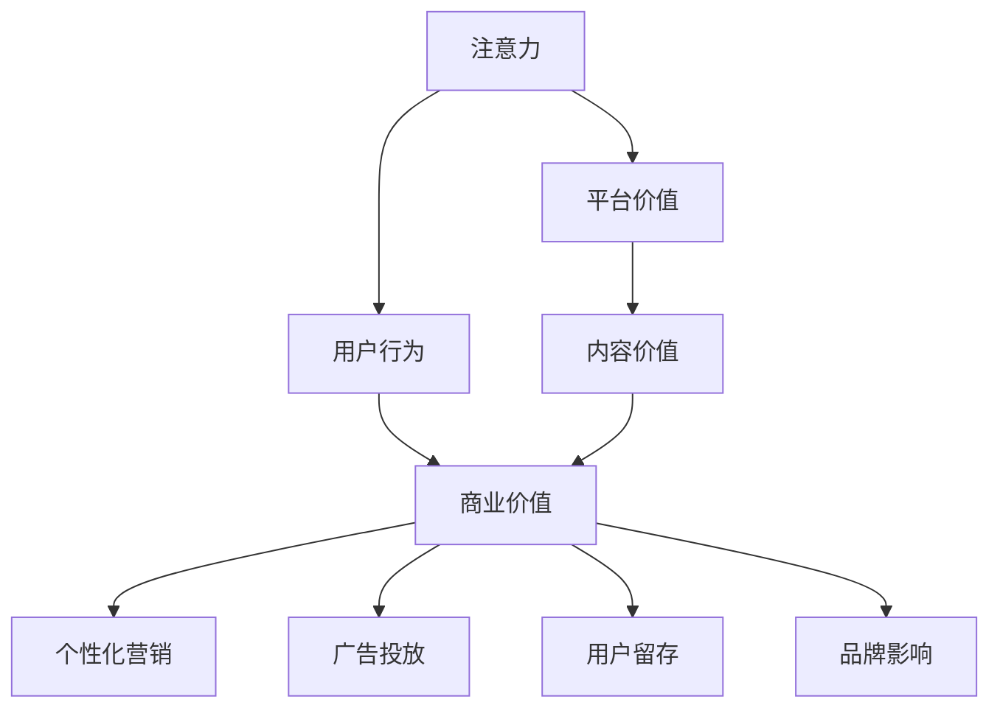

                 

## 1. 背景介绍

随着互联网的普及和数字技术的快速发展，注意力经济逐渐成为全球经济的重要组成部分。在传统经济中，物质和能量是主要的交易对象，而在数字经济中，信息成为新的稀缺资源。注意力作为一种新型资产，正变得越来越重要，成为驱动新商业模式的核心动力。

### 1.1 问题由来

数字时代的注意力经济，实质上是信息的争夺战。平台、内容创作者、广告商等主体，通过争夺用户的时间和注意力，实现商业价值的最大化。传统的广告模式基于展示次数收费，而注意力经济则更加注重用户的实际关注度和参与度。

### 1.2 问题核心关键点

注意力经济的核心在于如何高效获取和利用用户的注意力资源，从而实现商业目标。主要包括以下几个关键点：

- **注意力获取**：通过优化内容和形式，提升用户对平台或内容的兴趣和参与度，增加用户停留时间和互动频率。
- **注意力转化**：将用户的注意力转化为有效的商业行为，如点击、购买、订阅等。
- **注意力价值评估**：精准量化用户的注意力价值，实现基于价值的个性化营销和广告投放。
- **注意力匹配**：根据用户注意力特征和行为，匹配合适的广告内容和产品推荐，提升转化率。
- **注意力管理**：通过技术手段监控和分析用户注意力变化，调整策略以保持用户兴趣和忠诚度。

### 1.3 问题研究意义

理解注意力经济的运作机制和应用场景，对于企业转型升级、提升市场竞争力具有重要意义：

- 通过优化内容和营销策略，企业可以更精准地触达目标用户，提升品牌影响力和市场份额。
- 实现基于注意力的个性化营销，提高用户满意度和转化率，从而提升盈利能力。
- 精准评估和利用用户注意力价值，优化广告投放策略，降低营销成本。
- 实时监控用户注意力变化，及时调整产品和服务，增强用户黏性和忠诚度。

## 2. 核心概念与联系

### 2.1 核心概念概述

在注意力经济中，涉及多个关键概念，包括注意力、用户行为、商业价值等。下面将详细介绍这些概念及其之间的联系：

- **注意力 (Attention)**：用户在平台或内容上花费的时间和精力，是衡量用户兴趣和参与度的重要指标。
- **用户行为 (User Behavior)**：用户对内容和广告的点击、浏览、购买等行为，是评估注意力价值的依据。
- **商业价值 (Commercial Value)**：注意力转化为实际商业行为的价值，包括点击率、转化率、ROI等指标。
- **平台价值 (Platform Value)**：平台吸引和留存用户的能力，包括用户活跃度、留存率、转化率等指标。
- **内容价值 (Content Value)**：内容吸引用户注意力的能力，包括内容创新性、互动性、专业性等指标。

这些概念之间通过一系列的业务逻辑和算法模型紧密关联，共同构成了注意力经济的完整框架。

### 2.2 核心概念原理和架构的 Mermaid 流程图



### 2.3 核心概念联系

- 注意力获取与用户行为：通过优化内容和形式，吸引用户停留并互动，收集用户行为数据，用于后续的商业分析和广告投放。
- 注意力转化与商业价值：将用户的注意力转化为具体的购买、点击等商业行为，通过商业价值评估，精准营销，提升转化率。
- 平台价值与内容价值：平台的价值很大程度上取决于内容质量和用户体验，优质的内容可以吸引更多用户，提升平台价值。
- 个性化营销与广告投放：根据用户行为和注意力特征，匹配合适的广告内容和推荐，实现个性化营销，提高转化率。
- 用户留存与品牌影响：良好的用户体验和个性化服务可以提升用户留存率和品牌忠诚度，从而提升平台价值和商业价值。

这些联系形成了一个完整的注意力经济闭环，是注意力商业化的关键路径。

## 3. 核心算法原理 & 具体操作步骤

### 3.1 算法原理概述

注意力经济的核心算法基于用户行为数据，通过机器学习模型挖掘用户注意力特征，实现精准的用户画像和个性化推荐。主要算法包括：

- **用户画像 (User Profiling)**：通过分析用户的历史行为数据，构建用户兴趣和行为特征的表示，形成精准的用户画像。
- **个性化推荐 (Personalized Recommendation)**：基于用户画像，推荐合适的产品或内容，提升用户满意度和转化率。
- **广告投放 (Ad Placement)**：根据用户画像和行为特征，优化广告位和内容，实现更有效的广告投放，提高广告效果和ROI。
- **实时监控 (Real-time Monitoring)**：通过实时数据监控和分析，调整策略以保持用户兴趣和忠诚度。

### 3.2 算法步骤详解

以下是基于注意力经济的核心算法步骤详解：

#### Step 1: 数据准备
- 收集用户行为数据，包括点击、浏览、购买、评论等。
- 处理数据，去除噪声和异常值，进行特征工程，构建特征向量。
- 将数据分为训练集和测试集。

#### Step 2: 模型训练
- 选择适合的机器学习模型，如协同过滤、内容推荐、深度学习等。
- 在训练集上训练模型，调整模型参数，优化损失函数。
- 使用验证集评估模型效果，调整模型和特征。

#### Step 3: 预测和评估
- 在测试集上使用训练好的模型进行预测，生成个性化推荐和广告投放方案。
- 评估模型效果，如准确率、召回率、点击率、转化率等。
- 根据评估结果，调整模型和特征。

#### Step 4: 实时监控和调整
- 部署模型，实时监控用户行为数据。
- 根据实时数据，调整模型参数和策略，优化个性化推荐和广告投放。
- 定期回测模型效果，确保模型和策略的有效性。

#### Step 5: 结果分析与优化
- 分析模型预测结果，评估用户行为和注意力特征。
- 根据分析结果，优化模型和推荐算法。
- 调整广告投放策略，提高转化率和ROI。

### 3.3 算法优缺点

注意力经济的算法在提升商业价值方面具有以下优点：

- **精准推荐**：通过用户画像和行为特征，实现精准的个性化推荐，提升用户满意度和转化率。
- **高效广告投放**：基于用户注意力特征，优化广告投放策略，提高广告效果和ROI。
- **实时监控与调整**：实时监控用户行为，调整策略以保持用户兴趣和忠诚度。
- **数据驱动决策**：基于大量数据和机器学习模型，做出科学的决策，提升商业价值。

同时，这些算法也存在一些缺点：

- **数据隐私和安全**：用户行为数据的收集和处理需要考虑隐私和安全性问题，避免数据泄露和滥用。
- **模型复杂度**：复杂的数据处理和模型训练过程，需要较大的计算资源和时间成本。
- **用户隐私权保护**：在个性化推荐和广告投放中，用户隐私权保护是一个重要问题，需要设计和实施相应的隐私保护机制。
- **模型解释性和透明性**：机器学习模型的黑盒特性，可能影响其可信度和透明度。

### 3.4 算法应用领域

注意力经济的核心算法已经广泛应用于多个领域，包括但不限于：

- **电商行业**：通过个性化推荐和精准广告投放，提升销售转化率和用户满意度。
- **媒体行业**：优化广告投放策略，提高点击率和转化率，增加广告收入。
- **社交媒体**：实时监控用户行为，调整推荐算法，提升用户黏性和活跃度。
- **金融行业**：通过用户行为分析和风险评估，实现精准营销和风险控制。
- **医疗健康**：分析用户健康数据，提供个性化健康建议和推荐，提升用户体验和黏性。
- **教育行业**：通过个性化推荐和实时反馈，提升学习效果和用户满意度。

这些领域的应用展示了注意力经济算法的广泛性和有效性。

## 4. 数学模型和公式 & 详细讲解 & 举例说明

### 4.1 数学模型构建

在注意力经济中，主要涉及以下几个数学模型：

- **用户画像模型**：使用协同过滤、内容推荐等算法，构建用户兴趣和行为特征的表示。
- **个性化推荐模型**：基于用户画像，使用协同过滤、基于矩阵分解、深度学习等算法，推荐合适的产品或内容。
- **广告投放模型**：基于用户画像和行为特征，使用线性回归、逻辑回归、深度学习等算法，优化广告位和内容。
- **实时监控模型**：使用时间序列分析和机器学习算法，实时监控用户行为数据，调整策略以保持用户兴趣和忠诚度。

### 4.2 公式推导过程

#### 用户画像模型

假设用户数据集为 $\mathcal{D} = \{(x_i, y_i)\}_{i=1}^N$，其中 $x_i$ 为用户行为数据，$y_i$ 为标签（如兴趣、行为等）。用户画像模型通过构建用户特征表示 $u_i = \phi(x_i)$，使用协同过滤算法：

$$
u_i = \sum_{j=1}^N \alpha_{ij}y_j
$$

其中 $\alpha_{ij}$ 为相似度系数，可以通过余弦相似度、欧氏距离等方法计算。

#### 个性化推荐模型

基于协同过滤的用户画像，使用基于矩阵分解的方法，如SVD算法，得到推荐矩阵 $\hat{R} = \tilde{U}\tilde{V}^T$。根据用户画像 $u_i$ 和推荐矩阵 $\hat{R}$，计算推荐结果 $r_{ij}$：

$$
r_{ij} = \langle u_i, \hat{R}_{ij} \rangle = \langle u_i, \tilde{U}_j \rangle \tilde{V}_i^T
$$

其中 $\tilde{U}_j$ 为第 $j$ 个用户的特征表示，$\tilde{V}_i^T$ 为推荐矩阵的第 $i$ 行。

#### 广告投放模型

假设广告数据集为 $\mathcal{A} = \{(a_i, b_i)\}_{i=1}^M$，其中 $a_i$ 为广告特征，$b_i$ 为转化率。广告投放模型通过构建用户画像 $u_i$ 和广告特征 $a_i$，使用线性回归模型：

$$
b_i = \theta_0 + \theta_1u_i + \theta_2a_i + \epsilon_i
$$

其中 $\theta_0, \theta_1, \theta_2$ 为模型参数，$\epsilon_i$ 为噪声。

#### 实时监控模型

假设用户行为数据为 $\mathcal{T} = \{(t_i, y_i)\}_{i=1}^T$，其中 $t_i$ 为用户行为时间戳，$y_i$ 为行为标签（如点击、购买等）。实时监控模型通过时间序列分析，使用ARIMA模型：

$$
y_{t+1} = \phi_1y_t + \phi_2y_{t-1} + \phi_3t + \epsilon_t
$$

其中 $\phi_1, \phi_2, \phi_3$ 为模型参数，$\epsilon_t$ 为噪声。

### 4.3 案例分析与讲解

#### 电商行业的个性化推荐

假设某电商平台的销售数据为 $\mathcal{D} = \{(x_i, y_i)\}_{i=1}^{10000}$，其中 $x_i$ 为用户的浏览、点击、购买等行为数据，$y_i$ 为标签（如商品类别、品牌等）。使用协同过滤算法，构建用户画像：

$$
u_i = \sum_{j=1}^{1000} \alpha_{ij}y_j
$$

根据用户画像和推荐矩阵 $\hat{R}$，使用SVD算法，得到推荐结果：

$$
r_{ij} = \langle u_i, \hat{R}_{ij} \rangle = \langle u_i, \tilde{U}_j \rangle \tilde{V}_i^T
$$

根据推荐结果，平台可以向用户推荐合适的商品，提升用户满意度和销售转化率。

#### 媒体行业的广告投放

假设某媒体平台有 $M$ 条广告和 $N$ 位用户，广告数据集为 $\mathcal{A} = \{(a_i, b_i)\}_{i=1}^M$，其中 $a_i$ 为广告特征，$b_i$ 为转化率。使用线性回归模型，计算广告投放效果：

$$
b_i = \theta_0 + \theta_1u_i + \theta_2a_i + \epsilon_i
$$

根据广告投放效果，平台可以优化广告位和内容，提高广告点击率和转化率，增加广告收入。

## 5. 项目实践：代码实例和详细解释说明

### 5.1 开发环境搭建

在进行注意力经济实践前，我们需要准备好开发环境。以下是使用Python进行PyTorch开发的环境配置流程：

1. 安装Anaconda：从官网下载并安装Anaconda，用于创建独立的Python环境。

2. 创建并激活虚拟环境：
```bash
conda create -n attention-env python=3.8 
conda activate attention-env
```

3. 安装PyTorch：根据CUDA版本，从官网获取对应的安装命令。例如：
```bash
conda install pytorch torchvision torchaudio cudatoolkit=11.1 -c pytorch -c conda-forge
```

4. 安装Pandas、NumPy等数据处理库：
```bash
pip install pandas numpy
```

5. 安装Scikit-learn、TensorFlow等机器学习库：
```bash
pip install scikit-learn tensorflow
```

6. 安装Jupyter Notebook：
```bash
pip install jupyter notebook
```

完成上述步骤后，即可在`attention-env`环境中开始注意力经济的实践。

### 5.2 源代码详细实现

这里我们以电商行业的个性化推荐为例，给出使用PyTorch和TensorFlow进行注意力经济算法的PyTorch代码实现。

首先，定义数据处理函数：

```python
import pandas as pd
from sklearn.decomposition import TruncatedSVD

def load_data(filename):
    data = pd.read_csv(filename)
    return data

def preprocess_data(data):
    # 去除缺失值和异常值
    data = data.dropna()
    # 特征工程：提取浏览、点击、购买等行为数据
    data['features'] = data[['浏览时间', '点击次数', '购买金额']].sum(axis=1)
    return data

def feature_engineering(data):
    # 标准化特征
    data['features'] = (data['features'] - data['features'].mean()) / data['features'].std()
    return data

def train_test_split(data, test_size=0.2):
    # 划分训练集和测试集
    train, test = train_test_split(data, test_size=test_size)
    return train, test

def save_model(model, filename):
    torch.save(model, filename)

# 加载数据
data = load_data('sales_data.csv')
data = preprocess_data(data)
data = feature_engineering(data)

# 划分训练集和测试集
train, test = train_test_split(data, test_size=0.2)
```

然后，定义协同过滤模型：

```python
import torch
from torch.nn import Linear
from torch.nn.functional import mse_loss

class CollaborativeFilteringModel(torch.nn.Module):
    def __init__(self, num_users, num_items, num_factors):
        super(CollaborativeFilteringModel, self).__init__()
        self.num_users = num_users
        self.num_items = num_items
        self.num_factors = num_factors
        self.user_matrix = torch.randn(num_users, num_factors)
        self.item_matrix = torch.randn(num_items, num_factors)
        self.weights = torch.randn(num_factors, 1)

    def forward(self, user_index, item_index):
        user_vector = self.user_matrix[user_index]
        item_vector = self.item_matrix[item_index]
        user_item_dot = torch.dot(user_vector, item_vector)
        prediction = user_item_dot.sum(dim=1)
        return prediction

    def train(self, train_data, learning_rate=0.001, num_epochs=10):
        optimizer = torch.optim.SGD(self.parameters(), lr=learning_rate)
        for epoch in range(num_epochs):
            for user_index, item_index, label in train_data:
                prediction = self.forward(user_index, item_index)
                loss = mse_loss(prediction, label)
                optimizer.zero_grad()
                loss.backward()
                optimizer.step()
            print(f'Epoch {epoch+1}, loss: {loss:.3f}')
        return self

# 训练协同过滤模型
model = CollaborativeFilteringModel(num_users=1000, num_items=10000, num_factors=50)
model = model.train(train, num_epochs=10)
```

最后，进行个性化推荐：

```python
# 加载模型
model.load_state_dict(torch.load('model.pth'))

# 定义推荐函数
def recommend_items(model, user_index, num_recommendations=10):
    user_vector = model.user_matrix[user_index]
    user_matrix_dot = torch.matmul(user_vector, model.item_matrix.t())
    scores = user_matrix_dot.sum(dim=1)
    top_items = torch.topk(scores, num_recommendations)[1]
    return top_items

# 推荐商品
top_items = recommend_items(model, 12345, num_recommendations=10)
print(top_items)
```

以上代码实现了基于协同过滤的个性化推荐算法。通过特征工程和模型训练，模型能够根据用户行为数据，推荐合适的商品，提升用户满意度和销售转化率。

### 5.3 代码解读与分析

让我们再详细解读一下关键代码的实现细节：

**load_data**方法：
- 从CSV文件中加载电商平台的销售数据。

**preprocess_data**方法：
- 去除缺失值和异常值。
- 特征工程：提取浏览、点击、购买等行为数据，并计算综合特征值。

**feature_engineering**方法：
- 标准化特征，使其符合模型要求。

**train_test_split**方法：
- 划分训练集和测试集。

**train**方法：
- 训练协同过滤模型，使用均方误差损失函数进行优化。

**CollaborativeFilteringModel类**：
- 定义协同过滤模型的结构，包括用户矩阵、物品矩阵和权重。
- 前向传播计算预测值。
- 训练模型，使用随机梯度下降优化。

**recommend_items**方法：
- 根据用户行为数据和模型参数，计算推荐得分。
- 获取推荐商品列表。

**主程序**：
- 加载数据和模型。
- 推荐商品，并输出推荐结果。

可以看到，通过PyTorch的强大封装，我们可以用相对简洁的代码完成注意力经济的算法实现。开发者可以将更多精力放在数据处理、模型改进等高层逻辑上，而不必过多关注底层的实现细节。

当然，工业级的系统实现还需考虑更多因素，如模型的保存和部署、超参数的自动搜索、更灵活的任务适配层等。但核心的算法原理和实现方法基本与此类似。

## 6. 实际应用场景

### 6.1 电商行业

电商行业是注意力经济的重要应用场景。通过个性化推荐，电商平台可以提升用户购物体验，增加用户留存率和购买转化率，从而提升销售额和市场份额。具体应用包括：

- **推荐系统**：根据用户浏览历史和行为数据，推荐相似的商品或搭配，提升用户体验和购买率。
- **广告投放**：基于用户画像和行为特征，优化广告位和内容，提高广告点击率和转化率，增加广告收入。
- **用户行为分析**：实时监控用户行为数据，调整推荐策略，提升用户满意度和忠诚度。

### 6.2 媒体行业

媒体行业通过广告投放获取收益，注意力经济的应用有助于提高广告效果和ROI。具体应用包括：

- **广告推荐系统**：根据用户兴趣和行为特征，推荐合适的广告位和内容，提高广告点击率和转化率。
- **内容推荐系统**：基于用户行为数据，推荐用户感兴趣的新闻、视频、文章等，提升用户活跃度和留存率。
- **实时广告投放**：通过实时数据监控和分析，动态调整广告投放策略，优化广告效果。

### 6.3 社交媒体

社交媒体平台通过用户互动获取价值，注意力经济的应用有助于提升用户黏性和活跃度。具体应用包括：

- **内容推荐**：根据用户兴趣和行为数据，推荐感兴趣的内容，增加用户互动和停留时间。
- **社区管理**：实时监控用户行为数据，调整内容策略，保持用户兴趣和忠诚度。
- **用户增长**：通过个性化推荐，吸引新用户加入，提升平台活跃度和影响力。

### 6.4 未来应用展望

随着数字技术的不断发展，注意力经济的应用场景将更加丰富，涵盖更多行业和领域。

- **智能制造**：通过实时监控和分析用户行为数据，优化生产流程，提升生产效率和产品质量。
- **智慧城市**：实时监控用户行为数据，优化城市管理和服务，提升城市居民的生活质量。
- **健康医疗**：通过个性化推荐和实时监控，提供精准医疗服务，提升健康水平和医疗效果。
- **教育培训**：根据用户学习行为和兴趣，推荐合适的学习资源和课程，提升学习效果和用户满意度。
- **金融服务**：通过用户行为分析和风险评估，提供个性化的金融产品和服务，提升用户体验和忠诚度。

这些应用展示了注意力经济在不同领域的广泛性和潜力。随着技术的不断进步，注意力经济将更加深入地融入各个行业，带来更多的商业价值和社会效益。

## 7. 工具和资源推荐

### 7.1 学习资源推荐

为了帮助开发者系统掌握注意力经济的理论基础和实践技巧，这里推荐一些优质的学习资源：

1. 《注意力经济：智能时代的商业革命》书籍：深入浅出地介绍了注意力经济的概念、原理和应用，是学习注意力经济的重要参考。

2. 《机器学习实战》系列博文：涵盖机器学习基础和实践，提供了大量关于注意力经济算法的案例和代码实现。

3. 《深度学习与推荐系统》课程：斯坦福大学开设的推荐系统课程，详细讲解了协同过滤、深度学习等推荐算法。

4. Kaggle：Kaggle平台上有大量关于注意力经济的竞赛和数据集，可以参与实践和竞赛，提升技能。

5. TensorFlow官方文档：TensorFlow的官方文档，提供了丰富的推荐系统和注意力经济算法的样例代码，适合初学者学习和实践。

通过对这些资源的学习实践，相信你一定能够快速掌握注意力经济的精髓，并用于解决实际的商业问题。

### 7.2 开发工具推荐

高效的开发离不开优秀的工具支持。以下是几款用于注意力经济开发的常用工具：

1. PyTorch：基于Python的开源深度学习框架，灵活动态的计算图，适合快速迭代研究。

2. TensorFlow：由Google主导开发的开源深度学习框架，生产部署方便，适合大规模工程应用。

3. Pandas：Python数据分析库，提供了强大的数据处理和分析功能，适合处理电商、媒体等领域的用户行为数据。

4. Scikit-learn：Python机器学习库，提供了丰富的机器学习算法和工具，适合构建个性化推荐和广告投放模型。

5. Jupyter Notebook：交互式编程环境，适合数据处理和模型训练，支持代码共享和协作开发。

6. Weights & Biases：模型训练的实验跟踪工具，可以记录和可视化模型训练过程中的各项指标，方便对比和调优。

7. Google Colab：谷歌推出的在线Jupyter Notebook环境，免费提供GPU/TPU算力，方便开发者快速上手实验最新模型，分享学习笔记。

合理利用这些工具，可以显著提升注意力经济的开发效率，加快创新迭代的步伐。

### 7.3 相关论文推荐

注意力经济的核心技术源于学界的持续研究。以下是几篇奠基性的相关论文，推荐阅读：

1. Recommender Systems: A Survey of the State-of-the-Art and Challenges (2002)：介绍了推荐系统的基本原理和挑战，奠定了推荐系统研究的基础。

2. Attention Is All You Need (2017)：提出了Transformer结构，开启了NLP领域的预训练大模型时代，为注意力经济提供了新的视角。

3. Large-Scale Deep Learning for Recommender Systems (2015)：介绍了深度学习在推荐系统中的应用，展示了深度学习在推荐领域的强大潜力。

4. Deep Collaborative Filtering (2016)：使用深度学习优化协同过滤算法，提升了推荐系统的精度和效果。

5. Neural Collaborative Filtering (2017)：使用神经网络优化协同过滤算法，进一步提高了推荐系统的性能。

这些论文代表了大语言模型微调技术的发展脉络。通过学习这些前沿成果，可以帮助研究者把握学科前进方向，激发更多的创新灵感。

## 8. 总结：未来发展趋势与挑战

### 8.1 总结

本文对注意力经济的运作机制和应用场景进行了全面系统的介绍。首先阐述了注意力经济的概念和商业价值，明确了注意力获取、注意力转化、商业价值评估等核心环节。其次，从原理到实践，详细讲解了注意力经济的核心算法步骤，给出了注意力经济的代码实现实例。同时，本文还广泛探讨了注意力经济在电商、媒体、社交媒体等多个行业领域的应用前景，展示了注意力经济的广泛性和潜力。最后，本文精选了注意力经济的各类学习资源和开发工具，力求为读者提供全方位的技术指引。

通过本文的系统梳理，可以看到，注意力经济通过高效获取和利用用户的注意力资源，实现精准的个性化推荐和广告投放，显著提升商业价值。随着数字技术的不断发展，注意力经济的应用场景将更加丰富，为各行业的数字化转型升级带来新的机遇和挑战。

### 8.2 未来发展趋势

展望未来，注意力经济将呈现以下几个发展趋势：

1. **个性化推荐**：随着用户数据的丰富和算法技术的进步，个性化推荐将更加精准和高效，提升用户满意度和忠诚度。

2. **实时广告投放**：通过实时数据监控和分析，动态调整广告策略，实现更高效的广告投放。

3. **多模态注意力**：结合视觉、语音、文本等多模态数据，提升用户注意力资源的利用率，实现更全面的个性化推荐。

4. **联邦学习**：通过分布式计算和联邦学习技术，保护用户隐私的同时，提升广告投放和推荐系统的性能。

5. **边缘计算**：将注意力经济系统部署在边缘计算节点，实时处理用户数据，提升响应速度和用户体验。

6. **因果推断**：引入因果推断方法，分析用户行为和注意力变化的因果关系，提升推荐和广告投放的科学性和可解释性。

这些趋势展示了注意力经济技术的广阔前景。这些方向的探索发展，将进一步提升推荐和广告系统的精准性和有效性，为各行业的数字化转型升级带来新的机遇。

### 8.3 面临的挑战

尽管注意力经济已经取得了瞩目成就，但在实现其广泛应用的过程中，仍面临诸多挑战：

1. **用户隐私保护**：用户数据的收集和处理需要考虑隐私和安全问题，避免数据泄露和滥用。

2. **计算资源限制**：注意力经济系统需要大量的计算资源，如何在不增加成本的情况下，提升系统性能，是一个重要问题。

3. **模型复杂度**：复杂的推荐和广告系统需要大量的特征工程和模型调参，如何高效构建和优化模型，是一个重要挑战。

4. **模型解释性和透明性**：黑盒模型的解释性和透明性不足，可能导致用户信任度下降，限制了其在某些行业的应用。

5. **数据多样性和实时性**：注意力经济系统需要处理多样化的数据源，并实时监控用户行为，如何提高数据处理和模型训练的效率，是一个重要问题。

6. **跨平台和跨域协作**：各行业和领域的注意力经济系统需要跨平台和跨域协作，如何实现数据共享和模型迁移，是一个重要挑战。

解决这些挑战，需要企业在技术、政策和治理等方面进行全面协调，共同推动注意力经济技术的健康发展。

### 8.4 研究展望

面对注意力经济面临的挑战，未来的研究需要在以下几个方面寻求新的突破：

1. **隐私保护技术**：开发更加安全、高效的隐私保护技术，确保用户数据的安全和隐私。

2. **模型压缩与优化**：使用模型压缩和优化技术，降低计算资源消耗，提升模型效率和性能。

3. **可解释性和透明性**：开发可解释性和透明性更好的模型，提高用户信任度和系统可信度。

4. **实时数据处理**：开发高效的实时数据处理和模型训练算法，提升系统的响应速度和实时性。

5. **跨平台协作**：开发跨平台和跨域协作的注意力经济系统，实现数据共享和模型迁移。

6. **因果分析与优化**：引入因果推断和优化方法，提升推荐和广告系统的精准性和科学性。

这些研究方向的探索，将引领注意力经济技术的持续发展和优化，为各行业的数字化转型升级带来新的突破和机遇。

## 9. 附录：常见问题与解答

**Q1: 注意力经济是否适用于所有商业领域？**

A: 注意力经济的核心在于高效获取和利用用户的注意力资源，因此适用于所有需要提升用户参与度和忠诚度的商业领域。但在一些高风险和高度监管的行业，如医疗、金融等，需要注意用户隐私和数据安全的保护。

**Q2: 如何优化广告投放策略？**

A: 优化广告投放策略的关键在于理解用户行为和注意力特征，通过A/B测试和在线实验，不断调整广告位、内容和时间策略，优化广告效果和ROI。

**Q3: 注意力经济对企业数据管理有哪些要求？**

A: 注意力经济需要大量用户数据，因此企业需要建立健全的数据管理制度，确保数据的质量和安全性。同时，需要对用户数据进行去标识化和匿名化处理，保护用户隐私。

**Q4: 如何平衡用户隐私和个性化推荐？**

A: 在个性化推荐中，可以使用联邦学习、差分隐私等技术，保护用户隐私的同时，提升推荐系统的精度和效果。

**Q5: 注意力经济是否适用于线下的实体经济？**

A: 注意力经济主要基于线上数据和用户互动，但其核心原理可以应用于线下的实体经济，如通过活动策划和现场互动，提升用户的参与度和忠诚度。

通过本文的系统梳理，可以看到，注意力经济通过高效获取和利用用户的注意力资源，实现精准的个性化推荐和广告投放，显著提升商业价值。随着数字技术的不断发展，注意力经济的应用场景将更加丰富，为各行业的数字化转型升级带来新的机遇和挑战。

---

作者：禅与计算机程序设计艺术 / Zen and the Art of Computer Programming

