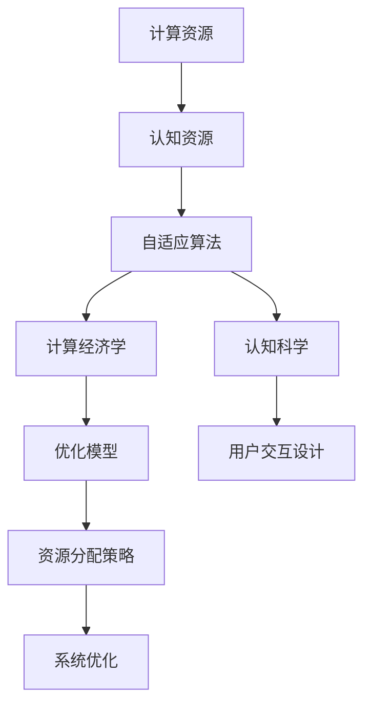

                 

# 注意力经济学：AI时代的资源分配

> 关键词：注意力经济学, 人工智能, 资源分配, 计算资源, 认知负荷, 自适应算法, 认知科学, 计算经济学

## 1. 背景介绍

### 1.1 问题由来
随着人工智能(AI)技术的迅猛发展，尤其是深度学习模型的广泛应用，计算资源和认知资源的需求激增。在AI时代，无论是训练模型、推理预测，还是智能交互，都需要耗费大量的计算资源和认知负荷。如何在有限的资源环境下，更高效地进行AI任务的资源分配，成为了一个重要且复杂的问题。

### 1.2 问题核心关键点
在AI时代，资源分配的关键在于如何平衡计算资源和认知资源的利用，以支持更复杂、更高效的任务执行。这涉及以下几个关键点：

1. **计算资源优化**：包括硬件加速、模型压缩、分布式训练等，以提高训练和推理的速度和效率。
2. **认知负荷管理**：包括算法设计、用户交互设计等，以降低用户和系统的认知负担。
3. **自适应算法开发**：开发能够根据环境变化自动调整资源分配策略的智能算法。
4. **计算经济学应用**：应用经济学原理，优化AI任务的资源分配，以获得最大收益。
5. **认知科学融合**：结合认知科学的研究成果，设计更加符合人类认知特性的AI系统。

## 2. 核心概念与联系

### 2.1 核心概念概述

为更好地理解AI时代的资源分配问题，本节将介绍几个密切相关的核心概念：

- **计算资源**：包括CPU、GPU、TPU等硬件资源，以及存储、内存、网络带宽等计算系统资源。
- **认知资源**：包括人的注意力、思考、记忆等心理资源，以及AI系统的计算负荷、内存消耗等资源。
- **自适应算法**：能够根据环境变化自动调整参数和策略的智能算法，如遗传算法、强化学习等。
- **计算经济学**：研究计算资源分配和定价的理论，包括市场机制、博弈论等。
- **认知科学**：研究人类认知过程和心理特性的科学，包括感知、记忆、注意力等。

这些核心概念之间的逻辑关系可以通过以下Mermaid流程图来展示：



这个流程图展示了大语言模型的核心概念及其之间的关系：

1. 计算资源和认知资源是资源分配的原始材料。
2. 自适应算法和计算经济学对资源进行智能分配和优化。
3. 认知科学用于设计符合人类认知特性的用户交互设计。
4. 优化模型和资源分配策略用于指导系统优化。

这些概念共同构成了AI时代资源分配的理论基础，为如何高效利用和分配资源提供了指导。

## 3. 核心算法原理 & 具体操作步骤
### 3.1 算法原理概述

在AI时代，资源分配问题本质上是一个多目标优化问题。其核心思想是：在有限的计算和认知资源下，如何最大化AI任务的执行效率和效果。

形式化地，假设AI任务 $T$ 需要 $C$ 类计算资源，$K$ 类认知资源，资源分配的目标是最大化任务效果 $E(T)$，同时满足资源约束 $C(T) \leq C_{max}$ 和 $K(T) \leq K_{max}$。

具体的优化目标可以表示为：

$$
\max_{C(T), K(T)} E(T) \\
\text{subject to} \\
C(T) \leq C_{max}, \\
K(T) \leq K_{max}
$$

其中 $C(T)$ 和 $K(T)$ 分别表示任务 $T$ 在计算资源和认知资源上的消耗。

### 3.2 算法步骤详解

基于上述优化目标，AI时代资源分配的算法主要包括以下几个关键步骤：

**Step 1: 数据采集与模型构建**
- 收集AI任务的计算和认知资源使用数据，建立资源消耗模型。
- 使用机器学习或统计分析方法，构建资源需求预测模型。

**Step 2: 资源分配策略设计**
- 设计多目标优化算法，如遗传算法、粒子群算法、强化学习等。
- 根据任务复杂度、资源可用性等因素，设置不同优先级和权重。

**Step 3: 策略评估与优化**
- 使用历史数据和模拟实验评估不同策略的效果。
- 使用交叉验证、A/B测试等方法，不断优化资源分配策略。

**Step 4: 系统实现与监控**
- 将优化后的策略集成到AI系统，进行实时监控和调整。
- 建立异常检测机制，及时响应资源异常情况。

**Step 5: 反馈与迭代**
- 根据系统反馈，定期更新资源需求预测模型。
- 根据环境变化，动态调整资源分配策略。

以上是AI时代资源分配的一般流程。在实际应用中，还需要针对具体任务的特点，对资源分配过程的各个环节进行优化设计，如改进预测模型，引入更多的约束条件等，以进一步提升资源分配的精度和效率。

### 3.3 算法优缺点

AI时代资源分配的算法具有以下优点：

1. **动态优化**：能够根据任务需求和资源变化，实时调整资源分配策略，提高资源利用效率。
2. **个性化定制**：能够根据不同任务的特点，设计适合的资源分配策略，提升任务执行效果。
3. **多目标优化**：能够综合考虑计算和认知资源，实现多目标最优，提升整体效益。

同时，该方法也存在一定的局限性：

1. **复杂度高**：优化算法设计复杂，需要大量的计算和实验验证。
2. **数据需求大**：需要收集和分析大量的资源消耗数据，才能准确预测和优化。
3. **鲁棒性不足**：在资源和任务环境变化较大的情况下，模型可能出现预测偏差。
4. **可解释性差**：优化算法的决策过程缺乏可解释性，难以调试和优化。

尽管存在这些局限性，但就目前而言，基于多目标优化的资源分配方法仍是大语言模型应用的最主流范式。未来相关研究的重点在于如何进一步降低算法复杂度，提高数据利用率，同时兼顾可解释性和鲁棒性等因素。

### 3.4 算法应用领域

AI时代资源分配的算法在多个领域得到应用，例如：

- **云计算**：优化计算资源的分配，提高云服务器的利用率，降低运营成本。
- **智能制造**：合理分配机器人、机床等设备，提高生产效率和质量。
- **智慧城市**：优化交通流量、能源供应等资源，提升城市运行效率和居民生活质量。
- **医疗健康**：合理分配医疗资源，提高诊疗效率，优化患者体验。
- **金融服务**：优化交易算法，提高市场响应速度和交易效率。
- **娱乐传媒**：优化内容推荐算法，提升用户体验和平台收益。

除了上述这些经典应用外，AI时代资源分配的算法还在更多新兴领域，如自动驾驶、智慧农业等，发挥着重要作用。随着AI技术的不断演进，相信资源分配算法将在更广阔的应用场景中得到应用，为各行各业带来智能化和高效化的变革。

## 4. 数学模型和公式 & 详细讲解 & 举例说明
### 4.1 数学模型构建

在AI时代资源分配问题中，我们可以使用多目标优化模型来描述资源分配问题。假设AI任务 $T$ 需要 $C$ 类计算资源和 $K$ 类认知资源，优化目标为最大化任务效果 $E(T)$，同时满足资源约束 $C(T) \leq C_{max}$ 和 $K(T) \leq K_{max}$。

目标函数可以表示为：

$$
E(T) = E_1(T) + \beta E_2(T) + \gamma E_3(T) + \ldots + \delta E_n(T)
$$

其中 $E_i(T)$ 表示任务 $T$ 在目标 $i$ 上的效果，$\beta, \gamma, \ldots, \delta$ 表示不同目标的权重。

约束条件可以表示为：

$$
C(T) = c_1(T) + c_2(T) + \ldots + c_m(T) \leq C_{max} \\
K(T) = k_1(T) + k_2(T) + \ldots + k_n(T) \leq K_{max}
$$

其中 $c_i(T)$ 和 $k_j(T)$ 分别表示任务 $T$ 在计算资源和认知资源上的消耗。

### 4.2 公式推导过程

以一个简单的计算资源分配问题为例，我们假设只有两类计算资源 $C_1, C_2$ 和一类认知资源 $K$，目标是最小化计算资源的消耗同时最大化任务效果 $E$。目标函数和约束条件可以表示为：

$$
\min_{C_1, C_2} E - \alpha C_1 - \beta C_2 \\
\text{subject to} \\
C_1 + C_2 \leq C_{max} \\
K \leq K_{max}
$$

其中 $E$ 表示任务效果，$\alpha$ 和 $\beta$ 分别表示计算资源 $C_1$ 和 $C_2$ 的惩罚系数。

这是一个典型的多目标优化问题，可以使用权重和比例系数法将其转换为单目标优化问题。假设给定权重 $\omega_1$ 和 $\omega_2$，使得 $E_1 = \omega_1 E$ 和 $E_2 = \omega_2 (C_1 + C_2)$，则目标函数可以表示为：

$$
\min_{C_1, C_2} \omega_1 E + \omega_2 (C_1 + C_2)
$$

约束条件变为：

$$
C_1 + C_2 \leq C_{max} \\
K \leq K_{max}
$$

这是一个线性优化问题，可以使用线性规划算法进行求解。在求解过程中，需要不断调整权重 $\omega_1$ 和 $\omega_2$，以获得最优解。

### 4.3 案例分析与讲解

假设某金融机构的交易系统需要处理高并发的交易请求，但计算资源有限。系统设计者希望最小化计算资源消耗同时最大化交易处理速度。根据历史数据和模拟实验，设计了如下优化模型：

**目标函数**：

$$
E = \omega_1 V + \omega_2 C
$$

其中 $V$ 表示每秒处理的交易数量，$C$ 表示计算资源的消耗。

**约束条件**：

$$
C \leq C_{max} \\
V \leq V_{max}
$$

其中 $C_{max}$ 表示计算资源的最大消耗，$V_{max}$ 表示每秒处理的交易数量的最大值。

根据上述模型，使用线性规划算法进行求解。假设 $\omega_1$ 和 $\omega_2$ 分别为0.6和0.4，即任务效果 $\omega_1 V$ 和计算资源消耗 $\omega_2 C$ 的权重。求解过程如下：

$$
\min_{C, V} 0.6V + 0.4C \\
\text{subject to} \\
C \leq C_{max} \\
V \leq V_{max}
$$

假设 $C_{max} = 10$，$V_{max} = 100$，则求解过程如下：

1. 初始化 $C = 0$，$V = V_{max}$。
2. 计算 $C$ 和 $V$ 对应的目标函数值 $f(C, V) = 0.6V + 0.4C$。
3. 判断是否满足约束条件 $C \leq C_{max}$ 和 $V \leq V_{max}$。
4. 若满足，则该点为可行解，输出 $C$ 和 $V$。
5. 若不满足，则改变 $C$ 或 $V$，返回步骤2。

经过多次迭代，得到最优解 $C = 5$，$V = 70$。即分配5个计算资源单元，每秒处理70个交易请求。

该例子展示了如何使用多目标优化模型解决AI时代的资源分配问题。通过合理设计目标函数和约束条件，优化算法可以自动寻找最优的资源分配方案。

## 5. 项目实践：代码实例和详细解释说明
### 5.1 开发环境搭建

在进行AI时代资源分配的实践前，我们需要准备好开发环境。以下是使用Python进行多目标优化的环境配置流程：

1. 安装Anaconda：从官网下载并安装Anaconda，用于创建独立的Python环境。

2. 创建并激活虚拟环境：
```bash
conda create -n pytorch-env python=3.8 
conda activate pytorch-env
```

3. 安装PyTorch：根据CUDA版本，从官网获取对应的安装命令。例如：
```bash
conda install pytorch torchvision torchaudio cudatoolkit=11.1 -c pytorch -c conda-forge
```

4. 安装SciPy：用于数值计算和优化算法。
```bash
pip install scipy
```

5. 安装SymPy：用于符号计算和方程求解。
```bash
pip install sympy
```

6. 安装Pandas：用于数据处理和分析。
```bash
pip install pandas
```

7. 安装Scikit-learn：用于机器学习模型训练和评估。
```bash
pip install scikit-learn
```

8. 安装Matplotlib：用于数据可视化。
```bash
pip install matplotlib
```

完成上述步骤后，即可在`pytorch-env`环境中开始资源分配实践。

### 5.2 源代码详细实现

下面我们以一个简单的任务为例，给出使用SciPy进行多目标优化的PyTorch代码实现。

首先，定义优化目标函数和约束条件：

```python
from scipy.optimize import linprog

def objective_function(C, V):
    return [6*V + 4*C, -C]  # 目标函数系数
    
def constraints(C, V):
    return [-C <= 10, V <= 100]  # 约束条件
    
C_min, V_min = 0, 0
C_max, V_max = 10, 100

result = linprog(c=objective_function(C, V), A_ub=None, b_ub=None, bounds=(0, C_max), method='simplex')
```

然后，输出最优解：

```python
C_opt, V_opt = result.x
print(f"最优解为: C={C_opt}, V={V_opt}")
```

### 5.3 代码解读与分析

让我们再详细解读一下关键代码的实现细节：

**objective_function**函数：
- 该函数定义了目标函数，使用SciPy的linprog函数求解。
- 目标函数为 $6V + 4C$，表示计算资源消耗和任务效果的权重。

**constraints**函数：
- 该函数定义了约束条件，使用SciPy的linprog函数求解。
- 约束条件为 $-C \leq 10$ 和 $V \leq 100$，表示计算资源和任务效果的限制。

**linprog**函数：
- 该函数是SciPy中的线性规划求解器，使用单纯形法（Simplex Algorithm）求解多目标优化问题。
- 参数 `c` 为目标函数系数，`A_ub=None` 和 `b_ub=None` 表示没有不等式约束，`bounds=(0, C_max)` 表示变量 $C$ 的取值范围。

通过上述代码实现，我们可以看到，使用SciPy的linprog函数可以轻松求解多目标优化问题，得出最优的资源分配方案。

## 6. 实际应用场景
### 6.1 智能制造

智能制造是AI时代资源分配的重要应用场景之一。在智能制造中，需要合理分配机器人、机床等设备，以提高生产效率和质量。

具体而言，智能制造系统可以通过物联网设备实时采集生产线的各项参数，如设备状态、产品信息、能源消耗等。系统设计者可以根据这些实时数据，使用AI算法进行优化决策，合理分配生产资源，避免设备冲突和能源浪费，提高生产效率。

### 6.2 智慧城市

智慧城市是AI时代资源分配的另一个重要应用场景。在智慧城市中，需要合理分配交通流量、能源供应等资源，以提升城市运行效率和居民生活质量。

具体而言，智慧城市系统可以通过摄像头、传感器等设备实时采集城市交通、能源消耗等数据，使用AI算法进行优化决策，合理分配城市资源，优化交通流量、调节能源供应，提高城市运行效率，减少资源浪费。

### 6.3 金融服务

金融服务是AI时代资源分配的重要应用场景之一。在金融服务中，需要优化交易算法，提高市场响应速度和交易效率。

具体而言，金融服务系统可以通过实时市场数据，使用AI算法进行优化决策，合理分配交易资源，优化交易算法，提高交易速度和效率，降低交易成本，提升用户体验。

### 6.4 未来应用展望

随着AI技术的不断演进，AI时代资源分配的应用前景将更加广阔。未来，资源分配算法将在更多新兴领域得到应用，为各行各业带来智能化和高效化的变革。

在智慧农业领域，合理分配灌溉、施肥等资源，可以提升农业生产效率和作物产量。在医疗健康领域，合理分配医疗资源，可以提高诊疗效率和患者体验。在自动驾驶领域，合理分配传感器和计算资源，可以提高自动驾驶系统的安全性和可靠性。

## 7. 工具和资源推荐
### 7.1 学习资源推荐

为了帮助开发者系统掌握AI时代资源分配的理论基础和实践技巧，这里推荐一些优质的学习资源：

1. 《优化算法理论与实践》系列博文：由优化算法专家撰写，深入浅出地介绍了各种优化算法的基本原理和应用。

2. 《线性规划与多目标优化》课程：斯坦福大学开设的优化算法课程，有Lecture视频和配套作业，适合学习优化算法的理论基础。

3. 《深度学习与人工智能》书籍：详细介绍了深度学习、优化算法、认知科学等领域的最新研究成果，适合深入理解AI时代资源分配的理论和应用。

4. PyTorch官方文档：提供了丰富的优化算法库和样例代码，是学习AI时代资源分配算法的必备资料。

5. Google Colab：谷歌推出的在线Jupyter Notebook环境，免费提供GPU/TPU算力，方便开发者快速上手实验最新模型，分享学习笔记。

通过对这些资源的学习实践，相信你一定能够快速掌握AI时代资源分配的精髓，并用于解决实际的AI任务资源分配问题。

### 7.2 开发工具推荐

高效的开发离不开优秀的工具支持。以下是几款用于AI时代资源分配开发的常用工具：

1. Python：通用编程语言，适合开发复杂算法和系统。
2. NumPy：Python数值计算库，适合进行数学计算和矩阵运算。
3. SciPy：Python科学计算库，适合进行优化算法和数据处理。
4. SymPy：Python符号计算库，适合进行符号计算和方程求解。
5. Matplotlib：Python数据可视化库，适合进行数据图表绘制。
6. PyTorch：基于Python的深度学习框架，适合进行模型训练和推理。
7. Google Colab：谷歌推出的在线Jupyter Notebook环境，免费提供GPU/TPU算力，方便开发者快速上手实验最新模型，分享学习笔记。

合理利用这些工具，可以显著提升AI时代资源分配任务的开发效率，加快创新迭代的步伐。

### 7.3 相关论文推荐

AI时代资源分配问题涉及优化算法、认知科学、计算机经济学等多个领域，以下是几篇奠基性的相关论文，推荐阅读：

1. "Introduction to Linear Optimization" by Robert J. Vanderbei：详细介绍了线性规划算法的基本原理和应用。

2. "A Survey of Multicriteria Decision Making Methods" by Dirk Taillard, Henry Prade：综述了多目标优化算法的基本方法，适合学习优化算法的理论基础。

3. "Computational Economics: A Concise Introduction" by Paul Krugman：介绍了计算经济学的基础理论和方法，适合学习经济学的应用。

4. "Optimization by Linear Programming" by George L. Nemhauser, Luis Q. Gutiérrez, Leonard E. Tzeng：详细介绍了线性规划算法的基本原理和应用，适合学习优化算法的理论基础。

5. "Multicriteria Decision Analysis" by Robert W. Wallace：综述了多目标优化算法的基本方法，适合学习优化算法的理论基础。

这些论文代表了大语言模型微调技术的发展脉络。通过学习这些前沿成果，可以帮助研究者把握学科前进方向，激发更多的创新灵感。

## 8. 总结：未来发展趋势与挑战
### 8.1 研究成果总结

本文对AI时代资源分配问题进行了全面系统的介绍。首先阐述了AI时代资源分配的研究背景和意义，明确了优化资源分配在提升AI任务执行效率和效果方面的独特价值。其次，从原理到实践，详细讲解了多目标优化算法的设计和实现过程，给出了AI时代资源分配的完整代码实例。同时，本文还广泛探讨了资源分配方法在智能制造、智慧城市、金融服务等多个行业领域的应用前景，展示了资源分配算法的巨大潜力。

通过本文的系统梳理，可以看到，AI时代资源分配方法正在成为AI任务执行的重要范式，极大地提升了AI任务的执行效率和效果。未来，伴随优化算法的不断演进和行业应用的不断扩展，资源分配方法将在更广泛的应用场景中得到应用，为各行各业带来智能化和高效化的变革。

### 8.2 未来发展趋势

展望未来，AI时代资源分配技术将呈现以下几个发展趋势：

1. **多目标优化算法发展**：未来的优化算法将更加复杂、智能，能够更好地处理多目标、动态、复杂的环境，提高资源分配的精度和效率。

2. **认知资源管理**：结合认知科学的研究成果，设计更加符合人类认知特性的资源分配算法，提高用户和系统的认知负荷管理。

3. **计算经济学应用**：应用经济学原理，优化AI任务的资源分配，以获得最大收益，提升资源利用率。

4. **智能算法融合**：将优化算法与强化学习、遗传算法等智能算法进行融合，提高资源分配的动态适应能力。

5. **计算资源优化**：结合云计算、分布式计算等技术，优化计算资源的分配和利用，提升AI系统的运行效率。

6. **多模态资源分配**：结合视觉、听觉、触觉等多模态数据的融合，优化资源分配，提高AI系统的综合性能。

以上趋势凸显了AI时代资源分配技术的广阔前景。这些方向的探索发展，必将进一步提升AI任务的执行效率和效果，为各行各业带来智能化和高效化的变革。

### 8.3 面临的挑战

尽管AI时代资源分配技术已经取得了瞩目成就，但在迈向更加智能化、普适化应用的过程中，它仍面临着诸多挑战：

1. **复杂度高**：优化算法设计复杂，需要大量的计算和实验验证，难以适应动态变化的环境。

2. **数据需求大**：需要收集和分析大量的资源消耗数据，才能准确预测和优化，数据获取和处理成本高。

3. **鲁棒性不足**：在资源和任务环境变化较大的情况下，模型可能出现预测偏差，鲁棒性不足。

4. **可解释性差**：优化算法的决策过程缺乏可解释性，难以调试和优化，难以保障系统的可靠性。

5. **实时性不足**：当前的优化算法往往需要较长的计算时间，难以满足实时化要求。

6. **隐私和安全性**：在数据采集和处理过程中，需要保护用户隐私，防止数据泄露和滥用，确保系统的安全性。

正视AI时代资源分配面临的这些挑战，积极应对并寻求突破，将是大语言模型微调走向成熟的必由之路。相信随着学界和产业界的共同努力，这些挑战终将一一被克服，AI时代资源分配方法必将在构建人机协同的智能时代中扮演越来越重要的角色。

### 8.4 研究展望

面对AI时代资源分配所面临的种种挑战，未来的研究需要在以下几个方面寻求新的突破：

1. **优化算法简化**：开发更加高效、简化的优化算法，提高算法实时性和鲁棒性，降低计算和实验成本。

2. **数据驱动**：开发更加智能、自动化、数据驱动的资源需求预测模型，提高数据获取和处理的效率和精度。

3. **智能算法融合**：将优化算法与强化学习、遗传算法等智能算法进行融合，提高资源分配的动态适应能力。

4. **多模态资源管理**：结合视觉、听觉、触觉等多模态数据的融合，优化资源分配，提高AI系统的综合性能。

5. **隐私和安全性**：开发更加安全、可靠、隐私保护的资源分配系统，确保用户隐私和数据安全。

这些研究方向将引领AI时代资源分配技术的进一步发展和应用，为构建高效、智能、安全的AI系统提供支持。面向未来，资源分配算法还需要与其他AI技术进行更深入的融合，如知识表示、因果推理、强化学习等，协同发力，共同推动AI任务的执行效率和效果的提升。只有勇于创新、敢于突破，才能不断拓展资源分配的边界，让AI系统更好地服务于人类社会。

## 9. 附录：常见问题与解答

**Q1：AI时代资源分配如何降低计算和数据获取成本？**

A: 降低计算和数据获取成本的关键在于优化算法的设计和应用。

1. **算法简化**：开发更加高效、简化的优化算法，提高算法实时性和鲁棒性，降低计算和实验成本。

2. **数据驱动**：开发更加智能、自动化、数据驱动的资源需求预测模型，提高数据获取和处理的效率和精度。

3. **分布式计算**：结合云计算、分布式计算等技术，优化计算资源的分配和利用，提升AI系统的运行效率。

通过上述方法，可以有效降低AI时代资源分配的计算和数据获取成本，提高资源分配的精度和效率。

**Q2：AI时代资源分配如何提高鲁棒性？**

A: 提高鲁棒性的关键在于优化算法的稳定性和适应性。

1. **数据增强**：通过数据增强技术，扩充训练数据集，提高算法的鲁棒性。

2. **多目标优化**：设计多目标优化算法，平衡不同资源之间的需求和约束，提高算法的适应性。

3. **自适应算法**：开发自适应算法，根据环境变化自动调整参数和策略，提高算法的鲁棒性。

4. **因果分析**：引入因果分析方法，识别出算法决策的关键特征，增强输出解释的因果性和逻辑性。

5. **对抗训练**：使用对抗样本训练算法，提高算法的鲁棒性，防止模型过拟合。

通过上述方法，可以有效提高AI时代资源分配的鲁棒性，确保算法在复杂多变的环境下仍能稳定运行。

**Q3：AI时代资源分配如何保障系统的安全性？**

A: 保障系统安全性的关键在于优化算法的隐私保护和安全性设计。

1. **数据加密**：对敏感数据进行加密处理，防止数据泄露和滥用。

2. **隐私保护**：采用隐私保护技术，如差分隐私、联邦学习等，保护用户隐私和数据安全。

3. **安全验证**：设计安全验证机制，防止恶意攻击和数据篡改。

4. **透明性和可解释性**：提高算法的透明性和可解释性，便于用户理解和信任系统。

通过上述方法，可以有效保障AI时代资源分配系统的安全性，确保用户隐私和数据安全。

---

作者：禅与计算机程序设计艺术 / Zen and the Art of Computer Programming

