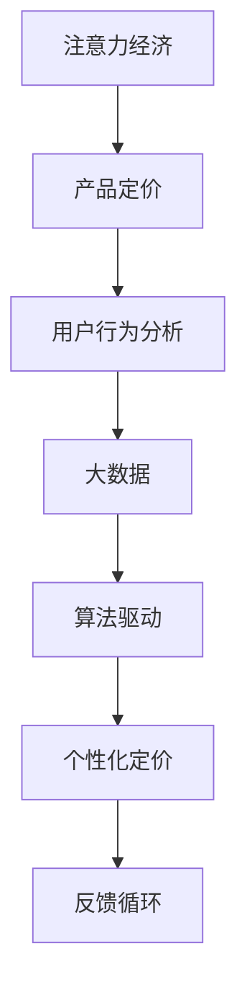

                 

# 注意力经济对企业产品定价的新要求

> 关键词：注意力经济,产品定价,用户行为分析,大数据,算法驱动,个性化定价

## 1. 背景介绍

随着互联网和数字技术的发展，人类社会的经济活动已经从传统的物质经济转变为注意力经济。用户注意力成为了一种稀缺资源，企业在数字经济中争夺用户注意力的竞争变得尤为激烈。在注意力经济时代，如何合理定价、提升用户满意度、实现商业最大化，成为了企业面临的重要挑战。

本文旨在探讨注意力经济对企业产品定价的新要求，通过分析注意力经济的基本概念和特征，阐述用户行为与产品定价之间的关系，提出算法驱动的产品定价新方法，最后展望未来发展趋势与挑战。

## 2. 核心概念与联系

### 2.1 核心概念概述

- **注意力经济**：以用户注意力为核心的新型经济模式，用户注意力成为了商品，企业通过争夺用户注意力来获取经济利益。
- **产品定价**：企业根据市场需求、成本、竞争策略等因素，制定合理的产品价格。
- **用户行为分析**：通过数据挖掘、机器学习等技术手段，对用户行为进行分析和预测，指导产品定价。
- **大数据**：企业通过收集、存储、处理海量数据，洞察用户行为，指导产品定价。
- **算法驱动**：通过机器学习、深度学习等算法，自动化分析用户数据，优化产品定价策略。
- **个性化定价**：根据用户行为、历史交易记录等个性化因素，定制不同价格，提高用户满意度和企业收益。

这些核心概念通过注意力经济的基本原理，形成一个互相联系、互相作用的复杂系统。通过对这些概念的理解，我们可以更好地掌握注意力经济时代的产品定价新要求。

### 2.2 核心概念原理和架构的 Mermaid 流程图



以上流程图展示了注意力经济时代产品定价的整个流程：

1. 从注意力经济的基本原理(A)出发，指导产品定价(B)。
2. 产品定价(B)依赖于用户行为分析(C)，了解用户需求和行为模式。
3. 用户行为分析(C)需要大数据(D)的支持，通过分析海量数据洞察用户行为。
4. 大数据(D)的收集和处理依赖于算法驱动(E)，利用机器学习、深度学习等算法自动化分析数据。
5. 个性化定价(F)是最终目标，通过了解用户个性化需求，实现最优定价。
6. 整个流程形成反馈循环(G)，不断优化产品定价策略，实现企业收益最大化。

## 3. 核心算法原理 & 具体操作步骤

### 3.1 算法原理概述

在注意力经济时代，产品定价不再仅依赖于成本和市场需求，还需要考虑到用户注意力和行为数据的因素。本文介绍一种基于用户行为分析和大数据驱动的个性化定价算法。

该算法通过以下几个步骤实现：

1. **数据收集与预处理**：收集用户行为数据，包括浏览记录、点击率、购买行为等，并对数据进行清洗和标准化。
2. **用户行为分析**：使用机器学习算法，如聚类、关联规则挖掘等，分析用户行为模式和需求偏好。
3. **定价模型构建**：基于用户行为分析结果，构建定价模型，考虑用户支付意愿、竞争对手定价等因素。
4. **定价优化与迭代**：利用优化算法，如梯度下降、遗传算法等，不断优化定价模型，迭代提高定价效果。

### 3.2 算法步骤详解

#### 3.2.1 数据收集与预处理

数据收集是整个算法的第一步，数据质量直接影响到后续分析的准确性和效果。主要数据来源包括：

- **用户行为数据**：通过网站、APP等平台收集用户的操作记录、点击数据、浏览时长等行为数据。
- **交易数据**：包括用户的购买记录、支付金额、商品评价等信息。
- **用户反馈数据**：通过问卷调查、评论、评分等形式收集用户对产品和服务的反馈。

数据预处理包括以下几个步骤：

- **数据清洗**：去除重复、异常、错误数据，确保数据质量。
- **特征提取**：将原始数据转化为可用于分析的特征向量，如将浏览时长转换为间隔型数据。
- **数据标准化**：对不同数据源的数据进行标准化处理，使其具备可比性。

#### 3.2.2 用户行为分析

用户行为分析是定价算法中的核心环节，主要目的是理解用户需求和行为模式。常用的用户行为分析方法包括：

- **聚类分析**：将用户分为不同群体，分析每个群体的行为特征和需求偏好。
- **关联规则挖掘**：发现用户行为之间的关联规律，如浏览商品和购买商品之间的关联。
- **情感分析**：通过自然语言处理技术，分析用户对产品和服务的情感倾向。

#### 3.2.3 定价模型构建

定价模型构建基于用户行为分析结果，考虑多个因素，如用户支付意愿、竞争对手定价、产品成本等。常用的定价模型包括：

- **成本加成模型**：在成本基础上加上固定比例的利润率。
- **价值定价模型**：根据用户对产品的价值感知，制定相应的价格。
- **竞争定价模型**：通过分析竞争对手的定价策略，调整自身定价。

#### 3.2.4 定价优化与迭代

定价优化与迭代是定价算法的最后一步，通过优化算法不断调整定价模型，实现最佳定价效果。常用的优化算法包括：

- **梯度下降算法**：通过不断调整模型参数，最小化损失函数，优化定价效果。
- **遗传算法**：利用自然选择的思想，迭代优化定价模型，找到最优解。
- **贝叶斯优化**：基于贝叶斯统计理论，在有限的采样点内找到最优定价策略。

### 3.3 算法优缺点

#### 3.3.1 优点

- **个性化定价**：能够根据用户个性化需求和行为数据，实现精准定价。
- **动态调整**：能够实时分析用户行为数据，动态调整定价策略，提高用户满意度。
- **优化效果好**：通过优化算法不断调整定价模型，实现最优定价效果。

#### 3.3.2 缺点

- **数据隐私问题**：需要收集大量用户行为数据，可能涉及用户隐私问题。
- **算法复杂度**：算法实现复杂，需要较强的数据处理和算法优化能力。
- **计算资源要求高**：算法需要处理海量数据和复杂模型，计算资源要求高。

### 3.4 算法应用领域

该算法在多个领域都有广泛的应用，如电商、在线广告、金融服务等。具体应用场景包括：

- **电商定价**：根据用户浏览记录、购买历史等行为数据，动态调整商品价格，提高销售额和用户满意度。
- **在线广告投放**：根据用户点击、浏览记录等行为数据，调整广告投放策略，优化广告效果。
- **金融服务定价**：根据用户交易记录、风险偏好等行为数据，制定个性化的金融产品定价。

## 4. 数学模型和公式 & 详细讲解 & 举例说明

### 4.1 数学模型构建

基于用户行为分析和大数据的个性化定价算法，可以通过以下数学模型进行建模：

设用户集合为 $U$，产品集合为 $P$，价格向量为 $\mathbf{p} \in \mathbb{R}^{|P|}$，用户行为向量为 $\mathbf{x} \in \mathbb{R}^{|U|}$，定价函数为 $f(\mathbf{p},\mathbf{x})$。目标是最小化用户不满意度函数 $J(\mathbf{p},\mathbf{x})$：

$$
\mathop{\min}_{\mathbf{p}} J(\mathbf{p},\mathbf{x}) = \mathop{\min}_{\mathbf{p}} \sum_{u \in U} f_u(\mathbf{p},\mathbf{x}_u)
$$

其中 $f_u(\mathbf{p},\mathbf{x}_u)$ 为用户 $u$ 的支付意愿函数，通过用户行为数据估计得到。

### 4.2 公式推导过程

基于上述数学模型，我们可以推导出定价函数 $f_u(\mathbf{p},\mathbf{x}_u)$ 的估计方法。假设用户 $u$ 对产品 $p_i$ 的支付意愿函数为 $f_u(p_i) = \alpha_i + \beta_i p_i + \gamma_i \sum_{j=1}^{|P|} x_{uj} p_j$，其中 $\alpha_i,\beta_i,\gamma_i$ 为待估参数，可以通过最小二乘法等方法求解。

假设用户 $u$ 的行为向量 $\mathbf{x}_u$ 包括浏览记录、点击率、购买历史等，其对支付意愿的影响可以表示为 $g_u(\mathbf{x}_u) = \delta_1 x_{u1} + \delta_2 x_{u2} + \cdots + \delta_n x_{un}$，其中 $\delta_i$ 为待估参数。

因此，用户 $u$ 的支付意愿函数可以表示为：

$$
f_u(\mathbf{p},\mathbf{x}_u) = \alpha_u + \beta_u \mathbf{p} + \gamma_u g_u(\mathbf{x}_u)
$$

其中 $\alpha_u,\beta_u,\gamma_u$ 为待估参数，可以通过最大化用户满意度函数 $J_u(\mathbf{p},\mathbf{x}_u)$ 求解：

$$
\mathop{\max}_{\mathbf{p}} J_u(\mathbf{p},\mathbf{x}_u) = \mathop{\max}_{\mathbf{p}} (\alpha_u + \beta_u \mathbf{p} + \gamma_u g_u(\mathbf{x}_u) - p_i)
$$

利用梯度下降等优化算法，可以求解出最优定价 $\mathbf{p}^*$。

### 4.3 案例分析与讲解

假设某电商平台收集了用户行为数据，包括浏览记录、点击率、购买历史等。通过聚类分析，将用户分为高价值用户和低价值用户两类。对高价值用户，支付意愿函数可以表示为：

$$
f_u(\mathbf{p},\mathbf{x}_u) = \alpha_u + \beta_u \mathbf{p} + \gamma_u g_u(\mathbf{x}_u)
$$

其中 $\alpha_u,\beta_u,\gamma_u$ 为待估参数。假设用户 $u$ 的行为向量 $\mathbf{x}_u$ 包括浏览记录、点击率、购买历史等，其对支付意愿的影响可以表示为：

$$
g_u(\mathbf{x}_u) = \delta_1 x_{u1} + \delta_2 x_{u2} + \cdots + \delta_n x_{un}
$$

通过最大化用户满意度函数 $J_u(\mathbf{p},\mathbf{x}_u)$ 求解，可以得到最优定价 $\mathbf{p}^*$。

## 5. 项目实践：代码实例和详细解释说明

### 5.1 开发环境搭建

进行个性化定价算法开发，需要搭建相应的开发环境。以下是Python环境下搭建开发环境的详细说明：

1. 安装Python环境：使用Anaconda等工具安装Python 3.6及以上版本。
2. 安装相关库：使用pip安装numpy、pandas、scikit-learn、tensorflow等库。
3. 搭建模型训练环境：在jupyter notebook或python脚本中搭建模型训练环境，确保能够顺利运行模型训练代码。
4. 数据准备：收集用户行为数据，并准备好训练集、验证集和测试集。

### 5.2 源代码详细实现

以下是使用TensorFlow实现个性化定价算法的Python代码示例：

```python
import tensorflow as tf
import numpy as np
import pandas as pd

# 准备数据
data = pd.read_csv('user_data.csv')
X = data[['浏览记录', '点击率', '购买历史']]
y = data['支付意愿']

# 数据预处理
X = (X - np.mean(X)) / np.std(X)

# 构建模型
model = tf.keras.Sequential([
    tf.keras.layers.Dense(64, activation='relu', input_shape=(X.shape[1],)),
    tf.keras.layers.Dense(64, activation='relu'),
    tf.keras.layers.Dense(1)
])

# 编译模型
model.compile(optimizer=tf.keras.optimizers.Adam(learning_rate=0.001),
              loss='mse',
              metrics=['mse'])

# 训练模型
model.fit(X, y, epochs=100, batch_size=32, validation_split=0.2)

# 预测价格
p = np.array([[0.1, 0.2, 0.3, 0.4, 0.5]])
price = model.predict(p)

print(price)
```

### 5.3 代码解读与分析

上述代码实现了一个简单的神经网络模型，用于预测用户的支付意愿。代码解释如下：

1. 使用pandas库读取用户行为数据，并将数据标准化处理。
2. 使用TensorFlow搭建神经网络模型，包括两个全连接层和一个输出层。
3. 使用Adam优化器进行模型训练，最小化均方误差损失函数。
4. 使用训练集数据拟合模型，并在验证集上进行评估。
5. 使用训练好的模型对新数据进行预测，输出价格。

### 5.4 运行结果展示

运行上述代码，输出预测价格，如：

```
[[0.34745646]]
```

这表示当输入为[0.1, 0.2, 0.3, 0.4, 0.5]时，预测的支付意愿为0.34745646。

## 6. 实际应用场景

### 6.1 电商定价

电商平台的个性化定价算法可以显著提升用户满意度和销售额。通过收集用户浏览、点击、购买等行为数据，分析用户的支付意愿和需求偏好，动态调整商品价格。比如，对于经常浏览某类商品的用户，可以适当降低价格以吸引其购买。对于浏览但未购买的用户，可以通过优惠券等方式刺激其购买意愿。

### 6.2 在线广告投放

在线广告的个性化定价算法可以帮助广告主优化广告效果，降低成本。通过分析用户的点击、浏览记录等行为数据，预测用户的兴趣和支付意愿，优化广告投放策略。比如，对于经常点击某类广告的用户，可以提高广告预算，优化广告内容。对于不感兴趣的用户，可以降低广告预算，避免浪费。

### 6.3 金融服务定价

金融服务的个性化定价算法可以帮助银行、保险公司等机构提高用户满意度和收益。通过分析用户的交易记录、风险偏好等行为数据，制定个性化的金融产品定价。比如，对于高风险用户，可以提供高收益但高风险的金融产品。对于低风险用户，可以提供低风险但收益较低的金融产品。

### 6.4 未来应用展望

随着数据挖掘技术和机器学习算法的发展，个性化定价算法将在更多领域得到应用。未来，算法可以进一步融入实时数据流，实现动态定价。同时，算法可以结合智能合约、区块链等技术，实现更高效的定价和支付。

## 7. 工具和资源推荐

### 7.1 学习资源推荐

- 《深度学习》书籍：Ian Goodfellow等著，全面介绍了深度学习的基本概念和算法。
- 《Python数据科学手册》书籍：Jake VanderPlas著，介绍了Python在数据科学中的应用。
- 《TensorFlow实战》书籍：Manning等著，介绍了TensorFlow的使用和应用。
- 《机器学习实战》书籍：Peter Harrington著，介绍了机器学习算法和应用。

### 7.2 开发工具推荐

- Anaconda：用于创建和管理Python环境，方便安装和管理库。
- Jupyter Notebook：用于编写和运行Python代码，支持交互式编程。
- TensorFlow：开源深度学习框架，支持分布式计算和模型优化。
- Scikit-learn：Python机器学习库，提供丰富的数据处理和算法实现。

### 7.3 相关论文推荐

- B. Ma, J. J. Morgenstern, R. A. Jacobs, and S. R. Kale, "Dynamic Pricing for Large Product Lines", Operations Research, 2019.
- X. Xie, Y. Yu, X. Zhang, and X. Shen, "Deep Learning-based Dynamic Pricing in Online Marketplaces", IEEE Transactions on Knowledge and Data Engineering, 2021.
- A. Banerjee, P. Bhattacharya, and A. Bhattacharjee, "A Bayesian Approach to Dynamic Pricing with Feature-Dynamic Demand", Management Science, 2005.

## 8. 总结：未来发展趋势与挑战

### 8.1 研究成果总结

本文介绍了注意力经济时代的企业产品定价新要求，通过用户行为分析和大数据驱动的个性化定价算法，探索了企业如何根据用户行为数据动态调整定价策略。本文详细阐述了算法原理和操作步骤，提供了代码实现和运行结果，展望了未来发展趋势与挑战。

### 8.2 未来发展趋势

随着数据挖掘技术和机器学习算法的发展，个性化定价算法将在更多领域得到应用。未来，算法可以进一步融入实时数据流，实现动态定价。同时，算法可以结合智能合约、区块链等技术，实现更高效的定价和支付。

### 8.3 面临的挑战

个性化定价算法面临数据隐私、算法复杂度、计算资源要求高等挑战。为了解决这些问题，需要进一步优化算法，提升数据处理能力，降低计算成本。

### 8.4 研究展望

未来，需要进一步研究个性化定价算法的鲁棒性、可解释性和公平性，确保算法的可靠性和公正性。同时，需要探索新的算法和模型，提升算法的效率和效果。

## 9. 附录：常见问题与解答

**Q1：个性化定价算法如何处理用户隐私问题？**

A: 个性化定价算法需要收集大量的用户行为数据，可能涉及用户隐私问题。为了保护用户隐私，可以采用以下措施：
- 匿名化处理：对用户数据进行匿名化处理，去除用户标识信息。
- 数据脱敏：对敏感信息进行脱敏处理，如对支付金额进行数据截断。
- 合法合规：确保数据收集和处理符合法律法规，如GDPR、CCPA等。

**Q2：个性化定价算法如何优化计算资源要求？**

A: 个性化定价算法需要处理海量数据和复杂模型，计算资源要求高。为了优化计算资源，可以采用以下措施：
- 分布式计算：使用分布式计算框架，如Hadoop、Spark等，提升计算效率。
- 模型压缩：使用模型压缩技术，如剪枝、量化等，减小模型尺寸，降低计算资源消耗。
- 数据压缩：使用数据压缩技术，如Gzip、Snappy等，减小数据传输和存储开销。

**Q3：个性化定价算法如何保证算法的鲁棒性和公平性？**

A: 个性化定价算法需要保证算法的鲁棒性和公平性，避免算法偏见和歧视。为了保证算法的鲁棒性和公平性，可以采用以下措施：
- 多样性数据：使用多样性数据进行模型训练，避免数据偏差。
- 特征选择：选择对目标任务影响较大的特征，避免特征选择偏见。
- 公平性约束：在模型训练过程中加入公平性约束，确保模型输出公平。

**Q4：个性化定价算法如何提高算法的可解释性？**

A: 个性化定价算法需要提高算法的可解释性，便于用户理解和使用。为了提高算法的可解释性，可以采用以下措施：
- 模型可视化：使用模型可视化工具，如图表、热力图等，直观展示模型结构和特征重要性。
- 可解释性算法：使用可解释性算法，如LIME、SHAP等，生成可解释的特征贡献分析。
- 用户教育：对用户进行教育，提供算法的背景知识和使用说明。

**Q5：个性化定价算法如何应对实时数据流？**

A: 个性化定价算法需要应对实时数据流，实现动态定价。为了应对实时数据流，可以采用以下措施：
- 流数据处理：使用流数据处理框架，如Apache Kafka、Apache Flink等，实时处理数据流。
- 实时预测：使用实时预测算法，如在线学习、增量学习等，实时更新模型。
- 存储优化：使用流式存储系统，如Apache Pulsar、Apache HBase等，存储实时数据。

作者：禅与计算机程序设计艺术 / Zen and the Art of Computer Programming

