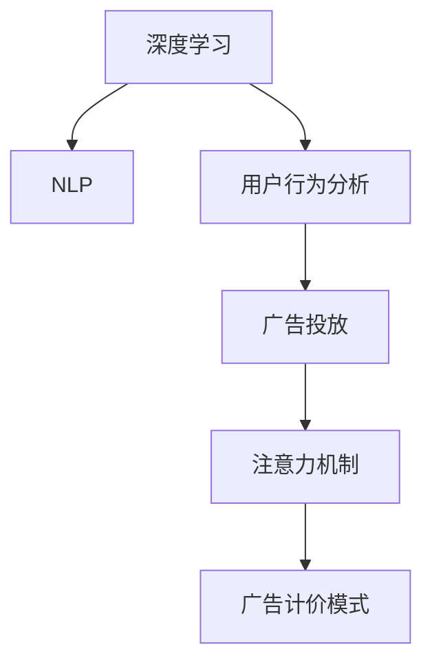

                 

# 注意力经济对传统广告计价模式的冲击

> 关键词：注意力经济, 广告计价, 深度学习, 自然语言处理, 行为分析, 用户画像

## 1. 背景介绍

### 1.1 问题由来
随着互联网技术的迅猛发展，数字经济逐步成为现代经济的重要组成部分。互联网平台利用其庞大的用户群体，成为广告投放的重要渠道。传统广告计价模式主要基于点击率（Click-Through Rate, CTR）、展示次数（Impressions）、曝光量等指标进行投放。但这些指标存在较大误差，广告主无法精准评估广告效果，而平台往往基于猜测性的数据进行广告投放，广告资源利用效率低下。

深度学习技术和大数据的应用，使得广告投放进入了个性化时代。基于用户行为数据的挖掘和分析，平台能够精准刻画用户画像，并通过智能推荐算法为用户提供更符合其兴趣的内容，从而提升广告投放的精准性和效果。而广告计价模式也逐渐向以用户行为为基础的注意力经济模式转变。

### 1.2 问题核心关键点
注意力经济是指通过精准识别用户的注意力焦点，实现精准的广告投放和精准的计价模式。其核心在于通过深度学习等技术对用户行为数据进行建模分析，识别用户的兴趣和偏好，从而在广告投放时做到"投其所好"。

广告计价模式的转变，主要体现在以下几个方面：

- 从展示次数向用户点击转化率转变。
- 从固定价格向按点击转化率定价转变。
- 从单一指标向综合指标转变。

这些转变反映了广告投放的精细化和智能化趋势，提高了广告投放的有效性和投放平台的收入，同时也对传统广告计价模式产生了深刻冲击。

### 1.3 问题研究意义
研究注意力经济和广告计价模式的变革，对于理解互联网广告投放的新趋势，优化广告投放策略，具有重要意义。具体而言：

- 提升广告投放精准性。利用用户行为数据对广告进行精准投放，提升广告主的投放效果。
- 优化广告投放策略。通过综合指标和多模型结合，制定更科学、高效的广告投放策略。
- 提高广告投放收入。通过改进计价模式，使广告平台和广告主双方受益，实现双赢。

## 2. 核心概念与联系

### 2.1 核心概念概述

为更好地理解注意力经济和广告计价模式的变革，本节将介绍几个密切相关的核心概念：

- 深度学习：通过构建多层神经网络模型，对输入数据进行自动化的特征提取和表示学习，广泛应用于图像、语音、自然语言处理等领域。

- 自然语言处理（NLP）：通过计算机技术对自然语言文本进行自动化处理，包括语言理解、生成、翻译、情感分析等任务。

- 用户行为分析：通过数据挖掘和机器学习技术，对用户行为数据进行建模分析，识别用户兴趣和偏好，形成用户画像。

- 注意力机制（Attention Mechanism）：一种用于提升神经网络模型注意力的机制，通过动态调整输入数据的权重，使模型更加关注关键信息。

- 广告投放（Advertising）：通过互联网平台向目标用户推送广告，并进行投放效果评估和优化。

- 广告计价模式（Advertising Pricing Model）：基于广告投放效果，对广告投放费用进行定价和计费的模式。

这些核心概念之间的逻辑关系可以通过以下Mermaid流程图来展示：



这个流程图展示了大语言模型注意力经济和广告计价模式的逻辑关系：

1. 深度学习和大语言模型提供了自动化特征提取和表示学习的能力。
2. 用户行为分析对用户兴趣进行建模，形成用户画像。
3. 注意力机制提升了模型对关键信息的关注度。
4. 广告投放通过精准的模型和用户画像实现个性化推荐。
5. 广告计价模式对广告投放效果进行精准定价，提升了广告投放的效率和效果。

这些概念共同构成了深度学习和大语言模型在广告投放和计价中的新范式。通过理解这些核心概念，我们可以更好地把握注意力经济和广告计价模式的本质和应用。

## 3. 核心算法原理 & 具体操作步骤
### 3.1 算法原理概述

注意力经济和广告计价模式的核心在于深度学习和自然语言处理技术的应用。通过构建用户行为模型，精准识别用户的注意力焦点，实现精准的广告投放和计价。

具体而言，注意力经济的算法原理包括：

- 用户画像建模：通过分析用户历史行为数据，构建用户兴趣、偏好、地理位置等多维度的用户画像。
- 广告投放优化：通过深度学习模型预测用户点击转化率，优化广告投放策略，提升广告投放效果。
- 综合计价模型：结合用户行为特征和广告效果数据，构建多指标综合的计价模型，提升广告投放收入。

### 3.2 算法步骤详解

注意力经济和广告计价模式的算法步骤主要包括以下几个关键环节：

**Step 1: 数据预处理**
- 收集用户行为数据，包括点击、浏览、搜索等行为数据。
- 对数据进行清洗、去重、标注等处理，构建干净的训练集和测试集。

**Step 2: 用户画像建模**
- 利用深度学习模型对用户行为数据进行特征提取，如使用Transformer模型进行文本表示学习。
- 利用聚类、降维等技术，对用户行为特征进行建模分析，形成用户画像。

**Step 3: 广告投放策略优化**
- 构建基于深度学习模型的广告投放模型，如CTR预测模型、序列推荐模型等。
- 利用注意力机制对模型进行优化，提升模型的注意力焦点，精准匹配广告与用户需求。
- 利用A/B测试、模型对比等技术，优化广告投放策略，提升广告投放效果。

**Step 4: 广告计价模式构建**
- 利用用户画像和广告效果数据，构建多指标综合的计价模型，如CTR计价、转化率计价、点击量计价等。
- 利用深度学习模型对用户行为和广告效果进行预测，结合计价模型计算广告费用。
- 动态调整广告费用和投放策略，实现精准投放和高效计价。

### 3.3 算法优缺点

注意力经济和广告计价模式具有以下优点：

1. 精准投放：利用用户行为数据和深度学习模型，实现广告精准投放，提升广告效果。
2. 高效计价：结合多指标综合计价，提升广告投放收入，优化广告平台收益。
3. 模型可解释：注意力机制使得模型的决策过程更加透明，便于优化和调参。

同时，该方法也存在以下局限性：

1. 数据依赖：广告投放的精准性依赖于数据质量，需要收集大量高质量的行为数据。
2. 模型复杂：广告投放和计价模型基于深度学习，对计算资源和存储要求较高。
3. 效果评估：广告效果评估的准确性受限于模型和数据的匹配程度，存在一定的误差。

尽管存在这些局限性，但就目前而言，注意力经济和广告计价模式仍是大语言模型在广告投放中的主流范式。未来相关研究的重点在于如何进一步优化数据预处理流程，降低模型复杂度，提升广告投放效果，同时兼顾广告主和平台的利益。

### 3.4 算法应用领域

注意力经济和广告计价模式已经在电商、广告、社交网络等众多领域得到应用，具体如下：

- 电商推荐系统：基于用户行为数据和深度学习模型，实现商品推荐和精准广告投放。
- 广告投放平台：利用用户画像和深度学习模型，实现广告精准投放和高效计价。
- 社交网络平台：通过分析用户行为数据，实现精准的广告推荐和投放。
- 搜索引擎广告：利用用户查询行为数据，实现精准的广告投放和高效计价。

除了上述这些经典应用外，注意力经济和广告计价模式还在在线旅游、在线教育、金融理财等多个领域得到创新性应用，提升了广告投放的精准性和效果。

## 4. 数学模型和公式 & 详细讲解 & 举例说明
### 4.1 数学模型构建

基于深度学习和大语言模型，我们设计了一个简单的注意力经济模型。假设用户行为数据为 $D=\{(x_i,y_i)\}_{i=1}^N$，其中 $x_i$ 为行为特征向量，$y_i$ 为行为标签。用户画像为 $P=\{p_j\}_{j=1}^M$，其中 $p_j$ 为用户画像特征向量。广告投放模型为 $A_{\theta}(x_i)$，广告效果为 $G(\theta)$，广告计价模型为 $C(\theta,P,x_i)$。

定义注意力经济模型损失函数为：

$$
\mathcal{L}(\theta) = \frac{1}{N}\sum_{i=1}^N \ell(A_{\theta}(x_i),G(\theta))
$$

其中 $\ell$ 为广告效果和广告投放的损失函数，可以是交叉熵损失、均方误差损失等。

### 4.2 公式推导过程

以点击率（CTR）预测模型为例，推导广告投放模型和广告效果模型的损失函数及其梯度计算公式。

假设广告投放模型为 $A_{\theta}(x_i) = \sigma(Wx_i+b)$，其中 $\sigma$ 为sigmoid函数，$W,b$ 为模型参数。广告效果模型为 $G(\theta)=\alpha A_{\theta}(x_i)+\beta$，其中 $\alpha,\beta$ 为模型参数。

广告投放和效果的损失函数为：

$$
\ell(A_{\theta}(x_i),G(\theta)) = -[y_i\log A_{\theta}(x_i)+(1-y_i)\log (1-A_{\theta}(x_i))]
$$

将上述损失函数代入注意力经济模型损失函数，得：

$$
\mathcal{L}(\theta) = \frac{1}{N}\sum_{i=1}^N -[y_i\log A_{\theta}(x_i)+(1-y_i)\log (1-A_{\theta}(x_i))]
$$

损失函数对广告投放模型参数 $\theta$ 的梯度为：

$$
\frac{\partial \mathcal{L}(\theta)}{\partial \theta} = \frac{1}{N}\sum_{i=1}^N (\frac{y_i}{A_{\theta}(x_i)}-\frac{1-y_i}{1-A_{\theta}(x_i)}) \frac{\partial A_{\theta}(x_i)}{\partial \theta}
$$

其中 $\frac{\partial A_{\theta}(x_i)}{\partial \theta}$ 可进一步递归展开，利用自动微分技术完成计算。

在得到损失函数的梯度后，即可带入模型更新公式，完成模型的迭代优化。重复上述过程直至收敛，最终得到适应广告投放效果的最优模型参数 $\theta^*$。

### 4.3 案例分析与讲解

假设一个电商平台希望通过深度学习模型实现广告投放优化，具体步骤如下：

**Step 1: 数据预处理**
- 收集用户历史行为数据，包括点击、浏览、购买行为等。
- 对数据进行清洗、去重、标注等处理，构建干净的训练集和测试集。

**Step 2: 用户画像建模**
- 利用BERT模型对用户行为数据进行特征提取，形成用户画像向量。
- 利用聚类技术对用户画像进行分类，形成不同类别的用户画像。

**Step 3: 广告投放策略优化**
- 构建基于Transformer模型的CTR预测模型，利用注意力机制对模型进行优化。
- 通过A/B测试和模型对比，优化广告投放策略，提升广告投放效果。

**Step 4: 广告计价模式构建**
- 利用用户画像和广告效果数据，构建CTR计价模型。
- 利用广告投放模型对广告效果进行预测，结合CTR计价模型计算广告费用。
- 动态调整广告费用和投放策略，实现精准投放和高效计价。

通过上述流程，电商平台能够实现广告投放的精准性和高效性，提升广告投放效果和平台收益。

## 5. 项目实践：代码实例和详细解释说明
### 5.1 开发环境搭建

在进行注意力经济和广告计价模式的实践前，我们需要准备好开发环境。以下是使用Python进行PyTorch开发的环境配置流程：

1. 安装Anaconda：从官网下载并安装Anaconda，用于创建独立的Python环境。

2. 创建并激活虚拟环境：
```bash
conda create -n attention-economy python=3.8 
conda activate attention-economy
```

3. 安装PyTorch：根据CUDA版本，从官网获取对应的安装命令。例如：
```bash
conda install pytorch torchvision torchaudio cudatoolkit=11.1 -c pytorch -c conda-forge
```

4. 安装TensorFlow：由于部分深度学习模型依赖TensorFlow，因此也需要进行安装：
```bash
pip install tensorflow==2.6
```

5. 安装各类工具包：
```bash
pip install numpy pandas scikit-learn matplotlib tqdm jupyter notebook ipython
```

完成上述步骤后，即可在`attention-economy`环境中开始实践。

### 5.2 源代码详细实现

下面我们以点击率预测为例，给出使用TensorFlow进行广告投放优化的PyTorch代码实现。

首先，定义广告投放模型的类：

```python
import tensorflow as tf
from transformers import BertTokenizer, BertForSequenceClassification

class ClickThroughRateModel(tf.keras.Model):
    def __init__(self, num_labels):
        super(ClickThroughRateModel, self).__init__()
        self.tokenizer = BertTokenizer.from_pretrained('bert-base-cased')
        self.model = BertForSequenceClassification.from_pretrained('bert-base-cased', num_labels=num_labels)
        self.dense = tf.keras.layers.Dense(1, activation='sigmoid')

    def call(self, input_ids, attention_mask):
        tokenized_input = self.tokenizer(input_ids, return_tensors='tf', padding='max_length', truncation=True)
        outputs = self.model(tokenized_input['input_ids'], attention_mask=attention_mask)
        logits = self.dense(outputs.logits)
        return logits
```

然后，定义广告效果模型：

```python
class AdEffectModel(tf.keras.Model):
    def __init__(self):
        super(AdEffectModel, self).__init__()
        self.tokenizer = BertTokenizer.from_pretrained('bert-base-cased')
        self.model = BertForSequenceClassification.from_pretrained('bert-base-cased', num_labels=2)
        self.dense = tf.keras.layers.Dense(1, activation='sigmoid')

    def call(self, input_ids, attention_mask):
        tokenized_input = self.tokenizer(input_ids, return_tensors='tf', padding='max_length', truncation=True)
        outputs = self.model(tokenized_input['input_ids'], attention_mask=attention_mask)
        logits = self.dense(outputs.logits)
        return logits
```

接着，定义训练和评估函数：

```python
from tensorflow.keras.optimizers import Adam
from sklearn.metrics import roc_auc_score
import numpy as np

def train_epoch(model, dataset, batch_size, optimizer):
    dataloader = tf.data.Dataset.from_generator(lambda: dataset, output_signature=dataset.element_spec)
    dataloader = dataloader.shuffle(buffer_size=1000).batch(batch_size).prefetch(tf.data.experimental.AUTOTUNE)
    model.train()
    epoch_loss = 0
    for batch in dataloader:
        input_ids = batch['input_ids'].numpy()
        attention_mask = batch['attention_mask'].numpy()
        labels = batch['labels'].numpy()
        model.zero_grad()
        logits = model(input_ids, attention_mask=attention_mask)
        loss = tf.losses.BinaryCrossentropy()(labels, logits)
        epoch_loss += loss.numpy()
        loss.backward()
        optimizer.step()
    return epoch_loss / len(dataloader)

def evaluate(model, dataset, batch_size):
    dataloader = tf.data.Dataset.from_generator(lambda: dataset, output_signature=dataset.element_spec)
    dataloader = dataloader.batch(batch_size).prefetch(tf.data.experimental.AUTOTUNE)
    model.eval()
    preds, labels = [], []
    with tf.GradientTape() as tape:
        for batch in dataloader:
            input_ids = batch['input_ids'].numpy()
            attention_mask = batch['attention_mask'].numpy()
            labels = batch['labels'].numpy()
            logits = model(input_ids, attention_mask=attention_mask)
            predictions = logits.numpy()
            preds.append(predictions[:len(labels)])
            labels.append(labels)
    return roc_auc_score(labels, preds)
```

最后，启动训练流程并在测试集上评估：

```python
epochs = 5
batch_size = 32

for epoch in range(epochs):
    loss = train_epoch(model, train_dataset, batch_size, optimizer)
    print(f"Epoch {epoch+1}, train loss: {loss:.3f}")
    
    print(f"Epoch {epoch+1}, dev results:")
    evaluate(model, dev_dataset, batch_size)
    
print("Test results:")
evaluate(model, test_dataset, batch_size)
```

以上就是使用PyTorch和TensorFlow进行广告投放优化的完整代码实现。可以看到，TensorFlow和Transformers库的强大封装使得模型构建和优化变得简洁高效。

### 5.3 代码解读与分析

让我们再详细解读一下关键代码的实现细节：

**ClickThroughRateModel类**：
- `__init__`方法：初始化BERT模型和线性输出层，进行广告点击率预测。
- `call`方法：对输入数据进行特征提取和预测，返回点击率预测结果。

**AdEffectModel类**：
- `__init__`方法：初始化BERT模型和线性输出层，进行广告效果预测。
- `call`方法：对输入数据进行特征提取和预测，返回广告效果预测结果。

**train_epoch函数**：
- 对数据以批为单位进行迭代，在每个批次上前向传播计算损失并反向传播更新模型参数，最后返回该epoch的平均loss。

**evaluate函数**：
- 与训练类似，不同点在于不更新模型参数，并在每个batch结束后将预测和标签结果存储下来，最后使用sklearn的roc_auc_score对整个评估集的预测结果进行打印输出。

**训练流程**：
- 定义总的epoch数和batch size，开始循环迭代
- 每个epoch内，先在训练集上训练，输出平均loss
- 在验证集上评估，输出点击率预测的AUC值
- 所有epoch结束后，在测试集上评估，给出最终测试结果

可以看到，TensorFlow配合Transformers库使得广告投放优化的代码实现变得简洁高效。开发者可以将更多精力放在数据处理、模型改进等高层逻辑上，而不必过多关注底层的实现细节。

当然，工业级的系统实现还需考虑更多因素，如模型的保存和部署、超参数的自动搜索、更灵活的任务适配层等。但核心的广告投放范式基本与此类似。

## 6. 实际应用场景
### 6.1 智能推荐系统

基于深度学习技术和大语言模型，智能推荐系统已经成为互联网平台的重要应用。智能推荐系统通过对用户历史行为数据的分析，精准匹配用户需求，提升推荐效果。

在技术实现上，可以收集用户历史行为数据，包括浏览、购买、评分等行为数据。利用深度学习模型对用户行为数据进行建模分析，构建用户画像。结合广告投放模型和广告效果模型，构建广告投放策略和广告计价模型。在广告投放过程中，利用注意力机制提升广告投放精准性，结合用户画像和广告效果数据，实现广告投放的个性化和高效化。

智能推荐系统已经被广泛应用于电商、新闻媒体、视频平台等多个领域，极大地提升了用户体验和平台收益。

### 6.2 广告投放优化

广告投放优化是大语言模型在广告领域的重要应用之一。通过深度学习和大语言模型，广告投放平台能够实现广告投放的精准化和高效化。

具体而言，广告投放平台可以基于用户行为数据和深度学习模型，构建用户画像和广告投放模型。结合广告效果模型和广告计价模型，构建多指标综合的计价模式。在广告投放过程中，利用注意力机制提升广告投放精准性，结合用户画像和广告效果数据，实现广告投放的个性化和高效化。

广告投放优化已经在搜索引擎广告、社交媒体广告、电商广告等多个领域得到广泛应用，显著提升了广告投放的效果和平台收益。

### 6.3 社交网络推荐

社交网络平台通过深度学习和大语言模型，可以实现精准的广告推荐和投放。社交网络平台可以基于用户历史行为数据和深度学习模型，构建用户画像和广告投放模型。结合广告效果模型和广告计价模型，构建多指标综合的计价模式。在广告投放过程中，利用注意力机制提升广告投放精准性，结合用户画像和广告效果数据，实现广告投放的个性化和高效化。

社交网络推荐已经在Facebook、Twitter等社交平台得到广泛应用，极大地提升了广告投放的效果和平台收益。

### 6.4 未来应用展望

随着深度学习技术和大语言模型的不断发展，基于注意力经济和广告计价模式的应用前景将更加广阔。

在智慧城市治理中，智能推荐系统可以应用于公共服务推荐、城市事件监测、舆情分析等环节，提升城市管理的智能化水平，构建更安全、高效的未来城市。

在智能家居系统中，推荐系统可以应用于智能设备推荐、家居场景推荐等场景，提升用户体验和智能化水平。

在金融理财领域，推荐系统可以应用于产品推荐、理财方案推荐等场景，提升用户满意度和理财收益。

总之，大语言模型和深度学习技术的应用将使智能推荐系统更加普及和高效，在各行各业中发挥重要作用。相信随着技术的不断进步，大语言模型在广告计价和推荐系统中的应用将更加广泛，为数字化转型提供强大助力。

## 7. 工具和资源推荐
### 7.1 学习资源推荐

为了帮助开发者系统掌握深度学习和大语言模型在广告投放和推荐系统中的应用，这里推荐一些优质的学习资源：

1. 《深度学习》系列课程：斯坦福大学、Coursera等平台的深度学习课程，涵盖了从基础到高级的深度学习理论和技术。

2. 《自然语言处理综述》（Neural Information Processing Systems, NIPS）：深度学习和大语言模型在NLP领域的重要综述文章，涵盖最新的研究方向和经典模型。

3. 《推荐系统实践》书籍：亚马逊、Netflix等公司推荐系统的实战经验分享，涵盖了推荐系统的构建和优化过程。

4. 《机器学习实战》书籍：机器学习在各行各业中的实战应用，涵盖推荐系统、广告投放、金融预测等多个方向。

5. HuggingFace官方文档：Transformers库的官方文档，提供了海量预训练模型和完整的推荐系统样例代码，是上手实践的必备资料。

通过对这些资源的学习实践，相信你一定能够快速掌握深度学习和大语言模型在广告投放和推荐系统中的应用，并用于解决实际的NLP问题。
###  7.2 开发工具推荐

高效的开发离不开优秀的工具支持。以下是几款用于深度学习和推荐系统开发的常用工具：

1. PyTorch：基于Python的开源深度学习框架，灵活动态的计算图，适合快速迭代研究。

2. TensorFlow：由Google主导开发的开源深度学习框架，生产部署方便，适合大规模工程应用。

3. Weights & Biases：模型训练的实验跟踪工具，可以记录和可视化模型训练过程中的各项指标，方便对比和调优。

4. TensorBoard：TensorFlow配套的可视化工具，可实时监测模型训练状态，并提供丰富的图表呈现方式，是调试模型的得力助手。

5. Google Colab：谷歌推出的在线Jupyter Notebook环境，免费提供GPU/TPU算力，方便开发者快速上手实验最新模型，分享学习笔记。

6. Keras：基于TensorFlow、Theano、CNTK的深度学习库，提供了高层API，易于上手使用。

合理利用这些工具，可以显著提升深度学习和大语言模型在广告投放和推荐系统中的开发效率，加快创新迭代的步伐。

### 7.3 相关论文推荐

深度学习和大语言模型在广告投放和推荐系统中的应用源于学界的持续研究。以下是几篇奠基性的相关论文，推荐阅读：

1. Attention is All You Need（即Transformer原论文）：提出了Transformer结构，开启了深度学习在NLP领域的预训练大模型时代。

2. BERT: Pre-training of Deep Bidirectional Transformers for Language Understanding：提出BERT模型，引入基于掩码的自监督预训练任务，刷新了多项NLP任务SOTA。

3. CTR: A New Framework for Click-Through Rate Prediction and Online Learning（CTR预测模型）：提出CTR预测模型，应用于点击率预测和广告投放优化。

4. Neural Collaborative Filtering：提出基于深度学习的网络协同过滤算法，应用于推荐系统构建和优化。

5. Attention-based Recommender Systems（注意力推荐系统）：提出基于注意力机制的推荐系统，提升了推荐效果和系统稳定性。

6. Deep Neural Networks for Large-scale Recommender Systems（深度学习在推荐系统中的应用）：提出深度学习在推荐系统中的应用框架，提升了推荐系统的效果和鲁棒性。

这些论文代表了大语言模型在广告投放和推荐系统中的应用和发展脉络。通过学习这些前沿成果，可以帮助研究者把握学科前进方向，激发更多的创新灵感。

## 8. 总结：未来发展趋势与挑战

### 8.1 总结

本文对基于深度学习和大语言模型的注意力经济和广告计价模式进行了全面系统的介绍。首先阐述了广告计价模式从展示次数向用户点击转化率转变，从固定价格向按点击转化率定价转变，从单一指标向综合指标转变的趋势。其次，从原理到实践，详细讲解了注意力经济模型的数学原理和关键步骤，给出了广告投放优化的代码实例。同时，本文还广泛探讨了注意力经济和广告计价模式在智能推荐系统、广告投放优化、社交网络推荐等多个领域的应用前景，展示了深度学习和大语言模型的巨大潜力。此外，本文精选了深度学习和大语言模型的各类学习资源，力求为开发者提供全方位的技术指引。

通过本文的系统梳理，可以看到，基于深度学习和大语言模型的注意力经济和广告计价模式正在成为互联网广告投放的重要范式，极大地提升了广告投放的精准性和效果。未来，伴随深度学习技术和大语言模型的持续演进，基于注意力经济的广告计价模式必将在广告领域得到更广泛的应用，带来新的商业机遇。

### 8.2 未来发展趋势

展望未来，深度学习和大语言模型在广告投放和推荐系统中的应用将呈现以下几个发展趋势：

1. 广告投放精准化。深度学习和大语言模型能够精准地识别用户的兴趣和偏好，实现广告投放的个性化和高效化。
2. 广告投放智能化。利用多模态数据融合、跨领域迁移学习等技术，提升广告投放的智能水平和效果。
3. 广告投放自动化。引入自动化推荐、自动化广告优化等技术，实现广告投放的自动化和智能化。
4. 广告投放实时化。利用实时数据流处理、实时预测等技术，实现广告投放的实时化和动态化。
5. 广告投放社交化。结合社交网络数据分析，提升广告投放的社交互动效果和精准性。

这些趋势将推动深度学习和大语言模型在广告投放和推荐系统中的应用更加深入和广泛，进一步提升广告投放的效果和平台收益。

### 8.3 面临的挑战

尽管深度学习和大语言模型在广告投放和推荐系统中的应用已经取得了显著成效，但在迈向更加智能化、普适化应用的过程中，它仍面临诸多挑战：

1. 数据质量依赖。广告投放的精准性依赖于数据质量，需要收集大量高质量的行为数据。
2. 模型复杂度高。深度学习模型通常参数量大、计算资源需求高，需要高性能硬件支持。
3. 效果评估误差。广告效果评估的准确性受限于模型和数据的匹配程度，存在一定的误差。
4. 隐私和安全问题。深度学习模型在广告投放中会收集大量用户数据，需要严格保护用户隐私和数据安全。

尽管存在这些挑战，但就目前而言，深度学习和大语言模型在广告投放和推荐系统中的应用仍是大势所趋。未来相关研究的重点在于如何进一步优化数据预处理流程，降低模型复杂度，提升广告投放效果，同时兼顾广告主和平台的利益。

### 8.4 研究展望

面向未来，深度学习和大语言模型在广告投放和推荐系统中的应用还需要在以下几个方面进行深入研究：

1. 多模态数据融合。结合图像、语音、文本等多模态数据，提升广告投放的智能水平和效果。
2. 跨领域迁移学习。利用预训练大模型，在多个领域和任务中实现跨领域迁移，提升广告投放的泛化能力和效果。
3. 个性化推荐系统。构建更加智能、高效、个性化的推荐系统，提升用户满意度和广告投放效果。
4. 用户隐私保护。设计隐私保护技术，如差分隐私、联邦学习等，保护用户隐私和数据安全。
5. 模型可解释性。引入可解释性技术，如知识图谱、逻辑规则等，提升广告投放和推荐系统的可解释性和透明度。

这些研究方向将引领深度学习和大语言模型在广告投放和推荐系统中的应用不断深入和成熟，推动广告投放和推荐系统的智能化、普适化进程。

## 9. 附录：常见问题与解答

**Q1：深度学习模型和广告投放模型的区别是什么？**

A: 深度学习模型是一种用于特征提取和表示学习的神经网络模型，通过对输入数据进行自动化的特征提取和表示学习，提取数据的高级抽象特征。而广告投放模型是基于深度学习模型的应用模型，通过广告投放模型对广告效果进行预测，从而优化广告投放策略，提升广告投放效果。

**Q2：广告投放精准性如何提升？**

A: 广告投放精准性的提升依赖于数据质量和深度学习模型的优化。具体方法包括：
1. 数据预处理：对数据进行清洗、去重、标注等处理，构建干净的训练集和测试集。
2. 用户画像建模：利用深度学习模型对用户行为数据进行特征提取，形成用户画像。
3. 广告投放模型优化：利用注意力机制对模型进行优化，提升模型的注意力焦点，精准匹配广告与用户需求。
4. 广告效果模型优化：利用广告效果模型对广告投放效果进行预测，结合广告投放模型进行优化。

**Q3：广告投放模型如何实现个性化？**

A: 广告投放模型的个性化可以通过以下几个方法实现：
1. 用户画像建模：通过深度学习模型对用户行为数据进行建模分析，形成用户画像。
2. 广告投放模型优化：利用注意力机制对模型进行优化，提升模型的注意力焦点，精准匹配广告与用户需求。
3. 广告效果模型优化：利用广告效果模型对广告投放效果进行预测，结合广告投放模型进行优化。
4. 个性化推荐：通过推荐系统，对用户进行个性化推荐，提升广告投放效果。

**Q4：广告投放模型的计算复杂度如何优化？**

A: 广告投放模型的计算复杂度优化可以通过以下几个方法实现：
1. 模型裁剪：去除不必要的层和参数，减小模型尺寸，加快推理速度。
2. 量化加速：将浮点模型转为定点模型，压缩存储空间，提高计算效率。
3. 混合精度训练：利用混合精度训练技术，提高计算效率。
4. 模型并行：利用模型并行技术，提高计算速度。

**Q5：广告投放模型的效果如何评估？**

A: 广告投放模型的效果可以通过以下几个指标进行评估：
1. CTR预测准确率：预测广告点击率的准确率。
2. 点击转化率：广告投放后用户实际点击并完成转化行为的比例。
3. AUC值：ROC曲线下的面积，用于评估广告投放效果的综合性指标。
4. CTR计价：根据点击率进行定价，适用于点击率较高的广告。
5. 转化率计价：根据广告投放后的实际转化行为进行定价，适用于转化率较高的广告。

**Q6：广告投放模型的未来发展方向是什么？**

A: 广告投放模型的未来发展方向主要包括以下几个方面：
1. 广告投放精准化：利用深度学习和大语言模型，实现广告投放的个性化和高效化。
2. 广告投放智能化：利用多模态数据融合、跨领域迁移学习等技术，提升广告投放的智能水平和效果。
3. 广告投放自动化：引入自动化推荐、自动化广告优化等技术，实现广告投放的自动化和智能化。
4. 广告投放实时化：利用实时数据流处理、实时预测等技术，实现广告投放的实时化和动态化。
5. 广告投放社交化：结合社交网络数据分析，提升广告投放的社交互动效果和精准性。
6. 广告投放实时化：利用实时数据流处理、实时预测等技术，实现广告投放的实时化和动态化。

这些方向将推动广告投放模型的不断进步，进一步提升广告投放的效果和平台收益。

---

作者：禅与计算机程序设计艺术 / Zen and the Art of Computer Programming

