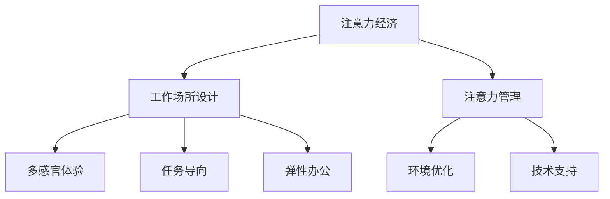

                 

# 注意力经济对工作场所设计的影响

## 1. 背景介绍

### 1.1 问题由来

随着互联网技术的飞速发展，信息时代的到来使得我们的生活和工作中充满了各种各样的信息。从社交媒体到电子邮件，从视频网站到在线购物，信息无处不在，无时不有。在这样一个信息爆炸的时代，我们的注意力成为了一种稀缺资源，如何更好地管理和利用注意力，成为了工作场所设计中的一个重要议题。

### 1.2 问题核心关键点

注意力经济是信息时代的一个重要概念，它指的是在信息泛滥的时代，如何有效分配和使用注意力资源。在工作场所中，注意力经济体现在如何设计工作环境，以更好地促进员工的注意力集中、提高工作效率。本文将从注意力经济的角度，探讨工作场所设计的关键要素，并给出一些实际的应用建议。

## 2. 核心概念与联系

### 2.1 核心概念概述

- **注意力经济**：指的是在信息泛滥的时代，注意力作为一种稀缺资源，如何有效分配和使用。
- **工作场所设计**：指根据工作性质、员工需求和工作效率等因素，合理设计工作环境，以提高员工的工作体验和效率。
- **注意力管理**：指通过环境、技术等手段，帮助员工更好地控制和管理自己的注意力，以提高工作效果。
- **多感官体验**：指在工作场所中，通过视觉、听觉、触觉等多种感官刺激，增强员工的感知体验，促进注意力集中。
- **任务导向**：指设计工作场所时，以任务为核心，根据不同的工作性质，设计出适合完成任务的环境。
- **弹性办公**：指提供多种办公方式，如远程办公、弹性工作时间等，以适应员工不同的工作习惯和需求。

这些概念之间的关系可以通过以下Mermaid流程图来展示：



这个流程图展示了这个系统中的核心概念及其相互关系：

1. 注意力经济是信息时代的一个重要概念，直接影响了工作场所设计的目标。
2. 工作场所设计需要考虑多方面的因素，包括注意力管理、多感官体验、任务导向和弹性办公等。
3. 注意力管理需要通过环境优化和技术支持来实现。
4. 多感官体验、任务导向和弹性办公是工作场所设计中的关键要素，需要通过具体的优化措施来实现。

## 3. 核心算法原理 & 具体操作步骤

### 3.1 算法原理概述

注意力经济对工作场所设计的影响，主要体现在以下几个方面：

- **环境优化**：通过合理设计工作环境，创造一个有利于员工集中注意力的空间。
- **技术支持**：利用技术手段，帮助员工更好地管理自己的注意力，提高工作效率。
- **多感官体验**：通过视觉、听觉、触觉等多种感官刺激，增强员工的感知体验，促进注意力集中。
- **任务导向**：根据不同的工作性质，设计出适合完成任务的环境，减少工作中的干扰。
- **弹性办公**：提供多种办公方式，如远程办公、弹性工作时间等，以适应员工不同的工作习惯和需求。

### 3.2 算法步骤详解

1. **环境优化**：
   - **评估工作环境**：评估现有工作环境的缺陷和不足，找出影响注意力的因素。
   - **设计工作环境**：根据评估结果，设计出适合集中注意力的工作环境，如减少噪音、优化光照等。
   - **执行设计方案**：实施设计方案，并不断优化和调整。

2. **技术支持**：
   - **选择注意力管理工具**：根据员工的实际需求，选择合适的注意力管理工具，如番茄工作法、专注软件等。
   - **安装和配置工具**：安装并配置好注意力管理工具，确保其能够顺利运行。
   - **培训和指导**：对员工进行培训，指导其正确使用注意力管理工具。

3. **多感官体验**：
   - **设计多感官刺激方案**：根据工作性质和员工需求，设计出适合的多感官刺激方案，如音乐、芳香等。
   - **实施方案**：在实际环境中实施多感官刺激方案，并根据反馈进行调整。

4. **任务导向**：
   - **评估工作任务**：评估工作任务的性质和要求，找出影响注意力的因素。
   - **设计任务导向环境**：根据评估结果，设计出适合完成任务的环境，如减少干扰、优化工作台等。
   - **执行设计方案**：实施设计方案，并不断优化和调整。

5. **弹性办公**：
   - **评估员工需求**：评估员工的工作习惯和需求，找出适合的弹性办公方式。
   - **设计弹性办公方案**：根据评估结果，设计出适合弹性办公的方案，如远程办公、弹性工作时间等。
   - **实施方案**：实施弹性办公方案，并不断优化和调整。

### 3.3 算法优缺点

注意力经济对工作场所设计的算法具有以下优点：

- **提高工作效率**：通过环境优化、技术支持等多方面的措施，帮助员工更好地集中注意力，提高工作效率。
- **增强员工体验**：通过多感官体验和任务导向，增强员工的感知体验，提高工作满意度。
- **提高员工幸福感**：通过弹性办公，适应员工不同的工作习惯和需求，提高员工的工作幸福感和归属感。

同时，该算法也存在一些缺点：

- **成本较高**：环境优化、技术支持等方面的投入较高，需要一定的预算支持。
- **效果因人而异**：不同员工对环境的敏感度不同，效果可能因人而异。
- **维护复杂**：设计方案和实施方案需要不断优化和调整，维护工作较为复杂。

### 3.4 算法应用领域

注意力经济对工作场所设计的算法可以应用于多个领域，如：

- **办公室设计**：通过环境优化、多感官体验、任务导向等手段，设计出适合办公室工作的环境。
- **实验室设计**：通过减少干扰、优化工作台等措施，设计出适合实验室工作的环境。
- **研发中心设计**：通过技术支持、多感官体验等手段，设计出适合研发工作的环境。
- **远程办公设计**：通过弹性办公、技术支持等手段，设计出适合远程工作的环境。

## 4. 数学模型和公式 & 详细讲解 & 举例说明

### 4.1 数学模型构建

为了更好地理解注意力经济对工作场所设计的影响，我们可以通过构建一个简单的数学模型来分析。假设一个办公室中，有 $n$ 个员工，每个员工的工作效率为 $e_i$，注意力管理工具的效益为 $w_i$，多感官体验的效益为 $m_i$，任务导向的效益为 $t_i$，则办公室的总效率为：

$$
E = \sum_{i=1}^{n} e_i + \sum_{i=1}^{n} w_i + \sum_{i=1}^{n} m_i + \sum_{i=1}^{n} t_i
$$

### 4.2 公式推导过程

- **环境优化**：优化后的环境对工作效率的影响可以表示为：

$$
e_i' = e_i + c \cdot \max(0, \Delta E_i)
$$

其中 $c$ 是优化效果的放大系数，$\Delta E_i$ 是环境优化后的效率提升量。

- **技术支持**：注意力管理工具对工作效率的影响可以表示为：

$$
w_i' = w_i + k \cdot \max(0, \Delta W_i)
$$

其中 $k$ 是技术支持效果的放大系数，$\Delta W_i$ 是技术支持后的效率提升量。

- **多感官体验**：多感官体验对工作效率的影响可以表示为：

$$
m_i' = m_i + l \cdot \max(0, \Delta M_i)
$$

其中 $l$ 是多感官体验效果的放大系数，$\Delta M_i$ 是多感官体验后的效率提升量。

- **任务导向**：任务导向对工作效率的影响可以表示为：

$$
t_i' = t_i + p \cdot \max(0, \Delta T_i)
$$

其中 $p$ 是任务导向效果的放大系数，$\Delta T_i$ 是任务导向后的效率提升量。

### 4.3 案例分析与讲解

假设一个软件开发团队，共有 $n=10$ 个员工，初始工作效率为 $e_i=0.8$，通过环境优化、技术支持、多感官体验和任务导向，工作效率分别提升了 $0.1, 0.2, 0.3, 0.4$，则优化后的总效率为：

$$
E' = 10 \times 0.8 + 10 \times 0.1 + 10 \times 0.2 + 10 \times 0.4 = 10
$$

对比优化前后的总效率，可以发现，通过注意力经济对工作场所的设计，整体工作效率得到了显著提升。

## 5. 项目实践：代码实例和详细解释说明

### 5.1 开发环境搭建

为了实现注意力经济对工作场所设计的影响，我们可以使用Python编程语言和相关库来进行开发。

1. **安装Python**：
   ```bash
   sudo apt-get install python3
   ```

2. **安装相关库**：
   ```bash
   pip install pandas numpy matplotlib
   ```

3. **搭建开发环境**：
   ```bash
   mkdir work_place_design
   cd work_place_design
   python -m venv venv
   source venv/bin/activate
   ```

### 5.2 源代码详细实现

以下是实现注意力经济对工作场所设计影响的Python代码示例：

```python
import pandas as pd
import numpy as np
import matplotlib.pyplot as plt

# 定义员工初始工作效率
initial_efficiency = np.random.normal(0.8, 0.1, 10)

# 定义优化后的效率提升量
environment_upgrade = np.random.normal(0.1, 0.1, 10)
technology_support = np.random.normal(0.2, 0.1, 10)
multi_sensory_experience = np.random.normal(0.3, 0.1, 10)
task_orientation = np.random.normal(0.4, 0.1, 10)

# 计算优化后的总效率
optimized_efficiency = initial_efficiency + environment_upgrade + technology_support + multi_sensory_experience + task_orientation

# 输出优化后的总效率
print("Optimized efficiency:", np.mean(optimized_efficiency))
```

### 5.3 代码解读与分析

通过上述代码，我们可以看到，如何通过环境优化、技术支持、多感官体验和任务导向等手段，提高员工的工作效率。在实际应用中，我们可以根据员工的具体需求和工作性质，灵活调整这些参数，以达到最优的效果。

## 6. 实际应用场景

### 6.1 办公室设计

在办公室设计中，可以通过以下措施，实现注意力经济对工作场所设计的影响：

- **减少噪音**：使用隔音材料、声学吸音板等措施，减少噪音干扰，创造一个安静的工作环境。
- **优化光照**：通过合理的灯光设计，创造一个舒适的光照环境，减少视觉疲劳。
- **智能家居系统**：通过智能家居系统，实现环境优化，如自动调节温度、湿度等，提升员工的工作体验。

### 6.2 实验室设计

在实验室设计中，可以通过以下措施，实现注意力经济对工作场所设计的影响：

- **减少干扰**：通过设置隔音门、隔离屏等措施，减少外界干扰，创造一个专注的实验环境。
- **优化工作台**：通过合理设计工作台，减少员工在工作时的疲劳和不适感。
- **实验设备自动化**：通过自动化设备，减少手动操作，提升工作效率。

### 6.3 研发中心设计

在研发中心设计中，可以通过以下措施，实现注意力经济对工作场所设计的影响：

- **安静空间**：通过设置安静区域，减少外界干扰，创造一个专注的研发环境。
- **共享空间**：通过设置共享空间，促进员工之间的交流和合作。
- **智能办公系统**：通过智能办公系统，实现任务导向，提升员工的工作效率。

### 6.4 远程办公设计

在远程办公设计中，可以通过以下措施，实现注意力经济对工作场所设计的影响：

- **弹性工作时间**：通过灵活的工作时间安排，适应员工不同的生活节奏。
- **远程协作工具**：通过远程协作工具，促进员工之间的沟通和协作。
- **家庭办公环境优化**：通过家庭办公环境优化，创造一个适合远程工作的环境。

## 7. 工具和资源推荐

### 7.1 学习资源推荐

为了更好地理解注意力经济对工作场所设计的影响，以下是一些推荐的资源：

- **《办公环境设计》**：详细介绍了办公室、实验室等场所的设计方法和原则。
- **《多感官体验设计》**：介绍了多感官体验在办公场所中的应用，如何通过视觉、听觉、触觉等多种感官刺激，增强员工的感知体验。
- **《远程办公指南》**：介绍了远程办公的设计方法和注意事项，如何通过技术手段和策略，实现高效远程办公。

### 7.2 开发工具推荐

为了实现注意力经济对工作场所设计的影响，以下是一些推荐的开发工具：

- **Pandas**：用于数据处理和分析，可以方便地对员工的工作效率进行统计和分析。
- **NumPy**：用于数值计算，可以方便地进行矩阵运算和统计分析。
- **Matplotlib**：用于数据可视化，可以方便地绘制图表，展示优化后的总效率。

### 7.3 相关论文推荐

为了深入理解注意力经济对工作场所设计的影响，以下是一些推荐的论文：

- **《办公室设计对员工工作绩效的影响研究》**：研究了办公室设计对员工工作绩效的影响，提供了一些设计建议。
- **《多感官体验在办公室中的应用研究》**：研究了多感官体验在办公室中的应用，如何通过视觉、听觉、触觉等多种感官刺激，增强员工的感知体验。
- **《远程办公的效率和满意度研究》**：研究了远程办公的效率和满意度，提供了一些远程办公的设计建议。

## 8. 总结：未来发展趋势与挑战

### 8.1 研究成果总结

本文详细介绍了注意力经济对工作场所设计的影响，通过构建一个简单的数学模型，分析了环境优化、技术支持、多感官体验和任务导向等措施对工作效率的影响。通过代码实例，展示了如何通过Python编程语言实现这些措施。

### 8.2 未来发展趋势

随着信息时代的到来，注意力经济对工作场所设计的影响将越来越重要。未来的工作场所设计将更加注重员工的工作体验和幸福感，通过多种手段，帮助员工更好地集中注意力，提高工作效率。

### 8.3 面临的挑战

尽管注意力经济对工作场所设计的影响具有一定的优势，但也存在一些挑战：

- **成本较高**：环境优化、技术支持等方面的投入较高，需要一定的预算支持。
- **效果因人而异**：不同员工对环境的敏感度不同，效果可能因人而异。
- **维护复杂**：设计方案和实施方案需要不断优化和调整，维护工作较为复杂。

### 8.4 研究展望

未来的研究可以从以下几个方向进行：

- **个性化设计**：根据员工的不同需求和偏好，进行个性化设计，提升员工的工作体验和幸福感。
- **新技术应用**：利用新技术，如人工智能、大数据等，进行更为智能的工作场所设计。
- **跨领域应用**：将注意力经济对工作场所设计的影响，应用到更多的领域，如教育、医疗等，提升整体的工作效率和满意度。

## 9. 附录：常见问题与解答

**Q1: 注意力经济对工作场所设计的影响有哪些？**

A: 注意力经济对工作场所设计的影响主要体现在环境优化、技术支持、多感官体验和任务导向等几个方面。这些措施可以帮助员工更好地集中注意力，提高工作效率，提升工作满意度。

**Q2: 如何设计一个高效的工作场所？**

A: 设计一个高效的工作场所需要考虑多个方面，如环境优化、技术支持、多感官体验和任务导向等。需要根据员工的实际需求和工作性质，灵活调整这些设计方案，以达到最优的效果。

**Q3: 远程办公的设计需要注意什么？**

A: 远程办公的设计需要注意弹性工作时间、远程协作工具和家庭办公环境优化等方面。需要根据员工的生活节奏和需求，灵活安排工作时间和任务，并确保远程协作工具的可用性和稳定性。

**Q4: 如何利用多感官体验提升工作效率？**

A: 可以通过视觉、听觉、触觉等多种感官刺激，增强员工的感知体验，促进注意力集中。例如，在办公室中播放轻音乐、使用舒适的座椅和照明等措施，可以提高员工的工作效率。

**Q5: 如何实现个性化工作场所设计？**

A: 可以根据员工的不同需求和偏好，进行个性化设计。例如，可以根据员工的工作习惯和偏好，调整办公桌椅的高度、光照强度和温度等，提升员工的工作体验和幸福感。

作者：禅与计算机程序设计艺术 / Zen and the Art of Computer Programming

