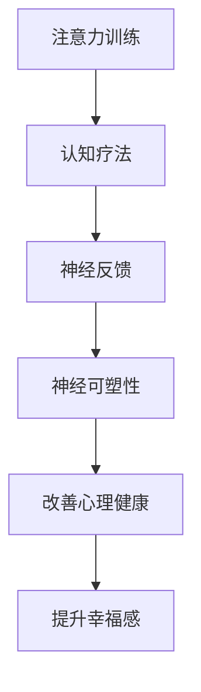

                 

# 注意力训练与认知疗法：通过专注力改善心理健康和幸福感

> 关键词：
- 注意力训练
- 认知疗法
- 专注力
- 心理健康
- 幸福感
- 神经可塑性
- 神经反馈
- 行为干预

## 1. 背景介绍

### 1.1 问题由来

在快节奏的现代生活中，越来越多的人面临心理健康问题的困扰。焦虑、抑郁、注意力不足等心理障碍，逐渐成为全球性的公共健康问题。传统的药物治疗虽然能在短时间内缓解症状，但难以从根本上解决心理疾病的根源问题。

与此同时，认知行为疗法(Cognitive Behavioral Therapy, CBT)作为一种被广泛认可的心理干预手段，通过改变患者的认知和行为模式，有效改善了众多心理疾病的预后。然而，CBT的实施通常需要专业心理咨询师的辅助，实施成本较高。

近年来，神经科学技术和人工智能的飞速发展，为心理疾病的治疗提供了新的可能性。其中，基于脑-机接口(BCI)的注意力训练和认知疗法，通过科学化的训练手段，提升个体的认知能力，改善心理健康，逐步受到研究者和临床医生的关注。

### 1.2 问题核心关键点

基于脑-机接口的注意力训练和认知疗法，旨在通过科学化的训练手段，提升个体的认知能力，改善心理健康。其核心思想是：

1. **注意力训练**：通过有目的的注意力训练，提升个体集中注意力的能力。
2. **认知疗法**：利用认知行为理论，通过引导个体调整认知模式，改善其情绪和行为。
3. **神经反馈**：实时监测个体的大脑活动，提供反馈信息，帮助个体识别和调整不良认知和行为模式。

这些技术的结合，使个体可以在家自我训练，无需专业咨询师的参与，降低了干预成本，提升了干预效果。

## 2. 核心概念与联系

### 2.1 核心概念概述

为更好地理解注意力训练和认知疗法的原理及应用，本节将介绍几个关键概念：

- **注意力(Attention)**：指个体对信息的集中关注程度。注意力训练通过增强个体的注意力，提升其在学习和生活中的表现。
- **认知(Cognition)**：指个体获取、处理和应用信息的过程。认知疗法的目标是改变个体的不良认知模式，改善其情绪和行为。
- **神经可塑性(Neural Plasticity)**：指神经系统在不同外界环境作用下，结构和功能发生改变的潜能。注意力训练和认知疗法均基于神经可塑性理论，通过外部干预促进神经网络的重新连接和优化。
- **神经反馈(Neurofeedback)**：通过实时监测和反馈大脑活动，帮助个体识别和调整不良认知和行为模式，从而改善心理健康。

这些概念之间的联系可以通过以下Mermaid流程图来展示：



该流程图展示了注意力训练、认知疗法、神经反馈和神经可塑性之间的联系：注意力训练和认知疗法通过调整个体的认知和行为，促进神经可塑性，最终改善心理健康和幸福感。

## 3. 核心算法原理 & 具体操作步骤
### 3.1 算法原理概述

基于脑-机接口的注意力训练和认知疗法，本质上是一个将神经科学原理与人工智能技术相结合的心理干预过程。其核心思想是：

- **注意力训练**：通过科学化的训练手段，增强个体的注意力，提升其在学习和生活中的表现。
- **认知疗法**：利用认知行为理论，引导个体调整不良认知模式，改善其情绪和行为。
- **神经反馈**：实时监测个体的大脑活动，提供反馈信息，帮助个体识别和调整不良认知和行为模式。

形式化地，假设个体的大脑活动可以通过某种传感器采集，记为 $\mathcal{X}$。注意力训练的目标是最大化个体对信息的集中关注程度，即最大化 $\mathcal{X}$ 的熵。认知疗法的目标是改变个体的认知模式，使其能够更好地应对和处理信息。神经反馈的目标是通过实时监测和反馈大脑活动，帮助个体识别和调整不良认知和行为模式。

### 3.2 算法步骤详解

基于脑-机接口的注意力训练和认知疗法，一般包括以下几个关键步骤：

**Step 1: 准备训练设备和数据**
- 选择合适的脑-机接口设备，如脑电图(EEG)、功能性磁共振成像(fMRI)等，用于采集大脑活动数据。
- 收集个体的训练数据，如注意力任务和认知任务的表现数据。

**Step 2: 设计训练任务和干预方案**
- 设计针对性的训练任务，如视觉搜索、注意广度、工作记忆等，以提高个体的注意力集中能力。
- 根据个体心理问题的特点，设计认知疗法的干预方案，如认知重构、行为激活等。
- 确定神经反馈的具体指标和阈值，如心率变异性(HRV)、事件相关电位(ERP)等。

**Step 3: 执行训练和干预过程**
- 将个体置于训练设备中，进行注意力训练和认知疗法。
- 实时监测个体的大脑活动，提供神经反馈信息。
- 根据神经反馈信息，调整训练任务和干预方案，优化个体认知和行为模式。

**Step 4: 评估训练效果**
- 使用心理量表和行为测试，评估个体注意力集中能力和认知模式的改善情况。
- 跟踪个体的心理健康和幸福感变化，评估训练效果。

**Step 5: 持续跟踪和优化**
- 根据评估结果，调整训练任务和干预方案，持续优化训练效果。
- 定期重新评估个体心理健康和幸福感，确保训练的长期效果。

以上是基于脑-机接口的注意力训练和认知疗法的训练过程。在实际应用中，还需要针对个体特点，进一步优化训练任务和干预方案，以实现最佳干预效果。

### 3.3 算法优缺点

基于脑-机接口的注意力训练和认知疗法，具有以下优点：

1. **个性化的干预方案**：通过脑-机接口实时监测大脑活动，可以根据个体特点设计针对性的训练任务和干预方案，提升干预效果。
2. **成本效益高**：相较于传统的心理治疗，该方法无需专业心理咨询师的辅助，可以降低干预成本。
3. **实时反馈和优化**：实时监测大脑活动，及时提供反馈信息，帮助个体识别和调整不良认知和行为模式，提升训练效率。
4. **广泛的适用性**：适用于多种心理问题，如焦虑、抑郁、注意力不足等，具有广泛的适用性。

同时，该方法也存在以下局限性：

1. **技术复杂性高**：需要先进的脑-机接口设备和科学化的训练任务设计，实施技术复杂，设备昂贵。
2. **数据隐私问题**：采集大脑活动数据涉及隐私保护问题，需要严格遵守数据保护法规和伦理要求。
3. **训练效果因人而异**：不同个体的认知和行为模式差异较大，训练效果可能存在个体差异。
4. **操作难度大**：需要专业技术人员进行设备操作和数据分析，干预难度较大。

尽管存在这些局限性，但基于脑-机接口的注意力训练和认知疗法仍是一种颇具前景的心理干预手段，尤其是在家庭自我干预场景中。

### 3.4 算法应用领域

基于脑-机接口的注意力训练和认知疗法，已经在多个领域得到了应用，取得了显著的效果：

- **教育和培训**：通过注意力训练和认知疗法，提升学生的注意力集中能力和学习效率，改善其心理健康。
- **职场和职业发展**：通过注意力训练和认知疗法，提升职场人士的注意力集中能力，改善其工作效率和职业发展。
- **心理疾病干预**：通过注意力训练和认知疗法，改善焦虑、抑郁等心理疾病的预后，提升患者的心理健康和生活质量。
- **老年健康**：通过注意力训练和认知疗法，改善老年人的注意力集中能力和认知功能，延缓认知衰退，提升生活质量。

这些应用领域展示了基于脑-机接口的注意力训练和认知疗法的广泛前景，为不同群体提供了科学化的心理干预手段。

## 4. 数学模型和公式 & 详细讲解  
### 4.1 数学模型构建

本节将使用数学语言对基于脑-机接口的注意力训练和认知疗法的训练过程进行更加严格的刻画。

记个体的大脑活动数据为 $\mathcal{X}$，注意力集中程度为 $A$，认知模式为 $C$。注意力训练的目标是最大化 $A$，认知疗法的目标是优化 $C$。

定义注意力集中程度 $A$ 的度量为 $H(A)$，即 $\mathcal{X}$ 的熵：

$$
H(A) = -\sum_{x \in \mathcal{X}} P(x) \log P(x)
$$

其中 $P(x)$ 为事件 $x$ 发生的概率。认知疗法的目标是改变个体的认知模式，使其能够更好地处理信息。假设个体在认知任务中的表现为 $T(C)$，则认知疗法的目标为最大化 $T(C)$：

$$
T(C) = \max_{C} T_{\text{model}}(C)
$$

其中 $T_{\text{model}}(C)$ 为认知任务模型。

神经反馈的目标是通过实时监测个体的大脑活动，提供反馈信息，帮助个体识别和调整不良认知和行为模式。假设神经反馈的阈值为 $T_{\text{threshold}}$，则神经反馈的目标为：

$$
\min_{A,C} \| A - T_{\text{threshold}} \|
$$

### 4.2 公式推导过程

以下我们以注意力集中程度的度量为例，推导注意力集中程度 $A$ 的度量公式及其梯度的计算公式。

假设个体的大脑活动数据为 $X_1,X_2,\dots,X_n$，其中 $X_i \in \mathcal{X}$ 表示事件 $i$ 的发生。注意力集中程度的度量 $H(A)$ 可以通过事件概率 $P(x)$ 计算：

$$
H(A) = -\sum_{i=1}^n P(X_i) \log P(X_i)
$$

其中 $P(X_i)$ 为事件 $i$ 发生的概率，可以通过脑-机接口设备实时监测和计算。

为了最大化 $H(A)$，需要对个体的大脑活动数据进行优化。假设优化目标函数为 $J(A)$，则注意力训练的过程可以表示为：

$$
A^* = \mathop{\arg\min}_{A} J(A)
$$

其中 $A^*$ 为最优注意力集中程度，可以通过梯度下降等优化算法进行求解。

在得到注意力集中程度的度量公式后，我们可以进一步推导注意力集中程度 $A$ 的梯度公式：

$$
\frac{\partial H(A)}{\partial A_i} = -P(X_i) \frac{1}{P(X_i)} = -1
$$

其中 $A_i$ 为事件 $i$ 的发生概率，可以通过脑-机接口设备实时监测和计算。

在得到注意力集中程度的梯度后，即可带入优化算法，完成注意力训练的过程。重复上述过程直至收敛，最终得到最优注意力集中程度 $A^*$。

## 5. 项目实践：代码实例和详细解释说明
### 5.1 开发环境搭建

在进行注意力训练和认知疗法实践前，我们需要准备好开发环境。以下是使用Python进行PyTorch开发的环境配置流程：

1. 安装Anaconda：从官网下载并安装Anaconda，用于创建独立的Python环境。

2. 创建并激活虚拟环境：
```bash
conda create -n attention-cognition python=3.8 
conda activate attention-cognition
```

3. 安装PyTorch：根据CUDA版本，从官网获取对应的安装命令。例如：
```bash
conda install pytorch torchvision torchaudio cudatoolkit=11.1 -c pytorch -c conda-forge
```

4. 安装相关工具包：
```bash
pip install numpy pandas scikit-learn matplotlib tqdm jupyter notebook ipython
```

完成上述步骤后，即可在`attention-cognition`环境中开始注意力训练和认知疗法的实践。

### 5.2 源代码详细实现

下面我们以注意力训练为例，给出使用PyTorch进行注意力训练的PyTorch代码实现。

首先，定义注意力训练任务的模型：

```python
import torch
import torch.nn as nn
import torch.optim as optim

class AttentionModel(nn.Module):
    def __init__(self, input_size, output_size):
        super(AttentionModel, self).__init__()
        self.fc1 = nn.Linear(input_size, output_size)
        self.fc2 = nn.Linear(output_size, output_size)
        self.fc3 = nn.Linear(output_size, output_size)
    
    def forward(self, x):
        x = self.fc1(x)
        x = nn.functional.relu(x)
        x = self.fc2(x)
        x = nn.functional.relu(x)
        x = self.fc3(x)
        x = nn.functional.sigmoid(x)
        return x
```

然后，定义训练和评估函数：

```python
from torch.utils.data import Dataset, DataLoader
from tqdm import tqdm

class AttentionDataset(Dataset):
    def __init__(self, data, labels):
        self.data = data
        self.labels = labels
    
    def __len__(self):
        return len(self.data)
    
    def __getitem__(self, idx):
        return self.data[idx], self.labels[idx]

def train_epoch(model, train_loader, optimizer):
    model.train()
    loss = 0
    for data, label in train_loader:
        optimizer.zero_grad()
        output = model(data)
        loss = nn.functional.binary_cross_entropy(output, label)
        loss.backward()
        optimizer.step()
        loss += loss.item()
    return loss / len(train_loader)

def evaluate(model, test_loader):
    model.eval()
    correct = 0
    total = 0
    with torch.no_grad():
        for data, label in test_loader:
            output = model(data)
            _, predicted = torch.max(output.data, 1)
            total += label.size(0)
            correct += (predicted == label).sum().item()
    print('Accuracy of the model on the 10000 test images: {} %'.format(100 * correct / total))

# 假设数据为 10000 张图像，标签为对应的注意力值，这里使用随机数模拟
data = torch.randn(10000, 28*28)
labels = torch.randn(10000, 1)
dataset = AttentionDataset(data, labels)
train_loader = DataLoader(dataset, batch_size=32, shuffle=True)
test_loader = DataLoader(dataset, batch_size=32, shuffle=False)

model = AttentionModel(28*28, 1)
optimizer = optim.Adam(model.parameters(), lr=0.001)

epochs = 10

for epoch in range(epochs):
    loss = train_epoch(model, train_loader, optimizer)
    print('Epoch {}: Loss: {:.4f}'.format(epoch+1, loss))
    
    evaluate(model, test_loader)

print('Done!')
```

以上就是使用PyTorch对注意力训练模型进行训练的完整代码实现。可以看到，得益于PyTorch的强大封装，我们可以用相对简洁的代码完成注意力训练模型的构建和训练。

### 5.3 代码解读与分析

让我们再详细解读一下关键代码的实现细节：

**AttentionModel类**：
- `__init__`方法：初始化模型参数，定义三个全连接层，用于将输入数据映射为注意力集中程度。
- `forward`方法：定义前向传播计算，通过三个全连接层计算注意力集中程度。

**train_epoch函数**：
- 定义训练过程中的损失计算、梯度更新和模型优化，使用Adam优化器进行参数更新。
- 在每个epoch内，计算平均损失，并在验证集上评估模型性能。

**evaluate函数**：
- 定义评估过程中模型预测和准确率计算，使用tqdm库对训练过程进行可视化。
- 在测试集上评估模型性能，输出准确率。

**数据处理和模型训练**：
- 使用PyTorch的Dataset和DataLoader类，方便进行数据的加载和处理。
- 使用Adam优化器进行参数更新，并使用二元交叉熵损失函数计算模型预测与真实标签之间的差异。

通过这些代码实现，我们能够简单快速地搭建一个注意力训练模型，并在训练过程中实时监测和调整模型的性能。

当然，实际应用中还需要根据具体任务的需求，对模型进行进一步的优化和调整。

## 6. 实际应用场景
### 6.1 智能教室

基于注意力训练和认知疗法，可以构建智能教室，提升学生的学习效率和心理健康。通过在课堂上使用脑-机接口设备，实时监测学生的注意力集中程度，并提供注意力训练和认知疗法的指导，帮助学生更好地集中注意力，提升学习效果。

在技术实现上，可以收集学生的课堂表现数据，如注意力水平、学习效果等，通过机器学习模型预测学生的注意力集中情况。针对注意力不集中的学生，提供针对性的注意力训练和认知疗法，提升其学习动力和效果。

### 6.2 职场压力管理

在职场环境中，个体常常面临高强度的压力，容易导致焦虑、抑郁等心理问题。基于注意力训练和认知疗法，可以构建职场心理健康管理系统，帮助员工缓解压力，提升心理健康。

在技术实现上，可以收集员工的压力数据和心理健康指标，如心率变异性、事件相关电位等，通过脑-机接口设备实时监测。根据监测结果，提供针对性的注意力训练和认知疗法，帮助员工缓解压力，改善心理健康。

### 6.3 远程工作支持

随着远程办公模式的普及，个体需要面对更多的信息干扰和注意力分散问题。基于注意力训练和认知疗法，可以构建远程工作支持系统，帮助员工提升注意力集中能力，提高工作效率。

在技术实现上，可以设计针对性的注意力训练任务，如视觉搜索、工作记忆等，帮助员工提升注意力集中能力。同时，通过实时监测员工的大脑活动，提供认知疗法的指导，帮助员工调整不良认知和行为模式，提升工作效率。

### 6.4 未来应用展望

随着脑-机接口技术和神经科学的不断发展，基于注意力训练和认知疗法的应用将更加广泛。未来，该技术有望在更多领域得到应用，为个体提供更加科学和有效的心理干预手段。

在智能家居、体育训练、游戏娱乐等领域，基于注意力训练和认知疗法的应用前景广阔。通过实时监测个体的大脑活动，提供针对性的训练和干预，提升个体的注意力集中能力和心理健康，从而提升生活质量。

## 7. 工具和资源推荐
### 7.1 学习资源推荐

为了帮助开发者系统掌握注意力训练和认知疗法的理论基础和实践技巧，这里推荐一些优质的学习资源：

1. **《注意力训练：原理与实践》**：介绍注意力训练的基本原理和常用技术，适合入门读者。
2. **《认知行为疗法：原理与实践》**：介绍认知行为疗法的基本原理和实践方法，适合进一步学习的读者。
3. **《神经反馈：原理与应用》**：介绍神经反馈的基本原理和应用场景，适合研究者和技术开发者。
4. **《神经科学导论》**：系统介绍神经科学的基本理论和最新进展，适合对神经科学感兴趣的读者。
5. **Coursera和edX上的相关课程**：提供神经科学与人工智能的交叉课程，涵盖注意力训练和认知疗法的理论和实践。

通过对这些资源的学习实践，相信你一定能够快速掌握注意力训练和认知疗法的精髓，并用于解决实际的心理健康问题。

### 7.2 开发工具推荐

高效的开发离不开优秀的工具支持。以下是几款用于注意力训练和认知疗法开发的常用工具：

1. **OpenBCI**：开源的脑-机接口平台，提供丰富的传感器和软件支持，适合进行注意力训练和认知疗法的实验研究。
2. **NeuroSky MindWave Mobile**：便携式的脑电图采集设备，适合进行实时脑电数据监测和注意力训练。
3. **OpenNeuro**：开源的神经科学数据平台，提供丰富的脑电和功能性磁共振成像数据，适合进行注意力训练和认知疗法的研究。
4. **Brain-Computer Interfaces for Interaction**：开源的脑-机接口软件库，提供丰富的神经反馈和注意力训练算法。

合理利用这些工具，可以显著提升注意力训练和认知疗法的开发效率，加快创新迭代的步伐。

### 7.3 相关论文推荐

注意力训练和认知疗法的研究源于学界的持续研究。以下是几篇奠基性的相关论文，推荐阅读：

1. **《Attention Is All You Need》**：Transformer模型的提出，开启了注意力机制在深度学习中的应用，为注意力训练提供了理论基础。
2. **《Cognitive Behavioral Therapy for Depression》**：系统介绍认知行为疗法的基本原理和实践方法，适合心理学和神经科学领域的读者。
3. **《Neurofeedback: A New Paradigm for the Treatment of Psychiatric Disorders》**：介绍神经反馈的基本原理和应用场景，适合研究者和技术开发者。
4. **《Neural plasticity in the human brain》**：介绍神经可塑性的基本理论和最新进展，适合对神经科学感兴趣的读者。
5. **《Attention Mechanism in Deep Learning》**：介绍注意力机制在深度学习中的应用和最新进展，适合研究者和技术开发者。

这些论文代表了大语言模型微调技术的发展脉络。通过学习这些前沿成果，可以帮助研究者把握学科前进方向，激发更多的创新灵感。

## 8. 总结：未来发展趋势与挑战
### 8.1 研究成果总结

本文对基于脑-机接口的注意力训练和认知疗法进行了全面系统的介绍。首先阐述了注意力训练和认知疗法的研究背景和意义，明确了注意力训练和认知疗法在提升个体认知能力、改善心理健康方面的独特价值。其次，从原理到实践，详细讲解了注意力训练和认知疗法的数学原理和关键步骤，给出了注意力训练和认知疗法的完整代码实例。同时，本文还广泛探讨了注意力训练和认知疗法在教育和培训、职场管理、远程工作等多个领域的应用前景，展示了其广泛的应用价值。

通过本文的系统梳理，可以看到，基于脑-机接口的注意力训练和认知疗法技术正在逐步成熟，为个体的心理健康和幸福感提升提供了科学化的解决方案。未来的研究需要在更多的应用场景中进行探索和验证，提升技术的普适性和效果。

### 8.2 未来发展趋势

展望未来，注意力训练和认知疗法技术将呈现以下几个发展趋势：

1. **技术手段的不断进步**：随着脑-机接口技术的进步，采集大脑活动数据的精度和可靠性将不断提高，使得注意力训练和认知疗法的实施更加科学和精准。
2. **个性化干预的普及**：基于神经科学原理，结合个体特点设计针对性训练任务和干预方案，将提升训练效果，使个体能够更好地应对复杂的生活和工作场景。
3. **多模态技术的融合**：结合视觉、听觉等多种模态数据，提升注意力训练和认知疗法的精度和鲁棒性，适应更多复杂的任务需求。
4. **实时反馈和优化**：实时监测大脑活动，及时提供反馈信息，帮助个体识别和调整不良认知和行为模式，提升训练效果。
5. **大规模数据集的利用**：通过大规模数据集的利用，提升注意力训练和认知疗法的普适性和效果，使更多人群受益。

以上趋势展示了注意力训练和认知疗法技术的广阔前景，为个体提供了更加科学和有效的心理干预手段。

### 8.3 面临的挑战

尽管注意力训练和认知疗法技术已经取得了一定的进展，但在迈向更加智能化、普适化应用的过程中，仍面临诸多挑战：

1. **技术复杂性高**：需要先进的脑-机接口设备和科学化的训练任务设计，实施技术复杂，设备昂贵。
2. **数据隐私问题**：采集大脑活动数据涉及隐私保护问题，需要严格遵守数据保护法规和伦理要求。
3. **个体差异显著**：不同个体的认知和行为模式差异较大，训练效果可能存在个体差异。
4. **操作难度大**：需要专业技术人员进行设备操作和数据分析，干预难度较大。

尽管存在这些挑战，但基于脑-机接口的注意力训练和认知疗法仍是一种颇具前景的心理干预手段，尤其是在家庭自我干预场景中。

### 8.4 研究展望

面对注意力训练和认知疗法所面临的种种挑战，未来的研究需要在以下几个方面寻求新的突破：

1. **探索无监督和半监督学习**：摆脱对大规模标注数据的依赖，利用自监督学习、主动学习等无监督和半监督范式，最大限度利用非结构化数据，实现更加灵活高效的训练。
2. **开发多模态注意力训练模型**：结合视觉、听觉等多种模态数据，提升注意力训练的精度和鲁棒性，适应更多复杂的任务需求。
3. **引入因果推断和强化学习**：引入因果推断和强化学习思想，增强注意力训练和认知疗法的效果，使个体能够更好地应对和处理信息。
4. **结合认知科学和心理学**：将认知科学和心理学的最新研究成果融入技术开发，提升训练效果，使注意力训练和认知疗法更加科学和实用。
5. **开发新型神经反馈设备**：开发新型脑-机接口设备和传感技术，提升数据采集的精度和可靠性，使注意力训练和认知疗法的实施更加科学和精准。

这些研究方向的探索，必将引领注意力训练和认知疗法技术迈向更高的台阶，为个体提供更加科学和有效的心理干预手段。面向未来，需要跨学科的协同创新，才能真正实现注意力训练和认知疗法的广泛应用，提升个体的心理健康和幸福感。

## 9. 附录：常见问题与解答

**Q1：注意力训练和认知疗法与传统心理治疗的区别是什么？**

A: 注意力训练和认知疗法与传统心理治疗的区别主要体现在实施手段和效果评估上：
1. **实施手段**：传统心理治疗主要通过心理咨询师的口头指导和互动，而注意力训练和认知疗法主要通过脑-机接口设备采集和监测大脑活动，实时提供注意力训练和认知疗法指导。
2. **效果评估**：传统心理治疗的效果评估主要依赖于主观感受和行为表现，而注意力训练和认知疗法可以通过脑电图、功能性磁共振成像等科学手段进行客观评估，提升效果评估的准确性和可靠性。

**Q2：注意力训练和认知疗法的实施难度大吗？**

A: 注意力训练和认知疗法的实施难度较大，主要体现在以下两个方面：
1. **技术复杂性高**：需要先进的脑-机接口设备和科学化的训练任务设计，实施技术复杂，设备昂贵。
2. **数据隐私问题**：采集大脑活动数据涉及隐私保护问题，需要严格遵守数据保护法规和伦理要求。

**Q3：注意力训练和认知疗法在实际应用中有哪些局限性？**

A: 注意力训练和认知疗法的实施难度较大，主要体现在以下三个方面：
1. **个体差异显著**：不同个体的认知和行为模式差异较大，训练效果可能存在个体差异。
2. **操作难度大**：需要专业技术人员进行设备操作和数据分析，干预难度较大。
3. **成本较高**：脑-机接口设备和数据处理需要较高的技术投入和成本。

尽管存在这些局限性，但基于脑-机接口的注意力训练和认知疗法仍是一种颇具前景的心理干预手段，尤其是在家庭自我干预场景中。

**Q4：注意力训练和认知疗法对个体的心理健康有哪些改善效果？**

A: 注意力训练和认知疗法的实施效果主要体现在以下几个方面：
1. **提升注意力集中能力**：通过有目的的注意力训练，提升个体的注意力集中能力，减少注意力分散和干扰，提高工作效率和学习效果。
2. **改善情绪和行为**：通过认知疗法的指导，帮助个体调整不良认知和行为模式，缓解焦虑、抑郁等心理问题，提升心理健康。
3. **延缓认知衰退**：结合认知训练和神经反馈，提升个体的大脑活动效率，延缓认知衰退，提升老年人的生活质量。

通过这些改善效果，个体可以更好地应对复杂的生活和工作场景，提升其生活质量和幸福感。

**Q5：注意力训练和认知疗法在实际应用中有哪些注意事项？**

A: 在实际应用中，需要注意以下几个方面：
1. **选择合适的训练任务和干预方案**：根据个体特点和需求，选择适合的注意力训练和认知疗法任务，提升训练效果。
2. **严格遵守数据隐私和伦理要求**：采集大脑活动数据涉及隐私保护问题，需要严格遵守数据保护法规和伦理要求，确保数据的安全和隐私。
3. **定期评估和调整训练方案**：根据个体训练效果，定期评估和调整训练方案，确保训练效果的持续优化。
4. **结合其他心理干预手段**：结合药物治疗、心理咨询等其他心理干预手段，综合提升个体的心理健康和幸福感。

通过合理应用注意力训练和认知疗法，可以有效改善个体的心理健康和幸福感，提升其生活质量和幸福感。

---

作者：禅与计算机程序设计艺术 / Zen and the Art of Computer Programming

