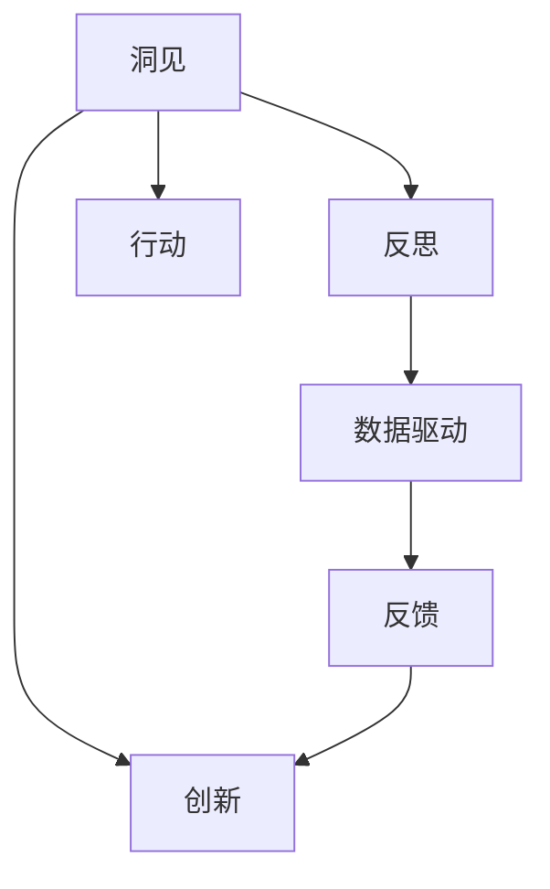
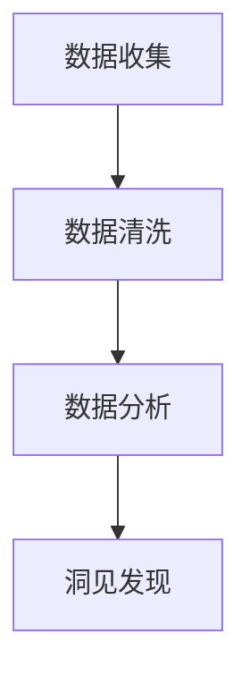
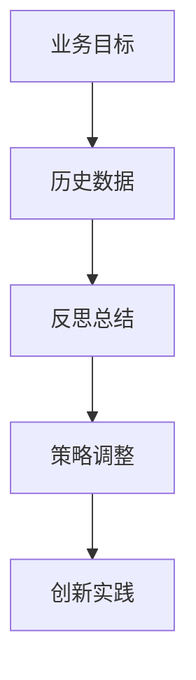

                 

# 洞见的力量：从反思到创新

## 1. 背景介绍

### 1.1 问题由来

在数字化和智能化的浪潮中，数据和算法正以前所未有的速度驱动着各行各业的创新与发展。然而，技术的快速迭代也带来了新的挑战：传统的数据驱动方法开始显示出局限性，决策者面临更多未知和不确定性。如何从海量数据中挖掘出真正的洞见，从而推动业务创新，成为当下急需解决的难题。

### 1.2 问题核心关键点

洞见的力量不仅在于数据的量，更在于数据质的提升。数据驱动的决策需要真正理解和应用数据背后的规律和趋势。这要求我们超越传统的数据挖掘方法，引入更加深刻和全面的分析工具，从而在复杂多变的环境中，把握机会，应对挑战。

## 2. 核心概念与联系

### 2.1 核心概念概述

为了更好地理解洞见的力量，我们需要清晰核心概念及其相互联系。以下是几个关键概念：

- **洞见**：指从数据中挖掘出的，有价值的、能够指导行动的信息。洞见通常基于数据但超越数据，能够揭示深层次的趋势和规律。
- **反思**：指对过去决策和行动的回顾与思考，旨在识别问题根源，总结经验教训，形成对未来决策的指导。
- **创新**：指基于现有洞见和新信息，打破旧有框架，引入新的解决方案或业务模式，带来价值增长。
- **数据驱动**：指在决策过程中，基于数据进行量化分析和预测，减少主观偏见，提升决策科学性。

这些概念之间有着紧密的联系：反思和创新是数据驱动的深化和升华，洞见是实现数据驱动和创新成果的关键桥梁。以下Mermaid流程图展示了这些概念之间的逻辑关系：



### 2.2 核心概念原理和架构的 Mermaid 流程图

由于Mermaid不支持复杂的流程图，这里我们简化为两个简单的流程图：

- **洞见发现流程**：



- **反思创新流程**：



这两个流程图展示了洞见发现和反思创新的基本步骤和架构。

## 3. 核心算法原理 & 具体操作步骤

### 3.1 算法原理概述

洞见的力量主要通过以下算法原理实现：

1. **数据收集与清洗**：收集高质量、相关性强的数据，并对其进行处理，去除噪声和异常值。
2. **数据分析**：应用统计分析、机器学习等方法，提取数据中的关键特征和趋势。
3. **洞见发现**：通过数据可视化、模式识别等手段，揭示数据背后的洞见。
4. **反思与优化**：对已有洞见进行反思和评估，识别潜在的问题和改进空间，调整策略。
5. **创新实践**：基于洞见和新信息，引入新的解决方案或业务模式，进行实际应用。

### 3.2 算法步骤详解

以下详细讲解洞见发现和反思创新的操作步骤：

**Step 1: 数据收集与清洗**

1. **确定数据源**：识别出与业务相关的数据源，包括内部系统、第三方平台、公开数据集等。
2. **数据采集**：通过API接口、爬虫、导入等方式获取数据。
3. **数据清洗**：处理缺失值、异常值，去除重复数据，保证数据质量。

**Step 2: 数据分析**

1. **探索性数据分析**：使用统计图表、频数分析等方法，了解数据基本特征和分布情况。
2. **模型训练与预测**：应用机器学习算法，如回归、分类、聚类等，提取数据中的模式和规律。
3. **特征工程**：构建特征变量，提升模型性能和可解释性。

**Step 3: 洞见发现**

1. **数据可视化**：使用图表、地图等工具，直观展示数据特征和趋势。
2. **模式识别**：应用算法挖掘数据中的关联、异常和变化规律。
3. **洞见总结**：将发现的关键洞见进行归纳和总结，形成文档和报告。

**Step 4: 反思与优化**

1. **洞见评估**：对洞见进行多角度评估，确认其准确性和实用性。
2. **问题识别**：识别洞见背后的潜在问题和挑战。
3. **策略调整**：基于反思结果，调整业务策略和行动计划。

**Step 5: 创新实践**

1. **创新方案设计**：基于洞见和新信息，设计新的解决方案或业务模式。
2. **原型开发**：开发小规模原型或实验，验证方案可行性。
3. **全面实施**：在大规模范围内实施创新方案，监测效果。

### 3.3 算法优缺点

洞见的力量具有以下优点：

- **数据驱动**：基于数据进行量化分析和预测，提升决策的科学性。
- **全面洞察**：通过深度分析，揭示数据背后的深层次规律和趋势。
- **行动导向**：洞见直接指导行动，提升业务绩效。

同时，也存在一些缺点：

- **数据依赖**：洞见的质量很大程度上取决于数据的完整性和质量。
- **复杂度高**：分析过程复杂，需要高级技术和专业人才。
- **解读难度**：复杂数据分析结果需要高水平的解读和解释能力。

## 4. 数学模型和公式 & 详细讲解

### 4.1 数学模型构建

基于洞见的力量，构建数学模型时，通常需要以下几个步骤：

1. **定义问题**：明确研究目标和问题域，如市场趋势分析、客户流失预测等。
2. **数据预处理**：包括数据清洗、特征提取、标准化等。
3. **模型选择**：根据问题性质选择合适的模型，如线性回归、决策树、深度学习等。
4. **模型训练与评估**：使用训练集数据训练模型，并在验证集上进行性能评估。
5. **模型优化**：根据评估结果调整模型参数，优化模型性能。

### 4.2 公式推导过程

以线性回归模型为例，推导其基本公式和参数求解过程：

$$
y = \beta_0 + \beta_1 x_1 + \beta_2 x_2 + \cdots + \beta_n x_n + \epsilon
$$

其中 $y$ 为预测变量，$\beta_0$ 为截距，$\beta_i$ 为自变量系数，$x_i$ 为自变量，$\epsilon$ 为误差项。

根据最小二乘法，模型参数的求解公式为：

$$
\hat{\beta} = (X^T X)^{-1} X^T y
$$

其中 $X$ 为自变量矩阵，$\hat{\beta}$ 为参数估计值。

### 4.3 案例分析与讲解

假设某电商公司的目标是预测下一季度的销售额。通过数据分析，我们发现销售额与广告投入、市场规模、季节因素等有关。具体步骤包括：

1. **数据收集**：收集历史销售数据、广告投入、市场规模、季节性特征等。
2. **数据预处理**：处理缺失值、异常值，进行标准化处理。
3. **模型构建**：选择线性回归模型，构建预测方程。
4. **模型训练**：使用历史数据训练模型，优化参数。
5. **模型评估**：在验证集上进行性能评估，计算RMSE等指标。
6. **洞见发现**：分析模型结果，发现广告投入和市场规模对销售额有显著影响。

## 5. 项目实践：代码实例和详细解释说明

### 5.1 开发环境搭建

1. **环境准备**：安装Python、Jupyter Notebook、NumPy、Pandas、Scikit-Learn等工具。
2. **数据准备**：收集数据，导入到本地环境中。
3. **环境配置**：配置本地数据存储路径、模型训练环境等。

### 5.2 源代码详细实现

以下是一个简单的线性回归模型实现示例：

```python
import numpy as np
from sklearn.linear_model import LinearRegression

# 数据准备
X = np.array([[1, 2, 3], [4, 5, 6], [7, 8, 9]])
y = np.array([3, 5, 7])

# 模型训练
model = LinearRegression()
model.fit(X, y)

# 模型评估
X_test = np.array([[10, 11, 12]])
y_pred = model.predict(X_test)

print("预测结果:", y_pred)
```

### 5.3 代码解读与分析

**数据准备**：
- 使用NumPy创建训练数据集 $X$ 和目标变量 $y$。

**模型训练**：
- 使用Scikit-Learn库的LinearRegression模型，调用fit方法训练模型。

**模型评估**：
- 使用训练好的模型，对新数据 $X_test$ 进行预测，并输出结果。

## 6. 实际应用场景

### 6.1 智能制造

在智能制造领域，洞见的力量可以帮助企业优化生产流程，提升效率和质量。例如，通过数据分析，可以发现生产线上的瓶颈和浪费，优化设备布局和维护计划，从而提高生产效率。

### 6.2 金融风控

在金融领域，洞见的力量可以帮助银行和保险公司进行风险评估和欺诈检测。通过分析历史交易数据和用户行为，可以揭示潜在的风险点和欺诈模式，从而降低风险损失。

### 6.3 零售电商

在零售电商领域，洞见的力量可以帮助企业精准营销和库存管理。通过分析用户购买行为和市场趋势，可以发现潜在客户群体和热销商品，优化促销策略和库存配置，提高销售转化率和客户满意度。

### 6.4 未来应用展望

随着技术的发展，洞见的力量将广泛应用于更多领域。例如，在医疗健康领域，可以通过分析患者数据和医疗记录，发现疾病发展规律，优化治疗方案和预防措施；在智慧城市领域，可以通过数据分析，优化交通管理，提升城市运行效率。

## 7. 工具和资源推荐

### 7.1 学习资源推荐

1. **《Python数据科学手册》**：详细介绍了Python在数据分析和机器学习中的应用，适合初学者入门。
2. **Coursera《数据科学导论》**：由Johns Hopkins大学提供的免费在线课程，涵盖数据处理、统计分析、机器学习等内容。
3. **Kaggle竞赛平台**：提供大量真实数据分析竞赛，通过实战提升数据处理和分析能力。
4. **Arxiv预印本**：最新科研论文的发布平台，涵盖数据科学、机器学习等多个领域，提供丰富的学习资源。

### 7.2 开发工具推荐

1. **Jupyter Notebook**：交互式编程环境，支持Python、R等多种语言，方便数据处理和分析。
2. **Scikit-Learn**：Python机器学习库，提供丰富的算法和工具，支持多种数据处理和模型训练。
3. **TensorFlow**：Google开发的深度学习框架，支持大规模数据处理和模型训练。
4. **PyTorch**：Facebook开源的深度学习框架，支持动态图计算，灵活性高。

### 7.3 相关论文推荐

1. **《机器学习实战》**：介绍了机器学习的基本原理和实现方法，适合初学者入门。
2. **《深度学习》**：由Ian Goodfellow等作者合著，详细介绍了深度学习的基础和前沿技术。
3. **《Data Science from Scratch》**：由Joel Grus撰写，介绍了数据科学的基本概念和应用实践。

## 8. 总结：未来发展趋势与挑战

### 8.1 研究成果总结

洞见的力量在数据驱动的决策中扮演着关键角色，通过分析数据背后的深层次规律，指导行动，提升业务绩效。

### 8.2 未来发展趋势

1. **数据技术的进一步发展**：未来将涌现更多高效的数据处理和分析工具，提升数据获取和处理的效率和质量。
2. **跨领域融合**：数据科学与其他领域（如金融、医疗、制造等）的深度融合，将带来更多创新应用。
3. **自动化和智能化**：基于洞见的力量，未来的数据处理和分析将更多采用自动化和智能化手段，减少人工干预。

### 8.3 面临的挑战

1. **数据质量与可用性**：高质量数据的获取和处理仍是一大挑战。
2. **模型复杂性与解释性**：复杂的模型虽然性能强，但其解释性和可理解性不足，需要进一步研究。
3. **伦理与安全**：数据隐私和安全问题仍需引起重视，保护用户隐私是重要课题。
4. **人才缺乏**：数据科学领域专业人才短缺，亟需更多教育培训和人才培养。

### 8.4 研究展望

1. **自动化数据处理**：研究更多自动化和智能化数据处理工具，减少人工干预，提升效率。
2. **可解释性模型**：开发更加可解释的模型，提升模型的可理解性和透明性。
3. **数据隐私保护**：研究数据隐私保护技术，确保用户数据安全和隐私。
4. **跨领域应用**：探索数据科学在更多领域的应用，如智慧医疗、智慧城市等。

## 9. 附录：常见问题与解答

**Q1：如何提升数据分析的效率？**

A: 提升数据分析效率，可以从以下几个方面入手：
1. **自动化工具**：使用自动化数据处理工具，如Pandas、NumPy等，减少手动操作。
2. **数据预处理**：优化数据预处理流程，减少不必要的数据清洗和转换。
3. **分布式计算**：利用分布式计算框架，如Hadoop、Spark等，加速数据处理。

**Q2：如何选择合适的数据分析工具？**

A: 选择合适的数据分析工具，需要考虑以下几个因素：
1. **数据类型**：根据数据类型选择合适的工具，如结构化数据、非结构化数据等。
2. **分析需求**：根据分析需求选择功能丰富的工具，如数据可视化、机器学习等。
3. **成本与效率**：根据预算和需求选择合适的工具，平衡成本和效率。

**Q3：如何提高数据质量？**

A: 提高数据质量，可以从以下几个方面入手：
1. **数据清洗**：处理缺失值、异常值，保证数据完整性。
2. **数据标准化**：采用标准化处理，提升数据一致性。
3. **数据验证**：使用数据验证技术，如数据一致性检查、校验规则等。

**Q4：如何保护数据隐私？**

A: 保护数据隐私，可以从以下几个方面入手：
1. **数据脱敏**：对敏感数据进行脱敏处理，防止数据泄露。
2. **访问控制**：限制数据访问权限，确保数据安全。
3. **加密技术**：使用数据加密技术，保护数据在传输和存储过程中的安全。

**Q5：如何提升模型的可解释性？**

A: 提升模型的可解释性，可以从以下几个方面入手：
1. **模型简化**：简化模型结构，避免过于复杂。
2. **特征工程**：选择合适的特征，提升模型解释性。
3. **可视化工具**：使用可视化工具，如图表、热力图等，直观展示模型结果。

---

作者：禅与计算机程序设计艺术 / Zen and the Art of Computer Programming

