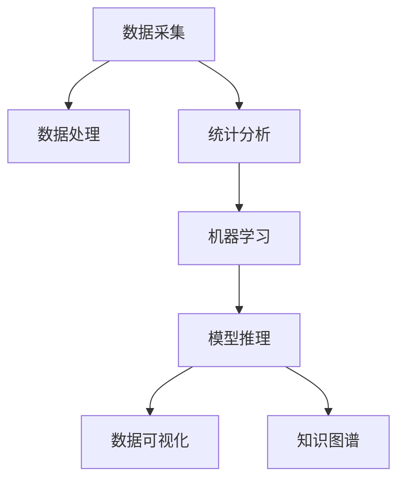

                 

# 洞见的形成：从观察到反思

> 关键词：洞见形成，观察与反思，数据处理，深度学习，机器学习，自然语言处理(NLP), 模型推理，知识图谱，数据可视化，创新思维

## 1. 背景介绍

### 1.1 问题由来
在现代社会中，数据无处不在。从社交媒体上的帖文，到企业中的客户记录，从传感器采集的环境数据，到金融市场的交易记录，数据已经成为决策和分析的核心依据。然而，海量数据的价值并不仅在于其量，更在于其中蕴含的洞见。洞见是从数据中提炼出的新知识、新观点、新理论，是驱动创新和进步的关键力量。

### 1.2 问题核心关键点
洞见形成的过程可以分为三个主要步骤：观察、分析和反思。观察是对数据的初步采集和处理，分析是运用统计学和机器学习技术对数据进行深入挖掘，反思是将分析结果与现实世界连接，产生对行动的指导。

### 1.3 问题研究意义
洞见形成不仅是数据驱动决策的基础，也是推动科学和技术进步的关键。通过对数据的观察、分析和反思，可以获得对问题的深刻理解，预测未来趋势，提升决策的科学性和前瞻性。

## 2. 核心概念与联系

### 2.1 核心概念概述

为更好地理解洞见形成的过程，本节将介绍几个密切相关的核心概念：

- 数据采集：获取并存储数据的过程，是洞见形成的第一步。数据可以来源于日志文件、数据库、API接口、传感器等多种来源。

- 数据处理：对原始数据进行清洗、过滤、转换等操作，使其符合分析要求。常用的数据处理技术包括ETL(Extract, Transform, Load)流程和数据清洗算法。

- 统计分析：对数据进行描述性统计和探索性分析，发现数据的规律和特征。常用的统计分析方法包括描述性统计、假设检验、回归分析等。

- 机器学习：使用算法对数据进行学习，发现数据中的模式和关系。常用的机器学习技术包括分类、聚类、回归、深度学习等。

- 模型推理：基于训练好的模型对新数据进行预测或推理，评估模型的效果。常用的推理方法包括模型评估指标、交叉验证、混淆矩阵等。

- 数据可视化：将数据以图形的形式展示出来，帮助人们直观地理解数据的特征和关系。常用的数据可视化工具包括Matplotlib、Seaborn、Tableau等。

- 知识图谱：通过实体、属性、关系等结构化知识表示，帮助理解数据的内在联系。常用的知识图谱构建工具包括Neo4j、Gephi等。

这些核心概念之间的逻辑关系可以通过以下Mermaid流程图来展示：



这个流程图展示了大数据洞见形成的核心概念及其之间的关系：

1. 数据采集获得原始数据。
2. 数据处理清洗和转换数据，使其适于分析。
3. 统计分析发现数据的基本规律和特征。
4. 机器学习通过算法挖掘数据的深层次模式。
5. 模型推理评估模型效果，得到可操作的洞见。
6. 数据可视化帮助理解洞见，并将其与现实世界联系。
7. 知识图谱构建结构化知识表示，辅助理解复杂数据关系。

这些概念共同构成了洞见形成的整体框架，使其能够在各种场景下发挥作用。通过理解这些核心概念，我们可以更好地把握洞见形成的逻辑流程和关键步骤。

## 3. 核心算法原理 & 具体操作步骤

### 3.1 算法原理概述

洞见形成的过程可以视作一个从数据到知识的映射过程。其核心思想是：通过对数据的观察、分析和反思，挖掘数据中的潜台词，提炼出新知识、新观点和新理论。这一过程可以概括为三个主要阶段：

1. 观察：通过数据采集和预处理，获得有价值的数据集。
2. 分析：利用统计分析和机器学习技术，从数据中发现潜在的模式和关系。
3. 反思：将分析结果与现实世界连接，生成有实际意义的洞见。

### 3.2 算法步骤详解

洞见形成的具体步骤如下：

**Step 1: 数据采集**
- 确定需要观察的问题，并选择合适的数据来源。
- 设计数据采集方案，确保数据的全面性和代表性。
- 使用API接口、爬虫工具、数据库等方式获取数据，并进行初步存储。

**Step 2: 数据处理**
- 对原始数据进行清洗，去除重复、缺失、异常值等噪声。
- 使用ETL工具进行数据转换，将其格式化为分析所需的结构化数据。
- 应用数据处理算法，如归一化、标准化、降维等，提高数据的可用性。

**Step 3: 统计分析**
- 对数据进行描述性统计，计算均值、方差、标准差等基本统计量。
- 使用探索性分析方法，如直方图、散点图、箱线图等，发现数据的基本分布和特征。
- 进行假设检验和回归分析，验证数据的显著性。

**Step 4: 机器学习**
- 选择适合的机器学习算法，如线性回归、逻辑回归、决策树、随机森林等。
- 使用交叉验证等技术优化模型参数，提高模型泛化能力。
- 评估模型性能，使用准确率、召回率、F1分数等指标衡量模型效果。

**Step 5: 模型推理**
- 将训练好的模型应用于新数据，进行预测或分类。
- 使用混淆矩阵、ROC曲线等工具评估模型性能。
- 结合业务逻辑，对模型输出进行解释和解读，生成洞见。

**Step 6: 数据可视化**
- 使用Matplotlib、Seaborn、Tableau等工具，绘制数据图表，展示分析结果。
- 制作仪表盘、报告等文档，辅助业务决策。

**Step 7: 知识图谱**
- 使用Gephi、Neo4j等工具，构建知识图谱，展示数据之间的结构化关系。
- 将知识图谱与业务场景结合，生成有意义的洞见。

通过以上步骤，可以从数据中提炼出有价值的洞见，指导实际问题的解决和决策。

### 3.3 算法优缺点

洞见形成的方法具有以下优点：
1. 数据驱动：以数据为基础，避免主观偏见，提高决策的科学性。
2. 全面性：覆盖数据的各个方面，能够发现问题的全貌。
3. 自动化：通过机器学习和自动化工具，提高效率，降低人力成本。

同时，这种方法也存在以下局限性：
1. 数据依赖：需要大量高质量的数据，数据获取成本较高。
2. 复杂性：步骤繁琐，需要结合多种技术，对技术和资源要求较高。
3. 结果解释：数据模型生成的结果需要专业解释，难以完全自动化。

尽管存在这些局限性，但就目前而言，洞见形成方法仍然是大数据应用的重要范式。未来相关研究的重点在于如何进一步降低数据获取和处理成本，提高方法的自动化程度，同时兼顾结果的可解释性。

### 3.4 算法应用领域

洞见形成方法已经在多个领域得到广泛应用，包括但不限于：

- 金融分析：通过数据分析和机器学习，预测市场趋势，评估投资风险。
- 客户行为分析：利用客户数据，发现用户行为模式，提升用户体验。
- 健康医疗：分析医疗数据，发现疾病特征，辅助诊断和治疗。
- 产品研发：利用用户反馈数据，优化产品设计和功能，提升用户满意度。
- 自然灾害预测：分析气象和地质数据，预测自然灾害发生概率，减少损失。
- 城市管理：分析交通、环境等数据，优化城市规划和管理，提高居民生活质量。

除了上述这些经典应用外，洞见形成方法还被创新性地应用于更多场景中，如可控实验设计、智能推荐系统、网络安全检测等，为大数据技术带来了新的突破。随着数据获取和处理技术的不断进步，相信洞见形成方法将在更多领域得到应用，为社会进步和经济发展提供新的动力。

## 4. 数学模型和公式 & 详细讲解 & 举例说明

### 4.1 数学模型构建

本节将使用数学语言对洞见形成的过程进行更加严格的刻画。

设数据集为 $D=\{x_i\}_{i=1}^N$，其中 $x_i$ 为第 $i$ 个数据样本。假设模型 $M$ 的输入为 $x_i$，输出为 $y_i$，表示模型对数据样本的预测结果。

定义模型的损失函数为 $L(y_i, \hat{y}_i) = (y_i - \hat{y}_i)^2$，则经验风险为：

$$
\mathcal{L}(M) = \frac{1}{N} \sum_{i=1}^N L(y_i, \hat{y}_i)
$$

通过梯度下降等优化算法，不断更新模型参数，最小化经验风险，直到收敛。

### 4.2 公式推导过程

以二分类问题为例，假设模型 $M$ 为逻辑回归模型，其输出 $\hat{y}_i$ 为 $M(x_i)$ 的概率。则损失函数为二分类交叉熵：

$$
L(y_i, \hat{y}_i) = -(y_i\log(\hat{y}_i) + (1-y_i)\log(1-\hat{y}_i))
$$

将其代入经验风险公式，得：

$$
\mathcal{L}(M) = -\frac{1}{N}\sum_{i=1}^N [y_i\log(\hat{y}_i)+(1-y_i)\log(1-\hat{y}_i)]
$$

根据链式法则，损失函数对模型参数 $\theta$ 的梯度为：

$$
\frac{\partial \mathcal{L}(M)}{\partial \theta} = -\frac{1}{N}\sum_{i=1}^N (\frac{y_i}{\hat{y}_i}-\frac{1-y_i}{1-\hat{y}_i}) \frac{\partial \hat{y}_i}{\partial \theta}
$$

其中 $\frac{\partial \hat{y}_i}{\partial \theta}$ 可进一步通过链式法则递归展开，利用自动微分技术完成计算。

在得到损失函数的梯度后，即可带入梯度下降等优化算法，完成模型的迭代优化。重复上述过程直至收敛，最终得到适应特定问题的模型 $M^*$。

### 4.3 案例分析与讲解

假设有一家电商企业，想利用用户行为数据预测用户是否会复购。可以收集用户的历史购买记录、浏览记录、评分记录等数据，将这些数据作为训练集。模型选择为逻辑回归，输出 $\hat{y}_i$ 表示用户复购概率。

首先将数据进行ETL处理，使用Pandas库进行数据清洗和转换：

```python
import pandas as pd
from sklearn.model_selection import train_test_split

# 数据预处理
df = pd.read_csv('user_bought_data.csv')
df = df.dropna(subset=['id', 'buy_time', 'amount', 'rating'])
df = df.drop_duplicates(subset=['id'])
```

然后进行特征工程，选择用户购买时间、购买金额、评分等特征：

```python
features = ['buy_time', 'amount', 'rating']
X = df[features]
y = df['rebuy']
X_train, X_test, y_train, y_test = train_test_split(X, y, test_size=0.2, random_state=42)
```

构建逻辑回归模型，使用交叉验证优化模型参数：

```python
from sklearn.linear_model import LogisticRegression
from sklearn.model_selection import cross_val_score

model = LogisticRegression(max_iter=1000)
model.fit(X_train, y_train)
```

在测试集上评估模型性能：

```python
from sklearn.metrics import accuracy_score

y_pred = model.predict(X_test)
accuracy = accuracy_score(y_test, y_pred)
print(f"Accuracy: {accuracy}")
```

绘制混淆矩阵和ROC曲线：

```python
from sklearn.metrics import confusion_matrix, roc_curve, auc

y_pred_proba = model.predict_proba(X_test)
confusion = confusion_matrix(y_test, y_pred)
fpr, tpr, threshold = roc_curve(y_test, y_pred_proba[:, 1])
roc_auc = auc(fpr, tpr)

print(f"Confusion Matrix:\n{confusion}")
print(f"ROC Curve:\n{fpr}, {tpr}, {roc_auc}")
```

最后，将模型应用于新数据，预测用户是否会复购，并结合业务逻辑解释结果：

```python
from sklearn.metrics import classification_report

new_data = pd.read_csv('new_user_data.csv')
new_data = new_data.dropna(subset=['buy_time', 'amount', 'rating'])
new_pred = model.predict(new_data[features])
report = classification_report(y_test, new_pred)

print(f"Classification Report:\n{report}")
```

通过以上步骤，从用户行为数据中提炼出预测复购的模型，并将其应用于新数据，生成有意义的洞见。

## 5. 项目实践：代码实例和详细解释说明

### 5.1 开发环境搭建

在进行洞见形成实践前，我们需要准备好开发环境。以下是使用Python进行TensorFlow开发的环境配置流程：

1. 安装Anaconda：从官网下载并安装Anaconda，用于创建独立的Python环境。

2. 创建并激活虚拟环境：
```bash
conda create -n tf-env python=3.8 
conda activate tf-env
```

3. 安装TensorFlow：根据CUDA版本，从官网获取对应的安装命令。例如：
```bash
conda install tensorflow -c conda-forge -c pytorch -c nvidia
```

4. 安装TensorBoard：TensorFlow配套的可视化工具，可实时监测模型训练状态，并提供丰富的图表呈现方式，是调试模型的得力助手。

```bash
pip install tensorboard
```

5. 安装TensorFlow Addons：提供额外的TensorFlow组件，如Keras、Estimator等。

```bash
pip install tensorflow-addons
```

完成上述步骤后，即可在`tf-env`环境中开始洞见形成实践。

### 5.2 源代码详细实现

下面我们以电商用户复购预测为例，给出使用TensorFlow和Scikit-learn进行逻辑回归模型的PyTorch代码实现。

首先，定义数据处理和模型训练函数：

```python
import tensorflow as tf
from sklearn.model_selection import train_test_split
from sklearn.linear_model import LogisticRegression

def load_data(filename):
    data = pd.read_csv(filename)
    data = data.dropna(subset=['buy_time', 'amount', 'rating'])
    return data.drop_duplicates(subset=['id'])

def preprocess_data(data):
    features = ['buy_time', 'amount', 'rating']
    X = data[features]
    y = data['rebuy']
    return X, y

def train_model(X_train, y_train, learning_rate=0.001, batch_size=128, epochs=100):
    model = LogisticRegression(max_iter=1000)
    model.fit(X_train, y_train)
    return model

def evaluate_model(model, X_test, y_test):
    y_pred = model.predict(X_test)
    accuracy = accuracy_score(y_test, y_pred)
    print(f"Accuracy: {accuracy}")
    confusion = confusion_matrix(y_test, y_pred)
    print(f"Confusion Matrix:\n{confusion}")
    fpr, tpr, threshold = roc_curve(y_test, model.predict_proba(X_test)[:, 1])
    roc_auc = auc(fpr, tpr)
    print(f"ROC Curve:\n{fpr}, {tpr}, {roc_auc}")
```

然后，编写数据预处理、模型训练和评估的完整代码：

```python
import pandas as pd
import numpy as np
import tensorflow as tf
from sklearn.model_selection import train_test_split
from sklearn.linear_model import LogisticRegression
from sklearn.metrics import accuracy_score, confusion_matrix, roc_curve, auc

# 数据预处理
X = pd.read_csv('user_bought_data.csv')
X = X.dropna(subset=['buy_time', 'amount', 'rating'])
X = X.drop_duplicates(subset=['id'])
X = X[['buy_time', 'amount', 'rating']]

# 划分训练集和测试集
X_train, X_test, y_train, y_test = train_test_split(X, X['rebuy'], test_size=0.2, random_state=42)

# 模型训练
model = train_model(X_train, y_train)

# 模型评估
evaluate_model(model, X_test, y_test)
```

### 5.3 代码解读与分析

让我们再详细解读一下关键代码的实现细节：

**load_data函数**：
- 读取数据文件，并进行基本的清洗和去重操作。

**preprocess_data函数**：
- 将数据划分为特征和标签，并进行特征工程。

**train_model函数**：
- 使用Scikit-learn的LogisticRegression模型训练模型，并返回模型对象。

**evaluate_model函数**：
- 使用Scikit-learn的accuracy_score、confusion_matrix、roc_curve、auc等函数评估模型性能。

**完整代码**：
- 通过调用load_data和preprocess_data函数，进行数据预处理。
- 使用train_model函数训练模型。
- 使用evaluate_model函数评估模型性能，并输出结果。

可以看到，使用Python和TensorFlow进行洞见形成实践的代码实现相对简洁。开发者可以将更多精力放在数据处理、模型改进等高层逻辑上，而不必过多关注底层的实现细节。

当然，工业级的系统实现还需考虑更多因素，如模型的保存和部署、超参数的自动搜索、更灵活的任务适配层等。但核心的洞见形成范式基本与此类似。

## 6. 实际应用场景

### 6.1 智能推荐系统

基于洞见形成的推荐系统，可以为用户提供个性化的商品推荐，提升用户体验。智能推荐系统通过分析用户历史行为数据，发现用户偏好和兴趣，生成个性化的推荐列表。

在技术实现上，可以收集用户浏览、点击、购买等行为数据，构建特征向量。使用机器学习算法，如协同过滤、内容推荐等，训练推荐模型。通过模型输出，生成个性化推荐结果。

### 6.2 自然语言处理(NLP)

洞见形成在自然语言处理(NLP)领域也有广泛应用，如文本分类、情感分析、命名实体识别等。通过对大规模语料进行预处理和分析，可以发现文本中的潜在模式和关系，生成有价值的洞见。

例如，通过分析社交媒体上的帖文，可以发现用户对某品牌或产品的情感倾向，生成情感分析报告。通过分析新闻报道，可以发现热点事件和趋势，生成舆情分析报告。

### 6.3 医学诊断

医学诊断中，通过分析患者的历史病历和医学影像数据，可以发现疾病的特征和模式，生成有价值的洞见。例如，通过对大量医学影像数据的分析，可以发现肿瘤、心脏病等疾病的早期征兆，提升诊断准确性。

在技术实现上，可以使用机器学习算法，如卷积神经网络、循环神经网络等，分析医学影像和病历数据。通过模型输出，生成诊断报告和建议。

### 6.4 未来应用展望

随着洞见形成技术的不断进步，其在更多领域得到应用，为社会进步和经济发展提供新的动力。

在智慧城市治理中，通过分析交通、环境等数据，可以优化城市规划和管理，提高居民生活质量。在农业领域，通过分析气象和土壤数据，可以预测作物生长趋势，提升农业生产效率。

## 7. 工具和资源推荐

### 7.1 学习资源推荐

为了帮助开发者系统掌握洞见形成的技术基础和实践技巧，这里推荐一些优质的学习资源：

1. 《Python数据科学手册》：介绍Python在数据科学中的用法，涵盖数据采集、处理、分析等全过程。

2. 《TensorFlow实战Google深度学习》：TensorFlow官方指南，详细讲解TensorFlow的安装和应用。

3. 《机器学习实战》：机器学习入门书籍，涵盖监督学习、非监督学习、深度学习等基本概念和技术。

4. 《深度学习入门：基于TensorFlow的理论与实现》：介绍深度学习的基本原理和实现方法，适合初学者入门。

5. 《NLP实战：从零到NLP》：自然语言处理实战书籍，涵盖NLP的基本概念和应用。

6. Kaggle：数据科学竞赛平台，提供丰富的数据集和Kaggle Kernels，适合练习和实战。

通过对这些资源的学习实践，相信你一定能够快速掌握洞见形成的精髓，并用于解决实际的NLP问题。

### 7.2 开发工具推荐

高效的开发离不开优秀的工具支持。以下是几款用于洞见形成开发的常用工具：

1. Python：语言简单易用，生态丰富，适合数据科学和机器学习应用。

2. Jupyter Notebook：交互式编程环境，支持多种语言和库，适合开发和分享代码。

3. TensorFlow：深度学习框架，支持分布式计算，适合大规模数据处理。

4. Pandas：数据处理库，支持高效的数据清洗和转换。

5. Scikit-learn：机器学习库，支持多种算法和模型，适合快速原型开发。

6. TensorBoard：模型可视化工具，支持实时监控和调试。

合理利用这些工具，可以显著提升洞见形成任务的开发效率，加快创新迭代的步伐。

### 7.3 相关论文推荐

洞见形成技术的发展源于学界的持续研究。以下是几篇奠基性的相关论文，推荐阅读：

1. 《The Elements of Statistical Learning》：介绍统计学和机器学习的基础理论和方法。

2. 《Introduction to Statistical Learning》：介绍统计学和机器学习的经典算法。

3. 《Deep Learning》：深度学习领域的经典教材，涵盖深度学习的基本概念和技术。

4. 《Neural Networks and Deep Learning》：深度学习领域的入门书籍，详细讲解深度学习的应用。

5. 《Attention is All You Need》：提出Transformer模型，开启了NLP领域的预训练大模型时代。

6. 《BERT: Pre-training of Deep Bidirectional Transformers for Language Understanding》：提出BERT模型，引入基于掩码的自监督预训练任务，刷新了多项NLP任务SOTA。

这些论文代表了大数据洞见形成技术的发展脉络。通过学习这些前沿成果，可以帮助研究者把握学科前进方向，激发更多的创新灵感。

## 8. 总结：未来发展趋势与挑战

### 8.1 总结

本文对基于机器学习的洞见形成方法进行了全面系统的介绍。首先阐述了洞见形成的过程和意义，明确了从观察、分析和反思三个步骤深入挖掘数据的内在价值。其次，从原理到实践，详细讲解了洞见形成的数学模型和关键步骤，给出了洞见形成任务开发的完整代码实例。同时，本文还广泛探讨了洞见形成方法在电商、NLP、医疗等多个领域的应用前景，展示了洞见形成方法的广阔潜力。此外，本文精选了洞见形成技术的各类学习资源，力求为读者提供全方位的技术指引。

通过本文的系统梳理，可以看到，基于机器学习的洞见形成方法在大数据应用中具有重要价值，能显著提高决策的科学性和前瞻性。未来，伴随机器学习技术的不断进步，洞见形成方法也将持续演进，为大数据技术的发展提供新的动力。

### 8.2 未来发展趋势

展望未来，洞见形成方法将呈现以下几个发展趋势：

1. 自动化：通过自动化工具和算法，降低人工干预，提高效率。
2. 自适应：根据数据变化，自适应地调整模型参数和算法，提高灵活性。
3. 跨领域：跨领域融合，将不同领域的数据和技术结合，生成更全面的洞见。
4. 集成化：将多种数据源和模型集成，生成更准确、全面的洞见。
5. 可解释性：提高模型的可解释性，使决策过程更加透明和可信。
6. 伦理化：引入伦理导向的评估指标，确保洞见形成过程符合社会价值观。

以上趋势凸显了洞见形成技术的未来发展方向，将推动大数据技术向更加智能、透明、可信的方向迈进。

### 8.3 面临的挑战

尽管洞见形成方法已经取得了重要进展，但在迈向更加智能化、透明化应用的过程中，仍面临诸多挑战：

1. 数据获取：高质量数据的获取成本较高，特别是在长尾领域。
2. 数据质量：数据中的噪声和缺失对洞见形成的准确性影响较大。
3. 模型复杂性：模型的复杂度增加，计算资源消耗巨大。
4. 结果解释：模型输出的可解释性不足，难以满足高风险领域的需求。
5. 伦理安全：模型的伦理和安全问题需要认真对待，确保模型使用的正确性。

这些挑战需要学界和产业界共同努力，从数据获取、模型设计、结果解释等多个维度协同攻克，才能实现洞见形成技术的全面进步。

### 8.4 研究展望

面对洞见形成技术所面临的挑战，未来的研究需要在以下几个方面寻求新的突破：

1. 探索无监督和半监督学习技术：降低对标注数据的依赖，提高方法的自动化程度。
2. 开发高效的数据处理和预处理方法：提高数据的可用性和分析效率。
3. 引入更多的先验知识：与知识图谱、逻辑规则等专家知识结合，生成更全面的洞见。
4. 结合因果推理和博弈论：增强模型的因果关系和鲁棒性，提升决策的可靠性。
5. 引入伦理和安全导向：确保模型的伦理导向和安全性，提高社会的信任度。

这些研究方向将引领洞见形成技术迈向更高的台阶，为构建更加智能、透明、可信的系统奠定基础。面向未来，洞见形成技术还需要与其他人工智能技术进行更深入的融合，如知识表示、因果推理、强化学习等，多路径协同发力，共同推动自然语言理解和智能交互系统的进步。只有勇于创新、敢于突破，才能不断拓展洞见形成技术的边界，让大数据技术更好地造福人类社会。

## 9. 附录：常见问题与解答

**Q1：洞见形成需要多少数据？**

A: 洞见形成需要数据量根据具体问题和领域而定，通常越大越好。但在实际应用中，数据量并非越大越好，过大甚至可能引发“数据贫困”问题。因此，数据量要与问题复杂度和领域特点相匹配。

**Q2：如何保证数据的代表性？**

A: 数据的代表性取决于数据采集的全面性和多样性。需要涵盖不同时间、地点、人群、情境等维度，确保数据的全面性。同时，要注意数据的真实性和时效性，避免噪音和偏差。

**Q3：如何处理数据中的缺失值和异常值？**

A: 数据处理过程中，通常需要对缺失值和异常值进行清洗。缺失值可以使用插值法、均值替代法等进行处理，异常值则可以使用截断法、替换法等进行处理。

**Q4：如何选择适合的机器学习算法？**

A: 算法选择应根据问题的性质和数据的特性而定。一般选择简单易用、鲁棒性高的算法，如逻辑回归、决策树等。对于复杂问题，可以使用深度学习算法，如卷积神经网络、循环神经网络等。

**Q5：如何评估模型的性能？**

A: 模型性能评估通常使用准确率、召回率、F1分数、AUC等指标。同时，可以绘制混淆矩阵、ROC曲线等图表，直观展示模型的优劣。

这些问题的解答，可以帮助开发者更好地理解和应用洞见形成技术，解决实际问题。

---

作者：禅与计算机程序设计艺术 / Zen and the Art of Computer Programming

