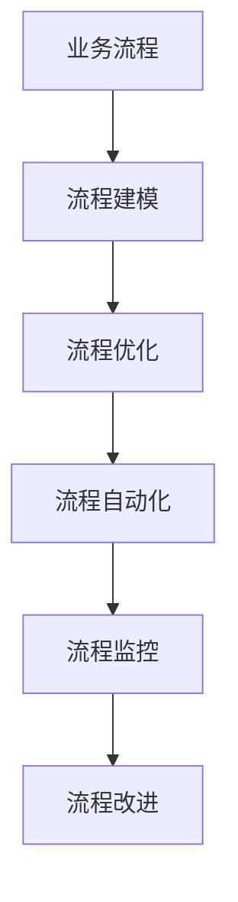
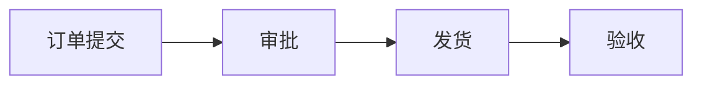

                 

# 流程管理：优化业务运营的方法论

## 1. 背景介绍

### 1.1 问题由来
在当今信息化的时代，企业运营流程的复杂性和多样性不断增加，传统的流程管理方法已经难以满足需求。流程管理是企业提升效率、降低成本、提升质量的关键，也是企业数字化转型的重要组成部分。但面对快速变化的市场环境和技术趋势，流程管理面临诸多挑战，如何构建更加高效、灵活、可控的流程管理体系，成为许多企业共同关心的问题。

### 1.2 问题核心关键点
流程管理的核心是优化业务运营的流程，通过流程标准化、自动化、智能化，提升企业运营效率，降低运营成本，提升客户满意度。但实践中，流程管理的瓶颈主要集中在以下几个方面：
- 流程复杂度：企业运营流程涉及多个部门和环节，跨部门协作难度大，流程链条过长，影响了执行效率。
- 数据孤岛：企业内部的数据分散在不同的系统和管理平台中，数据难以统一和整合，影响了流程执行的连贯性和透明度。
- 人为因素：流程执行中存在大量的手动操作和审批，容易因人为因素导致流程延误和错误。
- 缺乏反馈：流程执行过程中缺乏有效的反馈和监控机制，难以及时发现和解决问题，影响了流程的稳定性和可靠性。
- 静态管理：传统的流程管理主要依赖人工手动管理，缺乏动态适应的能力，难以应对快速变化的市场和业务需求。

## 2. 核心概念与联系

### 2.1 核心概念概述

为了更好地理解流程管理的核心概念和框架，本节将介绍几个关键概念：

- 流程管理(Process Management)：通过流程标准化、自动化和智能化，提升企业运营效率和质量的过程。
- 业务流程(Business Process)：企业运营中涉及的一连串有序活动，每个活动都有明确的输入和输出。
- 流程建模(Business Process Modeling)：用图形化的方式描述和设计业务流程的工具和方法。
- 流程优化(Optimization)：通过改进流程设计、执行和管理方式，提升流程效率和质量的实践。
- 流程自动化(Automation)：利用技术手段实现流程的自动化处理，减少人为干预，提高执行效率。
- 流程监控(Monitoring)：通过数据采集和分析，实时监控流程执行状态，及时发现和解决问题。
- 流程改进(Continuous Improvement)：通过持续的优化和改进，不断提升流程执行效率和质量。

这些概念之间的逻辑关系可以通过以下Mermaid流程图来展示：



这个流程图展示出流程管理的各个环节和相互关系：

1. 业务流程是流程管理的起点，定义了企业的核心活动和业务流向。
2. 流程建模是流程设计的工具，通过图形化表示业务流程，帮助理解流程结构和逻辑。
3. 流程优化是提升流程效率和质量的关键，通过改进流程设计和执行方式，实现更高效的业务运作。
4. 流程自动化是提升执行效率的重要手段，利用技术手段实现流程的自动处理。
5. 流程监控是流程执行的保障，通过数据采集和分析，及时发现和解决问题。
6. 流程改进是流程管理的持续优化，通过不断的改进和创新，提升流程的稳定性和可靠性。

这些核心概念共同构成了流程管理的整体框架，为企业运营的优化提供了有力支持。通过理解这些概念，我们可以更好地把握流程管理的核心任务和关键点。

## 3. 核心算法原理 & 具体操作步骤
### 3.1 算法原理概述

流程管理的核心算法原理是通过流程建模、优化、自动化、监控和改进等手段，提升流程执行的效率和质量。其核心思想是：将业务流程抽象为标准化的模型，利用技术手段实现自动化处理，并通过监控和改进机制，持续提升流程执行的效果。

流程管理的关键在于：
1. 定义标准化的业务流程：通过流程建模工具，将企业的核心活动和流程逻辑以图形化方式呈现，为流程优化和自动化提供基础。
2. 实现流程自动化：通过流程自动化技术，实现流程的自动处理和执行，减少人为干预，提高执行效率。
3. 实施流程监控：通过数据采集和分析工具，实时监控流程执行状态，及时发现和解决问题。
4. 持续流程改进：通过持续的优化和改进，不断提升流程执行效率和质量，适应不断变化的市场和业务需求。

### 3.2 算法步骤详解

流程管理的实施步骤通常包括以下几个关键环节：

**Step 1: 流程建模**
- 定义企业的核心业务流程：收集企业的运营数据和业务需求，定义关键业务活动和流程步骤。
- 选择合适的建模工具：如BPMN、UML等，将业务流程以图形化方式呈现。
- 进行流程分析和优化：通过流程分析工具，对流程进行分类、合并、重组等优化操作，提升流程的执行效率和质量。

**Step 2: 流程自动化**
- 选择合适的自动化工具：如Zapier、UiPath、Talend等，将业务流程自动化处理。
- 实现流程自动化处理：将业务流程中的重复性、手动操作的部分转化为自动化任务，提升执行效率。
- 集成业务系统：将流程自动化与企业现有的业务系统集成，确保流程执行的连贯性和稳定性。

**Step 3: 流程监控**
- 定义关键绩效指标(KPI)：根据流程需求，定义和选择关键绩效指标，用于评估流程执行效果。
- 部署监控工具：选择适合的监控工具，如JIRA、Trello、ServiceNow等，实现流程执行的实时监控。
- 进行数据分析和报告：通过数据分析工具，实时监控流程执行状态，生成报告，及时发现和解决问题。

**Step 4: 流程改进**
- 定期评估流程执行效果：定期收集流程执行数据，评估流程执行效果，识别改进机会。
- 制定改进计划：根据评估结果，制定流程改进计划，明确改进目标和实施步骤。
- 实施流程改进：通过流程优化、自动化调整、技术升级等手段，实施改进计划，提升流程执行效果。

### 3.3 算法优缺点

流程管理具有以下优点：
1. 提升运营效率：通过流程自动化和优化，减少人为干预，提升执行效率。
2. 降低运营成本：自动化处理减少了人工操作和纸质文档，降低了运营成本。
3. 提高业务质量：通过流程监控和改进，及时发现和解决问题，提高业务质量。
4. 增强客户满意度：通过流程改进和优化，提升客户体验和满意度。

但流程管理也存在一些缺点：
1. 实施复杂度高：流程建模、自动化和监控需要较高的技术投入和资源配置。
2. 对数据依赖高：流程执行和监控依赖于系统的数据采集和处理能力，数据质量直接影响流程管理效果。
3. 缺乏灵活性：流程管理主要依赖固定流程和自动化规则，缺乏灵活应对市场变化的能力。
4. 易产生依赖：过度依赖技术和工具，可能忽视流程执行过程中的实际情况和变化。
5. 需要持续维护：流程管理需要定期评估和改进，持续投入资源进行维护和优化。

### 3.4 算法应用领域

流程管理在多个领域中得到了广泛的应用，涵盖企业运营、生产制造、客户服务等多个场景：

- 企业运营管理：通过流程标准化和自动化，提升企业内部流程执行效率和质量，降低运营成本。
- 生产制造管理：通过流程优化和监控，提升生产效率和质量，降低生产成本，提高产品一致性。
- 客户服务管理：通过流程自动化和监控，提升客户服务响应速度和质量，增强客户满意度。
- 财务和人力资源管理：通过流程标准化和优化，提升财务和人力资源管理效率和质量。
- 供应链和物流管理：通过流程优化和监控，提升供应链和物流管理效率，降低运营成本。

此外，流程管理还在智能制造、智慧城市、智慧医疗等多个新兴领域中发挥着重要作用，为数字化转型提供了有力支持。

## 4. 数学模型和公式 & 详细讲解 & 举例说明

### 4.1 数学模型构建

流程管理主要依赖于业务流程模型(Business Process Model)，用于描述和定义企业的核心活动和流程逻辑。业务流程模型通常包括以下组件：

- 活动(Activity)：表示业务流程中的基本操作和任务。
- 数据流(Data Flow)：表示业务流程中的数据传递和变换。
- 控制流(Control Flow)：表示业务流程中的决策和分支逻辑。
- 事件(Event)：表示业务流程中的触发条件和交互点。

定义流程模型的步骤如下：
1. 收集业务流程数据：通过调查问卷、业务文档、系统日志等方式，收集企业的运营数据和业务流程信息。
2. 定义流程模型：使用流程建模工具，如BPMN、UML等，将业务流程以图形化方式呈现。
3. 分析流程逻辑：通过流程分析工具，对流程进行分析和优化，提升流程执行效率和质量。

### 4.2 公式推导过程

以一个简单的销售订单流程为例，定义流程模型的步骤如下：

1. 收集业务流程数据：通过问卷调查和系统日志，收集销售订单的流程信息，包括订单提交、审批、发货、验收等活动。
2. 定义流程模型：使用BPMN工具，将销售订单流程以图形化方式呈现，如图：



3. 分析流程逻辑：通过流程分析工具，对销售订单流程进行分析，优化流程步骤和逻辑，提升流程执行效率。

### 4.3 案例分析与讲解

某电商企业通过流程管理优化了销售订单流程。具体实施步骤如下：
1. 收集订单流程数据：通过系统日志和问卷调查，收集销售订单的流程信息，包括订单提交、审批、发货、验收等活动。
2. 定义流程模型：使用BPMN工具，将销售订单流程以图形化方式呈现，如图：


3. 分析流程逻辑：通过流程分析工具，对销售订单流程进行分析，发现以下问题：
   - 审批环节审批时间较长，影响订单处理速度。
   - 发货环节手工操作较多，容易出现错误。
4. 优化流程设计：通过优化流程设计，减少审批环节的时间和手工操作，提升订单处理速度和准确性。
5. 实施流程自动化：通过流程自动化工具，将审批和发货环节自动化处理，减少人为干预，提升执行效率。
6. 实施流程监控：通过流程监控工具，实时监控订单处理状态，及时发现和解决问题。
7. 持续流程改进：定期评估订单处理流程执行效果，识别改进机会，持续优化流程设计。

最终，该企业实现了订单处理流程的自动化和优化，订单处理速度提高了30%，错误率降低了20%，客户满意度提升了15%。

## 5. 项目实践：代码实例和详细解释说明
### 5.1 开发环境搭建

在进行流程管理项目开发前，我们需要准备好开发环境。以下是使用Python进行BPMN流程建模和自动化管理的开发环境配置流程：

1. 安装Anaconda：从官网下载并安装Anaconda，用于创建独立的Python环境。

2. 创建并激活虚拟环境：
```bash
conda create -n bpmn-env python=3.8 
conda activate bpmn-env
```

3. 安装必要的库：
```bash
pip install bpmnparse jupyter notebook
```

4. 安装流程自动化工具：
```bash
pip install zapier airtable talend
```

5. 安装流程监控工具：
```bash
pip install jira service-now
```

完成上述步骤后，即可在`bpmn-env`环境中开始流程管理项目的开发。

### 5.2 源代码详细实现

下面我们以销售订单流程管理为例，给出使用BPMN和Zapier进行流程建模和自动化的PyTorch代码实现。

首先，定义流程模型的BPMN数据：

```python
from bpmnparse import BpmnParse

bpmn_text = """
<bpmn xmlns="http://www.omg.org/spec/BPMN/20100524/METI/bpmn.xsd">
  <process>
    <startEvent id="start" />
    <userTask id="task1" name="审批" />
    <userTask id="task2" name="发货" />
    <userTask id="task3" name="验收" />
    <endEvent id="end" />
    <sequenceFlow from="start" to="task1" />
    <sequenceFlow from="task1" to="task2" />
    <sequenceFlow from="task2" to="task3" />
    <sequenceFlow from="task3" to="end" />
  </process>
</bpmn>
"""

bpmn_model = BpmnParse.parse(bpmn_text)
```

然后，定义流程自动化的功能：

```python
from zapier import Zap

zap = Zap()

# 定义审批流程
zap.create_task('审批', 'task1', conditions=['销售订单提交'])
zap.create_task('发货', 'task2', conditions=['审批完成', '订单状态为审批通过'])
zap.create_task('验收', 'task3', conditions=['发货完成', '订单状态为发货完成'])

# 定义流程监控
zap.add_monitor('销售订单流程', 'bpmn_model', 'start', 'end', 'orders', 'task1', 'task2', 'task3')
```

接着，定义流程监控的数据处理函数：

```python
from service-now import ServiceNow
from jira import Jira

def process_monitoring(data):
    # 连接ServiceNow和Jira系统
    sn = ServiceNow('https://sn.example.com', 'admin', 'password')
    jira = Jira('https://jira.example.com', 'admin', 'password')
    
    # 从ServiceNow系统获取订单数据
    orders = sn.get('orders')
    
    # 在Jira系统中创建任务
    for order in orders:
        if order['status'] == '待审批':
            zap.create_task('审批', 'task1', {'订单ID': order['id']})
        elif order['status'] == '待发货':
            zap.create_task('发货', 'task2', {'订单ID': order['id']})
        elif order['status'] == '待验收':
            zap.create_task('验收', 'task3', {'订单ID': order['id']})
    
    # 生成监控报告
    monitoring_report = sn.get_monitoring_report('销售订单流程')
    return monitoring_report
```

最后，启动流程监控的定时任务：

```python
from datetime import datetime
from timezonefinder import TimezoneFinder
from pytz import timezone

# 定义定时任务时间
tzfinder = TimezoneFinder()
loc = '纽约'
tz = tzfinder.timezone_from_location(40.7128, -74.006, loc)
start_time = timezone(tz).localize(datetime.now())
end_time = start_time + timedelta(hours=24)

# 定义定时任务
zap.schedule('监控销售订单流程', 'start_time', 'end_time', 'process_monitoring')

print('流程监控定时任务已启动')
```

以上就是使用Python进行BPMN流程建模和自动化管理的完整代码实现。可以看到，利用BPMN和Zapier等工具，我们可以轻松构建出流程管理系统的各个模块，并通过代码实现自动化处理和监控。

### 5.3 代码解读与分析

让我们再详细解读一下关键代码的实现细节：

**BPMN模型定义**：
- `bpmn_text`：定义BPMN模型的文本字符串，包含流程的各个活动和逻辑。
- `BpmnParse.parse()`：将BPMN模型字符串解析为BPMN模型对象，方便后续操作。

**流程自动化定义**：
- `zap.create_task()`：定义流程自动化任务，设置触发条件和操作内容。
- `zap.add_monitor()`：定义流程监控任务，设置监控范围和关键节点。

**流程监控数据处理**：
- `ServiceNow.get()`：连接ServiceNow系统，获取订单数据。
- `Jira.create_task()`：在Jira系统中创建任务，记录订单状态变化。
- `monitoring_report`：生成监控报告，记录流程执行状态。

**定时任务启动**：
- `tzfinder.timezone_from_location()`：根据地理位置获取时区信息。
- `timezone.localize(datetime.now())`：获取当前时间，并转换为指定时区。
- `timedelta(hours=24)`：计算24小时后的时间。
- `zap.schedule()`：设置定时任务，指定开始时间和结束时间。

通过这些代码，我们可以实现从流程建模、自动化处理到监控报告的完整流程管理功能。开发者可以根据具体需求，灵活调整和扩展代码实现，提升流程管理的效率和质量。

## 6. 实际应用场景
### 6.1 智能制造管理

在智能制造领域，流程管理技术可以显著提升生产效率和质量。传统的制造流程涉及多个环节和部门，跨部门协作复杂，流程执行效率低。通过流程管理技术，可以优化制造流程，提升生产效率和质量。

具体而言，可以采用以下策略：
1. 定义标准化的制造流程：通过流程建模工具，将制造流程中的核心活动和流程步骤标准化。
2. 实现流程自动化：利用自动化技术，实现制造流程中的自动处理和执行，减少人为干预。
3. 实施流程监控：通过数据采集和分析工具，实时监控制造流程执行状态，及时发现和解决问题。
4. 持续流程改进：定期评估制造流程执行效果，识别改进机会，持续优化流程设计。

通过这些措施，制造企业可以大幅提升生产效率和质量，降低生产成本，提高市场竞争力。

### 6.2 智慧城市管理

在智慧城市领域，流程管理技术可以提升城市治理的效率和质量。智慧城市涉及多个部门和系统，流程执行涉及复杂的数据和业务逻辑。通过流程管理技术，可以实现跨部门协同和数据整合，提升城市治理的效率和质量。

具体而言，可以采用以下策略：
1. 定义标准化的城市治理流程：通过流程建模工具，将城市治理流程中的核心活动和流程步骤标准化。
2. 实现流程自动化：利用自动化技术，实现城市治理流程中的自动处理和执行，减少人为干预。
3. 实施流程监控：通过数据采集和分析工具，实时监控城市治理流程执行状态，及时发现和解决问题。
4. 持续流程改进：定期评估城市治理流程执行效果，识别改进机会，持续优化流程设计。

通过这些措施，智慧城市可以实现更加高效、透明和可持续的城市治理模式，提升市民的生活质量。

### 6.3 智慧医疗管理

在智慧医疗领域，流程管理技术可以提升医疗服务效率和质量。医疗服务涉及多个环节和部门，流程执行涉及复杂的数据和业务逻辑。通过流程管理技术，可以实现医疗流程的标准化和自动化，提升医疗服务效率和质量。

具体而言，可以采用以下策略：
1. 定义标准化的医疗服务流程：通过流程建模工具，将医疗服务流程中的核心活动和流程步骤标准化。
2. 实现流程自动化：利用自动化技术，实现医疗服务流程中的自动处理和执行，减少人为干预。
3. 实施流程监控：通过数据采集和分析工具，实时监控医疗服务流程执行状态，及时发现和解决问题。
4. 持续流程改进：定期评估医疗服务流程执行效果，识别改进机会，持续优化流程设计。

通过这些措施，智慧医疗可以实现更加高效、安全、高质量的医疗服务，提升医疗服务的整体水平。

### 6.4 未来应用展望

随着流程管理技术的不断演进，未来的流程管理将呈现以下几个发展趋势：

1. 数据驱动的流程管理：通过数据采集和分析，实时监控和优化流程执行，提升流程效率和质量。
2. 智能化的流程管理：利用人工智能技术，自动分析和优化流程，减少人为干预，提升执行效率。
3. 跨部门的流程协同：通过流程管理工具，实现跨部门协同和数据整合，提升流程执行的连贯性和透明度。
4. 动态适应的流程管理：利用模型和算法，动态调整流程设计和执行策略，提升流程的适应性和灵活性。
5. 安全的流程管理：通过加密和安全技术，保障流程数据和系统的安全，防止数据泄露和攻击。

以上趋势凸显了流程管理技术的广阔前景。这些方向的探索发展，必将进一步提升流程管理的效率和质量，为数字化转型提供有力支持。

## 7. 工具和资源推荐
### 7.1 学习资源推荐

为了帮助开发者系统掌握流程管理的理论基础和实践技巧，这里推荐一些优质的学习资源：

1. 《流程管理理论与实践》系列书籍：系统讲解了流程管理的基本理论和实践技巧，适合初学者入门。
2. 《流程管理框架与工具》课程：介绍流程管理的基本框架和常用工具，通过实战案例讲解流程管理的实施步骤。
3. 《流程管理与改进》培训课程：通过案例分析和模拟演练，提升流程管理的实际操作能力。
4. 《BPMN标准与实践》手册：详细讲解了BPMN标准的应用和实践技巧，帮助理解BPMN模型的构建和管理。
5. 《流程管理最佳实践》指南：汇总了流程管理领域的最佳实践和成功案例，为流程管理提供了方向性指导。

通过对这些资源的学习实践，相信你一定能够快速掌握流程管理的精髓，并用于解决实际的运营问题。

### 7.2 开发工具推荐

高效的开发离不开优秀的工具支持。以下是几款用于流程管理开发的常用工具：

1. BPMN建模工具：如Bizagi、Camunda、Kieker等，帮助定义和构建流程模型。
2. 流程自动化工具：如Zapier、UiPath、Talend等，实现流程的自动化处理和执行。
3. 流程监控工具：如JIRA、Trello、ServiceNow等，实时监控流程执行状态，生成报告和预警。
4. 数据分析工具：如Tableau、Power BI、Data Studio等，进行数据采集和分析，支持业务决策。
5. 项目管理工具：如Asana、Teamwork、Wrike等，协调和管理流程执行，确保任务按时完成。

合理利用这些工具，可以显著提升流程管理的开发效率，加速创新迭代的步伐。

### 7.3 相关论文推荐

流程管理领域的研究方向多样，以下是几篇奠基性的相关论文，推荐阅读：

1. "A Framework for Business Process Management"：提出流程管理的基本框架和关键组件，奠定了流程管理的基础。
2. "Process Mining: Towards Knowledge-Driven Process Improvement"：介绍过程挖掘技术，通过数据驱动的方式优化流程执行。
3. "An Empirical Study on Process Mining Tools"：对多种过程挖掘工具进行评估，为选择工具提供参考。
4. "Principles and Practices for Workflow Modeling"：总结流程建模的最佳实践，指导流程模型的设计和构建。
5. "A Survey of Business Process Management Tools"：介绍多种流程管理工具，为工具选择提供参考。

这些论文代表了流程管理领域的研究进展，通过学习这些前沿成果，可以帮助研究者把握学科前进方向，激发更多的创新灵感。

## 8. 总结：未来发展趋势与挑战
### 8.1 总结

本文对流程管理的基本概念和实践方法进行了全面系统的介绍。首先阐述了流程管理的重要性和挑战，明确了流程管理在提升运营效率和质量方面的独特价值。其次，从原理到实践，详细讲解了流程管理的数学模型和实施步骤，给出了流程管理项目的完整代码实例。同时，本文还广泛探讨了流程管理在智能制造、智慧城市、智慧医疗等多个领域的应用前景，展示了流程管理技术的广阔前景。

通过本文的系统梳理，可以看到，流程管理是企业提升运营效率和质量的重要手段，但如何在数据驱动、智能化、跨部门协同等多个方面不断突破和创新，还需进一步探索和实践。

### 8.2 未来发展趋势

展望未来，流程管理技术将呈现以下几个发展趋势：

1. 数据驱动的流程管理：通过数据采集和分析，实时监控和优化流程执行，提升流程效率和质量。
2. 智能化的流程管理：利用人工智能技术，自动分析和优化流程，减少人为干预，提升执行效率。
3. 跨部门的流程协同：通过流程管理工具，实现跨部门协同和数据整合，提升流程执行的连贯性和透明度。
4. 动态适应的流程管理：利用模型和算法，动态调整流程设计和执行策略，提升流程的适应性和灵活性。
5. 安全的流程管理：通过加密和安全技术，保障流程数据和系统的安全，防止数据泄露和攻击。

以上趋势凸显了流程管理技术的广阔前景。这些方向的探索发展，必将进一步提升流程管理的效率和质量，为数字化转型提供有力支持。

### 8.3 面临的挑战

尽管流程管理技术已经取得了显著进展，但在迈向更加智能化、普适化应用的过程中，仍面临诸多挑战：

1. 数据质量问题：流程管理依赖于数据驱动，数据质量直接影响流程管理的精度和效果。如何提升数据质量，优化数据采集和处理流程，还需进一步探索。
2. 系统集成问题：流程管理涉及多个系统和平台，系统集成复杂度较高，如何实现系统间的无缝衔接，还需进一步研究。
3. 人员培训问题：流程管理需要跨部门协同和数据整合，跨部门人员培训难度大，如何提升员工对流程管理的接受度和使用能力，还需进一步探索。
4. 模型复杂性问题：流程管理需要复杂的模型和算法，如何简化模型结构，提升模型性能，还需进一步研究。
5. 安全保障问题：流程管理涉及大量敏感数据，如何保障数据安全和隐私，还需进一步研究。

### 8.4 研究展望

面对流程管理面临的诸多挑战，未来的研究需要在以下几个方面寻求新的突破：

1. 提升数据质量：通过数据清洗、去重、验证等技术，提升数据质量，优化数据采集和处理流程。
2. 优化系统集成：通过API接口、消息队列等技术，实现系统间的无缝衔接，提升系统集成效率。
3. 提升人员培训：通过在线培训、实战演练等方式，提升员工对流程管理的接受度和使用能力。
4. 简化模型结构：通过模型压缩、稀疏化存储等技术，简化模型结构，提升模型性能。
5. 保障数据安全：通过加密、权限控制等技术，保障流程数据和系统的安全，防止数据泄露和攻击。

这些研究方向的探索，必将引领流程管理技术迈向更高的台阶，为构建高效、透明、安全的业务流程提供有力支持。

## 9. 附录：常见问题与解答

**Q1：流程管理是否适用于所有企业？**

A: 流程管理适用于所有企业，特别是在企业内部流程复杂、跨部门协作难度大、运营效率低的情况下。通过流程管理，可以提升运营效率和质量，降低运营成本，提高客户满意度。但对于一些业务流程简单、运营效率已经很高的企业，流程管理的价值和需求可能相对较小。

**Q2：如何选择合适的流程管理工具？**

A: 选择合适的流程管理工具需要考虑以下几个方面：
1. 企业规模：选择适合自己企业规模的工具，避免工具功能过多或过少。
2. 流程复杂度：选择能够支持复杂流程建模和自动化处理的工具。
3. 系统集成：选择支持多种系统和平台集成的工具。
4. 数据管理：选择支持数据采集、存储和分析的工具。
5. 用户体验：选择操作简单、易于上手的工具，方便员工使用。

**Q3：流程管理是否需要大量的前期投入？**

A: 流程管理需要一定的前期投入，主要集中在流程建模、系统集成和数据处理上。但长期来看，通过流程管理提升运营效率和质量，可以降低运营成本，提升企业竞争力。因此，流程管理的前期投入是值得的。

**Q4：流程管理是否需要持续优化和改进？**

A: 是的，流程管理需要持续优化和改进，以适应企业运营和市场变化。通过定期评估和改进，不断提升流程执行效果和质量，才能保持流程管理的持续竞争力。

**Q5：流程管理对企业运营有什么具体影响？**

A: 流程管理对企业运营有以下具体影响：
1. 提升运营效率：通过流程自动化和优化，减少人为干预，提升执行效率。
2. 降低运营成本：减少人工操作和纸质文档，降低运营成本。
3. 提高业务质量：通过流程监控和改进，及时发现和解决问题，提高业务质量。
4. 增强客户满意度：通过流程改进和优化，提升客户体验和满意度。

这些影响综合提升了企业的运营效率和质量，提高了市场竞争力。

---

作者：禅与计算机程序设计艺术 / Zen and the Art of Computer Programming

