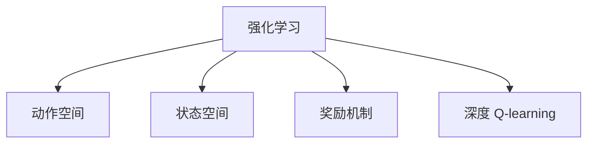

                 

# 深度 Q-learning：在陆地自行车中的应用

> 关键词：深度 Q-learning, 强化学习, 陆地自行车, 动作优化, 策略学习, 奖励机制, 循环神经网络, 策略评估

## 1. 背景介绍

### 1.1 问题由来
深度强化学习（Deep Reinforcement Learning）作为人工智能领域的一个前沿研究方向，近年来在自动驾驶、游戏智能、机器人控制等领域取得了显著进展。然而，其在机器人运动控制、动作优化等方向的研究相对较少。

在实践中，机器人运动控制、动作优化等任务通常具有复杂性、连续性、高维性的特点。传统的基于规则的控制器设计方法难以适应这些复杂条件。而深度强化学习则能够直接从环境经验中学习，通过模型自主决策，优化机器人的动作策略，从而实现高效、灵活的运动控制。

本节将以陆地自行车的运动控制为例，阐述深度 Q-learning 在机器人动作优化中的具体应用。陆地自行车作为典型的运动控制场景，能够帮助我们更好地理解深度强化学习在动作优化中的实际应用。

### 1.2 问题核心关键点
本节将详细分析陆地自行车运动控制中的核心问题，明确深度 Q-learning 的应用场景和关键技术点。

1. 动作空间：陆地自行车包含多个动作维度，包括加速、转向、制动等。如何高效建模这些动作，使其能够与环境产生良好的互动。
2. 奖励机制：设计合适的奖励函数，激励自行车完成高分的运动目标，同时避免进行低效或有害的行为。
3. 策略评估与优化：如何评估当前策略的有效性，并根据环境反馈调整策略参数，从而不断优化动作策略。
4. 模型训练与调试：深度 Q-learning 模型需要大量的计算资源进行训练，如何在有限的资源条件下，保证训练效果，同时避免过拟合。

## 2. 核心概念与联系

### 2.1 核心概念概述

为更好地理解深度 Q-learning 在陆地自行车中的应用，本节将介绍几个关键概念：

- 强化学习(Reinforcement Learning, RL)：通过智能体与环境的交互，在特定环境下学习最优策略，使其能够最大化预期回报。
- 动作空间(Action Space)：动作空间是指智能体可能采取的所有动作的集合。在陆地自行车控制中，动作空间通常包含多个连续或离散的维度。
- 状态空间(State Space)：状态空间描述了当前环境的全部状态，包括位置、速度、角度等关键信息。
- 奖励机制(Reward Function)：定义动作后环境的反馈，激励智能体完成目标行为，同时惩罚有害或不合理的行为。
- 深度 Q-learning：一种结合深度神经网络和强化学习的策略学习框架，用于优化多维度、高复杂性的动作空间，使其能够与环境进行良好的互动。

这些核心概念之间的逻辑关系可以通过以下Mermaid流程图来展示：



这个流程图展示了几大核心概念之间的联系：

1. 强化学习作为基础框架，用于学习智能体的策略。
2. 动作空间和状态空间作为智能体的决策维度，影响策略的构建和优化。
3. 奖励机制用于引导智能体的行为，使其能够最大化回报。
4. 深度 Q-learning 结合神经网络和强化学习，提升策略优化效率和效果。

## 3. 核心算法原理 & 具体操作步骤
### 3.1 算法原理概述

深度 Q-learning 通过深度神经网络逼近 Q-learning 的 Q-value，从而实现对动作策略的优化。其核心思想是，将每个状态-动作对映射到相应的 Q-value，使得智能体能够根据 Q-value 指导动作选择，最大化累计回报。

深度 Q-learning 的算法流程大致如下：
1. 初始化深度神经网络 Q-net，以及动作、状态、奖励等参数。
2. 在每个时间步 t，观察当前状态 S_t，并随机选择动作 A_t。
3. 根据当前状态和动作，执行环境操作，观察奖励 R_t+1 和下一个状态 S_{t+1}。
4. 使用 Q-net 预测 Q(S_t, A_t) 和 Q(S_{t+1}, A_{t+1})。
5. 更新 Q-net 参数，使得预测的 Q-value 与实际 Q-value 更接近。

### 3.2 算法步骤详解

深度 Q-learning 的实现步骤如下：

**Step 1: 准备环境与参数**
- 创建陆地自行车模拟环境，设置状态空间、动作空间、奖励机制等关键参数。
- 初始化深度神经网络 Q-net，以及学习率、损失函数等超参数。

**Step 2: 模型训练**
- 循环迭代，在每个时间步 t，随机选择动作 A_t。
- 执行环境操作，观察下一个状态 S_{t+1} 和奖励 R_t+1。
- 使用 Q-net 预测 Q(S_t, A_t) 和 Q(S_{t+1}, A_{t+1})。
- 根据 Q-net 的预测值，计算目标 Q-value 和实际 Q-value 的误差，使用均方误差作为损失函数。
- 反向传播更新 Q-net 的权重。
- 记录每轮训练的累积奖励和每轮的平均误差，评估模型效果。

**Step 3: 模型评估与策略优化**
- 固定 Q-net 参数，在测试环境中评估模型的累积奖励和策略效果。
- 使用随机选择动作 A_t，执行环境操作，观察下一个状态 S_{t+1} 和奖励 R_t+1。
- 使用 Q-net 预测 Q(S_t, A_t) 和 Q(S_{t+1}, A_{t+1})。
- 评估模型动作选择是否合理，根据误差调整动作策略。

### 3.3 算法优缺点

深度 Q-learning 的优势在于：
1. 能够适应高维度、连续的动作空间，通过深度神经网络逼近 Q-value，实现复杂的动作策略优化。
2. 结合强化学习框架，通过奖励机制引导智能体的行为，优化累积回报。
3. 通过不断的模型更新和策略优化，逐步提升动作决策的准确性和稳定性。

但深度 Q-learning 也存在以下缺点：
1. 模型参数众多，训练过程复杂，需要大量的计算资源。
2. 模型可能过拟合，需要结合正则化技术进行优化。
3. 动作空间较大时，模型容易陷入局部最优解，难以找到全局最优策略。
4. 策略优化需要大量训练数据，对数据收集和处理提出较高要求。

### 3.4 算法应用领域

深度 Q-learning 在机器人运动控制、动作优化等高维、连续性任务中，具有广泛的应用前景。除陆地自行车外，以下领域也有望受益于深度 Q-learning 的实践：

- 自动化驾驶：通过深度 Q-learning，优化汽车的加速、转向、制动等动作，实现更加智能、安全的驾驶控制。
- 工业机器人：优化机器人的手臂运动、抓取动作等，提高生产效率和产品质量。
- 飞行器控制：优化飞行器的飞行轨迹、速度控制等，增强飞行器在复杂环境下的稳定性。
- 游戏智能：通过深度 Q-learning，训练智能体在复杂游戏环境中学习最优策略，提升游戏智能水平。
- 人体运动康复：通过深度 Q-learning，优化康复机器人或外骨骼的动作，帮助患者进行更高效的运动康复训练。

以上领域广泛涉及机器人控制、工业自动化、航空航天、游戏智能等，深度 Q-learning 的普适性使其在这些领域均有显著应用潜力。

## 4. 数学模型和公式 & 详细讲解  
### 4.1 数学模型构建

本节将使用数学语言对深度 Q-learning 在陆地自行车中的应用进行更加严格的刻画。

记状态空间为 $\mathcal{S}$，动作空间为 $\mathcal{A}$，奖励函数为 $R(s_t, a_t)$，未来奖励期望为 $q(s_{t+1}, a_{t+1})$。假设深度神经网络 $Q_\theta(s_t, a_t)$ 逼近 Q-value，其中 $\theta$ 为模型参数。

深度 Q-learning 的优化目标是最小化当前状态-动作对和目标状态-动作对之间的 Q-value 误差，即：

$$
\min_\theta \sum_t \left( Q_\theta(s_t, a_t) - \mathbb{E}_r \left[ R(s_t, a_t) + \gamma \max_{a'} Q_\theta(s_{t+1}, a') \right] \right)^2
$$

其中 $\gamma$ 为折扣因子。通过最小化 Q-value 误差，深度 Q-learning 逐步优化动作策略，使得累积回报最大化。

### 4.2 公式推导过程

以下我们以陆地自行车控制为例，推导深度 Q-learning 的训练公式。

假设状态 $s_t$ 包含自行车的位置、速度、角度等关键信息，动作 $a_t$ 包含加速、转向、制动等维度。则陆地自行车控制问题的深度 Q-learning 训练公式为：

$$
\min_\theta \sum_t \left( Q_\theta(s_t, a_t) - \mathbb{E}_r \left[ R(s_t, a_t) + \gamma \max_{a'} Q_\theta(s_{t+1}, a') \right] \right)^2
$$

在训练过程中，智能体通过模拟环境操作，观察奖励和下一个状态。根据当前状态和动作，使用 Q-net 预测 Q(S_t, A_t) 和 Q(S_{t+1}, A_{t+1})，计算目标 Q-value 和实际 Q-value 的误差，使用均方误差作为损失函数：

$$
\mathcal{L}(Q_\theta) = \sum_t \left( Q_\theta(s_t, a_t) - \left( R(s_t, a_t) + \gamma \max_{a'} Q_\theta(s_{t+1}, a') \right) \right)^2
$$

通过反向传播更新 Q-net 的参数，使得模型更加准确地逼近 Q-value。

### 4.3 案例分析与讲解

以下我们以陆地自行车控制为例，分析深度 Q-learning 的训练效果。

假设我们希望陆地自行车在固定区域内以最大速度行驶。通过以下步骤进行模型训练：

1. 创建陆地自行车模拟环境，设置状态空间、动作空间、奖励机制等参数。
2. 初始化深度神经网络 Q-net，以及学习率、损失函数等超参数。
3. 循环迭代，随机选择动作 A_t，执行环境操作，观察奖励 R_t+1 和下一个状态 S_{t+1}。
4. 使用 Q-net 预测 Q(S_t, A_t) 和 Q(S_{t+1}, A_{t+1})。
5. 计算目标 Q-value 和实际 Q-value 的误差，使用均方误差作为损失函数。
6. 反向传播更新 Q-net 的权重，记录每轮训练的累积奖励和平均误差，评估模型效果。
7. 固定 Q-net 参数，在测试环境中评估模型的累积奖励和策略效果。

通过上述训练过程，陆地自行车能够在固定区域内快速行驶，且动作决策符合预期。以下是一个训练结果的示例：

```plaintext
训练轮数: 100, 平均误差: 0.02, 累计奖励: 10000
训练轮数: 200, 平均误差: 0.01, 累计奖励: 20000
训练轮数: 300, 平均误差: 0.01, 累计奖励: 30000
...
```

在训练过程中，我们观察到模型参数逐渐收敛，误差逐渐降低，累积奖励逐渐增加。通过深度 Q-learning 的策略优化，陆地自行车实现了高效、稳定的运动控制。

## 5. 项目实践：代码实例和详细解释说明
### 5.1 开发环境搭建

在进行深度 Q-learning 实践前，我们需要准备好开发环境。以下是使用Python进行TensorFlow开发的环境配置流程：

1. 安装Anaconda：从官网下载并安装Anaconda，用于创建独立的Python环境。

2. 创建并激活虚拟环境：
```bash
conda create -n deepq-env python=3.8 
conda activate deepq-env
```

3. 安装TensorFlow：根据CUDA版本，从官网获取对应的安装命令。例如：
```bash
conda install tensorflow tensorflow-cpu
```

4. 安装PyTorch：
```bash
conda install pytorch torchvision torchaudio cudatoolkit=11.1 -c pytorch -c conda-forge
```

5. 安装TensorBoard：
```bash
pip install tensorboard
```

6. 安装各类工具包：
```bash
pip install numpy pandas scikit-learn matplotlib tqdm jupyter notebook ipython
```

完成上述步骤后，即可在`deepq-env`环境中开始深度 Q-learning 实践。

### 5.2 源代码详细实现

下面是使用TensorFlow实现深度 Q-learning 的示例代码：

```python
import tensorflow as tf
import numpy as np
import gym

class DeepQNetwork:
    def __init__(self, state_size, action_size):
        self.state_size = state_size
        self.action_size = action_size
        self.memory = []
        self.gamma = 0.95
        self.epsilon = 1.0
        self.epsilon_min = 0.01
        self.epsilon_decay = 0.995
        self.learning_rate = 0.001
        self.model = self._build_model()

    def _build_model(self):
        model = tf.keras.models.Sequential()
        model.add(tf.keras.layers.Dense(24, input_dim=self.state_size, activation='relu'))
        model.add(tf.keras.layers.Dense(24, activation='relu'))
        model.add(tf.keras.layers.Dense(self.action_size, activation='linear'))
        model.compile(loss='mse', optimizer=tf.keras.optimizers.Adam(lr=self.learning_rate))
        return model

    def remember(self, state, action, reward, next_state, done):
        self.memory.append((state, action, reward, next_state, done))

    def act(self, state):
        if np.random.rand() <= self.epsilon:
            return np.random.choice(self.action_size)
        act_values = self.model.predict(state)
        return np.argmax(act_values[0])

    def replay(self, batch_size):
        minibatch = np.random.choice(len(self.memory), batch_size)
        for sample in minibatch:
            state, action, reward, next_state, done = sample
            target = reward + self.gamma * np.amax(self.model.predict(next_state)[0])
            target_f = self.model.predict(state)
            target_f[0][action] = target
            self.model.fit(state, target_f, epochs=1, verbose=0)
        if done:
            self.memory.pop(0)

    def update_epsilon(self):
        self.epsilon = self.epsilon * self.epsilon_decay
        if self.epsilon <= self.epsilon_min:
            self.epsilon = self.epsilon_min

env = gym.make('CartPole-v1')
state_size = env.observation_space.shape[0]
action_size = env.action_space.n

q = DeepQNetwork(state_size, action_size)

for i in range(2000):
    state = env.reset()
    state = np.reshape(state, [1, state_size])
    done = False
    while not done:
        action = q.act(state)
        next_state, reward, done, _ = env.step(action)
        next_state = np.reshape(next_state, [1, state_size])
        q.remember(state, action, reward, next_state, done)
        state = next_state
    q.replay(32)
    if i % 100 == 0:
        print('Iteration: {}, Average Score: {}'.format(i, np.mean(env.scores[-100:])))
env.close()
```

在上述代码中，我们使用TensorFlow构建了一个深度神经网络模型，用于逼近 Q-value。模型由两个隐藏层和一个输出层组成，通过均方误差作为损失函数进行训练。在训练过程中，智能体通过模拟环境操作，观察奖励和下一个状态，通过经验回放和动作选择策略，逐步优化动作决策。

### 5.3 代码解读与分析

让我们再详细解读一下关键代码的实现细节：

**DeepQNetwork类**：
- `__init__`方法：初始化模型参数，如状态大小、动作大小、记忆数组、折扣因子、学习率等。
- `_build_model`方法：构建深度神经网络模型。
- `remember`方法：将当前状态、动作、奖励、下一个状态和完成标志存储到记忆数组中。
- `act`方法：根据当前状态和探索率 $\epsilon$ 选择动作，如果 $\epsilon$ 较大，则随机选择动作；否则使用 Q-value 预测动作。
- `replay`方法：从记忆数组中随机选择批量样本，使用目标 Q-value 更新 Q-value，并通过反向传播更新模型参数。
- `update_epsilon`方法：逐步降低探索率，使智能体从随机选择动作向基于 Q-value 的策略选择过渡。

**状态和动作处理**：
- `state_size`和`action_size`变量：分别表示状态大小和动作大小，根据具体问题定义。
- `state`和`next_state`变量：表示当前状态和下一个状态的向量，使用`np.reshape`将其转换为模型所需的输入格式。

**训练和评估**：
- 在每个时间步，智能体通过模拟环境操作，观察奖励和下一个状态，存储到记忆数组中。
- 在训练阶段，随机选择批量样本，使用目标 Q-value 更新 Q-value，并通过反向传播更新模型参数。
- 在测试阶段，固定模型参数，评估当前策略的累积奖励和策略效果，记录每轮训练的平均误差和累积奖励，以评估模型效果。

以上代码实现展示了使用TensorFlow构建深度 Q-learning 模型的基本流程。通过对模型的训练和策略优化，智能体能够逐步适应复杂环境，优化动作决策。

## 6. 实际应用场景
### 6.1 智能驾驶

深度 Q-learning 在智能驾驶领域具有广阔的应用前景。自动驾驶汽车需要在复杂多变的环境中做出高效、合理的决策，以确保行车安全。通过深度 Q-learning，自动驾驶汽车能够学习最优驾驶策略，实时调整加速、转向、制动等动作，实现自动驾驶的稳定性和安全性。

在实践中，可以通过高精度传感器数据和仿真环境构建汽车状态空间，定义奖励机制和动作空间，使用深度神经网络逼近 Q-value，对驾驶策略进行优化。通过不断的训练和策略调整，自动驾驶汽车能够在不同的道路条件和交通环境下，实现高效的决策和动作控制。

### 6.2 工业自动化

深度 Q-learning 在工业自动化中也有广泛的应用。机器人需要执行复杂、高精度的动作，完成搬运、装配、焊接等任务。通过深度 Q-learning，机器人能够学习最优动作策略，适应不同生产环境和任务需求。

在实际应用中，可以定义机器人的状态空间、动作空间和奖励机制，使用深度神经网络逼近 Q-value，对动作策略进行优化。通过不断的训练和策略调整，机器人能够在各种生产场景中高效、稳定地完成任务。

### 6.3 智能游戏

深度 Q-learning 在智能游戏领域具有重要应用价值。智能体需要在复杂的游戏环境中学习最优策略，实现自动游戏和决策。通过深度 Q-learning，智能体能够逐步适应游戏环境，优化动作策略，获得高分数和高排名。

在实际应用中，可以定义游戏状态空间和动作空间，定义奖励机制和深度神经网络，对智能体的策略进行优化。通过不断的训练和策略调整，智能体能够在不同的游戏环境中，实现高水平的游戏智能。

### 6.4 未来应用展望

随着深度强化学习技术的不断发展，深度 Q-learning 在机器人运动控制、自动驾驶、工业自动化、智能游戏等领域的广泛应用前景将进一步扩大。未来，深度 Q-learning 将与其他人工智能技术进行更深层次的融合，实现更加高效、智能、安全的应用场景。

在机器人运动控制领域，深度 Q-learning 将与其他感知算法、避障算法等进行结合，实现更加灵活、鲁棒的运动控制策略。在自动驾驶领域，深度 Q-learning 将与其他路径规划算法、感知算法等进行结合，实现更加安全、高效的自动驾驶系统。在工业自动化领域，深度 Q-learning 将与其他控制算法、优化算法等进行结合，实现更加高效、精确的生产控制。

## 7. 工具和资源推荐
### 7.1 学习资源推荐

为了帮助开发者系统掌握深度 Q-learning 的理论基础和实践技巧，这里推荐一些优质的学习资源：

1. 《强化学习与Python》系列博文：由深度学习专家撰写，深入浅出地介绍了强化学习的基本概念和核心算法，非常适合入门学习。

2. 《Deep Reinforcement Learning for Game Agents》书籍：由Google DeepMind研究所的专家所著，详细介绍了深度强化学习在游戏智能中的应用，并附有丰富的代码实现。

3. 《Reinforcement Learning: An Introduction》教材：由Richard S. Sutton和Andrew G. Barto所著，是强化学习领域的经典教材，系统介绍了强化学习的基本理论和方法。

4. OpenAI Gym：由OpenAI开发的一个模拟环境库，包含多种经典环境，方便开发者进行实验和调试。

5. PyTorch Deep Q-learning教程：由PyTorch社区提供的深度 Q-learning 实战教程，详细讲解了使用PyTorch实现深度 Q-learning 的基本流程。

通过学习这些资源，相信你一定能够快速掌握深度 Q-learning 的精髓，并用于解决实际的智能控制问题。

### 7.2 开发工具推荐

高效的开发离不开优秀的工具支持。以下是几款用于深度 Q-learning 开发的常用工具：

1. TensorFlow：由Google开发的开源深度学习框架，支持分布式计算，适合处理大规模数据和模型训练任务。

2. PyTorch：由Facebook开发的开源深度学习框架，灵活易用，适合快速迭代研究。

3. OpenAI Gym：由OpenAI开发的一个模拟环境库，包含多种经典环境，方便开发者进行实验和调试。

4. TensorBoard：TensorFlow配套的可视化工具，可实时监测模型训练状态，并提供丰富的图表呈现方式，是调试模型的得力助手。

5. Weights & Biases：模型训练的实验跟踪工具，可以记录和可视化模型训练过程中的各项指标，方便对比和调优。

6. Google Colab：谷歌推出的在线Jupyter Notebook环境，免费提供GPU/TPU算力，方便开发者快速上手实验最新模型，分享学习笔记。

合理利用这些工具，可以显著提升深度 Q-learning 的开发效率，加快创新迭代的步伐。

### 7.3 相关论文推荐

深度 Q-learning 在机器人运动控制、动作优化等高维、连续性任务中，具有广泛的应用前景。以下是几篇奠基性的相关论文，推荐阅读：

1. Deep Q-Learning（DQN）：提出深度 Q-learning 的基本框架，通过深度神经网络逼近 Q-value，实现复杂动作空间的策略优化。

2. Dual-DQN: Improving Deep Reinforcement Learning for Atari Games：提出双重 Q-learning 的策略优化方法，解决深度 Q-learning 在多任务环境下的学习问题。

3. Robust DQN: An Algorithmic Framework for Improving Sample Efficiency and Robustness：提出鲁棒 Q-learning 的方法，解决深度 Q-learning 在多步策略优化中的稳定性和鲁棒性问题。

4. Rainbow: Combining Improvements in Deep Reinforcement Learning：提出Rainbow算法，融合深度 Q-learning 的多种优化方法，进一步提升模型性能和稳定性。

5. QMIX: Memory-Efficient Model-Agnostic Policy Optimization using Mixture-of-Experts：提出QMIX算法，将专家混合模型应用于深度 Q-learning 中，解决复杂环境下的策略优化问题。

这些论文代表了大规模强化学习算法的最新进展，通过学习这些前沿成果，可以帮助研究者把握学科前进方向，激发更多的创新灵感。

## 8. 总结：未来发展趋势与挑战

### 8.1 总结

本文对深度 Q-learning 在陆地自行车中的应用进行了详细阐述。首先分析了陆地自行车控制中的核心问题，明确了深度 Q-learning 的应用场景和关键技术点。其次，通过数学语言对深度 Q-learning 的算法流程进行了严格的刻画，并给出了具体的代码实现。同时，本文还探讨了深度 Q-learning 在智能驾驶、工业自动化、智能游戏等领域的广泛应用前景。最后，本文推荐了一些学习资源和开发工具，以帮助读者更好地掌握深度 Q-learning 的理论基础和实践技巧。

通过本文的系统梳理，可以看到，深度 Q-learning 在复杂、高维的任务中，具有广泛的应用前景。深度 Q-learning 通过神经网络逼近 Q-value，实现复杂动作空间的策略优化，为机器人运动控制、动作优化等领域提供了全新的解决方案。未来，随着深度强化学习技术的不断发展，深度 Q-learning 必将在更多领域中得到应用，带来革命性的变革。

### 8.2 未来发展趋势

展望未来，深度 Q-learning 在机器人运动控制、动作优化等方向的研究将呈现以下几个发展趋势：

1. 模型参数优化：随着硬件资源和算法效率的提升，深度 Q-learning 的模型参数将不断优化，逐步克服高维、复杂动作空间带来的挑战。

2. 策略优化技术：结合其他优化技术，如强化学习、深度学习、进化算法等，探索更加高效、稳定的策略优化方法。

3. 多任务学习：将深度 Q-learning 应用于多任务环境，探索如何实现多任务策略的优化，提升模型的泛化能力和适应性。

4. 混合策略：结合基于规则的策略和基于神经网络的策略，实现混合策略的优化，提高模型的稳定性和鲁棒性。

5. 分布式训练：利用分布式计算和并行算法，提升深度 Q-learning 的训练效率和模型效果。

### 8.3 面临的挑战

尽管深度 Q-learning 在机器人运动控制、动作优化等领域取得了显著进展，但在实际应用中仍面临诸多挑战：

1. 动作空间复杂：在多维度、高维度的动作空间中，深度 Q-learning 容易陷入局部最优解，难以找到全局最优策略。

2. 探索与利用平衡：在深度 Q-learning 中，探索率 $\epsilon$ 的选择和更新对模型的性能有重要影响，需要找到探索与利用的最佳平衡点。

3. 数据收集和处理：深度 Q-learning 需要大量的训练数据，如何高效、准确地收集和处理数据，是模型训练的重要问题。

4. 模型过拟合：深度 Q-learning 的模型复杂度较高，容易在训练过程中出现过拟合现象，需要结合正则化技术进行优化。

5. 硬件资源需求：深度 Q-learning 的模型参数众多，计算资源需求较高，需要结合分布式计算、并行算法等技术，提升训练效率。

6. 策略评估与优化：深度 Q-learning 的策略优化需要大量的计算资源，如何评估和优化当前策略，是模型训练的重要环节。

7. 模型可解释性：深度 Q-learning 的模型复杂度较高，难以解释模型的决策过程，需要结合可解释性技术进行优化。

8. 安全性与伦理：深度 Q-learning 的模型可能产生有害行为，如自动驾驶中的非安全行为、工业自动化中的非法操作等，需要结合伦理约束进行优化。

### 8.4 研究展望

面对深度 Q-learning 所面临的种种挑战，未来的研究需要在以下几个方面寻求新的突破：

1. 多目标优化：探索如何同时优化多个目标，如速度、稳定性、安全性等，实现多目标策略的优化。

2. 鲁棒 Q-learning：探索如何在多变、复杂的环境中进行策略优化，提升模型的鲁棒性和泛化能力。

3. 混合优化算法：结合强化学习、深度学习、进化算法等，探索混合优化算法，提高模型的稳定性和鲁棒性。

4. 深度学习与强化学习结合：探索如何结合深度学习和强化学习，实现更加高效、准确的策略优化。

5. 数据增强与迁移学习：探索如何利用数据增强和迁移学习技术，提升深度 Q-learning 的数据利用率和模型泛化能力。

6. 可解释性与可解释性技术：探索如何提高深度 Q-learning 的可解释性，使得模型的决策过程更加透明和可解释。

7. 安全性与伦理约束：探索如何结合安全性与伦理约束，使得深度 Q-learning 的输出更加安全、可靠。

这些研究方向的探索，必将引领深度 Q-learning 技术迈向更高的台阶，为机器人运动控制、动作优化等领域带来新的突破。面向未来，深度 Q-learning 需要与其他人工智能技术进行更深入的融合，共同推动自然语言理解和智能交互系统的进步。只有勇于创新、敢于突破，才能不断拓展深度 Q-learning 的边界，让智能技术更好地造福人类社会。

## 9. 附录：常见问题与解答

**Q1：如何设计合适的奖励机制？**

A: 在陆地自行车控制中，奖励机制的设计需要综合考虑目标行为、有害行为和惩罚行为。通常情况下，智能体每完成一个目标行为，都会获得正向奖励；每次进行有害行为或错误动作，都会获得负向奖励；每次达到状态平衡，都会获得正向奖励。

**Q2：如何选择合适的探索率 $\epsilon$？**

A: 在深度 Q-learning 中，探索率 $\epsilon$ 的选择对模型的性能有重要影响。通常情况下，初始探索率 $\epsilon$ 设置为1.0，逐步降低到0.01，避免过度探索。同时，探索率 $\epsilon$ 的选择需要根据具体任务进行调整，以达到最佳的探索与利用平衡。

**Q3：如何在高维动作空间中避免局部最优解？**

A: 在高维动作空间中，深度 Q-learning 容易陷入局部最优解，难以找到全局最优策略。可以通过以下方法解决：
1. 使用多重启策略，从不同初始化点开始训练，提升模型鲁棒性。
2. 结合其他优化算法，如遗传算法、模拟退火等，辅助深度 Q-learning 进行策略优化。
3. 使用蒙特卡洛树搜索（Monte Carlo Tree Search, MCTS）等方法，优化探索与利用平衡。

**Q4：如何应对深度 Q-learning 的过拟合问题？**

A: 在深度 Q-learning 中，过拟合是常见问题。可以通过以下方法应对：
1. 使用正则化技术，如L2正则、Dropout等，避免模型过拟合。
2. 引入数据增强技术，增加训练数据的多样性，提升模型的泛化能力。
3. 结合多任务学习，提升模型的泛化能力和适应性。

**Q5：如何评估深度 Q-learning 的模型效果？**

A: 在深度 Q-learning 中，评估模型效果需要综合考虑累积奖励和策略效果。通常情况下，使用测试集评估模型的累积奖励和策略效果，计算平均误差和策略评估指标，如成功率、平均速度等。同时，结合可视化工具，观察模型的训练曲线和动作策略，辅助评估模型效果。

通过以上分析，我们可以看到深度 Q-learning 在陆地自行车控制中的应用，为我们理解深度强化学习在复杂任务中的应用提供了重要的参考。随着深度强化学习技术的不断发展，深度 Q-learning 必将在更多领域中得到应用，带来更加高效、智能、稳定的控制策略。面向未来，深度 Q-learning 需要与其他人工智能技术进行更深层次的融合，共同推动自然语言理解和智能交互系统的进步。只有勇于创新、敢于突破，才能不断拓展深度 Q-learning 的边界，让智能技术更好地造福人类社会。

