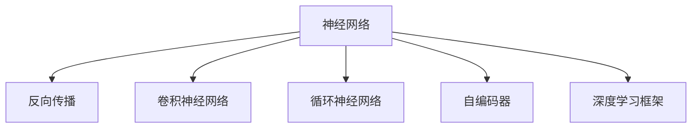

                 

# 深度学习原理与代码实例讲解

> 关键词：深度学习,神经网络,反向传播,卷积神经网络(CNN),循环神经网络(RNN),Transformer模型,PyTorch,TensorFlow

## 1. 背景介绍

### 1.1 问题由来
深度学习（Deep Learning）作为人工智能领域的一个热门研究方向，近年来取得了突破性的进展。从图像识别、语音识别到自然语言处理等诸多领域，深度学习模型已经展示了其强大的学习和推理能力。然而，深度学习模型复杂的结构、庞大的参数量和难以解释的内部机制，常常令初学者感到困惑。本文旨在深入浅出地讲解深度学习的核心原理，并通过实际代码实例，帮助读者更好地理解深度学习技术。

### 1.2 问题核心关键点
深度学习模型的核心在于其能够通过多层次的抽象和组合，自动学习输入数据的复杂表示。其核心思想是通过构建多层神经网络结构，利用反向传播算法更新模型参数，逐步逼近目标函数。

具体来说，深度学习模型的关键点包括：
- 神经网络架构：如何选择、设计网络层数和神经元数量。
- 激活函数：如何选择和设计激活函数，如ReLU、Sigmoid、Tanh等。
- 损失函数：如何选择和设计损失函数，如均方误差、交叉熵等。
- 优化算法：如何选择和设计优化算法，如SGD、Adam等。
- 正则化技术：如何选择和设计正则化技术，如L2正则、Dropout等。
- 模型集成与调参：如何进行模型集成和超参数调优。

这些关键点决定了深度学习模型能否在特定任务上取得理想的表现。本文将详细讲解这些关键点，并通过代码实例展示其实现过程。

## 2. 核心概念与联系

### 2.1 核心概念概述

为更好地理解深度学习的核心概念，本节将介绍几个密切相关的核心概念：

- 神经网络（Neural Network）：由一系列神经元（Neuron）按照特定的拓扑结构组成的网络，用于学习输入数据的复杂表示。
- 反向传播（Backpropagation）：一种用于优化神经网络参数的算法，通过反向传播误差信号来更新网络权重。
- 卷积神经网络（Convolutional Neural Network, CNN）：一种专门用于图像处理和计算机视觉任务的神经网络。
- 循环神经网络（Recurrent Neural Network, RNN）：一种能够处理序列数据的神经网络，常用于自然语言处理、时间序列预测等任务。
- 自编码器（Autoencoder）：一种用于无监督学习的数据压缩和去噪方法。
- 深度学习框架：如TensorFlow、PyTorch等，提供了强大的深度学习模型构建和训练工具。

这些核心概念之间的逻辑关系可以通过以下Mermaid流程图来展示：



这个流程图展示了一些基本的网络结构，并通过反向传播算法进行参数优化。

## 3. 核心算法原理 & 具体操作步骤
### 3.1 算法原理概述

深度学习模型的核心在于其能够通过多层次的抽象和组合，自动学习输入数据的复杂表示。其核心思想是通过构建多层神经网络结构，利用反向传播算法更新模型参数，逐步逼近目标函数。

具体来说，深度学习模型的关键点包括：
- 神经网络架构：如何选择、设计网络层数和神经元数量。
- 激活函数：如何选择和设计激活函数，如ReLU、Sigmoid、Tanh等。
- 损失函数：如何选择和设计损失函数，如均方误差、交叉熵等。
- 优化算法：如何选择和设计优化算法，如SGD、Adam等。
- 正则化技术：如何选择和设计正则化技术，如L2正则、Dropout等。
- 模型集成与调参：如何进行模型集成和超参数调优。

这些关键点决定了深度学习模型能否在特定任务上取得理想的表现。本文将详细讲解这些关键点，并通过代码实例展示其实现过程。

### 3.2 算法步骤详解

以下是深度学习模型的典型训练流程：

1. 数据预处理：将输入数据进行标准化、归一化等处理，以便模型更好地学习。
2. 构建模型：选择合适的神经网络架构，如全连接网络、卷积网络、循环网络等。
3. 损失函数设计：根据具体任务，设计合适的损失函数。
4. 优化算法选择：选择合适的优化算法，如SGD、Adam等，并设置相应的超参数。
5. 正则化技术应用：加入L2正则、Dropout等正则化技术，防止过拟合。
6. 模型训练：在训练集上迭代训练模型，不断优化参数。
7. 模型评估：在验证集上评估模型性能，选择最佳模型进行测试。

### 3.3 算法优缺点

深度学习模型的优点在于其能够通过多层抽象学习复杂的表示，具有很强的泛化能力。然而，深度学习模型的训练过程较为复杂，需要大量的数据和计算资源。此外，深度学习模型的可解释性较差，难以理解其内部机制。

## 4. 数学模型和公式 & 详细讲解 & 举例说明

### 4.1 数学模型构建

以下是深度学习模型的数学模型构建过程：

- 定义输入数据 $x \in \mathbb{R}^n$。
- 定义神经网络的结构，包括输入层、隐藏层和输出层。
- 定义隐藏层的神经元数量为 $h$。
- 定义激活函数 $f(\cdot)$。
- 定义权重矩阵 $W \in \mathbb{R}^{h \times n}$。
- 定义偏置向量 $b \in \mathbb{R}^h$。
- 定义输出层权重矩阵 $U \in \mathbb{R}^m \times h$。
- 定义输出层偏置向量 $v \in \mathbb{R}^m$。

其中，输入数据 $x$ 经过线性变换 $Wx+b$ 和激活函数 $f(\cdot)$，得到隐藏层的输出 $h_1$。隐藏层的输出 $h_1$ 再次经过线性变换 $Uh_1+v$ 和激活函数 $g(\cdot)$，得到最终的输出结果 $y$。

### 4.2 公式推导过程

以下是深度学习模型的公式推导过程：

1. 隐藏层的前向传播公式为：
   $$
   h_1 = f(Wx+b)
   $$
2. 输出层的前向传播公式为：
   $$
   y = g(Uh_1+v)
   $$
3. 定义损失函数 $J(y, \hat{y})$，如均方误差：
   $$
   J(y, \hat{y}) = \frac{1}{2m}\sum_{i=1}^m(y_i - \hat{y}_i)^2
   $$
4. 计算损失函数对权重矩阵 $U$ 的偏导数：
   $$
   \frac{\partial J(y, \hat{y})}{\partial U} = \frac{1}{m}\sum_{i=1}^m(h_1 - \hat{y}_i) \frac{\partial g}{\partial h_1} \frac{\partial h_1}{\partial W} = (h_1 - \hat{y}) g'(h_1) W^T
   $$
5. 计算损失函数对偏置向量 $v$ 的偏导数：
   $$
   \frac{\partial J(y, \hat{y})}{\partial v} = \frac{1}{m}\sum_{i=1}^m(h_1 - \hat{y}_i) \frac{\partial g}{\partial h_1} = (h_1 - \hat{y}) g'(h_1)
   $$
6. 计算损失函数对输入数据 $x$ 的偏导数：
   $$
   \frac{\partial J(y, \hat{y})}{\partial x} = \frac{\partial J(y, \hat{y})}{\partial h_1} \frac{\partial h_1}{\partial x} = \frac{\partial h_1}{\partial x} W^T (h_1 - \hat{y}) g'(h_1)
   $$

### 4.3 案例分析与讲解

以下是一个简单的全连接神经网络的实现过程，用于二分类任务。

```python
import torch
import torch.nn as nn
import torch.optim as optim
from torch.utils.data import DataLoader
from torchvision import datasets, transforms

# 定义神经网络结构
class Net(nn.Module):
    def __init__(self):
        super(Net, self).__init__()
        self.fc1 = nn.Linear(784, 128)
        self.fc2 = nn.Linear(128, 64)
        self.fc3 = nn.Linear(64, 2)
        self.relu = nn.ReLU()

    def forward(self, x):
        x = self.fc1(x)
        x = self.relu(x)
        x = self.fc2(x)
        x = self.relu(x)
        x = self.fc3(x)
        return x

# 加载MNIST数据集
train_dataset = datasets.MNIST(root='./data', train=True, transform=transforms.ToTensor(), download=True)
test_dataset = datasets.MNIST(root='./data', train=False, transform=transforms.ToTensor())

# 定义训练参数
net = Net()
criterion = nn.CrossEntropyLoss()
optimizer = optim.Adam(net.parameters(), lr=0.001)
device = torch.device('cuda' if torch.cuda.is_available() else 'cpu')

# 定义训练函数
def train(model, train_loader, optimizer, criterion):
    model.train()
    for batch_idx, (data, target) in enumerate(train_loader):
        data, target = data.to(device), target.to(device)
        optimizer.zero_grad()
        output = model(data)
        loss = criterion(output, target)
        loss.backward()
        optimizer.step()
        if batch_idx % 100 == 0:
            print('Train Epoch: {} [{}/{} ({:.0f}%)]\tLoss: {:.6f}'.format(
                epoch, batch_idx * len(data), len(train_loader.dataset),
                100. * batch_idx / len(train_loader), loss.item()))

# 定义测试函数
def test(model, test_loader, criterion):
    model.eval()
    test_loss = 0
    correct = 0
    with torch.no_grad():
        for data, target in test_loader:
            data, target = data.to(device), target.to(device)
            output = model(data)
            test_loss += criterion(output, target).item()
            pred = output.argmax(dim=1, keepdim=True)
            correct += pred.eq(target.view_as(pred)).sum().item()

    test_loss /= len(test_loader.dataset)
    print('\nTest set: Average loss: {:.4f}, Accuracy: {}/{} ({:.0f}%)\n'.format(
        test_loss, correct, len(test_loader.dataset),
        100. * correct / len(test_loader.dataset)))

# 训练和测试
net.to(device)
train_loader = DataLoader(train_dataset, batch_size=64, shuffle=True)
test_loader = DataLoader(test_dataset, batch_size=64, shuffle=False)
optimizer = optim.Adam(net.parameters(), lr=0.001)

for epoch in range(10):
    train(net, train_loader, optimizer, criterion)
    test(net, test_loader, criterion)
```

## 5. 项目实践：代码实例和详细解释说明
### 5.1 开发环境搭建

在进行深度学习项目实践前，我们需要准备好开发环境。以下是使用Python进行PyTorch开发的环境配置流程：

1. 安装Anaconda：从官网下载并安装Anaconda，用于创建独立的Python环境。

2. 创建并激活虚拟环境：
```bash
conda create -n pytorch-env python=3.8 
conda activate pytorch-env
```

3. 安装PyTorch：根据CUDA版本，从官网获取对应的安装命令。例如：
```bash
conda install pytorch torchvision torchaudio cudatoolkit=11.1 -c pytorch -c conda-forge
```

4. 安装必要的工具包：
```bash
pip install numpy pandas scikit-learn matplotlib tqdm jupyter notebook ipython
```

完成上述步骤后，即可在`pytorch-env`环境中开始深度学习项目实践。

### 5.2 源代码详细实现

下面我们以卷积神经网络(CNN)为例，给出使用PyTorch实现图像分类任务的代码。

```python
import torch
import torch.nn as nn
import torch.optim as optim
from torch.utils.data import DataLoader
from torchvision import datasets, transforms

# 定义卷积神经网络结构
class Net(nn.Module):
    def __init__(self):
        super(Net, self).__init__()
        self.conv1 = nn.Conv2d(1, 6, 5)
        self.pool = nn.MaxPool2d(2, 2)
        self.conv2 = nn.Conv2d(6, 16, 5)
        self.fc1 = nn.Linear(16 * 4 * 4, 120)
        self.fc2 = nn.Linear(120, 84)
        self.fc3 = nn.Linear(84, 10)

    def forward(self, x):
        x = self.pool(F.relu(self.conv1(x)))
        x = self.pool(F.relu(self.conv2(x)))
        x = x.view(-1, 16 * 4 * 4)
        x = F.relu(self.fc1(x))
        x = F.relu(self.fc2(x))
        x = self.fc3(x)
        return x

# 加载MNIST数据集
train_dataset = datasets.MNIST(root='./data', train=True, transform=transforms.ToTensor(), download=True)
test_dataset = datasets.MNIST(root='./data', train=False, transform=transforms.ToTensor())

# 定义训练参数
net = Net()
criterion = nn.CrossEntropyLoss()
optimizer = optim.SGD(net.parameters(), lr=0.001, momentum=0.9)
device = torch.device('cuda' if torch.cuda.is_available() else 'cpu')

# 定义训练函数
def train(model, train_loader, optimizer, criterion):
    model.train()
    for batch_idx, (data, target) in enumerate(train_loader):
        data, target = data.to(device), target.to(device)
        optimizer.zero_grad()
        output = model(data)
        loss = criterion(output, target)
        loss.backward()
        optimizer.step()
        if batch_idx % 100 == 0:
            print('Train Epoch: {} [{}/{} ({:.0f}%)]\tLoss: {:.6f}'.format(
                epoch, batch_idx * len(data), len(train_loader.dataset),
                100. * batch_idx / len(train_loader), loss.item()))

# 定义测试函数
def test(model, test_loader, criterion):
    model.eval()
    test_loss = 0
    correct = 0
    with torch.no_grad():
        for data, target in test_loader:
            data, target = data.to(device), target.to(device)
            output = model(data)
            test_loss += criterion(output, target).item()
            pred = output.argmax(dim=1, keepdim=True)
            correct += pred.eq(target.view_as(pred)).sum().item()

    test_loss /= len(test_loader.dataset)
    print('\nTest set: Average loss: {:.4f}, Accuracy: {}/{} ({:.0f}%)\n'.format(
        test_loss, correct, len(test_loader.dataset),
        100. * correct / len(test_loader.dataset)))

# 训练和测试
net.to(device)
train_loader = DataLoader(train_dataset, batch_size=64, shuffle=True)
test_loader = DataLoader(test_dataset, batch_size=64, shuffle=False)
optimizer = optim.SGD(net.parameters(), lr=0.001, momentum=0.9)

for epoch in range(10):
    train(net, train_loader, optimizer, criterion)
    test(net, test_loader, criterion)
```

## 6. 实际应用场景

### 6.1 图像分类

卷积神经网络(CNN)是一种专门用于图像处理和计算机视觉任务的神经网络。通过使用卷积层和池化层，CNN可以自动提取图像中的特征，并将其转换为高维的表示。CNN在图像分类、目标检测、人脸识别等任务上取得了卓越的性能。

### 6.2 语音识别

循环神经网络(RNN)是一种能够处理序列数据的神经网络，常用于自然语言处理、时间序列预测等任务。在语音识别中，RNN可以处理音频信号的序列特征，并将其转换为文本形式的语音识别结果。

### 6.3 自然语言处理

循环神经网络(RNN)和Transformer模型是自然语言处理领域常用的神经网络结构。通过使用LSTM、GRU等RNN结构，或Transformer模型，可以处理文本序列的语义信息，并进行文本分类、情感分析、机器翻译等任务。

## 7. 工具和资源推荐
### 7.1 学习资源推荐

为了帮助开发者系统掌握深度学习的核心原理和实践技巧，这里推荐一些优质的学习资源：

1. 《深度学习》书籍：由Goodfellow等作者合著，系统介绍了深度学习的基本概念、算法和应用。

2. 《神经网络与深度学习》课程：由Coursera开设的深度学习入门课程，通过视频和习题帮助学习者快速入门。

3. 《动手学深度学习》书籍：由李沐等作者合著，提供了丰富的代码示例和实验，适合实战学习。

4. PyTorch官方文档：PyTorch官方文档提供了详细的API和教程，是学习PyTorch的必备资源。

5. TensorFlow官方文档：TensorFlow官方文档提供了丰富的API和教程，是学习TensorFlow的必备资源。

通过对这些资源的学习实践，相信你一定能够快速掌握深度学习的基本原理和实现方法，并用于解决实际的机器学习问题。

### 7.2 开发工具推荐

高效的开发离不开优秀的工具支持。以下是几款用于深度学习开发的常用工具：

1. PyTorch：基于Python的开源深度学习框架，灵活动态的计算图，适合快速迭代研究。

2. TensorFlow：由Google主导开发的开源深度学习框架，生产部署方便，适合大规模工程应用。

3. Keras：基于TensorFlow的高级API，提供了简单易用的接口，适合快速原型开发。

4. Weights & Biases：模型训练的实验跟踪工具，可以记录和可视化模型训练过程中的各项指标，方便对比和调优。

5. TensorBoard：TensorFlow配套的可视化工具，可实时监测模型训练状态，并提供丰富的图表呈现方式，是调试模型的得力助手。

合理利用这些工具，可以显著提升深度学习项目的开发效率，加快创新迭代的步伐。

### 7.3 相关论文推荐

深度学习技术的发展源于学界的持续研究。以下是几篇奠基性的相关论文，推荐阅读：

1. 《ImageNet Classification with Deep Convolutional Neural Networks》：提出使用卷积神经网络进行图像分类的经典论文，奠定了深度学习在计算机视觉领域的基础。

2. 《Long Short-Term Memory》：提出LSTM结构，在自然语言处理领域取得了突破性进展。

3. 《Attention is All You Need》：提出Transformer模型，开启了深度学习在自然语言处理领域的预训练范式。

4. 《Deep Residual Learning for Image Recognition》：提出残差网络，提高了深度神经网络的可训练性和性能。

5. 《Imagenet Classification with Deep Convolutional Neural Networks》：提出使用卷积神经网络进行图像分类的经典论文，奠定了深度学习在计算机视觉领域的基础。

这些论文代表了大深度学习的研究脉络，通过学习这些前沿成果，可以帮助研究者把握学科前进方向，激发更多的创新灵感。

## 8. 总结：未来发展趋势与挑战

### 8.1 研究成果总结

深度学习技术在图像识别、语音识别、自然语言处理等领域取得了显著的进展。通过构建多层神经网络结构，利用反向传播算法更新模型参数，深度学习模型能够自动学习输入数据的复杂表示，并在各种任务上取得了优异的性能。

### 8.2 未来发展趋势

展望未来，深度学习技术将继续向更加复杂和高效的方向发展，主要趋势包括：

1. 模型架构更加复杂：通过引入残差连接、注意力机制等技术，深度学习模型的层数和神经元数量将进一步增加，提升模型的表达能力和泛化能力。

2. 算法优化更加精细：通过引入更高效的优化算法、正则化技术、梯度裁剪等方法，深度学习模型的训练过程将更加高效和稳定。

3. 数据应用更加广泛：通过引入多模态数据、对抗数据等技术，深度学习模型将能够处理更加复杂和多样化的数据，提升模型的泛化能力和鲁棒性。

4. 模型部署更加灵活：通过引入模型压缩、量化、剪枝等技术，深度学习模型将能够在各种设备上高效部署，提升模型的实际应用价值。

5. 应用场景更加多样化：通过引入领域自适应、迁移学习等技术，深度学习模型将能够在各种垂直行业应用中取得优异表现，推动各行业的数字化转型。

### 8.3 面临的挑战

尽管深度学习技术已经取得了瞩目成就，但在迈向更加智能化、普适化应用的过程中，它仍面临诸多挑战：

1. 计算资源瓶颈：深度学习模型庞大的参数量和计算量，对算力、内存、存储都提出了很高的要求，难以在低成本设备上高效运行。

2. 数据质量问题：深度学习模型对数据的依赖性较强，需要大量的高质量标注数据才能取得良好效果。然而，标注数据获取成本较高，且数据质量难以保证。

3. 可解释性不足：深度学习模型的内部机制较为复杂，难以解释其决策过程，导致模型的可解释性较差，难以满足某些领域（如医疗、金融）对模型透明性的要求。

4. 鲁棒性和泛化性不足：深度学习模型在面对新数据和新场景时，泛化性能往往较差，容易出现过拟合和欠拟合现象。

5. 安全和隐私问题：深度学习模型容易学习到数据中的有害信息，可能导致隐私泄露和偏见放大等安全问题。

### 8.4 研究展望

为了解决上述挑战，未来的研究需要在以下几个方面寻求新的突破：

1. 引入无监督和半监督学习范式：通过利用自监督学习、主动学习等无监督和半监督方法，降低深度学习模型对标注数据的依赖，提升模型的泛化能力和鲁棒性。

2. 开发更高效的优化算法：通过引入更高效的优化算法、正则化技术、梯度裁剪等方法，提高深度学习模型的训练效率和稳定性，降低对计算资源的依赖。

3. 提升模型的可解释性：通过引入可解释性技术，如特征可视化、模型压缩等方法，提升深度学习模型的透明性和可解释性，满足用户对模型透明性的要求。

4. 开发更鲁棒的模型：通过引入对抗训练、领域自适应等方法，提高深度学习模型的鲁棒性和泛化能力，提升模型在不同数据集和场景下的表现。

5. 保障数据安全和隐私：通过引入数据脱敏、加密等技术，保护深度学习模型的数据隐私和安全，避免有害信息的学习和泄露。

总之，深度学习技术在未来仍将面临诸多挑战，但随着学界和产业界的共同努力，这些挑战终将逐一被克服，深度学习技术必将在更广泛的应用场景中发挥重要作用。通过不断优化算法、改进模型、提升性能，深度学习技术将为各行业带来更大的价值和创新。

## 9. 附录：常见问题与解答

**Q1：深度学习与传统机器学习的区别是什么？**

A: 深度学习与传统机器学习的主要区别在于其模型结构的不同。传统机器学习模型一般只有一层或几层神经元，难以处理复杂的非线性关系；而深度学习模型具有多层次的抽象能力，能够自动学习输入数据的复杂表示。此外，深度学习模型的训练过程较为复杂，需要大量的数据和计算资源。

**Q2：如何选择适合的深度学习模型？**

A: 选择合适的深度学习模型需要考虑多个因素，包括任务类型、数据特点、计算资源等。一般而言，对于图像识别、计算机视觉等任务，卷积神经网络（CNN）是较为合适的选择；对于自然语言处理等任务，循环神经网络（RNN）和Transformer模型是较为合适的选择。此外，还可以根据实际需求，对模型进行改进和优化，提升模型的性能和泛化能力。

**Q3：深度学习模型的可解释性问题如何解决？**

A: 深度学习模型的可解释性问题可以通过多种方法解决，如特征可视化、模型压缩、模型蒸馏等。通过引入可解释性技术，可以提升深度学习模型的透明性和可解释性，满足用户对模型透明性的要求。此外，还可以引入专家知识和规则，对模型的输出进行解释和验证，提高模型的可信度。

**Q4：深度学习模型的训练过程如何优化？**

A: 深度学习模型的训练过程可以通过多种方法进行优化，如引入更高效的优化算法、正则化技术、梯度裁剪等。通过优化训练过程，可以提高模型的训练效率和稳定性，降低对计算资源的依赖。此外，还可以通过模型剪枝、量化等方法，降低模型的参数量和计算量，提升模型的实时性和效率。

总之，深度学习技术在图像识别、语音识别、自然语言处理等领域取得了显著的进展，具有广泛的应用前景。通过不断优化算法、改进模型、提升性能，深度学习技术将为各行业带来更大的价值和创新。希望本文能帮助读者更好地理解深度学习的基本原理和实现方法，提升深度学习项目的开发和应用能力。

---

作者：禅与计算机程序设计艺术 / Zen and the Art of Computer Programming

