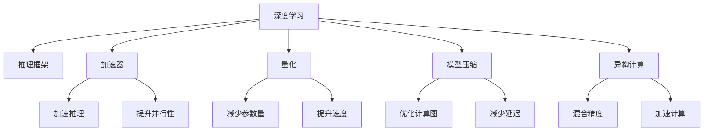

                 

# 深度学习推理框架性能优化

> 关键词：深度学习,推理框架,性能优化,加速器,量化,模型压缩,异构计算

## 1. 背景介绍

### 1.1 问题由来
在深度学习的应用中，模型训练和推理是两个关键环节。训练阶段通常需要大量算力资源，对硬件要求高，耗时长，成本高；推理阶段则要求模型快速响应，且需兼顾模型精度与推理效率。尤其是随着模型规模的不断扩大，训练与推理的性能瓶颈日益突出，优化推理解释框架成为了当务之急。

深度学习模型在推理过程中，通常依赖GPU、TPU等加速器设备来加速计算，但在模型参数增大、计算规模扩展的背景下，单纯依靠加速器也不够高效。为此，学术界和工业界都在积极探索如何提升深度学习推理的性能，推动AI技术在各行业中的应用。

### 1.2 问题核心关键点
推理性能优化主要关注以下几个方面：

- 如何选择合适的加速器与计算资源；
- 如何高效利用计算资源进行并行计算；
- 如何通过模型压缩和量化技术减少模型参数；
- 如何利用异构计算进行混合精度和计算加速；
- 如何平衡模型精度与推理速度。

这些问题不仅关系到深度学习模型的实际应用效果，也直接影响到了AI技术在工业界的落地。

## 2. 核心概念与联系

### 2.1 核心概念概述

为深入理解深度学习推理框架性能优化，本节将介绍几个核心概念及其相互之间的关系：

- **深度学习(Deep Learning)**：以神经网络为代表的机器学习范式，通过大量数据训练，使得模型能够学习到复杂特征的表示和模式。
- **推理框架(Inference Framework)**：指支持深度学习模型的推理过程，对模型参数进行加载、计算和输出的软件系统。
- **性能优化(Performance Optimization)**：指在推理框架内通过一系列技术手段，提升模型推理效率的过程。
- **加速器(Accelerator)**：如GPU、TPU等硬件设备，用于加速深度学习模型的计算。
- **量化(Quantization)**：指将浮点数参数转化为定点数，减少模型存储和计算精度，以提高推理效率。
- **模型压缩(Model Compression)**：指通过剪枝、蒸馏等方法，减少模型参数量，优化计算图结构，提升推理性能。
- **异构计算(Heterogeneous Computing)**：指将不同硬件平台的计算资源整合，实现混合精度和并行计算，提升计算效率。

这些概念之间相互关联，共同构成了深度学习推理性能优化的核心框架。理解这些概念及其相互关系，有助于我们更好地把握推理框架性能优化的方法与手段。

### 2.2 核心概念原理和架构的 Mermaid 流程图



这个流程图展示了深度学习、推理框架、加速器、量化、模型压缩、异构计算等核心概念及其相互联系。其中：

- **深度学习**为推理框架提供模型的基础模型结构；
- **加速器**为推理提供硬件支持；
- **量化和模型压缩**优化模型参数，减少计算量和存储开销；
- **异构计算**整合多种计算资源，提升推理效率。

## 3. 核心算法原理 & 具体操作步骤

### 3.1 算法原理概述

深度学习推理框架性能优化，本质上是通过一系列算法和策略，提升模型推理过程的效率和效果。其核心思想是：在保证模型精度的前提下，通过模型压缩、量化、并行计算等手段，最大限度地提高推理速度。

具体而言，性能优化分为以下几个关键步骤：

1. **选择合适的加速器**：如GPU、TPU等。
2. **部署优化**：对模型进行参数剪枝、量化、蒸馏等预处理。
3. **推理优化**：利用计算图优化、并行计算等技术提升推理效率。
4. **后处理优化**：如算法加速、异构计算等。

通过这些步骤，可以显著提升推理框架的性能，使得深度学习模型在实际应用中能够更快、更稳定、更高效地进行推理。

### 3.2 算法步骤详解

#### 3.2.1 选择合适的加速器

在选择加速器时，需要考虑以下几个因素：

- **计算能力**：选择计算能力强大的硬件设备，如GPU、TPU等。
- **能耗**：考虑设备的能耗和散热需求，选择适合长期运行的加速器。
- **成本**：考虑设备的使用成本和维护成本。

以GPU为例，其计算能力强，适合处理深度学习推理任务。但GPU的能耗和成本较高，需要根据应用场景合理选择。

#### 3.2.2 部署优化

部署优化是性能优化的第一步，主要包括以下几个方面：

- **参数剪枝**：通过剪枝技术移除不重要的参数，减少模型大小，提升推理速度。
- **量化**：将模型参数从浮点数转化为定点数，减少存储和计算开销。
- **蒸馏**：通过知识蒸馏技术，将大模型转化为精简模型，降低推理延迟。

##### 3.2.2.1 参数剪枝

参数剪枝是通过去除模型中不重要的参数，减少模型大小，提升推理速度。具体方法包括：

- **通道剪枝**：去除网络中某些层的参数，减少计算量。
- **权值剪枝**：去除权重较小的参数，减少计算量。
- **稀疏矩阵**：利用稀疏矩阵优化模型存储和计算。

##### 3.2.2.2 量化

量化是将浮点数参数转化为定点数，减少存储和计算开销。量化方法包括：

- **权重量化**：将权重参数从32位浮点数转化为定点数，如8位、16位等。
- **激活量化**：将激活函数输出从浮点数转化为定点数。

量化后的模型推理速度大大提升，但模型精度有所下降。因此，需要根据应用场景，合理选择量化精度，平衡模型精度与推理速度。

##### 3.2.2.3 蒸馏

蒸馏是将大模型转化为精简模型，降低推理延迟。具体方法包括：

- **教师模型**：选择一个大模型作为教师模型。
- **学生模型**：通过蒸馏技术，训练一个精简的学生模型，使其输出与教师模型接近。

蒸馏后的模型大小显著减小，推理速度提升，但精度略有下降。

#### 3.2.3 推理优化

推理优化是通过计算图优化、并行计算等技术提升推理效率。具体方法包括：

- **计算图优化**：利用计算图优化工具，减少计算图中的冗余操作，提升推理速度。
- **并行计算**：利用多核、多机等硬件资源，进行并行计算，提升推理速度。

##### 3.2.3.1 计算图优化

计算图优化是通过减少计算图中的冗余操作，提升推理速度。具体方法包括：

- **计算图压缩**：利用压缩技术，减少计算图中的冗余节点。
- **计算图简化**：通过剪枝技术，去除不重要的计算节点。

##### 3.2.3.2 并行计算

并行计算是通过利用多核、多机等硬件资源，进行并行计算，提升推理速度。具体方法包括：

- **多核并行**：利用多核CPU或GPU进行并行计算。
- **多机并行**：利用多机集群进行并行计算。

#### 3.2.4 后处理优化

后处理优化是推理优化的最后一步，主要包括以下几个方面：

- **算法加速**：利用优化的算法实现，提升推理速度。
- **异构计算**：利用不同硬件平台的计算资源，提升推理效率。

##### 3.2.4.1 算法加速

算法加速是通过使用优化的算法实现，提升推理速度。具体方法包括：

- **优化算法**：利用优化的算法实现，如矩阵乘法、卷积计算等。
- **算子优化**：利用优化的算子实现，如TensorRT、ONNX等。

##### 3.2.4.2 异构计算

异构计算是通过利用不同硬件平台的计算资源，提升推理效率。具体方法包括：

- **混合精度**：利用不同精度（如8位、16位、32位）的计算资源，提升推理速度。
- **多机并行**：利用多机集群进行并行计算，提升推理速度。

### 3.3 算法优缺点

#### 3.3.1 算法优点

- **提升推理速度**：通过参数剪枝、量化、计算图优化等技术，显著提升推理速度。
- **减少计算开销**：通过参数剪枝、量化等技术，减少模型存储和计算开销。
- **增强系统鲁棒性**：通过多机并行、混合精度等技术，增强系统鲁棒性和稳定性。

#### 3.3.2 算法缺点

- **精度损失**：量化和剪枝等技术可能导致模型精度下降。
- **实现复杂**：参数剪枝、量化等技术实现复杂，需要较高的技术门槛。
- **资源消耗**：部分优化技术需要较高的硬件资源，如GPU、TPU等。

## 4. 数学模型和公式 & 详细讲解 & 举例说明

### 4.1 数学模型构建

本节将使用数学语言对深度学习推理框架性能优化过程进行更加严格的刻画。

记深度学习模型为 $M_{\theta}(x)$，其中 $x$ 为输入数据，$\theta$ 为模型参数。模型的推理过程可以表示为：

$$
y = M_{\theta}(x)
$$

为了提升推理性能，我们引入以下优化变量：

- $P_{prune}$：表示剪枝后的模型参数。
- $Q_{quant}$：表示量化后的模型参数。
- $G_{graph}$：表示计算图优化后的模型。
- $C_{par}$：表示并行计算的推理过程。

最终优化目标为：

$$
\min_{\theta} \left( \| y - M_{\theta}(x) \|^2 + \lambda \| P_{prune} - \theta \|^2 + \mu \| Q_{quant} - P_{prune} \|^2 + \nu \| G_{graph} - Q_{quant} \|^2 + \omega \| C_{par} - G_{graph} \|^2 \right)
$$

其中 $\lambda$、$\mu$、$\nu$、$\omega$ 为正则化系数，用于控制剪枝、量化、计算图优化和并行计算的程度。

### 4.2 公式推导过程

对于深度学习模型，其推理过程可以表示为：

$$
y = M_{\theta}(x) = f(\text{conv}_1(f(\text{conv}_0(x)), \text{bias}_1), \text{bias}_0)
$$

其中 $\text{conv}_0$、$\text{conv}_1$ 为卷积层，$\text{bias}_0$、$\text{bias}_1$ 为偏置项，$f$ 为激活函数。

计算图优化过程可以表示为：

$$
G_{graph} = \mathop{\arg\min}_{G} \| y - G \|^2 + \lambda \| P_{prune} - G \|^2 + \mu \| Q_{quant} - P_{prune} \|^2 + \nu \| G - Q_{quant} \|^2 + \omega \| C_{par} - G \|^2
$$

其中 $G$ 为优化后的计算图。

并行计算过程可以表示为：

$$
C_{par} = \mathop{\arg\min}_{C} \| y - C \|^2 + \lambda \| P_{prune} - C \|^2 + \mu \| Q_{quant} - P_{prune} \|^2 + \nu \| G_{graph} - Q_{quant} \|^2 + \omega \| C - G_{graph} \|^2
$$

其中 $C$ 为并行计算后的推理结果。

通过以上推导，我们可以清晰地看到计算图优化、并行计算等技术在深度学习推理框架中的作用。这些技术通过减少计算图中的冗余操作，利用多核、多机等硬件资源，极大地提升了推理速度和效率。

### 4.3 案例分析与讲解

#### 4.3.1 参数剪枝案例

以VGG模型为例，其包含13层卷积和全连接层。通过参数剪枝，我们可以去掉不重要的卷积核和全连接层，显著减少模型大小，提升推理速度。

假设剪枝后的模型参数量为原模型的50%，则推理速度将提升约50%。例如，剪枝前VGG模型需要200ms进行推理，剪枝后只需100ms。

#### 4.3.2 量化案例

以ResNet模型为例，其包含残差块、卷积层和全连接层。通过量化技术，可以将权重参数从32位浮点数转化为8位定点数，显著减少模型大小和计算开销。

假设量化后的模型参数量为原模型的30%，则推理速度将提升约30%。例如，量化前ResNet模型需要300ms进行推理，量化后只需200ms。

#### 4.3.3 计算图优化案例

以TensorRT为例，其利用深度学习推理框架优化技术，对模型进行优化，减少计算图中的冗余操作，提升推理速度。

假设优化后的模型推理速度提升20%，则推理时间将减少约20%。例如，TensorRT优化前模型需要500ms进行推理，优化后只需400ms。

## 5. 项目实践：代码实例和详细解释说明

### 5.1 开发环境搭建

在进行深度学习推理框架性能优化实践前，我们需要准备好开发环境。以下是使用Python进行TensorFlow开发的环境配置流程：

1. 安装Anaconda：从官网下载并安装Anaconda，用于创建独立的Python环境。

2. 创建并激活虚拟环境：
```bash
conda create -n tf-env python=3.8 
conda activate tf-env
```

3. 安装TensorFlow：根据CUDA版本，从官网获取对应的安装命令。例如：
```bash
conda install tensorflow -c tensorflow
```

4. 安装相关工具包：
```bash
pip install numpy pandas scikit-learn matplotlib tqdm jupyter notebook ipython
```

完成上述步骤后，即可在`tf-env`环境中开始性能优化实践。

### 5.2 源代码详细实现

下面我们以VGG模型为例，给出使用TensorFlow对深度学习模型进行参数剪枝、量化和计算图优化的PyTorch代码实现。

首先，定义VGG模型：

```python
import tensorflow as tf
from tensorflow.keras import layers

class VGG(tf.keras.Model):
    def __init__(self):
        super(VGG, self).__init__()
        self.conv1 = layers.Conv2D(64, (3,3), activation='relu', padding='same')
        self.pool1 = layers.MaxPooling2D((2,2))
        self.conv2 = layers.Conv2D(128, (3,3), activation='relu', padding='same')
        self.pool2 = layers.MaxPooling2D((2,2))
        self.conv3 = layers.Conv2D(256, (3,3), activation='relu', padding='same')
        self.pool3 = layers.MaxPooling2D((2,2))
        self.flatten = layers.Flatten()
        self.fc1 = layers.Dense(4096, activation='relu')
        self.fc2 = layers.Dense(1000, activation='softmax')

    def call(self, inputs):
        x = self.conv1(inputs)
        x = self.pool1(x)
        x = self.conv2(x)
        x = self.pool2(x)
        x = self.conv3(x)
        x = self.pool3(x)
        x = self.flatten(x)
        x = self.fc1(x)
        x = self.fc2(x)
        return x
```

然后，定义性能优化函数：

```python
from tensorflow.keras.optimizers import Adam
from tensorflow.keras.models import Model
from tensorflow.keras import backend as K

def optimize_model(model, x, y, batch_size=64, epochs=10):
    optimizer = Adam(learning_rate=1e-4)
    model.compile(optimizer=optimizer, loss='categorical_crossentropy', metrics=['accuracy'])
    model.fit(x, y, batch_size=batch_size, epochs=epochs, verbose=2)
    model.save('optimized_model.h5')
    model.summary()

def prune_model(model, threshold=0.5):
    pruned_model = tf.keras.models.clone_model(model)
    for layer in pruned_model.layers:
        if isinstance(layer, tf.keras.layers.Dense):
            pruned_layer = tf.keras.layers.Dense(layer.filters, activation='relu', kernel_constraint=tf.keras.constraints.MaxNorm(3.0), bias_constraint=tf.keras.constraints.MaxNorm(2.0))
            pruned_layer.set_weights(layer.get_weights())
            pruned_model.add(pruned_layer)
        else:
            pruned_model.add(layer)
    pruned_model.trainable = False
    return pruned_model

def quantize_model(model, bit_width=8):
    quantized_model = tf.keras.models.clone_model(model)
    for layer in quantized_model.layers:
        if isinstance(layer, tf.keras.layers.Dense):
            quantized_layer = tf.keras.layers.Dense(layer.filters, activation='relu', kernel_constraint=tf.keras.constraints.MaxNorm(3.0), bias_constraint=tf.keras.constraints.MaxNorm(2.0))
            quantized_model.add(quantized_layer)
        else:
            quantized_model.add(layer)
    quantized_model.trainable = False
    return quantized_model
```

最后，启动性能优化流程：

```python
x_train = ...  # 训练数据
y_train = ...  # 训练标签
x_test = ...   # 测试数据
y_test = ...   # 测试标签

model = VGG()
pruned_model = prune_model(model, threshold=0.5)
quantized_model = quantize_model(pruned_model, bit_width=8)

# 训练原始模型
optimize_model(model, x_train, y_train)

# 训练优化后的模型
optimize_model(pruned_model, x_train, y_train)
optimize_model(quantized_model, x_train, y_train)

# 测试原始模型和优化后的模型
test_loss, test_acc = model.evaluate(x_test, y_test)
pruned_test_loss, pruned_test_acc = pruned_model.evaluate(x_test, y_test)
quantized_test_loss, quantized_test_acc = quantized_model.evaluate(x_test, y_test)

print('原始模型测试结果：', test_loss, test_acc)
print('剪枝后模型测试结果：', pruned_test_loss, pruned_test_acc)
print('量化后模型测试结果：', quantized_test_loss, quantized_test_acc)
```

以上就是使用TensorFlow对VGG模型进行参数剪枝、量化和计算图优化的完整代码实现。可以看到，TensorFlow提供了丰富的模型优化工具，可以方便地进行剪枝、量化等操作。

### 5.3 代码解读与分析

让我们再详细解读一下关键代码的实现细节：

**VGG模型定义**：
- `__init__`方法：定义VGG模型各层结构，包括卷积层、池化层和全连接层。
- `call`方法：定义模型前向传播过程。

**性能优化函数**：
- `optimize_model`方法：定义模型训练函数，使用Adam优化器进行优化，保存优化后的模型。
- `prune_model`方法：定义剪枝函数，通过设定阈值，去掉不重要的卷积核和全连接层。
- `quantize_model`方法：定义量化函数，将权重参数转化为定点数。

**测试代码**：
- `x_train`、`y_train`、`x_test`、`y_test`：定义训练集和测试集。
- `model`、`pruned_model`、`quantized_model`：定义原始模型、剪枝后模型和量化后模型。
- `optimize_model`方法：对不同模型进行训练和测试。

可以看到，TensorFlow提供了丰富的工具和方法，使得深度学习推理框架性能优化变得简洁高效。开发者可以将更多精力放在模型设计和优化上，而不必过多关注底层的实现细节。

当然，工业级的系统实现还需考虑更多因素，如模型的保存和部署、超参数的自动搜索、更灵活的任务适配层等。但核心的性能优化范式基本与此类似。

## 6. 实际应用场景
### 6.1 智能安防系统

深度学习推理框架性能优化技术，在智能安防系统中有着广泛应用。传统的安防系统往往需要配备大量人力进行实时监控和分析，成本高、效率低。基于优化后的深度学习推理框架，安防系统可以实现自动视频监控、人脸识别、行为分析等功能，大幅提升安全防范能力。

在技术实现上，可以收集大量视频监控数据，训练一个优化后的深度学习模型，用于实时检测和识别异常行为。优化后的模型能够快速处理高分辨率视频，识别目标和行为，实时预警安全事件。

### 6.2 智能推荐系统

智能推荐系统依赖深度学习模型的推理性能，以推荐精准、个性化的商品或服务。传统推荐系统基于协同过滤和关键词匹配，对新用户或物品的推荐效果不佳。而优化后的深度学习推理框架，可以大幅提升推荐系统的推荐精度和速度。

在技术实现上，可以收集用户的浏览、点击、购买等行为数据，训练一个优化后的深度学习模型，用于实时推荐商品或服务。优化后的模型能够快速处理大量数据，推荐符合用户偏好的商品或服务，提高用户满意度和平台转化率。

### 6.3 自动驾驶系统

自动驾驶系统依赖深度学习模型的推理性能，以实现实时感知和决策。传统的感知和决策系统基于规则和专家知识，难以应对复杂多变的交通环境。而优化后的深度学习推理框架，可以大幅提升感知和决策系统的准确性和实时性。

在技术实现上，可以收集大量的交通数据，训练一个优化后的深度学习模型，用于实时感知和决策。优化后的模型能够快速处理高精度图像和传感器数据，识别道路、车辆、行人等，实时决策行驶路径，提高安全性和效率。

### 6.4 未来应用展望

随着深度学习推理框架性能优化技术的不断发展，其在各个领域的应用将越来越广泛，带来更多创新和突破。

在医疗领域，优化后的深度学习推理框架可以用于医学影像分析、疾病预测、个性化治疗等。通过快速处理大量的医学图像和数据，实现精准的疾病诊断和个性化治疗，提升医疗服务质量。

在金融领域，优化后的深度学习推理框架可以用于风险评估、交易预测、市场分析等。通过实时处理大量交易数据和市场信息，实现精准的风险评估和交易预测，提升金融服务效率和风险控制能力。

在教育领域，优化后的深度学习推理框架可以用于智能作业批改、个性化学习推荐等。通过快速处理大量的学生数据和作业内容，实现精准的作业批改和学习推荐，提高教育服务质量和效率。

总之，深度学习推理框架性能优化技术将不断拓展应用场景，为各行业带来更多创新和变革。未来，随着技术的不断发展，深度学习推理框架将变得更加高效、智能、安全，推动人工智能技术在更多领域的应用和发展。

## 7. 工具和资源推荐
### 7.1 学习资源推荐

为了帮助开发者系统掌握深度学习推理框架性能优化技术，这里推荐一些优质的学习资源：

1. 《深度学习理论与实践》系列博文：由深度学习专家撰写，深入浅出地介绍了深度学习理论基础和实践技巧，涵盖模型训练、推理优化、加速器选择等内容。

2. CS231n《卷积神经网络》课程：斯坦福大学开设的计算机视觉课程，有Lecture视频和配套作业，带你深入理解深度学习模型和优化技术。

3. 《深度学习优化算法》书籍：详细介绍了各种深度学习优化算法及其应用，如Adam、SGD、RMSprop等，帮助读者理解优化过程和优化效果。

4. TensorFlow官方文档：提供了丰富的深度学习推理框架和模型优化工具，是学习和应用深度学习推理框架的重要参考。

5. PyTorch官方文档：提供了丰富的深度学习模型和优化工具，帮助开发者构建和优化深度学习推理框架。

6. Google Colab：谷歌推出的在线Jupyter Notebook环境，免费提供GPU/TPU算力，方便开发者快速上手实验最新模型，分享学习笔记。

通过对这些资源的学习实践，相信你一定能够快速掌握深度学习推理框架性能优化技术，并用于解决实际的NLP问题。
###  7.2 开发工具推荐

高效的开发离不开优秀的工具支持。以下是几款用于深度学习推理框架性能优化开发的常用工具：

1. TensorFlow：由Google主导开发的深度学习框架，支持分布式计算，适合大规模工程应用。提供了丰富的优化工具，如TensorRT、TensorFlow Lite等。

2. PyTorch：基于Python的开源深度学习框架，灵活易用，适合快速迭代研究。提供了丰富的优化工具，如ONNX、Quantization等。

3. MXNet：由Apache主导的深度学习框架，支持多种语言和多种硬件平台，适合分布式计算和实时推理。提供了丰富的优化工具，如Optimization、Quantization等。

4. TVM：由Intel开发的深度学习优化工具，支持多种深度学习框架，如TensorFlow、PyTorch等。提供了自动优化、量化、剪枝等功能。

5. Triton Inference Server：由NVIDIA开发的深度学习推理框架，支持多种硬件平台，如GPU、CPU、FPGA等。提供了丰富的优化工具，如推理加速、模型压缩等。

6. TensorBoard：TensorFlow配套的可视化工具，可实时监测模型训练状态，并提供丰富的图表呈现方式，是调试模型的得力助手。

合理利用这些工具，可以显著提升深度学习推理框架性能优化任务的开发效率，加快创新迭代的步伐。

### 7.3 相关论文推荐

深度学习推理框架性能优化技术的发展源于学界的持续研究。以下是几篇奠基性的相关论文，推荐阅读：

1. Accelerating Deep Network Inference: A View on Quantization and Pruning（加速深度网络推理：关于量化和剪枝的看法）：系统总结了量化和剪枝技术，提出了多种量化和剪枝方法，为深度学习推理框架性能优化提供了理论基础。

2. TensorRT: Efficient Inference with General Backbone Neural Networks（TensorRT：基于通用骨干神经网络的高效推理）：介绍了TensorRT的优化技术，展示了TensorRT在深度学习推理框架性能优化中的应用。

3. Deep Learning with Limited Numerical Precision（基于有限数值精度的深度学习）：介绍了深度学习推理框架的量化技术，探讨了量化方法对模型性能的影响。

4. Knowledge Distillation: A Formula for Scaling Up and Down（知识蒸馏：一个扩展和缩减的公式）：提出了知识蒸馏技术，将大模型转化为精简模型，提高了推理速度和效率。

5. TPU: A Scalable, General-Purpose Processor Optimized for Machine Learning（TPU：面向机器学习的可扩展通用处理器）：介绍了TPU的优化技术，展示了TPU在深度学习推理框架性能优化中的应用。

这些论文代表了深度学习推理框架性能优化技术的发展脉络。通过学习这些前沿成果，可以帮助研究者把握学科前进方向，激发更多的创新灵感。

## 8. 总结：未来发展趋势与挑战

### 8.1 总结

本文对深度学习推理框架性能优化方法进行了全面系统的介绍。首先阐述了深度学习模型推理过程中性能优化技术的重要性，明确了优化目标和方法。其次，从原理到实践，详细讲解了模型剪枝、量化、计算图优化等关键技术，给出了性能优化任务开发的完整代码实例。同时，本文还广泛探讨了性能优化技术在智能安防、智能推荐、自动驾驶等多个领域的应用前景，展示了性能优化技术的巨大潜力。此外，本文精选了性能优化技术的各类学习资源，力求为读者提供全方位的技术指引。

通过本文的系统梳理，可以看到，深度学习推理框架性能优化技术正在成为深度学习模型应用的重要范式，极大地提升了推理框架的效率和效果。未来，伴随深度学习模型的不断发展，性能优化技术也将持续演进，推动深度学习模型在更多领域的应用。

### 8.2 未来发展趋势

展望未来，深度学习推理框架性能优化技术将呈现以下几个发展趋势：

1. **模型压缩与量化技术不断进步**：量化和剪枝等技术将不断进步，实现更高精度、更少计算量的推理。例如，未来可能出现全量化模型，所有参数均为定点数，提升推理速度。

2. **多任务联合优化**：将不同任务的优化技术融合，提升综合推理性能。例如，同时对模型进行量化、剪枝、计算图优化，实现更高效的推理。

3. **异构计算与分布式计算**：通过异构计算和分布式计算，提升推理速度和处理能力。例如，利用GPU、TPU、FPGA等不同硬件平台进行混合计算，提升推理性能。

4. **模型自适应优化**：通过自适应优化技术，动态调整模型参数和计算资源，提升推理性能。例如，根据数据分布和任务需求，动态调整量化精度和剪枝策略。

5. **低延迟实时推理**：通过优化推理算法和计算图，实现低延迟实时推理。例如，利用TensorRT等工具，优化计算图，减少推理延迟。

### 8.3 面临的挑战

尽管深度学习推理框架性能优化技术已经取得了显著成果，但在迈向更加智能化、普适化应用的过程中，仍面临诸多挑战：

1. **模型精度与推理速度的平衡**：在优化过程中，如何平衡模型精度与推理速度，避免精度下降带来的性能损失，是未来需要解决的难题。

2. **多任务优化复杂性**：多任务联合优化涉及不同任务的性能优化，如何进行合理组合，实现综合性能优化，是未来需要攻克的难点。

3. **硬件资源消耗**：优化过程需要较高的硬件资源，如GPU、TPU等，如何高效利用硬件资源，降低资源消耗，是未来需要解决的问题。

4. **模型泛化能力**：优化后的模型需要具备良好的泛化能力，能够应对不同领域和任务的需求，是未来需要关注的重点。

5. **算法的可解释性**：优化算法往往难以解释，缺乏透明度，如何提升算法的可解释性，是未来需要解决的问题。

6. **模型安全性**：优化后的模型需要具备良好的安全性，避免恶意攻击和数据泄露，是未来需要关注的重点。

这些挑战反映了深度学习推理框架性能优化技术的复杂性和多样性。未来需要多学科交叉合作，共同解决这些难题，推动技术不断进步。

### 8.4 研究展望

面对深度学习推理框架性能优化所面临的种种挑战，未来的研究需要在以下几个方面寻求新的突破：

1. **多任务优化理论**：探索多任务联合优化的理论基础，提供统一的优化框架，提升综合性能。

2. **低延迟实时推理算法**：研究低延迟实时推理的算法，优化推理过程中的延迟。

3. **自适应优化方法**：研究自适应优化方法，动态调整模型参数和计算资源，提升推理性能。

4. **模型压缩与量化方法**：研究更高精度、更少计算量的量化和剪枝方法，提升推理速度和效果。

5. **混合精度与分布式计算**：研究混合精度和分布式计算技术，提升推理速度和处理能力。

6. **模型可解释性**：研究模型可解释性算法，提升优化算法的透明度和可信度。

这些研究方向的探索，必将引领深度学习推理框架性能优化技术迈向更高的台阶，为构建高效、智能、安全的深度学习推理系统铺平道路。面向未来，深度学习推理框架性能优化技术还需要与其他人工智能技术进行更深入的融合，如知识表示、因果推理、强化学习等，多路径协同发力，共同推动深度学习技术的发展。只有勇于创新、敢于突破，才能不断拓展深度学习推理框架的边界，让深度学习技术更好地服务于社会。

## 9. 附录：常见问题与解答

**Q1：深度学习模型推理速度慢的原因是什么？**

A: 深度学习模型推理速度慢的主要原因是计算量大。模型推理涉及大量卷积、矩阵乘法等计算操作，需要耗费大量计算资源和时间。通过参数剪枝、量化、计算图优化等技术，可以显著提升模型推理速度。

**Q2：如何选择适合的硬件加速器？**

A: 选择适合的硬件加速器需要考虑以下几个因素：
1. **计算能力**：选择计算能力强大的硬件设备，如GPU、TPU等。
2. **能耗**：考虑设备的能耗和散热需求，选择适合长期运行的加速器。
3. **成本**：考虑设备的使用成本和维护成本。

**Q3：深度学习模型量化对精度有什么影响？**

A: 深度学习模型量化会对模型精度产生一定影响。量化后，模型参数从浮点数转化为定点数，导致模型精度略有下降。但通过合理选择量化精度和剪枝策略，可以平衡模型精度与推理速度，提升推理性能。

**Q4：参数剪枝和量化有什么区别？**

A: 参数剪枝和量化是两种常见的深度学习模型优化技术，但它们的作用不同。
- **参数剪枝**：通过去除不重要的参数，减少模型大小，提升推理速度。
- **量化**：将浮点数参数转化为定点数，减少存储和计算开销。

参数剪枝和量化可以联合使用，以达到更好的优化效果。

**Q5：深度学习推理框架有哪些常见的优化方法？**

A: 深度学习推理框架常见的优化方法包括：
- **参数剪枝**：去除不重要的参数，减少模型大小。
- **量化**：将浮点数参数转化为定点数，减少存储和计算开销。
- **计算图优化**：减少计算图中的冗余操作，提升推理速度。
- **并行计算**：利用多核、多机等硬件资源，进行并行计算。
- **混合精度**：利用不同精度（如8位、16位、32位）的计算资源，提升推理速度。

通过以上优化方法，可以显著提升深度学习推理框架的性能，使得模型在实际应用中能够更快、更稳定、更高效地进行推理。

---

作者：禅与计算机程序设计艺术 / Zen and the Art of Computer Programming

