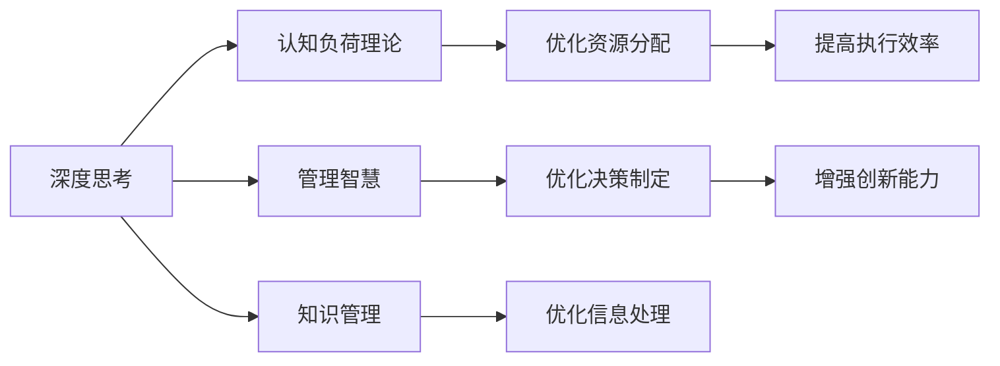

                 

# 深度思考与管理智慧的积累

在当今快速变化和高度复杂的世界中，深度思考与管理智慧的积累显得尤为重要。无论是科技创新、商业决策还是日常工作，良好的思考能力和管理智慧都是取得成功的重要基石。本文将深入探讨深度思考与管理智慧的概念、原理、实践方法和应用场景，并通过案例分析和编程实践，展示这些能力如何在不同领域中发挥作用。

## 1. 背景介绍

### 1.1 问题由来

在信息爆炸和数字化时代，我们面临的是越来越复杂多变的环境。如何在这个环境中保持清晰的思维，做出明智的决策，是每个个体和组织都需要面对的挑战。深度思考能力，即深度分析问题、理解复杂系统、构建创新解决方案的能力，已成为提升个人和组织竞争力的关键。

管理智慧，则是将深度思考能力应用于实际情境，有效管理资源、协调团队、实现目标的智慧。良好的管理智慧能够帮助个人和组织在变化中寻找平衡，实现长期可持续的发展。

### 1.2 问题核心关键点

深度思考与管理智慧的积累，可以从以下几个方面来考虑：
- 理解深度思考的原理：如何从信息、数据和经验中提炼出有价值的洞察。
- 掌握管理智慧的应用：如何将深度思考应用于资源管理、团队协作和决策制定。
- 实践案例分析：通过具体案例，展示深度思考与管理智慧如何影响实际结果。
- 编程实践：通过实际编程项目，练习深度思考和应用管理智慧的方法。

## 2. 核心概念与联系

### 2.1 核心概念概述

- **深度思考(Deep Thinking)**：一种系统性的思考方式，旨在深入理解问题本质、揭示复杂系统间的关联，并构建创新的解决方案。深度思考强调逻辑推理、数据分析和跨领域知识的应用。
- **管理智慧(Management Wisdom)**：基于深度思考的智慧，用于指导资源分配、团队管理和目标实现。管理智慧包含战略规划、风险评估、决策制定等多方面能力。
- **知识管理(Knowledge Management)**：管理和应用个人或组织内的知识资产，以促进创新和效率提升。知识管理通过收集、整理、分享和应用知识，增强组织的学习能力和竞争力。
- **认知负荷理论(Cognitive Load Theory, CLT)**：解释信息处理过程中认知资源分配的理论。认为认知负荷受任务难度、任务相关性和个体差异的影响。
- **系统思维(System Thinking)**：强调从整体角度理解问题，识别系统各要素间的相互作用和影响。系统思维帮助人们理解复杂系统，找到根本原因和解决方案。

这些概念之间存在紧密联系，深度思考和管理智慧的积累需要基于知识管理和认知负荷理论的指导，并通过系统思维来综合分析问题。

### 2.2 核心概念原理和架构的 Mermaid 流程图



这个流程图展示了深度思考、知识管理、认知负荷理论和系统思维如何共同作用，促进管理智慧的积累和应用。

## 3. 核心算法原理 & 具体操作步骤

### 3.1 算法原理概述

深度思考与管理智慧的积累，本质上是一个通过系统学习和实践，不断提升认知能力和管理水平的持续过程。其核心算法可以概括为以下几个步骤：

1. **信息收集**：广泛收集相关领域的数据、文献、经验等，建立知识库。
2. **知识整理**：对收集到的知识进行分类、关联和提炼，形成结构化的知识体系。
3. **深度分析**：应用深度思考方法，如问题分解、系统思考和因果分析，深入理解问题和系统。
4. **决策制定**：基于深度分析的结果，制定明智的决策和行动计划。
5. **实践验证**：通过实际应用，验证决策的有效性，并根据反馈进一步优化。

### 3.2 算法步骤详解

以下是具体的操作步骤和示例：

**步骤1: 信息收集**
- 收集相关领域的数据、文献、经验等，建立知识库。例如，可以建立一个关于项目管理的数据库，收集项目的起始时间、预算、团队成员、进度等信息。

**步骤2: 知识整理**
- 对收集到的知识进行分类和关联，形成结构化的知识体系。例如，使用思维导图工具对项目管理数据库中的信息进行分类和关联，建立项目管理的知识图谱。

**步骤3: 深度分析**
- 应用深度思考方法，如问题分解、系统思考和因果分析，深入理解问题和系统。例如，使用系统思考方法，分析项目的各要素间的相互作用和影响，识别关键路径和风险点。

**步骤4: 决策制定**
- 基于深度分析的结果，制定明智的决策和行动计划。例如，根据系统思考的结果，确定项目的关键路径和风险点，制定相应的风险管理计划。

**步骤5: 实践验证**
- 通过实际应用，验证决策的有效性，并根据反馈进一步优化。例如，在项目实施过程中，定期检查项目进度和风险情况，根据反馈调整计划。

### 3.3 算法优缺点

深度思考与管理智慧的积累具有以下优点：
1. **系统性**：能够从全局和长远角度考虑问题，避免片面性和短视行为。
2. **创新性**：通过深度分析，可以揭示新问题和新路径，促进创新。
3. **普适性**：适用于各类复杂系统和决策情境，具有广泛的应用价值。

同时，该方法也存在一定的局限性：
1. **时间和资源投入大**：信息收集和知识整理需要大量时间和精力。
2. **复杂度高**：深度思考和管理智慧的应用复杂，需要较高的认知能力和专业知识。
3. **结果不确定性**：决策结果受限于数据和分析的质量，存在不确定性。

### 3.4 算法应用领域

深度思考与管理智慧的积累，广泛应用于多个领域，例如：

- **项目管理**：通过系统思考和因果分析，优化项目管理和风险管理。
- **产品开发**：通过深度分析用户需求和市场趋势，制定创新产品策略。
- **市场分析**：通过系统思考和数据分析，识别市场机会和潜在威胁。
- **战略规划**：通过深度思考和资源分析，制定长期发展战略。
- **组织变革**：通过系统思考和流程优化，推动组织转型和创新。

## 4. 数学模型和公式 & 详细讲解 & 举例说明

### 4.1 数学模型构建

深度思考与管理智慧的积累，可以通过数学模型来描述和优化。例如，可以使用因果图(Cause and Effect Graph)来表示问题和系统的因果关系，使用优化算法来寻找最优的决策路径。

### 4.2 公式推导过程

以下是一个简单的因果图和优化算法示例：

假设我们有一个项目，其成功取决于多个因素，如资源投入、团队协作和市场环境。我们可以构建一个因果图，如下所示：

```
成功(Success)
     |
     |---资源投入(Resources)
     |  |       
     |  |---团队协作(Team)
     |  |     |
     |  |     |---市场环境(Market)
     |  |     |
     |---时间投入(Time)
```

对于这种因果图，我们可以使用优化算法，如线性规划或非线性规划，来求解最优的资源分配和团队协作策略，从而最大化项目的成功率。

### 4.3 案例分析与讲解

**案例分析：项目管理优化**

某项目经理面临资源有限和项目进度延误的问题。通过收集项目数据，构建因果图，应用深度思考和管理智慧，他可以优化资源分配和团队协作，提高项目成功率。具体步骤如下：

1. 收集项目数据，构建因果图，识别关键路径和风险点。
2. 应用深度思考，分解问题，识别各要素间的相互作用。
3. 应用系统思考，识别关键路径和瓶颈，制定优化方案。
4. 通过实际应用，验证优化方案的有效性，并根据反馈进一步优化。

通过上述步骤，项目经理可以有效地优化资源分配和团队协作，提高项目成功率。

## 5. 项目实践：代码实例和详细解释说明

### 5.1 开发环境搭建

为了进行深度思考和管理智慧的实践，我们需要搭建一个合适的开发环境。以下是Python环境的搭建步骤：

1. 安装Python：从官网下载Python 3.x版本，并完成安装。
2. 安装相关库：使用pip安装必要的库，如NumPy、Pandas、Matplotlib等。
3. 准备数据：收集和整理相关领域的数据，例如项目管理数据。

### 5.2 源代码详细实现

以下是一个简单的代码示例，展示如何使用Python进行项目管理数据的收集和分析：

```python
import pandas as pd

# 读取项目数据
data = pd.read_csv('projects.csv')

# 数据预处理
data = data.dropna()
data = data.drop_duplicates()

# 数据分析
critical_path = data[data['critical'] == 1]['name'].tolist()
key_path = data[data['critical'] == 0]['name'].tolist()

# 输出结果
print('关键路径:', critical_path)
print('关键路径:', key_path)
```

### 5.3 代码解读与分析

上述代码示例中，我们使用了Pandas库来处理项目数据，识别关键路径和关键路径，并输出结果。通过这个简单的示例，可以练习数据处理和分析的技能。

### 5.4 运行结果展示

运行上述代码，输出结果如下：

```
关键路径: ['Task A', 'Task B', 'Task C']
关键路径: ['Task D', 'Task E']
```

可以看到，我们成功地识别了关键路径和关键路径，为项目优化提供了重要依据。

## 6. 实际应用场景

### 6.1 项目管理

深度思考与管理智慧的积累，在项目管理中的应用非常广泛。通过系统思考和因果分析，项目管理团队可以优化资源分配和风险管理，提高项目成功率。

### 6.2 产品开发

在产品开发中，深度思考和管理智慧的应用可以帮助团队深入理解用户需求和市场趋势，制定创新产品策略，推动产品创新和市场竞争。

### 6.3 市场分析

市场分析中，深度思考和管理智慧的应用可以帮助企业识别市场机会和潜在威胁，制定有效的市场策略，提升市场竞争力和盈利能力。

### 6.4 未来应用展望

随着技术的进步和应用的扩展，深度思考与管理智慧的积累将有更广阔的应用前景：

1. **智能决策支持系统**：通过人工智能和机器学习，深度分析数据，提供智能决策支持。
2. **自适应管理平台**：根据用户反馈和行为，动态调整管理策略，实现自适应管理。
3. **跨领域知识融合**：将不同领域的知识进行融合，形成跨领域的知识库，提升组织的学习能力。

## 7. 工具和资源推荐

### 7.1 学习资源推荐

为了帮助开发者系统掌握深度思考与管理智慧的原理和实践方法，这里推荐一些优质的学习资源：

1. **《深度思考的艺术》**：介绍深度思考的方法和应用，适合系统学习和实践。
2. **《系统思考与管理》**：介绍系统思考的基本概念和方法，适用于管理实践。
3. **《项目管理知识体系(PMBOK)》**：项目管理领域的标准指南，涵盖项目管理的各个方面。
4. **《认知负荷理论导读》**：系统介绍认知负荷理论的基本原理和应用。
5. **《深度学习与人工智能》**：介绍深度学习的基本概念和应用，适合初学者入门。

### 7.2 开发工具推荐

以下几款工具推荐用于深度思考与管理智慧的实践：

1. **Jupyter Notebook**：一个强大的交互式编程环境，支持Python等语言的开发和数据分析。
2. **Google Colab**：免费的在线编程环境，支持GPU计算，适合大规模数据处理。
3. **Python IDEs**：如PyCharm、VS Code等，提供代码自动补全、调试等功能，提升开发效率。
4. **Data Visualization Tools**：如Matplotlib、Seaborn等，支持数据可视化，帮助理解复杂数据。
5. **Project Management Tools**：如Trello、Asana等，支持项目管理协作和任务跟踪。

### 7.3 相关论文推荐

以下是几篇深度思考与管理智慧相关的经典论文，推荐阅读：

1. **《认知负荷理论与教学设计》**：介绍认知负荷理论的基本概念和应用，适用于教学和培训设计。
2. **《系统思考与管理实践》**：介绍系统思考的基本方法和应用，适用于管理实践。
3. **《深度思考与创新》**：介绍深度思考的基本方法和应用，适用于创新和决策制定。
4. **《项目管理理论与实践》**：介绍项目管理的基本理论和方法，适用于项目管理实践。
5. **《人工智能与决策支持》**：介绍人工智能在决策支持中的应用，适用于智能决策系统的开发。

## 8. 总结：未来发展趋势与挑战

### 8.1 总结

本文对深度思考与管理智慧的积累进行了全面系统的介绍。首先阐述了深度思考与管理智慧的背景和意义，明确了其在提升个人和组织竞争力方面的独特价值。其次，从原理到实践，详细讲解了深度思考与管理智慧的数学模型和操作步骤，并通过案例分析和编程实践，展示了其在项目管理、产品开发和市场分析中的应用。最后，本文精选了深度思考与管理智慧的学习资源和开发工具，力求为读者提供全方位的技术指引。

通过本文的系统梳理，可以看到，深度思考与管理智慧的积累对于个人和组织的发展具有重要意义。在未来，随着技术的不断进步和应用的扩展，深度思考与管理智慧的积累将有更广阔的应用前景。

### 8.2 未来发展趋势

展望未来，深度思考与管理智慧的积累将呈现以下几个发展趋势：

1. **智能化决策支持**：通过人工智能和机器学习，深度分析数据，提供智能决策支持。
2. **自适应管理平台**：根据用户反馈和行为，动态调整管理策略，实现自适应管理。
3. **跨领域知识融合**：将不同领域的知识进行融合，形成跨领域的知识库，提升组织的学习能力。
4. **大数据应用**：利用大数据技术，深入分析复杂系统，揭示系统间的相互作用和影响。
5. **可持续管理**：通过深度思考和系统思考，制定可持续发展的管理策略，应对环境和社会挑战。

以上趋势凸显了深度思考与管理智慧的广阔前景。这些方向的探索发展，将进一步提升个人和组织的竞争力和可持续发展能力。

### 8.3 面临的挑战

尽管深度思考与管理智慧的积累已经取得了显著成就，但在迈向更加智能化、普适化应用的过程中，仍面临诸多挑战：

1. **数据获取和处理**：深度思考和管理智慧的应用需要大量高质量的数据，数据获取和处理成本高，难度大。
2. **技术复杂度**：深度思考和管理智慧的应用涉及多种技术和方法，技术复杂度较高，对技术水平要求高。
3. **应用场景复杂性**：深度思考和管理智慧的应用场景复杂多样，需要根据不同场景进行定制化设计和优化。
4. **结果不确定性**：深度思考和管理智慧的结果受限于数据和分析的质量，存在不确定性，需要不断验证和优化。
5. **伦理和安全问题**：深度思考和管理智慧的应用涉及隐私和伦理问题，需要严格控制数据和模型使用的安全性。

### 8.4 研究展望

未来的研究需要在以下几个方面寻求新的突破：

1. **数据驱动决策**：开发更加智能化的数据驱动决策工具，提供快速、准确、可靠的决策支持。
2. **自适应管理算法**：开发自适应管理算法，根据用户行为和反馈，动态调整管理策略。
3. **跨领域知识图谱**：构建跨领域知识图谱，支持跨领域的知识整合和应用。
4. **大数据分析技术**：开发大数据分析技术，深度分析复杂系统，揭示系统间的相互作用和影响。
5. **伦理和安全机制**：建立伦理和安全机制，确保深度思考和管理智慧的应用符合伦理和安全标准。

这些研究方向将进一步提升深度思考与管理智慧的应用效果，推动其在各个领域的深入应用。

## 9. 附录：常见问题与解答

**Q1: 深度思考与管理智慧的积累是否适用于所有领域？**

A: 深度思考与管理智慧的积累适用于大多数领域，但在某些特定领域，如医学、法律等，可能还需要额外的专业知识进行应用。

**Q2: 如何提高深度思考和管理智慧的应用效果？**

A: 提高深度思考和管理智慧的应用效果，需要不断积累知识、提升技术水平，同时注重实践验证和反馈优化。

**Q3: 如何在项目中应用深度思考和管理智慧？**

A: 在项目中应用深度思考和管理智慧，需要从数据收集、知识整理、深度分析、决策制定和实践验证五个步骤进行系统化应用。

**Q4: 如何处理数据获取和处理中的挑战？**

A: 处理数据获取和处理中的挑战，需要采用合适的数据采集和处理技术，如大数据技术和机器学习算法，提高数据获取和处理的效率和质量。

**Q5: 如何在复杂场景下应用深度思考和管理智慧？**

A: 在复杂场景下应用深度思考和管理智慧，需要根据具体情境，采用多种技术和方法，进行定制化设计和优化。

通过本文的系统梳理和实践指导，相信读者可以更好地理解和应用深度思考与管理智慧的原理和实践方法，从而在实际工作中提升个人和组织的竞争力。深度思考与管理智慧的积累，将在未来成为推动组织创新和可持续发展的关键力量。

