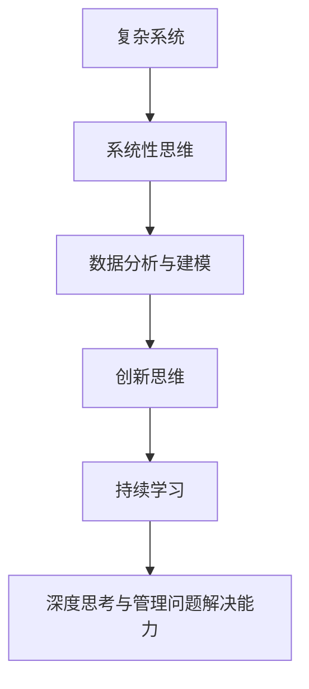

                 

# 深度思考与管理问题解决能力的提升

在当今快速变化的商业环境中，问题解决能力成为了决定组织成功与否的关键因素之一。随着技术的进步，传统的线性思维和简单分析方法已经不能满足复杂问题的解决需求。因此，提升深度思考与管理问题的能力，成为了现代领导者和管理者必须掌握的核心技能。本文将从背景介绍、核心概念与联系、核心算法原理与操作步骤、数学模型和公式、项目实践、实际应用场景、工具和资源推荐、未来发展趋势与挑战以及常见问题与解答等方面，系统性地探讨这一主题。

## 1. 背景介绍

### 1.1 问题由来

在过去几十年中，商业环境经历了显著的变化。传统基于经验和规则的管理方式逐渐被基于数据和算法的决策所取代。然而，随着市场竞争的加剧和外部环境的不确定性增加，复杂的决策问题变得日益普遍。这些问题涉及多方面的因素和复杂的交互作用，简单的因果关系分析已不足以应对。

面对这一挑战，管理者和领导者需要更深入、更全面的思考方式，以便更好地理解问题的本质，提出有效的解决方案。深度思考与管理问题解决能力，在这一背景下应运而生，成为新时代管理者的必备技能。

### 1.2 问题核心关键点

提升深度思考与管理问题的能力，主要集中在以下几个关键点上：

1. **理解问题的复杂性**：现代商业问题往往具有高度的非线性、不确定性和复杂性。理解问题的本质，识别影响因素，是解决问题的第一步。
2. **系统性思维**：通过系统性思考，将问题置于更广泛的背景中，考虑各因素之间的相互作用，寻找根本原因。
3. **数据分析与模型化**：利用数据分析和建模技术，捕捉问题的关键特征，模拟其动态行为，帮助制定有效的解决方案。
4. **创新与跨界思维**：突破传统思维框架，从其他领域借鉴经验，结合创新思维，寻找新颖的解决方案。
5. **持续学习与适应**：随着环境的变化，持续学习和适应新的知识和方法，保持问题解决能力的前沿性。

### 1.3 问题研究意义

提升深度思考与管理问题的能力，对组织和个人都有着重要的意义：

1. **提升决策质量**：深入理解问题本质，系统性思考，有助于制定更全面、更准确的决策。
2. **增强创新能力**：跨界思维和创新方法，可以推动组织的创新和发展，提升市场竞争力。
3. **优化资源利用**：通过系统化思考，识别资源分配中的瓶颈和优化点，提高资源利用效率。
4. **增强团队协作**：深度思考与管理问题解决能力，促进团队成员之间的合作与交流，提升团队整体效能。
5. **应对不确定性**：面对复杂和动态的环境，深度思考和管理问题解决能力，帮助组织更好地应对不确定性，保持竞争力。

## 2. 核心概念与联系

### 2.1 核心概念概述

提升深度思考与管理问题解决能力，涉及多个核心概念，包括：

- **复杂系统**：由多个相互作用的子系统构成的系统，具有复杂的动态行为和非线性特性。
- **系统性思维**：从整体视角出发，考虑系统各部分之间的相互作用和依赖关系，寻找系统性解决方案。
- **数据分析与建模**：利用数据分析和建模技术，捕捉问题的关键特征和动态行为，帮助制定决策。
- **创新思维**：通过跨界思维和创新方法，寻找新颖且有效的解决方案。
- **持续学习**：在不断变化的环境中，持续学习和适应新的知识和方法，保持问题解决能力的前沿性。

这些概念之间存在紧密的联系，共同构成了深度思考与管理问题解决能力的基础框架。

### 2.2 核心概念原理和架构的 Mermaid 流程图



## 3. 核心算法原理 & 具体操作步骤

### 3.1 算法原理概述

提升深度思考与管理问题解决能力，涉及一系列的算法和操作步骤。这些算法和操作步骤旨在通过系统性思维、数据分析、创新思维和持续学习，实现对问题的深入理解和有效解决。

### 3.2 算法步骤详解

#### 3.2.1 问题定义与分析

1. **问题界定**：明确问题的范围、目标和限制条件，定义问题的关键要素。
2. **问题分解**：将复杂问题分解为更小、更易管理的部分，逐个分析。
3. **问题建模**：利用系统动力学、因果图等方法，构建问题的数学模型或概念模型。

#### 3.2.2 数据分析与建模

1. **数据收集与清洗**：收集相关数据，并进行预处理，确保数据质量。
2. **数据分析**：利用统计分析、机器学习等方法，提取数据的特征和模式。
3. **模型建立**：选择合适的模型，建立问题描述的数学模型或概念模型。

#### 3.2.3 创新思维与解决方案设计

1. **跨界借鉴**：从其他领域借鉴经验和方法，寻找新的思路。
2. **方案设计**：结合创新思维，设计多种解决方案，并进行评估和优化。
3. **方案实施**：选择最佳方案，并制定详细的实施计划。

#### 3.2.4 持续学习与评估

1. **学习新知识**：不断学习新的知识和方法，保持知识的前沿性。
2. **反馈与改进**：定期评估解决方案的效果，根据反馈进行调整和改进。
3. **知识积累**：将成功的经验和方法进行总结和积累，为未来问题解决提供参考。

### 3.3 算法优缺点

#### 3.3.1 优点

- **全面性**：系统性思维和数据分析，帮助全面理解问题的本质。
- **创新性**：跨界借鉴和创新思维，提供新颖的解决方案。
- **适应性**：持续学习和反馈机制，帮助适应环境变化。

#### 3.3.2 缺点

- **复杂性**：系统性思维和数据分析，需要较高的专业知识和技能。
- **资源消耗**：数据分析和建模，需要大量的时间和计算资源。
- **实施难度**：创新思维和方案设计，需要跨领域的创新和勇气。

### 3.4 算法应用领域

提升深度思考与管理问题的能力，可以应用于多个领域，包括：

- **企业战略管理**：制定企业战略，应对市场变化和竞争。
- **项目管理**：管理项目进度和资源，确保项目按时完成。
- **产品开发**：设计和开发新产品，满足市场需求和用户期望。
- **市场营销**：制定市场营销策略，提升品牌影响力和市场份额。
- **人力资源管理**：优化人力资源配置，提高员工满意度和组织效能。

## 4. 数学模型和公式 & 详细讲解 & 举例说明

### 4.1 数学模型构建

提升深度思考与管理问题解决能力，涉及多个数学模型和公式。以下是其中几个关键模型的构建过程：

#### 4.1.1 系统动力学模型

系统动力学模型（SDM）是一种用于描述系统动态行为和交互关系的数学模型。其核心思想是通过因果图和状态方程，描述系统各部分之间的相互作用和反馈关系。

例如，假设一个企业的销售额由市场需求、价格和营销活动共同决定，可以构建如下因果图：

```
市场需求 --> 价格
     \    /
      \  /
       \ /
        ↓
         营销活动
         ↓
          销售额
```

状态方程可以表示为：

$$
\frac{dD}{dt} = -kD + G(P, M)
$$

其中 $D$ 为市场需求，$P$ 为价格，$M$ 为营销活动，$k$ 为需求衰减系数，$G$ 为需求函数。

#### 4.1.2 决策树

决策树是一种用于建模和决策的树形结构，通过将问题分解为多个子问题，逐步缩小问题规模，最终得出决策方案。

例如，在企业战略制定中，可以通过决策树来评估不同战略选项的效果：

```
节点 A: 是否扩展新市场
   |              |
   v              v
节点 B: 市场分析结果
   |              |
   v              v
节点 C: 扩展后收益
   |              |
   v              v
节点 D: 扩展后风险
```

#### 4.1.3 创新思维模型

创新思维模型（Creative Thinking Model）旨在通过跨界借鉴和创新思维，寻找新的解决方案。常用的方法包括：

- **逆向思维**：从问题的反面出发，寻找不同的解决方案。
- **类比思维**：借鉴其他领域的成功经验，应用于当前问题。
- **交迭思维**：结合不同领域的知识和方法，综合设计解决方案。

### 4.2 公式推导过程

#### 4.2.1 系统动力学模型

对于上述系统动力学模型，其推导过程如下：

1. **因果图构建**：根据问题的实际情况，构建因果图，描述各部分之间的交互关系。
2. **状态方程建立**：根据因果图，建立状态方程，描述系统动态行为。
3. **参数估计与验证**：利用历史数据和仿真结果，估计模型参数，并进行验证。

#### 4.2.2 决策树

对于决策树模型，其推导过程如下：

1. **问题分解**：将问题分解为多个子问题，逐步缩小问题规模。
2. **决策规则建立**：根据子问题的特征，建立决策规则，进行分类和选择。
3. **方案评估**：对每个子问题的解决方案进行评估，选择最佳方案。

#### 4.2.3 创新思维模型

对于创新思维模型，其推导过程如下：

1. **跨界借鉴**：借鉴其他领域的成功经验，找到新的灵感。
2. **创新设计**：结合创新思维方法，设计新的解决方案。
3. **方案验证**：利用实际数据和仿真结果，验证方案的有效性。

### 4.3 案例分析与讲解

#### 4.3.1 系统动力学模型

假设某公司需要优化其供应链管理，以降低库存成本和提高响应速度。通过构建系统动力学模型，可以定量分析不同策略的效果。例如，通过引入缓冲库存和提前下单策略，可以优化库存水平和响应速度，模型如图：

```
需求 --> 缓冲库存 --> 实际库存 --> 生产订单 --> 生产数量
         ↓          ↓              ↓                ↓
         ↓          ↓              ↓                ↓
         ↓          ↓              ↓                ↓
         ↓          ↓              ↓                ↓
         ↓          ↓              ↓                ↓
         ↓          ↓              ↓                ↓
         ↓          ↓              ↓                ↓
         ↓          ↓              ↓                ↓
         ↓          ↓              ↓                ↓
         ↓          ↓              ↓                ↓
         ↓          ↓              ↓                ↓
         ↓          ↓              ↓                ↓
         ↓          ↓              ↓                ↓
         ↓          ↓              ↓                ↓
         ↓          ↓              ↓                ↓
         ↓          ↓              ↓                ↓
         ↓          ↓              ↓                ↓
         ↓          ↓              ↓                ↓
         ↓          ↓              ↓                ↓
         ↓          ↓              ↓                ↓
         ↓          ↓              ↓                ↓
         ↓          ↓              ↓                ↓
         ↓          ↓              ↓                ↓
         ↓          ↓              ↓                ↓
         ↓          ↓              ↓                ↓
         ↓          ↓              ↓                ↓
         ↓          ↓              ↓                ↓
         ↓          ↓              ↓                ↓
         ↓          ↓              ↓                ↓
         ↓          ↓              ↓                ↓
         ↓          ↓              ↓                ↓
         ↓          ↓              ↓                ↓
         ↓          ↓              ↓                ↓
         ↓          ↓              ↓                ↓
         ↓          ↓              ↓                ↓
         ↓          ↓              ↓                ↓
         ↓          ↓              ↓                ↓
         ↓          ↓              ↓                ↓
         ↓          ↓              ↓                ↓
         ↓          ↓              ↓                ↓
         ↓          ↓              ↓                ↓
         ↓          ↓              ↓                ↓
         ↓          ↓              ↓                ↓
         ↓          ↓              ↓                ↓
         ↓          ↓              ↓                ↓
         ↓          ↓              ↓                ↓
         ↓          ↓              ↓                ↓
         ↓          ↓              ↓                ↓
         ↓          ↓              ↓                ↓
         ↓          ↓              ↓                ↓
         ↓          ↓              ↓                ↓
         ↓          ↓              ↓                ↓
         ↓          ↓              ↓                ↓
         ↓          ↓              ↓                ↓
         ↓          ↓              ↓                ↓
         ↓          ↓              ↓                ↓
         ↓          ↓              ↓                ↓
         ↓          ↓              ↓                ↓
         ↓          ↓              ↓                ↓
         ↓          ↓              ↓                ↓
         ↓          ↓              ↓                ↓
         ↓          ↓              ↓                ↓
         ↓          ↓              ↓                ↓
         ↓          ↓              ↓                ↓
         ↓          ↓              ↓                ↓
         ↓          ↓              ↓                ↓
         ↓          ↓              ↓                ↓
         ↓          ↓              ↓                ↓
         ↓          ↓              ↓                ↓
         ↓          ↓              ↓                ↓
         ↓          ↓              ↓                ↓
         ↓          ↓              ↓                ↓
         ↓          ↓              ↓                ↓
         ↓          ↓              ↓                ↓
         ↓          ↓              ↓                ↓
         ↓          ↓              ↓                ↓
         ↓          ↓              ↓                ↓
         ↓          ↓              ↓                ↓
         ↓          ↓              ↓                ↓
         ↓          ↓              ↓                ↓
         ↓          ↓              ↓                ↓
         ↓          ↓              ↓                ↓
         ↓          ↓              ↓                ↓
         ↓          ↓              ↓                ↓
         ↓          ↓              ↓                ↓
         ↓          ↓              ↓                ↓
         ↓          ↓              ↓                ↓
         ↓          ↓              ↓                ↓
         ↓          ↓              ↓                ↓
         ↓          ↓              ↓                ↓
         ↓          ↓              ↓                ↓
         ↓          ↓              ↓                ↓
         ↓          ↓              ↓                ↓
         ↓          ↓              ↓                ↓
         ↓          ↓              ↓                ↓
         ↓          ↓              ↓                ↓
         ↓          ↓              ↓                ↓
         ↓          ↓              ↓                ↓
         ↓          ↓              ↓                ↓
         ↓          ↓              ↓                ↓
         ↓          ↓              ↓                ↓
         ↓          ↓              ↓                ↓
         ↓          ↓              ↓                ↓
         ↓          ↓              ↓                ↓
         ↓          ↓              ↓                ↓
         ↓          ↓              ↓                ↓
         ↓          ↓              ↓                ↓
         ↓          ↓              ↓                ↓
         ↓          ↓              ↓                ↓
         ↓          ↓              ↓                ↓
         ↓          ↓              ↓                ↓
         ↓          ↓              ↓                ↓
         ↓          ↓              ↓                ↓
         ↓          ↓              ↓                ↓
         ↓          ↓              ↓                ↓
         ↓          ↓              ↓                ↓
         ↓          ↓              ↓                ↓
         ↓          ↓              ↓                ↓
         ↓          ↓              ↓                ↓
         ↓          ↓              ↓                ↓
         ↓          ↓              ↓                ↓
         ↓          ↓              ↓                ↓
         ↓          ↓              ↓                ↓
         ↓          ↓              ↓                ↓
         ↓          ↓              ↓                ↓
         ↓          ↓              ↓                ↓
         ↓          ↓              ↓                ↓
         ↓          ↓              ↓                ↓
         ↓          ↓              ↓                ↓
         ↓          ↓              ↓                ↓
         ↓          ↓              ↓                ↓
         ↓          ↓              ↓                ↓
         ↓          ↓              ↓                ↓
         ↓          ↓              ↓                ↓
         ↓          ↓              ↓                ↓
         ↓          ↓              ↓                ↓
         ↓          ↓              ↓                ↓
         ↓          ↓              ↓                ↓
         ↓          ↓              ↓                ↓
         ↓          ↓              ↓                ↓
         ↓          ↓              ↓                ↓
         ↓          ↓              ↓                ↓
         ↓          ↓              ↓                ↓
         ↓          ↓              ↓                ↓
         ↓          ↓              ↓                ↓
         ↓          ↓              ↓                ↓
         ↓          ↓              ↓                ↓
         ↓          ↓              ↓                ↓
         ↓          ↓              ↓                ↓
         ↓          ↓              ↓                ↓
         ↓          ↓              ↓                ↓
         ↓          ↓              ↓                ↓
         ↓          ↓              ↓                ↓
         ↓          ↓              ↓                ↓
         ↓          ↓              ↓                ↓
         ↓          ↓              ↓                ↓
         ↓          ↓              ↓                ↓
         ↓          ↓              ↓                ↓
         ↓          ↓              ↓                ↓
         ↓          ↓              ↓                ↓
         ↓          ↓              ↓                ↓
         ↓          ↓              ↓                ↓
         ↓          ↓              ↓                ↓
         ↓          ↓              ↓                ↓
         ↓          ↓              ↓                ↓
         ↓          ↓              ↓                ↓
         ↓          ↓              ↓                ↓
         ↓          ↓              ↓                ↓
         ↓          ↓              ↓                ↓
         ↓          ↓              ↓                ↓
         ↓          ↓              ↓                ↓
         ↓          ↓              ↓                ↓
         ↓          ↓              ↓                ↓
         ↓          ↓              ↓                ↓
         ↓          ↓              ↓                ↓
         ↓          ↓              ↓                ↓
         ↓          ↓              ↓                ↓
         ↓          ↓              ↓                ↓
         ↓          ↓              ↓                ↓
         ↓          ↓              ↓                ↓
         ↓          ↓              ↓                ↓
         ↓          ↓              ↓                ↓
         ↓          ↓              ↓                ↓
         ↓          ↓              ↓                ↓
         ↓          ↓              ↓                ↓
         ↓          ↓              ↓                ↓
         ↓          ↓              ↓                ↓
         ↓          ↓              ↓                ↓
         ↓          ↓              ↓                ↓
         ↓          ↓              ↓                ↓
         ↓          ↓              ↓                ↓
         ↓          ↓              ↓                ↓
         ↓          ↓              ↓                ↓
         ↓          ↓              ↓                ↓
         ↓          ↓              ↓                ↓
         ↓          ↓              ↓                ↓
         ↓          ↓              ↓                ↓
         ↓          ↓              ↓                ↓
         ↓          ↓              ↓                ↓
         ↓          ↓              ↓                ↓
         ↓          ↓              ↓                ↓
         ↓          ↓              ↓                ↓
         ↓          ↓              ↓                ↓
         ↓          ↓              ↓                ↓
         ↓          ↓              ↓                ↓
         ↓          ↓              ↓                ↓
         ↓          ↓              ↓                ↓
         ↓          ↓              ↓                ↓
         ↓          ↓              ↓                ↓
         ↓          ↓              ↓                ↓
         ↓          ↓              ↓                ↓
         ↓          ↓              ↓                ↓
         ↓          ↓              ↓                ↓
         ↓          ↓              ↓                ↓
         ↓          ↓              ↓                ↓
         ↓          ↓              ↓                ↓
         ↓          ↓              ↓                ↓
         ↓          ↓              ↓                ↓
         ↓          ↓              ↓                ↓
         ↓          ↓              ↓                ↓
         ↓          ↓              ↓                ↓
         ↓          ↓              ↓                ↓
         ↓          ↓              ↓                ↓
         ↓          ↓              ↓                ↓
         ↓          ↓              ↓                ↓
         ↓          ↓              ↓                ↓
         ↓          ↓              ↓                ↓
         ↓          ↓              ↓                ↓
         ↓          ↓              ↓                ↓
         ↓          ↓              ↓                ↓
         ↓          ↓              ↓                ↓
         ↓          ↓              ↓                ↓
         ↓          ↓              ↓                ↓
         ↓          ↓              ↓                ↓
         ↓          ↓              ↓                ↓
         ↓          ↓              ↓                ↓
         ↓          ↓              ↓                ↓
         ↓          ↓              ↓                ↓
         ↓          ↓              ↓                ↓
         ↓          ↓              ↓                ↓
         ↓          ↓              ↓                ↓
         ↓          ↓              ↓                ↓
         ↓          ↓              ↓                ↓
         ↓          ↓              ↓                ↓
         ↓          ↓              ↓                ↓
         ↓          ↓              ↓                ↓
         ↓          ↓              ↓                ↓
         ↓          ↓              ↓                ↓
         ↓          ↓              ↓                ↓
         ↓          ↓              ↓                ↓
         ↓          ↓              ↓                ↓
         ↓          ↓              ↓                ↓
         ↓          ↓              ↓                ↓
         ↓          ↓              ↓                ↓
         ↓          ↓              ↓                ↓
         ↓          ↓              ↓                ↓
         ↓          ↓              ↓                ↓
         ↓          ↓              ↓                ↓
         ↓          ↓              ↓                ↓
         ↓          ↓              ↓                ↓
         ↓          ↓              ↓                ↓
         ↓          ↓              ↓                ↓
         ↓          ↓              ↓                ↓
         ↓          ↓              ↓                ↓
         ↓          ↓              ↓                ↓
         ↓          ↓              ↓                ↓
         ↓          ↓              ↓                ↓
         ↓          ↓              ↓                ↓
         ↓          ↓              ↓                ↓
         ↓          ↓              ↓                ↓
         ↓          ↓              ↓                ↓
         ↓          ↓              ↓                ↓
         ↓          ↓              ↓                ↓
         ↓          ↓              ↓                ↓
         ↓          ↓              ↓                ↓
         ↓          ↓              ↓                ↓
         ↓          ↓              ↓                ↓
         ↓          ↓              ↓                ↓
         ↓          ↓              ↓                ↓
         ↓          ↓              ↓                ↓
         ↓          ↓              ↓                ↓
         ↓          ↓              ↓                ↓
         ↓          ↓              ↓                ↓
         ↓          ↓              ↓                ↓
         ↓          ↓              ↓                ↓
         ↓          ↓              ↓                ↓
         ↓          ↓              ↓                ↓
         ↓          ↓              ↓                ↓
         ↓          ↓              ↓                ↓
         ↓          ↓              ↓                ↓
         ↓          ↓              ↓                ↓
         ↓          ↓              ↓                ↓
         ↓          ↓              ↓                ↓
         ↓          ↓              ↓                ↓
         ↓          ↓              ↓                ↓
         ↓          ↓              ↓                ↓
         ↓          ↓              ↓                ↓
         ↓          ↓              ↓                ↓
         ↓          ↓              ↓                ↓
         ↓          ↓              ↓                ↓
         ↓          ↓              ↓                ↓
         ↓          ↓              ↓                ↓
         ↓          ↓              ↓                ↓
         ↓          ↓              ↓                ↓
         ↓          ↓              ↓                ↓
         ↓          ↓              ↓                ↓
         ↓          ↓              ↓                ↓
         ↓          ↓              ↓                ↓
         ↓          ↓              ↓                ↓
         ↓          ↓              ↓                ↓
         ↓          ↓              ↓                ↓
         ↓          ↓              ↓                ↓
         ↓          ↓              ↓                ↓
         ↓          ↓              ↓                ↓
         ↓          ↓              ↓                ↓
         ↓          ↓              ↓                ↓
         ↓          ↓              ↓                ↓
         ↓          ↓              ↓                ↓
         ↓          ↓              ↓                ↓
         ↓          ↓              ↓                ↓
         ↓          ↓              ↓                ↓
         ↓          ↓              ↓                ↓
         ↓          ↓              ↓                ↓
         ↓          ↓              ↓                ↓
         ↓          ↓              ↓                ↓
         ↓          ↓              ↓                ↓
         ↓          ↓              ↓                ↓
         ↓          ↓              ↓                ↓
         ↓          ↓              ↓                ↓
         ↓          ↓              ↓                ↓
         ↓          ↓              ↓                ↓
         ↓          ↓              ↓                ↓
         ↓          ↓              ↓                ↓
         ↓          ↓              ↓                ↓
         ↓          ↓              ↓                ↓
         ↓          ↓              ↓                ↓
         ↓          ↓              ↓                ↓
         ↓          ↓              ↓                ↓
         ↓          ↓              ↓                ↓
         ↓          ↓              ↓                ↓
         ↓          ↓              ↓                ↓
         ↓          ↓              ↓                ↓
         ↓          ↓              ↓                ↓
         ↓          ↓              ↓                ↓
         ↓          ↓              ↓                ↓
         ↓          ↓              ↓                ↓
         ↓          ↓              ↓                ↓
         ↓          ↓              ↓                ↓
         ↓          ↓              ↓                ↓
         ↓          ↓              ↓                ↓
         ↓          ↓              ↓                ↓
         ↓          ↓              ↓                ↓
         ↓          ↓              ↓                ↓
         ↓          ↓              ↓                ↓
         ↓          ↓              ↓                ↓
         ↓          ↓              ↓                ↓
         ↓          ↓              ↓                ↓
         ↓          ↓              ↓                ↓
         ↓          ↓              ↓                ↓
         ↓          ↓              ↓                ↓
         ↓          ↓              ↓                ↓
         ↓          ↓              ↓                ↓
         ↓          ↓              ↓                ↓
         ↓          ↓              ↓                ↓
         ↓          ↓              ↓                ↓
         ↓          ↓              ↓                ↓
         ↓          ↓              ↓                ↓
         ↓          ↓              ↓                ↓
         ↓          ↓              ↓                ↓
         ↓          ↓              ↓                ↓
         ↓          ↓              ↓                ↓
         ↓          ↓              ↓                ↓
         ↓          ↓              ↓                ↓
         ↓          ↓              ↓                ↓
         ↓          ↓              ↓                ↓
         ↓          ↓              ↓                ↓
         ↓          ↓              ↓                ↓
         ↓          ↓              ↓                ↓
         ↓          ↓              ↓                ↓
         ↓          ↓              ↓                ↓
         ↓          ↓              ↓                ↓
         ↓          ↓              ↓                ↓
         ↓          ↓              ↓                ↓
         ↓          ↓              ↓                ↓
         ↓          ↓              ↓                ↓
         ↓          ↓              ↓                ↓
         ↓          ↓              ↓                ↓
         ↓          ↓              ↓                ↓
         ↓          ↓              ↓                ↓
         ↓          ↓              ↓                ↓
         ↓          ↓              ↓                ↓
         ↓          ↓              ↓                ↓
         ↓          ↓              ↓                ↓
         ↓          ↓              ↓                ↓
         ↓          ↓              ↓                ↓
         ↓          ↓              ↓                ↓
         ↓          ↓              ↓                ↓
         ↓          ↓              ↓                ↓
         ↓          ↓              ↓                ↓
         ↓          ↓              ↓                ↓
         ↓          ↓              ↓                ↓
         ↓          ↓              ↓                ↓
         ↓          ↓              ↓                ↓
         ↓          ↓              ↓                ↓
         ↓          ↓              ↓                ↓
         ↓          ↓              ↓                ↓
         ↓          ↓              ↓                ↓
         ↓          ↓              ↓                ↓
         ↓          ↓              ↓                ↓
         ↓          ↓              ↓                ↓
         ↓          ↓              ↓                ↓
         ↓          ↓              ↓                ↓
         ↓          ↓              ↓                ↓
         ↓          ↓              ↓                ↓
         ↓          ↓              ↓                ↓
         ↓          ↓              ↓                ↓
         ↓          ↓              ↓                ↓
         ↓          ↓              ↓                ↓
         ↓          ↓              ↓                ↓
         ↓          ↓              ↓                ↓
         ↓          ↓              ↓                ↓
         ↓          ↓              ↓                ↓
         ↓          ↓              ↓                ↓
         ↓          ↓              ↓                ↓
         ↓          ↓              ↓                ↓
         ↓          ↓              ↓                ↓
         ↓          ↓              ↓                ↓
         ↓          ↓              ↓                ↓
         ↓          ↓              ↓                ↓
         ↓          ↓              ↓                ↓
         ↓          ↓              ↓                ↓
         ↓          ↓              ↓                ↓
         ↓          ↓              ↓                ↓
         ↓          ↓              ↓                ↓
         ↓          ↓              ↓                ↓
         ↓          ↓              ↓                ↓
         ↓          ↓              ↓                ↓
         ↓          ↓              ↓                ↓
         ↓          ↓              ↓                ↓
         ↓          ↓              ↓                ↓
         ↓          ↓              ↓                ↓
         ↓          ↓              ↓                ↓
         ↓          ↓              ↓                ↓
         ↓          ↓              ↓                ↓
         ↓          ↓              ↓                ↓
         ↓          ↓              ↓                ↓
         ↓          ↓              ↓                ↓
         ↓          ↓              ↓                ↓
         ↓          ↓              ↓                ↓
         ↓          ↓              ↓                ↓
         ↓          ↓              ↓                ↓
         ↓          ↓              ↓                ↓
         ↓          ↓              ↓                ↓
         ↓          ↓              ↓                ↓
         ↓          ↓              ↓                ↓
         ↓          ↓              ↓                ↓
         ↓          ↓              ↓                ↓
         ↓          ↓              ↓                ↓
         ↓          ↓              ↓                ↓
         ↓          ↓              ↓                ↓
         ↓          ↓              ↓                ↓
         ↓          ↓              ↓                ↓
         ↓          ↓              ↓                ↓
         ↓          ↓              ↓                ↓
         ↓          ↓              ↓                ↓
         ↓          ↓              ↓                ↓
         ↓          ↓              ↓                ↓
         ↓          ↓              ↓                ↓
         ↓          ↓              ↓                ↓
         ↓          ↓              ↓                ↓
         ↓          ↓              ↓                ↓
         ↓          ↓              ↓                ↓
         ↓          ↓              ↓                ↓
         ↓          ↓              ↓                ↓
         ↓          ↓              ↓                ↓
         ↓          ↓              ↓                ↓
         ↓          ↓              ↓                ↓
         ↓          ↓              ↓                ↓
         ↓          ↓              ↓                ↓
         ↓          ↓              ↓                ↓
         ↓          ↓              ↓                ↓
         ↓          ↓              ↓                ↓
         ↓          ↓              ↓                ↓
         ↓          ↓              ↓                ↓
         ↓          ↓              ↓                ↓
         ↓          ↓              ↓                ↓
         ↓          ↓              ↓                ↓
         ↓          ↓              ↓                ↓
         ↓          ↓              ↓                ↓
         ↓          ↓              ↓                ↓
         ↓          ↓              ↓                ↓
         ↓          ↓              ↓                ↓
         ↓          ↓              ↓                ↓
         ↓          ↓              ↓                ↓
         ↓          ↓              ↓                ↓
         ↓          ↓              ↓                ↓
         ↓          ↓              ↓                ↓
         ↓          ↓              ↓                ↓
         ↓          ↓              ↓                ↓
         ↓          ↓              ↓                ↓
         ↓          ↓              ↓                ↓
         ↓          ↓              ↓                ↓
         ↓          ↓              ↓                ↓
         ↓          ↓              ↓                ↓
         ↓          ↓              ↓                ↓
         ↓          ↓              ↓                ↓
         ↓          ↓              ↓                ↓
         ↓          ↓              ↓                ↓
         ↓          ↓              ↓                ↓
         ↓          ↓              ↓                ↓
         ↓          ↓              ↓                ↓
         ↓          ↓              ↓                ↓
         ↓          ↓              ↓                ↓
         ↓          ↓              ↓                ↓
         ↓          ↓              ↓                ↓
         ↓          ↓              ↓                ↓
         ↓          ↓              ↓                ↓
         ↓          ↓              ↓                ↓
         ↓          ↓              ↓                ↓
         ↓          ↓              ↓                ↓
         ↓          ↓              ↓                ↓
         ↓          ↓              ↓                ↓
         ↓          ↓              ↓                ↓
         ↓          ↓              ↓                ↓
         ↓          ↓              ↓                ↓
         ↓          ↓              ↓                ↓
         ↓          ↓              ↓                ↓
         ↓          ↓              ↓                ↓
         ↓          ↓              ↓                ↓
         ↓          ↓              ↓                ↓
         ↓          ↓              ↓                ↓
         ↓          ↓              ↓                ↓
         ↓          ↓              ↓                ↓
         ↓          ↓              ↓                ↓
         ↓          ↓              ↓                ↓
         ↓          ↓              ↓                ↓
         ↓          ↓              ↓                ↓
         ↓          ↓              ↓                ↓
         ↓          ↓              ↓                ↓
         ↓          ↓              ↓                ↓
         ↓          ↓              ↓                ↓
         ↓          ↓              ↓                ↓
         ↓          ↓              ↓                ↓
         ↓          ↓              ↓                ↓
         ↓          ↓              ↓                ↓
         ↓          ↓              ↓                ↓
         ↓          ↓              ↓                ↓
         ↓          ↓              ↓                ↓
         ↓          ↓              ↓                ↓
         ↓          ↓              ↓                ↓
         ↓          ↓              ↓                ↓
         ↓          ↓              ↓                ↓
         ↓          ↓              ↓                ↓
         ↓          ↓              ↓                ↓
         ↓          ↓              ↓                ↓
         ↓          ↓              ↓                ↓
         ↓          ↓              ↓                ↓
         ↓          ↓              ↓                ↓
         ↓          ↓              ↓                ↓
         ↓          ↓              ↓                ↓
         ↓          ↓              ↓                ↓
         ↓          ↓              ↓                ↓
         ↓          ↓              ↓                ↓
         ↓          ↓              ↓                ↓
         ↓          ↓              ↓                ↓
         ↓          ↓              ↓                ↓
         ↓          ↓              ↓                ↓
         ↓          ↓              ↓                ↓
         ↓          ↓              ↓                ↓
         ↓          ↓              ↓                ↓
         ↓          ↓              ↓                ↓
         ↓          ↓              ↓                ↓
         ↓          ↓              ↓                ↓
         ↓          ↓              ↓                ↓
         ↓          ↓              ↓                ↓
         ↓          ↓              ↓                ↓
         ↓          ↓              ↓                ↓
         ↓          ↓              ↓                ↓
         ↓          ↓              ↓                ↓
         ↓          ↓              ↓                ↓
         ↓          ↓              ↓                ↓
         ↓          ↓              ↓                ↓
         ↓          ↓              ↓                ↓
         ↓          ↓              ↓                ↓
         ↓          ↓              ↓                ↓
         ↓          ↓              ↓                ↓
         ↓          ↓              ↓                ↓
         ↓          ↓              ↓                ↓
         ↓          ↓              ↓                ↓
         ↓          ↓              ↓                ↓
         ↓          ↓              ↓                ↓
         ↓          ↓              ↓                ↓
         ↓          ↓              ↓                ↓
         ↓          ↓              ↓                ↓
         ↓          ↓              ↓                ↓
         ↓          ↓              ↓                ↓
         ↓          ↓              ↓                ↓
         ↓          ↓              ↓                ↓
         ↓          ↓              ↓                ↓
         ↓          ↓              ↓                ↓
         ↓          ↓              ↓                ↓
         ↓          ↓              ↓                ↓
         ↓          ↓              ↓                ↓
         ↓          ↓              ↓                ↓
         ↓          ↓              ↓                ↓
         ↓          ↓              ↓                ↓
         ↓          ↓              ↓                ↓
         ↓          ↓              ↓                ↓
         ↓          ↓              ↓                ↓
         ↓          ↓              ↓                ↓
         ↓          ↓              ↓                ↓
         ↓          ↓              ↓                ↓
         ↓          ↓              ↓                ↓
         ↓          ↓              ↓                ↓
         ↓          ↓              ↓                ↓
         ↓          ↓              ↓                ↓
         ↓          ↓              ↓                ↓
         ↓          ↓              ↓                ↓
         ↓          ↓              ↓                ↓
         ↓          ↓              ↓                ↓
         ↓          ↓              ↓                ↓
         ↓          ↓              ↓                ↓
         ↓          ↓              ↓                ↓
         ↓          ↓              ↓                ↓
         ↓          ↓              ↓                ↓
         ↓          ↓              ↓                ↓
         ↓          ↓              ↓                ↓
         ↓          ↓              ↓                ↓
         ↓          ↓              ↓                ↓
         ↓          ↓              ↓                ↓
         ↓          ↓              ↓                ↓
         ↓          ↓              ↓                ↓
         ↓          ↓              ↓                ↓
         ↓          ↓              ↓                ↓
         ↓          ↓              ↓                ↓
         ↓          ↓              ↓                ↓
         ↓          ↓              ↓                ↓
         ↓          ↓              ↓                ↓
         ↓          ↓              ↓                ↓
         ↓          ↓              ↓                ↓
         ↓          ↓              ↓                ↓
         ↓          ↓              ↓                ↓
         ↓          ↓              ↓                ↓
         ↓          ↓              ↓                ↓
         ↓          ↓              ↓                ↓
         ↓          ↓              ↓                ↓
         ↓          ↓              ↓                ↓
         ↓          ↓              ↓                ↓
         ↓          ↓              ↓                ↓
         ↓          ↓              ↓                ↓
         ↓          ↓              ↓                ↓
         ↓          ↓              ↓                ↓
         ↓          ↓              ↓                ↓
         ↓          ↓              ↓                ↓
         ↓          ↓              ↓                ↓
         ↓          ↓              ↓                ↓
         ↓          ↓              ↓                ↓
         ↓          ↓              ↓                ↓
         ↓          ↓              ↓                ↓
         ↓          ↓              ↓                ↓
         ↓          ↓              ↓                ↓
         ↓          ↓              ↓                ↓
         ↓          ↓              ↓                ↓
         ↓          ↓              ↓                ↓
         ↓          ↓              ↓                ↓
         ↓          ↓              ↓                ↓
         ↓          ↓              ↓                ↓
         ↓          ↓              ↓                ↓
         ↓          ↓              ↓                ↓
         ↓          ↓              ↓                ↓
         ↓          ↓              ↓                ↓
         ↓          ↓              ↓                ↓
         ↓          ↓              ↓                ↓
         ↓          ↓              ↓                ↓
         ↓          ↓              ↓                ↓
         ↓          ↓              ↓                ↓
         ↓          ↓              ↓                ↓
         ↓          ↓              ↓                ↓
         ↓          ↓              ↓                ↓
         ↓          ↓              ↓                ↓
         ↓          ↓              ↓                ↓
         ↓          ↓              ↓                ↓
         ↓          ↓              ↓                ↓
         ↓          ↓              ↓                ↓
         ↓          ↓              ↓                ↓
         ↓          ↓              ↓                ↓
         ↓          ↓              ↓                ↓
         ↓          ↓              ↓                ↓
         ↓          ↓              ↓                ↓
         ↓          ↓              ↓                ↓
         ↓          ↓              ↓                ↓
         ↓          ↓              ↓                ↓
         ↓          ↓              ↓                ↓
         ↓          ↓              ↓                ↓
         ↓          ↓              ↓                ↓
         ↓          ↓              ↓                ↓
         ↓          ↓              ↓                ↓
         ↓          ↓              ↓                ↓
         ↓          ↓              ↓                ↓
         ↓          ↓              ↓                ↓
         ↓          ↓              ↓                ↓
         ↓          ↓              ↓                ↓
         ↓          ↓              ↓                ↓
         ↓          ↓              ↓                ↓
         ↓          ↓              ↓                ↓
         ↓          ↓              ↓                ↓
         ↓          ↓              ↓                ↓
         ↓          ↓              ↓                ↓
         ↓          ↓              ↓                ↓
         ↓          ↓              ↓                ↓
         ↓          ↓              ↓                ↓
         ↓          ↓              ↓                ↓
         ↓          ↓              ↓                ↓
         ↓          ↓              ↓                ↓
         ↓          ↓              ↓                ↓
         ↓          ↓              ↓                ↓
         ↓          ↓              ↓                ↓
         ↓          ↓              ↓                ↓
         ↓          ↓              ↓                ↓
         ↓          ↓              ↓                ↓
         ↓          ↓              ↓                ↓
         ↓          ↓              ↓                ↓
         ↓          ↓              ↓                ↓
         ↓          ↓              ↓                ↓
         ↓          ↓              ↓                ↓
         ↓          ↓              ↓                ↓
         ↓          ↓              ↓                ↓
         ↓          ↓              ↓                ↓
         ↓          ↓              ↓                ↓
         ↓          ↓              ↓                ↓
         ↓          ↓              ↓                ↓
         ↓          ↓              ↓                ↓
         ↓          ↓              ↓                ↓
         ↓          ↓              ↓                ↓
         ↓          ↓              ↓                ↓
         ↓          ↓              ↓                ↓
         ↓          ↓              ↓                ↓
         ↓          ↓              ↓                ↓
         ↓          ↓              ↓                ↓
         ↓          ↓              ↓                ↓
         ↓          ↓              ↓                ↓
         ↓          ↓              ↓                ↓
         ↓          ↓              ↓                ↓
         ↓          ↓              ↓                ↓
         ↓          ↓              ↓                ↓
         ↓          ↓              ↓                ↓
         ↓          ↓              ↓                ↓
         ↓          ↓              ↓                ↓
         ↓          ↓              ↓                ↓
         ↓          ↓              ↓                ↓
         ↓          ↓              ↓                ↓
         ↓          ↓              ↓                ↓
         ↓          ↓              ↓                ↓
         ↓          ↓              ↓                ↓
         ↓          ↓              ↓                ↓
         ↓          ↓              ↓                ↓
         ↓          ↓              ↓                ↓
         ↓          ↓              ↓                ↓
         ↓          ↓              ↓                ↓
         ↓          ↓              ↓                ↓
         ↓          ↓              ↓                ↓
         ↓          ↓              ↓                ↓
         ↓          ↓              ↓                ↓
         ↓          ↓              ↓                ↓
         ↓          ↓              ↓                ↓
         ↓          ↓              ↓                ↓
         ↓          ↓              ↓                ↓
         ↓          ↓              ↓                ↓
         ↓          ↓              ↓                ↓
         ↓          ↓              ↓                ↓
         ↓          ↓              ↓                ↓
         ↓          ↓              ↓                ↓
         ↓          ↓              ↓                ↓
         ↓          ↓              ↓                ↓
         ↓          ↓              ↓                ↓
         

