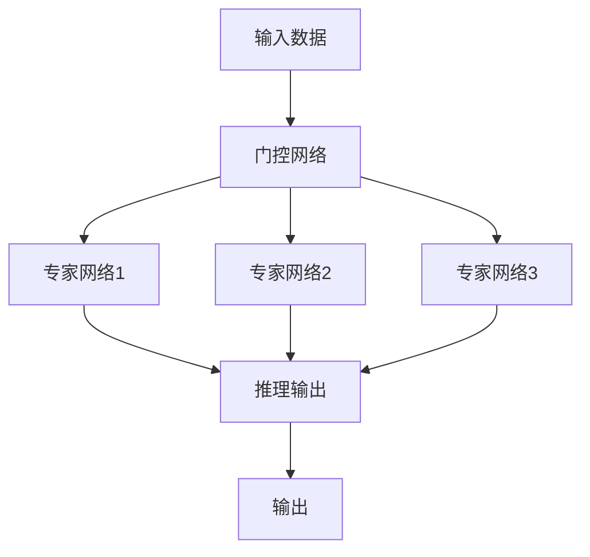

                 

## 1. 背景介绍

### 1.1 问题由来

大语言模型（Large Language Model, LLM）在自然语言处理（Natural Language Processing, NLP）领域展现了强大的学习能力，但同时其高计算需求和复杂性也带来了诸多挑战。随着预训练模型参数量的不断增大，对计算资源和内存空间的需求急剧增加，导致训练和推理成本高昂。此外，模型在特定任务上的泛化能力也受到影响，难以适应多样化、实时性的应用场景。

为了解决这些挑战，研究者提出了一种新的模型架构——混合专家模型（Mixture of Experts, MoE）。MoE通过将多个专家网络与门控机制相结合，降低了模型参数量，提升了推理速度，同时保留了预训练模型在广泛语言知识上的优势。该架构已经在多个NLP任务上取得了显著的效果，成为提高大语言模型效率和适应性的新方向。

### 1.2 问题核心关键点

混合专家模型（MoE）是一种新颖的模型架构，其核心思想是将模型拆分成多个专家网络，通过门控机制动态选择合适的专家进行推理。其关键点包括：

- **模型拆分**：将大型预训练模型拆分为多个小型专家网络，以降低参数量和计算复杂度。
- **门控机制**：通过门控网络选择最合适的专家进行推理，提升模型的推理效率和效果。
- **专家网络**：专家网络通常为小型神经网络，专注于特定领域或任务。
- **学习与推理**：模型需要同时进行专家网络的训练和学习，以及推理过程中的动态选择。

### 1.3 问题研究意义

研究MoE对于大语言模型的应用具有重要意义：

1. **提升计算效率**：通过拆分模型和门控机制，降低计算资源消耗，提高模型的训练和推理速度。
2. **增强泛化能力**：多个专家网络能专注于不同的领域或任务，提高模型的泛化性能和适应性。
3. **降低存储需求**：拆分的专家网络减少了总参数量，降低模型存储需求，适合内存受限的设备和实时应用场景。
4. **优化推理过程**：门控机制根据输入自动选择专家网络，优化推理过程，提升推理效率和准确性。
5. **促进创新应用**：MoE架构灵活可扩展，为NLP技术在更多领域的应用提供了新的思路和方向。

## 2. 核心概念与联系

### 2.1 核心概念概述

为更好地理解混合专家模型（MoE），本节将介绍几个关键概念及其联系：

- **混合专家模型（MoE）**：将大型预训练模型拆分为多个小型专家网络，通过门控机制选择最合适的专家进行推理，提升计算效率和泛化性能。
- **专家网络**：专注于特定领域或任务的小型神经网络，模型参数和计算复杂度较低。
- **门控机制**：通过学习门控网络选择最合适的专家网络，控制每个专家网络的激活程度，优化推理过程。
- **联合训练**：模型需要同时训练专家网络和门控网络，确保其协同工作。
- **推理过程**：输入数据通过门控机制选择专家网络进行推理，生成输出。

这些概念之间的逻辑关系可以通过以下Mermaid流程图来展示：



这个流程图展示了一个简单的MoE模型架构，其中输入数据通过门控网络选择最合适的专家网络进行推理，最终生成输出。

## 3. 核心算法原理 & 具体操作步骤
### 3.1 算法原理概述

混合专家模型（MoE）的核心算法原理基于以下思想：

- 将大型预训练模型拆分为多个小型专家网络，每个专家网络专注于特定领域或任务。
- 通过门控机制选择最合适的专家网络进行推理，提升计算效率和推理效果。
- 专家网络和门控网络需要同时进行训练和学习，确保其协同工作。

形式化地，设预训练模型为 $M_{\theta}$，其中 $\theta$ 为模型参数。假设模型的结构为 $M_{\theta} = M_{\phi} \cdot G_{\gamma}$，其中 $M_{\phi}$ 为专家网络，$G_{\gamma}$ 为门控网络，$\phi$ 和 $\gamma$ 分别为专家网络和门控网络的参数。

在推理过程中，输入数据 $x$ 首先经过门控网络 $G_{\gamma}$ 的筛选，选择最合适的专家网络 $M_{\phi_i}$ 进行推理，输出为：

$$
y = M_{\phi_i}(x) \cdot G_{\gamma_i}(x)
$$

其中 $G_{\gamma_i}(x)$ 表示输入 $x$ 在专家网络 $M_{\phi_i}$ 上的门控激活程度。

### 3.2 算法步骤详解

基于混合专家模型（MoE）的算法步骤主要包括以下几个关键步骤：

**Step 1: 模型结构设计**

- 确定专家网络的数目和结构，如深度、宽度等。
- 设计门控网络的架构和激活函数，如Gumbel Softmax、Softmax等。
- 确定联合训练和推理的具体流程，如推理时如何计算门控激活程度。

**Step 2: 模型训练与优化**

- 使用预训练模型作为初始化参数，训练专家网络 $M_{\phi_i}$。
- 训练门控网络 $G_{\gamma_i}$，学习如何根据输入数据 $x$ 选择最合适的专家网络。
- 优化模型参数 $\theta = \{\phi, \gamma\}$，最小化损失函数。

**Step 3: 推理过程与推理速度**

- 输入数据 $x$ 通过门控网络 $G_{\gamma}$ 计算每个专家网络的激活程度 $G_{\gamma_i}(x)$。
- 选择激活程度最高的专家网络 $M_{\phi_i}$ 进行推理，生成输出 $y$。
- 推理过程可通过并行计算加速，进一步提高计算效率。

### 3.3 算法优缺点

混合专家模型（MoE）具有以下优点：

- **参数效率高**：通过拆分模型和门控机制，大大降低参数量和计算复杂度。
- **推理速度快**：每个专家网络计算并行化，推理过程更加高效。
- **泛化能力强**：多个专家网络覆盖不同的领域和任务，提升模型的泛化性能。

同时，该模型也存在一些局限性：

- **模型设计复杂**：需要设计多个专家网络，并优化门控机制，设计过程较为复杂。
- **训练难度较大**：联合训练需要同时优化专家网络和门控网络，训练难度较大。
- **计算资源需求较高**：尽管参数量减少，但计算过程中仍需要多个专家网络的协同工作。

### 3.4 算法应用领域

混合专家模型（MoE）在多个NLP领域已经展示了其应用潜力，包括：

- **自然语言理解（NLU）**：用于文本分类、情感分析、问答系统等任务。
- **机器翻译（MT）**：提高翻译模型的计算效率和推理速度。
- **信息检索（IR）**：用于检索系统中的文本匹配和查询优化。
- **语音识别（ASR）**：提高语音识别模型的计算效率和泛化性能。
- **多模态学习（MM）**：结合文本、图像、语音等多模态数据进行推理。

这些应用展示了MoE在提升计算效率和泛化性能方面的潜力，为NLP技术在更多领域的应用提供了新的思路。

## 4. 数学模型和公式 & 详细讲解 & 举例说明
### 4.1 数学模型构建

在混合专家模型（MoE）中，数学模型构建主要包括以下几个部分：

1. **专家网络**：假设专家网络 $M_{\phi_i}$ 的形式为 $M_{\phi_i}(x) = \sum_j \phi_{i,j}(x) w_{i,j}$，其中 $w_{i,j}$ 为专家网络 $M_{\phi_i}$ 中第 $j$ 个隐层的权重。
2. **门控网络**：门控网络 $G_{\gamma_i}$ 的形式为 $G_{\gamma_i}(x) = \sum_k \gamma_{i,k}(x) v_{i,k}$，其中 $v_{i,k}$ 为门控网络 $G_{\gamma_i}$ 中第 $k$ 个隐层的权重。
3. **联合训练**：模型需要同时优化专家网络和门控网络，如使用交叉熵损失函数：

   $$
   \mathcal{L} = \sum_i \frac{1}{N_i} \sum_j \ell(M_{\phi_i}(x), y)
   $$

   其中 $\ell$ 为损失函数，$N_i$ 为专家网络 $M_{\phi_i}$ 中的隐层数目。

### 4.2 公式推导过程

以文本分类任务为例，其计算过程如下：

1. **专家网络**：将输入 $x$ 通过专家网络 $M_{\phi_i}$ 得到输出 $z_i$。
2. **门控网络**：计算每个专家网络的激活程度 $g_i$。
3. **选择专家网络**：根据激活程度 $g_i$ 选择最合适的专家网络 $M_{\phi_i}$ 进行分类，输出 $y$。

具体公式如下：

$$
z_i = M_{\phi_i}(x)
$$

$$
g_i = G_{\gamma_i}(x)
$$

$$
y = \sum_i g_i M_{\phi_i}(x)
$$

### 4.3 案例分析与讲解

假设有一个二分类任务，输入为文本 $x$，输出为标签 $y$。模型的结构如图：

```
     input  - - - - - - - - - - - - - - - - - - - - - - - - - - - - - - - - - - - - - - - - - - - - - - - - - - - - - - - - - - - - - - - - - - - - - - - - - - - - - - - - - - - - - - - - - - - - - - - - - - - - - - - - - - - - - - - - - - - - - - - - - - - - - - - - - - - - - - - - - - - - - - - - - - - - - - - - - - - - - - - - - - - - - - - - - - - - - - - - - - - - - - - - - - - - - - - - - - - - - - - - - - - - - - - - - - - - - - - - - - - - - - - - - - - - - - - - - - - - - - - - - - - - - - - - - - - - - - - - - - - - - - - - - - - - - - - - - - - - - - - - - - - - - - - - - - - - - - - - - - - - - - - - - - - - - - - - - - - - - - - - - - - - - - - - - - - - - - - - - - - - - - - - - - - - - - - - - - - - - - - - - - - - - - - - - - - - - - - - - - - - - - - - - - - - - - - - - - - - - - - - - - - - - - - - - - - - - - - - - - - - - - - - - - - - - - - - - - - - - - - - - - - - - - - - - - - - - - - - - - - - - - - - - - - - - - - - - - - - - - - - - - - - - - - - - - - - - - - - - - - - - - - - - - - - - - - - - - - - - - - - - - - - - - - - - - - - - - - - - - - - - - - - - - - - - - - - - - - - - - - - - - - - - - - - - - - - - - - - - - - - - - - - - - - - - - - - - - - - - - - - - - - - - - - - - - - - - - - - - - - - - - - - - - - - - - - - - - - - - - - - - - - - - - - - - - - - - - - - - - - - - - - - - - - - - - - - - - - - - - - - - - - - - - - - - - - - - - - - - - - - - - - - - - - - - - - - - - - - - - - - - - - - - - - - - - - - - - - - - - - - - - - - - - - - - - - - - - - - - - - - - - - - - - - - - - - - - - - - - - - - - - - - - - - - - - - - - - - - - - - - - - - - - - - - - - - - - - - - - - - - - - - - - - - - - - - - - - - - - - - - - - - - - - - - - - - - - - - - - - - - - - - - - - - - - - - - - - - - - - - - - - - - - - - - - - - - - - - - - - - - - - - - - - - - - - - - - - - - - - - - - - - - - - - - - - - - - - - - - - - - - - - - - - - - - - - - - - - - - - - - - - - - - - - - - - - - - - - - - - - - - - - - - - - - - - - - - - - - - - - - - - - - - - - - - - - - - - - - - - - - - - - - - - - - - - - - - - - - - - - - - - - - - - - - - - - - - - - - - - - - - - - - - - - - - - - - - - - - - - - - - - - - - - - - - - - - - - - - - - - - - - - - - - - - - - - - - - - - - - - - - - - - - - - - - - - - - - - - - - - - - - - - - - - - - - - - - - - - - - - - - - - - - - - - - - - - - - - - - - - - - - - - - - - - - - - - - - - - - - - - - - - - - - - - - - - - - - - - - - - - - - - - - - - - - - - - - - - - - - - - - - - - - - - - - - - - - - - - - - - - - - - - - - - - - - - - - - - - - - - - - - - - - - - - - - - - - - - - - - - - - - - - - - - - - - - - - - - - - - - - - - - - - - - - - - - - - - - - - - - - - - - - - - - - - - - - - - - - - - - - - - - - - - - - - - - - - - - - - - - - - - - - - - - - - - - - - - - - - - - - - - - - - - - - - - - - - - - - - - - - - - - - - - - - - - - - - - - - - - - - - - - - - - - - - - - - - - - - - - - - - - - - - - - - - - - - - - - - - - - - - - - - - - - - - - - - - - - - - - - - - - - - - - - - - - - - - - - - - - - - - - - - - - - - - - - - - - - - - - - - - - - - - - - - - - - - - - - - - - - - - - - - - - - - - - - - - - - - - - - - - - - - - - - - - - - - - - - - - - - - - - - - - - - - - - - - - - - - - - - - - - - - - - - - - - - - - - - - - - - - - - - - - - - - - - - - - - - - - - - - - - - - - - - - - - - - - - - - - - - - - - - - - - - - - - - - - - - - - - - - - - - - - - - - - - - - - - - - - - - - - - - - - - - - - - - - - - - - - - - - - - - - - - - - - - - - - - - - - - - - - - - - - - - - - - - - - - - - - - - - - - - - - - - - - - - - - - - - - - - - - - - - - - - - - - - - - - - - - - - - - - - - - - - - - - - - - - - - - - - - - - - - - - - - - - - - - - - - - - - - - - - - - - - - - - - - - - - - - - - - - - - - - - - - - - - - - - - - - - - - - - - - - - - - - - - - - - - - - - - - - - - - - - - - - - - - - - - - - - - - - - - - - - - - - - - - - - - - - - - - - - - - - - - - - - - - - - - - - - - - - - - - - - - - - - - - - - - - - - - - - - - - - - - - - - - - - - - - - - - - - - - - - - - - - - - - - - - - - - - - - - - - - - - - - - - - - - - - - - - - - - - - - - - - - - - - - - - - - - - - - - - - - - - - - - - - - - - - - - - - - - - - - - - - - - - - - - - - - - - - - - - - - - - - - - - - - - - - - - - - - - - - - - - - - - - - - - - - - - - - - - - - - - - - - - - - - - - - - - - - - - - - - - - - - - - - - - - - - - - - - - - - - - - - - - - - - - - - - - - - - - - - - - - - - - - - - - - - - - - - - - - - - - - - - - - - - - - - - - - - - - - - - - - - - - - - - - - - - - - - - - - - - - - - - - - - - - - - - - - - - - - - - - - - - - - - - - - - - - - - - - - - - - - - - - - - - - - - - - - - - - - - - - - - - - - - - - - - - - - - - - - - - - - - - - - - - - - - - - - - - - - - - - - - - - - - - - - - - - - - - - - - - - - - - - - - - - - - - - - - - - - - - - - - - - - - - - - - - - - - - - - - - - - - - - - - - - - - - - - - - - - - - - - - - - - - - - - - - - - - - - - - - - - - - - - - - - - - - - - - - - - - - - - - - - - - - - - - - - - - - - - - - - - - - - - - - - - - - - - - - - - - - - - - - - - - - - - - - - - - - - - - - - - - - - - - - - - - - - - - - - - - - - - - - - - - - - - - - - - - - - - - - - - - - - - - - - - - - - - - - - - - - - - - - - - - - - - - - - - - - - - - - - - - - - - - - - - - - - - - - - - - - - - - - - - - - - - - - - - - - - - - - - - - - - - - - - - - - - - - - - - - - - - - - - - - - - - - - - - - - - - - - - - - - - - - - - - - - - - - - - - - - - - - - - - - - - - - - - - - - - - - - - - - - - - - - - - - - - - - - - - - - - - - - - - - - - - - - - - - - - - - - - - - - - - - - - - - - - - - - - - - - - - - - - - - - - - - - - - - - - - - - - - - - - - - - - - - - - - - - - - - - - - - - - - - - - - - - - - - - - - - - - - - - - - - - - - - - - - - - - - - - - - - - - - - - - - - - - - - - - - - - - - - - - - - - - - - - - - - - - - - - - - - - - - - - - - - - - - - - - - - - - - - - - - - - - - - - - - - - - - - - - - - - - - - - - - - - - - - - - - - - - - - - - - - - - - - - - - - - - - - - - - - - - - - - - - - - - - - - - - - - - - - - - - - - - - - - - - - - - - - - - - - - - - - - - - - - - - - - - - - - - - - - - - - - - - - - - - - - - - - - - - - - - - - - - - - - - - - - - - - - - - - - - - - - - - - - - - - - - - - - - - - - - - - - - - - - - - - - - - - - - - - - - - - - - - - - - - - - - - - - - - - - - - - - - - - - - - - - - - - - - - - - - - - - - - - - - - - - - - - - - - - - - - - - - - - - - - - - - - - - - - - - - - - - - - - - - - - - - - - - - - - - - - - - - - - - - - - - - - - - - - - - - - - - - - - - - - - - - - - - - - - - - - - - - - - - - - - - - - - - - - - - - - - - - - - - - - - - - - - - - - - - - - - - - - - - - - - - - - - - - - - - - - - - - - - - - - - - - - - - - - - - - - - - - - - - - - - - - - - - - - - - - - - - - - - - - - - - - - - - - - - - - - - - - - - - - - - - - - - - - - - - - - - - - - - - - - - - - - - - - - - - - - - - - - - - - - - - - - - - - - - - - - - - - - - - - - - - - - - - - - - - - - - - - - - - - - - - - - - - - - - - - - - - - - - - - - - - - - - - - - - - - - - - - - - - - - - - - - - - - - - - - - - - - - - - - - - - - - - - - - - - - - - - - - - - - - - - - - - - - - - - - - - - - - - - - - - - - - - - - - - - - - - - - - - - - - - - - - - - - - - - - - - - - - - - - - - - - - - - - - - - - - - - - - - - - - - - - - - - - - - - - - - - - - - - - - - - - - - - - - - - - - - - - - - - - - - - - - - - - - - - - - - - - - - - - - - - - - - - - - - - - - - - - - - - - - - - - - - - - - - - - - - - - - - - - - - - - - - - - - - - - - - - - - - - - - - - - - - - - - - - - - - - - - - - - - - - - - - - - - - - - - - - - - - - - - - - - - - - - - - - - - - - - - - - - - - - - - - - - - - - - - - - - - - - - - - - - - - - - - - - - - - - - - - - - - - - - - - - - - - - - - - - - - - - - - - - - - - - - - - - - - - - - - - - - - - - - - - - - - - - - - - - - - - - - - - - - - - - - - - - - - - - - - - - - - - - - - - - - - - - - - - - - - - - - - - - - - - - - - - - - - - - - - - - - - - - - - - - - - - - - - - - - - - - - - - - - - - - - - - - - - - - - - - - - - - - - - - - - - - - - - - - - - - - - - - - - - - - - - - - - - - - - - - - - - - - - - - - - - - - - - - - - - - - - - - - - - - - - - - - - - - - - - - - - - - - - - - - - - - - - - - - - - - - - - - - - - - - - - - - - - - - - - - - - - - - - - - - - - - - - - - - - - - - - - - - - - - - - - - - - - - - - - - - - - - - - - - - - - - - - - - - - - - - - - - - - - - - - - - - - - - - - - - - - - - - - - - - - - - - - - - - - - - - - - - - - - - - - - - - - - - - - - - - - - - - - - - - - - - - - - - - - - - - - - - - - - - - - - - - - - - - - - - - - - - - - - - - - - - - - - - - - - - - - - - - - - - - - - - - - - - - - - - - - - - - - - - - - - - - - - - - - - - - - - - - - - - - - - - - - - - - - - - - - - - - - - - - - - - - - - - - - - - - - - - - - - - - - - - - - - - - - - - - - - - - - - - - - - - - - - - - - - - - - - - - - - - - - - - - - - - - - - - - - - - - - - - - - - - - - - - - - - - - - - - - - - - - - - - - - - - - - - - - - - - - - - - - - - - - - - - - - - - - - - - - - - - - - - - - - - - - - - - - - - - - - - - - - - - - - - - - - - - - - - - - - - - - - - - - - - - - - - - - - - - - - - - - - - - - - - - - - - - - - - - - - - - - - - - - - - - - - - - - - - - - - - - - - - - - - - - - - - - - - - - - - - - - - - - - - - - - - - - - - - - - - - - - - - - - - - - - - - - - - - - - - - - - - - - - - - - - - - - - - - - - - - - - - - - - - - - - - - - - - - - - - - - - - - - - - - - - - - - - - - - - - - - - - - - - - - - - - - - - - - - - - - - - - - - - - - - - - - - - - - - - - - - - - - - - - - - - - - - - - - - - - - - - - - - - - - - - - - - - - - - - - - - - - - - - - - - - - - - - - - - - - - - - - - - - - - - - - - - - - - - - - - - - - - - - - - - - - - - - - - - - - - - - - - - - - - - - - - - - - - - - - - - - - - - - - - - - - - - - - - - - - - - - - - - - - - - - - - - - - - - - - - - - - - - - - - - - - - - - - - - - - - - - - - - - - - - - - - - - - - - - - - - - - - - - - - - - - - - - - - - - - - - - - - - - - - - - - - - - - - - - - - - - - - - - - - - - - - - - - - - - - - - - - - - - - - - - - - - - - - - - - - - - - - - - - - - - - - - - - - - - - - - - - - - - - - - - - - - - - - - - - - - - - - - - - - - - - - - - - - - - - - - - - - - - - - - - - - - - - - - - - - - - - - - - - - - - - - - - - - - - - - - - - - - - - - - - - - - - - - - - - - - - - - - - - - - - - - - - - - - - - - - - - - - - - - - - - - - - - - - - - - - - - - - - - - - - - - - - - - - - - - - - - - - - - - - - - - - - - - - - - - - - - - - - - - - - - - - - - - - - - - - - - - - - - - - - - - - - - - - - - - - - - - - - - - - - - - - - - - - - - - - - - - - - - - - - - - - - - - - - - - - - - - - - - - - - - - - - - - - - - - - - - - - - - - - - - - - - - - - - - - - - - - - - - - - - - - - - - - - - - - - - - - - - - - - - - - - - - - - - - - - - - - - - - - - - - - - - - - - - - - - - - - - - - - - - - - - - - - - - - - - - - - - - - - - - - - - - - - - - - - - - - - - - - - - - - - - - - - - - - - - - - - - - - - - - - - - - - - - - - - - - - - - - - - - - - - - - - - - - - - - - - - - - - - - - - - - - - - - - - - - - - - - - - - - - - - - - - - - - - - - - - - - - - - - - - - - - - - - - - - - - - - - - - - - - - - - - - - - - - - - - - - - - - - - - - - - - - - - - - - - - - - - - - - - - - - - - - - - - - - - - - - - - - - - - - - - - - - - - - - - - - - - - - - - - - - - - - - - - - - - - - - - - - - - - - - - - - - - - - - - - - - - - - - - - - - - - - - - - - - - - - - - - - - - - - - - - - - - - - - - - - - - - - - - - - - - - - - - - - - - - - - - - - - - - - - - - - - - - - - - - - - - - - - - - - - - - - - - - - - - - - - - - - - - - - - - - - - - - - - - - - - - - - - - - - - - - - - - - - - - - - - - - - - - - - - - - - - - - - - - - - - - - - - - - - - - - - - - - - - - - - - - - - - - - - - - - - - - - - - - - - - - - - - - - - - - - - - - - - - - - - - - - - - - - - - - - - - - - - - - - - - - - - - - - - - - - - - - - - - - - - - - - - - - - - - - - - - - - - - - - - - - - - - - - - - - - - - - - - - - - - - - - - - - - - - - - - - - - - - - - - - - - - - - - - - - - - - - - - - - - - - - - - - - - - - - - - - - - - - - - - - - - - - - - - - - - - - - - - - - - - - - - - - - - - - - - - - - - - - - - - - - - - - - - - - - - - - - - - - - - - - - - - - - - - - - - - - - - - - - - - - - - - - - - - - - - - - - - - - - - - - - - - - - - - - - - - - - - - - - - - - - - - - - - - - - - - - - - - - - - - - - - - - - - - - - - - - - - - - - - - - - - - - - - - - - - - - - - - - - - - - - - - - - - - - - - - - - - - - - - - - - - - - - - - - - - - - - - - - - - - - - - - - - - - - - - - - - - - - - - - - - - - - - - - - - - - - - - - - - - - - - - - - - - - - - - - - - - - - - - - - - - - - - - - - - - - - - - - - - - - - - - - - - - - - - - - - - - - - - - - - - - - - - - - - - - - - - - - - - - - - - - - - - - - - - - - - - - - - - - - - - - - - - - - - - - - - - - - - - - - - - - - - - - - - - - - - - - - - - - - - - - - - - - - - - - - - - - - - - - - - - - - - - - - - - - - - - - - - - - - - - - - - - - - - - - - - - - - - - - - - - - - - - - - - - - - - - - - - - - - - - - - - - - - - - - - - - - - - - - - - - - - - - - - - - - - - - - - - - - - - - - - - - - - - - - - - - - - - - - - - - - - - - - - - - - - - - - - - - - - - - - - - - - - - - - - - - - - - - - - - - - - - - - - - - - - - - - - - - - - - - - - - - - - - - - - - - - - - - - - - - - - - - - - - - - - - - - - - - - - - - - - - - - - - - - - - - - - - - - - - - - - - - - - - - - - - - - - - - - - - - - - - - - - - - - - - - - - - - - - - - - - - - - - - - - - - - - - - - - - - - - - - - - - - - - - - - - - - - - - - - - - - - - - - - - - - - - - - - - - - - - - - - - - - - - - - - - - - - - - - - - - - - - - - - - - - - - - - - - - - - - - - - - - - - - - - - - - - - - - - - - - - - - - - - - - - - - - - - - - - - - - - - - - - - - - - - - - - - - - - - - - - - - - - - - - - - - - - - - - - - - - - - - - - - - - - - - - - - - - - - - - - - - - - - - - - - -

