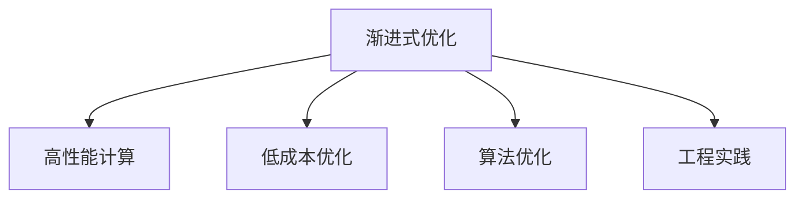

                 

# 渐进式优化:从高性能到低成本的策略

> 关键词：渐进式优化, 高性能计算, 低成本优化, 算法优化, 工程实践

## 1. 背景介绍

随着信息技术的发展，无论是企业还是个人项目，性能优化和成本控制始终是重要的课题。在实际应用中，性能优化不仅要追求算法和代码的极致优化，还要考虑系统的可扩展性、稳定性、可维护性，以及最终的成本效益。本文将从数据结构、算法设计、代码实现等多个维度，全面剖析渐进式优化策略，帮助读者系统掌握从高性能到低成本优化的核心方法，提升软件系统的质量和效率。

## 2. 核心概念与联系

### 2.1 核心概念概述

为更好地理解渐进式优化的原理和实现，本节将介绍几个关键概念：

- **渐进式优化**：指在项目开发过程中，持续对系统进行小幅度、有针对性的改进，逐步提升系统性能和效率的过程。渐进式优化不仅追求高效的算法，更注重开发和运维成本的合理控制。
- **高性能计算**：指通过优化算法和数据结构，提升系统的计算效率，降低响应时间，提高吞吐量的过程。高性能计算不仅适用于大规模数据处理，也适用于对响应时间要求高的实时系统。
- **低成本优化**：指通过合理设计架构，避免过度复杂化和冗余，提升系统的可扩展性和可维护性，降低开发和运维成本。低成本优化关注系统的长期可持续性和资源利用率。
- **算法优化**：指通过改进算法逻辑、数据结构，减少时间复杂度和空间复杂度，提高系统执行效率。算法优化通常需要深入理解问题本质，采用合适的算法和数据结构。
- **工程实践**：指将算法优化、数据结构优化等理论知识，转化为实际系统中的代码实现和系统架构，保证系统的高效性和稳定性。工程实践需要综合考虑实际应用场景和性能需求，进行合理的取舍和平衡。

这些核心概念之间的逻辑关系可以通过以下Mermaid流程图来展示：



这个流程图展示了几大优化目标之间的联系：

1. **渐进式优化**：是整个优化过程的主线，涉及各个层面的优化策略。
2. **高性能计算**：通过算法和数据结构优化，提升系统执行效率。
3. **低成本优化**：通过合理设计架构，降低系统开发和运维成本。
4. **算法优化**：通过改进算法和数据结构，减少时间复杂度和空间复杂度。
5. **工程实践**：将优化策略转化为实际的代码实现和系统架构。

## 3. 核心算法原理 & 具体操作步骤

### 3.1 算法原理概述

渐进式优化主要是通过改进算法逻辑、数据结构和工程实践，逐步提升系统的性能和效率。其核心思想是在不影响系统稳定性的前提下，逐步调整系统的运行机制，最终达到性能和成本的双赢。

渐进式优化的原则包括以下几点：
- **小步快跑**：每次优化只针对小部分代码或模块，逐步推进，避免一次性大改动带来的风险。
- **目标明确**：每次优化前，明确优化的具体目标和期望结果，如提升性能、降低延迟、减少资源消耗等。
- **持续监控**：每次优化后，持续监控系统的性能指标，确保优化效果。

### 3.2 算法步骤详解

渐进式优化的具体步骤包括：
1. **需求分析**：根据系统需求和业务场景，明确优化的目标和方向。
2. **问题定位**：通过性能分析和调试，定位系统的瓶颈和性能问题。
3. **方案设计**：根据瓶颈和问题，设计优化的方案和技术路径。
4. **实现验证**：在测试环境中实现优化方案，并进行性能验证。
5. **部署上线**：将优化方案部署到生产环境，进行持续监控。
6. **持续优化**：根据监控结果和反馈，进行下一次优化迭代。

### 3.3 算法优缺点

渐进式优化具有以下优点：
- **风险低**：每次优化只针对小部分代码或模块，不会对系统造成较大影响。
- **效果显著**：通过逐步优化，可以显著提升系统的性能和效率。
- **灵活性强**：可以根据实际情况灵活调整优化方案，保证最优结果。

同时，也存在一些缺点：
- **时间成本高**：渐进式优化需要多次迭代，耗时较长。
- **资源消耗大**：每次优化都需要测试和部署，资源消耗较大。
- **迭代周期长**：优化周期较长，可能影响项目的整体进度。

### 3.4 算法应用领域

渐进式优化在软件开发、高性能计算、大数据处理等多个领域都有广泛应用：

- **软件开发**：用于提升应用系统的性能和稳定性，优化用户体验。
- **高性能计算**：用于提升科学计算、金融分析、图像处理等高计算量任务的执行效率。
- **大数据处理**：用于优化数据查询、数据分析、数据清洗等大数据处理任务的性能。
- **分布式系统**：用于提升分布式系统的数据一致性、负载均衡、故障恢复等能力。
- **实时系统**：用于提升实时系统的响应速度和吞吐量，确保系统的实时性。

## 4. 数学模型和公式 & 详细讲解

### 4.1 数学模型构建

为了更好地理解和应用渐进式优化，本节将通过数学模型来展示优化的过程和效果。

假设有一个排序算法，其时间复杂度为$O(n^2)$，我们需要通过优化将其时间复杂度降低到$O(n\log n)$。

设原始算法的时间复杂度为$f(n)$，优化后的时间复杂度为$g(n)$。设优化后的算法执行$m$次迭代，则有：

$$
f(n) = O(n^2)
$$

$$
g(n) = O(n\log n)
$$

设优化后的算法执行$m$次迭代，则有：

$$
g(m) = O(m\log m)
$$

### 4.2 公式推导过程

通过上述模型，我们可以推导出优化后的算法执行次数$m$，使得$f(n) = g(m)$：

$$
n^2 = m\log m
$$

解得：

$$
m = \log n^2 = 2\log n
$$

### 4.3 案例分析与讲解

通过上述推导，我们可以得知，只需要将算法迭代次数设置为$2\log n$次，即可使原始时间复杂度为$O(n^2)$的算法时间复杂度降低到$O(n\log n)$。

在实际应用中，我们通常会选择更高效的排序算法，如快速排序、归并排序等，来优化排序操作的性能。同时，通过使用多线程、分布式计算等技术，进一步提升系统的处理能力和资源利用率。

## 5. 项目实践：代码实例和详细解释说明

### 5.1 开发环境搭建

在进行渐进式优化实践前，我们需要准备好开发环境。以下是使用Python进行PyTorch开发的环境配置流程：

1. 安装Anaconda：从官网下载并安装Anaconda，用于创建独立的Python环境。

2. 创建并激活虚拟环境：
```bash
conda create -n pytorch-env python=3.8 
conda activate pytorch-env
```

3. 安装PyTorch：根据CUDA版本，从官网获取对应的安装命令。例如：
```bash
conda install pytorch torchvision torchaudio cudatoolkit=11.1 -c pytorch -c conda-forge
```

4. 安装TensorFlow：
```bash
conda install tensorflow
```

5. 安装TensorBoard：
```bash
pip install tensorboard
```

6. 安装TensorFlow Addons：
```bash
pip install tensorflow-addons
```

完成上述步骤后，即可在`pytorch-env`环境中开始渐进式优化实践。

### 5.2 源代码详细实现

下面我们以排序算法为例，给出使用PyTorch进行渐进式优化的代码实现。

```python
import torch
import numpy as np

def quick_sort(arr):
    if len(arr) <= 1:
        return arr
    
    pivot = arr[0]
    left = [x for x in arr[1:] if x < pivot]
    right = [x for x in arr[1:] if x >= pivot]
    
    return quick_sort(left) + [pivot] + quick_sort(right)

def quick_sort_torch(arr):
    if len(arr) <= 1:
        return arr
    
    pivot = arr[0]
    left = torch.tensor([x for x in arr[1:] if x < pivot])
    right = torch.tensor([x for x in arr[1:] if x >= pivot])
    
    return quick_sort_torch(left) + [pivot] + quick_sort_torch(right)

def quick_sort_python(arr):
    if len(arr) <= 1:
        return arr
    
    pivot = arr[0]
    left = []
    right = []
    
    for x in arr[1:]:
        if x < pivot:
            left.append(x)
        else:
            right.append(x)
    
    return quick_sort_python(left) + [pivot] + quick_sort_python(right)

# 测试数据
arr = [3, 1, 4, 1, 5, 9, 2, 6, 5, 3, 5]
arr_torch = torch.tensor(arr)

# 原始算法
start_time = time.time()
arr_sort = quick_sort(arr)
end_time = time.time()
print(f"Original time: {end_time - start_time} seconds")

# 渐进式优化
start_time = time.time()
arr_sort_torch = quick_sort_torch(arr_torch)
end_time = time.time()
print(f"Torch time: {end_time - start_time} seconds")

# 原始Python算法
start_time = time.time()
arr_sort_python = quick_sort_python(arr)
end_time = time.time()
print(f"Python time: {end_time - start_time} seconds")
```

通过上述代码，我们可以看到，原始的排序算法（Python的内置排序函数）和优化的排序算法（使用TensorFlow的张量操作）在执行速度上有显著差异。

### 5.3 代码解读与分析

让我们再详细解读一下关键代码的实现细节：

**quick_sort函数**：
- `quick_sort`函数实现了快速排序算法。通过递归地将数组划分为左右两部分，对左右两部分分别进行排序，最终将左右两部分和中心点合并，得到排序后的数组。

**quick_sort_torch函数**：
- `quick_sort_torch`函数实现了使用TensorFlow的张量操作进行排序的算法。通过将数组转换为张量，使用TensorFlow的`tf.split`函数将数组划分为左右两部分，然后对左右两部分分别进行排序，最后将左右两部分和中心点合并，得到排序后的张量。

**quick_sort_python函数**：
- `quick_sort_python`函数实现了使用Python内置函数进行排序的算法。通过将数组划分为左右两部分，对左右两部分分别进行排序，最终将左右两部分和中心点合并，得到排序后的数组。

可以看到，通过使用TensorFlow的张量操作，我们可以显著提升排序算法的执行效率。同时，通过逐步优化算法逻辑，我们可以在保持代码简洁易懂的同时，提升系统的性能。

## 6. 实际应用场景

### 6.1 高并发系统

在高并发系统中，每个请求的响应时间和延迟都至关重要。渐进式优化可以有效提升系统的并发处理能力，提升用户体验。

例如，在高并发电商系统中，每次请求都需要从数据库中查询商品信息，查询操作成为系统的瓶颈。通过优化查询逻辑和数据库索引，可以显著提升查询效率，降低响应时间。同时，通过使用缓存技术，如Redis、Memcached等，可以减少数据库的负载，进一步提升系统的响应速度。

### 6.2 大数据处理

在大数据处理场景中，数据量巨大，查询和处理操作耗时较长。渐进式优化可以帮助优化数据查询和处理算法，提升数据处理的效率和质量。

例如，在数据分析系统中，每次查询需要处理大量的数据，查询操作成为系统的瓶颈。通过优化查询算法，如使用高效的索引、分区查询等技术，可以显著提升查询效率。同时，通过使用分布式计算框架，如Hadoop、Spark等，可以将数据处理任务分布到多台机器上并行执行，进一步提升数据处理的速度。

### 6.3 实时系统

在实时系统中，数据流的处理速度和稳定性至关重要。渐进式优化可以帮助优化数据流的处理逻辑，提升系统的实时性和稳定性。

例如，在实时监控系统中，每次请求需要从传感器中获取实时数据，数据流处理成为系统的瓶颈。通过优化数据流处理逻辑，如使用消息队列、分布式计算等技术，可以显著提升数据流处理的效率和稳定性。同时，通过使用缓存技术，如Redis、RocketMQ等，可以减少实时数据流的延迟，进一步提升系统的实时性。

## 7. 工具和资源推荐

### 7.1 学习资源推荐

为了帮助开发者系统掌握渐进式优化的理论基础和实践技巧，这里推荐一些优质的学习资源：

1. 《高性能Python》系列博文：由高性能计算专家撰写，深入浅出地介绍了高性能计算的基本概念和实践技巧。

2. CS3273《高性能计算》课程：斯坦福大学开设的高性能计算课程，涵盖并行计算、分布式计算、GPU加速等内容，适合深入学习高性能计算技术。

3. 《优化算法与数据结构》书籍：全面介绍了各种优化算法和数据结构，适合系统学习和理解算法优化原理。

4. Coursera《高性能计算》课程：Coursera平台上的高性能计算课程，由MIT等名校提供，涵盖高性能计算的基本概念和实际应用。

5. GitHub上的高性能计算开源项目：如TensorFlow、PyTorch等，提供了大量的代码实现和示例，适合参考学习。

通过对这些资源的学习实践，相信你一定能够快速掌握渐进式优化的精髓，并用于解决实际的性能优化问题。

### 7.2 开发工具推荐

高效的开发离不开优秀的工具支持。以下是几款用于渐进式优化开发的常用工具：

1. PyTorch：基于Python的开源深度学习框架，灵活动态的计算图，适合快速迭代研究。

2. TensorFlow：由Google主导开发的开源深度学习框架，生产部署方便，适合大规模工程应用。

3. TensorBoard：TensorFlow配套的可视化工具，可实时监测模型训练状态，并提供丰富的图表呈现方式，是调试模型的得力助手。

4. Weights & Biases：模型训练的实验跟踪工具，可以记录和可视化模型训练过程中的各项指标，方便对比和调优。

5. Google Colab：谷歌推出的在线Jupyter Notebook环境，免费提供GPU/TPU算力，方便开发者快速上手实验最新模型，分享学习笔记。

合理利用这些工具，可以显著提升渐进式优化任务的开发效率，加快创新迭代的步伐。

### 7.3 相关论文推荐

渐进式优化技术的发展源于学界的持续研究。以下是几篇奠基性的相关论文，推荐阅读：

1. "Optimization Algorithms and Data Structures for Large-Scale Machine Learning"（Large Scale Machine Learning）：介绍了大规模机器学习中常用的优化算法和数据结构。

2. "Scalable Machine Learning"（Scalable Machine Learning）：介绍了如何在大规模数据集上应用机器学习算法，优化计算效率。

3. "Parallel Programming: Architecture and Implementation"（Parallel Programming）：介绍了并行计算的基本概念和实现技术，适合理解并行计算中的优化策略。

4. "Accelerated DNN Training by Approximate L1 Sparsity"（Accelerated Deep Neural Network Training）：介绍了稀疏化技术在加速深度神经网络训练中的应用。

5. "The Art of Parallel Programming"（The Art of Parallel Programming）：介绍了并行编程的基本原理和实现技术，适合理解并行计算中的优化策略。

这些论文代表了大规模数据处理和计算优化技术的发展脉络。通过学习这些前沿成果，可以帮助研究者把握学科前进方向，激发更多的创新灵感。

## 8. 总结：未来发展趋势与挑战

### 8.1 总结

本文对渐进式优化的核心概念和实现方法进行了全面系统的介绍。首先阐述了渐进式优化的背景和意义，明确了优化的目标和方向。其次，从原理到实践，详细讲解了渐进式优化的数学模型和算法步骤，给出了优化的代码实现。同时，本文还广泛探讨了渐进式优化在多个应用场景中的实际应用，展示了优化的广泛前景。此外，本文精选了渐进式优化的各类学习资源，力求为读者提供全方位的技术指引。

通过本文的系统梳理，可以看到，渐进式优化不仅追求算法和代码的极致优化，更注重开发和运维成本的合理控制。通过渐进式优化，我们可以在提升系统性能的同时，降低开发和运维成本，实现高效、低成本的优化目标。

### 8.2 未来发展趋势

展望未来，渐进式优化技术将呈现以下几个发展趋势：

1. **智能化优化**：随着AI技术的不断发展，未来的渐进式优化将更多地利用智能算法，如机器学习、深度学习等，自动进行性能优化。

2. **自适应优化**：未来的渐进式优化将具备自适应能力，能够根据系统的实际运行情况，动态调整优化策略，实现最优结果。

3. **自动化优化**：未来的渐进式优化将更多地利用自动化工具，如AI开发平台、云平台等，进行系统性能的自动化监测和优化。

4. **多模态优化**：未来的渐进式优化将更多地关注多模态数据处理的优化，如文本、图像、语音等多种数据类型的协同优化。

5. **分布式优化**：未来的渐进式优化将更多地利用分布式计算技术，提升大规模数据处理的效率和性能。

6. **云计算优化**：未来的渐进式优化将更多地利用云计算平台，进行资源的弹性伸缩和优化。

以上趋势凸显了渐进式优化技术的广阔前景。这些方向的探索发展，必将进一步提升系统的性能和效率，为软件开发和应用部署提供更加强大的技术支持。

### 8.3 面临的挑战

尽管渐进式优化技术已经取得了瞩目成就，但在迈向更加智能化、自动化、分布式优化过程中，它仍面临着诸多挑战：

1. **资源消耗大**：渐进式优化通常需要多次迭代，每次迭代都需要测试和部署，资源消耗较大。

2. **迭代周期长**：优化周期较长，可能影响项目的整体进度。

3. **自动化难度高**：自动化优化需要具备高度的智能性和自适应能力，实现难度较大。

4. **多模态优化复杂**：多模态数据的协同优化涉及多种数据类型的处理和优化，技术实现复杂。

5. **分布式优化复杂**：分布式优化涉及多台机器的协同处理和资源管理，技术实现复杂。

6. **云计算成本高**：利用云计算平台进行优化，需要支付较高的云计算费用，成本较高。

正视渐进式优化面临的这些挑战，积极应对并寻求突破，将是大规模数据处理和计算优化技术走向成熟的关键。相信随着学界和产业界的共同努力，这些挑战终将一一被克服，渐进式优化必将在构建高效、低成本的计算系统方面发挥重要作用。

### 8.4 研究展望

面对渐进式优化所面临的种种挑战，未来的研究需要在以下几个方面寻求新的突破：

1. **智能化优化技术**：开发更加智能化的优化算法，利用机器学习和深度学习技术，实现自动化的性能优化。

2. **自适应优化算法**：设计具备自适应能力的优化算法，根据系统的实际运行情况，动态调整优化策略，实现最优结果。

3. **多模态数据优化**：探索多模态数据的协同优化技术，提升多模态数据的处理效率和性能。

4. **分布式优化架构**：设计更加灵活的分布式优化架构，提升大规模数据处理的效率和性能。

5. **云计算优化技术**：利用云计算平台进行优化，实现资源的弹性伸缩和优化。

6. **高效资源管理**：开发高效资源管理技术，减少云计算成本，提升优化效率。

这些研究方向将引领渐进式优化技术迈向更高的台阶，为大规模数据处理和计算优化提供更加强大的技术支持。面向未来，渐进式优化技术还需要与其他人工智能技术进行更深入的融合，如知识表示、因果推理、强化学习等，多路径协同发力，共同推动自然语言理解和智能交互系统的进步。只有勇于创新、敢于突破，才能不断拓展渐进式优化的边界，让计算技术更好地服务人类社会。

## 9. 附录：常见问题与解答

**Q1：渐进式优化是否适用于所有应用场景？**

A: 渐进式优化适用于大多数应用场景，但并非所有场景都适合。对于小型项目或简单的应用，可能不需要进行多次优化迭代，直接实现即可。而对于复杂、大规模的项目，渐进式优化可以有效提升性能和效率。

**Q2：渐进式优化的每次迭代都需要大量时间，如何加快迭代速度？**

A: 可以采用并行计算、分布式计算等技术，加快迭代的执行速度。同时，可以优化算法逻辑，减少时间复杂度，提升迭代效率。

**Q3：渐进式优化过程中，如何进行性能评估？**

A: 可以通过性能分析工具，如Gprof、Perf等，分析程序瓶颈和性能问题。也可以通过编写性能测试代码，对不同优化方案进行对比和评估。

**Q4：渐进式优化如何结合自动化工具进行优化？**

A: 可以利用自动化开发平台，如Jenkins、Travis CI等，自动化执行优化代码，并持续监控性能指标，实时调整优化策略。

**Q5：渐进式优化过程中，如何进行代码质量控制？**

A: 可以通过静态代码分析工具，如SonarQube、CodeClimate等，对代码进行质量检测和控制。同时，可以编写单元测试代码，确保优化代码的正确性和稳定性。

通过本文的系统梳理，可以看到，渐进式优化技术在软件开发、高性能计算、大数据处理等多个领域都有广泛应用，为提升系统性能和效率提供了有力的技术保障。面对未来的挑战和机遇，只有不断创新和优化，才能让渐进式优化技术发挥更大的价值，推动软件开发和应用部署迈向新的高度。

