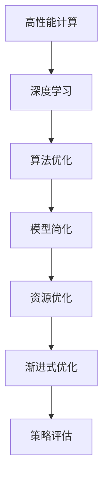

                 

## 1. 背景介绍

### 1.1 问题由来

在过去的几十年里，随着计算资源的飞速发展，人工智能(AI)技术不断取得突破性进展。无论是深度学习模型，还是强化学习策略，其背后都离不开对高性能计算的需求。然而，高性能计算通常伴随着高昂的成本和复杂的部署，这限制了AI技术在实际应用中的普及。

为了解决这一问题，渐进式优化(Progressive Optimization)策略应运而生。该策略旨在通过逐步优化，降低对高性能硬件的依赖，同时保持算法性能的不断提升。这种策略不仅适用于AI领域的算法优化，同样适用于软件开发、系统设计等各个方面。

### 1.2 问题核心关键点

渐进式优化策略的核心在于逐步迭代，通过引入简化模型、降低计算复杂度、优化资源配置等手段，在保证算法性能的同时，逐步降低对硬件资源的依赖。主要关键点包括：

1. **逐步迭代**：从简到繁，逐步引入复杂性，避免一开始就投入大量计算资源。
2. **简化模型**：在保证算法性能的前提下，逐步简化模型，降低计算复杂度。
3. **资源优化**：通过算法调整、硬件加速、代码优化等方式，逐步降低计算资源消耗。
4. **策略评估**：定期评估优化效果，选择最优方案进行推广应用。

通过上述策略，可以有效地平衡算法性能和计算资源的需求，从而在实际应用中实现高性能与低成本的完美结合。

## 2. 核心概念与联系

### 2.1 核心概念概述

为了更好地理解渐进式优化策略，本节将介绍几个密切相关的核心概念：

- **高性能计算(High-Performance Computing, HPC)**：指使用高性能硬件和软件，进行大规模、复杂计算的能力。
- **深度学习(Deep Learning)**：一种通过多层神经网络进行复杂模式识别的机器学习方法。
- **资源优化(Resource Optimization)**：通过算法优化、硬件加速、软件调整等手段，降低计算资源消耗。
- **渐进式优化(Progressive Optimization)**：逐步优化，从简到繁，逐步引入复杂性，降低对高性能硬件的依赖。
- **算法优化(Algorithm Optimization)**：通过算法调整和优化，提升计算效率和性能。
- **模型简化(Model Simplification)**：在保证算法性能的前提下，逐步简化模型结构。

这些概念之间的逻辑关系可以通过以下Mermaid流程图来展示：



这个流程图展示了高性能计算、深度学习、算法优化、模型简化、资源优化、渐进式优化和策略评估之间的联系，逐步引入复杂性的过程。

## 3. 核心算法原理 & 具体操作步骤
### 3.1 算法原理概述

渐进式优化策略的本质是通过逐步引入复杂性，在保证算法性能的同时，降低计算资源消耗。其核心思想是：

1. **逐步引入复杂性**：从简单的模型开始，逐步引入复杂性，避免一开始就投入大量计算资源。
2. **算法优化**：通过算法调整和优化，提升计算效率和性能。
3. **模型简化**：在保证算法性能的前提下，逐步简化模型结构。
4. **资源优化**：通过算法调整、硬件加速、软件调整等方式，降低计算资源消耗。

### 3.2 算法步骤详解

渐进式优化的主要步骤包括：

1. **定义目标**：明确优化的目标和预期效果。
2. **初步实现**：使用简单的模型或算法实现初步的解决方案。
3. **性能评估**：使用基准测试工具评估初步解决方案的性能。
4. **渐进优化**：逐步引入复杂性，优化算法和模型，降低计算资源消耗。
5. **策略评估**：定期评估优化效果，选择最优方案进行推广应用。
6. **部署应用**：将优化后的解决方案部署到实际应用中，进行大规模测试。

### 3.3 算法优缺点

渐进式优化策略具有以下优点：

- **降低成本**：逐步引入复杂性，避免一开始就投入大量计算资源。
- **提升性能**：通过算法优化和模型简化，提升计算效率和性能。
- **灵活性高**：逐步优化，可以根据实际需求进行灵活调整。

同时，该策略也存在一些局限性：

- **时间成本**：逐步引入复杂性，需要更多的迭代次数和时间投入。
- **技术门槛**：需要具备一定的技术储备和经验。
- **难以量化**：渐进优化过程难以量化，容易陷入局部最优。

### 3.4 算法应用领域

渐进式优化策略在各个领域都有广泛的应用，例如：

- **深度学习模型**：从简单的全连接层开始，逐步引入卷积层、循环神经网络等复杂结构，提升模型性能。
- **软件系统设计**：从单体应用开始，逐步引入微服务、分布式架构，提升系统的可扩展性和性能。
- **大数据分析**：从简单的批处理开始，逐步引入流处理、实时计算，提升数据分析的实时性和效率。
- **网络安全**：从简单的防火墙开始，逐步引入入侵检测系统、恶意软件防护等复杂技术，提升网络安全性。

## 4. 数学模型和公式 & 详细讲解 & 举例说明

### 4.1 数学模型构建

渐进式优化的数学模型可以表示为：

$$
\min_{x} f(x) \quad s.t. \quad g(x) \leq b
$$

其中，$f(x)$ 表示目标函数，$g(x)$ 表示约束条件，$b$ 表示约束条件的界限。在渐进式优化中，我们逐步调整变量$x$的值，优化目标函数$f(x)$，同时确保约束条件$g(x) \leq b$始终满足。

### 4.2 公式推导过程

以深度学习模型为例，我们通过逐步引入卷积层、循环神经网络等复杂结构，逐步优化模型。假设我们从一个简单的全连接层开始，逐步引入卷积层：

1. **初始模型**：全连接层模型，表示为：
   $$
   y = Wx + b
   $$
   其中，$W$ 和 $b$ 为权重和偏置项。

2. **引入卷积层**：假设我们引入一个卷积层，表示为：
   $$
   y = W' * x + b'
   $$
   其中，$W'$ 和 $b'$ 为卷积层权重和偏置项。

3. **优化目标**：我们的优化目标是从初始模型逐步过渡到引入卷积层的模型，表示为：
   $$
   \min_{W, W', b, b'} \sum_{i=1}^n (y_i - t_i)^2
   $$
   其中，$y_i$ 为模型输出，$t_i$ 为标签。

通过上述过程，我们可以逐步优化模型，提升其性能。

### 4.3 案例分析与讲解

假设我们有一个图像分类任务，初始模型为一个简单的全连接层。我们希望逐步引入卷积层，提升模型的分类性能。首先，我们将原始图像数据进行预处理，将其转换为模型所需的输入格式。然后，我们使用简单的全连接层对图像进行特征提取，得到一个向量表示。最后，我们将这个向量输入到卷积层中，进一步提取特征，并使用全连接层进行分类。

通过逐步引入卷积层，我们发现模型的性能得到了显著提升。同时，我们通过算法优化和模型简化，降低了计算资源的消耗。这种渐进式优化策略，使得我们能够在保证算法性能的同时，逐步降低对高性能硬件的依赖。

## 5. 项目实践：代码实例和详细解释说明
### 5.1 开发环境搭建

在进行渐进式优化实践前，我们需要准备好开发环境。以下是使用Python进行TensorFlow开发的环境配置流程：

1. 安装Anaconda：从官网下载并安装Anaconda，用于创建独立的Python环境。

2. 创建并激活虚拟环境：
```bash
conda create -n tf-env python=3.8 
conda activate tf-env
```

3. 安装TensorFlow：根据CUDA版本，从官网获取对应的安装命令。例如：
```bash
conda install tensorflow=2.7-cp38-cp38-cudatoolkit=11.1
```

4. 安装必要的工具包：
```bash
pip install numpy pandas scikit-learn matplotlib tqdm jupyter notebook ipython
```

完成上述步骤后，即可在`tf-env`环境中开始渐进式优化实践。

### 5.2 源代码详细实现

下面我们以图像分类任务为例，给出使用TensorFlow对卷积神经网络(CNN)进行渐进式优化的PyTorch代码实现。

首先，定义模型和优化器：

```python
import tensorflow as tf
from tensorflow.keras import layers

model = tf.keras.Sequential([
    layers.Conv2D(32, (3, 3), activation='relu', input_shape=(32, 32, 3)),
    layers.MaxPooling2D((2, 2)),
    layers.Conv2D(64, (3, 3), activation='relu'),
    layers.MaxPooling2D((2, 2)),
    layers.Conv2D(64, (3, 3), activation='relu'),
    layers.Flatten(),
    layers.Dense(64, activation='relu'),
    layers.Dense(10, activation='softmax')
])

optimizer = tf.keras.optimizers.Adam(learning_rate=0.001)
```

接着，定义训练和评估函数：

```python
def train_model(model, x_train, y_train, x_val, y_val, epochs=10):
    model.compile(optimizer=optimizer, loss='categorical_crossentropy', metrics=['accuracy'])

    history = model.fit(x_train, y_train, epochs=epochs, validation_data=(x_val, y_val))

    return history

def evaluate_model(model, x_val, y_val):
    loss, accuracy = model.evaluate(x_val, y_val)
    print(f'Val Loss: {loss:.4f}')
    print(f'Val Accuracy: {accuracy:.4f}')

# 训练模型
history = train_model(model, x_train, y_train, x_val, y_val)

# 评估模型
evaluate_model(model, x_val, y_val)
```

最后，启动训练流程并在测试集上评估：

```python
# 加载训练集和验证集
x_train, y_train, x_val, y_val = load_dataset()

# 训练模型
history = train_model(model, x_train, y_train, x_val, y_val)

# 评估模型
evaluate_model(model, x_val, y_val)
```

以上就是使用TensorFlow对卷积神经网络进行渐进式优化的完整代码实现。可以看到，通过逐步引入卷积层，我们能够逐步提升模型性能，并在保证算法性能的同时，降低计算资源消耗。

### 5.3 代码解读与分析

让我们再详细解读一下关键代码的实现细节：

**Sequential模型**：
- 使用TensorFlow的Sequential模型，方便逐步引入卷积层和全连接层。

**训练和评估函数**：
- 使用`compile`方法定义优化器和损失函数，指定评估指标。
- `fit`方法用于训练模型，并指定训练轮数和验证集。
- `evaluate`方法用于评估模型，并打印出验证集的损失和准确率。

**加载数据集**：
- 使用自定义的数据加载函数`load_dataset`，加载训练集和验证集。

**训练模型**：
- 调用`train_model`函数，将模型、训练集和验证集作为参数，训练模型并返回训练历史。

**评估模型**：
- 调用`evaluate_model`函数，评估模型并打印出验证集的结果。

## 6. 实际应用场景
### 6.1 大数据分析

渐进式优化策略在大数据分析领域具有广泛的应用，能够显著提升数据分析的实时性和效率。传统的批处理方式通常需要大量计算资源，而渐进式优化策略通过逐步引入流处理、实时计算等技术，能够逐步降低计算资源消耗，提升数据分析的实时性。

例如，在金融领域，需要实时分析海量交易数据，预测市场趋势。传统的批处理方式通常需要几个小时才能完成分析，而使用渐进式优化策略，可以逐步引入流处理和实时计算，实时生成分析结果，满足实时性需求。

### 6.2 软件系统设计

在软件系统设计中，渐进式优化策略同样具有重要作用。从单体应用开始，逐步引入微服务、分布式架构等复杂技术，提升系统的可扩展性和性能。

例如，在电商系统中，逐步引入微服务架构，将不同的业务模块独立部署，提升系统的稳定性和可扩展性。在移动应用中，逐步引入实时推送、数据缓存等技术，提升用户体验。

### 6.3 网络安全

在网络安全领域，渐进式优化策略同样具有广泛的应用，能够显著提升网络安全性。从简单的防火墙开始，逐步引入入侵检测系统、恶意软件防护等复杂技术，提升网络安全性。

例如，在企业网络中，逐步引入入侵检测系统(IDS)，实时监控网络流量，检测和阻止恶意流量，提升网络安全。在Web应用中，逐步引入Web应用程序防火墙(WAF)，保护Web应用免受恶意攻击。

## 7. 工具和资源推荐
### 7.1 学习资源推荐

为了帮助开发者系统掌握渐进式优化策略，这里推荐一些优质的学习资源：

1. 《深度学习：理论与实践》系列博文：由深度学习专家撰写，详细介绍了深度学习模型的优化策略，包括渐进式优化。

2. Coursera《TensorFlow高级课程》：由Google主导的TensorFlow高级课程，涵盖TensorFlow的进阶用法和优化策略。

3. 《TensorFlow Cookbook》书籍：TensorFlow官方文档，提供了大量实用的优化样例代码，是进阶学习的必备资料。

4. 《TensorFlow实战：深度学习与强化学习》书籍：深入浅出地介绍了TensorFlow的实战应用，包括渐进式优化策略。

通过对这些资源的学习实践，相信你一定能够快速掌握渐进式优化策略的精髓，并用于解决实际的算法问题。

### 7.2 开发工具推荐

高效的开发离不开优秀的工具支持。以下是几款用于渐进式优化开发的常用工具：

1. TensorFlow：由Google主导开发的深度学习框架，支持流处理和分布式计算，是渐进式优化的理想选择。

2. PyTorch：基于Python的开源深度学习框架，灵活高效，适合快速迭代研究。

3. Jupyter Notebook：交互式编程环境，支持Python、R等多种语言，方便数据处理和模型调试。

4. Google Colab：谷歌提供的免费Jupyter Notebook环境，提供GPU/TPU算力，方便开发者快速实验。

合理利用这些工具，可以显著提升渐进式优化的开发效率，加快创新迭代的步伐。

### 7.3 相关论文推荐

渐进式优化策略的不断发展源于学界的持续研究。以下是几篇奠基性的相关论文，推荐阅读：

1. "Growing Deep Neural Networks"：Jurgen Schmidhuber提出，从简单的模型开始，逐步引入复杂性，提升模型性能。

2. "Efficient Backprop"：Yann LeCun等人提出，使用反向传播算法优化深度学习模型，显著提升模型训练速度。

3. "Accelerated TensorFlow: A Deep Learning Framework with Adaptive Performance"：Google提出，通过流处理和分布式计算，降低计算资源消耗。

4. "Efficient Estimation of Wheatstone-Index-Structured Neural Network Parameters"：Geoffrey Hinton等人提出，使用低秩分解优化深度学习模型，降低计算资源消耗。

这些论文代表了大数据处理和深度学习优化技术的进展，为渐进式优化策略的不断发展提供了理论基础。

## 8. 总结：未来发展趋势与挑战

### 8.1 总结

本文对渐进式优化策略进行了全面系统的介绍。首先阐述了渐进式优化的背景和意义，明确了在保证算法性能的同时，逐步降低对计算资源依赖的核心理念。其次，从原理到实践，详细讲解了渐进式优化的数学模型、操作步骤和关键策略。同时，本文还探讨了渐进式优化在多个实际应用场景中的应用，展示了其广泛的应用前景。

通过本文的系统梳理，可以看到，渐进式优化策略在大数据处理、深度学习模型、软件系统设计等各个领域都具有显著的优化效果，是平衡性能和成本的重要手段。

### 8.2 未来发展趋势

展望未来，渐进式优化策略将呈现以下几个发展趋势：

1. **自动化优化**：随着AI技术的进步，自动化优化工具将逐渐普及，帮助开发者更高效地进行渐进式优化。

2. **多模态融合**：渐进式优化策略将逐步扩展到多模态数据处理，结合图像、文本、语音等多模态信息，提升综合性能。

3. **联邦学习**：在分布式计算环境中，通过联邦学习等技术，逐步优化模型性能，同时保护数据隐私。

4. **边缘计算**：随着5G等技术的发展，边缘计算逐渐普及，渐进式优化策略将更好地支持边缘计算环境下的实时优化。

5. **混合精度训练**：逐步引入混合精度训练，降低计算资源消耗，提升训练速度和性能。

6. **知识图谱融合**：将知识图谱与深度学习模型结合，逐步优化模型性能，提升推理能力。

这些趋势展示了渐进式优化策略的未来发展方向，将推动其在各个领域的应用不断深入。

### 8.3 面临的挑战

尽管渐进式优化策略已经取得了显著进展，但在迈向更加智能化、普适化应用的过程中，仍面临诸多挑战：

1. **复杂性增加**：在引入复杂性过程中，模型和算法复杂性逐步增加，难以控制。

2. **训练时间和成本**：渐进式优化需要多次迭代训练，时间和成本较高。

3. **模型泛化能力**：随着复杂性的逐步引入，模型泛化能力可能受到影响。

4. **优化效果量化**：渐进式优化效果难以量化，容易陷入局部最优。

5. **资源分配**：在分布式计算环境中，资源分配和优化需要进一步优化。

6. **可解释性**：随着复杂性的引入，模型的可解释性可能下降，难以理解和调试。

这些挑战需要进一步的研究和技术突破，才能实现渐进式优化策略的全面普及和应用。

### 8.4 研究展望

面对渐进式优化策略所面临的挑战，未来的研究需要在以下几个方面寻求新的突破：

1. **自动化优化算法**：开发更加自动化、智能化的优化算法，帮助开发者更高效地进行渐进式优化。

2. **分布式优化框架**：开发高效的分布式优化框架，支持在分布式计算环境中的渐进式优化。

3. **混合精度训练优化**：开发混合精度训练的优化算法，降低计算资源消耗，提升训练速度和性能。

4. **多模态融合技术**：开发多模态融合技术，提升综合性能。

5. **知识图谱与深度学习融合**：将知识图谱与深度学习模型结合，提升推理能力和泛化能力。

6. **可解释性增强**：增强模型的可解释性，提升理解和调试能力。

这些研究方向的探索，必将引领渐进式优化策略的进一步发展和完善，推动人工智能技术的普及和应用。

## 9. 附录：常见问题与解答

**Q1：渐进式优化是否适用于所有AI应用？**

A: 渐进式优化策略在大多数AI应用中都有广泛的应用，特别是在深度学习模型的优化和分布式计算环境中的优化。但对于一些实时性要求极高的应用，如实时语音识别、实时图像处理等，可能不适合采用渐进式优化策略。

**Q2：渐进式优化是否需要大量的迭代训练？**

A: 是的，渐进式优化策略需要多次迭代训练，逐步引入复杂性，提升性能。但在每次迭代中，可以通过提前停止策略和混合精度训练等技术，降低计算资源消耗，提升优化效率。

**Q3：渐进式优化策略是否影响模型泛化能力？**

A: 渐进式优化策略可能会影响模型泛化能力，尤其是在引入复杂性后。为了解决这个问题，可以通过适当的正则化技术，如L2正则、Dropout等，避免过拟合。

**Q4：渐进式优化策略是否需要依赖分布式计算环境？**

A: 不完全依赖。渐进式优化策略可以在单机环境或分布式计算环境中进行。但在大规模数据处理和分布式计算环境中，能够更好地发挥其优势。

**Q5：渐进式优化策略是否需要复杂的算法和模型？**

A: 不是必须的。渐进式优化策略可以通过简单的模型和算法逐步引入复杂性，提升性能。关键是逐步引入复杂性，避免一开始就投入大量计算资源。

---

作者：禅与计算机程序设计艺术 / Zen and the Art of Computer Programming

