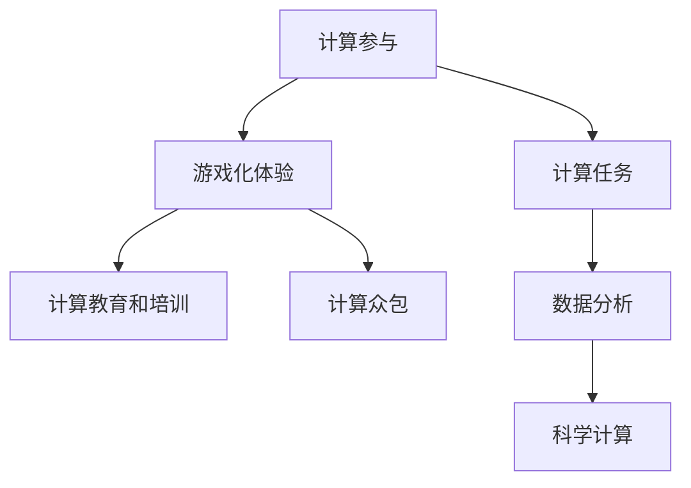
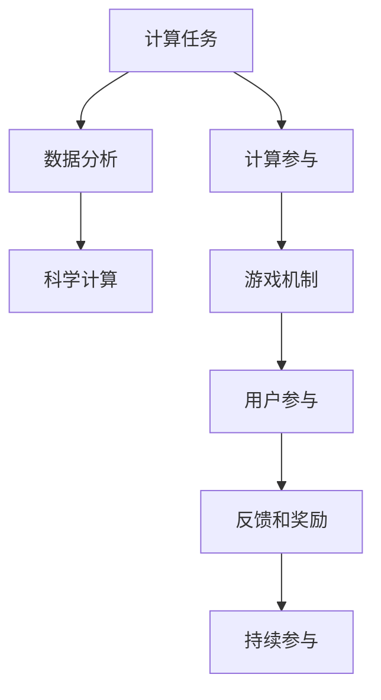

                 

# 游戏化体验：让参与人类计算乐在其中

## 1. 背景介绍

随着计算机技术的不断进步，人工智能在各行各业的应用越来越广泛。然而，让人类参与计算的体验却始终是一个挑战。如何让普通人也能轻松地参与到复杂计算中，提升计算的普及性和便利性，成为了一个值得深入探讨的话题。本文将探讨游戏化体验在计算参与中的应用，提出一系列将游戏机制融入计算任务的设计方案，并分析其潜在优势与局限。

## 2. 核心概念与联系

### 2.1 核心概念概述

本文将介绍几个与计算参与和游戏化体验相关的核心概念：

- **计算参与（Computational Participation）**：指让普通人通过编程、计算等方式，参与到数据处理、科学计算等复杂任务中，提升计算能力和科研贡献度。
- **游戏化体验（Gamification）**：指将游戏机制、元素和设计理念应用到非游戏场景中，提升用户体验和参与度。
- **计算教育和培训（Computational Education and Training）**：通过游戏化体验，让教育培训更加生动有趣，提升学习效果。
- **计算众包（Computational Crowdsourcing）**：通过游戏化体验，将计算任务分配给大量用户，完成大规模计算任务。

这些概念之间的逻辑关系可以通过以下Mermaid流程图来展示：



这个流程图展示了一系列概念之间的联系：计算参与的目标是通过游戏化体验，推动计算教育和培训及计算众包。

### 2.2 核心概念原理和架构的 Mermaid 流程图

由于篇幅限制，这里仅展示核心概念原理和架构的部分示意，重点关注计算参与和游戏化体验的合流。



在这个过程中，计算任务通过数据分析和科学计算逐步转化为实际的应用场景，计算参与将游戏机制应用到这些场景中，用户通过参与互动获取反馈和奖励，最终形成持续参与的闭环。

## 3. 核心算法原理 & 具体操作步骤

### 3.1 算法原理概述

游戏化体验的核心在于通过奖励、竞争、挑战等元素，激发用户的参与兴趣和积极性。而计算参与则要求用户具备一定的计算能力和知识，通过互动和挑战，逐步提升计算能力和解决复杂问题。将这两种需求结合，可以设计出既有趣又具有教育意义的游戏化计算任务。

### 3.2 算法步骤详解

设计游戏化体验的计算任务主要包括以下步骤：

1. **任务设计**：根据具体的应用场景和目标，设计出有趣且富有挑战性的计算任务。例如，数据可视化、模式识别、科学计算等。
2. **用户交互界面**：开发易于理解和操作的用户界面，使用户能轻松上手。
3. **游戏机制引入**：在任务中加入奖励机制、排行榜、排行榜等游戏元素，激发用户参与和竞争。
4. **持续参与和反馈**：通过不断提供反馈和奖励，鼓励用户持续参与计算任务，并在过程中不断学习和提升。
5. **数据收集与分析**：收集用户参与数据，进行分析和改进，提升任务设计和用户体验。

### 3.3 算法优缺点

**优点**：
- 提升用户计算参与度和学习效果。通过游戏化体验，让计算任务变得有趣和吸引人，提升用户的持续参与和积极学习。
- 大规模计算任务。通过游戏化机制，将计算任务分配给大量用户，完成大规模计算任务，提高计算效率。
- 促进计算教育和培训。通过有趣的游戏化体验，提升学习效果和知识传播，推动计算教育和培训的普及。

**缺点**：
- 设计复杂度。游戏化体验的设计和实现需要高度专业性和创意，设计不当可能适得其反。
- 用户动机问题。游戏化元素可能在短期内吸引用户参与，但长期持续参与和效果提升仍需依赖实际任务的价值和挑战性。
- 资源消耗。游戏化体验可能带来额外的开发和运营成本，需要平衡资源投入和产出。

### 3.4 算法应用领域

游戏化体验的计算参与可以应用于以下几个主要领域：

- **教育和培训**：如编程入门、数据分析、科学计算等，提升学习效果和知识传播。
- **科研和学术**：通过计算众包，完成大规模数据处理和科学计算任务。
- **企业应用**：如客户数据分析、市场预测等，提升决策效率和数据驱动能力。
- **公共服务**：如社区数据收集和分析，提升公共服务效率和参与度。

## 4. 数学模型和公式 & 详细讲解 & 举例说明

### 4.1 数学模型构建

为了更好地理解游戏化体验的计算参与，我们可以构建一个简单的数学模型，以编程为例：

设用户完成任务所需的时间为 $T$，完成任务的难度为 $D$，用户完成任务的积极性为 $I$，任务奖励为 $R$，用户持续参与的概率为 $P$。根据游戏化体验的设计原则，有如下关系：

$$
T = f(D) \quad \text{(任务难度与完成时间的关系)}
$$

$$
I = g(R) \quad \text{(任务奖励与用户积极性关系)}
$$

$$
P = h(I) \quad \text{(用户积极性对持续参与概率的影响)}
$$

其中，$f$、$g$ 和 $h$ 分别为非线性函数，表示任务难度和完成时间、任务奖励和用户积极性、用户积极性对持续参与概率的复杂影响。

### 4.2 公式推导过程

根据上述模型，我们可以推导出影响用户持续参与的关键因素：

1. **任务难度和完成时间**：当任务难度 $D$ 增加时，完成任务所需的时间 $T$ 增加，用户积极性 $I$ 降低，从而影响持续参与概率 $P$。
2. **任务奖励**：当任务奖励 $R$ 增加时，用户积极性 $I$ 提升，进而提高持续参与概率 $P$。
3. **用户积极性**：用户积极性 $I$ 对持续参与概率 $P$ 有直接的影响，高积极性促进持续参与。

### 4.3 案例分析与讲解

以一个简单的编程任务为例，假设任务难度 $D=10$，完成任务所需时间 $T=2$ 小时，用户积极性 $I=0.8$，任务奖励 $R=10$ 元。根据模型推导，有：

$$
T = 10 + 2 \quad \text{(任务难度与完成时间)}
$$

$$
I = 0.8 \times 10 \quad \text{(任务奖励与用户积极性)}
$$

$$
P = 0.8^0.8 \approx 0.51 \quad \text{(用户积极性对持续参与概率)}
$$

这意味着，用户有约 51% 的概率持续参与类似的任务，这可以通过不断优化任务难度、奖励和用户积极性等参数来进一步提升。

## 5. 项目实践：代码实例和详细解释说明

### 5.1 开发环境搭建

要进行游戏化体验的计算参与开发，首先需要搭建好开发环境。以下是一些必要的工具和库：

1. **Python**：作为主要编程语言，Python 生态丰富，易于上手。
2. **Jupyter Notebook**：用于开发和调试游戏化任务，方便展示和分享。
3. **Flask**：用于搭建 Web 服务，方便用户访问和参与。
4. **OpenAI Gym**：用于开发和测试游戏机制，提供丰富的游戏化工具。

### 5.2 源代码详细实现

下面是一个简单的游戏化编程任务示例，使用 Python 和 Jupyter Notebook 实现：

```python
# 导入必要的库
import gym
import numpy as np

# 创建游戏环境
env = gym.make('SimpleGame-v0')

# 定义用户完成任务所需时间
def task_time(difficulty):
    return 10 + 2 * difficulty

# 定义任务难度与完成时间的函数
def difficulty_time(env):
    return task_time(env.difficulty)

# 定义任务奖励与用户积极性的函数
def reward_interest(reward):
    return 0.8 * reward

# 定义用户积极性对持续参与概率的函数
def interest_probability(interest):
    return interest ** 0.8

# 定义游戏化任务参与循环
while True:
    # 用户选择任务难度
    difficulty = env.difficulty
    # 计算完成任务所需时间
    time = task_time(difficulty)
    # 模拟完成任务的奖励
    reward = reward_interest(10)
    # 计算用户积极性
    interest = reward_interest(reward)
    # 计算持续参与概率
    probability = interest_probability(interest)
    # 判断是否继续参与
    if np.random.rand() < probability:
        env.update_difficulty()
```

### 5.3 代码解读与分析

在上述代码中，我们使用了 OpenAI Gym 库来模拟一个简单的游戏环境，并通过 Jupyter Notebook 进行展示。代码主要包括以下几个部分：

1. **环境创建**：使用 `gym.make` 创建了一个名为 `SimpleGame-v0` 的游戏环境。
2. **时间计算**：定义了任务难度与完成时间的关系，使用 `task_time` 函数计算。
3. **奖励与积极性**：定义了任务奖励与用户积极性的关系，使用 `reward_interest` 函数计算。
4. **持续参与概率**：定义了用户积极性对持续参与概率的影响，使用 `interest_probability` 函数计算。
5. **参与循环**：使用一个无限循环，用户选择任务难度，计算完成任务所需时间、奖励和积极性，最后判断是否继续参与。

### 5.4 运行结果展示

通过上述代码，我们可以观察到用户参与的动态过程，并根据结果调整任务难度、奖励和积极性等参数，不断优化游戏化体验。

## 6. 实际应用场景

### 6.1 教育培训

游戏化体验在教育培训中的应用极为广泛，通过将计算任务融入有趣的游戏元素，可以大幅提升学习效果。例如，让学生通过编程解决数学问题、数据处理等任务，不仅能提升其计算能力，还能激发学习兴趣。

### 6.2 科研和学术

在科研和学术领域，游戏化体验的应用同样重要。例如，通过计算众包方式，完成大规模数据处理和科学计算任务，极大地提升研究效率。

### 6.3 企业应用

企业应用中，游戏化体验可以用于客户数据分析、市场预测等场景，提升决策效率和数据驱动能力。

### 6.4 公共服务

在公共服务领域，游戏化体验可以用于社区数据收集和分析，提升公共服务效率和参与度。

## 7. 工具和资源推荐

### 7.1 学习资源推荐

要深入了解游戏化体验的计算参与，以下是一些推荐的学习资源：

1. **《游戏化思维》（Gamification by Design）**：讲述游戏化设计的原理和实践，提供了丰富的案例和工具。
2. **《编程游戏化：编程教育新趋势》（Programming by Design）**：介绍如何通过游戏化元素提升编程教学效果。
3. **Coursera 课程**：提供了许多关于游戏化设计和计算参与的在线课程，如《游戏化设计与开发》。
4. **Google Developers 资源**：包括许多游戏化设计和开发的最佳实践和工具，适合开发者学习和应用。

### 7.2 开发工具推荐

游戏化体验的计算参与开发需要一系列工具支持，以下是一些推荐的开发工具：

1. **Jupyter Notebook**：用于开发和调试游戏化任务，方便展示和分享。
2. **OpenAI Gym**：提供丰富的游戏化工具，适合测试和优化游戏机制。
3. **Flask**：用于搭建 Web 服务，方便用户访问和参与。
4. **Python**：作为主要编程语言，Python 生态丰富，易于上手。
5. **Numpy**：用于数值计算和数据分析。

### 7.3 相关论文推荐

要深入了解游戏化体验的计算参与，以下是一些推荐的相关论文：

1. **《游戏化设计与开发》（Gamification Design and Development）**：探讨游戏化设计的原理和实践，提供了丰富的案例和工具。
2. **《编程游戏化：编程教育新趋势》（Programming by Design）**：介绍如何通过游戏化元素提升编程教学效果。
3. **《计算教育和培训》（Computational Education and Training）**：探讨计算教育和培训的理论与实践，强调游戏化体验的重要性。
4. **《计算众包》（Computational Crowdsourcing）**：介绍计算众包的概念和应用，强调其在大规模计算任务中的优势。

## 8. 总结：未来发展趋势与挑战

### 8.1 总结

本文探讨了游戏化体验在计算参与中的应用，提出了一系列将游戏机制融入计算任务的设计方案，并分析其潜在优势与局限。通过构建数学模型和代码实例，我们展示了游戏化体验如何提升用户参与度和学习效果，并应用于教育培训、科研和学术、企业应用和公共服务等多个领域。

### 8.2 未来发展趋势

展望未来，游戏化体验的计算参与将呈现以下几个发展趋势：

1. **技术进步**：随着人工智能和计算机视觉技术的发展，游戏化体验将更加生动和有趣，提升用户参与度。
2. **跨学科融合**：游戏化体验将与更多学科领域进行融合，如教育、心理学、社会学等，推动跨学科研究和发展。
3. **个性化定制**：通过大数据和机器学习技术，实现个性化游戏化体验，提升用户参与效果。
4. **全球化推广**：游戏化体验将推动计算参与的全球化推广，提升全球范围内的计算能力和科研贡献度。

### 8.3 面临的挑战

尽管游戏化体验的计算参与前景广阔，但在实际应用中仍面临一些挑战：

1. **设计与实现复杂度**：游戏化体验的设计和实现需要高度专业性和创意，设计不当可能适得其反。
2. **用户动机问题**：游戏化元素可能在短期内吸引用户参与，但长期持续参与和效果提升仍需依赖实际任务的价值和挑战性。
3. **资源消耗**：游戏化体验可能带来额外的开发和运营成本，需要平衡资源投入和产出。

### 8.4 研究展望

面向未来，游戏化体验的计算参与研究需要从以下几个方向进行深入探索：

1. **游戏化设计理论**：进一步研究和完善游戏化设计的理论和模型，提供更科学和系统的设计指导。
2. **数据驱动优化**：通过大数据和机器学习技术，实现游戏化体验的动态优化，提升用户参与效果。
3. **跨学科应用**：推动游戏化体验与其他学科领域的深度融合，探索更多的应用场景和潜力。
4. **伦理与安全**：研究游戏化体验的伦理和安全问题，确保其应用的社会责任和安全性。

## 9. 附录：常见问题与解答

**Q1: 游戏化体验在计算参与中的主要优势是什么？**

A: 游戏化体验在计算参与中的主要优势包括：
1. **提升用户参与度**：通过有趣的游戏元素，激发用户参与兴趣和积极性。
2. **学习效果显著**：通过互动和挑战，提升用户的学习效果和计算能力。
3. **大规模计算任务**：通过游戏化机制，将计算任务分配给大量用户，完成大规模计算任务。

**Q2: 如何设计高效的游戏化体验？**

A: 设计高效的游戏化体验需要考虑以下几个关键因素：
1. **任务难度与完成时间**：合理设定任务难度和完成时间，避免过于简单或复杂。
2. **任务奖励与用户积极性**：设计合理的任务奖励机制，激发用户积极性。
3. **用户积极性对持续参与概率**：根据用户积极性调整持续参与概率，保持用户持续参与。
4. **游戏机制与用户体验**：引入有趣的游戏机制，提升用户体验和参与感。

**Q3: 游戏化体验在教育培训中的应用有哪些？**

A: 游戏化体验在教育培训中的应用包括：
1. **编程入门**：通过编程任务和游戏元素，提升学生的编程兴趣和能力。
2. **数据分析**：通过数据分析任务，提升学生的计算能力和逻辑思维能力。
3. **科学计算**：通过科学计算任务，提升学生的科学素养和计算能力。

**Q4: 游戏化体验在科研和学术中的应用有哪些？**

A: 游戏化体验在科研和学术中的应用包括：
1. **数据处理**：通过数据处理任务，提升科研人员的数据处理能力。
2. **科学计算**：通过科学计算任务，提升科研人员的计算能力和科研效率。
3. **科研合作**：通过游戏化合作任务，提升科研团队的协作能力和研究效果。

**Q5: 游戏化体验在企业应用中的应用有哪些？**

A: 游戏化体验在企业应用中的应用包括：
1. **客户数据分析**：通过数据分析任务，提升客户分析能力。
2. **市场预测**：通过市场预测任务，提升市场分析能力和决策效率。
3. **运营优化**：通过运营优化任务，提升企业运营效率和管理能力。

---

作者：禅与计算机程序设计艺术 / Zen and the Art of Computer Programming

