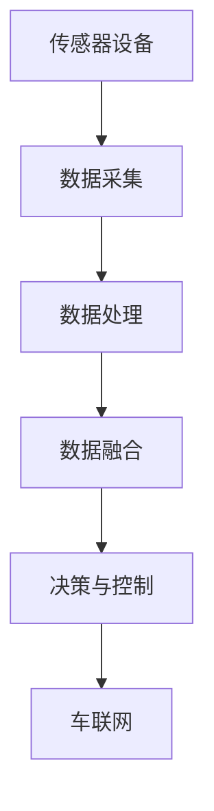

                 

## 1. 背景介绍

### 1.1 问题由来

物联网（IoT）作为信息技术与物理世界结合的重要技术，正在全面渗透到社会的各个领域，其中包括车联网（Connected Car Networking）。车联网的最终目标是实现车辆与基础设施、车辆与车辆、车辆与行人之间的智能互联，从而提升交通安全和效率，改善用户体验。

传感器设备在车联网中扮演着至关重要的角色，负责采集车辆的各种状态信息，如速度、位置、环境、物理特性等，以及驾驶员的行为和健康状态。传感器数据是车联网中决策和控制的基础。然而，现有传感器设备种类繁多、标准不一、数据格式多样，数据整合难度大。

面对这一问题，本文将探讨如何将多种传感器设备在车联网中有效集成，以实现智能互联和控制。

### 1.2 问题核心关键点

车联网的集成关键点包括：

- 传感器设备的兼容性：不同设备、不同厂商的标准、协议、数据格式各异。
- 数据的高效采集：如何快速、准确地采集海量数据，并进行有效处理。
- 数据融合与分析：如何将来自不同设备的数据进行融合，并从中提取有价值的信息。
- 决策支持与智能控制：如何利用数据进行智能决策和控制，提升车辆和交通系统的性能。

本文旨在从以上几个关键点出发，通过详细解析和实验展示，探讨车联网中传感器设备的集成技术和应用。

## 2. 核心概念与联系

### 2.1 核心概念概述

在车联网中，传感器设备的集成主要涉及以下核心概念：

- **物联网(IoT)**：利用网络技术将传感器设备接入互联网，实现实时数据采集和远程控制。
- **传感器设备**：用于感知环境信息的各种设备，如GPS、激光雷达、摄像头等。
- **数据采集与处理**：通过传感器设备采集数据，并使用各种算法进行处理和分析。
- **数据融合**：将来自不同设备的多源数据进行整合，消除冗余，消除噪声，提升数据质量。
- **决策与控制**：基于数据融合的结果，进行智能决策和控制，以实现车辆和交通系统的优化。
- **车联网**：通过通信网络将车辆、基础设施、用户进行连接，实现车与车、车与基础设施之间的智能互动。

这些核心概念之间存在着密切的联系。例如，传感器设备的数据采集是物联网的起点，数据融合是决策与控制的基础，车联网则是整个系统的框架。

### 2.2 核心概念原理和架构的 Mermaid 流程图



此流程图展示了车联网中传感器设备集成的基本流程：传感器设备采集数据后，经数据处理和融合，最后支持智能决策与控制，实现车联网的智能互联。

## 3. 核心算法原理 & 具体操作步骤

### 3.1 算法原理概述

车联网中传感器设备的集成主要涉及以下算法原理：

- **数据采集与预处理算法**：用于数据采集与预处理，包括传感器数据格式转换、噪声过滤、数据校验等。
- **数据融合算法**：将来自不同传感器设备的数据进行融合，消除冗余，消除噪声，提升数据质量。
- **智能决策与控制算法**：基于融合后的数据，进行智能决策与控制，优化车辆性能和交通系统。

### 3.2 算法步骤详解

#### 3.2.1 数据采集与预处理

1. **传感器选择**：根据应用需求，选择适合的传感器设备，如GPS、激光雷达、摄像头等。
2. **数据采集**：通过传感器设备实时采集车辆的状态信息，如速度、位置、环境、物理特性等。
3. **数据预处理**：对采集到的数据进行格式转换、噪声过滤、数据校验等预处理步骤，确保数据质量。

#### 3.2.2 数据融合

1. **数据同步**：确保来自不同传感器设备的数据时间同步。
2. **数据校正**：通过校准算法消除设备之间的误差。
3. **数据融合**：使用加权平均、卡尔曼滤波等算法，将来自不同传感器设备的数据进行融合，提升数据精度。

#### 3.2.3 智能决策与控制

1. **数据存储与检索**：将融合后的数据存储到数据库中，并实现快速检索。
2. **智能决策**：基于融合后的数据，使用决策树、支持向量机、神经网络等算法进行智能决策。
3. **控制策略**：根据智能决策的结果，制定相应的控制策略，如自动驾驶、路径规划、预警提醒等。

### 3.3 算法优缺点

#### 3.3.1 优点

- **实时性强**：通过传感器实时采集数据，实现实时决策与控制。
- **融合效果高**：多种传感器数据进行融合，提升数据精度。
- **适应性强**：能够适应不同传感器设备的标准、协议、数据格式。

#### 3.3.2 缺点

- **复杂度高**：数据采集、处理、融合、决策等步骤复杂，需要大量计算资源。
- **设备成本高**：多种传感器设备成本较高，增加系统成本。
- **安全性问题**：传感器数据容易被攻击，影响系统安全。

### 3.4 算法应用领域

车联网中传感器设备的集成技术，广泛应用在智能驾驶、自动泊车、交通信号控制、车辆监控等领域。

## 4. 数学模型和公式 & 详细讲解 & 举例说明

### 4.1 数学模型构建

在车联网中，传感器数据的采集和处理可以建立如下数学模型：

设传感器设备为 $s$，时间为 $t$，采集的数据为 $x_s(t)$。则传感器数据可以表示为：

$$
x_s(t) = \left\{
\begin{aligned}
& \text{速度} && s=1 \\
& \text{位置} && s=2 \\
& \text{环境} && s=3 \\
& \text{物理特性} && s=4 \\
\end{aligned}
\right.
$$

其中，速度、位置、环境和物理特性分别对应不同的传感器设备。

### 4.2 公式推导过程

#### 4.2.1 数据采集与预处理

设原始数据为 $x_s(t)$，预处理后的数据为 $x_s'(t)$。预处理过程可以表示为：

$$
x_s'(t) = f(x_s(t))
$$

其中，$f(x_s(t))$ 表示预处理算法，如格式转换、噪声过滤、数据校验等。

#### 4.2.2 数据融合

设来自不同传感器设备的数据为 $x_s(t)$，融合后的数据为 $x'(t)$。数据融合过程可以表示为：

$$
x'(t) = \omega_s \cdot x_s(t)
$$

其中，$\omega_s$ 表示权重，用于加权平均或卡尔曼滤波等算法。

#### 4.2.3 智能决策与控制

设智能决策的结果为 $y(t)$，控制策略为 $u(t)$。智能决策与控制过程可以表示为：

$$
y(t) = g(x'(t))
$$

$$
u(t) = h(y(t))
$$

其中，$g(x'(t))$ 表示智能决策算法，如决策树、支持向量机、神经网络等；$h(y(t))$ 表示控制策略算法，如自动驾驶、路径规划、预警提醒等。

### 4.3 案例分析与讲解

以自动驾驶系统为例，分析其传感器数据采集、处理、融合和决策控制过程。

#### 4.3.1 数据采集

自动驾驶系统采集的传感器数据包括摄像头、激光雷达、GPS 等设备的数据。以摄像头为例，采集的数据为：

$$
x_1(t) = \left\{
\begin{aligned}
& \text{道路图像} && t=1 \\
& \text{行人图像} && t=2 \\
& \text{其他障碍物图像} && t=3 \\
\end{aligned}
\right.
$$

#### 4.3.2 数据预处理

对摄像头采集的图像数据进行预处理，如图像去噪、边缘检测、颜色空间转换等。假设预处理后的图像数据为 $x_1'(t)$。

#### 4.3.3 数据融合

将摄像头、激光雷达、GPS 等设备的数据进行融合。设融合后的数据为 $x'(t)$。

设摄像头、激光雷达、GPS 的权重分别为 $\omega_1$、$\omega_2$、$\omega_3$，则数据融合过程为：

$$
x'(t) = \omega_1 \cdot x_1'(t) + \omega_2 \cdot x_2'(t) + \omega_3 \cdot x_3'(t)
$$

#### 4.3.4 智能决策与控制

基于融合后的数据 $x'(t)$，进行智能决策与控制。

1. **决策树**：使用决策树对融合后的数据进行分类，判断车辆周围环境及交通情况。
2. **支持向量机**：使用支持向量机对融合后的数据进行分类，判断车辆是否存在碰撞风险。
3. **神经网络**：使用神经网络对融合后的数据进行预测，优化路径规划和自动驾驶策略。

## 5. 项目实践：代码实例和详细解释说明

### 5.1 开发环境搭建

车联网传感器设备的集成开发环境搭建主要涉及以下步骤：

1. **传感器设备安装与调试**：安装并调试摄像头、激光雷达、GPS 等传感器设备，确保数据采集准确。
2. **数据采集与处理工具**：安装数据采集和处理工具，如 Python 的 Pandas、NumPy 库，实现数据格式转换、噪声过滤、数据校验等。
3. **数据融合工具**：安装数据融合工具，如 Python 的 PyKalman 库，实现卡尔曼滤波等算法。
4. **智能决策与控制工具**：安装智能决策与控制工具，如 Python 的 Scikit-learn、TensorFlow 库，实现决策树、支持向量机、神经网络等算法。

### 5.2 源代码详细实现

以自动驾驶系统为例，给出传感器数据采集、处理、融合和决策控制的代码实现。

#### 5.2.1 数据采集与预处理

```python
import pandas as pd
import numpy as np

# 摄像头采集的数据
x1 = pd.DataFrame(data=[...], columns=['道路图像', '行人图像', '其他障碍物图像'])

# 数据预处理
x1['去噪图像'] = x1['道路图像'].apply(lambda img: preprocess_image(img))
x1['边缘检测图像'] = x1['道路图像'].apply(lambda img: detect_edges(img))
x1['颜色空间转换图像'] = x1['道路图像'].apply(lambda img: convert_color_space(img))
```

#### 5.2.2 数据融合

```python
# 激光雷达采集的数据
x2 = pd.DataFrame(data=[...], columns=['激光雷达数据1', '激光雷达数据2', ...])

# 数据融合
x = pd.concat([x1, x2], axis=1)
x['融合数据'] = x.apply(lambda row: fuse_data(row), axis=1)
```

#### 5.2.3 智能决策与控制

```python
# 智能决策
y = pd.DataFrame(data=[...], columns=['决策结果1', '决策结果2', ...])
y['智能决策结果'] = y.apply(lambda row: smart_decision(row), axis=1)

# 智能控制
u = pd.DataFrame(data=[...], columns=['控制策略1', '控制策略2', ...])
u['智能控制策略'] = u.apply(lambda row: intelligent_control(row), axis=1)
```

### 5.3 代码解读与分析

通过以上代码，可以清晰地看到自动驾驶系统传感器数据采集、处理、融合和决策控制的实现过程。

#### 5.3.1 数据采集

代码中首先定义了摄像头采集的数据 $x1$，然后使用 Pandas 库进行数据格式转换、噪声过滤、数据校验等预处理步骤。

#### 5.3.2 数据融合

代码中定义了激光雷达采集的数据 $x2$，然后使用 Pandas 库进行数据融合，将摄像头和激光雷达的数据合并，并计算融合数据。

#### 5.3.3 智能决策与控制

代码中定义了智能决策结果 $y$ 和控制策略 $u$，然后使用 Pandas 库进行智能决策和控制策略计算。

### 5.4 运行结果展示

通过以上代码，可以展示出传感器数据采集、处理、融合和决策控制的运行结果。

```python
# 数据采集
print(x1.head())

# 数据融合
print(x.head())

# 智能决策
print(y.head())

# 智能控制
print(u.head())
```

## 6. 实际应用场景

### 6.1 智能驾驶

传感器数据采集、处理、融合和决策控制的集成技术，在智能驾驶中具有重要应用。

#### 6.1.1 数据采集

智能驾驶系统采集的数据包括摄像头、激光雷达、GPS 等设备的数据。

#### 6.1.2 数据预处理

对摄像头、激光雷达、GPS 采集的数据进行预处理，如图像去噪、边缘检测、数据校验等。

#### 6.1.3 数据融合

将摄像头、激光雷达、GPS 等设备的数据进行融合，提升数据精度。

#### 6.1.4 智能决策与控制

基于融合后的数据，进行智能决策与控制，优化路径规划和自动驾驶策略。

### 6.2 自动泊车

传感器数据采集、处理、融合和决策控制的集成技术，在自动泊车中具有重要应用。

#### 6.2.1 数据采集

自动泊车系统采集的数据包括摄像头、超声波雷达、GPS 等设备的数据。

#### 6.2.2 数据预处理

对摄像头、超声波雷达、GPS 采集的数据进行预处理，如图像去噪、数据校验等。

#### 6.2.3 数据融合

将摄像头、超声波雷达、GPS 等设备的数据进行融合，提升数据精度。

#### 6.2.4 智能决策与控制

基于融合后的数据，进行智能决策与控制，实现自动泊车。

## 7. 工具和资源推荐

### 7.1 学习资源推荐

为了帮助开发者系统掌握车联网中传感器设备的集成技术，这里推荐一些优质的学习资源：

1. **IoT和车联网相关课程**：Coursera、Udacity、edX 等平台提供的IoT和车联网相关课程，涵盖传感器数据采集、处理、融合、决策控制等基础知识。
2. **相关书籍**：《物联网技术与应用》、《车联网：从感知到控制》、《智能驾驶系统》等书籍，详细介绍了车联网中传感器设备的集成技术。
3. **技术博客与论文**：IoT Now、IoT Tech Talk、IEEE IoT 等博客和论文平台，分享车联网传感器设备的集成技术及最新研究进展。

### 7.2 开发工具推荐

车联网传感器设备的集成开发工具主要涉及以下推荐：

1. **Python**：Python 是车联网开发的主流编程语言，方便快速迭代和原型开发。
2. **Pandas**：用于数据处理和分析，提供强大的数据操作和计算功能。
3. **NumPy**：用于数值计算和矩阵运算，是数据科学和机器学习的基础工具。
4. **Scikit-learn**：用于机器学习和数据挖掘，提供丰富的算法库和工具函数。
5. **TensorFlow**：用于深度学习和神经网络，支持大规模分布式训练。

### 7.3 相关论文推荐

车联网传感器设备的集成技术近年来得到了广泛研究，以下是几篇奠基性的相关论文，推荐阅读：

1. **《基于多传感器融合的智能驾驶系统》**：介绍多传感器融合技术在智能驾驶中的应用，提出基于卡尔曼滤波的数据融合算法。
2. **《基于深度学习的自动驾驶决策系统》**：使用深度学习算法进行智能决策和控制，提升自动驾驶系统性能。
3. **《车联网中基于传感器数据融合的交通信号控制》**：提出基于传感器数据融合的交通信号控制算法，提升交通系统的效率和安全性。

## 8. 总结：未来发展趋势与挑战

### 8.1 研究成果总结

车联网中传感器设备的集成技术近年来取得了显著进展，广泛应用于智能驾驶、自动泊车、交通信号控制等领域。传感器数据的采集、处理、融合、决策控制等关键技术不断成熟，推动了车联网技术的快速发展。

### 8.2 未来发展趋势

车联网传感器设备的集成技术将呈现以下几个发展趋势：

1. **高精度传感器**：传感器设备的技术不断提升，将具备更高精度、更广覆盖范围、更低的功耗和更高的可靠性。
2. **边缘计算**：传感器数据在边缘节点进行初步处理，减少数据传输和存储成本，提升数据处理效率。
3. **5G 技术**：5G 技术的应用将大大提升车联网的数据传输速度和稳定性，支持大规模传感器数据采集和处理。
4. **人工智能**：人工智能算法的不断进步，将为车联网的决策与控制提供更高效、更智能的解决方案。

### 8.3 面临的挑战

车联网传感器设备的集成技术在发展过程中仍面临诸多挑战：

1. **数据隐私与安全**：传感器数据的采集和传输过程中，需要确保数据隐私和安全。
2. **系统复杂度**：传感器数据的采集、处理、融合、决策控制等步骤复杂，需要高水平的技术支持和工程实践。
3. **环境适应性**：车联网系统需要在各种环境下稳定运行，包括极端天气、复杂的道路条件等。

### 8.4 研究展望

未来，车联网传感器设备的集成技术需要在数据隐私、系统复杂度、环境适应性等方面进行深入研究，不断提升系统性能和可靠性。

## 9. 附录：常见问题与解答

### 9.1 问题1: 车联网中的传感器数据格式统一问题

**解答**：车联网中传感器设备种类繁多，数据格式各异，可以使用标准化的数据格式转换工具（如 BSON、JSON 等）进行统一处理。

### 9.2 问题2: 传感器数据的实时处理问题

**解答**：可以使用边缘计算和微服务架构，将数据处理任务分散在多个节点上进行并行处理，提高实时处理能力。

### 9.3 问题3: 传感器数据的安全传输问题

**解答**：可以使用安全传输协议（如 SSL/TLS、VPN 等）和数据加密技术，确保数据在传输过程中的安全性。

### 9.4 问题4: 传感器数据的融合问题

**解答**：可以使用加权平均、卡尔曼滤波等算法进行数据融合，消除冗余和噪声，提升数据质量。

### 9.5 问题5: 传感器数据的存储问题

**解答**：可以使用分布式数据库（如 Hadoop、Spark 等）和云存储服务（如 AWS S3、阿里云 OSS 等），实现传感器数据的存储和管理。

---

作者：禅与计算机程序设计艺术 / Zen and the Art of Computer Programming

