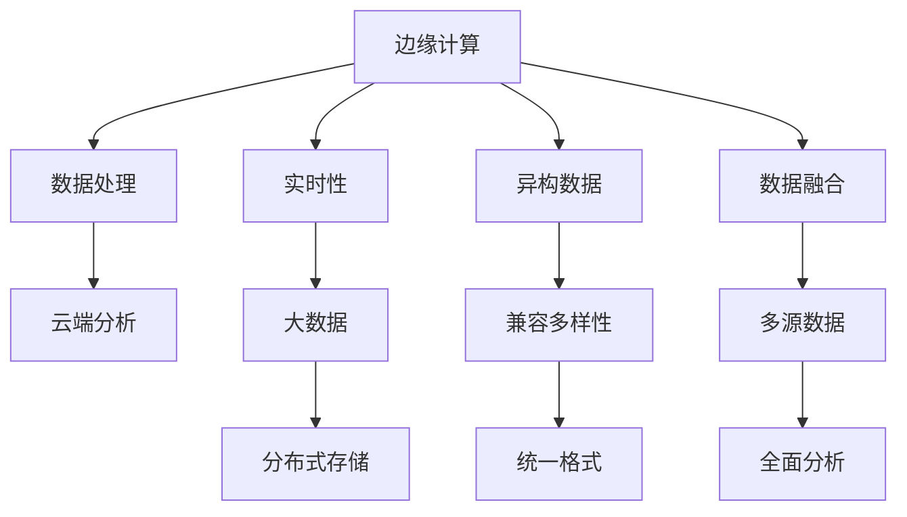

                 

# 物联网数据分析：在边缘和云端处理数据

> 关键词：物联网(IoT), 数据分析, 边缘计算, 云计算, 数据融合, 异构数据, 实时性, 大数据, 边缘服务

## 1. 背景介绍

### 1.1 问题由来
随着物联网(IoT)设备的普及和智能化水平的提升，海量的传感器数据在实时生成。这些数据通常包括温度、湿度、压力、位置、速度等信号，覆盖工业生产、智能家居、智慧城市、农业监控等多个应用场景。如何高效地收集、存储、处理和分析这些数据，以实现智能化决策，成为当前物联网领域的热点问题。

### 1.2 问题核心关键点
当前物联网数据分析的主要难点在于：

- 数据量巨大且异构：传感器节点数量庞大，数据类型多样，实时性要求高，需要高效的存储和处理机制。
- 数据处理中心分散：物联网设备分布在各处，网络通信时延较高，导致数据处理集中在云端存在瓶颈。
- 数据安全与隐私：传感器数据可能包含敏感信息，如何保障数据传输和存储的安全性，保护用户隐私，成为重要挑战。
- 实时性需求：很多应用场景需要毫秒级的响应时间，数据处理和分析必须满足实时性要求。
- 数据质量和一致性：传感器数据可能存在噪声、缺失、时序不一致等问题，需要进行清洗和校准。

这些问题催生了边缘计算与云端的结合，形成了“边缘计算+云端分析”的双层数据处理架构，极大提升了数据处理的效率和效果。

## 2. 核心概念与联系

### 2.1 核心概念概述

为了更好地理解物联网数据分析的原理与架构，本节将介绍几个关键概念：

- 边缘计算(Edge Computing)：在数据生成地对数据进行处理，减少数据传输时延和带宽占用，提升数据处理的实时性和可靠性。
- 云计算(Cloud Computing)：通过大规模的服务器集群和分布式存储，提供强大的计算和存储能力，支持海量数据的存储和复杂计算。
- 数据融合(Data Fusion)：将从不同传感器、来源获取的数据进行整合和分析，以获得更全面、准确的信息。
- 异构数据(Heterogeneous Data)：传感器数据类型多样，包括数字、图像、视频、文本等，需要兼容多种数据格式。
- 实时性(Real-Time)：物联网数据分析需要及时响应，对数据处理的效率和速度有较高要求。
- 大数据(Big Data)：涉及海量数据的处理与分析，往往需要分布式计算和存储技术。

这些概念之间的逻辑关系可以通过以下Mermaid流程图来展示：



该流程图展示了边缘计算与云计算结合的核心逻辑：

1. 边缘计算对数据进行初步处理。
2. 实时性要求促使数据处理需要高效快速。
3. 异构数据需要通过统一格式兼容多样性。
4. 数据融合整合多源数据以获得更全面信息。
5. 大数据技术支持海量数据的存储和分布式计算。
6. 边缘计算和云端分析共同形成双层数据处理架构。

## 3. 核心算法原理 & 具体操作步骤

### 3.1 算法原理概述

物联网数据分析主要基于“边缘计算+云端分析”的架构，从边缘设备收集数据，通过边缘计算进行预处理和初步分析，再将关键数据传输到云端进行深度学习和复杂计算。

具体来说，边缘计算处理的数据包括数据采样、数据压缩、数据清洗、特征提取、模型推理等，其主要目标是降低数据传输时延、减少带宽占用、提升数据处理的实时性。云端分析则基于分布式计算框架，进行数据融合、数据分析、模型训练等，其目标是获得更全面、准确的信息。

### 3.2 算法步骤详解

边缘计算和云端分析的核心算法步骤可以分为以下几类：

1. **边缘数据处理算法**：
   - **数据采样**：根据应用需求，选择传感器节点进行数据采集，以减少数据量和网络传输负担。
   - **数据压缩**：对采集到的数据进行无损或有损压缩，以减少存储空间需求和传输时延。
   - **数据清洗**：去除噪声、缺失值和异常值，确保数据的完整性和准确性。
   - **特征提取**：从原始数据中提取有意义的特征，以供进一步分析和模型推理。

2. **云端数据分析算法**：
   - **数据融合**：将来自不同传感器、不同来源的数据进行整合，通过一定的算法将异构数据统一表示，以获得更全面、准确的信息。
   - **数据分析**：基于统计、机器学习等算法，对数据进行全面分析和挖掘，提取有用信息。
   - **模型训练**：利用大规模数据集，训练机器学习模型或深度神经网络，以预测未来数据趋势和模式。

### 3.3 算法优缺点

基于“边缘计算+云端分析”的双层数据处理架构，具有以下优点：

- **提升实时性**：边缘计算减少了数据传输时延和网络带宽，显著提升了数据处理的实时性。
- **降低带宽需求**：边缘计算处理后，只传输关键数据到云端，减少了网络带宽的占用。
- **保护数据隐私**：边缘计算处理数据后，仅上传精简的摘要数据，减少了数据泄露风险。
- **高效能和低延迟**：边缘计算能够利用本地资源，进行高效的本地计算，降低网络延迟。

但这种架构也存在一些缺点：

- **计算资源分散**：边缘计算节点数量众多，每个节点资源有限，可能导致计算能力分散。
- **数据一致性问题**：由于分布式处理，各节点处理结果可能存在不一致性，需要进行统一和校准。
- **数据冗余存储**：边缘计算节点需要本地存储数据，可能存在数据冗余存储问题。
- **边缘设备复杂度**：边缘设备需要处理数据采样、压缩、清洗、特征提取等多种任务，增加了设备复杂度。

### 3.4 算法应用领域

基于“边缘计算+云端分析”架构的数据分析方法，已经在多个领域得到应用，例如：

- **工业自动化**：通过边缘计算实时监控生产设备状态，云端分析进行故障预测和维护调度。
- **智能家居**：边缘计算实时监测环境参数，云端分析进行能源管理和智能家居控制。
- **智慧城市**：边缘计算实时收集交通数据，云端分析进行交通流量预测和智能交通管理。
- **农业监控**：边缘计算实时监测土壤和气象数据，云端分析进行农作物生长预测和施肥优化。
- **环境监测**：边缘计算实时收集空气和水质数据，云端分析进行环境污染预警和治理方案制定。

随着技术的不断发展，基于“边缘计算+云端分析”架构的数据分析方法将在更多领域得到应用，提升物联网应用的价值和效果。

## 4. 数学模型和公式 & 详细讲解 & 举例说明

### 4.1 数学模型构建

为了更好地理解物联网数据分析的数学模型，本节将介绍一些关键的数学模型和公式。

假设传感器节点数为 $N$，每个节点每秒采集的数据量为 $C$，单位为比特，每个数据包大小为 $S$ 比特，数据压缩比为 $k$，则边缘计算传输到云端的数据总量为：

$$
T = \frac{NC}{(1-k)S}
$$

云端分析处理的数据总量为：

$$
T' = \frac{NC}{(1-k)S} \cdot (1-\alpha)
$$

其中 $\alpha$ 为边缘计算处理后上传云端数据的比例。

### 4.2 公式推导过程

为了计算边缘计算和云端分析的效率，可以定义边缘计算的效率为：

$$
E_{edge} = \frac{N}{T} = \frac{(1-k)S}{C}
$$

云端分析的效率为：

$$
E_{cloud} = \frac{N}{T'} = \frac{(1-k)S}{C} \cdot \frac{1}{(1-\alpha)}
$$

可以看出，边缘计算的效率与数据压缩比 $k$ 和数据包大小 $S$ 成正比，与数据采集率 $C$ 成反比。云端分析的效率则与边缘计算上传云端数据的比例 $\alpha$ 成反比。

### 4.3 案例分析与讲解

以工业生产中的温度监控为例，假设每个温度传感器每秒采集的数据量为 100 比特，每个数据包大小为 10 比特，数据压缩比为 80%，则边缘计算传输到云端的数据总量为：

$$
T = \frac{100 \times 3600}{(1-0.8) \times 10} = 5000
$$

云端分析处理的数据总量为：

$$
T' = \frac{100 \times 3600}{(1-0.8) \times 10} \cdot (1-\alpha) = 5000 \cdot (1-\alpha)
$$

当 $\alpha = 0.2$ 时，云端分析的数据量为：

$$
T' = 5000 \times 0.8 = 4000
$$

可以看出，边缘计算处理后上传云端的数据量减少了 20%，有效地降低了数据传输时延和带宽占用，提升了数据处理的实时性和效率。

## 5. 项目实践：代码实例和详细解释说明

### 5.1 开发环境搭建

在进行物联网数据分析的项目实践前，我们需要准备好开发环境。以下是使用Python进行物联网数据分析的环境配置流程：

1. 安装Anaconda：从官网下载并安装Anaconda，用于创建独立的Python环境。

2. 创建并激活虚拟环境：
```bash
conda create -n iot-analytics python=3.8 
conda activate iot-analytics
```

3. 安装相关依赖包：
```bash
conda install numpy pandas scipy matplotlib seaborn jupyter notebook
```

4. 安装物联网相关库：
```bash
pip install paho-mqtt pymongo scipy-ndimage netcdf4
```

完成上述步骤后，即可在`iot-analytics`环境中开始数据分析的实践。

### 5.2 源代码详细实现

以下是使用Python对物联网数据分析进行代码实现的例子。

假设有一个温度传感器网络，每秒钟采集的数据量为 100 比特，每个数据包大小为 10 比特，数据压缩比为 80%，边缘计算处理后上传云端数据的比例为 20%。

```python
from scipy import ndimage
import pandas as pd
import numpy as np

# 设置数据参数
data_rate = 100  # 每秒数据采集量，比特
data_packet_size = 10  # 每个数据包大小，比特
data_compression_ratio = 0.8  # 数据压缩比

# 计算边缘计算和云端分析的数据量
edge_data_amount = data_rate * 3600 * data_compression_ratio / (data_packet_size * (1 - data_compression_ratio))
cloud_data_amount = edge_data_amount * (1 - 0.2)

# 输出结果
print(f"边缘计算传输到云端的数据量：{edge_data_amount} 比特")
print(f"云端分析处理的数据量：{cloud_data_amount} 比特")
```

### 5.3 代码解读与分析

让我们再详细解读一下关键代码的实现细节：

**设置数据参数**：
- `data_rate`：每秒数据采集量，单位为比特。
- `data_packet_size`：每个数据包大小，单位为比特。
- `data_compression_ratio`：数据压缩比，通常以百分数表示。

**计算数据量**：
- `edge_data_amount`：边缘计算传输到云端的数据量，计算方法如公式所示。
- `cloud_data_amount`：云端分析处理的数据量，通过边缘计算传输的数据量乘以上传云端数据的比例（1-0.2）得到。

**输出结果**：
- 通过打印输出边缘计算传输到云端的数据量和云端分析处理的数据量，可以直观了解数据处理的效果和效率。

通过上述代码，可以清晰地看到，边缘计算处理后上传云端的数据量减少了 20%，显著降低了数据传输时延和带宽占用，提升了数据处理的实时性和效率。

## 6. 实际应用场景

### 6.1 智能家居

智能家居系统通过边缘计算实时监控环境参数，如温度、湿度、光照等，云端分析进行能源管理和智能家居控制。例如，可以通过边缘计算对室内温度进行采样和压缩，然后将处理后的数据上传到云端进行分析，从而实现智能调节室内温度，节能减排。

在技术实现上，可以收集智能家居设备的传感器数据，通过边缘计算进行初步处理和特征提取，再将关键数据传输到云端进行分析和控制决策。基于此，可以实现更加智能、高效的能源管理和家居控制。

### 6.2 智慧城市

智慧城市系统通过边缘计算实时收集交通数据，云端分析进行交通流量预测和智能交通管理。例如，可以通过边缘计算对车辆位置、速度、方向等数据进行实时采样和压缩，然后将处理后的数据上传到云端进行分析和预测，从而优化交通信号灯控制，减少交通拥堵。

在技术实现上，可以收集城市交通网络中的车辆数据，通过边缘计算进行数据采样和压缩，再将关键数据传输到云端进行分析和预测，从而实现智能交通控制和管理。基于此，可以实现更加安全和高效的交通系统。

### 6.3 工业自动化

工业自动化系统通过边缘计算实时监控生产设备状态，云端分析进行故障预测和维护调度。例如，可以通过边缘计算对生产设备的传感器数据进行实时采样和压缩，然后将处理后的数据上传到云端进行分析和预测，从而实现设备的故障预警和维护调度。

在技术实现上，可以收集生产设备的传感器数据，通过边缘计算进行数据采样和压缩，再将关键数据传输到云端进行分析和预测，从而实现设备的故障预警和维护调度。基于此，可以实现更加可靠、高效的工业生产系统。

### 6.4 未来应用展望

随着物联网技术的发展，基于“边缘计算+云端分析”架构的数据分析方法将在更多领域得到应用，提升物联网应用的价值和效果。

- **智能制造**：通过边缘计算实时监控生产设备状态，云端分析进行故障预测和维护调度，提升生产效率和设备可靠性。
- **智能医疗**：通过边缘计算实时监测患者生理参数，云端分析进行健康监测和疾病预测，提供个性化医疗服务。
- **智能农业**：通过边缘计算实时监测土壤和气象数据，云端分析进行农作物生长预测和施肥优化，提高农业生产效率。
- **智能物流**：通过边缘计算实时监控货物状态，云端分析进行路径规划和配送优化，降低物流成本。
- **智能能源**：通过边缘计算实时监测能源设备运行状态，云端分析进行能源管理优化，提高能源利用效率。

## 7. 工具和资源推荐

### 7.1 学习资源推荐

为了帮助开发者系统掌握物联网数据分析的理论基础和实践技巧，这里推荐一些优质的学习资源：

1. 《物联网数据分析与处理》课程：由清华大学开设的在线课程，系统介绍物联网数据分析的基本概念和技术方法。

2. 《物联网边缘计算》书籍：介绍边缘计算的基本原理和应用场景，适合了解物联网边缘计算的基础知识。

3. 《Python 数据分析与可视化》书籍：详细介绍Python在数据分析中的应用，适合掌握数据分析和可视化的实践技巧。

4. Hugging Face官方文档：介绍TensorFlow和PyTorch等深度学习框架的API和应用，适合快速上手实践。

5. 《IoT Hub教程》：Microsoft提供的IoT Hub开发文档，详细介绍IoT Hub的应用场景和技术实现。

通过对这些资源的学习实践，相信你一定能够快速掌握物联网数据分析的精髓，并用于解决实际的物联网问题。

### 7.2 开发工具推荐

高效的开发离不开优秀的工具支持。以下是几款用于物联网数据分析开发的常用工具：

1. Jupyter Notebook：基于Python的交互式开发环境，支持代码调试和数据分析，适合快速迭代研究。

2. Azure IoT Hub：Microsoft提供的IoT Hub服务，支持设备管理、数据采集、数据分析等，适合构建大规模物联网应用。

3. Python的科学计算库：如NumPy、SciPy、Pandas、Matplotlib等，支持高效的数学计算和数据处理。

4. MQTT协议工具：如paho-mqtt、Paho MQTT等，支持设备间的数据通信和传输。

5. MongoDB数据库：支持分布式存储和高效的数据查询，适合存储和管理物联网数据。

6. GeoPy库：支持地理信息的处理和分析，适合在地理位置相关的物联网应用中使用。

合理利用这些工具，可以显著提升物联网数据分析的开发效率，加快创新迭代的步伐。

### 7.3 相关论文推荐

物联网数据分析的发展源于学界的持续研究。以下是几篇奠基性的相关论文，推荐阅读：

1. Data Fusion in Internet of Things: A Survey and Taxonomy：综述了物联网数据融合的研究现状和应用场景，适合了解数据融合的基本概念和技术。

2. Real-Time Edge Computing for Smartphones：介绍了边缘计算在智能手机中的应用，适合了解边缘计算的基本原理和实现方法。

3. A Survey on Cloud Computing for IoT Applications：综述了云计算在物联网应用中的研究和应用，适合了解云计算和物联网的结合方式。

4. IoT Data Acquisition, Storage, and Analysis with Apache Kafka and Hadoop Ecosystem：介绍了使用Apache Kafka和Hadoop生态系统进行物联网数据采集、存储和分析的方法，适合了解物联网数据的处理流程。

5. Edge Computing for IoT Analytics: A Survey and Future Research Directions：综述了物联网边缘计算的研究现状和未来方向，适合了解边缘计算的最新进展。

这些论文代表了大数据处理和分析的研究脉络，通过学习这些前沿成果，可以帮助研究者把握学科前进方向，激发更多的创新灵感。

## 8. 总结：未来发展趋势与挑战

### 8.1 总结

本文对物联网数据分析的原理与架构进行了全面系统的介绍。首先阐述了物联网数据分析的背景和意义，明确了边缘计算与云计算结合的重要性。其次，从原理到实践，详细讲解了边缘计算与云端分析的核心算法步骤，给出了数据分析任务开发的完整代码实例。同时，本文还广泛探讨了数据分析方法在智能家居、智慧城市、工业自动化等多个行业领域的应用前景，展示了边缘计算与云计算结合的巨大潜力。此外，本文精选了数据分析技术的各类学习资源，力求为读者提供全方位的技术指引。

通过本文的系统梳理，可以看到，基于“边缘计算+云端分析”架构的数据分析方法正在成为物联网应用的重要范式，极大地提升了数据处理的效率和效果。未来，伴随物联网技术的发展和人工智能技术的进步，基于数据分析的物联网应用将带来更多的创新和突破。

### 8.2 未来发展趋势

展望未来，物联网数据分析技术将呈现以下几个发展趋势：

1. **边缘计算的普及**：随着边缘计算技术的成熟和普及，越来越多的物联网设备将实现本地数据处理，减少数据传输时延和带宽占用，提升数据处理的实时性和效率。

2. **大数据处理技术的进步**：大数据处理技术的不断进步，将支持更复杂、更高效的数据分析和挖掘，为物联网应用提供更深入、更全面的信息支持。

3. **多源数据融合**：多源数据的融合和整合将成为数据分析的重要方向，通过将不同来源的数据进行统一表示和分析，可以获取更加全面和准确的信息。

4. **人工智能技术的应用**：物联网数据分析将更多地结合人工智能技术，如机器学习、深度学习等，提升数据分析的智能性和自动化水平。

5. **实时性要求的提升**：随着物联网应用场景的不断扩展，实时性要求将越来越高，边缘计算和云端分析将需要更高效、更可靠的算法和架构支持。

6. **安全性与隐私保护**：物联网数据分析需要更多地考虑数据安全和隐私保护问题，通过加密、匿名化等技术手段，保障数据的安全性和隐私性。

以上趋势凸显了物联网数据分析技术的广阔前景。这些方向的探索发展，将进一步提升物联网应用的价值和效果，为物联网技术的发展注入新的动力。

### 8.3 面临的挑战

尽管物联网数据分析技术已经取得了瞩目成就，但在迈向更加智能化、普适化应用的过程中，它仍面临诸多挑战：

1. **数据一致性和同步性**：由于分布式处理，各边缘节点处理结果可能存在不一致性，需要进行统一和校准。
2. **计算资源分散**：边缘计算节点数量众多，每个节点资源有限，可能导致计算能力分散。
3. **数据存储和传输**：大量数据的存储和传输需要高性能设备和网络带宽，存在一定的成本和延迟问题。
4. **设备互联和互操作性**：不同厂商和协议的设备互联存在一定的互操作性问题，需要统一的通信协议和接口标准。
5. **数据质量和校准**：传感器数据可能存在噪声、缺失、时序不一致等问题，需要进行清洗和校准。
6. **安全性与隐私保护**：传感器数据可能包含敏感信息，如何保障数据传输和存储的安全性，保护用户隐私，成为重要挑战。

这些挑战需要从技术、管理和政策等多个维度协同应对，才能推动物联网数据分析技术的健康发展。

### 8.4 研究展望

面向未来，物联网数据分析技术需要在以下几个方面进行深入研究：

1. **边缘计算技术的优化**：进一步优化边缘计算架构，提升计算能力和资源利用效率，减少网络时延和带宽占用。

2. **数据融合技术的提升**：提升数据融合技术的精度和可靠性，减少数据处理中的误差和噪声，提高数据分析的全面性和准确性。

3. **人工智能算法的创新**：开发更高效、更智能的人工智能算法，提升数据分析的自动化和智能化水平，支持复杂的数据分析和预测。

4. **安全性与隐私保护的研究**：研究数据安全和隐私保护的新技术，如区块链、多方安全计算等，保障物联网数据的隐私和安全。

5. **多源数据融合的探索**：研究多源数据融合的新方法，提升数据融合的效率和效果，支持更全面、更深入的数据分析。

6. **实时性要求的优化**：研究更高效的实时性处理技术，如边缘计算、分布式计算等，提升数据处理的实时性和可靠性。

这些研究方向将推动物联网数据分析技术的不断进步，为物联网应用带来更全面、更高效、更智能的数据支持。相信随着技术的不断发展和应用场景的不断拓展，物联网数据分析技术将在更多领域得到应用，为经济社会发展注入新的动力。

## 9. 附录：常见问题与解答

**Q1：什么是边缘计算和云计算？**

A: 边缘计算和云计算是两种不同的计算架构。

边缘计算是指在数据生成地对数据进行处理，减少数据传输时延和带宽占用，提升数据处理的实时性和可靠性。云端分析则通过大规模的服务器集群和分布式存储，提供强大的计算和存储能力，支持海量数据的存储和复杂计算。

**Q2：边缘计算和云端分析的优势和劣势分别是什么？**

A: 边缘计算的优势包括：

- 提升实时性：减少数据传输时延和带宽占用，提升数据处理的实时性。
- 降低带宽需求：边缘计算处理后，只传输关键数据到云端，减少网络带宽的占用。
- 保护数据隐私：边缘计算处理数据后，仅上传精简的摘要数据，减少了数据泄露风险。
- 高效能和低延迟：边缘计算能够利用本地资源，进行高效的本地计算，降低网络延迟。

但边缘计算也存在一些劣势：

- 计算资源分散：边缘计算节点数量众多，每个节点资源有限，可能导致计算能力分散。
- 数据一致性问题：由于分布式处理，各节点处理结果可能存在不一致性，需要进行统一和校准。
- 数据冗余存储：边缘计算节点需要本地存储数据，可能存在数据冗余存储问题。
- 边缘设备复杂度：边缘设备需要处理数据采样、压缩、清洗、特征提取等多种任务，增加了设备复杂度。

云端分析的优势包括：

- 分布式计算能力：可以通过大规模服务器集群，支持海量数据的存储和分布式计算。
- 数据融合能力强：能够整合多源数据，通过数据融合技术获得更全面、准确的信息。
- 数据分析能力强：基于机器学习、深度学习等算法，支持更复杂的数据分析和预测。

但云端分析也存在一些劣势：

- 数据传输时延：数据需要从边缘节点传输到云端，存在一定的网络时延。
- 数据传输成本：数据传输需要占用一定的带宽和网络资源，存在一定的成本问题。
- 计算资源消耗：大规模数据集的存储和处理需要高性能设备，存在一定的计算资源消耗。

**Q3：如何选择边缘计算节点？**

A: 选择边缘计算节点需要考虑以下几个因素：

- 计算资源：选择计算能力较强的节点，以支持数据处理和分析。
- 网络带宽：选择网络带宽较大的节点，以支持数据传输。
- 存储容量：选择存储容量较大的节点，以支持数据存储和备份。
- 地理位置：选择地理位置较近的节点，以减少数据传输时延。

综合考虑以上因素，可以选择适合的边缘计算节点，实现高效的数据处理和分析。

**Q4：如何进行数据清洗和校准？**

A: 数据清洗和校准是数据分析的重要环节，可以通过以下步骤进行：

- 数据预处理：去除数据中的噪声、缺失值和异常值，确保数据的完整性和准确性。
- 数据校准：对传感器数据进行校准，确保数据的一致性和可靠性。
- 特征提取：从原始数据中提取有意义的特征，以供进一步分析和模型推理。
- 数据融合：将来自不同传感器、不同来源的数据进行整合，通过一定的算法将异构数据统一表示，以获得更全面、准确的信息。

这些步骤可以通过Python等工具和库实现，如NumPy、SciPy、Pandas等，提高数据处理和分析的效率和效果。

**Q5：如何保障物联网数据的隐私和安全？**

A: 保障物联网数据的隐私和安全需要从多个方面进行：

- 数据加密：使用加密技术对数据进行保护，防止数据泄露和篡改。
- 访问控制：设置访问权限，限制数据的访问和使用范围。
- 数据匿名化：对数据进行匿名化处理，防止个人隐私泄露。
- 安全协议：采用安全通信协议，保障数据传输的安全性。

通过这些措施，可以有效保护物联网数据的隐私和安全，防止数据泄露和滥用。

**Q6：如何实现边缘计算和云端分析的结合？**

A: 实现边缘计算和云端分析的结合，需要以下几个步骤：

- 边缘计算：在数据生成地对数据进行处理，减少数据传输时延和带宽占用，提升数据处理的实时性。
- 数据传输：将处理后的数据传输到云端。
- 云端分析：基于大规模数据集，进行深度学习和复杂计算，获取更全面、准确的信息。
- 反馈机制：将云端分析结果反馈到边缘计算中，指导后续数据处理和优化。

通过这些步骤，可以实现边缘计算和云端分析的有效结合，提升数据处理的效率和效果。

---

作者：禅与计算机程序设计艺术 / Zen and the Art of Computer Programming

