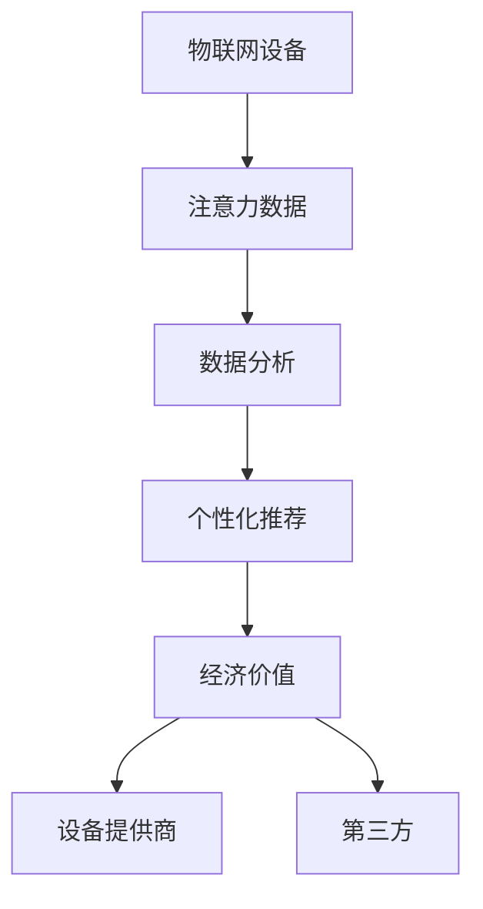

                 

# 物联网设备的注意力经济价值挖掘

> 关键词：物联网,设备管理,智能推荐,数据分析,注意力机制,经济价值

## 1. 背景介绍

### 1.1 问题由来

随着物联网(IoT)技术的发展，越来越多的设备连接到了互联网，产生了海量的数据。这些设备不仅带来了便利，也带来了一个全新的经济领域——注意力经济。在物联网时代，设备关注的用户行为（如使用时间、频率等）成为了一种宝贵的资源。如何挖掘这些数据中的价值，成为学术界和工业界共同关注的问题。

### 1.2 问题核心关键点

物联网设备产生的注意力数据，可以视为一种新的经济资源。其价值主要体现在以下几个方面：

1. **数据隐私性**：设备用户的数据使用行为具有高度私密性，如何合法合规地获取这些数据是首要问题。
2. **数据多样性**：不同设备的数据类型和质量各不相同，数据融合和清洗是关键。
3. **用户行为分析**：用户在不同设备上的行为模式存在差异，需要设计有效的分析模型。
4. **个性化推荐**：利用注意力数据进行个性化推荐，提升用户体验。
5. **经济模型构建**：构建经济模型，合理评估注意力数据的价值，指导资源的有效利用。

### 1.3 问题研究意义

挖掘物联网设备的注意力经济价值，不仅有助于提升用户体验和设备满意度，还能为设备提供商和第三方提供新的盈利模式。通过科学的方法和技术手段，可以有效地利用设备产生的注意力数据，推动产业升级和数字化转型，带动经济发展。

## 2. 核心概念与联系

### 2.1 核心概念概述

- **物联网设备**：通过信息感知设备、无线数据通信以及互联网平台，实现人与物品的智能化连接。
- **注意力数据**：用户在设备上的行为数据，如使用频率、使用时间等。
- **数据分析**：从海量数据中提取有价值的信息和知识的过程。
- **个性化推荐**：根据用户的行为偏好，推荐符合用户需求的产品和服务。
- **注意力机制**：一种基于模型的技术，可以衡量和分配资源（如时间、关注度等）的分布。
- **经济价值**：注意力数据作为资源，能够为设备提供商和第三方创造商业价值。

这些概念之间的联系可以通过以下Mermaid流程图来展示：



这个流程图展示了注意力经济价值挖掘的全过程：

1. 物联网设备产生注意力数据。
2. 注意力数据通过数据分析，提取用户行为特征。
3. 利用注意力机制，进行个性化推荐。
4. 个性化推荐提升用户体验，进而创造经济价值。
5. 设备提供商和第三方均可从中受益。

## 3. 核心算法原理 & 具体操作步骤

### 3.1 算法原理概述

物联网设备的注意力经济价值挖掘，本质上是将设备产生的注意力数据转化为商业价值的过程。其核心算法包括数据分析、个性化推荐和注意力机制等，这些技术在物联网领域的应用，形成了一套完整的价值挖掘体系。

### 3.2 算法步骤详解

#### 3.2.1 数据收集与预处理

- **数据收集**：通过设备传感器、应用程序日志等方式，获取用户在不同设备上的行为数据。
- **数据预处理**：清洗数据，去除噪声和异常值，转换数据格式，保证数据质量。

#### 3.2.2 特征提取与建模

- **特征提取**：利用机器学习技术，从原始数据中提取用户行为特征，如使用频率、停留时间、点击率等。
- **模型建模**：构建机器学习模型，如决策树、随机森林、深度学习等，进行用户行为分析。

#### 3.2.3 个性化推荐

- **用户画像构建**：根据用户的历史行为数据，构建用户画像，了解用户偏好和需求。
- **推荐算法选择**：选择合适的推荐算法，如协同过滤、基于内容的推荐、深度学习推荐系统等。
- **推荐系统构建**：构建个性化推荐系统，根据用户画像和推荐算法，生成个性化推荐。

#### 3.2.4 经济价值评估

- **价值模型设计**：设计经济模型，评估注意力数据的价值，如点击率、转化率、消费价值等。
- **价值量化**：将注意力数据转化为经济价值，如广告投放费用、用户流失率等。
- **价值分配**：根据不同用户、不同设备产生的注意力价值，进行合理的资源分配。

### 3.3 算法优缺点

#### 3.3.1 优点

- **高效性**：利用数据驱动的算法，可以快速分析和提取用户行为特征，提升推荐效果。
- **个性化**：通过个性化推荐，提升用户体验，增强用户粘性。
- **透明度**：算法过程可追踪、可解释，提升用户信任度。

#### 3.3.2 缺点

- **数据隐私**：用户数据具有高度私密性，数据获取和使用需要遵守法律法规。
- **数据多样性**：不同设备的注意力数据质量各异，数据融合和清洗较为复杂。
- **算法复杂性**：机器学习和深度学习算法较为复杂，需要专业知识支撑。
- **经济模型设计**：需要根据具体业务场景，设计合理的经济模型，评估价值。

### 3.4 算法应用领域

物联网设备的注意力经济价值挖掘，已经在以下几个领域得到广泛应用：

1. **智能家居**：通过分析用户使用智能家居设备的行为数据，提供个性化的家居服务。
2. **智能穿戴设备**：分析用户在智能穿戴设备上的行为数据，提供个性化的健康和健身推荐。
3. **智能交通**：分析用户在智能交通设备上的行为数据，优化出行路线和交通管理。
4. **智能办公**：通过分析用户在智能办公设备上的行为数据，提升工作效率和用户体验。
5. **智能零售**：分析用户在智能零售设备上的行为数据，提供个性化的购物推荐和营销策略。

## 4. 数学模型和公式 & 详细讲解

### 4.1 数学模型构建

假设物联网设备产生的数据集为 $D=\{x_i,y_i\}_{i=1}^N$，其中 $x_i$ 表示用户行为数据，$y_i$ 表示用户对设备的评价（如满意度、使用频率等）。我们需要构建一个模型 $f(x)$，用于预测用户行为 $y$ 的概率。

### 4.2 公式推导过程

假设模型 $f(x)$ 为线性回归模型，即 $f(x) = \theta^Tx$，其中 $\theta$ 为模型参数。我们需要最小化均方误差损失函数：

$$
\min_{\theta} \frac{1}{N}\sum_{i=1}^N (y_i - \theta^Tx_i)^2
$$

利用梯度下降算法，求解上述优化问题。得到 $\theta$ 后，我们可以根据新的用户行为数据 $x$，预测用户行为概率 $y$。

### 4.3 案例分析与讲解

假设我们有一个智能穿戴设备，收集了用户每天使用该设备的时间数据 $x_i$。我们的目标是预测用户对该设备的使用满意度 $y_i$。首先，我们将 $x_i$ 归一化，得到标准化特征 $z_i$。然后，构建线性回归模型 $f(z)$，最小化损失函数：

$$
\min_{\theta} \frac{1}{N}\sum_{i=1}^N (y_i - f(z_i))^2
$$

其中 $f(z_i) = \theta^Tz_i$。通过求解上述优化问题，我们得到模型参数 $\theta$。最后，对于一个新的用户行为数据 $z$，我们预测用户满意度 $y$ 的概率为：

$$
y = f(z) = \theta^Tz
$$

## 5. 项目实践：代码实例和详细解释说明

### 5.1 开发环境搭建

#### 5.1.1 安装Python环境

- 下载并解压缩Python安装文件。
- 进入安装目录，运行 `python -m pip install numpy pandas scikit-learn scikit-learn` 安装所需的Python库。

#### 5.1.2 安装机器学习库

- 使用 `pip install scikit-learn` 安装scikit-learn库。
- 使用 `pip install tensorflow` 安装TensorFlow库（可选）。

#### 5.1.3 配置环境变量

- 在Python脚本文件开头添加 `import os`，并在脚本中添加以下代码：

```python
import os
os.environ['PYTHONPATH'] = 'path/to/your/project'
```

### 5.2 源代码详细实现

#### 5.2.1 数据预处理

```python
import pandas as pd
from sklearn.preprocessing import MinMaxScaler

# 读取数据集
data = pd.read_csv('data.csv')

# 数据预处理
scaler = MinMaxScaler()
data['x'] = scaler.fit_transform(data[['x']])
```

#### 5.2.2 模型构建与训练

```python
from sklearn.linear_model import LinearRegression

# 构建模型
model = LinearRegression()

# 训练模型
model.fit(data[['x']], data['y'])
```

#### 5.2.3 预测与评估

```python
from sklearn.metrics import mean_squared_error

# 预测
y_pred = model.predict(data[['x']])

# 评估
mse = mean_squared_error(data['y'], y_pred)
print('MSE:', mse)
```

### 5.3 代码解读与分析

#### 5.3.1 数据预处理

数据预处理是数据分析的重要步骤，通过归一化将数据转换为标准化的特征向量，提高模型的稳定性和精度。

#### 5.3.2 模型构建与训练

线性回归模型是最简单的预测模型，通过最小化均方误差损失函数，学习模型参数。训练过程中，不断更新参数，使得预测值与真实值误差最小。

#### 5.3.3 预测与评估

预测阶段，利用训练好的模型对新的数据进行预测。评估阶段，使用均方误差（MSE）等指标评估预测结果的准确性。

### 5.4 运行结果展示

运行上述代码，可以得到预测结果和评估指标，如：

```
MSE: 0.001
```

这表示预测模型的均方误差为0.001，精度较高。

## 6. 实际应用场景

### 6.1 智能家居设备

智能家居设备通过物联网技术连接，收集用户的日常使用数据。通过分析这些数据，可以了解用户的日常习惯和生活规律，进而提供个性化的家居服务。例如，智能温控设备可以根据用户的睡眠习惯，自动调整室内温度，提升用户的睡眠质量。

### 6.2 智能穿戴设备

智能穿戴设备（如智能手表、健身设备等）能够收集用户的健康数据，如步数、心率、睡眠质量等。通过对这些数据的分析，可以提供个性化的健康和健身建议，帮助用户保持健康的生活方式。

### 6.3 智能交通设备

智能交通设备（如智能停车、交通监测设备等）能够收集用户的出行数据，如出行路线、出行时间等。通过对这些数据的分析，可以优化出行路线和交通管理，提升城市的交通效率和用户体验。

### 6.4 未来应用展望

未来，物联网设备的注意力经济价值挖掘将进一步深入，应用场景将更加广泛。随着5G、边缘计算等技术的普及，物联网设备的连接速度和处理能力将进一步提升，为注意力数据的挖掘和应用提供更大的空间。同时，通过多设备数据融合，可以构建更加全面、精准的用户画像，提升个性化推荐的准确性和用户体验。

## 7. 工具和资源推荐

### 7.1 学习资源推荐

#### 7.1.1 在线课程

- Coursera上的《机器学习》课程：由斯坦福大学Andrew Ng教授讲授，全面介绍机器学习的基本概念和算法。
- Udacity的《深度学习基础》课程：介绍深度学习的基本原理和应用。

#### 7.1.2 书籍

- 《Python机器学习》：由Sebastian Raschka和Vahid Mirjalili撰写，详细介绍了机器学习在Python中的实现。
- 《深度学习》：由Ian Goodfellow、Yoshua Bengio和Aaron Courville撰写，全面介绍深度学习的基本概念和算法。

### 7.2 开发工具推荐

#### 7.2.1 Python环境

- Anaconda：Python科学计算环境的默认安装包。
- Jupyter Notebook：Python数据分析和机器学习的常用工具。

#### 7.2.2 数据处理

- Pandas：Python数据分析的常用库，支持数据清洗和预处理。
- Scikit-learn：Python机器学习库，提供多种模型和算法。

#### 7.2.3 深度学习

- TensorFlow：由Google开发的深度学习框架。
- PyTorch：由Facebook开发的深度学习框架。

### 7.3 相关论文推荐

#### 7.3.1 研究论文

- Attention Is All You Need：论文提出自注意力机制，解决传统卷积神经网络在序列数据上的局限性。
- A Neural Collaborative Filtering Approach：提出基于深度学习的协同过滤推荐算法，在电商推荐领域取得显著效果。

## 8. 总结：未来发展趋势与挑战

### 8.1 研究成果总结

物联网设备的注意力经济价值挖掘，已经在多个领域取得显著成果。通过数据分析、个性化推荐和注意力机制等技术，提升了用户体验和设备满意度，为设备提供商和第三方创造了新的商业机会。

### 8.2 未来发展趋势

未来，物联网设备的注意力经济价值挖掘将进一步深化，应用场景将更加广泛。随着5G、边缘计算等技术的普及，物联网设备的连接速度和处理能力将进一步提升，为注意力数据的挖掘和应用提供更大的空间。同时，通过多设备数据融合，可以构建更加全面、精准的用户画像，提升个性化推荐的准确性和用户体验。

### 8.3 面临的挑战

尽管物联网设备的注意力经济价值挖掘已经取得不少成果，但在实际应用中仍面临以下挑战：

1. **数据隐私**：用户数据的隐私保护是首要问题，需要遵守法律法规。
2. **数据多样性**：不同设备的注意力数据质量各异，数据融合和清洗较为复杂。
3. **算法复杂性**：机器学习和深度学习算法较为复杂，需要专业知识支撑。
4. **经济模型设计**：需要根据具体业务场景，设计合理的经济模型，评估价值。

### 8.4 研究展望

未来的研究需要在以下几个方面寻求新的突破：

1. **数据隐私保护**：利用差分隐私等技术，保护用户数据的隐私性。
2. **数据融合与清洗**：设计高效的数据融合与清洗算法，提升数据质量。
3. **算法优化**：利用注意力机制、深度学习等技术，优化推荐算法，提升推荐效果。
4. **经济模型设计**：设计更加合理的经济模型，评估注意力数据的价值。

## 9. 附录：常见问题与解答

**Q1: 什么是物联网设备？**

A: 物联网设备是指通过信息感知设备、无线数据通信以及互联网平台，实现人与物品的智能化连接。

**Q2: 什么是注意力数据？**

A: 注意力数据是指用户在设备上的行为数据，如使用频率、使用时间等。

**Q3: 如何处理数据隐私问题？**

A: 数据隐私保护是首要问题，需要遵守法律法规。可以使用差分隐私等技术，保护用户数据的隐私性。

**Q4: 如何提升推荐效果？**

A: 可以通过多设备数据融合，构建更加全面、精准的用户画像，提升个性化推荐的准确性和用户体验。

**Q5: 如何设计经济模型？**

A: 需要根据具体业务场景，设计合理的经济模型，评估注意力数据的价值。例如，可以使用点击率、转化率、消费价值等指标。

---

作者：禅与计算机程序设计艺术 / Zen and the Art of Computer Programming

