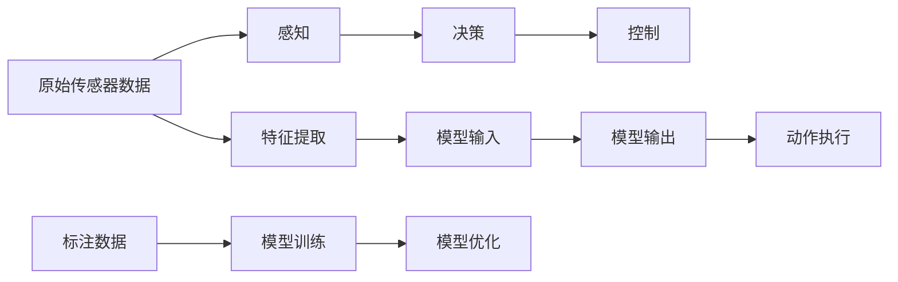

                 

# 特斯拉在端到端自动驾驶上的巨额投资

## 1. 背景介绍

### 1.1 问题由来

随着电动汽车的普及，特斯拉在自动驾驶领域进行了巨额投资，旨在实现完全自动化的无人驾驶技术。这一项目包括自动驾驶系统（Autopilot）和全自动驾驶系统（Full Self-Driving, FSD），涉及到感知、决策、控制等各个环节的深度融合，是一个极为复杂且耗资巨大的系统工程。

### 1.2 问题核心关键点

特斯拉的自动驾驶系统采用端到端（End-to-End）的深度学习框架，将输入的原始传感器数据，通过一系列深度神经网络模型进行特征提取、推理决策，最终输出转向、加速、刹车等控制指令，实现全过程的自动化。这一系统依赖于大量标注数据、高性能计算平台以及持续的模型优化，涉及到多个技术领域的深度融合，展现了特斯拉在自动驾驶领域的雄心壮志。

### 1.3 问题研究意义

特斯拉在自动驾驶上的巨额投资，旨在突破传统驾驶辅助技术的局限，全面提升道路安全性和驾驶体验，推动汽车行业的智能化转型。这一投资不仅提升了特斯拉在自动驾驶领域的技术领先地位，也带动了整个汽车行业对自动驾驶技术的重视和研发投入。

## 2. 核心概念与联系

### 2.1 核心概念概述

为更好地理解特斯拉在自动驾驶上的技术架构，本节将介绍几个核心概念：

- **端到端（End-to-End）深度学习**：指从原始传感器数据直接输出控制指令，不涉及中间特征提取步骤的深度学习系统。通过这种架构，可以有效减少特征工程的工作量，提高模型的泛化能力和稳定性。

- **感知（Perception）**：自动驾驶系统的第一步，通过摄像头、雷达、激光雷达等传感器获取周围环境的实时信息，并进行预处理和特征提取。感知模块是整个自动驾驶系统的基础，其性能直接影响系统的决策和控制。

- **决策（Decision）**：在感知模块的基础上，通过深度神经网络对感知信息进行处理，识别道路状况、车辆、行人等目标，并做出相应的决策。决策模块的输出将指导控制模块的行动。

- **控制（Control）**：根据决策模块的输出，控制车辆的转向、加速、刹车等行为，以实现安全、舒适的自动驾驶。控制模块依赖于高精度的模型和快速响应的执行器。

- **数据驱动（Data-Driven）**：自动驾驶系统依赖于大量的标注数据进行训练，通过机器学习算法优化模型的决策能力。特斯拉在自动驾驶项目中投入了大量的标注数据，并使用这些数据驱动模型学习。

这些核心概念之间的逻辑关系可以通过以下Mermaid流程图来展示：



这个流程图展示了自动驾驶系统的整体架构，从数据采集到最终控制的过程：

1. 原始传感器数据通过感知模块进行预处理和特征提取。
2. 提取的特征输入决策模块，经过深度神经网络进行目标识别和场景理解。
3. 决策模块输出控制指令，指导控制模块的执行。
4. 标注数据用于模型训练和优化，通过持续学习提升系统的性能。
5. 特征提取、模型输入、输出及动作执行等环节共同构成了特斯拉的自动驾驶系统。

## 3. 核心算法原理 & 具体操作步骤
### 3.1 算法原理概述

特斯拉的端到端自动驾驶系统主要基于深度学习框架进行设计，通过多层神经网络模型处理传感器数据，输出控制指令。其核心算法包括感知模块的特征提取和目标检测、决策模块的路径规划和行为决策、控制模块的动作执行和参数调节等。

以决策模块为例，其主要算法流程如下：

1. **输入数据**：从感知模块获取实时传感器数据，如摄像头图像、雷达点云等。
2. **特征提取**：使用卷积神经网络（CNN）等模型对输入数据进行特征提取，识别出道路、车辆、行人等关键目标。
3. **目标检测**：利用目标检测算法（如YOLO、Faster R-CNN等）进一步识别出目标的位置和类别，生成目标框。
4. **行为决策**：将目标框输入行为决策网络（如CNN、LSTM等），预测出车辆的动作（如加速、刹车、转向等），生成行为指令。
5. **输出控制**：将行为指令转化为具体的控制信号，传递给车辆控制模块。

### 3.2 算法步骤详解

特斯拉的自动驾驶系统主要包括以下几个关键步骤：

**Step 1: 数据收集与标注**

- **传感器配置**：特斯拉车辆配备了多模态传感器，包括摄像头、雷达、激光雷达、超声波传感器等，用于获取周围环境信息。
- **数据采集**：在实际驾驶过程中，传感器实时记录车辆位置、速度、方向等信息。
- **数据标注**：对采集的数据进行标注，生成包含目标位置、类别、运动轨迹等信息的数据集。

**Step 2: 模型训练**

- **网络结构设计**：设计多个深度神经网络模型，如感知模块的CNN、决策模块的RNN等。
- **训练流程**：在大量标注数据上，使用反向传播算法优化模型参数，最小化损失函数。
- **模型验证**：使用验证集评估模型性能，调整模型超参数，如学习率、批大小等。

**Step 3: 模型优化**

- **参数调整**：在实际驾驶中，持续收集新数据，优化模型参数，适应不同的驾驶场景。
- **在线学习**：使用在线学习技术，实时更新模型，提高系统的实时响应能力。
- **模型压缩**：压缩模型结构，减少计算量和内存消耗，提高推理速度。

**Step 4: 系统部署**

- **硬件平台选择**：根据实际需求，选择适合的硬件平台，如高性能计算集群、嵌入式处理器等。
- **软件部署**：将训练好的模型部署到车辆中，通过软件控制算法进行决策和控制。
- **系统测试**：在实际道路环境中，测试系统的性能和安全稳定性，进行持续优化。

### 3.3 算法优缺点

特斯拉的端到端自动驾驶系统具有以下优点：

1. **高效性**：端到端架构减少了中间特征提取步骤，提高了模型的实时响应能力和计算效率。
2. **鲁棒性**：多模态传感器融合提高了系统的鲁棒性，使其在复杂环境中仍能稳定运行。
3. **自适应能力**：通过持续学习，系统能够适应不同驾驶场景和交通规则，提升安全性。
4. **可扩展性**：模块化的系统设计使得新增功能模块的集成更加方便。

然而，这一系统也存在一些局限性：

1. **高成本**：大规模数据标注和模型训练需要大量人力物力，初期投入成本较高。
2. **安全性问题**：虽然系统设计复杂，但在极端情况下仍可能出现系统失效或决策失误，影响安全。
3. **技术复杂度**：多模态数据的融合和模型优化技术复杂，需要跨学科团队协作。
4. **依赖标注数据**：系统的性能高度依赖于数据质量，标注数据的获取和标注过程复杂且耗时。

尽管存在这些局限性，但特斯拉在自动驾驶上的投资已经取得了显著的进展，未来有望实现完全自动化的无人驾驶技术。

### 3.4 算法应用领域

特斯拉的端到端自动驾驶系统已经在多个领域得到应用，包括但不限于：

- **高速公路自动驾驶**：在高速公路上实现自动巡航、车道保持、自动变道等功能，提升驾驶效率和舒适度。
- **城市道路自动驾驶**：在城市复杂道路环境中，实现自动避障、交通信号识别、红绿灯控制等功能，提升驾驶安全性和便利性。
- **自动泊车**：利用传感器数据和地图信息，实现智能泊车和自动退出等功能，提升停车体验。
- **紧急避险**：在突发情况下，通过感知模块和决策模块的协同工作，迅速做出避险决策，保障乘客安全。

## 4. 数学模型和公式 & 详细讲解 & 举例说明
### 4.1 数学模型构建

特斯拉的自动驾驶系统涉及多个数学模型，其中感知模块和决策模块是最核心的部分。以下是这两个模块的数学模型构建过程。

**感知模块**：

1. **输入数据**：假设传感器数据为 $X$，其中 $X_t$ 表示第 $t$ 时刻的传感器数据。
2. **特征提取**：使用 CNN 对传感器数据进行特征提取，得到特征向量 $F(X_t)$。
3. **目标检测**：使用目标检测算法（如YOLO）对特征向量进行目标检测，生成目标框 $B_t$。

数学模型表示为：
$$ F(X_t) = \mathcal{F}(\mathcal{C}(X_t)) $$
$$ B_t = \mathcal{D}(F(X_t)) $$

**决策模块**：

1. **输入数据**：目标框 $B_t$ 作为输入。
2. **行为决策**：使用 RNN 对目标框进行推理，生成行为指令 $A_t$。

数学模型表示为：
$$ A_t = \mathcal{A}(B_t) $$

### 4.2 公式推导过程

以决策模块为例，进行详细推导。

假设输入的目标框为 $B_t = (b_{1,t}, b_{2,t}, \ldots, b_{n,t})$，其中 $b_{i,t}$ 表示第 $i$ 个目标框的位置和大小。

目标检测算法输出的特征向量为 $F(X_t) = (f_{1,t}, f_{2,t}, \ldots, f_{m,t})$，其中 $m$ 表示特征向量的维度。

决策模块的输出行为指令为 $A_t = (a_{1,t}, a_{2,t}, \ldots, a_{k,t})$，其中 $k$ 表示行为指令的种类。

行为指令的计算公式为：
$$ A_t = \mathcal{A}(B_t) = \mathcal{R}(\mathcal{F}(B_t)) $$
$$ \mathcal{F}(B_t) = [f_{1,t}, f_{2,t}, \ldots, f_{m,t}] $$
$$ \mathcal{R}(\cdot) = [a_{1,t}, a_{2,t}, \ldots, a_{k,t}] $$

其中 $\mathcal{R}$ 表示行为推理网络，$\mathcal{F}$ 表示特征提取网络。

### 4.3 案例分析与讲解

以高速公路自动驾驶为例，分析感知和决策模块的具体应用。

**感知模块**：

1. **传感器配置**：车辆配备多个摄像头和雷达，用于实时采集道路信息。
2. **特征提取**：使用 CNN 对摄像头图像进行特征提取，识别出道路边界、车道线等关键信息。
3. **目标检测**：使用 YOLO 对特征向量进行目标检测，识别出车辆、行人、道路标志等目标。

**决策模块**：

1. **输入数据**：目标检测结果 $B_t$ 作为输入。
2. **行为决策**：使用 RNN 对目标框进行推理，预测出车辆的加速、刹车、转向等行为，生成行为指令 $A_t$。
3. **输出控制**：将行为指令转化为具体的控制信号，传递给车辆控制模块。

在实际应用中，感知和决策模块的性能直接影响系统的稳定性。例如，在城市复杂环境中，摄像头和雷达可能会受到遮挡或天气影响，导致数据质量下降，从而影响目标检测和行为决策的准确性。因此，特斯拉在系统中引入了多模态传感器融合技术，提高系统的鲁棒性和可靠性。

## 5. 项目实践：代码实例和详细解释说明
### 5.1 开发环境搭建

在进行自动驾驶系统开发前，我们需要准备好开发环境。以下是使用Python进行PyTorch开发的环境配置流程：

1. 安装Anaconda：从官网下载并安装Anaconda，用于创建独立的Python环境。

2. 创建并激活虚拟环境：
```bash
conda create -n auto_pilot_env python=3.8 
conda activate auto_pilot_env
```

3. 安装PyTorch：根据CUDA版本，从官网获取对应的安装命令。例如：
```bash
conda install pytorch torchvision torchaudio cudatoolkit=11.1 -c pytorch -c conda-forge
```

4. 安装TensorFlow：
```bash
conda install tensorflow
```

5. 安装各类工具包：
```bash
pip install numpy pandas scikit-learn matplotlib tqdm jupyter notebook ipython
```

完成上述步骤后，即可在`auto_pilot_env`环境中开始自动驾驶系统的开发。

### 5.2 源代码详细实现

这里我们以感知模块的CNN网络为例，给出使用PyTorch进行模型实现的代码：

```python
import torch
import torch.nn as nn
import torch.optim as optim

class CNN(nn.Module):
    def __init__(self, num_classes=3):
        super(CNN, self).__init__()
        self.conv1 = nn.Conv2d(3, 16, kernel_size=3, stride=1, padding=1)
        self.relu1 = nn.ReLU()
        self.pool1 = nn.MaxPool2d(kernel_size=2, stride=2)
        self.conv2 = nn.Conv2d(16, 32, kernel_size=3, stride=1, padding=1)
        self.relu2 = nn.ReLU()
        self.pool2 = nn.MaxPool2d(kernel_size=2, stride=2)
        self.fc1 = nn.Linear(32 * 16 * 16, 64)
        self.relu3 = nn.ReLU()
        self.fc2 = nn.Linear(64, num_classes)
        self.softmax = nn.Softmax(dim=1)
    
    def forward(self, x):
        x = self.conv1(x)
        x = self.relu1(x)
        x = self.pool1(x)
        x = self.conv2(x)
        x = self.relu2(x)
        x = self.pool2(x)
        x = x.view(-1, 32 * 16 * 16)
        x = self.fc1(x)
        x = self.relu3(x)
        x = self.fc2(x)
        x = self.softmax(x)
        return x

# 加载数据集
from torchvision.datasets import CIFAR10
from torchvision.transforms import ToTensor

train_dataset = CIFAR10(root='./data', train=True, download=True, transform=ToTensor())
test_dataset = CIFAR10(root='./data', train=False, download=True, transform=ToTensor())

# 定义模型和优化器
model = CNN(num_classes=10)
optimizer = optim.Adam(model.parameters(), lr=0.001)
loss_fn = nn.CrossEntropyLoss()

# 训练和测试
def train_epoch(model, dataset, optimizer, loss_fn, num_epochs=10, batch_size=64):
    dataloader = torch.utils.data.DataLoader(dataset, batch_size=batch_size, shuffle=True)
    for epoch in range(num_epochs):
        model.train()
        for batch_idx, (data, target) in enumerate(dataloader):
            data, target = data.to(device), target.to(device)
            optimizer.zero_grad()
            output = model(data)
            loss = loss_fn(output, target)
            loss.backward()
            optimizer.step()
            if batch_idx % 100 == 0:
                print(f'Epoch {epoch+1}, Batch {batch_idx}, Loss: {loss.item()}')

def test_epoch(model, dataset, loss_fn, num_epochs=10, batch_size=64):
    model.eval()
    dataloader = torch.utils.data.DataLoader(dataset, batch_size=batch_size, shuffle=False)
    total_loss = 0
    for batch_idx, (data, target) in enumerate(dataloader):
        data, target = data.to(device), target.to(device)
        output = model(data)
        loss = loss_fn(output, target)
        total_loss += loss.item()
    print(f'Test Loss: {total_loss/len(dataloader)}')

train_epoch(model, train_dataset, optimizer, loss_fn)
test_epoch(model, test_dataset, loss_fn)
```

以上就是使用PyTorch对CNN网络进行感知模块实现的完整代码。可以看到，通过简单的网络定义和训练函数，可以轻松实现一个基础的感知模块。

### 5.3 代码解读与分析

让我们再详细解读一下关键代码的实现细节：

**CNN类定义**：
- `__init__`方法：定义模型层，包括卷积层、激活函数、池化层、全连接层等。
- `forward`方法：定义模型前向传播过程。

**训练和测试函数**：
- `train_epoch`函数：对数据集进行批处理，进行前向传播、计算损失、反向传播和参数更新。
- `test_epoch`函数：对数据集进行批处理，进行前向传播，计算平均损失，输出测试结果。

**训练流程**：
- 定义总轮数和批大小，开始循环迭代
- 每个epoch内，在训练集上进行训练，输出平均损失
- 在测试集上评估，输出测试损失
- 所有epoch结束后，打印测试结果

可以看到，PyTorch框架使得模型训练过程变得简单高效。开发者可以专注于模型设计、数据处理等高层逻辑，而不必过多关注底层的实现细节。

## 6. 实际应用场景
### 6.1 智能交通管理

特斯拉的自动驾驶系统已经在智能交通管理领域得到广泛应用。通过自动驾驶技术，可以实现交通信号灯控制、车流监测、路况预测等功能，提升交通管理效率，减少交通拥堵。

例如，车辆可以通过自动驾驶系统实时获取道路上的车辆和行人信息，自动调整车速和方向，避开拥堵路段，缩短行驶时间。同时，系统还可以与交通管理中心进行通信，获取实时路况和信号灯信息，优化行驶路线，减少交通压力。

### 6.2 智能货运物流

在智能货运物流领域，自动驾驶技术可以大幅提高运输效率，降低成本。特斯拉的自动驾驶系统可以自主驾驶货车，实现无人驾驶运输，提高货运速度，减少人力成本。

通过自动驾驶技术，货车可以实现自动导航、自动装卸、自动避障等功能，避免交通事故和货物损坏，提升运输安全性。同时，系统还可以根据货物需求，动态调整运输路线，实现更优化的货物配送，减少运输时间，提升客户满意度。

### 6.3 自动驾驶出租车

特斯拉的自动驾驶系统已经在部分城市试点了自动驾驶出租车服务。通过自动驾驶技术，可以实现无人工干预的出租车服务，提升用户体验和运营效率。

自动驾驶出租车可以根据乘客需求，自动规划最优行驶路线，减少等待时间，提高出行效率。同时，系统还可以实时监控路况，避免交通事故，提升行车安全。未来，自动驾驶出租车有望成为城市出行的一部分，改变人们的出行方式。

## 7. 工具和资源推荐
### 7.1 学习资源推荐

为了帮助开发者系统掌握特斯拉自动驾驶系统的理论基础和实践技巧，这里推荐一些优质的学习资源：

1. 《深度学习在自动驾驶中的应用》系列博文：由特斯拉工程师撰写，深入浅出地介绍了自动驾驶中的深度学习技术，涵盖感知、决策、控制等多个方面。

2. CS231n《卷积神经网络》课程：斯坦福大学开设的计算机视觉课程，有Lecture视频和配套作业，帮助你掌握深度学习中的图像处理技术。

3. 《自然语言处理与深度学习》书籍：深度学习领域的经典书籍，涵盖NLP中的各种模型和算法，有助于理解自动驾驶系统中的语言处理模块。

4. TensorFlow官方文档：TensorFlow框架的官方文档，提供了大量预训练模型和代码示例，帮助你快速上手。

5. AutoPilot开源项目：特斯拉开放的自动驾驶开源项目，包含了大量的实际代码和数据集，帮助你进行学习和实践。

通过对这些资源的学习实践，相信你一定能够快速掌握特斯拉自动驾驶系统的核心技术，并应用于实际项目中。

### 7.2 开发工具推荐

高效的开发离不开优秀的工具支持。以下是几款用于自动驾驶开发常用的工具：

1. PyTorch：基于Python的开源深度学习框架，灵活动态的计算图，适合快速迭代研究。TensorFlow和JAX等框架也支持自动驾驶系统的开发。

2. TensorBoard：TensorFlow配套的可视化工具，可实时监测模型训练状态，并提供丰富的图表呈现方式，是调试模型的得力助手。

3. Weights & Biases：模型训练的实验跟踪工具，可以记录和可视化模型训练过程中的各项指标，方便对比和调优。

4. Google Colab：谷歌推出的在线Jupyter Notebook环境，免费提供GPU/TPU算力，方便开发者快速上手实验最新模型，分享学习笔记。

5. ROS：机器人操作系统，可以方便地进行自动驾驶系统的仿真和测试。

6. Gazebo：三维仿真环境，可以模拟复杂的驾驶场景，帮助开发者进行系统测试和优化。

合理利用这些工具，可以显著提升自动驾驶系统的开发效率，加快创新迭代的步伐。

### 7.3 相关论文推荐

特斯拉在自动驾驶领域的研究成果不断涌现，以下是几篇代表性的相关论文，推荐阅读：

1. ImageNet Classification with Deep Convolutional Neural Networks：AlexNet论文，提出了卷积神经网络（CNN）的框架，奠定了深度学习在图像处理领域的基础。

2. Delving Deep into Rectifiers：ReLU论文，深入探讨了ReLU激活函数的特性，推动了深度学习的发展。

3. Attention is All You Need：Transformer论文，提出了Transformer架构，大幅提升了自然语言处理模型的性能。

4. End-to-End Deep Learning for Autonomous Driving：特斯拉自动驾驶论文，介绍了特斯拉自动驾驶系统的架构和技术细节。

5. Full Self-Driving: Safety and Trust in the Autonomous Car：特斯拉CEO马斯克发表的自动驾驶安全性和信任度文章，详细描述了特斯拉自动驾驶系统的安全保障措施。

这些论文代表了大规模自动驾驶技术的研究进展，为自动驾驶系统的设计提供了重要的理论基础。

## 8. 总结：未来发展趋势与挑战
### 8.1 总结

本文对特斯拉在端到端自动驾驶上的技术架构进行了全面系统的介绍。首先阐述了自动驾驶系统的核心概念和基本架构，明确了自动驾驶系统在感知、决策、控制等各个环节的深度融合。其次，从原理到实践，详细讲解了感知和决策模块的数学模型和算法步骤，给出了实际的代码实例和详细解释。同时，本文还探讨了自动驾驶系统的实际应用场景，展示了其在智能交通管理、智能货运物流、自动驾驶出租车等方面的广泛应用前景。最后，本文精选了自动驾驶系统的学习资源、开发工具和相关论文，为读者提供了全面的技术指引。

通过本文的系统梳理，可以看到，特斯拉在自动驾驶上的技术创新和投资，使得自动驾驶系统在多个领域得到了广泛应用，推动了汽车行业的智能化转型。未来，随着技术的不断演进和实际应用的深入，自动驾驶技术必将在更广泛的场景中发挥作用，带来深远的社会变革。

### 8.2 未来发展趋势

展望未来，自动驾驶技术的发展趋势如下：

1. **全场景覆盖**：自动驾驶系统将逐步实现全天候、全路况覆盖，提升驾驶体验和安全性。
2. **人机协同**：未来自动驾驶系统将更加注重人机协同，提高系统的智能程度和用户信任度。
3. **多模态融合**：通过多模态传感器融合，提升系统的感知能力和鲁棒性，实现更全面的环境理解。
4. **云边协同**：自动驾驶系统将与云端数据中心协同工作，实现实时数据处理和决策优化。
5. **智能调度和路径规划**：基于交通大数据，实现智能调度和路径规划，提升交通效率和资源利用率。
6. **自动驾驶出租车普及**：自动驾驶出租车将逐步普及，改变人们的出行方式，提升出行效率和舒适度。

以上趋势凸显了自动驾驶技术在未来的巨大发展潜力，为实现完全自动化的无人驾驶奠定了坚实基础。

### 8.3 面临的挑战

尽管自动驾驶技术已经取得了显著进展，但在迈向成熟的过程中，仍面临诸多挑战：

1. **安全性问题**：自动驾驶系统的安全性依然存在较大隐患，尤其在极端情况下，系统可能出现失效或决策失误，影响安全。
2. **技术复杂度**：自动驾驶系统涉及复杂的传感器融合、数据处理、模型优化等技术，需要跨学科团队协作。
3. **数据隐私和伦理问题**：自动驾驶系统涉及大量用户数据，数据隐私和伦理问题需要重视。
4. **法律法规和标准规范**：自动驾驶技术的标准化和法律法规尚未完善，亟需制定统一的标准规范，推动行业健康发展。
5. **计算资源需求**：自动驾驶系统对计算资源的需求较高，如何降低计算成本，提升系统效率，仍需进一步优化。

这些挑战需要政府、企业、学术界等各方共同努力，通过技术创新和政策支持，逐步解决，推动自动驾驶技术的成熟应用。

### 8.4 研究展望

面对自动驾驶技术所面临的挑战，未来的研究需要在以下几个方面寻求新的突破：

1. **提升安全性**：通过数据驱动的在线学习、多模态传感器融合等技术，提升系统的鲁棒性和可靠性。
2. **优化计算资源**：通过模型压缩、参数剪枝等技术，降低计算成本，提升系统效率。
3. **增强用户信任**：通过人机协同、用户界面优化等措施，增强用户对自动驾驶系统的信任度。
4. **制定标准规范**：制定统一的技术标准和法律法规，推动自动驾驶技术的规范化发展。
5. **推动行业合作**：推动自动驾驶技术在不同行业的应用，实现跨行业协作，推动行业共同发展。

这些研究方向的探索，将引领自动驾驶技术迈向更高的台阶，为构建智能化的未来交通系统提供新的动力。面向未来，自动驾驶技术还需要与其他人工智能技术进行更深入的融合，如知识表示、因果推理、强化学习等，多路径协同发力，共同推动自动驾驶技术的进步。只有勇于创新、敢于突破，才能不断拓展自动驾驶技术的边界，让智能技术更好地造福人类社会。

## 9. 附录：常见问题与解答

**Q1：自动驾驶系统中的感知模块和决策模块有什么区别？**

A: 感知模块和决策模块是自动驾驶系统中的两个核心组成部分，它们的主要区别在于处理的信息和输出的决策。

感知模块负责处理传感器的原始数据，如摄像头图像、雷达点云等，通过特征提取和目标检测，生成目标框，提供环境感知信息。决策模块则基于感知模块输出的目标框，进行推理决策，生成行为指令，指导车辆的转向、加速、刹车等控制行为。

总的来说，感知模块关注环境感知和目标检测，决策模块则关注基于感知信息的决策和控制。

**Q2：自动驾驶系统中的多模态传感器融合技术的作用是什么？**

A: 多模态传感器融合技术是自动驾驶系统中重要的感知模块，其作用是将多种传感器数据进行综合处理，提升系统的鲁棒性和环境理解能力。

自动驾驶系统通常配备多种传感器，如摄像头、雷达、激光雷达等，这些传感器在获取数据时可能会受到不同程度的遮挡、噪声或误差影响。多模态传感器融合技术通过融合多种传感器数据，消除单一传感器的不足，提升系统整体的感知性能。例如，摄像头可以识别道路标志和行人，但无法感知障碍物的距离，而雷达和激光雷达可以提供距离信息，但难以识别物体类别。通过传感器融合，系统可以综合多种信息，实现更全面和准确的感知。

多模态传感器融合技术通常采用加权平均、加权投票等方法，将不同传感器的数据进行融合，生成最终的感知结果。

**Q3：自动驾驶系统中的模型压缩和参数剪枝技术有哪些？**

A: 模型压缩和参数剪枝是自动驾驶系统中重要的优化技术，通过减小模型规模，提升系统效率和资源利用率。

1. **模型压缩**：将大模型转换为小模型，减小计算量和内存消耗。常用的方法包括剪枝、量化、知识蒸馏等。

2. **参数剪枝**：去除模型中的冗余参数，减少计算复杂度。常用的方法包括网络剪枝、权重剪枝、通道剪枝等。

3. **量化**：将浮点数模型转换为定点数模型，减小存储空间，提高计算效率。常用的方法包括符号量化、混合量化等。

4. **知识蒸馏**：通过大模型的知识指导小模型的训练，提高小模型的性能。常用的方法包括单向蒸馏、双向蒸馏、教师-学生蒸馏等。

这些技术可以显著提升自动驾驶系统的计算效率和资源利用率，为大规模部署提供保障。

**Q4：自动驾驶系统中的在线学习技术的作用是什么？**

A: 在线学习是自动驾驶系统中重要的优化技术，其作用是通过实时数据更新模型，提升系统的自适应能力和泛化性能。

自动驾驶系统需要应对复杂的驾驶环境，实时数据的质量和数量直接影响系统的性能。在线学习技术可以将新数据实时输入模型，更新模型参数，提升系统的实时响应能力和泛化性能。例如，在城市复杂环境中，道路标志、交通信号等可能频繁变化，在线学习技术可以实时更新模型，适应新的环境变化，提高系统的鲁棒性和安全性。

在线学习技术通常采用小批量随机梯度下降（mini-batch SGD）等方法，定期更新模型参数，保持系统的性能稳定。

**Q5：自动驾驶系统中的知识蒸馏技术有哪些应用场景？**

A: 知识蒸馏技术在自动驾驶系统中具有广泛的应用场景，主要用于提升小模型的性能，降低计算复杂度。

1. **模型压缩**：通过大模型的知识指导小模型的训练，提高小模型的性能。例如，在感知模块中，可以通过知识蒸馏技术将大模型中的特征提取能力传递给小模型，提高小模型的感知能力。

2. **参数优化**：通过大模型的知识优化小模型的参数，提高小模型的泛化能力。例如，在决策模块中，可以通过知识蒸馏技术将大模型的决策能力传递给小模型，提高小模型的决策准确性。

3. **数据增强**：通过大模型的知识生成模拟数据，提高小模型的训练效果。例如，在自动驾驶系统中，可以通过知识蒸馏技术生成模拟场景数据，提高小模型的鲁棒性和泛化能力。

知识蒸馏技术通过大模型的知识和经验，提升小模型的性能，降低计算复杂度，为自动驾驶系统的优化提供重要手段。

---

作者：禅与计算机程序设计艺术 / Zen and the Art of Computer Programming

