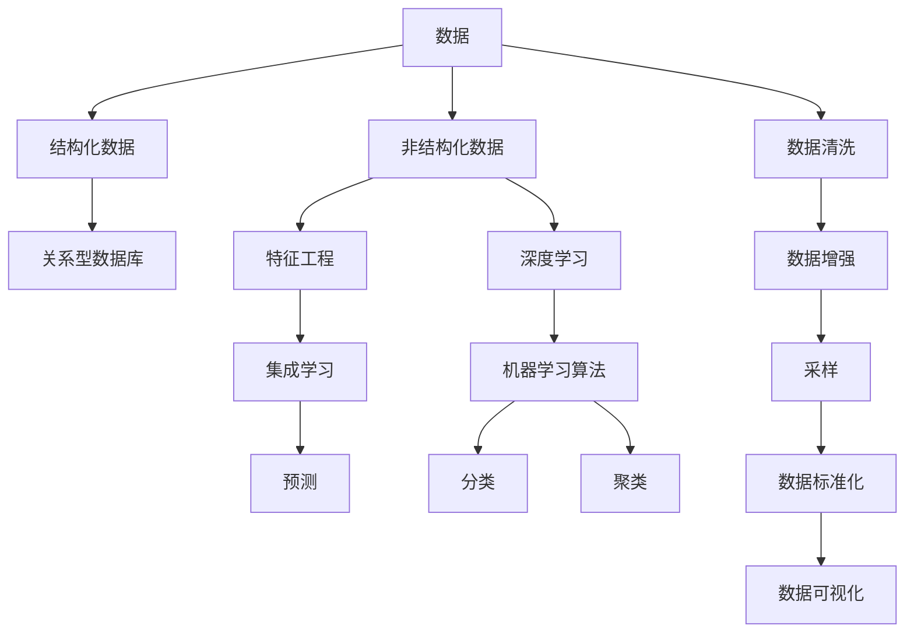

                 

# 理解世界的复杂性：从结构到洞见

在复杂的世界中，我们如何通过结构化视角和算法洞见来理解和处理信息？本文将深入探讨这一问题，从理论基础到实践应用，为读者提供一个全面的视角。

## 1. 背景介绍

### 1.1 问题由来

在信息爆炸的时代，我们每天面对的是海量的数据和复杂的现实问题。传统的经验直觉和简单的线性模型已经难以处理这些复杂现象。在人工智能领域，结构化和洞见的概念开始变得重要。这不仅在于算法本身，更在于如何构建能够理解和解析复杂结构的工具。

### 1.2 问题核心关键点

问题的核心在于，我们需要从数据中提取结构，并用这种结构来洞见数据的本质，从而进行预测、分类、聚类等任务。结构化视角强调数据的内在关系，而洞见则关注于如何利用这些关系进行决策。

## 2. 核心概念与联系

### 2.1 核心概念概述

1. **结构化数据**：指那些有明确内在关系的数据，如关系型数据库中的表结构、知识图谱中的节点和边。结构化数据帮助我们理解数据间的依赖关系，为分析提供依据。

2. **非结构化数据**：指那些没有明确内在关系的数据，如文本、图像、音频等。非结构化数据需要通过算法进行处理，提取结构化信息。

3. **机器学习算法**：一系列使计算机能够从数据中学习和预测的算法。算法依赖于数据结构来提取模式和洞见。

4. **深度学习**：一种使用多层神经网络进行复杂数据分析和模式识别的技术，适用于非结构化数据，能够自动提取高级特征。

5. **集成学习**：通过组合多个学习器来提高整体性能的技术。集成学习有助于处理复杂数据和构建稳定模型。

6. **特征工程**：选择、提取和构造数据的特征以提高模型的性能。好的特征工程能够显著提升算法的表现。

这些概念相互联系，共同构成了从数据到洞见的桥梁。

### 2.2 核心概念原理和架构的 Mermaid 流程图



这个流程图展示了数据处理和分析的完整流程：从原始数据开始，经过清洗和增强，提取特征，应用深度学习算法，进行机器学习，最终进行预测、分类和聚类等任务。

## 3. 核心算法原理 & 具体操作步骤

### 3.1 算法原理概述

机器学习算法的基本原理是从数据中提取模式和关系。这些模式和关系构成了算法的结构和洞见。具体而言：

1. **监督学习**：通过有标签数据训练模型，使其能够对未知数据进行预测。常用的监督学习算法有决策树、支持向量机、神经网络等。

2. **无监督学习**：通过无标签数据训练模型，发现数据的内在结构和关系。常用的无监督学习算法有聚类、降维、关联规则等。

3. **半监督学习**：结合有标签和无标签数据进行训练，通常能获得比单独使用有标签或无标签数据更好的结果。

4. **强化学习**：通过与环境的交互学习决策策略，使得算法能够在复杂环境中进行自适应。

### 3.2 算法步骤详解

1. **数据预处理**：包括数据清洗、特征提取、标准化和增强等步骤。

2. **模型选择和训练**：根据任务需求选择合适的模型，并使用训练集进行模型训练。

3. **模型评估和调优**：在验证集上评估模型性能，并通过超参数调优等手段提高模型表现。

4. **模型部署和应用**：将模型部署到实际环境中，进行预测、分类、聚类等任务。

### 3.3 算法优缺点

**优点**：

1. **自动化**：机器学习算法能够自动发现数据中的模式和关系，减少了人工干预。

2. **可扩展性**：算法可以处理大规模数据集，适用于复杂的现实问题。

3. **高准确性**：在许多任务上，机器学习算法已经取得了超过人类的表现。

**缺点**：

1. **数据依赖性**：算法效果高度依赖于数据的质量和数量，数据偏差可能导致模型偏差。

2. **复杂性**：机器学习模型往往复杂，难以解释和调试。

3. **计算需求高**：训练大规模模型需要高性能计算资源。

### 3.4 算法应用领域

机器学习算法广泛应用于金融、医疗、零售、物流、智能制造等多个领域。如：

- **金融风控**：通过分析历史交易数据，预测交易风险和欺诈行为。
- **医疗诊断**：通过分析病历数据，辅助医生进行疾病诊断和治疗。
- **零售推荐**：通过分析用户行为数据，推荐个性化的商品和服务。
- **物流优化**：通过分析货物运输数据，优化物流路径和配送。
- **智能制造**：通过分析设备运行数据，预测设备故障和维护需求。

## 4. 数学模型和公式 & 详细讲解

### 4.1 数学模型构建

在监督学习中，常用的数学模型包括线性回归、决策树、支持向量机、神经网络等。以线性回归为例：

$$ y = \theta_0 + \sum_{i=1}^n \theta_i x_i + \epsilon $$

其中，$y$ 为预测值，$x_i$ 为特征，$\theta_i$ 为模型参数，$\epsilon$ 为误差项。

### 4.2 公式推导过程

以线性回归为例，推导最小二乘法目标函数：

$$ \sum_{i=1}^N (y_i - \theta_0 - \sum_{j=1}^n \theta_j x_{ij})^2 $$

目标是最小化预测值与实际值之间的平方误差。根据梯度下降算法，求解目标函数的极小值：

$$ \frac{\partial \mathcal{L}}{\partial \theta_0} = -2\sum_{i=1}^N (y_i - \theta_0 - \sum_{j=1}^n \theta_j x_{ij}) $$
$$ \frac{\partial \mathcal{L}}{\partial \theta_j} = -2\sum_{i=1}^N (y_i - \theta_0 - \sum_{j=1}^n \theta_j x_{ij}) x_{ij} $$

### 4.3 案例分析与讲解

假设有一个房价预测任务，特征包括房屋面积、卧室数量、位置等。使用线性回归模型进行训练和预测。模型参数通过梯度下降算法优化，最小化预测误差。

## 5. 项目实践：代码实例和详细解释说明

### 5.1 开发环境搭建

使用Python进行机器学习开发，需要安装NumPy、SciPy、Pandas等科学计算库。以下是一个简单的环境配置示例：

```bash
conda create -n my_env python=3.8
conda activate my_env
pip install numpy scipy pandas scikit-learn matplotlib seaborn
```

### 5.2 源代码详细实现

以线性回归为例，使用Scikit-learn库进行模型实现。代码如下：

```python
from sklearn.linear_model import LinearRegression
from sklearn.model_selection import train_test_split
from sklearn.metrics import mean_squared_error

# 准备数据
X = pd.read_csv('data.csv')
y = X['price']
X = X.drop(['price'], axis=1)

# 分割数据集
X_train, X_test, y_train, y_test = train_test_split(X, y, test_size=0.2)

# 训练模型
model = LinearRegression()
model.fit(X_train, y_train)

# 预测并评估
y_pred = model.predict(X_test)
mse = mean_squared_error(y_test, y_pred)
print(f"MSE: {mse}")
```

### 5.3 代码解读与分析

**数据准备**：使用Pandas库读取CSV文件，准备训练数据集和测试数据集。

**模型训练**：使用Scikit-learn库的LinearRegression类进行线性回归模型训练，通过fit方法拟合训练数据。

**预测和评估**：使用训练好的模型对测试数据进行预测，并使用均方误差作为评估指标。

### 5.4 运行结果展示

运行代码后，输出预测误差。如果模型表现良好，预测误差应较小。

## 6. 实际应用场景

### 6.1 智能制造

在智能制造领域，机器学习算法可以用于预测设备故障、优化生产流程、质量控制等。如通过分析传感器数据，预测设备故障时间，提前进行维护，减少生产停机时间。

### 6.2 金融风控

在金融风控领域，机器学习算法可以用于风险评估、信用评分、欺诈检测等。如通过分析用户交易记录，预测其违约概率，从而制定相应的风险管理策略。

### 6.3 医疗诊断

在医疗诊断领域，机器学习算法可以用于疾病预测、影像分析、基因分析等。如通过分析患者病历和基因数据，预测其患病风险，辅助医生进行诊断和治疗决策。

### 6.4 零售推荐

在零售推荐领域，机器学习算法可以用于商品推荐、个性化定价、库存管理等。如通过分析用户购买历史和浏览记录，推荐其可能感兴趣的商品，提高销售额。

## 7. 工具和资源推荐

### 7.1 学习资源推荐

1. **《机器学习》（周志华著）**：经典的机器学习教材，系统讲解了监督学习、无监督学习、强化学习等基本概念和算法。
2. **Coursera《机器学习》课程**：由斯坦福大学教授Andrew Ng主讲，涵盖机器学习的核心概念和算法，适合初学者和进阶者。
3. **Kaggle竞赛平台**：通过参加机器学习竞赛，实战练习模型构建和评估。

### 7.2 开发工具推荐

1. **Jupyter Notebook**：轻量级开发环境，支持Python、R等语言，便于编写和运行代码。
2. **TensorFlow**：Google开发的深度学习框架，支持分布式计算，适用于大规模模型训练。
3. **PyTorch**：Facebook开发的深度学习框架，灵活性高，适用于快速迭代研究。
4. **Scikit-learn**：Python机器学习库，提供了丰富的算法和工具，易于上手使用。

### 7.3 相关论文推荐

1. **深度学习**：《Deep Learning》（Ian Goodfellow、Yoshua Bengio、Aaron Courville著）。
2. **集成学习**：《Ensemble Methods for Classification》（Jianbo Shi、Li Fei-Fei著）。
3. **强化学习**：《Reinforcement Learning: An Introduction》（Richard S. Sutton、Andrew G. Barto著）。

## 8. 总结：未来发展趋势与挑战

### 8.1 研究成果总结

机器学习算法在过去几十年中取得了巨大进展，广泛应用于各个领域。未来，机器学习将继续发展和创新，帮助人类更好地理解世界。

### 8.2 未来发展趋势

1. **自适应学习**：未来的机器学习算法将更加自适应，能够动态调整模型参数，应对数据变化。
2. **跨模态学习**：结合不同模态的数据，如文本、图像、音频等，提升模型的综合能力。
3. **联邦学习**：通过分布式计算，保护数据隐私，同时提升模型性能。
4. **深度强化学习**：将深度学习和强化学习结合，处理更复杂的决策问题。
5. **神经符号结合**：结合神经网络和符号系统，构建更加智能和可解释的系统。

### 8.3 面临的挑战

1. **数据质量**：数据偏差、噪声和不完整性可能导致模型效果不佳。
2. **模型复杂性**：大规模、复杂模型难以解释和调试。
3. **计算资源**：训练和部署大规模模型需要高性能计算资源。
4. **伦理和安全**：机器学习算法的决策过程和输出结果需要考虑伦理和安全问题。

### 8.4 研究展望

未来的研究应在以下方面继续推进：

1. **可解释性**：开发更具可解释性的算法，让模型决策过程透明化。
2. **公平性**：确保机器学习算法不会引入或放大数据中的偏见。
3. **隐私保护**：保护用户数据隐私，防止数据泄露和滥用。
4. **跨领域应用**：将机器学习算法应用于更多领域，解决复杂现实问题。

## 9. 附录：常见问题与解答

**Q1: 机器学习算法和深度学习算法的区别是什么？**

A: 机器学习算法是广义的概念，包括监督学习、无监督学习和强化学习。深度学习算法是机器学习算法的一种，通过多层神经网络进行特征提取和模式识别。深度学习算法适用于非结构化数据的处理，如图像、音频等。

**Q2: 如何评估机器学习算法的性能？**

A: 常用的性能指标包括准确率、召回率、F1分数、均方误差、均方根误差等。根据具体任务选择合适的指标进行评估。

**Q3: 如何优化机器学习算法？**

A: 优化算法的方法包括超参数调优、特征选择、模型集成、正则化等。通过实验和调参，找到最优的算法配置。

**Q4: 机器学习算法在实际应用中面临哪些挑战？**

A: 数据质量、模型复杂性、计算资源、伦理和安全等是机器学习算法在实际应用中面临的主要挑战。

---

作者：禅与计算机程序设计艺术 / Zen and the Art of Computer Programming

