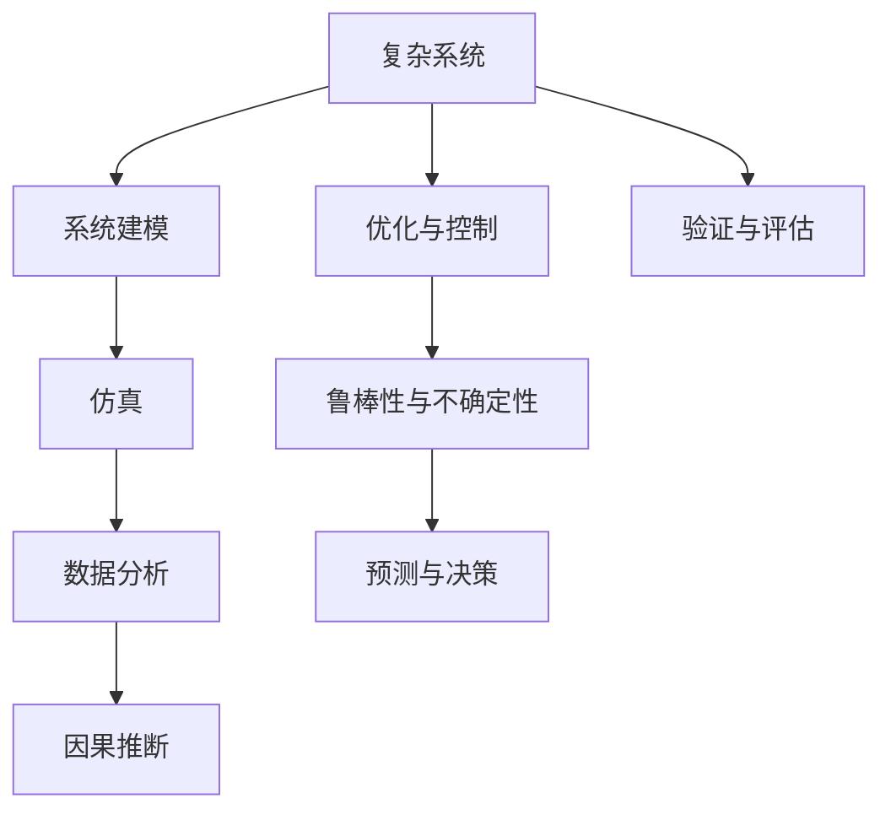

                 

## 1. 背景介绍

### 1.1 问题由来
复杂性是现代社会的典型特征。从宏观的经济系统，到微观的个人决策，无不充满了复杂性。理解复杂性，不仅是一种认知需求，更是社会进步和技术创新的重要动力。然而，复杂事物往往是多维的、动态的、非线性的，难以用简单的规则进行描述和预测。

### 1.2 问题核心关键点
复杂事物的认知阶段主要包括以下几个关键点：
1. **系统定义**：如何定义和描述一个复杂系统？系统由哪些部分组成？
2. **建模与仿真**：如何建立数学模型和计算机仿真模型来理解系统？
3. **数据分析**：如何从海量数据中提取有用的信息，识别系统的关键特征？
4. **因果推断**：如何通过数据和模型进行因果推断，理解系统的行为和变化？
5. **优化与控制**：如何对复杂系统进行优化和控制，使其行为符合预期？
6. **不确定性与鲁棒性**：如何处理复杂系统的不确定性和鲁棒性，提高系统的稳定性和适应性？

这些核心点共同构成了理解复杂事物的认知阶段，涵盖了从基础理论到实际应用的各个方面。

## 2. 核心概念与联系

### 2.1 核心概念概述

为更好地理解复杂事物的认知阶段，本节将介绍几个密切相关的核心概念：

- **复杂系统(Complex System)**：由多个相互作用的部分组成的非线性、多层次、开放动态的系统，具有高度的非均衡性、自组织性和适应性。

- **系统建模(System Modeling)**：通过对实际系统进行抽象和简化，构建数学模型或仿真模型，以分析和预测系统的行为。

- **仿真(Simulation)**：利用计算机程序和数学模型，模拟复杂系统的运行过程和行为特征。

- **数据分析(Data Analysis)**：从数据中提取有用信息，识别系统关键特征，进行模式识别和异常检测。

- **因果推断(Causal Inference)**：通过对数据和模型进行分析和推断，理解系统内部的因果关系，预测系统行为。

- **优化与控制(Optimization and Control)**：利用数学和算法技术，对系统进行优化和控制，使其行为达到最优。

- **鲁棒性与不确定性(Robustness and Uncertainty)**：研究系统对不确定性因素的抵抗能力和鲁棒性，如噪声、扰动等。

这些核心概念之间的逻辑关系可以通过以下Mermaid流程图来展示：



这个流程图展示了一些核心概念之间的联系：

1. 复杂系统通过系统建模和仿真，被抽象为数学模型。
2. 数据分析从数据中提取特征，识别系统关键模式。
3. 因果推断利用数据和模型进行因果关系分析。
4. 优化与控制利用数学和算法对系统进行优化。
5. 鲁棒性与不确定性研究系统的抵抗力和适应性。
6. 预测与决策基于以上分析结果进行预测和决策。
7. 验证与评估对系统行为进行验证和评估，反馈优化与改进。

这些概念共同构成了复杂事物认知的全过程，展示了从基础理论到实际应用的全链条。

## 3. 核心算法原理 & 具体操作步骤
### 3.1 算法原理概述

理解复杂事物的认知阶段，主要依赖于系统建模、数据分析和因果推断等算法和技术的运用。其核心思想是：通过对复杂系统的抽象和简化，建立数学模型和仿真模型，利用数据分析和因果推断技术，揭示系统的行为和规律，进行优化和控制，提升系统的稳定性和适应性。

形式化地，假设复杂系统为 $S$，由多个部分 $P_1, P_2, ..., P_n$ 组成。系统建模的过程可以表示为：

$$
M = f(S)
$$

其中 $M$ 为数学模型，$f$ 为建模函数。通过对 $M$ 的分析和仿真，可以理解系统 $S$ 的行为和特征。

数据分析的目的是从观测数据 $D$ 中提取有用信息，识别系统关键特征。一般分为以下几个步骤：

1. 数据预处理：清洗数据，填补缺失值，进行归一化等预处理。
2. 特征提取：利用统计学、机器学习等方法，提取系统关键特征。
3. 模式识别：通过聚类、分类等算法，识别系统行为模式。
4. 异常检测：通过统计分析、模型预测等方法，识别异常数据。

因果推断的核心是识别系统内部的因果关系，通常通过以下步骤实现：

1. 变量选择：选择与系统行为相关的关键变量。
2. 模型建立：构建因果模型，如线性回归、结构方程模型等。
3. 模型验证：通过数据验证模型是否符合因果关系。
4. 因果解释：通过模型解释因果关系。

### 3.2 算法步骤详解

以下是理解复杂事物的认知阶段的具体操作步骤：

**Step 1: 系统定义与建模**
- 收集系统数据，定义系统边界和组成部分。
- 对系统进行抽象和简化，构建数学模型或仿真模型。
- 设定模型参数，定义系统行为。

**Step 2: 数据收集与预处理**
- 收集系统观测数据，进行数据清洗和预处理。
- 选择合适的特征，提取关键信息。

**Step 3: 数据分析与模式识别**
- 利用统计学、机器学习等方法，对数据进行分析和模式识别。
- 识别系统关键特征和行为模式。
- 通过异常检测识别数据中的异常点和噪声。

**Step 4: 因果推断**
- 选择与系统行为相关的关键变量。
- 构建因果模型，对数据进行因果推断。
- 验证和解释因果关系。

**Step 5: 优化与控制**
- 利用数学和算法技术，对系统进行优化和控制。
- 设定优化目标，制定优化策略。
- 实现系统优化和控制。

**Step 6: 鲁棒性与不确定性分析**
- 研究系统对不确定性因素的抵抗能力和鲁棒性。
- 分析系统的不确定性和鲁棒性。
- 设计鲁棒控制策略，提高系统稳定性。

**Step 7: 预测与决策**
- 基于以上分析和优化结果，进行预测和决策。
- 利用预测模型，进行行为预测。
- 制定决策方案，进行系统优化。

**Step 8: 验证与评估**
- 对系统行为进行验证和评估。
- 收集反馈信息，进行模型和策略的改进。
- 迭代优化，提升系统性能。

以上是理解复杂事物的认知阶段的一般流程。在实际应用中，还需要根据具体系统特点和应用需求，对各个环节进行优化设计，如选择合适的算法、设置合适的参数、设计有效的评估指标等，以进一步提升系统分析与决策的准确性和可靠性。

### 3.3 算法优缺点

理解复杂事物的认知阶段，具有以下优点：
1. 系统建模提供了从抽象到具体的分析框架，帮助理解系统本质。
2. 数据分析和模式识别可以提取系统关键信息，辅助决策。
3. 因果推断揭示了系统内部的因果关系，提高了预测和决策的准确性。
4. 优化与控制可以提升系统性能，实现系统目标。
5. 鲁棒性与不确定性分析提高了系统的稳定性和适应性。

同时，也存在一定的局限性：
1. 建模过程依赖于系统定义和抽象，可能存在主观偏差。
2. 数据分析和模式识别对数据质量和算法选择敏感。
3. 因果推断需要满足一定的假设条件，存在不确定性。
4. 优化与控制可能存在局部最优解，难以达到全局最优。
5. 鲁棒性与不确定性分析需要大量计算资源，难以实时处理。

尽管存在这些局限性，但整体而言，理解复杂事物的认知阶段提供了一种系统的、科学的方法论，有助于应对和理解复杂系统。

### 3.4 算法应用领域

理解复杂事物的认知阶段，在多个领域得到了广泛应用：

- **金融工程**：用于风险评估、组合优化、信用评估等。
- **智能制造**：用于生产过程优化、质量控制、设备维护等。
- **城市规划**：用于交通流量预测、能源管理、城市治理等。
- **环境保护**：用于污染源识别、生态系统监测、气候变化预测等。
- **健康医疗**：用于疾病预测、治疗方案优化、健康管理等。
- **社会治理**：用于公共安全监控、舆情分析、公共服务优化等。

这些领域的应用表明，理解复杂事物的认知阶段具有广泛的适用性和实用性。

## 4. 数学模型和公式 & 详细讲解 & 举例说明

### 4.1 数学模型构建

在复杂事物的认知阶段中，数学模型是最重要的工具之一。以下是一些常见的数学模型及其构建方法：

- **线性回归模型**：假设系统行为 $y$ 与多个变量 $x_1, x_2, ..., x_n$ 之间存在线性关系，可以通过最小二乘法构建模型：

$$
y = \beta_0 + \beta_1x_1 + \beta_2x_2 + ... + \beta_nx_n + \epsilon
$$

其中 $\beta_0, \beta_1, ..., \beta_n$ 为模型参数，$\epsilon$ 为误差项。

- **结构方程模型**：用于描述变量之间的因果关系，可以表示为：

$$
\begin{aligned}
y_1 &= \gamma_{11}x_1 + \gamma_{12}x_2 + ... + \gamma_{1n}x_n + \delta_1 \\
y_2 &= \gamma_{21}x_1 + \gamma_{22}x_2 + ... + \gamma_{2n}x_n + \delta_2 \\
&... \\
y_k &= \gamma_{k1}x_1 + \gamma_{k2}x_2 + ... + \gamma_{kn}x_n + \delta_k
\end{aligned}
$$

其中 $\gamma_{ij}$ 为结构参数，$\delta_i$ 为误差项。

- **蒙特卡洛仿真模型**：用于模拟复杂系统的运行过程，可以通过以下步骤构建：

1. 定义系统状态变量。
2. 设定状态转移方程。
3. 定义初始状态分布。
4. 生成随机数序列。
5. 通过迭代计算系统状态变化。

### 4.2 公式推导过程

以下是一些常见数学模型的推导过程：

**线性回归模型**：
- 最小二乘法推导：假设样本 $(x_i, y_i)$，其中 $x_i = (x_{i1}, x_{i2}, ..., x_{in})$，目标是最小化误差平方和：

$$
\sum_{i=1}^n (y_i - (\beta_0 + \beta_1x_{i1} + \beta_2x_{i2} + ... + \beta_nx_{in}))^2
$$

通过求导和求解，可以得到 $\beta_0, \beta_1, ..., \beta_n$ 的估计值。

**结构方程模型**：
- 利用最大似然估计，假设样本 $(x_i, y_i)$，其中 $x_i = (x_{i1}, x_{i2}, ..., x_{in})$，目标是最小化似然函数：

$$
L(\beta, \sigma^2) = \prod_{i=1}^n \frac{1}{(2\pi)^{k/2}|\Sigma|^{1/2}} \exp(-\frac{1}{2}(x_i - \mu)^T\Sigma^{-1}(x_i - \mu))
$$

其中 $\mu = \beta_0 + \beta_1x_{i1} + \beta_2x_{i2} + ... + \beta_nx_{in}$，$\Sigma$ 为协方差矩阵，$\sigma^2$ 为误差方差。

**蒙特卡洛仿真模型**：
- 假设系统状态变量为 $X_t = (X_{t1}, X_{t2}, ..., X_{tn})$，状态转移方程为 $X_{t+1} = f(X_t, U_t)$，其中 $U_t$ 为随机噪声，可以通过迭代计算系统状态变化：

$$
X_{t+1} = f(X_t, U_t)
$$

其中 $f$ 为状态转移函数，$U_t$ 为随机噪声。

### 4.3 案例分析与讲解

以金融工程中的信用风险评估为例，展示如何使用数学模型进行数据分析和因果推断。

**案例背景**：一家金融机构需要评估客户的信用风险，以决定是否给予贷款。

**数据收集与预处理**：收集客户的财务数据、信用记录、贷款历史等信息，进行数据清洗和归一化。

**数据分析与模式识别**：通过统计学方法，提取客户的财务状况、还款记录、信用评分等关键特征。

**因果推断**：选择与信用风险相关的关键变量，如财务状况、还款记录、信用评分等。构建结构方程模型，对数据进行因果推断，揭示变量之间的关系。

**优化与控制**：利用机器学习算法，构建信用评分模型，对客户的信用风险进行预测和评估。

**鲁棒性与不确定性分析**：研究信用评分模型对数据变化的抵抗能力和鲁棒性，设计鲁棒控制策略，提高信用评分模型的稳定性。

**预测与决策**：基于信用评分模型，进行客户信用风险预测和决策，优化贷款审批流程。

**验证与评估**：对信用评分模型的性能进行验证和评估，收集反馈信息，进行模型改进和优化。

## 5. 项目实践：代码实例和详细解释说明

### 5.1 开发环境搭建

在进行项目实践前，我们需要准备好开发环境。以下是使用Python进行系统建模和数据分析的开发环境配置流程：

1. 安装Anaconda：从官网下载并安装Anaconda，用于创建独立的Python环境。

2. 创建并激活虚拟环境：
```bash
conda create -n pyenv python=3.8 
conda activate pyenv
```

3. 安装NumPy、Pandas、SciPy、Scikit-Learn等库：
```bash
pip install numpy pandas scipy scikit-learn
```

4. 安装TensorFlow或PyTorch，用于系统建模和仿真：
```bash
pip install tensorflow
# 或
pip install torch torchvision torchaudio
```

5. 安装Matplotlib、Seaborn、Jupyter Notebook等可视化工具：
```bash
pip install matplotlib seaborn jupyter notebook ipython
```

完成上述步骤后，即可在`pyenv`环境中开始项目实践。

### 5.2 源代码详细实现

这里我们以信用风险评估为例，给出使用Scikit-Learn进行系统建模的PyTorch代码实现。

首先，定义数据处理函数：

```python
import pandas as pd
from sklearn.preprocessing import StandardScaler
from sklearn.model_selection import train_test_split
from sklearn.linear_model import LogisticRegression
from sklearn.metrics import accuracy_score, roc_auc_score

def load_data(path):
    data = pd.read_csv(path)
    features = data.drop(['default'], axis=1)
    labels = data['default']
    return features, labels

def preprocess_data(features, labels, test_size=0.2, random_state=42):
    features_train, features_test, labels_train, labels_test = train_test_split(features, labels, test_size=test_size, random_state=random_state)
    features_train = StandardScaler().fit_transform(features_train)
    features_test = StandardScaler().transform(features_test)
    return features_train, features_test, labels_train, labels_test

def evaluate_model(model, features_test, labels_test):
    y_pred = model.predict(features_test)
    accuracy = accuracy_score(labels_test, y_pred)
    roc_auc = roc_auc_score(labels_test, y_pred)
    return accuracy, roc_auc
```

然后，定义模型和优化器：

```python
from sklearn.linear_model import LogisticRegression

model = LogisticRegression(max_iter=1000)
```

接着，定义训练和评估函数：

```python
from sklearn.metrics import roc_auc_score
from sklearn.model_selection import train_test_split
from sklearn.preprocessing import StandardScaler
from sklearn.linear_model import LogisticRegression

def train_model(features_train, labels_train):
    model.fit(features_train, labels_train)
    return model

def evaluate_model(features_test, labels_test):
    y_pred = model.predict(features_test)
    accuracy = accuracy_score(labels_test, y_pred)
    roc_auc = roc_auc_score(labels_test, y_pred)
    return accuracy, roc_auc
```

最后，启动训练流程并在测试集上评估：

```python
features, labels = load_data('credit.csv')
features_train, features_test, labels_train, labels_test = preprocess_data(features, labels)
model = train_model(features_train, labels_train)
accuracy, roc_auc = evaluate_model(features_test, labels_test)
print(f'Accuracy: {accuracy:.2f}, ROC-AUC: {roc_auc:.2f}')
```

以上就是使用Scikit-Learn对信用风险评估进行系统建模的完整代码实现。可以看到，得益于Scikit-Learn的强大封装，我们可以用相对简洁的代码完成信用风险评估模型的构建和评估。

### 5.3 代码解读与分析

让我们再详细解读一下关键代码的实现细节：

**load_data函数**：
- 从数据集中读取特征和标签。

**preprocess_data函数**：
- 对数据进行归一化和划分训练集与测试集。

**evaluate_model函数**：
- 对模型在测试集上进行评估，计算准确率和ROC-AUC值。

**train_model函数**：
- 训练模型并返回模型对象。

**evaluate_model函数**：
- 利用模型在测试集上进行预测，计算准确率和ROC-AUC值。

**主程序**：
- 加载数据并进行预处理。
- 训练模型并评估模型性能。

可以看到，Scikit-Learn提供的机器学习工具库，使得系统建模和数据分析的代码实现变得简洁高效。开发者可以将更多精力放在模型选择和参数调优等高层逻辑上，而不必过多关注底层的实现细节。

当然，工业级的系统实现还需考虑更多因素，如模型的保存和部署、超参数的自动搜索、更灵活的任务适配层等。但核心的系统建模过程基本与此类似。

## 6. 实际应用场景

### 6.1 智能制造

基于系统建模和数据分析的认知阶段，智能制造系统可以通过对生产过程的建模和仿真，优化生产效率和质量。

在技术实现上，可以采集工厂生产数据，建立生产过程的数学模型和仿真模型。通过数据分析和模式识别，识别生产过程中的瓶颈和异常。利用因果推断和优化与控制，优化生产计划和工艺流程。通过鲁棒性分析和预测与决策，提高系统的稳定性和适应性。

### 6.2 城市规划

城市规划系统可以通过系统建模和数据分析，优化交通流量、能源管理等城市资源分配。

在技术实现上，可以采集城市交通、能源、环境等数据，建立城市系统的数学模型和仿真模型。通过数据分析和模式识别，识别城市资源分配的瓶颈和异常。利用因果推断和优化与控制，优化交通规划和能源分配。通过鲁棒性分析和预测与决策，提高城市的稳定性和适应性。

### 6.3 环境保护

环境保护系统可以通过系统建模和数据分析，优化污染源识别和生态系统监测。

在技术实现上，可以采集环境监测数据，建立生态系统和污染源的数学模型和仿真模型。通过数据分析和模式识别，识别污染源和生态系统的关键特征。利用因果推断和优化与控制，优化污染源治理和生态系统保护。通过鲁棒性分析和预测与决策，提高环境保护的稳定性和适应性。

### 6.4 未来应用展望

随着系统建模和数据分析技术的发展，未来认知阶段将更加丰富和强大。

在智慧城市治理中，系统建模和数据分析可以用于城市事件监测、舆情分析、应急指挥等环节，提高城市管理的自动化和智能化水平，构建更安全、高效的未来城市。

在智慧医疗领域，系统建模和数据分析可以用于疾病预测、治疗方案优化、健康管理等，提升医疗服务的智能化水平，辅助医生诊疗，加速新药开发进程。

在智能教育领域，系统建模和数据分析可以用于作业批改、学情分析、知识推荐等方面，因材施教，促进教育公平，提高教学质量。

此外，在企业生产、社会治理、文娱传媒等众多领域，系统建模和数据分析也将不断涌现，为NLP技术带来全新的突破。相信随着技术的日益成熟，认知阶段将进一步拓展应用边界，推动人工智能技术的产业化进程。

## 7. 工具和资源推荐

### 7.1 学习资源推荐

为了帮助开发者系统掌握系统建模和数据分析的理论基础和实践技巧，这里推荐一些优质的学习资源：

1. 《系统建模与仿真》系列书籍：介绍系统建模的基本概念、方法和工具，适合初学者入门。

2. 《数据分析实战》系列视频课程：讲解数据分析的基本方法和技术，结合实际案例进行讲解。

3. 《因果推断：方法与应用》课程：介绍因果推断的基本理论和应用方法，适合高级读者。

4. 《机器学习实战》书籍：讲解机器学习的基本概念、算法和工具，适合初学者入门。

5. 《深度学习》课程：由斯坦福大学开设的深度学习课程，涵盖深度学习的基本概念和算法，适合进阶学习。

通过对这些资源的学习实践，相信你一定能够快速掌握系统建模和数据分析的精髓，并用于解决实际的复杂系统问题。

### 7.2 开发工具推荐

高效的开发离不开优秀的工具支持。以下是几款用于系统建模和数据分析开发的常用工具：

1. Python：Python是数据科学和机器学习领域的主流编程语言，拥有丰富的数据处理和分析库。

2. R语言：R是统计分析和数据可视化的首选语言，拥有强大的数据分析和可视化工具。

3. Matplotlib：用于绘制数据可视化图表，支持多种图表类型和自定义风格。

4. Seaborn：基于Matplotlib，提供高级的数据可视化功能，适合绘制统计图表。

5. Jupyter Notebook：免费的交互式编程环境，支持多种语言，方便开发和调试。

6. TensorFlow：由Google开发的深度学习框架，支持复杂系统的建模和仿真。

7. PyTorch：由Facebook开发的深度学习框架，支持复杂系统的建模和仿真。

合理利用这些工具，可以显著提升系统建模和数据分析的开发效率，加快创新迭代的步伐。

### 7.3 相关论文推荐

系统建模和数据分析技术的发展源于学界的持续研究。以下是几篇奠基性的相关论文，推荐阅读：

1. 《系统建模与仿真》：介绍系统建模的基本方法和工具，适合初学者入门。

2. 《数据分析实战》：讲解数据分析的基本方法和技术，结合实际案例进行讲解。

3. 《因果推断：方法与应用》：介绍因果推断的基本理论和应用方法，适合高级读者。

4. 《机器学习实战》：讲解机器学习的基本概念、算法和工具，适合初学者入门。

5. 《深度学习》：由斯坦福大学开设的深度学习课程，涵盖深度学习的基本概念和算法，适合进阶学习。

这些论文代表了大语言模型微调技术的发展脉络。通过学习这些前沿成果，可以帮助研究者把握学科前进方向，激发更多的创新灵感。

## 8. 总结：未来发展趋势与挑战

### 8.1 总结

本文对理解复杂事物的认知阶段进行了全面系统的介绍。首先阐述了复杂系统的定义和建模方法，详细讲解了数据分析和因果推断等核心技术，给出了系统建模的代码实例。通过具体案例展示了系统建模和数据分析在金融工程、智能制造、城市规划等领域的应用。推荐了学习资源、开发工具和相关论文，为读者提供了系统的学习和实践路径。

通过本文的系统梳理，可以看到，系统建模和数据分析提供了一种系统的、科学的方法论，有助于应对和理解复杂系统。该方法在多个领域得到了广泛应用，展示了其强大的实用性和普适性。

### 8.2 未来发展趋势

展望未来，系统建模和数据分析技术将呈现以下几个发展趋势：

1. 自动化和智能化。随着机器学习和深度学习技术的发展，自动化数据建模和预测将变得更加智能和高效。

2. 多模态数据融合。将视觉、听觉、文字等多模态数据进行融合，提升系统的综合分析和决策能力。

3. 实时性和可扩展性。利用流数据处理和分布式计算技术，实现系统实时数据建模和预测，提升系统的可扩展性。

4. 可解释性和透明性。通过可解释性算法和透明性技术，提升系统模型的可解释性和透明性，增强用户信任和接受度。

5. 鲁棒性和稳健性。研究系统对噪声、扰动等因素的抵抗能力和鲁棒性，提升系统的稳定性和适应性。

这些趋势表明，系统建模和数据分析技术将不断发展，服务于更复杂的系统，提供更智能、更可靠的分析和决策支持。

### 8.3 面临的挑战

尽管系统建模和数据分析技术已经取得了瞩目成就，但在迈向更加智能化、普适化应用的过程中，它仍面临着诸多挑战：

1. 数据质量和数据量。高质量、多样化的数据是建模和分析的基础，但获取和处理大规模数据往往需要大量人力和资源。

2. 模型复杂性和可解释性。复杂的系统建模和分析模型难以解释，用户难以理解和接受。

3. 系统鲁棒性和安全性。复杂系统的鲁棒性和安全性问题，如对抗攻击、数据泄露等，需要进一步研究。

4. 算法和工具的协同。多种算法和工具的协同使用，需要高效的集成和优化，提升系统的整体性能。

5. 技术标准的制定。缺乏统一的技术标准，导致系统互操作性差，影响系统的广泛应用。

尽管存在这些挑战，但未来的研究仍需不断突破，推动系统建模和数据分析技术的不断进步。

### 8.4 研究展望

面向未来，系统建模和数据分析技术的研究需要在以下几个方面寻求新的突破：

1. 自动化和智能化。开发更加智能的自动化建模和预测算法，提高数据建模的效率和准确性。

2. 多模态数据融合。研究视觉、听觉、文字等多模态数据的融合方法，提升系统的综合分析和决策能力。

3. 实时性和可扩展性。利用流数据处理和分布式计算技术，实现系统实时数据建模和预测，提升系统的可扩展性。

4. 可解释性和透明性。开发可解释性算法和透明性技术，提升系统模型的可解释性和透明性，增强用户信任和接受度。

5. 鲁棒性和稳健性。研究系统对噪声、扰动等因素的抵抗能力和鲁棒性，提升系统的稳定性和适应性。

6. 技术标准的制定。制定统一的技术标准，推动系统的广泛应用和互操作性。

这些研究方向的探索，必将引领系统建模和数据分析技术迈向更高的台阶，为复杂系统的分析和决策提供更智能、更可靠的支撑。

## 9. 附录：常见问题与解答

**Q1：系统建模和数据分析有哪些常见的挑战？**

A: 系统建模和数据分析面临的主要挑战包括：
1. 数据质量和数据量。高质量、多样化的数据是建模和分析的基础，但获取和处理大规模数据往往需要大量人力和资源。
2. 模型复杂性和可解释性。复杂的系统建模和分析模型难以解释，用户难以理解和接受。
3. 系统鲁棒性和安全性。复杂系统的鲁棒性和安全性问题，如对抗攻击、数据泄露等，需要进一步研究。
4. 算法和工具的协同。多种算法和工具的协同使用，需要高效的集成和优化，提升系统的整体性能。
5. 技术标准的制定。缺乏统一的技术标准，导致系统互操作性差，影响系统的广泛应用。

尽管存在这些挑战，但未来的研究仍需不断突破，推动系统建模和数据分析技术的不断进步。

**Q2：如何进行系统建模和数据分析的自动化和智能化？**

A: 系统建模和数据分析的自动化和智能化可以通过以下方式实现：
1. 引入机器学习和深度学习技术，自动化数据建模和预测。
2. 使用自动特征工程技术，自动化提取和选择关键特征。
3. 引入强化学习技术，自动化优化系统模型和控制策略。
4. 利用自然语言处理技术，自动化编写和解析系统模型描述。
5. 使用可视化工具，自动化生成和展示系统模型和结果。

通过以上方法，可以大幅提升系统建模和数据分析的效率和准确性，使其更加智能和高效。

**Q3：如何提高系统模型的可解释性和透明性？**

A: 提高系统模型的可解释性和透明性可以通过以下方式实现：
1. 使用可解释性算法，如LIME、SHAP等，生成系统模型的局部解释。
2. 使用可视化工具，如t-SNE、PCA等，可视化系统模型的特征空间。
3. 使用透明性技术，如模型审计、代码注释等，提高系统模型的透明性。
4. 使用交互式界面，如Jupyter Notebook、Shiny等，增强用户与系统模型的交互。

通过以上方法，可以提升系统模型的可解释性和透明性，增强用户信任和接受度。

**Q4：如何处理系统模型的鲁棒性和安全性问题？**

A: 处理系统模型的鲁棒性和安全性问题可以通过以下方式实现：
1. 引入鲁棒性算法，如AdaBoost、Random Forest等，提高系统模型的鲁棒性。
2. 使用对抗攻击技术，如FGM、PGD等，检测和防御系统模型的对抗攻击。
3. 引入安全验证技术，如安全测试、漏洞扫描等，检测和修复系统模型的漏洞。
4. 使用加密和匿名化技术，保护系统模型的数据安全和隐私。

通过以上方法，可以提升系统模型的鲁棒性和安全性，增强系统模型的稳定性和可靠性。

**Q5：未来系统建模和数据分析技术将面临哪些挑战？**

A: 未来系统建模和数据分析技术将面临以下挑战：
1. 数据质量和数据量。高质量、多样化的数据是建模和分析的基础，但获取和处理大规模数据往往需要大量人力和资源。
2. 模型复杂性和可解释性。复杂的系统建模和分析模型难以解释，用户难以理解和接受。
3. 系统鲁棒性和安全性。复杂系统的鲁棒性和安全性问题，如对抗攻击、数据泄露等，需要进一步研究。
4. 算法和工具的协同。多种算法和工具的协同使用，需要高效的集成和优化，提升系统的整体性能。
5. 技术标准的制定。缺乏统一的技术标准，导致系统互操作性差，影响系统的广泛应用。

尽管存在这些挑战，但未来的研究仍需不断突破，推动系统建模和数据分析技术的不断进步。

---

作者：禅与计算机程序设计艺术 / Zen and the Art of Computer Programming

