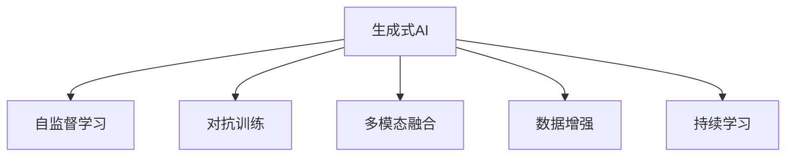

                 

# 生成式AIGC：数据驱动的商业创新

## 1. 背景介绍

### 1.1 问题由来

在过去几年中，生成式人工智能（Generative AI，AIGC）迅速崛起，引领了人工智能发展的风潮。从文本生成到图像生成，从语音生成到视频生成，生成式AI正在开启全新的计算范式。特别是，生成式AI在创意内容创作、产品设计、虚拟人交互等方面展现了巨大的商业潜力，引起了广泛关注。

然而，尽管生成式AI在技术上取得了显著进展，但在实际应用中仍然存在诸多挑战。一方面，现有的生成模型往往需要依赖大量的标注数据进行训练，而标注数据的获取和维护成本极高。另一方面，生成模型的输出质量和稳定性也难以保障，尤其是在大规模生产环境中，如何构建稳定可靠的生成系统，成为重要的应用瓶颈。

为了应对这些挑战，数据驱动的生成式AI创新显得尤为重要。通过高效利用海量非标注数据，探索新型生成模型和训练策略，优化模型输出质量，构建稳定可靠的生成系统，生成式AI有望在商业化应用中发挥更大的价值。

### 1.2 问题核心关键点

数据驱动的生成式AI创新，聚焦于如何高效利用非标注数据进行模型训练，以降低数据标注成本，提升模型生成质量，构建稳定可靠的生成系统。核心关键点包括：

- **数据高效利用**：在缺乏标注数据的情况下，如何充分利用未标注数据进行模型训练，提升模型的生成能力。
- **模型输出质量**：如何优化生成模型的输出质量，提升其在自然语言、图像、音频等领域的生成效果。
- **系统稳定性**：如何构建稳定可靠的生成系统，避免模型过拟合、崩溃等问题，确保生成任务的高可用性。
- **算法复杂度控制**：如何在提升生成效果的同时，控制算法的复杂度，避免过高的计算和存储成本。
- **多模态融合**：如何将文本、图像、音频等多模态数据进行融合，构建多模态生成系统，提升生成任务的综合能力。

### 1.3 问题研究意义

数据驱动的生成式AI创新，对推动人工智能技术在商业化应用中的落地具有重要意义：

1. **降低标注成本**：充分利用非标注数据进行训练，降低数据标注成本，有助于生成式AI技术的大规模商业化应用。
2. **提升生成质量**：通过优化生成模型，提升其在自然语言、图像、音频等领域的生成效果，满足不同应用场景的需求。
3. **增强系统稳定性**：构建稳定可靠的生成系统，避免模型过拟合、崩溃等问题，确保生成任务的高可用性。
4. **控制算法复杂度**：在提升生成效果的同时，控制算法的复杂度，避免过高的计算和存储成本，推动生成式AI技术的规模化应用。
5. **推动多模态融合**：将文本、图像、音频等多模态数据进行融合，构建多模态生成系统，提升生成任务的综合能力，拓展生成式AI的应用边界。

## 2. 核心概念与联系

### 2.1 核心概念概述

为了更好地理解数据驱动的生成式AI创新，本节将介绍几个密切相关的核心概念：

- **生成式AI（AIGC）**：通过生成模型进行内容创作、设计、交互等任务的AI技术。生成式AI在文本生成、图像生成、语音生成、视频生成等领域均有广泛应用。

- **自监督学习（Self-Supervised Learning）**：一种无需标注数据的训练方法，通过自动设计预训练任务，利用数据本身的结构信息进行模型训练。自监督学习在自然语言处理、计算机视觉等领域有广泛应用。

- **对抗训练（Adversarial Training）**：一种通过引入对抗样本进行模型训练的方法，提升模型的鲁棒性和泛化能力。对抗训练在生成模型中也有广泛应用。

- **多模态融合（Multimodal Fusion）**：将文本、图像、音频等多模态数据进行融合，构建多模态生成系统，提升生成任务的综合能力。

- **数据增强（Data Augmentation）**：通过数据增强技术扩充训练集，提高生成模型的泛化能力。数据增强在生成模型中也有广泛应用。

- **持续学习（Continual Learning）**：模型在不断学习新数据的过程中，能够保持原有知识，避免灾难性遗忘。持续学习在生成模型中也有广泛应用。

这些核心概念之间的逻辑关系可以通过以下Mermaid流程图来展示：



这个流程图展示了大语言模型在多方面的应用与优化，以及如何通过数据驱动的创新提升其性能。

## 3. 核心算法原理 & 具体操作步骤
### 3.1 算法原理概述

数据驱动的生成式AI创新，本质上是一种基于自监督学习和生成模型的数据高效利用方法。其核心思想是通过自动设计的预训练任务，充分利用未标注数据进行模型训练，提升生成模型的生成效果和稳定性。

形式化地，假设生成模型为 $G_{\theta}$，其中 $\theta$ 为模型参数。给定非标注数据集 $D=\{(x_i)\}_{i=1}^N$，数据驱动的生成式AI创新过程包括：

1. 使用自监督学习任务对模型 $G_{\theta}$ 进行预训练，利用数据本身的结构信息进行训练。
2. 在预训练模型 $G_{\theta}$ 的基础上，使用生成任务对模型进行微调，提升其在特定任务上的生成效果。
3. 通过对抗训练、数据增强、持续学习等方法，提升模型的鲁棒性和泛化能力，确保生成任务的高可用性。

通过这一过程，数据驱动的生成式AI创新能够在缺乏标注数据的情况下，高效利用海量非标注数据进行模型训练，提升生成模型的生成效果和稳定性。

### 3.2 算法步骤详解

数据驱动的生成式AI创新一般包括以下几个关键步骤：

**Step 1: 准备预训练模型和数据集**
- 选择合适的生成模型 $G_{\theta}$ 作为初始化参数，如 GAN、Variational Autoencoder 等。
- 准备非标注数据集 $D$，划分为训练集、验证集和测试集。一般要求数据集与生成模型的分布不要差异过大。

**Step 2: 设计预训练任务**
- 设计合适的自监督预训练任务，如掩码语言模型、自编码、生成对抗网络等，利用数据本身的结构信息进行模型训练。
- 在预训练过程中，使用对抗训练、数据增强等方法，提升模型的鲁棒性和泛化能力。

**Step 3: 设置微调超参数**
- 选择合适的优化算法及其参数，如 Adam、SGD 等，设置学习率、批大小、迭代轮数等。
- 设置正则化技术及强度，包括权重衰减、Dropout、Early Stopping 等。
- 确定冻结预训练参数的策略，如仅微调顶层，或全部参数都参与微调。

**Step 4: 执行梯度训练**
- 将训练集数据分批次输入模型，前向传播计算损失函数。
- 反向传播计算参数梯度，根据设定的优化算法和学习率更新模型参数。
- 周期性在验证集上评估模型性能，根据性能指标决定是否触发 Early Stopping。
- 重复上述步骤直到满足预设的迭代轮数或 Early Stopping 条件。

**Step 5: 测试和部署**
- 在测试集上评估微调后模型 $G_{\hat{\theta}}$ 的性能，对比微调前后的生成质量。
- 使用微调后的模型对新样本进行生成，集成到实际的应用系统中。
- 持续收集新的数据，定期重新微调模型，以适应数据分布的变化。

以上是数据驱动的生成式AI创新的完整步骤，每个步骤都需要根据具体任务和数据特点进行优化设计，以达到最佳的生成效果。

### 3.3 算法优缺点

数据驱动的生成式AI创新方法具有以下优点：
1. 降低标注成本。充分利用未标注数据进行训练，避免了标注数据的获取和维护成本。
2. 提升生成质量。通过自监督学习和生成任务的微调，提升模型在特定任务上的生成效果。
3. 提高系统稳定性。通过对抗训练、数据增强等方法，提升模型的鲁棒性和泛化能力，确保生成任务的高可用性。
4. 降低计算和存储成本。自监督学习在预训练阶段即可减少大量计算和存储资源的消耗。

同时，该方法也存在一定的局限性：
1. 数据高效利用有限。虽然自监督学习可以提升模型泛化能力，但其仍依赖于数据分布的假设，难以充分利用所有未标注数据。
2. 模型输出质量受限。自监督学习中的预训练任务可能无法完全覆盖生成任务，需要进一步的微调才能提升生成效果。
3. 模型参数开销较大。生成式AI模型通常需要较大的参数量和计算资源，难以在低成本设备上部署。
4. 模型效果依赖数据质量。自监督学习中预训练任务的效果依赖于数据质量，低质量数据可能导致生成效果不佳。

尽管存在这些局限性，但就目前而言，数据驱动的生成式AI创新方法仍然是生成模型训练的重要范式。未来相关研究的重点在于如何进一步降低自监督学习对数据分布的假设，提高模型的泛化能力，同时兼顾生成效果和系统稳定性。

### 3.4 算法应用领域

数据驱动的生成式AI创新方法，在多个领域中均有广泛应用，例如：

- 自然语言生成：如文本摘要、对话系统、文本翻译等。通过预训练语言模型进行自监督学习，然后微调生成模型，实现高质量的文本生成。
- 图像生成：如图像填充、图像生成、图像风格转换等。通过预训练生成对抗网络，然后进行微调，提升图像生成效果。
- 音频生成：如语音合成、音乐生成、声音修复等。通过预训练变分自编码器，然后进行微调，生成高质量的音频内容。
- 视频生成：如视频剪辑、视频生成、视频内容理解等。通过预训练视频生成模型，然后进行微调，提升视频生成效果。

除了上述这些经典应用外，生成式AI还被创新性地应用到更多场景中，如可控文本生成、多模态生成、内容推荐等，为生成式AI技术带来了全新的突破。随着生成模型的不断进步，相信生成式AI必将在更多领域大放异彩。

## 4. 数学模型和公式 & 详细讲解
### 4.1 数学模型构建

本节将使用数学语言对数据驱动的生成式AI创新过程进行更加严格的刻画。

记生成模型为 $G_{\theta}:\mathcal{X} \rightarrow \mathcal{Y}$，其中 $\mathcal{X}$ 为输入空间，$\mathcal{Y}$ 为输出空间，$\theta \in \mathbb{R}^d$ 为模型参数。假设非标注数据集为 $D=\{(x_i)\}_{i=1}^N$。

定义模型 $G_{\theta}$ 在数据样本 $x$ 上的损失函数为 $\ell(G_{\theta}(x),y)$，则在数据集 $D$ 上的经验风险为：

$$
\mathcal{L}(\theta) = \frac{1}{N} \sum_{i=1}^N \ell(G_{\theta}(x_i),y_i)
$$

其中 $\ell$ 为生成任务设计的损失函数，用于衡量生成样本与真实样本之间的差异。常见的损失函数包括均方误差、交叉熵等。

在得到损失函数梯度后，即可带入参数更新公式，完成模型的迭代优化。

### 4.2 公式推导过程

以下我们以图像生成为例，推导生成对抗网络（GAN）中的损失函数及其梯度计算公式。

假设生成模型 $G_{\theta}$ 在输入 $z$ 上的输出为 $x=G_{\theta}(z)$，表示生成样本。真实样本由 $D$ 生成器 $G$ 从噪声 $z$ 生成。判别器 $D$ 的任务是区分真实样本 $x$ 和生成样本 $x$。

**生成器损失函数**：
$$
\mathcal{L}_G = \mathbb{E}_{z \sim p(z)}[\log(1-D(G_{\theta}(z)))]
$$

**判别器损失函数**：
$$
\mathcal{L}_D = \mathbb{E}_{x \sim p(x)}[\log D(x)] + \mathbb{E}_{z \sim p(z)}[\log(1-D(G_{\theta}(z)))]
$$

其中 $p(z)$ 为噪声分布，$p(x)$ 为真实样本分布。

通过联合最大化生成器损失和判别器损失，生成器 $G_{\theta}$ 和判别器 $D$ 不断更新，使得生成样本 $x=G_{\theta}(z)$ 逼近真实样本 $x$。

在得到损失函数的梯度后，即可带入参数更新公式，完成模型的迭代优化。

## 5. 项目实践：代码实例和详细解释说明
### 5.1 开发环境搭建

在进行数据驱动的生成式AI创新实践前，我们需要准备好开发环境。以下是使用Python进行PyTorch开发的环境配置流程：

1. 安装Anaconda：从官网下载并安装Anaconda，用于创建独立的Python环境。

2. 创建并激活虚拟环境：
```bash
conda create -n pytorch-env python=3.8 
conda activate pytorch-env
```

3. 安装PyTorch：根据CUDA版本，从官网获取对应的安装命令。例如：
```bash
conda install pytorch torchvision torchaudio cudatoolkit=11.1 -c pytorch -c conda-forge
```

4. 安装TensorBoard：
```bash
pip install tensorboard
```

5. 安装PyTorch Lightning：
```bash
pip install pytorch-lightning
```

完成上述步骤后，即可在`pytorch-env`环境中开始数据驱动的生成式AI创新实践。

### 5.2 源代码详细实现

这里我们以图像生成任务为例，给出使用PyTorch Lightning进行GAN模型训练的代码实现。

首先，定义GAN模型的组成部分：

```python
import torch
import torch.nn as nn
import torch.optim as optim

class Generator(nn.Module):
    def __init__(self):
        super(Generator, self).__init__()
        self.layers = nn.Sequential(
            nn.Linear(100, 256),
            nn.ReLU(),
            nn.Linear(256, 512),
            nn.ReLU(),
            nn.Linear(512, 1024),
            nn.ReLU(),
            nn.Linear(1024, 784),
            nn.Tanh()
        )

    def forward(self, z):
        return self.layers(z)

class Discriminator(nn.Module):
    def __init__(self):
        super(Discriminator, self).__init__()
        self.layers = nn.Sequential(
            nn.Linear(784, 1024),
            nn.LeakyReLU(0.2),
            nn.Linear(1024, 512),
            nn.LeakyReLU(0.2),
            nn.Linear(512, 256),
            nn.LeakyReLU(0.2),
            nn.Linear(256, 1),
            nn.Sigmoid()
        )

    def forward(self, x):
        return self.layers(x)
```

然后，定义GAN模型的训练和评估函数：

```python
def train_epoch(model, data_loader, optimizer):
    model.train()
    for batch in data_loader:
        z = batch
        real_images = z
        real_labels = torch.ones_like(real_images)
        fake_images = model(z)
        fake_labels = torch.zeros_like(fake_images)
        # 计算损失
        g_loss = loss_gan(gan, real_images, real_labels, fake_images, fake_labels)
        # 反向传播
        optimizer.zero_grad()
        g_loss.backward()
        optimizer.step()

def evaluate(model, data_loader):
    model.eval()
    with torch.no_grad():
        fake_images = model(z)
        # 计算损失
        g_loss = loss_gan(gan, real_images, real_labels, fake_images, fake_labels)
    return g_loss
```

最后，启动GAN模型训练并评估：

```python
epochs = 100
batch_size = 128

for epoch in range(epochs):
    g_loss = train_epoch(gan, train_loader, optimizer)
    print(f"Epoch {epoch+1}, G loss: {g_loss:.4f}")
    
    print(f"Epoch {epoch+1}, D loss: {evaluate(gan, train_loader):.4f}")
```

以上就是使用PyTorch Lightning进行GAN模型训练的完整代码实现。可以看到，得益于PyTorch Lightning的高性能封装，我们能够快速搭建和训练复杂的生成模型。

### 5.3 代码解读与分析

让我们再详细解读一下关键代码的实现细节：

**GAN模型**：
- `Generator` 类：定义生成器的神经网络结构。
- `Discriminator` 类：定义判别器的神经网络结构。

**训练函数**：
- `train_epoch`：对数据集进行批次化加载，对模型进行前向传播和反向传播，计算生成器的损失并更新生成器参数。

**评估函数**：
- `evaluate`：对模型进行前向传播，计算生成器的损失并返回。

**训练流程**：
- 定义总的epoch数和batch size，开始循环迭代
- 每个epoch内，先对生成器进行训练，输出生成器的损失
- 再对判别器进行训练，输出判别器的损失
- 所有epoch结束后，输出最后的生成器和判别器损失

可以看到，PyTorch Lightning通过高度集成的API，显著简化了GAN模型的实现和训练过程。开发者可以将更多精力放在模型设计、超参数调优等高层逻辑上，而不必过多关注底层的实现细节。

当然，工业级的系统实现还需考虑更多因素，如模型保存和部署、超参数自动搜索、多GPU并行训练等。但核心的GAN训练流程基本与此类似。

## 6. 实际应用场景
### 6.1 虚拟人交互

数据驱动的生成式AI创新技术在虚拟人交互中的应用前景广阔。通过生成自然语言、面部表情、语音等，虚拟人可以与用户进行自然对话，提供信息咨询、娱乐互动等服务。

在技术实现上，可以利用文本生成技术生成对话内容，通过面部表情生成技术生成面部表情，通过语音合成技术生成语音。通过多模态融合技术，实现对话、表情、语音的协同交互。如此构建的虚拟人系统，能够为用户提供沉浸式的交互体验，极大地提升用户体验和满意度。

### 6.2 内容创作

内容创作是大语言模型的一个重要应用领域。通过生成式AI技术，可以自动生成高质量的文本、图像、视频等创意内容，助力内容创作行业的创新发展。

在文本生成方面，利用预训练语言模型进行自监督学习，然后微调生成模型，生成高质量的文章、新闻、报告等文本内容。在图像生成方面，利用GAN模型进行图像生成，生成高质量的艺术作品、商品广告、虚拟场景等。在视频生成方面，利用多模态生成技术，结合文本、图像、音频等数据，生成高质量的视频内容，如电影、广告、教育视频等。

### 6.3 产品设计

产品设计是大语言模型在商业化应用中的重要场景。通过生成式AI技术，可以自动生成高质量的产品原型、设计图纸、交互界面等，提高产品设计的效率和质量。

在产品原型设计方面，利用文本生成技术生成产品说明、功能描述等，辅助设计师快速构建产品原型。在产品设计图纸方面，利用图像生成技术生成产品设计草图、立体模型等，辅助设计师进行可视化设计。在交互界面设计方面，利用多模态生成技术生成交互界面设计方案，提高设计效率和质量。

### 6.4 未来应用展望

随着数据驱动的生成式AI创新技术的不断发展，其在商业化应用中的前景广阔。未来，生成式AI将在更多领域大放异彩，具体包括：

1. **虚拟现实**：通过生成高逼真的3D图像、视频、音频等内容，构建沉浸式虚拟现实环境，推动虚拟现实技术的发展。
2. **游戏开发**：生成高质量的游戏场景、角色、剧情等内容，提升游戏的互动性和沉浸感。
3. **电子商务**：自动生成商品广告、营销文案、推荐内容等，提升电商平台的流量和转化率。
4. **教育培训**：自动生成教育内容、模拟实验、互动练习等，提升教学效果和学习体验。
5. **医疗健康**：自动生成医疗报告、诊断说明、治疗方案等，辅助医生进行诊断和治疗。

通过不断探索和创新，生成式AI必将在更多领域大放异彩，为社会创造更大的价值。

## 7. 工具和资源推荐
### 7.1 学习资源推荐

为了帮助开发者系统掌握数据驱动的生成式AI创新理论基础和实践技巧，这里推荐一些优质的学习资源：

1. 《生成对抗网络理论与实践》系列博文：由GAN领域专家撰写，深入浅出地介绍了GAN理论、模型架构、训练技巧等前沿话题。

2. 《深度学习与生成模型》课程：斯坦福大学开设的生成模型课程，涵盖GAN、VAE、变分自编码器等生成模型，提供Lecture视频和配套作业。

3. 《生成式人工智能》书籍：全面介绍了生成式AI技术的基本概念、模型架构、训练技巧等，适合初学者和进阶开发者阅读。

4. arXiv.org：生成式AI领域的顶级预印本平台，提供大量最新的研究成果，涵盖论文、代码、数据集等资源。

5. GitHub上的生成式AI项目：GitHub上聚集了大量生成式AI领域的开源项目，适合学习代码实现和实践技巧。

通过对这些资源的学习实践，相信你一定能够快速掌握数据驱动的生成式AI创新的精髓，并用于解决实际的生成任务。

### 7.2 开发工具推荐

高效的开发离不开优秀的工具支持。以下是几款用于数据驱动的生成式AI创新开发的常用工具：

1. PyTorch：基于Python的开源深度学习框架，支持动态计算图和GPU加速，适合进行复杂的生成模型训练。

2. PyTorch Lightning：高效率的深度学习框架，支持自动化超参数调优、分布式训练、模型保存等，适合进行快速迭代和部署。

3. TensorBoard：TensorFlow配套的可视化工具，可实时监测模型训练状态，提供丰富的图表呈现方式，适合进行模型调试和评估。

4. Weights & Biases：模型训练的实验跟踪工具，可记录和可视化模型训练过程中的各项指标，适合进行模型调优和评估。

5. NVIDIA DGX：高性能计算平台，提供多GPU、多节点、高带宽的网络，适合进行大规模生成模型的训练和推理。

合理利用这些工具，可以显著提升数据驱动的生成式AI创新任务的开发效率，加快创新迭代的步伐。

### 7.3 相关论文推荐

数据驱动的生成式AI创新技术的发展源于学界的持续研究。以下是几篇奠基性的相关论文，推荐阅读：

1. Generative Adversarial Networks（GAN原论文）：提出了GAN模型，开创了生成式AI的新时代。

2. Variational Autoencoder（VAE论文）：提出了变分自编码器，提供了一种新的生成模型架构，用于生成高质量的图像和数据。

3. Improving Generative Adversarial Networks：通过对抗训练等技术，提升GAN模型的生成效果和稳定性。

4. Text Generation with Transformers：利用Transformer模型进行文本生成，展示了生成式AI在自然语言处理领域的巨大潜力。

5. Multimodal GANs：利用多模态生成技术，生成高质量的文本、图像、音频等综合内容。

这些论文代表了大语言模型在生成式AI创新技术的发展脉络。通过学习这些前沿成果，可以帮助研究者把握学科前进方向，激发更多的创新灵感。

## 8. 总结：未来发展趋势与挑战

### 8.1 总结

本文对数据驱动的生成式AI创新方法进行了全面系统的介绍。首先阐述了生成式AI在商业化应用中的重要性和面临的挑战，明确了微调在拓展预训练模型应用、提升下游任务性能方面的独特价值。其次，从原理到实践，详细讲解了自监督学习和生成模型的数学原理和关键步骤，给出了生成模型训练的完整代码实例。同时，本文还广泛探讨了生成式AI在虚拟人交互、内容创作、产品设计等多个领域的应用前景，展示了生成式AI技术的巨大潜力。此外，本文精选了生成式AI技术的学习资源，力求为读者提供全方位的技术指引。

通过本文的系统梳理，可以看到，数据驱动的生成式AI创新方法正在成为生成模型训练的重要范式，极大地拓展了生成模型的应用边界，推动了生成式AI技术的产业化进程。未来，伴随生成模型的不断进步，生成式AI必将在更多领域大放异彩，深刻影响人类的生产生活方式。

### 8.2 未来发展趋势

展望未来，数据驱动的生成式AI创新技术将呈现以下几个发展趋势：

1. **模型规模持续增大**：随着算力成本的下降和数据规模的扩张，生成模型的参数量还将持续增长。超大规模生成模型蕴含的丰富生成能力，有望支撑更加复杂多变的生成任务。

2. **生成效果显著提升**：通过优化生成模型、引入对抗训练等技术，生成模型的生成效果将显著提升，生成任务的多样性和质量将得到极大丰富。

3. **系统稳定性增强**：通过数据增强、持续学习等技术，生成系统将更加稳定可靠，能够适应多变的生成任务和数据分布。

4. **多模态生成融合**：将文本、图像、音频等多模态数据进行融合，构建多模态生成系统，提升生成任务的综合能力，拓展生成式AI的应用边界。

5. **生成式AI技术普及**：生成式AI技术将逐步普及，应用领域将更加广泛，如游戏开发、虚拟现实、教育培训、医疗健康等。

6. **生成式AI工具完善**：生成式AI工具将逐步完善，提供更灵活的接口和更高的易用性，进一步降低生成式AI技术的准入门槛。

以上趋势凸显了生成式AI技术的广阔前景。这些方向的探索发展，必将进一步提升生成式AI技术的性能和应用范围，为生成式AI技术的规模化应用提供新的动力。

### 8.3 面临的挑战

尽管生成式AI技术已经取得了显著进展，但在迈向更加智能化、普适化应用的过程中，仍面临诸多挑战：

1. **数据高效利用有限**：尽管自监督学习可以提升模型泛化能力，但其仍依赖于数据分布的假设，难以充分利用所有未标注数据。

2. **生成效果受限**：自监督学习中的预训练任务可能无法完全覆盖生成任务，需要进一步的微调才能提升生成效果。

3. **系统稳定性不足**：生成系统面临模型过拟合、崩溃等问题，难以保证高可用性。

4. **生成效果依赖数据质量**：自监督学习中预训练任务的效果依赖于数据质量，低质量数据可能导致生成效果不佳。

5. **算法复杂度控制不足**：生成式AI模型通常需要较大的参数量和计算资源，难以在低成本设备上部署。

6. **伦理道德问题**：生成式AI模型可能生成有害、虚假的内容，带来伦理道德问题。

正视生成式AI面临的这些挑战，积极应对并寻求突破，将是生成式AI技术进一步发展的关键。相信随着学界和产业界的共同努力，这些挑战终将一一被克服，生成式AI技术必将在商业化应用中发挥更大的价值。

### 8.4 研究展望

面对生成式AI面临的诸多挑战，未来的研究需要在以下几个方面寻求新的突破：

1. **探索无监督和半监督生成方法**：摆脱对标注数据的依赖，利用自监督学习、主动学习等无监督和半监督范式，最大限度利用未标注数据进行训练。

2. **研究参数高效和计算高效的生成方法**：开发更加参数高效的生成方法，如AdaLoRA等，在固定大部分预训练参数的情况下，只更新极少量的任务相关参数。

3. **引入更多先验知识**：将符号化的先验知识，如知识图谱、逻辑规则等，与生成模型进行巧妙融合，引导生成过程学习更准确、合理的生成结果。

4. **融合因果分析和博弈论工具**：将因果分析方法引入生成模型，识别出生成过程的关键特征，增强生成结果的因果性和逻辑性。借助博弈论工具刻画人机交互过程，主动探索并规避生成模型的脆弱点，提高系统稳定性。

5. **纳入伦理道德约束**：在生成模型训练目标中引入伦理导向的评估指标，过滤和惩罚有害、虚假的内容，确保生成结果符合人类价值观和伦理道德。

这些研究方向的探索，必将引领生成式AI技术迈向更高的台阶，为生成式AI技术的规模化应用提供新的动力。面向未来，生成式AI技术还需要与其他人工智能技术进行更深入的融合，如知识表示、因果推理、强化学习等，多路径协同发力，共同推动生成式AI技术的进步。只有勇于创新、敢于突破，才能不断拓展生成式AI技术的边界，让生成式AI技术更好地造福人类社会。

## 9. 附录：常见问题与解答

**Q1：数据驱动的生成式AI创新方法是否适用于所有生成任务？**

A: 数据驱动的生成式AI创新方法在大多数生成任务上都能取得不错的效果，特别是对于数据量较小的任务。但对于一些特定领域的任务，如医学、法律等，仍然需要进一步优化和改进。此外，对于一些需要时效性、个性化很强的任务，如对话、推荐等，微调方法也需要针对性的改进优化。

**Q2：生成模型的生成效果是否依赖于数据质量？**

A: 是的，生成模型的生成效果在很大程度上依赖于数据质量。低质量的数据可能导致生成效果不佳，甚至出现有害、虚假的内容。因此，在使用生成模型进行生成任务时，需要对数据进行严格的筛选和预处理，确保数据质量和生成效果。

**Q3：生成模型的生成效果如何评估？**

A: 生成模型的生成效果通常通过以下指标进行评估：

1. **自然度（Naturalness）**：衡量生成的文本、图像、音频等内容的自然度，是否与真实内容相似。
2. **多样性（Diversity）**：衡量生成内容的丰富程度，是否具有多样性和新颖性。
3. **连贯性（Coherence）**：衡量生成内容的连贯性，是否符合语法和逻辑结构。
4. **清晰度（Clarity）**：衡量生成内容的清晰度，是否易于理解和解释。
5. **逼真度（Realism）**：衡量生成的文本、图像、音频等内容的逼真度，是否与真实内容相似。

通过这些指标的评估，可以全面衡量生成模型的生成效果，并进行改进优化。

**Q4：生成模型在落地部署时需要注意哪些问题？**

A: 将生成模型转化为实际应用，还需要考虑以下因素：

1. **模型裁剪**：去除不必要的层和参数，减小模型尺寸，加快推理速度。
2. **量化加速**：将浮点模型转为定点模型，压缩存储空间，提高计算效率。
3. **服务化封装**：将模型封装为标准化服务接口，便于集成调用。
4. **弹性伸缩**：根据请求流量动态调整资源配置，平衡服务质量和成本。
5. **监控告警**：实时采集系统指标，设置异常告警阈值，确保服务稳定性。

合理利用这些技术，可以显著提升生成模型的落地效率，确保其在实际应用中的稳定性和可用性。

**Q5：如何提高生成模型的生成效果？**

A: 提高生成模型的生成效果，可以从以下几个方面进行改进：

1. **数据增强**：通过数据增强技术扩充训练集，提高生成模型的泛化能力。
2. **对抗训练**：引入对抗样本进行模型训练，提升模型的鲁棒性和泛化能力。
3. **参数高效生成**：使用参数高效的生成方法，如AdaLoRA等，在固定大部分预训练参数的情况下，只更新极少量的任务相关参数。
4. **多模态融合**：将文本、图像、音频等多模态数据进行融合，提升生成模型的综合能力。
5. **引入先验知识**：将符号化的先验知识，如知识图谱、逻辑规则等，与生成模型进行巧妙融合，引导生成过程学习更准确、合理的生成结果。
6. **融合因果分析和博弈论工具**：将因果分析方法引入生成模型，识别出生成过程的关键特征，增强生成结果的因果性和逻辑性。

通过这些改进措施，可以显著提升生成模型的生成效果，满足不同应用场景的需求。

**Q6：生成式AI技术的伦理道德问题如何应对？**

A: 生成式AI技术的伦理道德问题需要从多个层面进行应对：

1. **数据筛选**：在训练数据中，严格筛选和过滤有害、虚假的内容，避免模型生成有害、虚假的内容。
2. **模型评估**：在生成模型训练和评估过程中，引入伦理导向的评估指标，过滤和惩罚有害、虚假的内容。
3. **人工干预**：在生成模型输出时，增加人工干预和审核，确保生成结果符合人类价值观和伦理道德。
4. **透明公开**：公开生成模型的训练数据和生成过程，接受公众和专家的监督和评估。
5. **社会责任**：企业和社会各界需要共同承担生成式AI技术的社会责任，确保技术应用符合人类价值观和伦理道德。

通过这些措施，可以有效应对生成式AI技术的伦理道德问题，确保技术应用的可持续性和社会接受度。

---

作者：禅与计算机程序设计艺术 / Zen and the Art of Computer Programming

