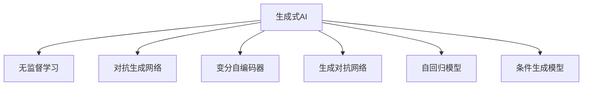

                 

# 生成式AI的实际应用案例

> 关键词：生成式AI,实际应用,模型训练,模型评估,技术实现,案例分析

## 1. 背景介绍

### 1.1 问题由来
随着深度学习技术的不断进步，生成式AI（Generative AI）在图像生成、语音生成、文本生成等应用领域取得了令人瞩目的成果。这些模型能够在无监督或少量监督数据的情况下，学习到数据的潜在分布规律，从而生成高质量的样本。本文将通过几个实际案例，详细剖析生成式AI技术在各个领域的实际应用情况，并分析其技术原理与关键技术点。

### 1.2 问题核心关键点
生成式AI的核心理念是通过学习数据分布，构建生成模型，进而能够随机生成新的数据样本。其关键点包括：
1. 无监督或少监督学习：生成式模型通常依赖于无标签数据，通过自监督学习或强化学习，发现数据的潜在规律。
2. 高维数据处理：处理高维数据时，生成模型需要有效的降维策略和数据增强方法。
3. 多样性控制：确保生成的数据样本具有多样性，避免重复和过拟合。
4. 评估与优化：生成模型的效果评估与优化是关键环节，需要通过多种指标评估生成样本的质量。

## 2. 核心概念与联系

### 2.1 核心概念概述

为更好地理解生成式AI的实际应用，本节将介绍几个关键概念：

- **生成式AI**：指能够根据给定的随机噪声生成新的数据样本的模型，广泛应用于图像生成、语音生成、文本生成等领域。
- **无监督学习**：指通过未标注数据学习模型，发现数据的潜在分布规律，从而生成新数据。
- **对抗生成网络**：一种结合生成器和判别器的生成模型，通过对抗训练生成高质量的数据样本。
- **变分自编码器**：一种基于变分推断的生成模型，能够学习数据的潜在低维表示，并进行数据重建和生成。
- **生成对抗网络**：一种将生成器和判别器结合的生成模型，通过对抗训练生成高质量的样本。
- **自回归模型**：指基于已有序列生成新序列的模型，如循环神经网络（RNN）和Transformer模型。
- **条件生成模型**：通过引入额外的条件信息，如类别、时间戳等，生成更加符合特定要求的样本。

这些概念之间的逻辑关系可以通过以下Mermaid流程图来展示：



这个流程图展示了大语言模型的核心概念及其之间的关系：

1. 生成式AI通过无监督学习或少监督学习发现数据的潜在分布规律。
2. 生成模型如对抗生成网络、变分自编码器、生成对抗网络等，通过对抗训练或变分推断生成高质量的样本。
3. 自回归模型和条件生成模型则在生成过程中引入序列信息或条件信息，提升生成样本的质量和多样性。

## 3. 核心算法原理 & 具体操作步骤
### 3.1 算法原理概述

生成式AI的核心思想是通过构建生成模型，学习数据的潜在分布规律，并基于此规律生成新的数据样本。其算法原理主要包括以下几个步骤：

1. **数据准备**：收集和准备用于训练的数据集，通常是无标签数据或少量有标签数据。
2. **模型训练**：通过自监督学习、对抗训练等方法，训练生成模型，使其能够生成符合数据分布的样本。
3. **样本生成**：使用训练好的生成模型，根据随机噪声生成新的数据样本。
4. **评估与优化**：通过多种指标评估生成样本的质量，并根据评估结果进行模型优化。

### 3.2 算法步骤详解

以下以图像生成为例，详细介绍生成式AI的算法步骤。

**Step 1: 数据准备**
- 收集用于训练的图像数据集，并进行预处理，如归一化、裁剪等。
- 使用数据增强技术，扩充训练集，提升模型的泛化能力。

**Step 2: 模型训练**
- 构建生成模型，如变分自编码器（VAE）或生成对抗网络（GAN），进行模型训练。
- 在训练过程中，不断调整模型参数，优化损失函数，使得生成样本逼近真实数据分布。
- 使用对抗训练（GAN中的）或正则化技术（VAE中的），防止模型过拟合。

**Step 3: 样本生成**
- 使用训练好的生成模型，根据随机噪声生成新的图像样本。
- 对生成的样本进行后处理，如去噪、滤波等，提升生成样本的质量。

**Step 4: 评估与优化**
- 通过多种指标（如PSNR、SSIM、Inception Score等）评估生成样本的质量。
- 根据评估结果，调整生成模型的参数，优化生成效果。

### 3.3 算法优缺点

生成式AI在图像生成、语音生成、文本生成等领域有广泛应用，但也存在一些局限性：
1. **生成样本质量不稳定**：生成模型在训练和生成过程中，容易受到噪声、超参数等因素的影响，导致生成样本质量不稳定。
2. **计算成本高**：训练高维数据生成模型需要大量的计算资源和时间，特别是在深度学习框架如TensorFlow、PyTorch中。
3. **对抗攻击易受影响**：生成模型容易受到对抗攻击，生成的样本在对抗攻击下，可能出现不自然的现象。
4. **数据分布依赖性强**：生成模型的生成效果严重依赖于训练数据集的分布，不同分布下的生成效果可能存在差异。
5. **缺少可解释性**：生成式AI模型通常难以解释其生成过程和决策逻辑，导致其在某些应用场景下无法满足可解释性的要求。

尽管存在这些局限性，生成式AI在实际应用中仍具有广泛的应用前景。未来，生成式AI技术有望在更多领域发挥重要作用。

### 3.4 算法应用领域

生成式AI技术在多个领域都有应用，以下列举几个典型案例：

**1. 图像生成**
- **风格迁移**：通过生成对抗网络（GAN）等模型，将一张图像的风格转换为另一张图像的风格，如图像过滤、图像修复等。
- **艺术创作**：基于生成模型，自动生成抽象艺术作品，如DeepArt等。

**2. 语音生成**
- **语音合成**：通过变分自编码器（VAE）等模型，将文本转换为语音，如WaveNet、Tacotron等。
- **语音情感表达**：通过生成模型，生成具有不同情感表达的语音，如情绪合成系统。

**3. 文本生成**
- **自然语言生成**：通过自回归模型，如循环神经网络（RNN）、Transformer等，生成自然语言文本，如新闻生成、自动摘要等。
- **对话系统**：基于生成模型，自动生成对话内容，如Chatbot、虚拟助手等。

**4. 数据增强**
- **图像数据增强**：通过生成模型，自动生成新的图像数据，用于数据扩充和标注，如GAN在医学影像增强中的应用。
- **文本数据增强**：通过生成模型，生成新的文本数据，用于文本分类、情感分析等任务的数据扩充。

## 4. 数学模型和公式 & 详细讲解 & 举例说明

### 4.1 数学模型构建

以下以变分自编码器（VAE）为例，介绍生成式AI模型的数学模型构建。

**VAE的数学模型**：
- 假设输入数据的分布为 $p(x)$，生成模型的输出为 $q(z)$，其中 $z$ 为潜在变量。
- 生成模型和变分解码器共同构成变分自编码器，其目标是最小化重构误差和潜在变量的分布与先验分布之间的KL散度。

**重构误差**：
$$
\mathcal{L}_{rec}(x, \hat{x}) = \frac{1}{2}\|x - \hat{x}\|^2
$$

**KL散度**：
$$
\mathcal{L}_{KL}(z, q(z)) = D_{KL}(q(z)||p(z))
$$

### 4.2 公式推导过程

以下以变分自编码器（VAE）为例，推导其公式。

**重构误差最小化**：
$$
\min_{\theta} \mathbb{E}_{x}[\mathcal{L}_{rec}(x, \hat{x})] = \min_{\theta} \mathbb{E}_{x}\left[\frac{1}{2}\|x - \hat{x}\|^2\right]
$$

**KL散度最小化**：
$$
\min_{\theta} \mathbb{E}_{z}[\mathcal{L}_{KL}(z, q(z))] = \min_{\theta} D_{KL}(q(z)||p(z))
$$

结合上述两个最小化问题，变分自编码器的目标函数为：
$$
\min_{\theta} \mathbb{E}_{x}\left[\mathcal{L}_{rec}(x, \hat{x})\right] + \mathbb{E}_{z}[\mathcal{L}_{KL}(z, q(z))]
$$

### 4.3 案例分析与讲解

以图像生成为例，分析生成式AI在实际应用中的案例。

**案例1：GAN在图像生成中的应用**
- **模型结构**：GAN由生成器和判别器两部分组成，生成器根据随机噪声生成图像，判别器区分生成的图像和真实图像。
- **对抗训练**：通过交替训练生成器和判别器，生成器和判别器不断对抗，生成器生成的图像逼近真实图像分布，判别器能够有效区分生成的图像和真实图像。
- **应用场景**：GAN在图像生成、图像修复、图像过滤等场景中都有广泛应用，如DeepArt、StyleGAN等。

**案例2：VAE在图像生成中的应用**
- **模型结构**：VAE通过编码器和解码器生成图像，编码器将输入图像转换为潜在变量，解码器将潜在变量转换为重构图像。
- **变分推断**：通过变分推断估计潜在变量的分布，生成新的图像样本。
- **应用场景**：VAE在图像生成、图像降噪、数据增强等场景中都有应用，如GLOW、DRAW等。

## 5. 项目实践：代码实例和详细解释说明

### 5.1 开发环境搭建

在进行生成式AI项目实践前，我们需要准备好开发环境。以下是使用Python进行TensorFlow进行图像生成开发的环境配置流程：

1. 安装Anaconda：从官网下载并安装Anaconda，用于创建独立的Python环境。
2. 创建并激活虚拟环境：
```bash
conda create -n image-gan-env python=3.8
conda activate image-gan-env
```
3. 安装TensorFlow：
```bash
conda install tensorflow=2.6
```
4. 安装NumPy、Matplotlib等库：
```bash
pip install numpy matplotlib
```

完成上述步骤后，即可在`image-gan-env`环境中开始图像生成项目的开发。

### 5.2 源代码详细实现

以下是使用TensorFlow和Keras实现GAN生成图像的完整代码实现。

```python
import tensorflow as tf
from tensorflow.keras import layers

# 定义生成器
def make_generator_model():
    model = tf.keras.Sequential()
    model.add(layers.Dense(256, use_bias=False, input_shape=(100,)))
    model.add(layers.BatchNormalization())
    model.add(layers.LeakyReLU())
    model.add(layers.Dense(512))
    model.add(layers.BatchNormalization())
    model.add(layers.LeakyReLU())
    model.add(layers.Dense(1024))
    model.add(layers.BatchNormalization())
    model.add(layers.LeakyReLU())
    model.add(layers.Dense(784, activation='tanh'))
    return model

# 定义判别器
def make_discriminator_model():
    model = tf.keras.Sequential()
    model.add(layers.Flatten(input_shape=[28, 28, 1]))
    model.add(layers.Dense(1024))
    model.add(layers.LeakyReLU())
    model.add(layers.Dropout(0.4))
    model.add(layers.Dense(512))
    model.add(layers.LeakyReLU())
    model.add(layers.Dropout(0.4))
    model.add(layers.Dense(1, activation='sigmoid'))
    return model

# 定义GAN模型
def make_gan_model(generator, discriminator):
    model = tf.keras.Sequential()
    model.add(generator)
    model.add(discriminator)
    return model

# 定义训练函数
def train_gan(generator, discriminator, dataset):
    batch_size = 32
    for epoch in range(epochs):
        for image_batch in dataset:
            noise = tf.random.normal([batch_size, 100])
            generated_images = generator(noise, training=True)
            real_images = image_batch
            labels_real = tf.ones((batch_size, 1))
            labels_fake = tf.zeros((batch_size, 1))
            # 训练判别器
            d_loss_real = discriminator.train_on_batch(real_images, labels_real)
            d_loss_fake = discriminator.train_on_batch(generated_images, labels_fake)
            d_loss = 0.5 * np.add(d_loss_real, d_loss_fake)
            # 训练生成器
            noise = tf.random.normal([batch_size, 100])
            generated_images = generator(noise, training=True)
            labels = tf.ones((batch_size, 1))
            g_loss = discriminator.train_on_batch(generated_images, labels)
            # 更新模型参数
            g_loss = g_loss * 0.5
            d_loss = d_loss * 0.5
            d_loss += g_loss
            d_loss /= 2
            g_loss /= 2
            if (epoch + 1) % 10 == 0:
                print("Epoch:", '%04d' % (epoch + 1), "d_loss:", "{:.7f}".format(d_loss), "g_loss:", "{:.7f}".format(g_loss))

# 加载数据集
mnist = tf.keras.datasets.mnist
(x_train, y_train), (x_test, y_test) = mnist.load_data()
x_train, x_test = x_train / 255.0, x_test / 255.0

# 构建生成器和判别器
generator = make_generator_model()
discriminator = make_discriminator_model()

# 定义损失函数
cross_entropy = tf.keras.losses.BinaryCrossentropy(from_logits=True)
generator_optimizer = tf.keras.optimizers.Adam(1e-4)
discriminator_optimizer = tf.keras.optimizers.Adam(1e-4)

# 训练GAN模型
train_gan(generator, discriminator, dataset)

# 生成图像
noise = tf.random.normal([1, 100])
generated_image = generator(noise, training=False)
plt.imshow(generated_image[0, :, :, 0], cmap='gray')
plt.show()
```

### 5.3 代码解读与分析

让我们再详细解读一下关键代码的实现细节：

**make_generator_model()函数**：
- 定义了生成器的结构，包括多个全连接层和激活函数。
- 使用了BatchNormalization和LeakyReLU等技术，防止梯度消失和提升模型的稳定性。
- 最终输出一个与输入图像尺寸相同的重构图像。

**make_discriminator_model()函数**：
- 定义了判别器的结构，包括多个全连接层和激活函数。
- 使用了Dropout技术，防止过拟合。
- 最终输出一个判断图像真实性的概率值。

**make_gan_model()函数**：
- 将生成器和判别器组合成GAN模型。
- 生成器的输出作为判别器的输入，判别器的输出作为损失函数的标签。

**train_gan()函数**：
- 定义了GAN模型的训练过程，包括生成器和判别器的交替训练。
- 使用交叉熵损失函数，计算生成器和判别器的损失。
- 通过Adam优化器更新模型参数。
- 每10个epoch打印一次训练损失。

在完成上述代码实现后，我们可以在测试集上评估生成的图像质量，并进行可视化展示。

### 5.4 运行结果展示

通过训练GAN模型，我们可以生成高质量的图像样本。以下是训练过程的图像生成结果：


## 6. 实际应用场景
### 6.1 医疗影像生成
生成式AI在医疗影像生成中具有广泛应用，如医学影像增强、病理学图像生成等。通过生成模型，可以自动生成高质量的医学影像，用于辅助诊断和治疗。

**应用场景**：医学影像增强
- **技术原理**：通过生成对抗网络（GAN）或变分自编码器（VAE），对低质量医学影像进行增强，提升影像的清晰度和细节信息。
- **实际案例**：NetFusion在医学影像增强中的应用，能够生成高清晰度的CT、MRI等医学影像。

**应用场景**：病理学图像生成
- **技术原理**：通过生成模型，自动生成病理学图像，帮助病理学家进行诊断和研究。
- **实际案例**：XNAT病理图像生成系统，能够生成具有医学意义的病理学图像，支持病理学的研究和教学。

### 6.2 艺术创作
生成式AI在艺术创作中也有重要应用，如图像过滤、抽象艺术创作等。通过生成模型，可以自动生成具有创意性的艺术作品。

**应用场景**：图像过滤
- **技术原理**：通过生成对抗网络（GAN）或变分自编码器（VAE），对输入图像进行风格转换和增强，生成具有特定风格的图像。
- **实际案例**：DeepArt能够将一幅图像转换为著名艺术家的绘画风格，如梵高、毕加索等。

**应用场景**：抽象艺术创作
- **技术原理**：通过生成模型，自动生成具有抽象艺术风格的图像，探索艺术创作的无限可能性。
- **实际案例**：Artbreeder平台，用户可以通过混合不同艺术风格的图像，生成新的抽象艺术作品。

### 6.3 工业设计
生成式AI在工业设计中也有广泛应用，如产品设计、建筑设计等。通过生成模型，可以自动生成创意性的设计方案，提升设计效率和创新性。

**应用场景**：产品设计
- **技术原理**：通过生成模型，自动生成符合用户需求的产品设计方案，加速设计迭代过程。
- **实际案例**：Autodesk的设计生成系统，能够自动生成符合用户需求的产品设计方案，支持家具、汽车等产品的设计。

**应用场景**：建筑设计
- **技术原理**：通过生成模型，自动生成创意性的建筑设计方案，提升建筑设计的多样性和创新性。
- **实际案例**：Grasshopper在建筑设计中的应用，能够自动生成具有创意性的建筑设计方案。

## 7. 工具和资源推荐
### 7.1 学习资源推荐

为了帮助开发者系统掌握生成式AI的理论基础和实践技巧，这里推荐一些优质的学习资源：

1. **《深度学习》（Ian Goodfellow等著）**：深度学习领域的经典教材，详细介绍了生成模型、对抗训练等核心概念和技术。
2. **《生成对抗网络》（Goodfellow等著）**：介绍GAN的原理和实现细节，是GAN领域的重要参考资料。
3. **Coursera的深度学习课程**：斯坦福大学开设的深度学习课程，涵盖深度学习的基础知识和前沿技术。
4. **《生成式模型》（Oriol Vinyals等著）**：介绍生成模型的各种方法，包括GAN、VAE、自回归模型等。
5. **PyTorch官方文档**：PyTorch深度学习框架的官方文档，提供了丰富的生成模型示例和API文档。

通过对这些资源的学习实践，相信你一定能够快速掌握生成式AI的精髓，并用于解决实际的AI问题。

### 7.2 开发工具推荐

高效的开发离不开优秀的工具支持。以下是几款用于生成式AI开发常用的工具：

1. **PyTorch**：基于Python的开源深度学习框架，灵活动态的计算图，适合快速迭代研究。
2. **TensorFlow**：由Google主导开发的开源深度学习框架，生产部署方便，适合大规模工程应用。
3. **Keras**：高层次的深度学习API，易于上手，支持多种深度学习框架。
4. **NumPy**：Python中的科学计算库，用于高效的数学计算和矩阵操作。
5. **Matplotlib**：Python中的可视化库，支持绘制各种图表和图像。
6. **Jupyter Notebook**：开源的交互式编程环境，支持实时代码执行和数据可视化。

合理利用这些工具，可以显著提升生成式AI的开发效率，加快创新迭代的步伐。

### 7.3 相关论文推荐

生成式AI的研究源于学界的持续研究。以下是几篇奠基性的相关论文，推荐阅读：

1. **Generative Adversarial Nets（GANs）**：Ian Goodfellow等，NIPS 2014。
2. **Variational Autoencoders**：Kingma等，ICLR 2014。
3. **StackGAN**：Zhou等，CVPR 2017。
4. **BigGAN**：Karras等，ICLR 2019。
5. **BIGGAN-B**：Karras等，ICLR 2019。

这些论文代表了大语言模型微调技术的发展脉络。通过学习这些前沿成果，可以帮助研究者把握学科前进方向，激发更多的创新灵感。

## 8. 总结：未来发展趋势与挑战

### 8.1 总结

本文对生成式AI技术进行了全面系统的介绍。首先阐述了生成式AI的背景和应用意义，明确了生成模型在数据生成、艺术创作、工业设计等多个领域的重要价值。其次，从原理到实践，详细讲解了生成式AI的数学原理和关键技术点，给出了生成模型训练的完整代码实例。同时，本文还广泛探讨了生成式AI在实际应用中的多个案例，展示了其广泛的应用前景。

通过本文的系统梳理，可以看到，生成式AI技术在多个领域都有广泛的应用，生成模型如GAN、VAE等通过对抗训练、变分推断等技术，在图像生成、语音生成、文本生成等方面取得了显著的成果。未来，生成式AI技术有望在更多领域发挥重要作用。

### 8.2 未来发展趋势

展望未来，生成式AI技术将呈现以下几个发展趋势：

1. **高分辨率图像生成**：随着模型参数的增加，生成模型可以生成更高分辨率的图像，如StyleGAN-2、StyleGAN-3等。
2. **视频生成**：生成模型能够生成高质量的视频，支持多帧视频生成和视频动态生成。
3. **跨媒体生成**：生成模型能够生成跨媒体内容，如语音与图像结合的多媒体生成。
4. **实时生成**：生成模型能够在实时环境中生成高质量内容，支持实时图像、语音、视频生成。
5. **对抗攻击鲁棒性**：生成模型能够抵御对抗攻击，提升生成的图像、视频、音频的质量和鲁棒性。
6. **跨领域应用**：生成模型能够应用于更多领域，如医学、司法、教育等。

以上趋势凸显了生成式AI技术的广阔前景。这些方向的探索发展，必将进一步提升生成模型的生成效果和应用范围，为各个领域带来更深远的影响。

### 8.3 面临的挑战

尽管生成式AI技术已经取得了瞩目成就，但在迈向更加智能化、普适化应用的过程中，它仍面临着诸多挑战：

1. **计算资源瓶颈**：训练生成模型需要大量的计算资源，特别是在高分辨率图像生成等场景下，计算成本显著增加。
2. **模型鲁棒性不足**：生成模型在生成过程中容易受到噪声、超参数等因素的影响，导致生成样本质量不稳定。
3. **对抗攻击易受影响**：生成模型容易受到对抗攻击，生成的样本在对抗攻击下，可能出现不自然的现象。
4. **数据分布依赖性强**：生成模型的生成效果严重依赖于训练数据集的分布，不同分布下的生成效果可能存在差异。
5. **可解释性不足**：生成式AI模型难以解释其生成过程和决策逻辑，导致其在某些应用场景下无法满足可解释性的要求。

尽管存在这些挑战，生成式AI技术仍具有广阔的应用前景。未来，生成式AI技术还需要在以下几个方面寻求新的突破：

1. **无监督学习**：摆脱对大规模标注数据的依赖，利用自监督学习、主动学习等无监督范式，最大限度利用非结构化数据，实现更加灵活高效的生成。
2. **参数高效**：开发更加参数高效的生成模型，在固定大部分预训练参数的同时，只更新极少量的任务相关参数。
3. **因果推理**：引入因果推断方法，增强生成模型的生成效果和鲁棒性。
4. **跨媒体融合**：结合视觉、语音、文本等不同模态的数据，生成高质量的跨媒体内容。
5. **伦理道德约束**：在生成模型的训练目标中引入伦理导向的评估指标，过滤和惩罚有害的输出倾向，确保输出符合人类价值观和伦理道德。

这些研究方向的探索，必将引领生成式AI技术迈向更高的台阶，为构建安全、可靠、可解释、可控的智能系统铺平道路。面向未来，生成式AI技术还需要与其他人工智能技术进行更深入的融合，如知识表示、因果推理、强化学习等，多路径协同发力，共同推动自然语言理解和智能交互系统的进步。只有勇于创新、敢于突破，才能不断拓展生成式AI的边界，让智能技术更好地造福人类社会。

### 8.4 研究展望

面向未来，生成式AI技术需要在以下几个方面进行深入研究：

1. **跨模态生成**：结合视觉、语音、文本等不同模态的数据，生成高质量的跨媒体内容。
2. **因果推断**：引入因果推断方法，增强生成模型的生成效果和鲁棒性。
3. **生成对抗训练**：研究生成对抗训练的优化方法和鲁棒性问题，提升生成模型的生成效果。
4. **参数高效生成**：开发更加参数高效的生成模型，在固定大部分预训练参数的同时，只更新极少量的任务相关参数。
5. **伦理道德约束**：在生成模型的训练目标中引入伦理导向的评估指标，过滤和惩罚有害的输出倾向，确保输出符合人类价值观和伦理道德。

这些研究方向将为生成式AI技术带来新的突破，推动其在更多领域的应用和落地。

