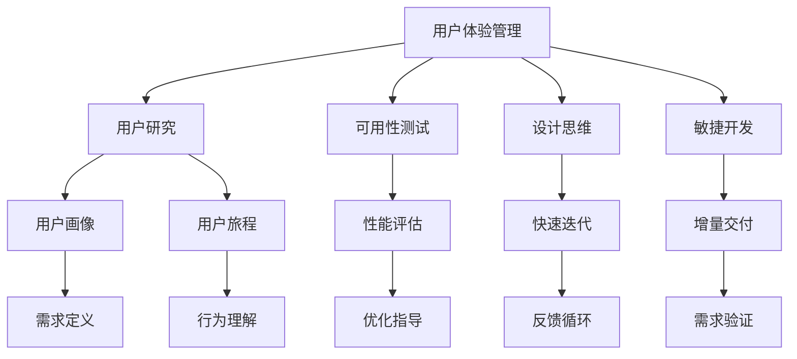

                 

# 用户体验管理：以客户为中心的服务设计

> 关键词：用户体验管理, 客户中心, 服务设计, 用户研究, 可用性测试, 设计思维, 敏捷开发

## 1. 背景介绍

随着互联网和移动技术的普及，越来越多的企业将服务触达到了用户的日常生活。与此同时，企业的竞争也在向服务质量升级转变，用户体验管理（User Experience Management, UXM）成为了企业竞争的关键所在。用户体验管理强调以用户为中心的设计理念，旨在提升用户满意度和忠诚度，进而带来更高效的业务转化和更持久的企业价值。

### 1.1 问题由来

在数字化转型的大潮下，传统的以产品为中心的设计理念逐渐向以用户为中心的设计理念转变。企业需要关注用户如何与产品互动，使用户在产品中感受到价值，从而提升整体的用户体验。但用户需求的多样化和复杂性，使得用户体验管理成为了企业面临的一个重大挑战。如何让用户体验管理变得简单而有效，成为了企业关注的焦点。

### 1.2 问题核心关键点

用户体验管理的核心关键点在于：

1. **用户需求的挖掘和理解**：通过用户研究，收集用户行为、态度、期望等信息，形成用户画像和用户旅程，全面了解用户的需求和痛点。
2. **设计方案的制定与实施**：根据用户画像和用户旅程，制定服务设计方案，并通过原型设计、可用性测试等方法不断迭代和优化，最终实现以用户为中心的服务设计。
3. **产品上线后的监测与优化**：通过用户反馈、使用数据分析等手段，持续监测服务表现，根据数据反馈进行优化，确保用户需求的持续满足。
4. **跨部门协同合作**：用户体验管理需要市场、产品、设计、开发等多部门的紧密合作，共同推动用户体验的持续提升。

## 2. 核心概念与联系

### 2.1 核心概念概述

为了更好地理解用户体验管理的实践方法，本节将介绍几个密切相关的核心概念：

- **用户体验管理（User Experience Management, UXM）**：旨在提升用户满意度和忠诚度，通过用户研究、设计、实施、优化等手段，提供一致且高质量的用户体验。
- **用户研究（User Research）**：通过调研、访谈、问卷等方法，收集用户需求和行为数据，形成用户画像和用户旅程。
- **可用性测试（Usability Testing）**：通过实际用户使用产品，收集反馈数据，评估产品性能和使用体验，指导产品迭代和优化。
- **设计思维（Design Thinking）**：一种以人为本的设计方法论，强调用户需求、团队协作和快速迭代，致力于提升用户体验和价值。
- **敏捷开发（Agile Development）**：通过迭代和增量式交付，快速响应用户需求和市场变化，提升产品竞争力。

这些核心概念之间的逻辑关系可以通过以下Mermaid流程图来展示：



这个流程图展示用户体验管理的核心概念及其之间的关系：

1. 用户体验管理通过用户研究、可用性测试、设计思维和敏捷开发等手段，全面了解用户需求，持续优化用户体验。
2. 用户研究收集用户画像和用户旅程，形成需求定义和行为理解。
3. 可用性测试通过实际用户的使用反馈，评估性能和优化方向。
4. 设计思维引导设计方案的制定和快速迭代，提升用户体验和价值。
5. 敏捷开发通过增量交付和反馈循环，快速响应用户需求和市场变化。

这些概念共同构成了用户体验管理的完整流程，使得企业能够更系统地管理和提升用户体验。

## 3. 核心算法原理 & 具体操作步骤

### 3.1 算法原理概述

用户体验管理的算法原理可以概括为以下几个步骤：

1. **用户需求挖掘**：通过用户研究，收集用户行为、态度、期望等信息，形成用户画像和用户旅程。
2. **设计方案制定**：根据用户画像和用户旅程，制定服务设计方案，包括界面设计、交互设计等。
3. **原型设计和可用性测试**：将设计方案转化为原型，并通过可用性测试收集用户反馈，评估设计方案的可用性。
4. **快速迭代和优化**：根据可用性测试的结果，对设计方案进行快速迭代和优化，提升用户体验。
5. **实施与监测**：将优化后的设计方案上线实施，并通过数据分析和用户反馈进行持续监测和优化。

### 3.2 算法步骤详解

用户体验管理的具体操作步骤可以总结如下：

**Step 1: 用户研究**
- **用户画像**：通过访谈、问卷、行为分析等方式，收集用户基本信息、需求和行为数据，形成详细的用户画像。
- **用户旅程**：绘制用户在使用产品或服务时的路径，记录用户在不同阶段的体验和痛点，形成用户旅程地图。

**Step 2: 设计方案制定**
- **界面设计**：根据用户画像和用户旅程，设计用户界面，包括视觉元素、布局和交互方式等。
- **交互设计**：设计用户与产品或服务的交互流程，包括点击、输入、输出等交互行为，确保用户操作简便、自然。

**Step 3: 原型设计和可用性测试**
- **原型设计**：根据设计方案，使用工具如Sketch、Figma等，设计产品原型，并进行初步的用户可用性测试。
- **可用性测试**：邀请真实用户测试产品原型，记录用户的操作行为和反馈，评估产品的可用性和易用性。

**Step 4: 快速迭代和优化**
- **用户反馈分析**：根据可用性测试结果，分析用户反馈，识别关键问题和优化方向。
- **设计迭代**：根据用户反馈，对设计方案进行迭代和优化，重点关注用户体验的提升。
- **可用性再次测试**：将优化后的设计方案重新进行可用性测试，确保问题得到解决。

**Step 5: 实施与监测**
- **产品上线**：将优化后的设计方案上线，并进行大规模部署。
- **用户监测**：通过用户行为数据、使用反馈等手段，持续监测产品表现，确保用户需求的持续满足。
- **持续优化**：根据用户反馈和监测数据，进行持续优化，保持产品竞争力。

### 3.3 算法优缺点

用户体验管理的算法优点包括：

1. **全面性**：通过用户研究、可用性测试等手段，全面了解用户需求和痛点，确保设计方案的全面性和有效性。
2. **迭代性**：通过快速迭代和可用性测试，持续优化产品体验，提升用户体验的满意度。
3. **数据驱动**：通过用户反馈和数据分析，持续改进设计方案，确保产品始终符合用户需求。

同时，该方法也存在以下局限性：

1. **时间和资源成本高**：用户体验管理涉及用户研究、可用性测试等多个环节，需要投入大量的时间和资源。
2. **反馈数据依赖性高**：用户体验管理的有效实施依赖于真实用户的反馈数据，获取高质量的反馈数据成本较高。
3. **团队协作复杂**：用户体验管理需要市场、产品、设计、开发等多部门的紧密合作，协同难度较大。

尽管如此，用户体验管理的科学方法和数据驱动的优化手段，使其在提升用户满意度和产品竞争力方面具有显著优势。

### 3.4 算法应用领域

用户体验管理的算法不仅适用于传统的软件产品开发，还广泛应用于以下领域：

1. **移动应用**：通过用户体验管理，提升移动应用的可用性和用户粘性，增加用户留存率。
2. **网站和Web应用**：通过用户体验管理，优化网站和Web应用的界面设计和交互体验，提升用户转化率。
3. **企业内部系统**：通过用户体验管理，提升企业内部系统的易用性和效率，提升员工满意度。
4. **智能设备和IoT设备**：通过用户体验管理，优化智能设备和IoT设备的用户界面和操作体验，提升用户使用体验。
5. **游戏和娱乐产品**：通过用户体验管理，提升游戏的互动性和娱乐性，增加用户的游戏时长和消费。

## 4. 数学模型和公式 & 详细讲解

### 4.1 数学模型构建

用户体验管理的数学模型可以概括为以下几个关键部分：

1. **用户画像数学模型**：通过用户研究数据，构建用户画像的数学模型，描述用户的基本特征、需求和行为。
2. **用户旅程数学模型**：通过用户旅程数据，构建用户旅程的数学模型，描述用户在产品或服务中的路径和体验。
3. **可用性测试数学模型**：通过可用性测试数据，构建可用性测试的数学模型，评估产品的性能和易用性。
4. **用户体验优化模型**：通过用户反馈和数据分析，构建用户体验优化的数学模型，指导产品的迭代和优化。

### 4.2 公式推导过程

以下我们将对用户体验管理的数学模型进行详细推导。

**用户画像数学模型**：

设用户画像由基本特征、需求和行为三个维度组成，记为 $\mathbf{U} = (F, D, A)$，其中 $F$ 为特征向量，$D$ 为需求向量，$A$ 为行为向量。

$$
\mathbf{U} = (F, D, A) = (f_1, f_2, \ldots, f_n, d_1, d_2, \ldots, d_m, a_1, a_2, \ldots, a_p)
$$

**用户旅程数学模型**：

设用户旅程由多个阶段组成，每个阶段由任务、触点和体验构成，记为 $\mathbf{J} = (T, C, E)$，其中 $T$ 为任务向量，$C$ 为触点向量，$E$ 为体验向量。

$$
\mathbf{J} = (T, C, E) = (t_1, t_2, \ldots, t_k, c_1, c_2, \ldots, c_l, e_1, e_2, \ldots, e_n)
$$

**可用性测试数学模型**：

设可用性测试由多个测试任务和测试结果组成，记为 $\mathbf{U}_0 = (T_0, R_0)$，其中 $T_0$ 为测试任务向量，$R_0$ 为测试结果向量。

$$
\mathbf{U}_0 = (T_0, R_0) = (t_{01}, t_{02}, \ldots, t_{0m}, r_{01}, r_{02}, \ldots, r_{0n})
$$

**用户体验优化模型**：

设用户体验优化由多个优化目标和优化策略组成，记为 $\mathbf{X}_0 = (O_0, S_0)$，其中 $O_0$ 为优化目标向量，$S_0$ 为优化策略向量。

$$
\mathbf{X}_0 = (O_0, S_0) = (o_{01}, o_{02}, \ldots, o_{0q}, s_{01}, s_{02}, \ldots, s_{0r})
$$

### 4.3 案例分析与讲解

以电商平台的购物流程为例，我们可以进行以下用户体验管理的案例分析：

**用户画像构建**：通过调研收集用户的基本信息、购买偏好、支付习惯等数据，构建用户画像。

**用户旅程绘制**：绘制用户在电商平台上的购物旅程，从搜索商品、浏览详情、加入购物车到结算支付，记录每个环节的用户行为和体验。

**可用性测试执行**：邀请真实用户进行可用性测试，记录用户在每个环节的操作行为和时间，评估购物流程的易用性和性能。

**设计方案迭代**：根据可用性测试结果，优化购物流程的设计方案，如简化结算步骤、增加支付安全提示等。

**持续监测优化**：上线优化后的设计方案，并通过数据分析和用户反馈持续监测购物流程的表现，进行进一步的优化。

## 5. 项目实践：代码实例和详细解释说明

### 5.1 开发环境搭建

在进行用户体验管理实践前，我们需要准备好开发环境。以下是使用Python进行UXM开发的典型环境配置流程：

1. 安装Python：从官网下载并安装Python，确保版本与使用的库兼容。
2. 安装相关库：使用pip安装所需的库，如Jupyter Notebook、Pandas、Scikit-learn、Matplotlib等。
3. 配置环境：设置Python的路径和虚拟环境，保证项目的独立性。

### 5.2 源代码详细实现

下面是使用Python进行用户体验管理实践的代码示例。

首先，定义用户画像类，记录用户的基本特征、需求和行为：

```python
import pandas as pd

class User:
    def __init__(self, features, demands, behaviors):
        self.features = features
        self.demands = demands
        self.behaviors = behaviors

    def save(self, filename):
        data = pd.DataFrame({
            'Features': self.features,
            'Demands': self.demands,
            'Behaviors': self.behaviors
        })
        data.to_csv(filename, index=False)

    def load(self, filename):
        data = pd.read_csv(filename)
        self.features = data['Features'].tolist()
        self.demands = data['Demands'].tolist()
        self.behaviors = data['Behaviors'].tolist()
```

然后，定义用户旅程类，记录用户在平台上的各个阶段、任务、触点和体验：

```python
class Journey:
    def __init__(self, tasks, points, experiences):
        self.tasks = tasks
        self.points = points
        self.experiences = experiences

    def save(self, filename):
        data = pd.DataFrame({
            'Tasks': self.tasks,
            'Points': self.points,
            'Experiences': self.experiences
        })
        data.to_csv(filename, index=False)

    def load(self, filename):
        data = pd.read_csv(filename)
        self.tasks = data['Tasks'].tolist()
        self.points = data['Points'].tolist()
        self.experiences = data['Experiences'].tolist()
```

接着，定义可用性测试类，记录测试任务和结果：

```python
class UsabilityTest:
    def __init__(self, tasks, results):
        self.tasks = tasks
        self.results = results

    def save(self, filename):
        data = pd.DataFrame({
            'Tasks': self.tasks,
            'Results': self.results
        })
        data.to_csv(filename, index=False)

    def load(self, filename):
        data = pd.read_csv(filename)
        self.tasks = data['Tasks'].tolist()
        self.results = data['Results'].tolist()
```

最后，定义用户体验优化类，记录优化目标和策略：

```python
class UserExperienceOptimization:
    def __init__(self, targets, strategies):
        self.targets = targets
        self.strategies = strategies

    def save(self, filename):
        data = pd.DataFrame({
            'Targets': self.targets,
            'Strategies': self.strategies
        })
        data.to_csv(filename, index=False)

    def load(self, filename):
        data = pd.read_csv(filename)
        self.targets = data['Targets'].tolist()
        self.strategies = data['Strategies'].tolist()
```

### 5.3 代码解读与分析

让我们再详细解读一下关键代码的实现细节：

**User类**：
- `__init__`方法：初始化用户的基本特征、需求和行为。
- `save`和`load`方法：用于将用户数据保存到CSV文件中，并从CSV文件中加载用户数据。

**Journey类**：
- `__init__`方法：初始化用户的各个阶段、任务、触点和体验。
- `save`和`load`方法：用于将用户旅程数据保存到CSV文件中，并从CSV文件中加载用户旅程数据。

**UsabilityTest类**：
- `__init__`方法：初始化可用性测试的任务和结果。
- `save`和`load`方法：用于将可用性测试数据保存到CSV文件中，并从CSV文件中加载可用性测试数据。

**UserExperienceOptimization类**：
- `__init__`方法：初始化用户体验优化的目标和策略。
- `save`和`load`方法：用于将用户体验优化数据保存到CSV文件中，并从CSV文件中加载用户体验优化数据。

### 5.4 运行结果展示

运行上述代码，可以实现用户画像、用户旅程、可用性测试和用户体验优化等数据的存储和读取。通过这些数据，可以进行全面的用户体验管理分析，优化设计方案。

## 6. 实际应用场景

### 6.1 智能客服系统

智能客服系统已经成为企业提升用户体验的重要工具。通过用户体验管理，企业可以更好地设计智能客服系统，提升用户互动体验，减少等待时间，提高用户满意度。

具体来说，企业可以通过用户研究，了解客户在不同阶段的期望和需求，设计合理的客服流程和响应策略。然后通过可用性测试，不断优化客服系统的交互设计和语音识别，确保客户在每个环节的体验都符合期望。最后，通过持续监测和反馈，不断改进客服系统，提升客户互动的质量。

### 6.2 电子商务平台

电子商务平台通过用户体验管理，可以提升用户购物体验，增加用户粘性和购买转化率。

通过用户研究，电商企业可以了解用户在购物过程中的痛点和需求，设计直观易用的购物界面和高效的支付流程。通过可用性测试，电商企业可以验证设计方案的有效性，并根据用户反馈不断优化。最后，通过持续监测用户行为和反馈，电商企业可以及时发现问题并进行改进，提升用户购物体验和满意度。

### 6.3 在线教育平台

在线教育平台通过用户体验管理，可以提升学习体验，增加用户粘性和学习效果。

通过用户研究，教育企业可以了解学习者的学习需求和行为，设计符合学习者需求的课程内容和互动方式。通过可用性测试，教育企业可以验证课程设计的有效性，并根据学习者的反馈不断优化。最后，通过持续监测学习者的学习数据和反馈，教育企业可以及时调整课程内容和互动方式，提升学习效果和用户体验。

### 6.4 未来应用展望

未来，用户体验管理将进一步向智能和自动化方向发展，结合人工智能和机器学习技术，提升用户体验的精准度和自动化程度。

1. **智能用户研究**：通过自然语言处理和机器学习，自动分析用户反馈和行为数据，生成用户画像和用户旅程。
2. **自动化可用性测试**：通过机器人和AI测试工具，自动执行可用性测试，生成测试报告和优化建议。
3. **个性化优化**：通过用户画像和行为数据分析，实现个性化用户体验优化，提升用户满意度和忠诚度。
4. **跨渠道协同**：通过用户体验管理系统，实现多渠道协同，提升整体用户体验和一致性。
5. **实时监测和优化**：通过实时数据监测和反馈机制，持续优化用户体验，提升服务质量和竞争力。

## 7. 工具和资源推荐

### 7.1 学习资源推荐

为了帮助开发者系统掌握用户体验管理的理论基础和实践技巧，这里推荐一些优质的学习资源：

1. **《用户体验管理》书籍**：介绍用户体验管理的理论基础和实践方法，涵盖用户研究、设计思维、可用性测试等多个方面。
2. **《设计心理学》课程**：通过实际案例讲解用户体验管理的心理学基础，提升设计思维和用户体验的深刻理解。
3. **《用户体验设计》课程**：详细讲解用户体验管理的工具和技术，涵盖用户画像、用户旅程、可用性测试等多个方面。
4. **《用户体验管理工具》推荐**：介绍常用的用户体验管理工具，如UserTesting、Nielsen Norman Group等，提供丰富的用户研究和可用性测试资源。

### 7.2 开发工具推荐

高效的开发离不开优秀的工具支持。以下是几款用于用户体验管理开发的常用工具：

1. **Jupyter Notebook**：用于数据分析和可视化，支持Python和R等多种编程语言。
2. **Pandas**：用于数据处理和分析，支持多种数据格式和数据操作。
3. **Scikit-learn**：用于机器学习算法实现，支持分类、回归、聚类等多种机器学习任务。
4. **Matplotlib**：用于数据可视化，支持多种图表展示方式。
5. **Tableau**：用于数据可视化，支持丰富的图表和数据交互功能。

### 7.3 相关论文推荐

用户体验管理的理论和实践不断发展，以下是几篇奠基性的相关论文，推荐阅读：

1. **《用户体验管理：设计、测量和评价》**：介绍了用户体验管理的理论基础和实践方法，涵盖用户研究、设计思维、可用性测试等多个方面。
2. **《用户中心设计：设计思维和用户研究》**：介绍了设计思维和用户研究的基本概念和实践技巧，提供了丰富的案例分析。
3. **《用户体验的可用性测试》**：详细讲解了可用性测试的方法和工具，涵盖用户任务分析、交互分析等多个方面。
4. **《用户体验优化：数据驱动的设计方法》**：介绍了用户体验优化的数据驱动方法，通过用户反馈和数据分析，实现持续优化。

## 8. 总结：未来发展趋势与挑战

### 8.1 研究成果总结

本文对用户体验管理的理论和实践进行了全面系统的介绍。首先阐述了用户体验管理的核心关键点，明确了用户体验管理的系统方法和实施流程。其次，从用户画像、用户旅程、可用性测试等多个方面，详细讲解了用户体验管理的数学模型和公式推导。最后，通过实际案例分析，展示了用户体验管理的实施方法和效果。

通过本文的系统梳理，可以看到，用户体验管理通过系统的方法和数据驱动的优化，能够全面提升用户满意度和产品竞争力，对企业的数字化转型具有重要意义。

### 8.2 未来发展趋势

未来，用户体验管理将呈现以下几个发展趋势：

1. **智能化和自动化**：结合人工智能和机器学习技术，实现智能用户研究和自动化可用性测试，提升用户体验管理的精准度和效率。
2. **跨渠道协同**：通过统一的用户体验管理系统，实现多渠道协同，提升整体用户体验和一致性。
3. **实时监测和优化**：通过实时数据监测和反馈机制，持续优化用户体验，提升服务质量和竞争力。
4. **个性化和定制化**：通过用户画像和行为数据分析，实现个性化用户体验优化，提升用户满意度和忠诚度。
5. **用户共创和开放平台**：通过用户共创和开放平台，吸引用户参与设计和管理，提升用户体验和用户参与度。

这些趋势将使得用户体验管理更加智能、高效和个性化，为企业带来更大的价值。

### 8.3 面临的挑战

尽管用户体验管理的科学方法和数据驱动的优化手段，使其在提升用户满意度和产品竞争力方面具有显著优势，但在实施过程中也面临诸多挑战：

1. **数据隐私和安全**：用户体验管理涉及大量用户数据，如何保障数据隐私和安全，成为重要挑战。
2. **跨部门协同**：用户体验管理需要市场、产品、设计、开发等多部门的紧密合作，协同难度较大。
3. **资源投入高**：用户体验管理涉及用户研究、可用性测试等多个环节，需要投入大量的时间和资源。
4. **用户反馈获取难**：获取高质量的用户反馈数据，成本较高，且用户反馈的质量和代表性难以保证。
5. **技术复杂度高**：用户体验管理的实施涉及多种技术和工具，技术复杂度较高，对团队技术水平要求较高。

尽管面临这些挑战，用户体验管理的科学方法和数据驱动的优化手段，使其在提升用户满意度和产品竞争力方面具有显著优势。未来需要通过技术创新和组织变革，进一步提升用户体验管理的实施效果。

### 8.4 研究展望

面向未来，用户体验管理的核心研究方向包括：

1. **智能用户研究**：通过自然语言处理和机器学习，自动分析用户反馈和行为数据，生成用户画像和用户旅程。
2. **自动化可用性测试**：通过机器人和AI测试工具，自动执行可用性测试，生成测试报告和优化建议。
3. **个性化优化**：通过用户画像和行为数据分析，实现个性化用户体验优化，提升用户满意度和忠诚度。
4. **跨渠道协同**：通过用户体验管理系统，实现多渠道协同，提升整体用户体验和一致性。
5. **实时监测和优化**：通过实时数据监测和反馈机制，持续优化用户体验，提升服务质量和竞争力。

这些研究方向将进一步提升用户体验管理的科学性和高效性，为企业带来更大的价值。

## 9. 附录：常见问题与解答

**Q1：用户体验管理是否适用于所有企业？**

A: 用户体验管理适用于所有企业，特别是那些依赖用户互动的企业，如电商、在线教育、智能客服等。通过用户体验管理，企业可以提升用户满意度和忠诚度，增加用户粘性和业务转化率。

**Q2：如何选择合适的用户体验管理工具？**

A: 选择用户体验管理工具时，需要考虑企业的实际需求和预算。常用的工具包括UserTesting、Nielsen Norman Group、Optimal Workshop等。此外，企业也可以定制开发适合自己的用户体验管理系统。

**Q3：用户体验管理的实施难点是什么？**

A: 用户体验管理的实施难点主要在于跨部门协同和数据隐私保护。需要通过明确的流程和工具，协调市场、产品、设计、开发等多部门的协作，同时保障用户数据的安全和隐私。

**Q4：用户体验管理的最佳实践是什么？**

A: 用户体验管理的最佳实践包括：
1. 系统地进行用户研究，收集用户需求和行为数据，形成用户画像和用户旅程。
2. 设计直观易用的产品界面和高效的交互流程，提升用户互动体验。
3. 定期进行可用性测试，收集用户反馈，持续优化产品设计。
4. 通过数据分析和用户反馈，持续监测产品表现，进行持续优化。

这些最佳实践能够帮助企业系统地提升用户体验，增加用户满意度和业务转化率。

通过本文的系统梳理，可以看到，用户体验管理通过系统的方法和数据驱动的优化，能够全面提升用户满意度和产品竞争力，对企业的数字化转型具有重要意义。未来，随着技术的发展和社会的进步，用户体验管理必将迎来更大的发展机遇和挑战。

---

作者：禅与计算机程序设计艺术 / Zen and the Art of Computer Programming

