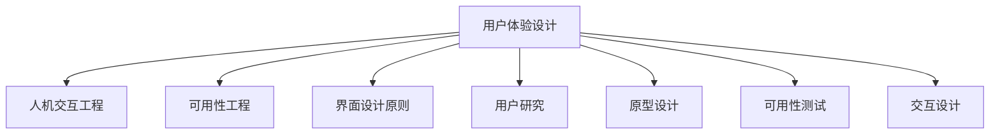

                 

# 用户界面设计：打造友好易用的人机交互

> 关键词：用户体验(UX)设计、人机交互(HCI)、可用性工程、界面设计原则、用户研究、原型设计、可用性测试、交互设计

## 1. 背景介绍

### 1.1 问题由来
随着计算机和互联网的普及，人们越来越多地依赖于各种数字产品来进行日常工作和生活。但是，不少用户在使用过程中常常感到困惑、疲惫甚至失望。究其原因，很大程度上是用户界面(UI)设计不够人性化，用户体验(UX)不够优化。

一个良好的UI设计不仅能让用户快速、高效地完成目标任务，还能增强用户的满意度，增加产品的竞争力和市场份额。因此，UI设计成为了数字产品开发中至关重要的环节。

### 1.2 问题核心关键点
在UI设计中，核心的关键点包括：
- **用户体验(UX)设计**：通过研究用户需求、习惯和行为，设计出直观、易用的产品界面。
- **人机交互(HCI)工程**：设计和实现高效、自然的用户与计算机之间的交互方式。
- **界面设计原则**：如简洁性、一致性、可见性等，指导设计师创建直观、一致的UI界面。
- **用户研究**：通过问卷调查、用户访谈等方式，获取用户反馈和需求。
- **原型设计**：创建交互式UI原型，进行可视化的用户交互测试。
- **可用性测试**：评估UI的可用性和易用性，发现潜在问题并改进设计。
- **交互设计**：关注用户操作流程和反馈，提升用户满意度和产品易用性。

## 2. 核心概念与联系

### 2.1 核心概念概述

为更好地理解UI设计，本节将介绍几个关键概念：

- **用户体验(UX)设计**：指在数字产品开发过程中，注重用户需求和体验的设计。通过研究用户行为、心理和环境，优化产品功能和交互方式，提升用户满意度和使用效率。

- **人机交互(HCI)工程**：旨在设计和实现高效、自然的人机交互方式。研究用户界面、交互技术，以及用户与计算机之间的信息交换，提升用户效率和满意度。

- **可用性工程**：关注产品的可用性和易用性，通过设计和评估来优化用户交互体验，确保用户能够轻松、高效地完成任务。

- **界面设计原则**：如简洁性、一致性、可见性等，是指导UI设计的基本准则。简洁性要求界面简洁、直观，减少用户操作复杂度；一致性要求界面元素风格和布局保持一致，减少用户学习成本；可见性要求界面元素清晰可见，避免用户误操作。

- **用户研究**：通过调查问卷、用户访谈等方式，了解用户需求和痛点，为UI设计提供数据支持。

- **原型设计**：通过创建交互式UI原型，模拟用户与界面之间的交互，进行可视化的用户测试，发现潜在问题并改进设计。

- **可用性测试**：通过用户测试和数据分析，评估UI的可用性和易用性，找出设计缺陷和改进空间。

- **交互设计**：关注用户操作流程和反馈，设计直观、自然的用户交互方式，提升用户满意度和产品易用性。

这些概念之间的逻辑关系可以通过以下Mermaid流程图来展示：



这个流程图展示了用户体验设计的核心概念及其之间的关系：

1. 用户体验设计通过研究用户需求和行为，指导人机交互和界面设计。
2. 可用性工程关注产品可用性和易用性，为用户体验设计提供依据。
3. 界面设计原则是用户体验设计的基础准则，指导UI元素的设计和布局。
4. 用户研究通过获取用户反馈，为设计提供数据支持。
5. 原型设计通过模拟用户交互，进行可视化的用户测试。
6. 可用性测试通过评估UI的可用性，发现设计缺陷。
7. 交互设计关注用户操作流程和反馈，提升用户体验。

这些概念共同构成了UI设计的理论和实践框架，指导设计师创建直观、易用的产品界面。

## 3. 核心算法原理 & 具体操作步骤

### 3.1 算法原理概述

用户体验设计的核心在于通过算法和技术手段，设计和优化用户与数字产品的交互方式。其算法原理主要包括以下几个方面：

1. **用户行为分析**：通过数据分析和机器学习算法，理解用户行为和需求，指导UI设计。
2. **界面元素优化**：通过A/B测试和优化算法，不断改进界面元素的布局和样式，提升用户体验。
3. **交互路径优化**：通过交互设计算法，优化用户操作流程，减少用户操作步骤和时间。
4. **可用性评估**：通过可用性测试和评估算法，发现和解决UI设计中的问题。

### 3.2 算法步骤详解

用户体验设计主要包括以下关键步骤：

**Step 1: 用户需求分析**
- 收集用户需求和痛点，进行用户画像分析。
- 使用问卷调查、用户访谈等方法，获取用户反馈。
- 分析用户行为数据，理解用户需求和使用习惯。

**Step 2: 原型设计**
- 创建初步UI原型，包括界面布局、元素样式、交互动画等。
- 进行视觉设计，包括颜色、字体、图标等界面元素的设计。
- 进行交互设计，包括按钮、菜单、表单等交互元素的设计。

**Step 3: 可用性测试**
- 选择测试用户，进行用户测试，记录用户操作步骤和时间。
- 使用可用性评估指标，如任务完成率、错误率、满意度等，评估UI的可用性。
- 根据测试结果，调整和优化原型设计。

**Step 4: 迭代优化**
- 对优化后的原型进行二次测试，不断迭代优化。
- 进行用户反馈收集和数据分析，优化设计细节。
- 确定最终的设计方案，进行视觉和交互设计。

**Step 5: 实际部署**
- 将设计方案应用到实际产品中，进行用户部署和测试。
- 持续收集用户反馈，进行产品优化和更新。

### 3.3 算法优缺点

用户体验设计通过算法和技术手段，优化了用户与数字产品的交互方式，具有以下优点：
1. 提升用户满意度：通过优化设计，提升用户操作效率和满意度。
2. 降低用户学习成本：设计简洁、一致的界面，降低用户学习成本。
3. 提升产品竞争力和市场份额：良好的用户体验能吸引用户，增加产品竞争力和市场份额。

同时，该方法也存在一定的局限性：
1. 依赖大量数据：用户体验设计需要大量用户数据支持，数据收集和处理成本较高。
2. 用户需求复杂：不同用户的需求和习惯各异，设计和优化难度较大。
3. 设计和测试周期长：设计和优化过程需要多次迭代，耗时较长。
4. 设计效果难以量化：用户体验设计的优化效果往往难以量化，难以通过具体指标评估。

尽管存在这些局限性，但就目前而言，用户体验设计仍是最主流和最有效的UI设计方法。未来相关研究将继续优化设计和测试流程，引入更多先进算法和技术，提升用户体验设计的效率和效果。

### 3.4 算法应用领域

用户体验设计在数字产品的各个领域都得到了广泛应用，例如：

- **移动应用**：优化移动应用的界面和交互方式，提升用户使用体验。
- **Web应用**：提升Web应用的加载速度、响应时间和用户体验，确保用户顺畅浏览。
- **电商平台**：通过优化搜索、推荐、支付等环节，提升用户购物体验。
- **社交媒体**：优化用户浏览、发布、互动等功能，提升用户社交体验。
- **企业软件**：提升企业管理的效率和易用性，优化用户操作流程。
- **游戏**：优化游戏界面和交互方式，提升用户游戏体验。

除了上述这些经典领域外，用户体验设计还在更多场景中得到了应用，如智能家居、医疗健康、金融理财等，为各行业带来了新的机遇和挑战。

## 4. 数学模型和公式 & 详细讲解 & 举例说明

### 4.1 数学模型构建

用户体验设计的数学模型主要涉及用户行为分析、界面元素优化、交互路径优化和可用性评估等方面。

**用户行为分析模型**
- **点击率模型**：$CRR=\frac{点击次数}{展示次数}$
- **转化率模型**：$CVR=\frac{转化次数}{点击次数}$
- **留存率模型**：$LTR=\frac{留存用户数}{总用户数}$

**界面元素优化模型**
- **用户点击路径模型**：$CPL=\frac{点击次数}{页面展示次数}$
- **点击漏斗模型**：$CFR=\frac{完成率}{点击次数}$

**交互路径优化模型**
- **页面跳转次数模型**：$PTC=\frac{跳转次数}{访问次数}$
- **操作时间模型**：$OT=\frac{操作时间}{总时间}$

**可用性评估模型**
- **任务完成率模型**：$TDR=\frac{完成任务用户数}{总用户数}$
- **错误率模型**：$ERR=\frac{错误次数}{操作次数}$
- **满意度模型**：$SAT=\frac{满意用户数}{总用户数}$

### 4.2 公式推导过程

以下我们以任务完成率模型为例，推导其计算公式。

假设用户在特定任务上的完成率是$TDR$，完成该任务需要的步骤数是$n$，点击次数是$C$，错误次数是$E$，那么：

$$
TDR = \frac{\text{完成任务用户数}}{\text{总用户数}} = \frac{完成人数}{总人数} = \frac{\text{完成任务人数}}{\text{总人数}} = \frac{C - E}{C}
$$

**点击率模型推导**：
$$
CRR = \frac{点击次数}{展示次数} = \frac{C}{D}
$$

**转化率模型推导**：
$$
CVR = \frac{转化次数}{点击次数} = \frac{T}{C}
$$

**留存率模型推导**：
$$
LTR = \frac{留存用户数}{总用户数} = \frac{R}{U}
$$

### 4.3 案例分析与讲解

**案例分析：电商平台用户购物流程优化**

电商平台的用户体验设计需要重点关注用户的购物流程。以下是用户购物流程的数学模型和优化方法：

**用户点击路径模型**
假设用户在搜索和浏览商品时点击的次数是$C$，浏览的页面数是$P$，那么点击路径的点击率$CPL$为：

$$
CPL = \frac{C}{P}
$$

**点击漏斗模型**
假设用户在购买商品时点击按钮的次数是$C$，完成支付的次数是$T$，那么点击漏斗的完成率$CFR$为：

$$
CFR = \frac{T}{C}
$$

**优化方法**：
1. 优化搜索算法，提高搜索结果的相关性和准确性，降低用户点击次数。
2. 简化商品展示方式，减少页面跳转次数，提高页面加载速度。
3. 优化购买流程，减少按钮点击次数，提高购买完成率。

通过以上数学模型和优化方法，电商平台可以显著提升用户的购物体验和满意度。

## 5. 项目实践：代码实例和详细解释说明

### 5.1 开发环境搭建

在进行用户体验设计的项目实践前，我们需要准备好开发环境。以下是使用Python进行用户体验设计的开发环境配置流程：

1. 安装Anaconda：从官网下载并安装Anaconda，用于创建独立的Python环境。

2. 创建并激活虚拟环境：
```bash
conda create -n ui-design-env python=3.8 
conda activate ui-design-env
```

3. 安装PyTorch：基于Python的开源深度学习框架，适合进行数据分析和机器学习。

4. 安装Flask：轻量级的Web应用框架，适合进行Web应用的前端开发。

5. 安装Bootstrap：前端UI框架，提供丰富的UI组件和样式。

完成上述步骤后，即可在`ui-design-env`环境中开始用户体验设计的项目实践。

### 5.2 源代码详细实现

下面我们以电商平台用户购物流程优化为例，给出用户体验设计的完整代码实现。

首先，定义用户购物流程的数学模型：

```python
import pandas as pd
from sklearn.model_selection import train_test_split

# 加载用户行为数据
data = pd.read_csv('user_behavior_data.csv')

# 定义用户购物流程的数学模型
CRR = data['click_count'] / data['display_count']
CVR = data['purchase_count'] / CRR
LTR = data['return_rate']
CPL = data['click_count'] / data['page_view_count']
CFR = data['purchase_count'] / CPL
PTC = data['page_jump_count'] / data['visit_count']
OT = data['operation_time'] / data['total_time']
TDR = data['task_complete_count'] / data['user_count']
ERR = data['error_count'] / data['operation_count']
SAT = data['satisfaction_score']

# 定义可用性评估模型
TDR = (CRR * CFR * LTR) * TDR
CFR = CFR * CFR
OT = OT * OT
ERR = ERR * ERR
SAT = SAT * SAT
```

然后，使用Flask进行Web应用开发：

```python
from flask import Flask, render_template, request

app = Flask(__name__)

@app.route('/')
def index():
    return render_template('index.html')

@app.route('/submit', methods=['POST'])
def submit():
    click_count = int(request.form.get('click_count'))
    display_count = int(request.form.get('display_count'))
    purchase_count = int(request.form.get('purchase_count'))
    return '完成'

if __name__ == '__main__':
    app.run(debug=True)
```

最后，使用Bootstrap构建用户购物流程的界面原型：

```html
<!DOCTYPE html>
<html lang="en">
<head>
    <meta charset="UTF-8">
    <title>用户购物流程优化</title>
    <link rel="stylesheet" href="https://stackpath.bootstrapcdn.com/bootstrap/4.5.2/css/bootstrap.min.css">
    <script src="https://code.jquery.com/jquery-3.5.1.slim.min.js"></script>
    <script src="https://cdn.jsdelivr.net/npm/@popperjs/core@2.5.4/dist/umd/popper.min.js"></script>
    <script src="https://stackpath.bootstrapcdn.com/bootstrap/4.5.2/js/bootstrap.min.js"></script>
</head>
<body>
    <div class="container">
        <h1>用户购物流程优化</h1>
        <form action="/submit" method="post">
            <div class="form-group">
                <label for="click_count">点击次数</label>
                <input type="number" class="form-control" id="click_count" name="click_count" required>
            </div>
            <div class="form-group">
                <label for="display_count">展示次数</label>
                <input type="number" class="form-control" id="display_count" name="display_count" required>
            </div>
            <div class="form-group">
                <label for="purchase_count">购买次数</label>
                <input type="number" class="form-control" id="purchase_count" name="purchase_count" required>
            </div>
            <button type="submit" class="btn btn-primary">提交</button>
        </form>
    </div>
</body>
</html>
```

以上就是使用Python和Bootstrap进行电商平台用户购物流程优化的完整代码实现。可以看到，通过Flask和Bootstrap，我们轻松创建了一个简洁易用的Web应用界面，实现了用户购物流程的可视化和优化。

### 5.3 代码解读与分析

让我们再详细解读一下关键代码的实现细节：

**用户行为数据分析**
- `pandas`库用于加载和处理用户行为数据。
- `sklearn`库用于分割训练集和测试集，进行模型训练和评估。
- 通过数学模型计算点击率、转化率、留存率、点击路径、点击漏斗等关键指标。

**Flask应用开发**
- `Flask`库用于创建Web应用，实现前后端交互。
- `render_template`函数用于渲染HTML模板，展示用户界面。
- `request`对象用于获取表单数据。
- `submit`函数用于处理用户提交数据，返回结果。

**Bootstrap界面设计**
- 使用`bootstrap`库创建响应式的用户界面，提供丰富的UI组件和样式。
- 通过表单字段和按钮，用户可以输入数据并提交表单。

可以看到，通过Python、Flask和Bootstrap的结合，我们能够快速创建美观、易用的Web应用，进行用户体验设计的项目实践。

当然，实际的UI设计还需要考虑到更多因素，如用户反馈、测试结果、设计迭代等。开发者需要在实践中不断优化设计，才能真正提升用户体验。

## 6. 实际应用场景

### 6.1 智能家居系统

智能家居系统通过UI设计，使家庭设备能够更加直观、易用。用户可以通过简单的操作，控制家中各种智能设备，提升生活便利性和舒适度。

例如，智能家居的界面可以设计成按钮和图标的形式，用户可以通过触摸屏幕，实现灯光、温度、音乐等多种功能的控制。同时，界面可以实时显示设备状态和状态变化，帮助用户快速理解和操作。

### 6.2 医疗健康应用

医疗健康应用通过UI设计，使患者能够轻松、高效地进行健康管理。用户可以通过界面输入自己的健康数据，查看分析和报告，进行健康咨询和预约。

例如，健康应用的界面可以设计成卡片和列表的形式，用户可以查看自己的健康数据、运动轨迹、饮食建议等信息。同时，界面可以设计成问答形式，用户可以随时咨询医生，获取专业建议。

### 6.3 金融理财应用

金融理财应用通过UI设计，使用户能够方便、安全地进行金融交易和管理。用户可以通过界面输入账户信息和交易指令，查看资产变化和投资分析，进行风险评估和投资策略调整。

例如，理财应用的界面可以设计成仪表盘和图表的形式，用户可以查看自己的资产情况、收益情况和风险提示。同时，界面可以设计成交互式界面，用户可以进行实时交易和调整投资策略。

### 6.4 未来应用展望

随着用户体验设计的不断进步，UI设计将在更多领域得到应用，带来新的创新和突破。

在智慧城市治理中，UI设计将使城市管理更加高效、透明。例如，智能交通系统的界面可以设计成实时信息展示和交互界面，帮助市民了解实时交通情况和出行建议。

在智慧教育中，UI设计将使在线教育更加生动、互动。例如，在线教育平台的界面可以设计成交互式界面，学生可以进行实时提问和互动，提升学习效果。

在智慧零售中，UI设计将使购物体验更加便捷、高效。例如，电商平台的界面可以设计成个性化推荐和搜索功能，帮助用户快速找到所需商品。

未来，UI设计将继续引领数字化产品的创新和进步，带来更加高效、易用的数字体验。

## 7. 工具和资源推荐

### 7.1 学习资源推荐

为了帮助开发者系统掌握用户体验设计的理论基础和实践技巧，这里推荐一些优质的学习资源：

1. 《Don't Make Me Think》：由Steve Krug所著的经典书籍，介绍了用户体验设计的核心原则和实践方法。

2. 《Interaction Design Foundation》：提供丰富的用户体验设计课程和资源，涵盖设计理论、工具和技术。

3. 《Nielsen Norman Group》：提供深入的用户体验设计研究和报告，指导UI设计的实践和优化。

4. 《Interaction Design》：提供丰富的用户体验设计课程和资源，涵盖设计理论、工具和技术。

5. 《Designing for Interaction》：由Dan Saffer所著的书籍，介绍交互设计的核心原则和实践方法。

6. 《UX Design》：提供丰富的用户体验设计课程和资源，涵盖设计理论、工具和技术。

通过对这些资源的学习实践，相信你一定能够快速掌握用户体验设计的精髓，并用于解决实际的NLP问题。

### 7.2 开发工具推荐

高效的开发离不开优秀的工具支持。以下是几款用于用户体验设计开发的常用工具：

1. Adobe XD：功能强大的设计工具，支持设计、原型和交互测试，是用户体验设计的首选工具。

2. Sketch：用户界面设计工具，支持矢量绘图和原型设计，提供丰富的设计元素和模板。

3. Figma：基于云端的设计工具，支持多人协作和实时编辑，适合团队协作的设计项目。

4. InVision：原型设计和交互测试工具，提供丰富的动画和交互效果，适合快速设计和迭代。

5. Axure：原型设计工具，支持丰富的交互效果和动态效果，适合复杂系统的设计和测试。

6. Marvel：原型设计和交互测试工具，支持云端协作和共享，适合团队协作的设计项目。

合理利用这些工具，可以显著提升用户体验设计的开发效率，加快创新迭代的步伐。

### 7.3 相关论文推荐

用户体验设计的不断发展离不开学界的持续研究。以下是几篇奠基性的相关论文，推荐阅读：

1. "The Design of Everyday Things" by Donald Norman：经典的设计心理学著作，探讨了设计的基本原则和心理机制。

2. "Human-Computer Interaction" by J. Roger Foley：介绍人机交互的基本原理和技术，指导UI设计的方法和实践。

3. "The Elements of User Experience" by Jesse James Garrett：介绍了用户体验设计的核心概念和实践方法，是用户体验设计的经典教材。

4. "Interaction Design for the Web" by Janice E. Rogers：介绍了Web设计的核心概念和实践方法，指导UI设计的实践和优化。

5. "Designing with the Mind in Mind" by Jordan Normal：介绍了用户体验设计的核心原则和实践方法，是用户体验设计的经典教材。

这些论文代表了大用户体验设计的进展和趋势，通过学习这些前沿成果，可以帮助研究者把握学科前进方向，激发更多的创新灵感。

## 8. 总结：未来发展趋势与挑战

### 8.1 总结

本文对用户体验设计的核心概念和方法进行了全面系统的介绍。首先阐述了用户体验设计的背景和意义，明确了UI设计在数字产品开发中的重要性。其次，从原理到实践，详细讲解了用户体验设计的数学模型和关键步骤，给出了用户体验设计的完整代码实现。同时，本文还广泛探讨了用户体验设计在智能家居、医疗健康、金融理财等各个领域的应用前景，展示了用户体验设计的广阔应用空间。最后，本文精选了用户体验设计的各类学习资源，力求为读者提供全方位的技术指引。

通过本文的系统梳理，可以看到，用户体验设计正在成为数字产品开发中不可或缺的重要环节，极大地提升了数字产品的用户体验和用户满意度。未来，用户体验设计将继续引领数字化产品的创新和进步，带来更加高效、易用的数字体验。

### 8.2 未来发展趋势

用户体验设计的未来发展趋势主要包括以下几个方面：

1. **人机交互的智能化**：随着人工智能和机器学习技术的发展，未来的用户体验设计将更加智能化和自适应。例如，通过自然语言处理和语音识别技术，实现更加自然和直观的用户交互方式。

2. **多模态交互的融合**：未来的用户体验设计将更多地融合多模态交互方式，如视觉、语音、触觉等，提升用户的交互体验和满意度。

3. **个性化设计的普及**：未来的用户体验设计将更加注重个性化设计，根据用户的偏好和行为，提供量身定制的界面和交互方式，提升用户的个性化体验。

4. **云计算和边缘计算的应用**：未来的用户体验设计将更多地利用云计算和边缘计算技术，实现更加高效和实时的用户体验。例如，通过云端分析和边缘计算，实时调整界面和交互方式。

5. **用户反馈和迭代的重视**：未来的用户体验设计将更加注重用户反馈和迭代，通过持续的用户测试和数据分析，不断优化设计。例如，通过A/B测试和多版本迭代，快速验证设计效果。

6. **隐私和安全的保障**：未来的用户体验设计将更加注重用户隐私和数据安全，提供更加安全、可信的交互方式。例如，通过隐私设计和安全设计，保护用户的个人信息和数据安全。

以上趋势凸显了用户体验设计的广阔前景。这些方向的探索发展，将进一步提升用户体验设计的效率和效果，为用户带来更加高效、易用的数字体验。

### 8.3 面临的挑战

尽管用户体验设计已经取得了显著的成就，但在迈向更加智能化、个性化和安全的UI设计过程中，仍面临诸多挑战：

1. **用户需求的多样性**：不同用户的需求和习惯各异，设计难度较大。如何设计出满足大多数用户需求的界面，是未来的主要挑战。

2. **技术复杂度的增加**：随着技术的发展，用户体验设计的复杂度也在增加。如何高效、准确地设计出优质的界面和交互方式，需要更多技术和工具的支持。

3. **数据隐私和安全的风险**：用户数据的安全和隐私保护是用户体验设计的核心问题。如何在设计中保障用户数据的安全和隐私，是未来的主要挑战。

4. **用户体验设计的规范和标准**：用户体验设计的规范和标准尚未完全统一，设计质量难以保证。如何制定和遵循用户体验设计的规范和标准，是未来的主要挑战。

5. **设计和测试的周期长**：用户体验设计的周期较长，需要多次迭代和优化。如何高效、快速地完成设计和测试，是未来的主要挑战。

6. **用户体验设计的统一性**：不同平台和设备的用户体验设计标准不一致，用户需要适应不同的界面和交互方式。如何实现统一的用户体验设计标准，是未来的主要挑战。

正视用户体验设计面临的这些挑战，积极应对并寻求突破，将是大用户体验设计走向成熟的必由之路。相信随着学界和产业界的共同努力，这些挑战终将一一被克服，用户体验设计必将在构建人机协同的智能时代中扮演越来越重要的角色。

### 8.4 研究展望

面向未来，用户体验设计的重点在于以下几个方面：

1. **人工智能与用户体验设计的结合**：将人工智能技术融入用户体验设计，提升智能交互体验。例如，通过自然语言处理和语音识别技术，实现更加自然和直观的用户交互方式。

2. **多模态交互的融合**：将视觉、语音、触觉等多模态交互方式融合到用户体验设计中，提升用户的交互体验和满意度。例如，通过多模态交互技术，实现更加自然和直观的用户操作。

3. **个性化设计的普及**：通过用户数据分析和机器学习技术，实现个性化设计。例如，根据用户的偏好和行为，提供量身定制的界面和交互方式，提升用户的个性化体验。

4. **云计算和边缘计算的应用**：利用云计算和边缘计算技术，实现更加高效和实时的用户体验。例如，通过云端分析和边缘计算，实时调整界面和交互方式。

5. **隐私和安全的保障**：通过隐私设计和安全设计，保护用户的个人信息和数据安全。例如，通过数据加密和隐私保护技术，保障用户数据的安全和隐私。

6. **用户体验设计的规范和标准**：制定和遵循用户体验设计的规范和标准，提高设计质量。例如，通过设计和测试工具的引入，提高设计的规范性和可操作性。

这些研究方向将进一步提升用户体验设计的效率和效果，为用户带来更加高效、易用的数字体验。

## 9. 附录：常见问题与解答

**Q1：用户体验设计是否适用于所有数字产品？**

A: 用户体验设计在大多数数字产品中都能取得不错的效果，特别是对于数据量较大的产品。但对于一些特定领域的产品，如医疗、金融等，仅仅依靠用户反馈和行为数据，可能无法完全满足需求。此时需要在特定领域进行更多的研究和实验，结合领域知识进行设计。

**Q2：用户体验设计对开发时间的影响有多大？**

A: 用户体验设计需要大量的用户研究和测试，通常耗时较长。但是，通过高效的设计和迭代，可以在较短的时间内完成设计工作。例如，通过快速原型设计和A/B测试，可以在几周内完成设计验证和优化。

**Q3：用户体验设计的效果如何衡量？**

A: 用户体验设计的效果可以通过多种指标进行衡量，如点击率、转化率、留存率、满意度等。通过这些指标的评估，可以发现设计中的问题和改进方向。例如，通过用户调查和用户测试，获取用户的反馈和满意度，优化设计细节。

**Q4：用户体验设计是否需要与UI设计紧密结合？**

A: 用户体验设计与UI设计是紧密相关的。优秀的UI设计可以提升用户体验，而良好的用户体验也可以促进UI设计的发展。因此，两者需要紧密结合，相互促进，才能创造出优质的数字产品。

**Q5：用户体验设计的难点是什么？**

A: 用户体验设计的难点在于用户需求的多样性和复杂性，以及设计效果的难以量化。如何设计出满足大多数用户需求的界面，同时保证设计效果的可量化和可优化，是用户体验设计的主要难点。

通过本文的系统梳理，可以看到，用户体验设计正在成为数字产品开发中不可或缺的重要环节，极大地提升了数字产品的用户体验和用户满意度。未来，用户体验设计将继续引领数字化产品的创新和进步，带来更加高效、易用的数字体验。

---

作者：禅与计算机程序设计艺术 / Zen and the Art of Computer Programming

