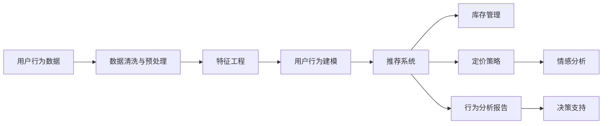

                 

## 1. 背景介绍

在当今数字化时代，电子商务平台凭借其便捷性、丰富性及多样性吸引了全球数亿用户。然而，伴随客户需求的多样化与市场竞争的加剧，企业面临着如何在用户海量行为数据中挖掘价值、预测需求、优化商品供给的挑战。用户行为分析（User Behavior Analysis, UBA）通过对用户互动、购买、评价等行为的深度挖掘，能够帮助企业洞察用户真实需求，优化商品供给策略，提升用户体验和满意度，从而在竞争激烈的市场中占据领先地位。

### 1.1 问题由来

电商企业收集了大量用户行为数据，涵盖了用户的浏览记录、购买历史、评价信息、搜索行为等多种类型。如何从这些数据中提取有价值的信息，提高商品推荐、库存管理、定价策略等决策的科学性，成为了电商平台亟待解决的问题。

#### 1.1.1 数据质量与多样性
电商用户行为数据丰富多样，但也存在数据不完整、噪声干扰等问题。例如，用户可能因各种原因（如网络问题、产品更新）未完成完整的购买流程，导致数据缺失。同时，用户行为受时间、地点、心情等众多因素影响，不同用户和不同情境下的行为模式存在显著差异。

#### 1.1.2 需求多样性与动态变化
用户需求随时间、季节、场景变化而变化，且不同用户之间需求差异较大。同一用户在不同时间段的需求可能不同，同一用户在不同情境下的需求亦存在差异。如何捕捉用户需求的动态变化，预测其未来行为，是分析用户行为的难题之一。

#### 1.1.3 实时性与成本控制
电商企业需要实时处理用户行为数据，以快速响应用户需求。同时，处理大规模数据集需要高昂的计算资源和存储空间。如何在保证实时性的同时降低成本，是另一项重要挑战。

## 2. 核心概念与联系

### 2.1 核心概念概述

- **用户行为分析（UBA）**：通过对用户互动、购买、评价等行为的深度挖掘，洞察用户真实需求，提升用户满意度。
- **推荐系统**：根据用户行为数据，智能推荐商品或服务，提升用户购买转化率。
- **库存管理**：根据用户需求预测，合理规划商品库存，避免供需不匹配。
- **定价策略**：通过分析用户对价格敏感度，制定最优定价策略，提高收益。
- **情感分析**：通过自然语言处理技术，分析用户评价，了解用户对商品的情感倾向。

这些核心概念通过协同工作，共同构建了电商平台的决策支持体系。

### 2.2 核心概念联系的 Mermaid 流程图



该流程图示意了用户行为数据的处理与利用路径：

- 用户行为数据首先经过数据清洗与预处理，去除噪声与无关信息。
- 然后进行特征工程，提取对用户行为具有解释性的特征。
- 接着通过用户行为建模，预测用户未来行为。
- 结合推荐系统、库存管理和定价策略，制定商品推荐、库存优化及定价方案。
- 最后，通过情感分析，获取用户反馈，优化策略，形成闭环反馈机制。

## 3. 核心算法原理 & 具体操作步骤

### 3.1 算法原理概述

用户行为分析的核心是构建预测模型，通过历史用户行为数据预测用户未来行为。常用的算法包括协同过滤、基于内容的推荐、深度学习等。

#### 3.1.1 协同过滤
协同过滤算法基于用户之间的相似性，通过分析用户行为来推荐相似用户喜欢的商品。主要有基于用户的协同过滤和基于物品的协同过滤两种方法。

#### 3.1.2 基于内容的推荐
基于内容的推荐算法通过分析商品的属性信息（如价格、类别、描述等）与用户历史行为（如浏览、购买、评价等）的相似性，为用户推荐相似商品。

#### 3.1.3 深度学习
深度学习算法（如深度神经网络、循环神经网络等）通过学习用户行为数据，构建复杂的非线性模型，预测用户未来行为。深度学习算法通常需要大量的标注数据进行训练，但在数据量充足的情况下，具有更好的泛化能力和适应性。

### 3.2 算法步骤详解

以深度学习算法为例，用户行为分析的核心步骤如下：

**Step 1: 数据准备与预处理**
- 收集用户行为数据，包括用户的浏览记录、购买历史、评价信息等。
- 清洗数据，去除噪声与无关信息，保证数据质量。
- 数据标准化与归一化处理，便于算法模型的输入。

**Step 2: 特征提取与选择**
- 从用户行为数据中提取特征，如浏览时长、点击频率、评价情感等。
- 使用特征选择技术，选择对预测结果影响较大的特征，提升模型性能。

**Step 3: 模型训练与验证**
- 选择合适的深度学习模型，如循环神经网络（RNN）、长短期记忆网络（LSTM）、注意力机制（Attention）等。
- 使用历史用户行为数据训练模型，使用验证集验证模型性能，调整超参数。

**Step 4: 模型评估与优化**
- 使用测试集评估模型性能，计算预测准确率、召回率、F1-score等指标。
- 根据评估结果，优化模型结构与参数，提升预测效果。

**Step 5: 部署与应用**
- 将训练好的模型部署到电商平台的推荐引擎、库存管理系统等模块中。
- 实时处理用户行为数据，更新商品推荐、库存管理等策略，满足用户需求。

### 3.3 算法优缺点

#### 3.3.1 协同过滤
**优点**：
- 不需要商品属性信息，适用于数据稀疏的情况。
- 简单易用，适合实时推荐。

**缺点**：
- 无法处理新用户和新物品。
- 用户兴趣可能随时间变化，协同过滤模型的效果可能不如预期。

#### 3.3.2 基于内容的推荐
**优点**：
- 不需要用户历史行为数据，易于实现。
- 模型稳定，不易过拟合。

**缺点**：
- 对商品属性信息依赖较大，无法处理商品属性未知的新商品。
- 商品属性信息可能不全面，影响推荐效果。

#### 3.3.3 深度学习
**优点**：
- 模型复杂，能够捕捉复杂的用户行为模式。
- 数据适应能力强，能够处理大规模非结构化数据。

**缺点**：
- 需要大量标注数据，模型训练成本高。
- 模型复杂，训练时间长，难以实时响应。

### 3.4 算法应用领域

用户行为分析的应用领域广泛，涵盖电商、金融、社交媒体等多个行业。

#### 3.4.1 电商行业
在电商领域，用户行为分析主要用于商品推荐、库存管理、定价策略等方面。例如：

- 根据用户浏览历史和购买记录，推荐相似或相关商品，提升用户购买转化率。
- 预测未来销售趋势，优化商品库存，避免库存积压或缺货。
- 分析用户对商品价格敏感度，制定最优定价策略，提高收益。

#### 3.4.2 金融行业
在金融领域，用户行为分析主要用于风险评估、客户分类、反欺诈检测等方面。例如：

- 分析客户的交易行为模式，评估其信用风险。
- 分类不同类型客户，设计个性化服务。
- 检测异常交易行为，防范金融欺诈。

#### 3.4.3 社交媒体
在社交媒体领域，用户行为分析主要用于内容推荐、广告定向、用户分类等方面。例如：

- 根据用户的浏览记录与互动行为，推荐相关内容，提升用户粘性。
- 分析用户兴趣和行为模式，精准投放广告。
- 根据用户行为数据，对用户进行分类，提供差异化服务。

## 4. 数学模型和公式 & 详细讲解 & 举例说明

### 4.1 数学模型构建

用户行为分析的数学模型构建主要分为以下步骤：

**Step 1: 定义预测目标**
- 预测目标可以是用户的购买概率、浏览行为、评价情感等。

**Step 2: 定义特征**
- 特征可以是用户行为数据中提取的特征，如浏览时长、点击频率、评价情感等。

**Step 3: 构建预测模型**
- 常见的预测模型包括逻辑回归、决策树、随机森林、深度神经网络等。

**Step 4: 训练与优化模型**
- 使用历史用户行为数据训练模型，使用验证集调整模型参数，提升模型性能。

**Step 5: 模型评估与验证**
- 使用测试集评估模型性能，计算预测准确率、召回率、F1-score等指标。

### 4.2 公式推导过程

以逻辑回归模型为例，其数学推导过程如下：

设用户购买行为的预测目标为 $y$，特征向量为 $\mathbf{x}$，模型参数为 $\theta$，则逻辑回归模型可表示为：

$$
\hat{y} = \sigma(\mathbf{x} \cdot \theta)
$$

其中 $\sigma$ 为 sigmoid 函数，$\mathbf{x} \cdot \theta$ 为线性回归模型输出。模型的损失函数为：

$$
\mathcal{L} = -\frac{1}{N}\sum_{i=1}^N[y_i \log \hat{y_i} + (1-y_i) \log(1-\hat{y_i})]
$$

使用梯度下降等优化算法更新模型参数 $\theta$，最小化损失函数：

$$
\theta \leftarrow \theta - \eta \nabla_{\theta}\mathcal{L}
$$

其中 $\eta$ 为学习率，$\nabla_{\theta}\mathcal{L}$ 为损失函数对模型参数的梯度。

### 4.3 案例分析与讲解

**案例 1: 电商商品推荐**
假设某电商平台有用户行为数据集，包含用户浏览记录、购买历史、评价信息等。以预测用户是否购买某一商品的逻辑回归模型为例：

- 输入特征：用户浏览时长、点击频率、评价情感等。
- 输出目标：用户是否购买该商品。

使用逻辑回归模型进行训练，具体步骤如下：

1. 数据预处理：对数据进行清洗、标准化、归一化处理。
2. 特征提取：提取对预测结果有解释性的特征。
3. 模型训练：使用历史用户行为数据训练逻辑回归模型，调整模型参数。
4. 模型评估：使用测试集评估模型性能，计算预测准确率、召回率、F1-score等指标。
5. 模型部署：将训练好的逻辑回归模型部署到电商平台的推荐引擎中，实时处理用户行为数据，更新商品推荐策略。

**案例 2: 金融客户分类**
某银行有大量客户交易数据，包含客户姓名、交易金额、时间、地点等。以将客户分为高风险与低风险客户的逻辑回归模型为例：

- 输入特征：客户交易金额、交易频率、交易地点等。
- 输出目标：客户高风险概率。

使用逻辑回归模型进行训练，具体步骤如下：

1. 数据预处理：对数据进行清洗、标准化、归一化处理。
2. 特征提取：提取对预测结果有解释性的特征。
3. 模型训练：使用历史客户交易数据训练逻辑回归模型，调整模型参数。
4. 模型评估：使用测试集评估模型性能，计算预测准确率、召回率、F1-score等指标。
5. 模型部署：将训练好的逻辑回归模型部署到银行的客户分类系统中，实时处理客户交易数据，分类不同客户群体，设计个性化服务。

## 5. 项目实践：代码实例和详细解释说明

### 5.1 开发环境搭建

在进行用户行为分析项目实践前，需要先准备好开发环境。以下是使用Python进行TensorFlow开发的流程：

1. 安装Anaconda：从官网下载并安装Anaconda，用于创建独立的Python环境。

2. 创建并激活虚拟环境：
```bash
conda create -n tf-env python=3.8 
conda activate tf-env
```

3. 安装TensorFlow：根据CUDA版本，从官网获取对应的安装命令。例如：
```bash
conda install tensorflow==2.6 -c tf
```

4. 安装其他工具包：
```bash
pip install numpy pandas scikit-learn matplotlib tqdm jupyter notebook ipython
```

完成上述步骤后，即可在`tf-env`环境中开始用户行为分析实践。

### 5.2 源代码详细实现

这里我们以电商商品推荐为例，给出使用TensorFlow对逻辑回归模型进行用户行为分析的代码实现。

首先，定义数据处理函数：

```python
import numpy as np
from sklearn.model_selection import train_test_split
from tensorflow.keras.models import Sequential
from tensorflow.keras.layers import Dense
from tensorflow.keras.optimizers import Adam

def data_preprocess(data):
    # 数据清洗与预处理
    # 特征选择与提取
    # 标准化与归一化处理
    return processed_data

def build_model(features, labels):
    # 构建逻辑回归模型
    model = Sequential()
    model.add(Dense(32, activation='relu', input_shape=(features.shape[1],)))
    model.add(Dense(1, activation='sigmoid'))
    model.compile(loss='binary_crossentropy', optimizer=Adam(learning_rate=0.001), metrics=['accuracy'])
    return model

def train_model(model, features, labels, epochs=10, batch_size=32):
    # 训练模型
    model.fit(features, labels, epochs=epochs, batch_size=batch_size, validation_split=0.2)
    return model

def evaluate_model(model, features, labels):
    # 评估模型
    loss, acc = model.evaluate(features, labels)
    return loss, acc

# 加载数据
data = np.load('data.npy')
features, labels = data[:, :-1], data[:, -1]

# 分割数据集
features_train, features_test, labels_train, labels_test = train_test_split(features, labels, test_size=0.2, random_state=42)
```

然后，定义训练和评估函数：

```python
def train_and_evaluate():
    # 模型训练与验证
    processed_train_features = data_preprocess(features_train)
    processed_test_features = data_preprocess(features_test)
    model = build_model(processed_train_features.shape[1], labels_train)
    history = train_model(model, processed_train_features, labels_train, epochs=10, batch_size=32)
    loss, acc = evaluate_model(model, processed_test_features, labels_test)
    return history, loss, acc

# 启动训练流程
history, test_loss, test_acc = train_and_evaluate()
print(f'Test loss: {test_loss:.4f}')
print(f'Test accuracy: {test_acc:.4f}')
```

以上就是使用TensorFlow对逻辑回归模型进行电商商品推荐用户行为分析的完整代码实现。可以看到，通过TensorFlow的高级API，代码实现简洁高效，易于维护。

### 5.3 代码解读与分析

让我们再详细解读一下关键代码的实现细节：

**data_preprocess函数**：
- 数据清洗与预处理：包括数据去重、缺失值处理、异常值检测等步骤。
- 特征选择与提取：选择对预测结果有解释性的特征。
- 标准化与归一化处理：对特征进行标准化与归一化，便于模型训练。

**build_model函数**：
- 定义逻辑回归模型：使用Sequential模型，添加输入层、隐藏层、输出层，并设置损失函数、优化器和评价指标。

**train_model函数**：
- 训练逻辑回归模型：使用历史用户行为数据进行模型训练，调整模型参数。

**evaluate_model函数**：
- 评估逻辑回归模型：使用测试集评估模型性能，计算预测准确率、召回率、F1-score等指标。

**train_and_evaluate函数**：
- 执行训练和评估流程：加载数据，分割数据集，构建逻辑回归模型，训练模型，评估模型。

**main函数**：
- 启动训练流程，输出测试集上的预测结果。

## 6. 实际应用场景

### 6.1 智能推荐系统

智能推荐系统是用户行为分析的重要应用场景之一。通过分析用户历史行为数据，推荐系统可以预测用户可能感兴趣的商品，提升用户体验和满意度，增加平台粘性。

在推荐系统设计中，用户行为数据包括用户的浏览记录、购买历史、评价信息等。通过对这些数据的深度挖掘，推荐系统可以构建用户画像，识别用户偏好，精准推荐商品。同时，推荐系统还可以通过反馈机制，不断优化推荐策略，提升推荐效果。

### 6.2 库存管理

库存管理是电商平台运营中的关键环节。通过用户行为分析，电商平台可以预测商品需求量，合理规划商品库存，避免供需不匹配。

在库存管理中，用户行为数据包括商品的浏览次数、购买历史、评论情感等。通过对这些数据的分析，库存管理系统可以预测商品的未来需求量，优化库存结构，减少库存积压或缺货。同时，系统还可以根据用户需求调整库存位置，提高补货效率。

### 6.3 营销活动

电商平台通过用户行为分析，可以设计更加精准的营销活动，提升营销效果，增加收益。

在营销活动设计中，用户行为数据包括用户的浏览记录、购买历史、评价信息等。通过对这些数据的分析，电商平台可以识别目标用户群体，设计个性化营销方案，提升用户转化率。同时，系统还可以实时监控营销活动效果，调整活动策略，提高营销效率。

### 6.4 未来应用展望

随着用户行为分析技术的不断发展，未来的应用场景将更加广泛，涵盖更多行业和领域。

**电商行业**：
- 用户画像：通过分析用户历史行为数据，构建用户画像，提供个性化推荐。
- 实时推荐：实时处理用户行为数据，更新推荐策略，提升用户体验。

**金融行业**：
- 风险评估：分析用户交易行为，评估其信用风险，提高贷款审批效率。
- 客户分类：分类不同类型客户，设计个性化服务，提升客户满意度。

**社交媒体**：
- 内容推荐：分析用户互动行为，推荐相关内容，提升用户粘性。
- 广告定向：根据用户兴趣和行为数据，精准投放广告，提高广告效果。

未来，用户行为分析技术还将与其他人工智能技术进行更深入的融合，如自然语言处理、计算机视觉、增强现实等，多路径协同发力，共同推动电商、金融、社交媒体等领域的发展。

## 7. 工具和资源推荐

### 7.1 学习资源推荐

为了帮助开发者系统掌握用户行为分析的理论基础和实践技巧，这里推荐一些优质的学习资源：

1. **《数据挖掘导论》（Introduction to Data Mining）**：这本书深入浅出地介绍了数据挖掘的基本概念和常用算法，包括分类、聚类、关联规则等，是入门数据分析的必读书籍。

2. **《Python数据分析实战》（Python Data Analysis for Business）**：这本书详细介绍了使用Python进行数据分析的流程和技巧，涵盖了数据清洗、数据可视化、数据挖掘等方面，适合有一定编程基础的读者。

3. **Coursera《机器学习》课程**：由斯坦福大学Andrew Ng教授讲授的机器学习课程，讲解了机器学习的基本原理和常用算法，包括线性回归、逻辑回归、决策树等，是学习机器学习的入门级课程。

4. **Kaggle竞赛**：Kaggle是世界上最大的数据科学竞赛平台，通过参与Kaggle竞赛，可以提升数据分析和模型构建的能力，了解前沿数据科学应用。

5. **TensorFlow官方文档**：TensorFlow是目前最流行的深度学习框架之一，其官方文档详细介绍了TensorFlow的用法和最佳实践，是学习深度学习的重要资源。

通过对这些资源的学习实践，相信你一定能够快速掌握用户行为分析的精髓，并用于解决实际的电商、金融、社交媒体等领域的用户行为问题。

### 7.2 开发工具推荐

用户行为分析涉及大量数据处理和模型训练，选择合适的工具是提高开发效率的关键。以下是几款用于用户行为分析开发的常用工具：

1. **TensorFlow**：基于Python的深度学习框架，灵活高效，支持分布式计算和GPU加速。

2. **Scikit-learn**：Python的数据挖掘和机器学习库，提供了丰富的算法和工具，适合进行基础数据挖掘和模型构建。

3. **Pandas**：Python的数据处理库，提供了高效的数据清洗和数据转换功能，适合进行数据预处理。

4. **PyTorch**：基于Python的深度学习框架，支持动态图计算，适合进行模型构建和优化。

5. **Jupyter Notebook**：Python的数据科学开发工具，支持代码块、图形、Markdown等，适合进行交互式开发和数据分析。

合理利用这些工具，可以显著提升用户行为分析任务的开发效率，加快创新迭代的步伐。

### 7.3 相关论文推荐

用户行为分析的研究涉及多个领域，以下是几篇具有代表性的相关论文，推荐阅读：

1. **《基于协同过滤的商品推荐系统》**：该论文详细介绍了协同过滤算法的工作原理和应用场景，是学习协同过滤算法的经典文献。

2. **《基于内容的推荐系统》**：该论文探讨了基于内容的推荐算法，包括物品属性与用户偏好的匹配、推荐系统评估指标等，是了解基于内容推荐算法的重要参考。

3. **《深度学习在用户行为分析中的应用》**：该论文详细介绍了深度学习算法在用户行为分析中的运用，包括RNN、LSTM、Attention等算法，是理解深度学习算法的经典文献。

4. **《用户行为分析在电商平台中的应用》**：该论文探讨了用户行为分析在电商平台中的应用，包括推荐系统、库存管理、营销活动等方面，是了解用户行为分析应用的重要文献。

这些论文代表了大数据和机器学习领域的研究方向，通过学习这些前沿成果，可以帮助研究者把握学科前进方向，激发更多的创新灵感。

## 8. 总结：未来发展趋势与挑战

### 8.1 研究成果总结

用户行为分析技术已经广泛应用于电商、金融、社交媒体等多个领域，取得了显著的成果。主要包括以下几个方面：

1. 推荐系统：通过用户行为分析，构建精准推荐模型，提升用户购买转化率，增加平台粘性。
2. 库存管理：通过用户行为分析，预测商品需求量，优化库存结构，减少库存积压或缺货。
3. 营销活动：通过用户行为分析，设计个性化营销方案，提升营销效果，增加收益。
4. 风险评估：通过用户行为分析，评估用户信用风险，提高贷款审批效率。
5. 客户分类：通过用户行为分析，分类不同类型客户，设计个性化服务，提升客户满意度。

这些研究成果已经显著提升了企业的运营效率和用户满意度，为电商、金融、社交媒体等行业的数字化转型提供了重要支持。

### 8.2 未来发展趋势

用户行为分析技术未来的发展趋势主要包括以下几个方面：

1. **深度学习算法应用深化**：深度学习算法在用户行为分析中的应用将不断深化，通过更复杂的模型结构和大规模数据训练，提升预测准确率和鲁棒性。
2. **多模态数据融合**：用户行为分析将进一步拓展到图像、视频、语音等多模态数据，通过多模态数据融合，提升模型对用户行为的全面理解。
3. **实时性提升**：用户行为分析需要实时处理大规模数据，未来将进一步提升数据处理速度和计算效率，支持实时推荐和库存管理。
4. **跨领域应用扩展**：用户行为分析技术将拓展到更多领域，如医疗、教育、交通等，为各行各业的数字化转型提供支持。
5. **伦理与安全研究加强**：用户行为分析技术的应用需要加强伦理和安全研究，保障数据隐私和安全，避免算法的偏见和歧视。

这些趋势将推动用户行为分析技术不断进步，为各行各业的数字化转型提供更加全面和精准的支持。

### 8.3 面临的挑战

尽管用户行为分析技术已经取得了显著成果，但在实际应用中也面临诸多挑战：

1. **数据质量与多样性**：用户行为数据存在噪声、缺失等问题，如何清洗和处理数据是重要挑战。
2. **模型复杂性与可解释性**：深度学习模型结构复杂，难以解释其内部工作机制，对模型的可解释性需求日益增加。
3. **实时性要求**：用户行为分析需要实时处理大规模数据，如何提升数据处理速度和计算效率是关键问题。
4. **隐私与安全问题**：用户行为分析涉及大量敏感数据，如何保障数据隐私和安全，防止数据泄露和滥用，是重要挑战。
5. **模型公平性与偏见**：用户行为分析模型可能存在偏见，如何避免算法偏见，确保公平性，是重要挑战。

这些挑战需要通过技术创新和政策规范来逐步克服，保障用户行为分析技术的可持续发展。

### 8.4 研究展望

未来的用户行为分析研究需要重点关注以下几个方面：

1. **数据质量提升**：通过数据清洗、数据增强等技术，提升数据质量，减少数据噪声和缺失。
2. **模型可解释性增强**：通过可解释性技术，增强用户行为分析模型的可解释性，提升模型可信度。
3. **实时性与效率优化**：通过分布式计算、模型压缩等技术，提升用户行为分析的实时性和计算效率。
4. **跨领域融合**：通过多模态数据融合、跨领域知识应用，提升用户行为分析的全面性和准确性。
5. **隐私与安全保护**：通过数据脱敏、加密等技术，保障用户行为分析中的数据隐私和安全。

这些研究方向将推动用户行为分析技术不断进步，为用户提供更加精准、可靠、安全的数字化体验。

## 9. 附录：常见问题与解答

**Q1: 用户行为分析有哪些常用算法？**

A: 用户行为分析的常用算法包括协同过滤、基于内容的推荐、深度学习等。协同过滤算法基于用户之间的相似性进行推荐，基于内容的推荐算法基于商品属性与用户偏好的匹配进行推荐，深度学习算法通过学习用户行为数据构建复杂的非线性模型。

**Q2: 用户行为分析如何处理缺失数据？**

A: 用户行为数据可能存在缺失值，可以通过数据插补、删除、均值填充等方法处理。数据插补可以使用均值、中位数、KNN等方法，删除缺失值较多的样本，均值填充则直接以缺失值所在列的均值替代。

**Q3: 用户行为分析如何提升模型可解释性？**

A: 模型可解释性可以通过LIME、SHAP等可解释性技术实现。LIME通过局部线性模型逼近复杂模型，解释模型的局部决策过程，SHAP通过平均模型与基线模型的差异，解释模型的全局决策过程。

**Q4: 用户行为分析如何处理数据偏差？**

A: 数据偏差可以通过数据清洗、特征工程、算法改进等方法处理。数据清洗可以去除异常值和噪声，特征工程可以提取对预测结果有解释性的特征，算法改进可以优化模型参数，减少偏差。

**Q5: 用户行为分析如何保证数据隐私与安全？**

A: 数据隐私与安全可以通过数据加密、数据脱敏、访问控制等方法保障。数据加密可以保护数据的传输安全，数据脱敏可以保护数据在存储和传输过程中的隐私，访问控制可以限制数据的访问权限，防止数据滥用。

通过这些问题的解答，相信你能够更好地理解用户行为分析的理论基础和实践技巧，为实际项目中的数据处理、模型构建、效果评估等环节提供指导。

