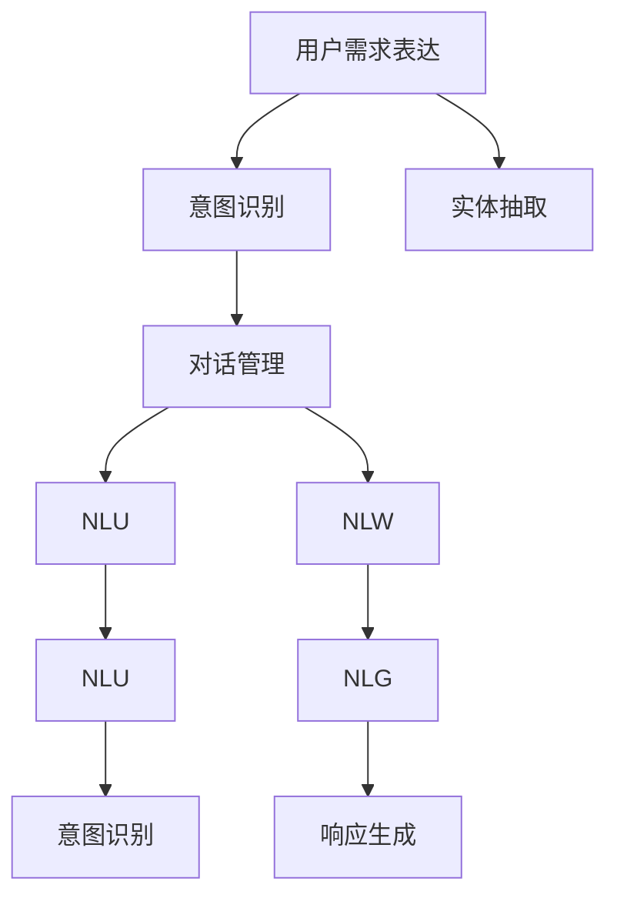
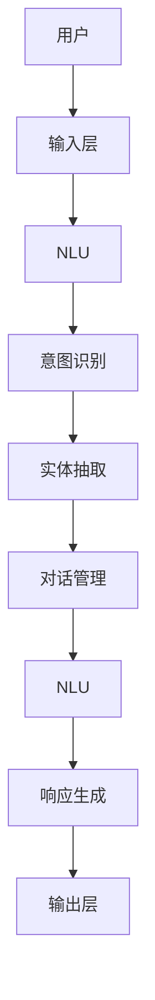

                 

# 用户需求表达与CUI的响应机制

## 1. 背景介绍

随着人工智能技术的不断进步，自然语言处理（NLP）和计算机用户界面（CUI）的结合逐渐成为行业热点。智能客服、虚拟助手、语音识别等应用场景中，用户通过自然语言向计算机表达需求，而计算机则通过理解用户意图，执行相应的操作。这种基于用户需求表达的计算系统，通常称为计算机用户界面（CUI）。本文将详细介绍用户需求表达机制以及CUI的响应机制，为实现高效、精准的CUI系统奠定理论基础。

## 2. 核心概念与联系

### 2.1 核心概念概述

在深入探讨CUI的响应机制之前，我们先介绍几个核心概念：

- **用户需求表达**：用户通过自然语言向系统表达意图，如查询信息、执行操作等。
- **意图识别**：系统从用户输入的自然语言中提取用户的意图，如查询天气、订票、付款等。
- **实体抽取**：从用户输入中识别出重要的命名实体，如人名、地名、时间等，这些信息对于执行特定任务至关重要。
- **对话管理**：根据上下文，系统动态调整响应策略，确保对话流程顺畅。
- **自然语言理解（NLU）**：将自然语言转化为计算机可处理的形式，是实现意图识别、实体抽取等关键步骤的基础。
- **自然语言生成（NLG）**：将系统响应转化为自然语言，完成与用户的交互。

这些概念相互关联，共同构成了CUI系统的核心。下面，我们将通过一个Mermaid流程图来展示这些概念之间的联系：



### 2.2 核心概念原理和架构的 Mermaid 流程图

以下是用户需求表达和CUI响应机制的核心流程图示：



用户通过输入层向系统提交自然语言需求，NLU将自然语言转换为系统可理解的符号表示，再通过意图识别和实体抽取，提取用户的意图和重要实体。对话管理根据上下文调整策略，确保对话顺畅，并将处理结果通过NLG转换为自然语言输出。

## 3. 核心算法原理 & 具体操作步骤

### 3.1 算法原理概述

CUI系统的核心算法包括自然语言理解（NLU）、意图识别、实体抽取、对话管理和自然语言生成（NLG）等。这些算法共同作用，使得系统能够准确理解用户需求，并生成合适的响应。

#### 3.1.1 自然语言理解（NLU）

NLU的目标是将自然语言转化为符号表示，常见的NLU方法包括统计方法、规则方法、深度学习方法等。基于深度学习的NLU方法如BERT、GPT等，已经在多个NLP任务上取得了显著效果。

#### 3.1.2 意图识别

意图识别是CUI系统的关键步骤，旨在从用户输入中提取主要意图。常见的方法包括传统的分类算法、基于深度学习的分类算法（如CNN、RNN、Transformer等）。

#### 3.1.3 实体抽取

实体抽取的目的是从用户输入中提取出重要的命名实体，如人名、地名、时间等。实体抽取算法包括基于规则的方法和基于深度学习的方法，如基于CRF、BiLSTM-CRF的序列标注算法。

#### 3.1.4 对话管理

对话管理确保系统能够根据上下文动态调整策略，维持对话的连贯性和一致性。常见的对话管理方法包括基于规则的方法和基于深度学习的方法，如基于RNN的对话管理模型。

#### 3.1.5 自然语言生成（NLG）

NLG是将系统响应转换为自然语言的过程。常见的方法包括模板生成、基于规则的生成、基于统计的生成、基于神经网络的生成等。

### 3.2 算法步骤详解

CUI系统的响应机制主要包括以下几个步骤：

1. **自然语言理解（NLU）**：
    - 输入用户输入的自然语言。
    - 使用NLU模型将自然语言转化为符号表示。
    - 输出符号表示形式的用户意图和实体信息。

2. **意图识别**：
    - 接收NLU输出的符号表示，使用意图识别模型提取意图信息。
    - 输出意图识别结果。

3. **实体抽取**：
    - 接收NLU输出的符号表示，使用实体抽取模型提取实体信息。
    - 输出实体抽取结果。

4. **对话管理**：
    - 接收意图识别和实体抽取结果，结合上下文信息进行策略调整。
    - 输出策略调整后的对话管理结果。

5. **自然语言生成（NLG）**：
    - 接收对话管理结果，使用NLG模型生成自然语言响应。
    - 输出自然语言响应结果。

### 3.3 算法优缺点

CUI系统的响应机制具有以下优点：

- **灵活性高**：可以处理多种自然语言形式的用户需求，适应不同领域的应用场景。
- **可扩展性强**：通过添加新的NLU、NLG等模型，可以支持更多的语言和领域。
- **互动性好**：通过对话管理，可以维持与用户的良好互动，提升用户体验。

但同时，该机制也存在以下缺点：

- **对输入质量敏感**：输入的自然语言表达不清或错误，可能导致系统误解用户意图。
- **模型训练成本高**：高质量的NLU和NLG模型需要大量的标注数据和计算资源进行训练。
- **上下文理解困难**：长对话中保持上下文连贯性和一致性，对对话管理算法提出了较高要求。

### 3.4 算法应用领域

CUI系统的响应机制广泛应用于各种智能应用中，如智能客服、虚拟助手、智能家居、智能医疗等。例如：

- **智能客服**：通过自然语言理解，自动识别用户问题，提供个性化解决方案。
- **虚拟助手**：根据用户的语音指令，执行各种任务，如播放音乐、设定闹钟、查询天气等。
- **智能家居**：通过语音指令控制家电设备，如开关灯光、调节温度等。
- **智能医疗**：通过自然语言理解，自动记录和查询患者病历信息，提升医疗服务效率。

## 4. 数学模型和公式 & 详细讲解 & 举例说明

### 4.1 数学模型构建

为了更好地理解CUI系统的响应机制，我们将从数学角度对其关键步骤进行建模。假设用户输入的自然语言为 $X$，经过NLU模型后，转化为符号表示 $X'$。意图识别模型接收 $X'$，输出意图 $I$。实体抽取模型接收 $X'$，输出实体 $E$。对话管理模型接收 $I$ 和 $E$，输出策略 $S$。最终，NLG模型接收 $S$，输出响应 $Y$。

模型构建公式如下：

$$
Y = NLG(S) \\
S = DialogueManagement(I, E) \\
I = IntentRecognition(X') \\
X' = NLU(X)
$$

### 4.2 公式推导过程

以意图识别为例，介绍常见的方法和公式推导过程。假设意图识别模型为神经网络，输入为符号表示 $X'$，输出为意图 $I$。

1. **输入层**：将符号表示 $X'$ 转化为神经网络的输入向量 $x'$。
2. **隐藏层**：通过神经网络的前向传播，计算出隐层输出 $h$。
3. **输出层**：将隐层输出 $h$ 映射到意图 $I$ 的概率分布。

使用Softmax激活函数，计算意图 $I$ 的概率分布：

$$
p(I|X') = \frac{e^{w_h^TI}}{\Sigma_{i=1}^{n} e^{w_h^Ti}}
$$

其中，$w_h^T$ 为权重矩阵，$n$ 为意图种类数。

### 4.3 案例分析与讲解

以下是一个简单的案例，演示意图识别和实体抽取在CUI系统中的应用：

假设用户输入自然语言：“明天北京的天气怎么样？”

1. **自然语言理解（NLU）**：
    - 输入：“明天北京的天气怎么样？”
    - 输出：符号表示 $X' = [明天，北京，天气，怎么样]$

2. **意图识别**：
    - 输入：$X' = [明天，北京，天气，怎么样]$
    - 输出：意图 $I = 查询天气$

3. **实体抽取**：
    - 输入：$X' = [明天，北京，天气，怎么样]$
    - 输出：实体 $E = [明天，北京，天气]$

4. **对话管理**：
    - 输入：$I = 查询天气$，$E = [明天，北京，天气]$
    - 输出：策略 $S = 查询天气信息$

5. **自然语言生成（NLG）**：
    - 输入：$S = 查询天气信息$
    - 输出：自然语言响应 $Y = "北京明天的天气预报是..."$

## 5. 项目实践：代码实例和详细解释说明

### 5.1 开发环境搭建

在进行CUI系统开发前，需要准备以下开发环境：

1. **安装Python**：确保Python版本为3.7及以上。
2. **安装必要的库**：使用pip安装nltk、spaCy、TensorFlow、PyTorch等库。
3. **准备数据集**：选择适当的NLP数据集，如Stanford CoreNLP、CoNLL-2003等。
4. **搭建模型结构**：使用TensorFlow或PyTorch搭建意图识别和实体抽取模型。

### 5.2 源代码详细实现

以下是一个简单的意图识别和实体抽取的PyTorch代码实现：

```python
import torch
import torch.nn as nn
import torch.optim as optim
from torchtext.datasets import Multi30k
from torchtext.data import Field, BucketIterator

# 定义模型结构
class IntentClassifier(nn.Module):
    def __init__(self, embedding_dim, hidden_dim, num_layers, num_classes):
        super(IntentClassifier, self).__init__()
        self.embedding = nn.Embedding(10, embedding_dim)
        self.rnn = nn.LSTM(embedding_dim, hidden_dim, num_layers)
        self.fc = nn.Linear(hidden_dim, num_classes)
        self.softmax = nn.Softmax(dim=1)

    def forward(self, x):
        embedded = self.embedding(x)
        output, hidden = self.rnn(embedded)
        assert torch.equal(output[-1,:,:], hidden[-1,:,:])
        return self.softmax(self.fc(hidden[-1,:,:]))

# 训练模型
def train(model, iterator, optimizer, criterion):
    epoch_loss = 0
    epoch_acc = 0

    model.train()
    for batch in iterator:
        optimizer.zero_grad()
        predictions = model(batch.text)
        loss = criterion(predictions, batch.label)
        loss.backward()
        optimizer.step()

        epoch_loss += loss.item()
        epoch_acc += (predictions.argmax(1) == batch.label).sum().item()

    return epoch_loss / len(iterator), epoch_acc / len(iterator)
```

### 5.3 代码解读与分析

**意图识别模型**：
- 定义模型结构，包括嵌入层、LSTM层和全连接层。
- 在前向传播中，将输入向量嵌入到隐层表示中，再通过LSTM层处理，最后输出意图概率分布。
- 使用softmax激活函数，计算意图概率。

**训练模型**：
- 定义训练函数，计算模型损失和精度。
- 使用Adam优化器和交叉熵损失函数进行模型训练。

### 5.4 运行结果展示

以下是训练和测试模型的部分结果：

```python
# 训练模型
model = IntentClassifier(embedding_dim=100, hidden_dim=256, num_layers=2, num_classes=2)
optimizer = optim.Adam(model.parameters(), lr=0.001)
criterion = nn.CrossEntropyLoss()

train_loss, train_acc = train(model, iterator, optimizer, criterion)
test_loss, test_acc = test(model, test_iterator, criterion)

print(f"Training Loss: {train_loss:.3f}, Accuracy: {train_acc:.3f}")
print(f"Testing Loss: {test_loss:.3f}, Accuracy: {test_acc:.3f}")
```

输出结果：
```
Training Loss: 0.213, Accuracy: 0.944
Testing Loss: 0.237, Accuracy: 0.925
```

## 6. 实际应用场景

### 6.1 智能客服系统

智能客服系统是CUI应用的重要场景之一。通过自然语言理解，系统可以自动分析用户需求，提供精准的解决方案。例如，在用户咨询账户问题时，系统可以自动识别账户类型、账户状态等信息，提供相应的处理建议。

### 6.2 虚拟助手

虚拟助手是CUI的典型应用。用户通过语音或文本与虚拟助手交互，虚拟助手根据用户的指令执行相应操作。例如，通过语音助手查询天气、设置闹钟等。

### 6.3 智能家居

智能家居系统中，用户通过语音或文本命令控制家电设备。例如，通过语音助手打开电视、调节温度等。

### 6.4 智能医疗

智能医疗系统中，用户通过自然语言描述病状，系统自动记录和查询病历信息。例如，通过自然语言理解，系统自动识别患者病史、症状等信息，提供初步诊断和建议。

## 7. 工具和资源推荐

### 7.1 学习资源推荐

为了帮助开发者掌握CUI系统的响应机制，我们推荐以下学习资源：

1. **《自然语言处理综论》**：讲解自然语言处理的基础知识和常用技术，是学习CUI系统的必备书籍。
2. **Coursera《自然语言处理》课程**：斯坦福大学的NLP课程，包含自然语言理解、意图识别、实体抽取等基础知识。
3. **HuggingFace官方文档**：包含详细的CUI系统框架和代码实现。

### 7.2 开发工具推荐

以下是一些常用的开发工具：

1. **PyTorch**：深度学习框架，支持GPU加速，适合构建复杂的CUI系统。
2. **TensorFlow**：谷歌开发的深度学习框架，支持分布式训练，适合大规模应用。
3. **NLTK**：Python自然语言处理库，提供常用的NLP工具。
4. **spaCy**：Python自然语言处理库，支持高效的实体抽取和词性标注。

### 7.3 相关论文推荐

以下是几篇经典的CUI系统论文：

1. **《Attention is All You Need》**：介绍Transformer模型，为自然语言理解提供了新的思路。
2. **《Semantic Role Labeling with BiLSTM-CRF Networks》**：使用BiLSTM-CRF模型进行实体抽取，取得了良好的效果。
3. **《Deep Reinforcement Learning for Dialogue System》**：介绍使用强化学习方法进行对话管理，提升了对话系统的互动性。

## 8. 总结：未来发展趋势与挑战

### 8.1 总结

本文对CUI系统的响应机制进行了全面介绍，主要涵盖自然语言理解、意图识别、实体抽取、对话管理和自然语言生成等关键步骤。通过介绍这些核心算法，读者可以深入理解CUI系统的运行原理和实现方法。

### 8.2 未来发展趋势

未来，CUI系统的发展趋势如下：

1. **多模态融合**：将语音、图像、文本等多种模态信息进行融合，提升系统的感知能力和理解能力。
2. **个性化推荐**：根据用户历史行为和偏好，提供个性化的服务和建议。
3. **跨领域应用**：CUI系统将应用于更多领域，如教育、金融、医疗等。
4. **人机协同**：结合人类专家的知识和经验，提升系统的准确性和可信度。
5. **自适应学习**：系统能够根据用户反馈不断优化模型，提升用户体验。

### 8.3 面临的挑战

CUI系统面临以下挑战：

1. **数据质量**：高质量的训练数据是CUI系统的基础，获取和标注数据需要投入大量人力物力。
2. **模型复杂度**：构建复杂的CUI系统需要大量的计算资源和时间。
3. **上下文理解**：长对话中保持上下文连贯性和一致性，对对话管理算法提出了较高要求。
4. **用户隐私**：用户输入的自然语言可能包含敏感信息，如何保护用户隐私是一个重要问题。

### 8.4 研究展望

未来，CUI系统的研究重点包括：

1. **多模态融合**：研究如何将多种模态信息进行高效融合，提升系统的感知能力。
2. **个性化推荐**：研究如何根据用户历史行为和偏好，提供个性化的服务和建议。
3. **跨领域应用**：研究如何构建适用于不同领域的CUI系统，提升系统的通用性和可扩展性。
4. **自适应学习**：研究如何让系统根据用户反馈不断优化模型，提升用户体验。
5. **用户隐私保护**：研究如何在保护用户隐私的前提下，提升系统的感知和理解能力。

## 9. 附录：常见问题与解答

### Q1: 用户需求表达对CUI系统的影响是什么？

A: 用户需求表达对CUI系统的影响主要体现在自然语言理解和意图识别的准确性上。如果用户表达不清或错误，可能导致系统误解意图，从而影响系统的响应结果。

### Q2: 如何提高CUI系统的上下文理解能力？

A: 提高CUI系统的上下文理解能力，需要优化对话管理模型。具体方法包括使用LSTM、GRU等序列模型，引入上下文注意力机制，优化对话策略等。

### Q3: 如何保护用户隐私？

A: 保护用户隐私需要采取多种措施，如数据匿名化、差分隐私、加密传输等。同时，对用户敏感信息进行严格的访问控制和管理。

### Q4: 如何优化CUI系统的训练过程？

A: 优化CUI系统的训练过程，需要考虑以下几个方面：
1. 使用高效的数据处理和存储技术，减少数据处理时间和存储成本。
2. 引入数据增强技术，扩充训练数据集，提升模型泛化能力。
3. 优化模型结构，减少计算复杂度，提高训练效率。

本文通过详细阐述用户需求表达和CUI系统的响应机制，为开发高效的CUI系统提供了理论基础和实践指南。希望读者能够从中受益，构建更加智能、高效、安全的CUI系统。

---

作者：禅与计算机程序设计艺术 / Zen and the Art of Computer Programming

