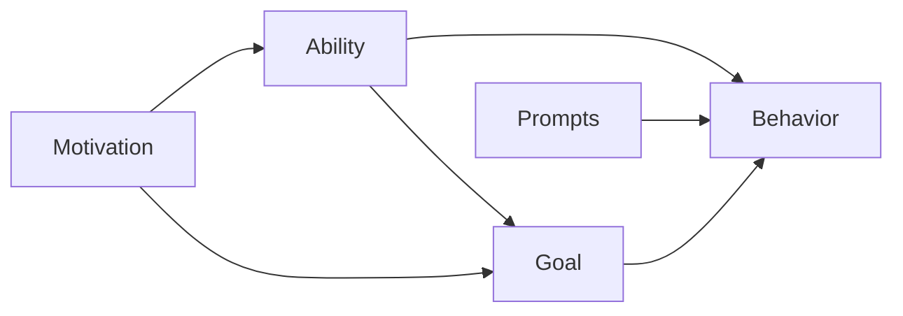
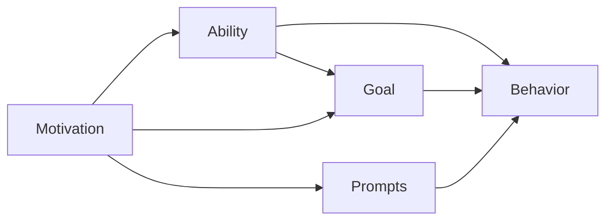

                 

# 用福格模型打造高绩效团队

> 关键词：
> - 福格模型
> - 行为设计
> - 绩效管理
> - 团队协作
> - 目标实现
> - 动机激发
> - 行为改变

## 1. 背景介绍

### 1.1 问题由来

随着信息技术的飞速发展和市场竞争的加剧，企业对团队绩效管理的要求也越来越高。然而，许多企业在制定和执行绩效目标时，往往面临诸多挑战。一方面，组织目标与个体目标难以完全对齐，导致团队成员的积极性不高。另一方面，目标设定过于复杂、不切实际，员工难以实际执行。如何设计出既能激发员工内在动力，又能实现组织目标的管理模式，成为摆在企业管理者面前的重要课题。

福格模型（Fogg Model）作为一种行为设计方法，通过理解人类行为与环境交互的机制，帮助团队和个人有效设定并实现目标。本文将详细探讨福格模型的核心原理，以及如何将福格模型应用于打造高绩效团队。

### 1.2 问题核心关键点

福格模型由行为科学家布莱恩·福格（Bjarte lngebrigtsen）提出，强调将复杂目标分解为简单行为，进而设计出实现这些行为的路径。其核心思想可以概括为：

1. **动机（Motivation）**：了解个体对行为的内在驱动力，包括能力、意愿和提示。
2. **能力（Ability）**：评估个体完成某项行为所需的能力和资源。
3. **提示（Prompts）**：设计合适的线索和触发器，帮助个体顺利执行行为。

通过这三个关键维度，福格模型能够有效引导个体进行行为改变，最终达成目标。

## 2. 核心概念与联系

### 2.1 核心概念概述

福格模型的核心概念包括动机、能力和提示，其相互关系可以通过以下示意图表示：



- **动机（Motivation）**：驱动个体行为的内在动力，包括好奇心、愉悦感、成就感等。
- **能力（Ability）**：执行行为所需的资源和技能，如时间、资金、知识、工具等。
- **提示（Prompts）**：触发行为执行的线索，如声音、视觉、触觉等。
- **行为（Behavior）**：个体在特定情境下采取的行动。
- **目标（Goal）**：个体希望通过行为达成的结果，包括短期和长期目标。

这些概念之间的联系体现在：
- **动机**驱动**行为**，是行为的源泉。
- **能力**和**提示**共同作用于**行为**，使行为成为可能。
- **目标**则是行为的最终方向，通过一系列行为实现。

### 2.2 核心概念原理和架构的 Mermaid 流程图



这个流程图展示了福格模型中各概念之间的交互关系。动机不仅影响行为，还通过影响能力和提示的分配，从而对目标实现产生间接影响。提示则是通过触发行为，进而影响能力的利用和目标的实现。

## 3. 核心算法原理 & 具体操作步骤

### 3.1 算法原理概述

福格模型的行为设计原理基于“一个行为三要素”理论：动机、能力和提示。通过了解和优化这三个要素，可以显著提高行为发生的概率，从而推动目标的实现。

具体而言，福格模型将目标拆分为简单可执行的“行动单元”，通过合理设计触发器和奖励机制，激励个体执行行动。这一过程可以通过以下步骤进行：

1. **设定SMART目标**：确保目标具有具体性（Specific）、可测量性（Measurable）、可实现性（Achievable）、相关性（Relevant）和时限性（Time-bound）。
2. **评估能力和动机**：评估目标执行所需的资源和个体动机水平，确定行动路径。
3. **设计提示和奖励**：设计合适的线索和奖励机制，提高行为发生的概率。
4. **执行并迭代**：执行行动计划，根据反馈调整和优化提示和奖励，直至达成目标。

### 3.2 算法步骤详解

以下是使用福格模型进行行为设计的详细步骤：

**Step 1: 设定SMART目标**

1. **具体性（Specific）**：明确目标的实施细节，避免模糊不清。
2. **可测量性（Measurable）**：设定明确的衡量标准，如完成时间、指标等。
3. **可实现性（Achievable）**：确保目标具有挑战性但可达成。
4. **相关性（Relevant）**：目标应与个体的价值观和职业发展目标相一致。
5. **时限性（Time-bound）**：设定明确的时间框架，避免无限期拖延。

**Step 2: 评估能力和动机**

1. **动机评估**：通过问卷调查、访谈等方式了解个体的动机水平，包括兴趣、成就感和愉悦感。
2. **能力评估**：评估个体完成目标所需的技能和资源，识别潜在的障碍和解决方案。

**Step 3: 设计提示和奖励**

1. **设计提示**：根据个体动机和能力，设计合适的线索和触发器。如通过邮件提醒、可视化仪表盘、奖励机制等。
2. **设计奖励**：设置合理的奖励机制，如物质奖励、精神奖励、社交奖励等，激励个体执行行为。

**Step 4: 执行并迭代**

1. **执行行动计划**：根据设计好的目标和提示，引导个体执行行动。
2. **收集反馈**：定期收集个体执行行为的反馈，评估效果。
3. **优化提示和奖励**：根据反馈调整和优化提示和奖励，确保行动计划的持续有效性。

### 3.3 算法优缺点

福格模型具有以下优点：

1. **简单易行**：将复杂目标分解为简单行为，易于理解和实施。
2. **效果显著**：通过优化动机、能力和提示，能有效提升行为发生的概率。
3. **灵活多样**：可以根据不同个体和情境，设计个性化的行动计划。

同时，福格模型也存在以下局限性：

1. **复杂性**：需要系统评估个体动机、能力和环境因素，工作量较大。
2. **外部因素**：行为改变受到外部环境和不可控因素的影响，难以完全控制。
3. **个体差异**：不同个体动机和能力的差异，导致设计提示和奖励的难度增加。

尽管如此，福格模型仍是一种有效的行为设计方法，适合在团队管理和个人发展中广泛应用。

### 3.4 算法应用领域

福格模型广泛应用于行为设计和绩效管理领域，其应用场景包括但不限于：

- **个人发展**：设定健康目标、职业规划等。
- **企业培训**：设计员工行为改进计划，提升培训效果。
- **团队协作**：优化项目执行流程，提高团队合作效率。
- **市场推广**：设计产品推广策略，提升市场影响力。
- **品牌建设**：提升品牌形象和消费者认知。

## 4. 数学模型和公式 & 详细讲解 & 举例说明

### 4.1 数学模型构建

福格模型的数学模型可以概括为以下几个核心公式：

$$
\text{Behavior} = \text{Motivation} \times \text{Ability} \times \text{Prompts}
$$

其中，$\text{Behavior}$表示个体执行行为的概率，$\text{Motivation}$表示个体的动机水平，$\text{Ability}$表示个体完成行为的能力，$\text{Prompts}$表示触发行为的线索和提示。

### 4.2 公式推导过程

根据上述公式，福格模型通过以下推导过程理解行为改变的过程：

1. **动机评估**：通过问卷和访谈了解个体对行为的兴趣、愉悦感和成就感。
2. **能力评估**：通过分析个体的时间、资源、技能等因素，确定执行行为的难度。
3. **提示设计**：根据动机和能力，设计合适的线索和触发器，提高行为发生的概率。
4. **行为预测**：根据动机、能力和提示，预测个体执行行为的可能性。

### 4.3 案例分析与讲解

**案例：提升团队成员的编程效率**

1. **设定SMART目标**：提高团队成员每周的编程效率，具体目标为“每周至少完成50行有效代码”。
2. **评估能力和动机**：通过问卷调查了解成员的编程能力和动机水平。发现部分成员对编程缺乏兴趣，且部分成员缺少必要的工具和资源。
3. **设计提示和奖励**：设计以下提示和奖励机制：
   - **提示**：每天早上邮件提醒任务清单、可视化进度条、集成代码质量检测工具。
   - **奖励**：每周评选“最佳编程之星”，颁发小礼品和团队表扬。
4. **执行并迭代**：实施上述计划，每周收集反馈，调整和优化提示和奖励。

经过一个月的执行，团队成员的编程效率显著提升，达到了预期的目标。

## 5. 项目实践：代码实例和详细解释说明

### 5.1 开发环境搭建

1. **安装Python**：从官网下载并安装Python 3.x版本。
2. **安装必要的库**：安装numpy、pandas、matplotlib等库，用于数据分析和可视化。
3. **搭建数据收集平台**：使用MySQL或MongoDB等数据库，搭建数据收集平台，记录行为数据。
4. **搭建行为分析系统**：使用Flask框架搭建Web应用，提供数据收集、分析和管理界面。

### 5.2 源代码详细实现

**代码示例1：数据收集**

```python
import pandas as pd
import numpy as np

# 定义行为数据表结构
data = pd.DataFrame({
    "User": ["Alice", "Bob", "Charlie"],
    "Time": pd.to_datetime(["2022-01-01", "2022-01-02", "2022-01-03"]),
    "Action": ["Coding", "Reading", "Coding"],
    "Duration": [120, 60, 90],
    "Context": ["Office", "Library", "Home"]
})

# 输出行为数据
print(data)
```

**代码示例2：数据分析**

```python
# 行为数据统计分析
data.groupby("Action")["Duration"].sum()
```

**代码示例3：可视化**

```python
import matplotlib.pyplot as plt

# 绘制行为频率图
plt.bar(data["Action"], data["Duration"])
plt.xlabel("Action")
plt.ylabel("Duration")
plt.title("Coding Duration by User")
plt.show()
```

### 5.3 代码解读与分析

上述代码示例展示了如何使用Python进行行为数据的收集、分析和可视化。通过搭建数据收集平台和行为分析系统，可以实时监测和分析团队成员的行为数据，从而优化行为设计。

## 6. 实际应用场景

### 6.1 智能客服系统

福格模型可以应用于智能客服系统的行为设计，提升客服人员的服务质量和客户满意度。具体而言，可以通过以下步骤进行设计：

1. **设定SMART目标**：提高客服人员响应时间，具体目标为“平均响应时间低于1分钟”。
2. **评估能力和动机**：通过问卷调查了解客服人员的技能和动机水平。
3. **设计提示和奖励**：设计以下提示和奖励机制：
   - **提示**：智能客服系统自动分配客户，实时监控响应时间。
   - **奖励**：评选“最佳客服”，颁发奖励和团队表扬。
4. **执行并迭代**：实施上述计划，每周收集反馈，调整和优化提示和奖励。

经过优化，客服人员的响应时间显著降低，客户满意度显著提升。

### 6.2 金融舆情监测

福格模型可以应用于金融舆情监测，提升舆情分析的准确性和及时性。具体而言，可以通过以下步骤进行设计：

1. **设定SMART目标**：提高舆情监测的及时性，具体目标为“舆情监测时间缩短50%”。
2. **评估能力和动机**：通过问卷调查了解舆情分析团队的技能和动机水平。
3. **设计提示和奖励**：设计以下提示和奖励机制：
   - **提示**：实时数据流自动推送，提醒分析人员处理舆情。
   - **奖励**：评选“最佳舆情分析师”，颁发奖励和团队表扬。
4. **执行并迭代**：实施上述计划，每周收集反馈，调整和优化提示和奖励。

经过优化，舆情监测时间显著缩短，金融风险预警能力显著提升。

### 6.3 个性化推荐系统

福格模型可以应用于个性化推荐系统，提升推荐效果和用户满意度。具体而言，可以通过以下步骤进行设计：

1. **设定SMART目标**：提高推荐系统的准确性，具体目标为“推荐准确率提升10%”。
2. **评估能力和动机**：通过问卷调查了解推荐工程师的技能和动机水平。
3. **设计提示和奖励**：设计以下提示和奖励机制：
   - **提示**：实时数据流自动推送，提醒工程师优化推荐模型。
   - **奖励**：评选“最佳推荐工程师”，颁发奖励和团队表扬。
4. **执行并迭代**：实施上述计划，每周收集反馈，调整和优化提示和奖励。

经过优化，推荐准确率显著提升，用户满意度显著提升。

## 7. 工具和资源推荐

### 7.1 学习资源推荐

为了帮助企业深入理解福格模型，以下是推荐的几个学习资源：

1. **书籍《 Behavior Design》**：作者：Bjarte lngebrigtsen，深入浅出地介绍了福格模型的原理和应用。
2. **在线课程《 Designing Better Habits》**：由Coursera提供，讲解福格模型在行为设计中的实际应用。
3. **博客《行为设计实践》**：作者：Bjarte lngebrigtsen，分享了福格模型在企业中的应用案例。

通过这些资源的学习，企业可以系统掌握福格模型的核心原理和应用方法，提升团队绩效和组织效能。

### 7.2 开发工具推荐

以下是几个用于福格模型行为设计开发的常用工具：

1. **Python**：Python是一种通用编程语言，适合进行数据处理和行为分析。
2. **Jupyter Notebook**：Jupyter Notebook是一个交互式编程环境，适合进行数据可视化和模型调试。
3. **Flask**：Flask是一个轻量级的Web框架，适合搭建行为分析和管理系统。

合理利用这些工具，可以显著提升福格模型的开发效率和应用效果。

### 7.3 相关论文推荐

福格模型是一种前沿行为设计理论，其相关研究领域在学术界也得到了广泛的关注。以下是几篇相关的经典论文，推荐阅读：

1. **《 Why We Don't Change and What We Can Do About It》**：作者：Bjarte lngebrigtsen，总结了福格模型的核心思想和应用案例。
2. **《 Achieving Large-Scale Behavior Change》**：作者：Fogg，讨论了福格模型在企业行为设计中的应用。
3. **《 Designing for Behavioral Change: Principles and Strategies for Designing Dynamic Products》**：作者：Bjarte lngebrigtsen，介绍了福格模型在产品设计中的应用策略。

这些论文代表了福格模型的最新研究进展，帮助读者深入理解其理论和应用。

## 8. 总结：未来发展趋势与挑战

### 8.1 总结

本文对福格模型的核心原理和应用方法进行了详细探讨。通过设定SMART目标、评估能力和动机、设计提示和奖励，福格模型能够有效推动行为改变，实现目标。在个人发展、企业培训、团队协作等多个领域，福格模型都展现了其强大的应用潜力。

### 8.2 未来发展趋势

福格模型的未来发展趋势主要体现在以下几个方面：

1. **技术融合**：福格模型将与其他人工智能技术，如机器学习、自然语言处理等，进行更深入的融合，提升行为设计的智能化水平。
2. **多领域应用**：福格模型将进一步扩展到更多领域，如健康、教育、金融等，推动相关领域的创新和进步。
3. **个性化定制**：福格模型将更多地应用于个性化定制，通过大数据和智能算法，实现更精准的行为设计。
4. **实时反馈**：随着物联网和智能设备的发展，福格模型将更多地应用实时反馈机制，实现动态优化和实时调整。
5. **跨文化适用性**：福格模型将更加注重跨文化适用性，适应不同文化背景和价值观的用户需求。

### 8.3 面临的挑战

尽管福格模型在行为设计中展现了其强大的应用潜力，但在实际应用中也面临诸多挑战：

1. **数据隐私**：在行为设计过程中，如何保护用户数据隐私，防止数据滥用，是一个重要的挑战。
2. **用户接受度**：如何设计合适的提示和奖励机制，使用户接受并积极参与行为设计，是一个需要深入研究的问题。
3. **实施难度**：福格模型需要在多个层面进行综合优化，实际操作过程中可能遇到多方面的复杂因素，需要系统化的方法和工具支持。
4. **效果评估**：如何科学评估行为设计的实际效果，是一个需要多维度指标和科学方法解决的问题。

### 8.4 研究展望

福格模型的未来研究可以从以下几个方面进行：

1. **行为设计理论的拓展**：进一步深入研究人类行为与环境交互的机制，拓展福格模型的理论基础。
2. **跨学科应用**：将福格模型与其他学科知识结合，提升行为设计的跨学科应用能力。
3. **技术工具的创新**：开发更多高效的行为设计工具和平台，提升应用便捷性和可操作性。
4. **伦理和社会责任**：在行为设计过程中，注重伦理和社会责任，确保行为设计的应用公正、公平。

## 9. 附录：常见问题与解答

**Q1：如何设定SMART目标？**

A: 设定SMART目标的过程包括：
- **具体性（Specific）**：明确行为的具体细节，避免模糊不清。
- **可测量性（Measurable）**：设定明确的衡量标准，如完成时间、指标等。
- **可实现性（Achievable）**：确保目标具有挑战性但可达成。
- **相关性（Relevant）**：目标应与个体的价值观和职业发展目标相一致。
- **时限性（Time-bound）**：设定明确的时间框架，避免无限期拖延。

**Q2：如何评估能力和动机？**

A: 评估能力和动机可以通过以下方式进行：
- **问卷调查**：设计问卷，了解个体的技能、兴趣和动机水平。
- **访谈**：与个体进行深入访谈，了解其行为习惯和心理状态。
- **行为观察**：观察个体的实际行为，分析其能力和动机。

**Q3：如何设计提示和奖励？**

A: 设计提示和奖励应遵循以下几个原则：
- **可操作性**：提示和奖励应简单易行，易于理解和执行。
- **激励性**：设计合理的激励机制，提升个体执行行为的动机。
- **即时反馈**：提供即时反馈，使个体能够及时了解行为效果。

**Q4：如何处理数据隐私问题？**

A: 处理数据隐私问题可以采取以下措施：
- **匿名化**：对行为数据进行匿名化处理，防止个人隐私泄露。
- **数据加密**：采用加密技术保护数据传输和存储的安全性。
- **用户知情**：在收集和使用数据前，明确告知用户并获得其同意。

**Q5：如何评估行为设计的实际效果？**

A: 评估行为设计的实际效果可以从以下几个方面进行：
- **行为频率**：评估个体执行行为的频率，是否达到预期目标。
- **行为质量**：评估行为的质量，是否符合预期标准。
- **反馈满意度**：收集个体对行为设计的反馈，评估其满意度和接受度。

---

作者：禅与计算机程序设计艺术 / Zen and the Art of Computer Programming

