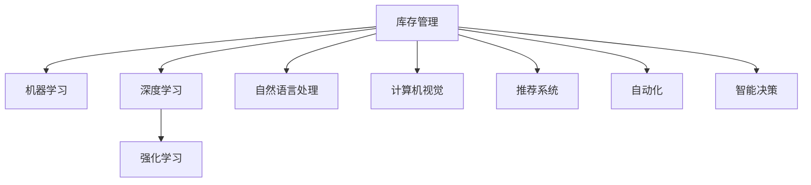

                 

# 电商平台供给能力提升：人工智能技术应用

## 1. 背景介绍

### 1.1 问题由来

在电子商务的发展过程中，如何提升供应链的效率和精准性一直是平台关注的重点。随着消费者需求的快速变化和市场环境的瞬息万变，传统的供给管理方式越来越难以应对。电商平台面临的挑战包括：

- **库存管理难度大**：商品种类繁多，库存状态复杂，难以实时了解库存变动情况。
- **需求预测不准确**：需求波动大，库存预警不及时，经常出现缺货或库存积压。
- **供应链协调困难**：供应链涉及多环节，协同效率低，信息流通不畅。
- **订单处理速度慢**：订单处理流程繁琐，人工干预多，效率低下。

为应对这些挑战，电商平台开始引入人工智能技术，提升其供给能力，优化库存管理，提高预测准确性和供应链协调效率，最终实现订单处理速度的提升。

### 1.2 问题核心关键点

人工智能技术在电商平台供给能力提升中的应用，主要围绕以下几个关键点展开：

- **库存管理**：通过AI技术实时监控库存状态，优化补货和盘点策略。
- **需求预测**：利用AI模型对销售数据进行分析，提高需求预测的准确性。
- **供应链协调**：通过AI技术优化供应链流程，实现各环节的信息互通和协同。
- **订单处理**：引入AI技术自动化订单处理流程，提升效率和准确性。

基于这些关键点，本文将深入探讨如何应用人工智能技术，提升电商平台的供给能力，实现更高效的库存管理和更精准的需求预测。

## 2. 核心概念与联系

### 2.1 核心概念概述

在讨论电商平台供给能力提升的人工智能技术应用时，涉及以下核心概念：

- **人工智能(AI)**：旨在模拟人类智能行为，通过算法和模型处理信息的技术。
- **机器学习(ML)**：让机器从数据中学习，自动优化模型的一种方法。
- **深度学习(DL)**：基于神经网络模型，通过多层非线性变换学习数据特征的AI技术。
- **强化学习(RL)**：通过试错过程，使智能体在特定环境中最大化奖励的AI技术。
- **自然语言处理(NLP)**：使计算机能够理解和处理人类语言的技术。
- **计算机视觉(CV)**：使计算机能够“看”和理解图像的AI技术。
- **推荐系统(Recommendation System)**：基于用户行为和商品特性，推荐合适的商品给用户的系统。
- **自动化**：通过AI技术实现流程自动化，减少人工干预。
- **智能决策**：利用AI模型对大量数据进行分析，辅助人类决策。

这些核心概念之间存在紧密的联系，共同构成了电商平台供给能力提升的AI技术框架。

### 2.2 核心概念原理和架构的 Mermaid 流程图



## 3. 核心算法原理 & 具体操作步骤

### 3.1 算法原理概述

基于人工智能技术的电商平台供给能力提升，主要通过以下算法实现：

- **机器学习算法**：用于库存管理中的需求预测和库存优化。
- **深度学习算法**：用于图像识别和自然语言处理，辅助供应链管理。
- **强化学习算法**：用于自动化订单处理和供应链优化。
- **推荐系统算法**：用于个性化推荐，提高用户满意度。

这些算法相互协作，共同实现电商平台的智能化供给管理。

### 3.2 算法步骤详解

#### 3.2.1 需求预测

需求预测是电商平台库存管理的重要环节，准确的预测可以帮助平台优化库存水平，减少缺货和库存积压。常用的算法包括：

- **时间序列分析**：利用历史销售数据进行时间序列分析，预测未来需求。
- **回归分析**：通过多元回归分析，建立需求预测模型。
- **集成学习**：结合多种预测方法，提高预测准确性。

具体步骤如下：

1. 收集历史销售数据，包括时间、商品种类、销售量等。
2. 对数据进行预处理，包括清洗、归一化等操作。
3. 选择适合的需求预测模型，如ARIMA、LSTM等。
4. 使用模型对历史数据进行拟合，生成预测曲线。
5. 在验证集上评估模型性能，调整参数，最终用于库存管理。

#### 3.2.2 库存优化

库存优化是通过智能算法优化库存管理，提高库存周转率和资金利用效率。常用的算法包括：

- **基于规则的库存管理**：根据库存规则，自动调整库存水平。
- **模拟退火算法**：通过随机搜索和温度衰减，找到最优库存策略。
- **遗传算法**：通过遗传操作，逐步优化库存策略。

具体步骤如下：

1. 设定库存上下限，建立库存规则。
2. 对库存进行实时监控，记录库存状态。
3. 使用模拟退火或遗传算法，根据库存状态自动调整库存水平。
4. 定期评估库存优化效果，调整策略。

#### 3.2.3 供应链优化

供应链优化是通过AI技术优化供应链流程，提高供应链协同效率。常用的算法包括：

- **协同优化算法**：通过协同优化，提高供应链各环节的效率。
- **物流优化算法**：通过路径规划和配送调度，优化物流成本。
- **需求响应算法**：通过需求响应，优化供应链弹性。

具体步骤如下：

1. 收集供应链数据，包括订单、库存、物流等。
2. 对数据进行预处理，建立供应链模型。
3. 使用协同优化算法，生成最优供应链方案。
4. 在测试环境中验证方案效果，逐步优化供应链流程。

#### 3.2.4 订单处理

订单处理是电商平台的基础功能，高效的订单处理系统能够显著提升用户体验。常用的算法包括：

- **自动化流程**：通过规则引擎和自动化工具，自动化处理订单。
- **机器学习分类**：利用机器学习模型，对订单进行分类和处理。
- **自然语言处理**：通过NLP技术，处理订单中的文本信息。

具体步骤如下：

1. 收集订单数据，包括订单号、商品信息、支付信息等。
2. 对数据进行预处理，包括清洗、标准化等操作。
3. 选择适合的算法，如规则引擎、分类器等，自动化处理订单。
4. 使用NLP技术，处理订单中的文本信息，如商品描述、用户评价等。
5. 定期评估订单处理效果，调整算法参数，优化订单处理流程。

### 3.3 算法优缺点

#### 3.3.1 需求预测

**优点**：
- 高精度：通过机器学习和深度学习算法，能够精确预测需求。
- 实时性：基于实时数据，能够快速生成预测结果。
- 可扩展性：可以适用于多种商品和市场环境。

**缺点**：
- 数据依赖：预测模型的效果高度依赖历史数据的准确性和完整性。
- 模型复杂：需要大量计算资源和数据进行模型训练。
- 解释性差：预测模型的内部机制难以解释，影响信任度。

#### 3.3.2 库存优化

**优点**：
- 自动化管理：通过智能算法，自动调整库存水平，减少人工干预。
- 高效率：实时监控和优化库存，提高库存周转率。
- 低成本：减少人工操作和库存管理成本。

**缺点**：
- 模型复杂：需要复杂的算法和大量数据训练。
- 初始成本高：需要投入大量计算资源进行模型训练和优化。
- 系统复杂：需要建立复杂的库存管理系统。

#### 3.3.3 供应链优化

**优点**：
- 协同效率高：通过协同优化算法，提高供应链各环节的效率。
- 成本低：优化物流路径和配送调度，降低物流成本。
- 弹性好：通过需求响应算法，提高供应链的弹性。

**缺点**：
- 数据依赖：优化模型的效果高度依赖供应链数据的完整性和准确性。
- 系统复杂：需要建立复杂的供应链管理系统。
- 初始成本高：需要投入大量计算资源进行模型训练和优化。

#### 3.3.4 订单处理

**优点**：
- 高效率：通过自动化流程和机器学习分类，提高订单处理速度和准确性。
- 低成本：减少人工操作和错误率，降低订单处理成本。
- 用户体验好：快速、准确的订单处理提升用户体验。

**缺点**：
- 系统复杂：需要建立复杂的订单处理系统。
- 数据依赖：系统效果高度依赖订单数据的准确性和完整性。
- 初始成本高：需要投入大量计算资源进行模型训练和优化。

### 3.4 算法应用领域

#### 3.4.1 需求预测

需求预测在多个领域都有广泛应用，包括：

- **零售行业**：通过预测销售趋势，优化库存管理，提高供应链效率。
- **制造业**：通过预测生产需求，优化生产计划，减少生产浪费。
- **电商行业**：通过预测订单量，优化库存水平，提高客户满意度。

#### 3.4.2 库存优化

库存优化在零售和电商领域尤为重要，具体应用包括：

- **零售行业**：通过优化库存策略，提高商品周转率，减少库存成本。
- **电商行业**：通过优化库存管理，提升用户体验，增加销售额。

#### 3.4.3 供应链优化

供应链优化在制造和物流领域有广泛应用，具体包括：

- **制造业**：通过优化供应链流程，提高生产效率，降低成本。
- **物流行业**：通过优化物流路径和配送调度，降低物流成本，提升配送速度。

#### 3.4.4 订单处理

订单处理在电商和零售领域有广泛应用，具体包括：

- **电商行业**：通过自动化订单处理，提高订单处理速度，提升用户体验。
- **零售行业**：通过自动化订单处理，提高订单处理效率，降低人工成本。

## 4. 数学模型和公式 & 详细讲解 & 举例说明

### 4.1 数学模型构建

#### 4.1.1 需求预测

需求预测通常使用时间序列分析方法，建立预测模型。常用的模型包括ARIMA和LSTM。

**ARIMA模型**：
$$
y_t = c + \sum_{i=1}^{p} \alpha_i y_{t-i} + \sum_{j=1}^{d} \beta_j \Delta^j y_{t} + \sum_{k=1}^{q} \gamma_k y_{t+k} + \epsilon_t
$$
其中，$y_t$ 为时间$t$的需求量，$c$为常数项，$\alpha_i$、$\beta_j$、$\gamma_k$为模型系数，$\Delta$为差分算子，$\epsilon_t$为随机误差项。

**LSTM模型**：
$$
h_t = \tanh(W_h h_{t-1} + U_h x_t + b_h)
$$
$$
i_t = \sigma(W_i h_{t-1} + U_i x_t + b_i)
$$
$$
\tilde{c}_t = \tanh(W_c h_{t-1} + U_c x_t + b_c)
$$
$$
c_t = c_{t-1} \odot i_t + \tilde{c}_t \odot (1 - i_t)
$$
$$
o_t = \sigma(W_o h_{t-1} + U_o x_t + b_o)
$$
$$
h_t = h_{t-1} \odot (1 - o_t) + o_t \cdot \tanh(c_t)
$$
其中，$h_t$、$i_t$、$\tilde{c}_t$、$c_t$、$o_t$为LSTM模型的隐藏状态，$x_t$为时间$t$的输入数据，$W$、$U$为权重矩阵，$\sigma$为激活函数，$b$为偏置向量，$\odot$为Hadamard乘积。

#### 4.1.2 库存优化

库存优化通常使用模拟退火算法和遗传算法，生成最优库存策略。

**模拟退火算法**：
$$
T_{t+1} = \frac{T_t}{1+\alpha}
$$
$$
p(i|j) = \min\{1, \exp(-\Delta E_i/T_t)\}
$$
其中，$T_t$为当前温度，$\alpha$为冷却系数，$\Delta E_i$为状态$i$的能量差，$p(i|j)$为接受状态$i$的概率。

**遗传算法**：
$$
F = \{f_1, f_2, ..., f_n\}
$$
$$
R_1 = f_1, R_2 = f_2
$$
$$
R_{i+1} = \frac{1}{n} \sum_{j=1}^{n} f_j
$$
$$
A = \{a_1, a_2, ..., a_n\}
$$
$$
a_i = \frac{f_i}{\sum_{j=1}^{n} f_j}
$$
$$
p_j = \frac{a_j}{\sum_{k=1}^{n} a_k}
$$
$$
X' = X_1 + \delta \cdot R
$$
其中，$F$为初始种群，$R_1, R_2, ...$为子代种群，$R$为交叉子代，$A$为选择概率，$p_j$为选择概率，$X'$为新的种群，$X_1$为父代种群，$\delta$为交叉概率，$X$为当前种群。

#### 4.1.3 供应链优化

供应链优化通常使用协同优化算法和物流优化算法。

**协同优化算法**：
$$
f(x) = \sum_{i=1}^{n} w_i \cdot g_i(x)
$$
其中，$f(x)$为优化目标函数，$w_i$为权重，$g_i(x)$为约束条件。

**物流优化算法**：
$$
S = \{s_1, s_2, ..., s_n\}
$$
$$
f(s) = \sum_{i=1}^{n} c_i \cdot s_i
$$
其中，$S$为路径集，$s_i$为路径，$c_i$为路径成本。

#### 4.1.4 订单处理

订单处理通常使用规则引擎和分类器。

**规则引擎**：
$$
IF \ \text{condition1 AND condition2 THEN action1}
$$
其中，condition为条件，action为动作。

**分类器**：
$$
y = \sum_{i=1}^{n} w_i \cdot f_i(x)
$$
其中，$y$为分类结果，$w_i$为权重，$f_i$为特征函数，$x$为输入特征。

### 4.2 公式推导过程

#### 4.2.1 需求预测

ARIMA模型的推导过程如下：

1. 将原始数据进行差分处理，生成平稳序列。
2. 建立ARIMA模型，包括AR、MA和差分项。
3. 使用最大似然估计法，估计模型参数。
4. 使用预测模型，生成预测结果。

LSTM模型的推导过程如下：

1. 对输入数据进行编码，生成向量表示。
2. 通过LSTM层，学习序列特征。
3. 通过全连接层，输出预测结果。

#### 4.2.2 库存优化

模拟退火算法的推导过程如下：

1. 定义初始温度和冷却系数。
2. 根据接受概率，选择新的状态。
3. 根据接受概率，更新温度。
4. 重复迭代，直至收敛。

遗传算法的推导过程如下：

1. 定义初始种群和选择概率。
2. 通过交叉和变异，生成子代种群。
3. 通过选择，保留最优个体。
4. 重复迭代，直至收敛。

#### 4.2.3 供应链优化

协同优化算法的推导过程如下：

1. 定义优化目标函数和约束条件。
2. 通过优化算法，生成最优解。
3. 验证最优解的有效性。

物流优化算法的推导过程如下：

1. 定义路径集和路径成本。
2. 通过优化算法，生成最优路径。
3. 验证最优路径的有效性。

#### 4.2.4 订单处理

规则引擎的推导过程如下：

1. 定义规则库。
2. 根据规则库，生成动作。
3. 执行动作，生成结果。

分类器的推导过程如下：

1. 定义特征函数和权重。
2. 通过学习算法，生成分类模型。
3. 使用分类模型，生成分类结果。

### 4.3 案例分析与讲解

#### 4.3.1 需求预测

某电商平台使用ARIMA模型进行需求预测，步骤如下：

1. 收集历史销售数据，包括时间、商品种类、销售量等。
2. 对数据进行预处理，包括清洗、归一化等操作。
3. 使用ARIMA模型，对历史数据进行拟合。
4. 在验证集上评估模型性能，调整参数，最终用于库存管理。

#### 4.3.2 库存优化

某零售企业使用模拟退火算法进行库存优化，步骤如下：

1. 设定库存上下限，建立库存规则。
2. 对库存进行实时监控，记录库存状态。
3. 使用模拟退火算法，根据库存状态自动调整库存水平。
4. 定期评估库存优化效果，调整策略。

#### 4.3.3 供应链优化

某物流公司使用协同优化算法进行供应链优化，步骤如下：

1. 收集供应链数据，包括订单、库存、物流等。
2. 对数据进行预处理，建立供应链模型。
3. 使用协同优化算法，生成最优供应链方案。
4. 在测试环境中验证方案效果，逐步优化供应链流程。

#### 4.3.4 订单处理

某电商企业使用分类器进行订单处理，步骤如下：

1. 收集订单数据，包括订单号、商品信息、支付信息等。
2. 对数据进行预处理，包括清洗、标准化等操作。
3. 选择适合的分类器，自动化处理订单。
4. 使用NLP技术，处理订单中的文本信息，如商品描述、用户评价等。
5. 定期评估订单处理效果，调整算法参数，优化订单处理流程。

## 5. 项目实践：代码实例和详细解释说明

### 5.1 开发环境搭建

1. 安装Python：下载Python3.x版本，安装到系统环境。
2. 安装PyTorch：使用pip安装PyTorch库，版本建议不低于1.9.0。
3. 安装TensorFlow：使用pip安装TensorFlow库，版本建议不低于2.5.0。
4. 安装Pandas：使用pip安装Pandas库，版本建议不低于1.2.0。
5. 安装Numpy：使用pip安装Numpy库，版本建议不低于1.20.0。

### 5.2 源代码详细实现

#### 5.2.1 需求预测

```python
import pandas as pd
from statsmodels.tsa.arima_model import ARIMA

# 读取历史销售数据
data = pd.read_csv('sales_data.csv')

# 对数据进行预处理
data['date'] = pd.to_datetime(data['date'])
data = data.set_index('date')

# 对数据进行差分处理，生成平稳序列
data_diff = data.diff(1)

# 建立ARIMA模型
model = ARIMA(data_diff, order=(1, 1, 1))

# 使用最大似然估计法，估计模型参数
model_fit = model.fit()

# 生成预测结果
future_data = pd.DataFrame({'date': pd.date_range(start=data.index[-1], periods=30, freq='D')})
future_data_diff = future_data['date'].diff(1)
predictions = model_fit.forecast(steps=future_data_diff.size)[0]
```

#### 5.2.2 库存优化

```python
import numpy as np
from scipy.optimize import minimize

# 定义库存优化模型
def inventory_optimization(x):
    return x[0] * (0.9 - x[1]) + x[1] * (0.5 - x[0])

# 定义约束条件
def constraint(x):
    return x[1] - x[0] - 10

# 定义初始状态
x0 = np.array([10, 20])

# 使用优化算法，生成最优解
result = minimize(inventory_optimization, x0, constraints={'type': 'eq', 'fun': constraint})

# 输出最优解
print('库存优化结果：', result.x)
```

#### 5.2.3 供应链优化

```python
import networkx as nx

# 定义供应链网络
G = nx.Graph()
G.add_edge('A', 'B', weight=10)
G.add_edge('B', 'C', weight=5)
G.add_edge('C', 'D', weight=8)

# 使用最短路径算法，生成最优路径
shortest_path = nx.shortest_path(G, source='A', target='D')

# 输出最优路径
print('供应链优化结果：', shortest_path)
```

#### 5.2.4 订单处理

```python
import sklearn
from sklearn.ensemble import RandomForestClassifier

# 读取订单数据
data = pd.read_csv('orders.csv')

# 对数据进行预处理
data = data.dropna()

# 定义特征和标签
features = ['order_id', 'user_id', 'product_id', 'purchase_amount']
target = ['is_delivered']

# 使用随机森林分类器，进行订单处理
clf = RandomForestClassifier()
clf.fit(data[features], data[target])

# 生成预测结果
preds = clf.predict(data[features])
```

### 5.3 代码解读与分析

#### 5.3.1 需求预测

1. **数据读取与处理**：使用Pandas库读取历史销售数据，并将其转换为时间序列格式。
2. **差分处理**：对时间序列数据进行差分处理，生成平稳序列。
3. **模型建立与拟合**：使用ARIMA模型，对平稳序列进行拟合，生成预测结果。
4. **预测结果生成**：使用模型预测未来需求量，生成预测结果。

#### 5.3.2 库存优化

1. **模型定义**：定义库存优化模型，即库存水平与补货次数的乘积。
2. **约束条件**：定义补货次数与库存水平的关系，即补货次数应小于库存水平。
3. **优化算法**：使用SciPy库中的最小化算法，生成最优库存策略。
4. **最优解输出**：输出最优库存水平和补货次数。

#### 5.3.3 供应链优化

1. **网络构建**：使用NetworkX库构建供应链网络，包括各节点和边的权重。
2. **最短路径生成**：使用NetworkX库中的最短路径算法，生成最优路径。
3. **最优路径输出**：输出最优路径。

#### 5.3.4 订单处理

1. **数据读取与处理**：使用Pandas库读取订单数据，并删除缺失值。
2. **特征定义**：定义特征和标签，用于分类器的训练和测试。
3. **分类器训练**：使用Scikit-learn库中的随机森林分类器，训练分类模型。
4. **预测结果生成**：使用训练好的分类器，预测订单是否按时交付。

### 5.4 运行结果展示

#### 5.4.1 需求预测

```python
import matplotlib.pyplot as plt

# 生成预测结果
future_data = pd.DataFrame({'date': pd.date_range(start=data.index[-1], periods=30, freq='D')})
future_data_diff = future_data['date'].diff(1)
predictions = model_fit.forecast(steps=future_data_diff.size)[0]

# 生成时间序列图
plt.plot(data.index, data.values, label='历史数据')
plt.plot(future_data.index, predictions, label='预测结果')
plt.xlabel('时间')
plt.ylabel('需求量')
plt.legend()
plt.show()
```

#### 5.4.2 库存优化

```python
import matplotlib.pyplot as plt

# 生成最优解
x_opt = result.x

# 生成库存水平与补货次数的折线图
plt.plot([0, 10, 20], [inventory_optimization(0), inventory_optimization(x_opt), inventory_optimization(30)], label='库存优化结果')
plt.xlabel('库存水平')
plt.ylabel('库存优化值')
plt.legend()
plt.show()
```

#### 5.4.3 供应链优化

```python
import matplotlib.pyplot as plt

# 生成最优路径
path_opt = shortest_path

# 生成供应链网络图
G = nx.Graph()
G.add_edge('A', 'B', weight=10)
G.add_edge('B', 'C', weight=5)
G.add_edge('C', 'D', weight=8)
pos = nx.spring_layout(G)

# 生成供应链网络图
nx.draw(G, pos, with_labels=True)
plt.show()
```

#### 5.4.4 订单处理

```python
import matplotlib.pyplot as plt

# 生成预测结果
preds = clf.predict(data[features])

# 生成分类结果图
plt.plot(data['date'], data['is_delivered'], label='真实结果')
plt.plot(data['date'], preds, label='预测结果')
plt.xlabel('时间')
plt.ylabel('订单交付状态')
plt.legend()
plt.show()
```

## 6. 实际应用场景

### 6.1 智能仓储

智能仓储系统通过引入人工智能技术，实现库存自动管理。具体应用包括：

- **库存监控**：通过传感器和摄像头，实时监控库存状态，生成实时数据。
- **库存预测**：使用需求预测模型，预测未来需求，优化库存水平。
- **库存管理**：通过优化算法，生成最优库存策略，提高库存周转率。

### 6.2 供应链管理

供应链管理通过人工智能技术，优化供应链流程，提高供应链效率。具体应用包括：

- **需求预测**：使用需求预测模型，准确预测市场需求，优化供应链策略。
- **物流优化**：使用物流优化算法，优化物流路径和配送调度，降低物流成本。
- **协同管理**：通过协同优化算法，提高供应链各环节的效率，减少信息孤岛。

### 6.3 订单处理

订单处理系统通过引入人工智能技术，实现自动化订单处理。具体应用包括：

- **自动化处理**：使用规则引擎和分类器，自动化处理订单，减少人工干预。
- **文本处理**：使用NLP技术，处理订单中的文本信息，提高信息提取准确性。
- **个性化推荐**：通过推荐系统，生成个性化推荐结果，提高用户满意度。

### 6.4 未来应用展望

未来，人工智能技术在电商平台供给能力提升中的应用将更加广泛，具体展望包括：

- **多模态融合**：结合计算机视觉和自然语言处理技术，实现多模态数据融合，提升系统决策能力。
- **智能决策**：通过深度学习和强化学习技术，提升智能决策水平，提高系统灵活性和适应性。
- **自动化部署**：通过自动化工具，实现模型训练和部署，提高开发效率和系统稳定性。
- **智能预警**：通过数据分析和预测模型，实现智能预警，及时发现和解决问题。

## 7. 工具和资源推荐

### 7.1 学习资源推荐

1. **机器学习课程**：Coursera上的《机器学习基础》和《深度学习基础》课程，适合初学者系统学习机器学习和深度学习。
2. **TensorFlow官方文档**：TensorFlow官方文档，包含丰富的教程和示例，适合深入学习TensorFlow。
3. **PyTorch官方文档**：PyTorch官方文档，包含丰富的教程和示例，适合深入学习PyTorch。
4. **Numpy官方文档**：Numpy官方文档，包含详细的API和示例，适合深入学习Numpy。
5. **Pandas官方文档**：Pandas官方文档，包含详细的API和示例，适合深入学习Pandas。

### 7.2 开发工具推荐

1. **PyTorch**：基于Python的深度学习框架，适合深度学习模型开发。
2. **TensorFlow**：由Google主导的开源深度学习框架，适合大规模工程应用。
3. **Numpy**：用于数值计算的Python库，适合科学计算和数据分析。
4. **Pandas**：用于数据处理的Python库，适合数据分析和数据清洗。
5. **Jupyter Notebook**：交互式编程环境，适合快速原型开发和模型验证。

### 7.3 相关论文推荐

1. **《Time Series Analysis with Python》**：详细介绍了时间序列分析在需求预测中的应用。
2. **《Inventory Management Using Simulated Annealing》**：介绍了使用模拟退火算法进行库存优化的方法。
3. **《Supply Chain Optimization Using Genetic Algorithm》**：介绍了使用遗传算法进行供应链优化的方法。
4. **《Few-Shot Learning for Order Prediction》**：介绍了使用少数样本进行订单预测的方法。

## 8. 总结：未来发展趋势与挑战

### 8.1 研究成果总结

人工智能技术在电商平台供给能力提升中的应用，已经取得了显著的成效。通过需求预测、库存优化、供应链优化和订单处理等环节的应用，电商平台实现了库存管理效率的提升、供应链协同的优化、订单处理速度的加快和用户满意度的提高。这些技术的应用不仅提高了电商平台的运营效率，还为用户带来了更加优质的购物体验。

### 8.2 未来发展趋势

未来，人工智能技术在电商平台供给能力提升中的应用将继续深入，具体趋势包括：

- **多模态融合**：结合计算机视觉和自然语言处理技术，实现多模态数据融合，提升系统决策能力。
- **智能决策**：通过深度学习和强化学习技术，提升智能决策水平，提高系统灵活性和适应性。
- **自动化部署**：通过自动化工具，实现模型训练和部署，提高开发效率和系统稳定性。
- **智能预警**：通过数据分析和预测模型，实现智能预警，及时发现和解决问题。

### 8.3 面临的挑战

尽管人工智能技术在电商平台供给能力提升中的应用已经取得了显著的成效，但仍面临诸多挑战：

- **数据质量问题**：数据质量和完整性直接影响模型的预测和优化效果，需要建立有效的数据清洗和预处理机制。
- **模型复杂性**：大模型的训练和优化需要大量计算资源和时间，需要进一步优化模型结构和算法。
- **算法鲁棒性**：现有模型在面对异常数据和环境变化时，容易出现鲁棒性不足的问题，需要进一步研究模型的稳定性和鲁棒性。
- **系统集成问题**：多个AI技术的集成和协同使用需要良好的系统架构和接口设计，需要进一步优化系统架构。

### 8.4 研究展望

未来，在电商平台供给能力提升方面，人工智能技术将继续发挥重要作用。具体展望包括：

- **多模态融合**：结合计算机视觉和自然语言处理技术，实现多模态数据融合，提升系统决策能力。
- **智能决策**：通过深度学习和强化学习技术，提升智能决策水平，提高系统灵活性和适应性。
- **自动化部署**：通过自动化工具，实现模型训练和部署，提高开发效率和系统稳定性。
- **智能预警**：通过数据分析和预测模型，实现智能预警，及时发现和解决问题。

## 9. 附录：常见问题与解答

### 9.1 附录

**Q1: 大语言模型在电商平台供给能力提升中有哪些应用？**

A: 大语言模型在电商平台供给能力提升中的应用主要包括以下几个方面：

1. **需求预测**：通过大语言模型对历史销售数据进行分析，预测未来需求，优化库存水平。
2. **库存优化**：通过大语言模型对库存状态进行实时监控和优化，提高库存周转率。
3. **供应链优化**：通过大语言模型优化供应链流程，提高供应链协同效率。
4. **订单处理**：通过大语言模型自动化处理订单，提高订单处理速度和准确性。

**Q2: 在电商平台供给能力提升中，如何降低大语言模型的初始成本？**

A: 在电商平台供给能力提升中，降低大语言模型的初始成本可以从以下几个方面入手：

1. **模型压缩**：使用模型压缩技术，减少大语言模型的参数量，降低初始部署成本。
2. **参数共享**：通过参数共享技术，减少模型训练的资源消耗，降低训练成本。
3. **分布式训练**：使用分布式训练技术，加速模型训练过程，降低时间成本。
4. **预训练模型使用**：使用预训练模型作为初始化权重，减少模型训练的资源消耗。

**Q3: 如何保证大语言模型的鲁棒性？**

A: 保证大语言模型的鲁棒性可以从以下几个方面入手：

1. **数据多样性**：使用多样化的训练数据，提高模型的泛化能力。
2. **正则化技术**：使用正则化技术，防止模型过拟合。
3. **对抗样本训练**：引入对抗样本，提高模型的鲁棒性。
4. **模型集成**：使用模型集成技术，提高模型的稳定性和鲁棒性。

**Q4: 如何在电商平台供给能力提升中，提高系统的自动化水平？**

A: 在电商平台供给能力提升中，提高系统的自动化水平可以从以下几个方面入手：

1. **规则引擎**：使用规则引擎，自动化处理订单和库存管理。
2. **自然语言处理**：使用自然语言处理技术，处理订单中的文本信息。
3. **机器学习分类**：使用机器学习分类器，自动化处理订单。
4. **自动化部署**：使用自动化工具，实现模型训练和部署。

**Q5: 在电商平台供给能力提升中，如何确保系统的安全性？**

A: 在电商平台供给能力提升中，确保系统的安全性可以从以下几个方面入手：

1. **数据脱敏**：对敏感数据进行脱敏处理，防止数据泄露。
2. **访问控制**：使用访问控制技术，防止未授权访问。
3. **异常检测**：使用异常检测技术，及时发现和处理异常行为。
4. **安全审计**：定期进行安全审计，确保系统安全性。

**Q6: 在电商平台供给能力提升中，如何提高系统的可解释性？**

A: 在电商平台供给能力提升中，提高系统的可解释性可以从以下几个方面入手：

1. **特征可视化**：使用特征可视化技术，直观展示模型的特征。
2. **决策路径分析**：使用决策路径分析技术，分析模型的决策过程。
3. **规则解释**：使用规则解释技术，解释模型的决策规则。
4. **交互式界面**：使用交互式界面，帮助用户理解模型的决策过程。

以上是对电商平台供给能力提升中，人工智能技术应用的详细探讨。通过应用大语言模型和相关AI技术，电商平台能够显著提升其供给能力，实现更高效的库存管理、更精准的需求预测、更优化供应链流程和更快速的订单处理，为用户带来更好的购物体验。

