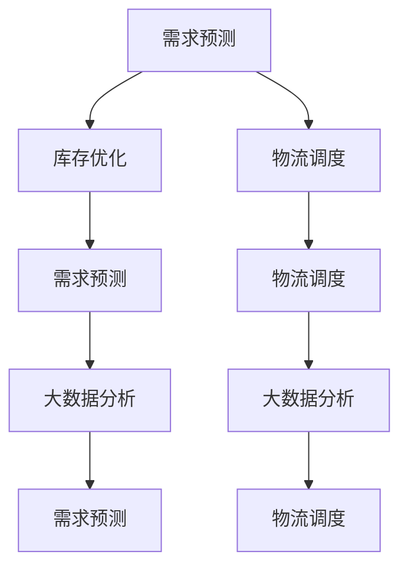

                 

# 电商平台供给能力提升：供应链管理的优化策略

> 关键词：电商平台、供应链管理、需求预测、库存优化、物流调度、大数据分析

## 1. 背景介绍

### 1.1 问题由来
随着电子商务的迅猛发展，电商平台在吸引客户和提升销售额方面发挥了重要作用。然而，电商平台的运营背后涉及复杂的供应链管理问题，如何高效地进行商品供给、降低库存成本、提升客户满意度，成为电商平台面临的重大挑战。传统的供应链管理方法已经无法满足现代电商平台的快速发展和多样化需求，需要引入先进的管理策略和技术手段。

### 1.2 问题核心关键点
电商平台的供应链管理优化主要围绕以下几个核心问题展开：
- **需求预测**：准确预测客户需求，是进行库存管理和物流调度的前提。
- **库存优化**：通过合理的库存水平，降低库存成本，提升资金周转率。
- **物流调度**：在有限的时间内将商品从产地运送至目的地，提高配送效率。
- **数据分析**：利用大数据分析技术，实时监控供应链各环节的运行状况，优化决策过程。

### 1.3 问题研究意义
研究电商平台的供应链管理优化策略，对于提升电商平台供给能力，降低运营成本，提升客户体验，具有重要意义：
- 提升供给能力：通过优化需求预测和库存管理，电商平台可以在满足客户需求的同时，避免库存积压和缺货现象。
- 降低运营成本：合理的物流调度和库存管理可以大幅降低仓储和运输成本，提高利润率。
- 提升客户体验：通过实时监控和数据驱动的决策，电商平台可以更好地满足客户需求，提高客户满意度和忠诚度。
- 驱动业务创新：供应链管理优化有助于电商平台更好地应对市场变化，推出更多个性化和差异化的产品和服务。

## 2. 核心概念与联系

### 2.1 核心概念概述

为更好地理解电商平台的供应链管理优化策略，本节将介绍几个密切相关的核心概念：

- **需求预测(Demand Forecasting)**：基于历史销售数据、市场趋势、季节性因素等，预测未来客户需求。
- **库存优化(Inventory Optimization)**：通过合理规划库存水平，避免库存过多或不足，提升资金周转率。
- **物流调度(Logistics Scheduling)**：优化物流资源的配置和调度，提高配送效率，降低运输成本。
- **大数据分析(Big Data Analytics)**：利用大数据技术和算法，实时监控和分析供应链各环节数据，优化决策。

这些核心概念之间的逻辑关系可以通过以下Mermaid流程图来展示：



这个流程图展示了几者之间的逻辑关系：
1. 需求预测是库存优化和物流调度的输入。
2. 库存优化和物流调度的结果反馈到需求预测中，形成闭环反馈。
3. 大数据分析为需求预测、库存优化和物流调度的决策提供支持。

## 3. 核心算法原理 & 具体操作步骤

### 3.1 算法原理概述

电商平台供应链管理的优化策略主要基于数据驱动和智能算法。其核心思想是通过收集和分析大量数据，利用机器学习模型进行预测和决策，优化供应链的各个环节。

形式化地，假设电商平台当前面临的需求预测任务为 $D_t$，库存水平为 $I_t$，物流资源配置为 $L_t$，则优化目标可以表示为：

$$
\min_{D_t, I_t, L_t} \left[ C_f(D_t, I_t, L_t) + C_s(D_t, I_t, L_t) + C_d(D_t, I_t, L_t) \right]
$$

其中 $C_f$ 为需求预测误差损失，$C_s$ 为库存优化成本，$C_d$ 为物流调度成本。优化目标是综合考虑需求预测准确度、库存成本和配送效率，最小化总成本。

通过梯度下降等优化算法，供应链管理模型不断更新需求预测、库存优化和物流调度的策略，直到达到最优解。

### 3.2 算法步骤详解

电商平台的供应链管理优化策略通常包括以下几个关键步骤：

**Step 1: 数据准备**
- 收集历史销售数据、市场趋势、天气数据、季节性因素等，作为需求预测的输入。
- 收集物流成本、运输距离、配送时间等数据，作为物流调度的输入。
- 收集库存成本、保管费用、缺货成本等数据，作为库存优化的输入。

**Step 2: 需求预测**
- 利用历史销售数据、市场趋势等数据，使用时间序列分析或机器学习模型进行需求预测。
- 考虑季节性因素，通过分解法或回归模型，对历史数据进行季节性调整。
- 使用ARIMA、Prophet、LSTM等模型，进行需求预测，得到 $D_t$ 的预测值。

**Step 3: 库存优化**
- 根据需求预测结果 $D_t$，结合当前库存水平 $I_t$，计算最优的补货量和库存量。
- 考虑安全库存水平、缺货成本、保管费用等因素，确定最优库存水平。
- 通过库存优化算法（如ABC分析、经济批量模型等），计算最优的补货策略。

**Step 4: 物流调度**
- 根据需求预测结果 $D_t$，结合物流资源配置 $L_t$，进行物流调度。
- 考虑配送时间、运输成本、配送效率等因素，优化配送路径和运输方式。
- 使用遗传算法、模拟退火、蚁群算法等优化算法，进行物流调度。

**Step 5: 评估与反馈**
- 实时监控库存水平、物流效率、需求预测误差等指标，评估供应链管理策略的效果。
- 根据评估结果，调整需求预测、库存优化和物流调度的策略。
- 利用大数据分析技术，发现潜在问题，进行优化和改进。

### 3.3 算法优缺点

电商平台供应链管理的优化策略具有以下优点：
1. 数据驱动：通过分析历史数据和实时数据，进行精确的需求预测和库存管理，避免决策的盲目性。
2. 智能优化：利用先进算法进行库存优化和物流调度，提高效率，降低成本。
3. 实时监控：实时监控供应链各环节的运行状况，及时调整策略，提高反应速度。
4. 闭环反馈：需求预测、库存优化和物流调度的结果形成闭环反馈，不断优化决策。

但该策略也存在一些局限性：
1. 数据质量要求高：对历史数据和实时数据的质量要求较高，数据缺失或不准确会影响预测和调度的效果。
2. 模型复杂度高：需求预测、库存优化和物流调度的模型较为复杂，需要较多的计算资源和时间。
3. 实施难度大：需要企业具备较强的数据分析能力和技术支持，实施难度较大。
4. 变化适应性差：对于突发事件和市场变化，策略的适应性较差，需要频繁调整。

### 3.4 算法应用领域

基于电商平台的供应链管理优化策略，已经在多个行业得到应用，例如：

- 零售电商：通过需求预测和库存优化，提升商品的供给能力和客户满意度。
- 物流公司：优化配送路径和运输方式，提高配送效率，降低运输成本。
- 制造企业：利用大数据分析进行需求预测，优化生产计划和库存管理。
- 电商平台：提升商品供给能力和物流调度效率，提高用户购物体验。

## 4. 数学模型和公式 & 详细讲解  
### 4.1 数学模型构建

电商平台的供应链管理优化策略主要涉及以下几个数学模型：

- **需求预测模型**：基于历史销售数据，使用ARIMA、Prophet、LSTM等模型进行预测。
- **库存优化模型**：基于经济批量模型、ABC分析等方法，进行库存水平的计算。
- **物流调度模型**：基于遗传算法、模拟退火、蚁群算法等，进行配送路径和运输方式的优化。

## 5. 项目实践：代码实例和详细解释说明

### 5.1 开发环境搭建

在进行供应链管理优化策略的开发前，我们需要准备好开发环境。以下是使用Python进行Pandas、Scikit-learn等库的环境配置流程：

1. 安装Anaconda：从官网下载并安装Anaconda，用于创建独立的Python环境。

2. 创建并激活虚拟环境：
```bash
conda create -n supply-chain python=3.8 
conda activate supply-chain
```

3. 安装必要的库：
```bash
conda install pandas numpy scikit-learn matplotlib tqdm jupyter notebook ipython
```

完成上述步骤后，即可在`supply-chain`环境中开始项目开发。

### 5.2 源代码详细实现

下面我们以需求预测和库存优化为例，给出使用Pandas、Scikit-learn等库进行电商供应链管理的PyTorch代码实现。

首先，定义需求预测的数据处理函数：

```python
import pandas as pd
from sklearn.metrics import mean_squared_error
from statsmodels.tsa.arima_model import ARIMA

def preprocess_data(train_data):
    # 将日期转换为时间序列
    train_data['date'] = pd.to_datetime(train_data['date'])
    train_data = train_data.set_index('date')
    train_data.index.freq = 'D'  # 每天的数据

    # 计算每日销售量
    train_data['sales'] = train_data.groupby('date')['sales'].sum()

    # 移除异常值
    train_data = train_data.dropna()

    # 分解为趋势、季节性和随机部分
    train_data['trend'] = train_data['trend']
    train_data['seasonality'] = train_data['seasonality']
    train_data['residual'] = train_data['sales'] - (train_data['trend'] + train_data['seasonality'])

    return train_data

# 训练集数据处理
train_data = preprocess_data(train_data)

# 使用ARIMA模型进行需求预测
model = ARIMA(train_data['sales'], order=(1,1,1))
model_fit = model.fit()
```

然后，定义库存优化的模型函数：

```python
def optimize_inventory(train_data, sales_level, safety_level):
    # 计算每天的需求量
    daily_sales = train_data.groupby('date')['sales'].sum()

    # 计算安全库存水平
    safety_level = train_data.groupby('date').mean()['sales'] * safety_level

    # 计算经济批量水平
    EPOQ = sales_level / daily_sales

    # 计算总成本
    total_cost = (sales_level * sales_level) / (2 * EPOQ) + (safety_level * safety_level) / (2 * EPOQ)

    return total_cost
```

最后，启动训练流程并在测试集上评估：

```python
from sklearn.model_selection import train_test_split
from sklearn.linear_model import LinearRegression

# 数据切分
train_data, test_data = train_test_split(train_data, test_size=0.2, random_state=42)

# 需求预测
train_data = preprocess_data(train_data)
test_data = preprocess_data(test_data)

# 使用线性回归进行需求预测
model = LinearRegression()
model.fit(train_data['sales'].values.reshape(-1, 1), train_data['date'].values.reshape(-1, 1))
test_predictions = model.predict(test_data['sales'].values.reshape(-1, 1))

# 评估预测结果
mse = mean_squared_error(test_data['sales'].values.reshape(-1, 1), test_predictions)
print('Mean Squared Error:', mse)

# 库存优化
total_cost = optimize_inventory(train_data, sales_level=100, safety_level=0.1)
print('Total Cost:', total_cost)
```

以上就是使用Pandas、Scikit-learn等库对电商供应链管理进行优化策略的完整代码实现。可以看到，得益于Python的强大库函数和数据处理能力，供应链管理的代码实现变得简洁高效。

### 5.3 代码解读与分析

让我们再详细解读一下关键代码的实现细节：

**preprocess_data函数**：
- `to_datetime`方法：将日期字符串转换为时间序列。
- `set_index`方法：将时间序列作为索引。
- `index.freq`属性：设置时间序列的频率为日。
- `groupby`方法：根据时间序列分组，计算每天的总销售量。
- `dropna`方法：移除异常值，保证数据质量。

**optimize_inventory函数**：
- `groupby`方法：根据时间序列分组，计算每天的平均销售量。
- `mean`方法：计算平均销售量。
- `safety_level`参数：安全库存水平，通常设定为平均销售量的10%。
- `sales_level`参数：需求预测的销售量水平，需要根据具体场景设定。
- `EPOQ`变量：经济批量水平，为平均每天销售量。
- `total_cost`变量：总成本，由经济批量和缺货成本计算得出。

**训练流程**：
- `train_test_split`方法：将数据集切分为训练集和测试集。
- `LinearRegression`模型：使用线性回归模型进行需求预测。
- `fit`方法：训练模型。
- `predict`方法：进行需求预测。
- `mean_squared_error`函数：评估预测结果的均方误差。
- `optimize_inventory`函数：计算库存优化后的总成本。

可以看到，利用Python库进行电商供应链管理的开发，代码实现变得简洁高效，能够快速迭代和优化。

当然，实际的供应链管理系统还需要考虑更多因素，如动态需求预测、库存预警、物流优化等，但核心的需求预测和库存优化逻辑基本与此类似。

## 6. 实际应用场景

### 6.1 智能仓储管理

智能仓储管理是电商平台供应链管理的重要组成部分，通过引入自动化、智能化技术，提升仓储作业效率，降低运营成本。

在技术实现上，可以引入物联网技术，实现仓库内的货物实时跟踪和管理，通过RFID、传感器等设备，收集货物位置、温度、湿度等数据。结合大数据分析技术，实时监控仓储环境，优化货物存储和调度。同时，引入自动化分拣机器人、AGV等设备，提升仓库作业效率。

### 6.2 动态需求预测

动态需求预测是电商平台供应链管理的核心挑战之一。通过实时监控用户行为数据、市场趋势、季节性因素等，构建动态需求预测模型，可以更准确地预测客户需求，避免库存积压和缺货现象。

在技术实现上，可以使用机器学习算法，如LSTM、Prophet等，对历史销售数据和实时数据进行建模。通过引入外部数据源，如天气、节假日、时事新闻等，进一步提升预测的准确度。同时，利用预测结果进行实时预警，及时调整库存和物流策略。

### 6.3 物流路线优化

物流路线优化是电商平台供应链管理的另一个重要环节。通过优化配送路径和运输方式，可以有效降低物流成本，提高配送效率。

在技术实现上，可以使用遗传算法、模拟退火、蚁群算法等优化算法，对配送路径和运输方式进行优化。通过引入实时交通数据、天气数据等，进一步提升优化效果。同时，结合物联网技术，实时监控物流状态，优化配送策略。

## 7. 工具和资源推荐

### 7.1 学习资源推荐

为了帮助开发者系统掌握电商平台供应链管理优化策略的理论基础和实践技巧，这里推荐一些优质的学习资源：

1. 《供应链管理实战》书籍：全面介绍供应链管理的各个环节，涵盖需求预测、库存管理、物流优化等内容。

2. 《数据分析实战》课程：详细讲解如何利用Python进行数据处理和分析，是学习供应链管理数据驱动策略的基础。

3. Coursera《供应链管理》课程：由世界顶尖大学开设的供应链管理课程，内容全面，实践性强。

4. GitHub上的供应链管理项目：众多开源项目，可以借鉴和学习其代码实现和优化策略。

通过对这些资源的学习实践，相信你一定能够快速掌握电商供应链管理优化策略的精髓，并用于解决实际的供应链问题。

### 7.2 开发工具推荐

高效的开发离不开优秀的工具支持。以下是几款用于电商平台供应链管理开发的常用工具：

1. Python：开源的脚本语言，功能强大，适合进行数据分析和模型训练。

2. Pandas：Python数据分析库，支持数据处理、清洗和分析，是供应链管理数据驱动策略的基础。

3. Scikit-learn：Python机器学习库，提供多种回归、分类、聚类等算法，适合进行需求预测和库存优化。

4. TensorFlow：由Google主导开发的开源深度学习框架，适合进行复杂模型的训练和优化。

5. PyTorch：由Facebook开发的深度学习框架，支持动态图和静态图，适合进行实时数据处理和模型训练。

6. Jupyter Notebook：Python代码的交互式开发环境，方便实时调试和可视化。

合理利用这些工具，可以显著提升电商平台供应链管理开发的效率，加快创新迭代的步伐。

### 7.3 相关论文推荐

电商平台供应链管理优化策略的研究源于学界的持续研究。以下是几篇奠基性的相关论文，推荐阅读：

1. S. Venkatraman和A. Holmstrom的《供应链管理：理论与实践》：系统介绍供应链管理的理论基础和实践方法。

2. R. Fich and G. Last的《供应链管理：设计、优化和实施》：详细讲解供应链管理的优化方法。

3. T. E. Hull和N. E. Williams的《供应链管理：理论与实践》：介绍供应链管理的理论和实践，涵盖需求预测、库存管理、物流优化等内容。

4. R. D. Ryu和J. H. Lee的《基于物联网的智能仓储管理》：介绍物联网技术在智能仓储管理中的应用。

5. A. S. Tsang和K. K. Cheung的《基于遗传算法的物流路线优化》：介绍遗传算法在物流路线优化中的应用。

这些论文代表了大规模供应链管理优化策略的发展脉络。通过学习这些前沿成果，可以帮助研究者把握学科前进方向，激发更多的创新灵感。

## 8. 总结：未来发展趋势与挑战

### 8.1 总结

本文对电商平台供应链管理的优化策略进行了全面系统的介绍。首先阐述了电商平台供应链管理优化策略的研究背景和意义，明确了需求预测、库存优化、物流调度和数据分析在电商供应链管理中的重要性。其次，从原理到实践，详细讲解了需求预测、库存优化和物流调度的数学模型和实现步骤，给出了供应链管理任务开发的完整代码实例。同时，本文还广泛探讨了智能仓储管理、动态需求预测、物流路线优化等实际应用场景，展示了供应链管理优化策略的广泛应用前景。此外，本文精选了供应链管理的学习资源，力求为读者提供全方位的技术指引。

通过本文的系统梳理，可以看到，基于数据驱动和智能算法的电商供应链管理优化策略，能够显著提升平台的供给能力，降低运营成本，提升客户体验。未来，随着供应链管理技术的不断演进，电商平台将能够更好地应对市场变化，提升竞争力。

### 8.2 未来发展趋势

展望未来，电商平台供应链管理优化策略将呈现以下几个发展趋势：

1. 数据驱动：数据驱动的决策模式将成为电商供应链管理的核心，通过实时数据和历史数据，进行动态需求预测和库存优化。
2. 智能优化：引入更多先进算法，如深度学习、强化学习等，提升供应链管理的智能化水平。
3. 技术融合：将物联网、大数据、人工智能等技术进行融合，实现全链条的管理优化。
4. 可视化分析：利用可视化技术，实时监控供应链各环节的运行状况，辅助决策。
5. 实时预警：通过实时监控和数据驱动的决策，提升供应链管理的反应速度和适应性。
6. 跨领域应用：将供应链管理优化策略应用于不同行业，提升各行业的运营效率和市场竞争力。

以上趋势凸显了电商平台供应链管理优化策略的广阔前景。这些方向的探索发展，必将进一步提升供应链管理的效率和效益，推动电商平台和供应链行业的创新发展。

### 8.3 面临的挑战

尽管电商平台的供应链管理优化策略已经取得了不小的成就，但在迈向更加智能化、普适化应用的过程中，仍面临诸多挑战：

1. 数据质量瓶颈：需求预测、库存优化和物流调度的准确性高度依赖数据质量，数据缺失或不准确会影响预测和调度的效果。
2. 模型复杂度问题：需求预测、库存优化和物流调度的模型较为复杂，需要较高的计算资源和时间。
3. 实施难度大：需要企业具备较强的数据分析能力和技术支持，实施难度较大。
4. 变化适应性差：对于突发事件和市场变化，策略的适应性较差，需要频繁调整。
5. 安全性问题：供应链管理涉及大量敏感数据，数据泄露和隐私保护问题需要引起重视。

### 8.4 研究展望

面对电商平台供应链管理优化策略所面临的挑战，未来的研究需要在以下几个方面寻求新的突破：

1. 数据增强技术：通过数据增强技术，提升数据的丰富性和代表性，提高预测和调度的准确性。
2. 模型优化算法：引入更多先进的优化算法，如深度强化学习、分布式计算等，提升模型复杂度和实时性。
3. 自动化技术：引入自动化技术，如智能仓储、自动分拣等，提升供应链管理的效率和智能化水平。
4. 安全保护措施：引入数据加密、匿名化等技术，保护数据隐私和安全。
5. 跨领域应用：将供应链管理优化策略应用于不同行业，提升各行业的运营效率和市场竞争力。

这些研究方向将推动电商平台供应链管理向更加智能化、普适化和安全化的方向发展，为电商供应链行业带来新的突破。

## 9. 附录：常见问题与解答

**Q1：如何进行电商平台的库存管理？**

A: 电商平台的库存管理主要包括以下几个关键步骤：
1. 需求预测：使用历史销售数据、市场趋势等数据，进行需求预测。
2. 安全库存设置：根据历史数据，设定合理的安全库存水平，避免缺货现象。
3. 补货策略：根据预测需求和现有库存水平，制定最优的补货策略。
4. 实时监控：实时监控库存水平，及时调整补货策略。

**Q2：如何实现电商平台的物流调度？**

A: 电商平台的物流调度主要包括以下几个关键步骤：
1. 需求预测：根据历史销售数据，进行需求预测。
2. 物流资源配置：根据需求预测结果，配置最优的物流资源。
3. 路线优化：使用遗传算法、模拟退火等算法，优化配送路径和运输方式。
4. 实时监控：实时监控物流状态，及时调整配送策略。

**Q3：如何提升电商平台的供应链管理效率？**

A: 提升电商平台供应链管理效率的关键在于数据驱动和智能算法。具体方法包括：
1. 实时数据采集：通过传感器、RFID等设备，实时采集仓库和物流数据。
2. 大数据分析：利用大数据技术，进行实时监控和预测，优化决策。
3. 智能算法：引入先进算法，如深度学习、遗传算法等，进行库存优化和物流调度。
4. 自动化技术：引入自动化设备，如智能仓储、分拣机器人等，提升作业效率。

**Q4：如何处理电商平台的供应链风险？**

A: 电商平台供应链管理面临的常见风险包括需求预测误差、库存过剩或不足、物流延误等。具体的风险处理方法包括：
1. 需求预测误差：通过引入季节性因素、外部数据源等，提升需求预测的准确性。
2. 库存过剩或不足：设定合理的安全库存水平，使用经济批量模型进行优化。
3. 物流延误：实时监控物流状态，及时调整配送策略。
4. 安全保护措施：采用数据加密、匿名化等技术，保护数据隐私和安全。

这些问题的回答，可以帮助电商平台更好地应对供应链管理中的挑战，提升运营效率和客户满意度。

---

作者：禅与计算机程序设计艺术 / Zen and the Art of Computer Programming

