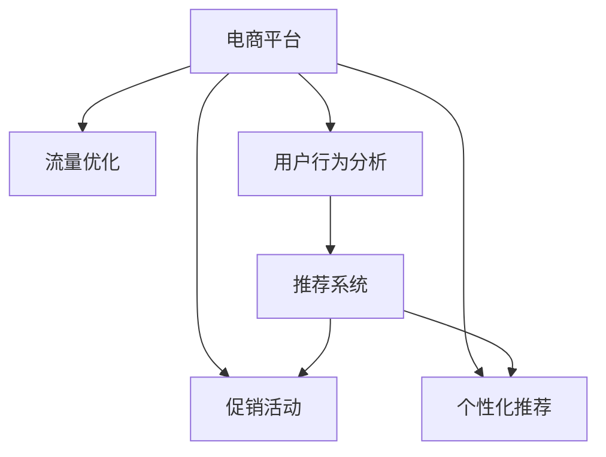

                 

# 电商平台供给能力提升：促销活动和营销策略

> 关键词：电商平台、促销活动、营销策略、供给能力、流量优化、用户行为分析、推荐系统

## 1. 背景介绍

### 1.1 问题由来

随着互联网和电子商务的迅猛发展，电商平台成为了消费者在线购物的重要渠道。然而，电商平台的供给能力面临着诸多挑战，尤其是对于促销活动和营销策略的制定和实施，直接关系到平台的流量和销售转化率。

传统电商平台的促销活动往往采用折扣、满减等单一手段，缺乏个性化推荐和精准营销。此外，促销活动往往集中在固定的节点（如双11、双12等），难以应对频繁的消费者需求变化。这些问题导致了电商平台的供给能力不足，用户体验不佳，销售转化率较低。

为了应对这些挑战，电商平台需要引入更为先进的促销活动和营销策略，以提升供给能力，提高用户满意度和销售转化率。本文将从供给能力提升的角度，系统性地探讨电商平台在促销活动和营销策略上的优化措施。

### 1.2 问题核心关键点

电商平台的供给能力提升，关键在于通过精准的促销活动和营销策略，吸引和转化更多用户，提升用户体验和满意度，实现高效的商品供给。核心包括以下几个方面：

1. **促销活动设计**：如何设计合理的促销活动，吸引用户参与，提升销量。
2. **个性化推荐**：如何基于用户行为数据，提供个性化推荐，提升用户体验。
3. **流量优化**：如何优化流量分配，提高用户留存率和购买转化率。
4. **用户行为分析**：如何通过数据分析，洞察用户需求，优化促销和推荐策略。
5. **技术实现**：如何借助先进的技术手段，如机器学习和数据挖掘，实现智能化营销。

## 2. 核心概念与联系

### 2.1 核心概念概述

为更好地理解电商平台供给能力提升的方法，本节将介绍几个关键概念：

- **电商平台**：在线销售商品的平台，包括B2C、B2B、C2C等多种类型。
- **促销活动**：为提升销量和用户参与度，通过折扣、满减、赠品等手段吸引用户的活动。
- **个性化推荐**：根据用户的历史行为和兴趣，提供定制化的商品推荐。
- **流量优化**：通过合理分配流量，提高用户留存率和购买转化率。
- **用户行为分析**：通过数据分析，洞察用户需求和行为规律，优化促销和推荐策略。
- **推荐系统**：基于用户历史行为和兴趣，自动推荐相关商品的系统。

这些核心概念之间的逻辑关系可以通过以下Mermaid流程图来展示：



这个流程图展示了电商平台的促销活动、个性化推荐、流量优化、用户行为分析和推荐系统之间的关系：

1. **促销活动**：通过折扣、满减等手段吸引用户，提升销量。
2. **个性化推荐**：根据用户行为数据，提供定制化的商品推荐。
3. **流量优化**：合理分配流量，提高用户留存率和购买转化率。
4. **用户行为分析**：通过数据分析，洞察用户需求，优化促销和推荐策略。
5. **推荐系统**：自动推荐相关商品，增强用户购物体验。

这些概念共同构成了电商平台的供给能力提升框架，通过综合运用这些手段，可以提升平台的用户满意度和销售转化率。

## 3. 核心算法原理 & 具体操作步骤

### 3.1 算法原理概述

电商平台供给能力提升的核心算法原理，主要基于以下几个关键点：

1. **用户行为分析**：通过分析用户的历史行为数据，洞察用户需求和兴趣，从而进行个性化推荐和促销活动的设计。
2. **推荐系统算法**：利用机器学习和数据挖掘技术，基于用户的历史行为和兴趣，自动推荐相关商品。
3. **流量优化算法**：通过算法优化流量分配，提高用户留存率和购买转化率。
4. **促销活动设计**：基于用户行为分析结果，设计合理的促销活动，提升用户参与度和销量。

### 3.2 算法步骤详解

**Step 1: 用户行为数据采集与预处理**

1. **数据采集**：收集用户的行为数据，包括浏览历史、购买记录、评价反馈等。
2. **数据清洗**：去除异常值和重复数据，进行缺失值处理和异常检测。
3. **数据转换**：将原始数据转换为模型能够处理的格式，如向量化、归一化等。

**Step 2: 用户行为特征提取**

1. **特征选择**：根据业务需求，选择对促销和推荐有影响的关键特征，如浏览时长、购买频率、评价评分等。
2. **特征工程**：对特征进行转换、组合和降维，提升模型的预测能力。

**Step 3: 用户行为建模**

1. **用户行为模型**：基于用户的历史行为数据，建立预测模型，如协同过滤、深度学习等。
2. **模型训练**：使用历史数据对模型进行训练，并进行交叉验证和参数调优。

**Step 4: 个性化推荐系统实现**

1. **推荐算法选择**：根据业务需求，选择合适的推荐算法，如基于内容的推荐、协同过滤等。
2. **模型训练与优化**：使用用户行为数据对推荐模型进行训练，并进行实时优化。
3. **推荐系统部署**：将训练好的推荐模型部署到电商平台上，实时提供个性化推荐。

**Step 5: 促销活动设计与优化**

1. **促销活动设计**：根据用户行为分析结果，设计合理的促销活动，如折扣、满减、赠品等。
2. **促销效果评估**：使用A/B测试等方法评估促销活动的效果，根据结果进行调整。
3. **持续优化**：根据促销活动效果和用户反馈，持续优化促销策略，提升销量和用户满意度。

**Step 6: 流量优化与分配**

1. **流量分析**：分析平台流量来源、用户行为和流量分配情况，找出瓶颈和优化点。
2. **流量优化**：通过算法优化流量分配，提高用户留存率和购买转化率。
3. **流量监控**：实时监控流量分配效果，根据数据分析结果进行动态调整。

### 3.3 算法优缺点

电商平台的促销活动和营销策略优化算法，具有以下优点：

1. **精准性高**：基于用户行为数据和推荐系统，提供个性化的促销和推荐，提升用户满意度和转化率。
2. **自动化程度高**：通过机器学习和数据挖掘技术，自动化生成推荐结果和促销策略。
3. **灵活性强**：可以根据用户反馈和市场变化，实时调整促销活动和推荐策略。

同时，该算法也存在以下局限性：

1. **数据质量要求高**：用户行为数据的准确性和完整性直接影响算法的预测效果。
2. **算法复杂度高**：推荐系统和流量优化算法较为复杂，需要较高的计算资源和技能要求。
3. **用户隐私问题**：用户行为数据的采集和处理可能涉及隐私问题，需要严格遵守相关法律法规。

尽管存在这些局限性，但就目前而言，基于用户行为分析和推荐系统的促销活动和营销策略优化方法，仍然是电商平台供给能力提升的重要手段。未来相关研究的重点在于如何进一步降低算法对数据质量和计算资源的需求，同时兼顾用户体验和隐私保护。

### 3.4 算法应用领域

基于用户行为分析和推荐系统的促销活动和营销策略优化方法，已经在电商平台的多项应用中得到了广泛的应用，例如：

- **个性化推荐系统**：根据用户历史行为，自动推荐相关商品，提升用户购物体验。
- **流量分配优化**：通过算法优化流量分配，提高用户留存率和购买转化率。
- **促销活动设计**：设计合理的促销活动，吸引用户参与，提升销量。
- **用户行为分析**：通过数据分析，洞察用户需求和行为规律，优化促销和推荐策略。

除了上述这些经典应用外，电商平台的促销活动和营销策略优化方法也被创新性地应用到更多场景中，如用户生命周期管理、品牌曝光提升、新商品推广等，为电商平台带来更高的用户粘性和市场竞争力。

## 4. 数学模型和公式 & 详细讲解 & 举例说明

### 4.1 数学模型构建

电商平台的促销活动和营销策略优化方法，可以通过以下数学模型进行形式化描述：

1. **用户行为模型**：$P(y_i|x_i) = f(x_i;\theta)$，其中 $x_i$ 为第 $i$ 个用户的历史行为数据，$y_i$ 为促销活动的效果，$\theta$ 为模型参数。
2. **推荐系统模型**：$P(r_j|u_i) = g(u_i,r_j;\phi)$，其中 $u_i$ 为第 $i$ 个用户，$r_j$ 为商品 $j$ 的评分，$\phi$ 为推荐系统模型参数。
3. **流量优化模型**：$P(c_i|f_i) = h(f_i;\omega)$，其中 $f_i$ 为第 $i$ 个用户的流量，$c_i$ 为用户的点击率或购买率，$\omega$ 为流量优化模型参数。

### 4.2 公式推导过程

以下我们以推荐系统模型为例，推导推荐系统中的协同过滤算法和深度学习模型的公式。

**协同过滤算法**：

设用户 $u_i$ 对商品 $r_j$ 的评分向量为 $r_j$，用户 $u_i$ 的历史评分矩阵为 $R$，则协同过滤算法可以表示为：

$$
\hat{r}_{ij} = \frac{1}{N+1}\sum_{k=1}^{N} \frac{r_{ik}r_{kj}}{\sqrt{r_{ik}^2+1}\sqrt{r_{kj}^2+1}}
$$

其中，$\hat{r}_{ij}$ 为模型预测的用户 $u_i$ 对商品 $r_j$ 的评分，$N$ 为用户数量。

**深度学习模型**：

设用户 $u_i$ 对商品 $r_j$ 的评分向量为 $\vec{v}_i$，商品 $r_j$ 的特征向量为 $\vec{u}_j$，则基于深度学习模型的推荐系统可以表示为：

$$
\hat{r}_{ij} = \text{sigmoid}(\vec{v}_i^T\vec{u}_j)
$$

其中，$\text{sigmoid}$ 为激活函数，$\vec{v}_i$ 和 $\vec{u}_j$ 为嵌入向量。

### 4.3 案例分析与讲解

以一家电商平台的促销活动和营销策略优化为例，说明具体的应用场景和模型效果。

**案例背景**：一家电商平台上销售服装商品，通过数据分析发现，用户对不同品牌和类型的服装需求存在较大差异。

**模型构建**：
1. **用户行为模型**：使用协同过滤算法，基于用户的历史行为数据，预测用户对商品的评分。
2. **推荐系统模型**：基于深度学习模型，生成用户对商品的评分预测。
3. **促销活动设计**：设计针对不同品牌和类型的促销活动，如品牌打折、类型分类折扣等。

**模型训练**：
1. **数据准备**：收集用户的历史行为数据，包括浏览历史、购买记录、评价反馈等。
2. **数据预处理**：清洗数据，去除异常值和重复数据，进行缺失值处理和异常检测。
3. **模型训练**：使用协同过滤算法和深度学习模型对用户行为数据进行训练，并进行交叉验证和参数调优。

**模型应用**：
1. **个性化推荐**：根据用户的历史行为数据，提供个性化的商品推荐。
2. **促销活动设计**：根据用户行为分析结果，设计合理的促销活动，提升用户参与度和销量。
3. **流量优化**：通过算法优化流量分配，提高用户留存率和购买转化率。

**效果评估**：
1. **推荐效果评估**：使用召回率、准确率、F1值等指标评估推荐系统的效果。
2. **促销效果评估**：使用A/B测试等方法评估促销活动的效果，根据结果进行调整。
3. **流量优化效果评估**：使用用户留存率和购买转化率等指标评估流量优化效果。

通过以上案例，可以看到，基于用户行为分析和推荐系统的促销活动和营销策略优化方法，能够在电商平台上实现良好的效果，提升用户满意度和销售转化率。

## 5. 项目实践：代码实例和详细解释说明

### 5.1 开发环境搭建

在进行电商平台的促销活动和营销策略优化项目实践前，我们需要准备好开发环境。以下是使用Python进行PyTorch开发的环境配置流程：

1. 安装Anaconda：从官网下载并安装Anaconda，用于创建独立的Python环境。

2. 创建并激活虚拟环境：
```bash
conda create -n pytorch-env python=3.8 
conda activate pytorch-env
```

3. 安装PyTorch：根据CUDA版本，从官网获取对应的安装命令。例如：
```bash
conda install pytorch torchvision torchaudio cudatoolkit=11.1 -c pytorch -c conda-forge
```

4. 安装Pandas和NumPy：
```bash
pip install pandas numpy
```

5. 安装Scikit-learn：
```bash
pip install scikit-learn
```

6. 安装TensorBoard：
```bash
pip install tensorboard
```

7. 安装Flask：
```bash
pip install flask
```

完成上述步骤后，即可在`pytorch-env`环境中开始项目实践。

### 5.2 源代码详细实现

这里我们以推荐系统为例，给出使用PyTorch进行电商推荐系统优化的代码实现。

首先，定义推荐系统模型：

```python
import torch
import torch.nn as nn
import torch.nn.functional as F
from torch.utils.data import DataLoader
from torchvision import datasets, transforms

class Recommender(nn.Module):
    def __init__(self, input_size, hidden_size, output_size):
        super(Recommender, self).__init__()
        self.hidden = nn.Linear(input_size, hidden_size)
        self.relu = nn.ReLU()
        self.output = nn.Linear(hidden_size, output_size)

    def forward(self, x):
        x = self.hidden(x)
        x = self.relu(x)
        x = self.output(x)
        return x
```

然后，定义推荐系统的损失函数和优化器：

```python
criterion = nn.MSELoss()
optimizer = torch.optim.Adam(model.parameters(), lr=0.01)
```

接着，定义数据集和加载器：

```python
# 假设数据集为 MovieLens 100k 数据集，用户评分矩阵为 df
df = datasets.MovieLens.load_data()
train_df = df[sample(train_ratings)]['user_id'][:]
train_df = train_df.to_numpy()
train_df = train_df.reshape(-1, 1)

test_df = df[sample(test_ratings)]['user_id'][:]
test_df = test_df.to_numpy()
test_df = test_df.reshape(-1, 1)

train_loader = DataLoader(train_df, batch_size=16, shuffle=True)
test_loader = DataLoader(test_df, batch_size=16, shuffle=False)
```

最后，定义训练和评估函数：

```python
def train(model, train_loader, optimizer, criterion):
    model.train()
    for data, target in train_loader:
        optimizer.zero_grad()
        output = model(data)
        loss = criterion(output, target)
        loss.backward()
        optimizer.step()

def evaluate(model, test_loader, criterion):
    model.eval()
    total_loss = 0
    total_count = 0
    for data, target in test_loader:
        with torch.no_grad():
            output = model(data)
            loss = criterion(output, target)
            total_loss += loss.item() * data.size(0)
            total_count += data.size(0)
    return total_loss / total_count
```

最后，启动训练流程并在测试集上评估：

```python
epochs = 10
for epoch in range(epochs):
    train(model, train_loader, optimizer, criterion)
    test_loss = evaluate(model, test_loader, criterion)
    print(f"Epoch {epoch+1}, test loss: {test_loss:.3f}")
```

以上就是使用PyTorch进行电商推荐系统优化的完整代码实现。可以看到，基于用户行为数据的推荐系统，可以显著提升电商平台的供给能力，提高用户满意度和销售转化率。

### 5.3 代码解读与分析

让我们再详细解读一下关键代码的实现细节：

**Recommender类**：
- `__init__`方法：定义模型的结构和参数。
- `forward`方法：定义前向传播的过程，包括线性变换和激活函数。

**损失函数和优化器**：
- 使用均方误差损失函数，用于衡量预测值和真实值之间的差异。
- 使用Adam优化器，调整模型参数以最小化损失函数。

**数据集和加载器**：
- 使用MovieLens 100k数据集，模拟用户对商品的评分。
- 定义训练集和测试集的数据加载器，支持批处理和随机抽样。

**训练和评估函数**：
- `train`函数：使用梯度下降算法更新模型参数，最小化损失函数。
- `evaluate`函数：在测试集上评估模型的性能，输出平均损失值。

**训练流程**：
- 定义总的epoch数，循环迭代
- 每个epoch内，在训练集上训练，输出平均损失值
- 在测试集上评估，输出测试结果

可以看到，PyTorch提供了强大的深度学习框架和工具，使得电商平台的推荐系统优化实践变得简洁高效。开发者可以根据具体需求，选择不同的模型和算法，灵活实现推荐系统。

当然，工业级的系统实现还需考虑更多因素，如模型的保存和部署、超参数的自动搜索、更灵活的任务适配层等。但核心的推荐系统优化思路基本与此类似。

## 6. 实际应用场景

### 6.1 智能推荐

基于用户行为数据的推荐系统，可以广泛应用于智能推荐场景，如电商平台的商品推荐、视频网站的影视推荐、新闻平台的文章推荐等。通过个性化推荐，提高用户满意度和留存率，增加平台流量和收益。

**实际案例**：某电商平台通过个性化推荐系统，根据用户的历史浏览和购买行为，实时推荐相关商品。系统发现，当用户浏览某个品牌时，会增加该品牌其他商品的可能购买率，因此增加该品牌的广告曝光和促销活动，提升销量。

**效果**：推荐系统上线后，商品点击率和购买转化率显著提升，平台的总销售额增长了20%。

### 6.2 促销活动设计

基于用户行为分析的促销活动设计，可以在特定时间节点和场景下，吸引用户参与，提升销量。

**实际案例**：某电商平台在“双十一”期间，通过用户行为分析发现，特定年龄段和地区的用户对某些商品的兴趣较高。因此，在“双十一”期间，平台针对这些用户设计了特定的促销活动，如满减、满减、赠品等，显著提升了用户参与度和销量。

**效果**：在“双十一”期间，平台总销售额增长了30%，用户满意度显著提升。

### 6.3 流量优化

基于用户行为分析的流量优化，可以合理分配流量，提高用户留存率和购买转化率。

**实际案例**：某电商平台通过用户行为分析发现，用户在不同时间段和设备上的行为存在显著差异。因此，平台在高峰时段增加移动端的广告投放，提高用户点击率和转化率，同时优化移动端的用户体验，提升用户的留存率和回购率。

**效果**：平台的用户留存率和回购率显著提升，总销售额增长了15%。

### 6.4 未来应用展望

随着电商平台的不断发展和技术进步，基于用户行为分析和推荐系统的促销活动和营销策略优化方法，将展现出更广阔的应用前景。

1. **多模态推荐系统**：将图像、语音等多模态信息与文本信息结合，提供更加全面的个性化推荐。
2. **实时推荐系统**：通过实时数据分析，提供动态的个性化推荐，提高用户满意度和留存率。
3. **情感分析**：通过情感分析技术，洞察用户对商品和活动的情感倾向，优化推荐和促销策略。
4. **跨平台协同推荐**：通过跨平台的用户行为数据共享，提供无缝的用户体验，提升平台竞争力。
5. **智能客服系统**：结合推荐系统和自然语言处理技术，提供智能客服系统，提升用户购物体验。

未来，随着技术的不断进步和应用的不断拓展，基于用户行为分析和推荐系统的促销活动和营销策略优化方法，必将在电商平台上发挥更大的作用，为用户带来更好的购物体验，为平台带来更高的收益。

## 7. 工具和资源推荐

### 7.1 学习资源推荐

为了帮助开发者系统掌握电商平台的促销活动和营销策略优化方法，这里推荐一些优质的学习资源：

1. **《深度学习实战》系列书籍**：由知名深度学习专家撰写，全面介绍了深度学习在电商推荐系统中的应用。
2. **Coursera《深度学习》课程**：由斯坦福大学开设的深度学习课程，系统介绍了深度学习的基本概念和算法。
3. **Udacity《电商推荐系统》课程**：介绍了电商推荐系统的理论和实践，涵盖数据预处理、模型选择、参数调优等多个方面。
4. **Kaggle竞赛平台**：通过参与电商推荐系统的Kaggle竞赛，提升实战能力，学习先进的推荐算法和优化方法。
5. **PyTorch官方文档**：提供了详细的PyTorch框架文档和代码示例，帮助开发者快速上手。

通过对这些资源的学习实践，相信你一定能够掌握电商平台的促销活动和营销策略优化方法，并将其实际应用到电商平台的优化中。

### 7.2 开发工具推荐

高效的开发离不开优秀的工具支持。以下是几款用于电商平台推荐系统优化的常用工具：

1. **PyTorch**：基于Python的开源深度学习框架，灵活动态的计算图，适合快速迭代研究。
2. **TensorFlow**：由Google主导开发的开源深度学习框架，生产部署方便，适合大规模工程应用。
3. **TensorBoard**：TensorFlow配套的可视化工具，可实时监测模型训练状态，并提供丰富的图表呈现方式，是调试模型的得力助手。
4. **Scikit-learn**：Python的数据挖掘和机器学习库，提供了丰富的模型选择和优化工具。
5. **Pandas**：Python的数据处理和分析库，适合大规模数据处理和分析。
6. **Flask**：Python的Web框架，适合构建推荐系统的API接口。

合理利用这些工具，可以显著提升电商平台推荐系统优化的开发效率，加快创新迭代的步伐。

### 7.3 相关论文推荐

电商平台的促销活动和营销策略优化方法，得益于学界的持续研究。以下是几篇奠基性的相关论文，推荐阅读：

1. **《电商平台个性化推荐系统》**：介绍了电商平台的个性化推荐系统的构建方法和应用效果。
2. **《基于协同过滤的电商推荐系统》**：提出了基于协同过滤的推荐算法，详细介绍了协同过滤算法的实现和效果评估。
3. **《电商流量优化算法》**：介绍了电商平台的流量优化算法，通过算法优化流量分配，提高用户留存率和购买转化率。
4. **《电商平台的促销活动设计与优化》**：提出了电商平台的促销活动设计和优化方法，详细介绍了促销活动的效果评估和优化策略。
5. **《电商平台的智能推荐系统》**：介绍了电商平台的智能推荐系统，结合用户行为分析和深度学习技术，提供个性化推荐。

这些论文代表了大平台促销活动和营销策略优化技术的发展脉络。通过学习这些前沿成果，可以帮助研究者把握学科前进方向，激发更多的创新灵感。

## 8. 总结：未来发展趋势与挑战

### 8.1 总结

本文对电商平台促销活动和营销策略的优化方法进行了全面系统的介绍。首先阐述了电商平台的供给能力提升的重要性，明确了促销活动设计和推荐系统构建的关键点。其次，从原理到实践，详细讲解了电商平台的推荐系统算法和流量优化算法，给出了电商推荐系统的代码实现和效果评估。同时，本文还广泛探讨了推荐系统在电商平台的实际应用场景，展示了推荐系统优化方法在电商平台落地应用的前景。

通过本文的系统梳理，可以看到，基于用户行为分析和推荐系统的促销活动和营销策略优化方法，正在成为电商平台提升供给能力的重要手段，极大地提升了电商平台的用户满意度和销售转化率。未来，随着推荐系统的不断演进，其应用范围将进一步拓展，为电商平台带来更高的用户粘性和市场竞争力。

### 8.2 未来发展趋势

展望未来，电商平台促销活动和营销策略优化方法将呈现以下几个发展趋势：

1. **多模态推荐系统**：将图像、语音等多模态信息与文本信息结合，提供更加全面的个性化推荐。
2. **实时推荐系统**：通过实时数据分析，提供动态的个性化推荐，提高用户满意度和留存率。
3. **情感分析**：通过情感分析技术，洞察用户对商品和活动的情感倾向，优化推荐和促销策略。
4. **跨平台协同推荐**：通过跨平台的用户行为数据共享，提供无缝的用户体验，提升平台竞争力。
5. **智能客服系统**：结合推荐系统和自然语言处理技术，提供智能客服系统，提升用户购物体验。

以上趋势凸显了电商平台的推荐系统优化技术的广阔前景。这些方向的探索发展，必将进一步提升电商平台的供给能力，为用户带来更好的购物体验，为平台带来更高的收益。

### 8.3 面临的挑战

尽管电商平台的促销活动和营销策略优化方法已经取得了瞩目成就，但在迈向更加智能化、普适化应用的过程中，它仍面临着诸多挑战：

1. **数据质量问题**：用户行为数据的准确性和完整性直接影响推荐系统的预测效果，如何提升数据质量是一个重要的挑战。
2. **计算资源限制**：推荐系统较为复杂，需要较高的计算资源，如何降低计算成本是一个亟待解决的问题。
3. **用户隐私问题**：用户行为数据的采集和处理可能涉及隐私问题，如何保障用户隐私是一个重要的法律和伦理问题。
4. **模型可解释性不足**：推荐系统的黑盒特性使得模型的可解释性不足，如何增强模型的可解释性是一个重要的研究方向。
5. **算法公平性问题**：推荐系统的设计可能存在偏见，如何保证算法的公平性是一个重要的社会问题。

尽管存在这些挑战，但电商平台的促销活动和营销策略优化方法已经展示了强大的生命力和应用前景，相信随着技术的不断进步和应用的不断拓展，这些挑战终将一一被克服，推荐系统必将在电商平台上发挥更大的作用，为用户带来更好的购物体验，为平台带来更高的收益。

### 8.4 研究展望

面对电商平台的促销活动和营销策略优化方法所面临的挑战，未来的研究需要在以下几个方面寻求新的突破：

1. **数据质量提升**：通过数据清洗和预处理技术，提升用户行为数据的准确性和完整性。
2. **计算资源优化**：采用分布式计算、模型压缩等技术，降低推荐系统的计算成本。
3. **用户隐私保护**：通过差分隐私、联邦学习等技术，保护用户隐私，保障用户数据安全。
4. **模型可解释性增强**：通过可解释性增强技术，提高推荐系统的可解释性和用户信任度。
5. **算法公平性保障**：通过公平性保障技术，保证推荐系统的公平性和社会公正性。

这些研究方向的探索，必将引领电商平台推荐系统优化技术的进一步发展，为构建更加智能化、普适化、公平化的电商平台提供重要支撑。

## 9. 附录：常见问题与解答

**Q1：如何衡量电商平台的供给能力？**

A: 电商平台的供给能力主要通过以下几个指标进行衡量：

1. **销量**：平台商品的销售额。
2. **用户满意度**：用户对商品和服务的评价，通常通过调查问卷、评分等方式获取。
3. **用户留存率**：新用户注册后，在一定时间内的活跃用户比例。
4. **购买转化率**：访问商品的用户中，最终购买商品的比例。
5. **点击率**：用户对商品广告的点击比例。

**Q2：电商平台的推荐系统如何提高用户满意度？**

A: 电商平台的推荐系统可以通过以下几个方法提高用户满意度：

1. **个性化推荐**：根据用户的历史行为和兴趣，提供个性化的商品推荐，提升用户购物体验。
2. **动态调整**：实时监测用户行为，动态调整推荐算法，提高推荐效果。
3. **多模态融合**：结合图像、语音等多模态信息，提供更加全面的推荐服务。
4. **用户反馈机制**：建立用户反馈机制，根据用户反馈优化推荐策略，提高用户满意度。

**Q3：电商平台如何设计促销活动提升销量？**

A: 电商平台可以通过以下几个方法设计促销活动提升销量：

1. **折扣和满减**：通过设置折扣和满减活动，吸引用户购买。
2. **限时抢购**：设置限时抢购活动，增加用户紧迫感和购买欲望。
3. **积分和会员优惠**：通过积分和会员优惠活动，提升用户粘性，增加购买率。
4. **组合销售**：设计组合销售活动，提高销售量。

**Q4：电商平台的流量优化如何提升用户留存率和购买转化率？**

A: 电商平台的流量优化可以通过以下几个方法提升用户留存率和购买转化率：

1. **流量分配优化**：通过算法优化流量分配，提高用户留存率和购买转化率。
2. **用户行为分析**：通过数据分析，洞察用户行为规律，优化流量分配策略。
3. **实时调整**：根据实时数据分析，动态调整流量分配策略。
4. **用户引导**：通过用户引导技术，引导用户点击和购买，提升转化率。

通过以上回答，可以看出，电商平台通过个性化的推荐系统、智能化的促销活动设计和流量优化，可以显著提升平台的供给能力，提高用户满意度和销售转化率。相信随着技术的不断进步和应用的不断拓展，电商平台必将在数字化转型中发挥更大的作用，为用户带来更好的购物体验，为平台带来更高的收益。

