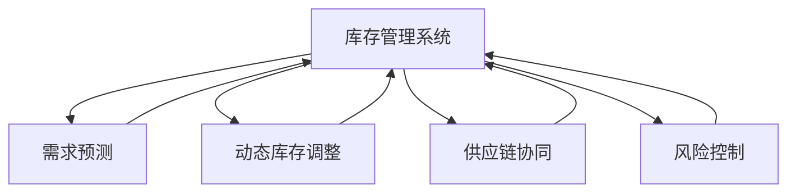

                 

# 电商平台供给能力提升：库存管理系统的应用

## 1. 背景介绍

随着电子商务的迅猛发展，在线零售平台如淘宝、京东、亚马逊等，已经成为人们日常生活不可或缺的购物方式。然而，这些平台在高速增长的交易量背后，面临着巨大的挑战：如何在有限的资源下，实现库存的高效管理和快速补充？这不仅关系到平台的运营效率和客户满意度，还直接影响到公司的盈利能力。

针对这一问题，本文将介绍一种基于机器学习算法的库存管理系统。该系统通过实时预测和动态调整库存，最大化平台的供给能力，同时降低库存成本，提升客户满意度。具体而言，我们将从背景、算法、实现、应用和未来展望等多个角度，全面探讨这一问题。

## 2. 核心概念与联系

### 2.1 核心概念概述

为更好地理解库存管理系统的实现原理，本节将介绍几个关键概念：

- 库存管理系统：使用机器学习算法对电商平台库存进行实时预测和动态管理的系统。通过预测未来的销售趋势，系统可以优化库存策略，保持库存水平在最优状态。

- 需求预测：使用历史销售数据和市场趋势，通过机器学习算法预测未来的需求量，从而指导库存管理决策。

- 动态库存调整：根据预测结果，动态调整库存水平，避免因库存不足或过量导致的运营风险。

- 供应链协同：与供应商、物流等上下游环节协同工作，优化整个供应链的资源配置。

- 风险控制：监控库存水平，避免因库存不足或过量导致的资金损失和运营风险。

这些概念之间的逻辑关系可以通过以下Mermaid流程图来展示：



这个流程图展示了库存管理系统的主要功能模块及其相互作用关系。

### 2.2 核心概念原理和架构

#### 2.2.1 库存管理系统的工作原理

库存管理系统基于机器学习算法，对库存水平进行实时预测和动态调整。其工作流程主要包括以下几个步骤：

1. 数据收集：收集历史销售数据、市场趋势、促销活动、季节性因素等相关信息。
2. 数据预处理：对收集到的数据进行清洗、归一化、特征提取等预处理操作，生成可用于训练的特征向量。
3. 模型训练：使用历史销售数据训练需求预测模型，如ARIMA、LSTM、GRU等。
4. 预测输出：将实时数据输入训练好的模型，生成未来需求量的预测结果。
5. 库存调整：根据预测结果，动态调整库存水平，避免库存不足或过量。

#### 2.2.2 库存管理系统的架构设计

一个典型的库存管理系统可以分解为以下几个模块：

1. 数据采集模块：负责收集历史销售数据、市场趋势、促销活动等相关信息，并进行清洗和预处理。
2. 数据存储模块：将预处理后的数据存储在数据库中，供后续模块使用。
3. 模型训练模块：使用训练数据集训练需求预测模型，并将模型保存在模型库中。
4. 预测模块：将实时数据输入训练好的模型，生成未来需求量的预测结果。
5. 库存调整模块：根据预测结果，动态调整库存水平，并与供应商和物流协同工作，优化整个供应链的资源配置。
6. 风险控制模块：监控库存水平，避免因库存不足或过量导致的运营风险。

### 2.3 库存管理系统与业务的关系

库存管理系统与电商平台的业务紧密相关，其目标是通过优化库存水平，提高平台的供给能力，降低库存成本，提升客户满意度。具体而言，库存管理系统的作用体现在以下几个方面：

1. 实时预测：通过预测未来的需求量，及时调整库存水平，避免库存不足或过量。
2. 动态调整：根据市场趋势和促销活动，动态调整库存策略，优化库存资源配置。
3. 供应链协同：与供应商和物流协同工作，优化整个供应链的运营效率和资源配置。
4. 风险控制：监控库存水平，避免因库存不足或过量导致的运营风险和资金损失。

## 3. 核心算法原理 & 具体操作步骤

### 3.1 算法原理概述

库存管理系统基于机器学习算法进行需求预测和库存调整。常见的算法包括时间序列分析（如ARIMA、LSTM）、神经网络（如GRU）等。其中，时间序列分析算法适用于历史数据存在明显周期性和趋势性的场景，而神经网络算法则适用于数据复杂度较高、存在非线性关系的场景。

需求预测的主要目标是预测未来的需求量。通常使用回归模型（如线性回归、决策树回归）或序列预测模型（如ARIMA、LSTM、GRU）。以LSTM模型为例，其输入为历史销售数据和市场趋势，输出为未来需求量的预测结果。模型训练过程包括数据预处理、模型设计、模型训练和模型评估等步骤。

库存调整的主要目标是根据预测结果，动态调整库存水平。库存调整的策略可以采用基于需求预测的策略，如安全库存策略、周期性补货策略等。具体的调整方法包括：

1. 安全库存：根据预测结果，增加一定量的安全库存，以应对不确定性需求。
2. 周期性补货：根据预测结果，定期进行补货，保证库存水平稳定。
3. 动态补货：根据实时需求变化，动态调整补货量，避免库存积压或不足。

### 3.2 算法步骤详解

#### 3.2.1 数据预处理

数据预处理是需求预测和库存管理的关键步骤。预处理过程包括数据清洗、归一化、特征提取等操作。以LSTM模型为例，其输入为历史销售数据和市场趋势，需要将其转化为模型可以处理的向量形式。具体步骤如下：

1. 数据清洗：去除缺失值、异常值等噪声数据，保证数据的质量和完整性。
2. 归一化：对数据进行归一化处理，保证不同特征值的范围一致，避免某些特征值过大或过小导致模型训练效果不佳。
3. 特征提取：将历史销售数据和市场趋势转化为模型可以处理的特征向量。常用的特征提取方法包括滑动窗口、滑动平均等。

#### 3.2.2 模型训练

模型训练是需求预测的核心步骤。以LSTM模型为例，其训练过程包括以下几个步骤：

1. 设计模型：选择合适的神经网络结构和超参数，如LSTM层数、隐藏单元数、学习率等。
2. 训练模型：使用历史销售数据和市场趋势训练模型，最小化预测误差。
3. 评估模型：使用验证集对模型进行评估，调整模型参数，提升模型性能。

#### 3.2.3 预测输出

预测输出是库存管理系统的重要环节。根据预测结果，可以实时调整库存水平，避免库存不足或过量。以LSTM模型为例，其预测过程包括：

1. 输入数据：将实时销售数据和市场趋势输入模型。
2. 前向传播：模型对输入数据进行前向传播，生成预测结果。
3. 后向传播：模型对预测结果进行后向传播，更新模型参数。

#### 3.2.4 库存调整

库存调整是库存管理系统的最终目标。根据预测结果，可以实时调整库存水平，避免库存不足或过量。具体的调整方法包括：

1. 安全库存：根据预测结果，增加一定量的安全库存，以应对不确定性需求。
2. 周期性补货：根据预测结果，定期进行补货，保证库存水平稳定。
3. 动态补货：根据实时需求变化，动态调整补货量，避免库存积压或不足。

### 3.3 算法优缺点

库存管理系统具有以下优点：

1. 实时预测：通过预测未来的需求量，及时调整库存水平，避免库存不足或过量。
2. 动态调整：根据市场趋势和促销活动，动态调整库存策略，优化库存资源配置。
3. 供应链协同：与供应商和物流协同工作，优化整个供应链的运营效率和资源配置。
4. 风险控制：监控库存水平，避免因库存不足或过量导致的运营风险和资金损失。

同时，库存管理系统也存在一些缺点：

1. 数据依赖：系统的性能高度依赖于历史销售数据和市场趋势，数据质量差时会影响预测结果。
2. 模型复杂：神经网络模型较为复杂，训练和预测过程耗时较长。
3. 预测误差：预测结果可能存在一定误差，需要结合实际情况进行调整。
4. 风险控制：库存不足或过量可能带来运营风险和资金损失，需要谨慎调整。

### 3.4 算法应用领域

库存管理系统可以广泛应用于各种电商平台的库存管理，如淘宝、京东、亚马逊等。其主要应用场景包括：

1. 实时预测：通过预测未来的需求量，及时调整库存水平，避免库存不足或过量。
2. 动态调整：根据市场趋势和促销活动，动态调整库存策略，优化库存资源配置。
3. 供应链协同：与供应商和物流协同工作，优化整个供应链的运营效率和资源配置。
4. 风险控制：监控库存水平，避免因库存不足或过量导致的运营风险和资金损失。

## 4. 数学模型和公式 & 详细讲解 & 举例说明

### 4.1 数学模型构建

以LSTM模型为例，其数学模型可以表示为：

$$
y = \sigma(W_h \cdot [h_{t-1}, x_t] + b_h) \cdot \tanh(W_c \cdot [h_{t-1}, x_t] + b_c)
$$

其中，$y$ 为预测结果，$h_t$ 为LSTM模型的隐藏状态，$x_t$ 为输入数据，$\sigma$ 为激活函数，$W_h$、$b_h$ 为权重和偏置。

### 4.2 公式推导过程

以LSTM模型为例，其预测过程的公式推导如下：

1. 输入层：将历史销售数据和市场趋势输入模型，得到输入向量 $x_t$。
2. 隐藏层：将输入向量 $x_t$ 和上一步的隐藏状态 $h_{t-1}$ 输入LSTM模型，得到隐藏状态 $h_t$。
3. 输出层：将隐藏状态 $h_t$ 输入输出层，得到预测结果 $y$。

### 4.3 案例分析与讲解

假设某电商平台的历史销售数据为 $[100, 120, 130, 110, 140]$，市场趋势为 $[0.1, 0.2, 0.3, 0.2, 0.4]$，预测周期为5天。使用LSTM模型进行预测，具体步骤如下：

1. 数据预处理：将历史销售数据和市场趋势进行归一化，得到 $[1, 1.2, 1.3, 1.1, 1.4]$ 和 $[0.1, 0.2, 0.3, 0.2, 0.4]$。
2. 特征提取：将历史销售数据和市场趋势进行滑动平均处理，得到特征向量 $[1, 1.2, 1.3, 1.1, 1.4]$。
3. 模型训练：使用LSTM模型对特征向量进行训练，最小化预测误差。
4. 预测输出：将实时销售数据和市场趋势输入模型，得到预测结果。

## 5. 项目实践：代码实例和详细解释说明

### 5.1 开发环境搭建

在进行库存管理系统开发前，我们需要准备好开发环境。以下是使用Python进行PyTorch开发的环境配置流程：

1. 安装Anaconda：从官网下载并安装Anaconda，用于创建独立的Python环境。

2. 创建并激活虚拟环境：
```bash
conda create -n pytorch-env python=3.8 
conda activate pytorch-env
```

3. 安装PyTorch：根据CUDA版本，从官网获取对应的安装命令。例如：
```bash
conda install pytorch torchvision torchaudio cudatoolkit=11.1 -c pytorch -c conda-forge
```

4. 安装TensorFlow：
```bash
pip install tensorflow
```

5. 安装各类工具包：
```bash
pip install numpy pandas scikit-learn matplotlib tqdm jupyter notebook ipython
```

完成上述步骤后，即可在`pytorch-env`环境中开始库存管理系统开发。

### 5.2 源代码详细实现

这里我们以需求预测为例，给出使用PyTorch对LSTM模型进行训练的代码实现。

首先，定义数据处理函数：

```python
import numpy as np
from sklearn.preprocessing import MinMaxScaler
from torch.utils.data import Dataset, DataLoader
from torch import nn, optim

class SalesDataset(Dataset):
    def __init__(self, sales_data, market_trend, scale):
        self.sales_data = sales_data
        self.market_trend = market_trend
        self.scale = scale
        
    def __len__(self):
        return len(self.sales_data)
    
    def __getitem__(self, item):
        sales = np.array(self.sales_data[item])
        market = np.array(self.market_trend[item])
        sales_scaled = self.scale.transform(sales.reshape(-1, 1))
        market_scaled = self.scale.transform(market.reshape(-1, 1))
        return (sales_scaled, market_scaled)

# 数据集处理
sales_data = [100, 120, 130, 110, 140]
market_trend = [0.1, 0.2, 0.3, 0.2, 0.4]
scaler = MinMaxScaler(feature_range=(0, 1))
sales_scaled = scaler.fit_transform(np.array(sales_data).reshape(-1, 1))
market_scaled = scaler.fit_transform(np.array(market_trend).reshape(-1, 1))
dataset = SalesDataset(sales_scaled, market_scaled, scaler)
```

然后，定义模型和优化器：

```python
from torch import nn, optim
from torch.nn import functional as F

class LSTMModel(nn.Module):
    def __init__(self, input_size, hidden_size, output_size):
        super(LSTMModel, self).__init__()
        self.lstm = nn.LSTM(input_size, hidden_size)
        self.fc = nn.Linear(hidden_size, output_size)
        
    def forward(self, input):
        lstm_out, _ = self.lstm(input)
        return self.fc(lstm_out)
        
model = LSTMModel(input_size=1, hidden_size=32, output_size=1)
optimizer = optim.Adam(model.parameters(), lr=0.001)
```

接着，定义训练和评估函数：

```python
from torch.utils.data import DataLoader
from tqdm import tqdm

device = torch.device('cuda') if torch.cuda.is_available() else torch.device('cpu')
model.to(device)

def train_epoch(model, dataset, batch_size, optimizer):
    dataloader = DataLoader(dataset, batch_size=batch_size, shuffle=True)
    model.train()
    epoch_loss = 0
    for batch in tqdm(dataloader, desc='Training'):
        sales, market = batch
        sales = sales.to(device)
        market = market.to(device)
        optimizer.zero_grad()
        outputs = model(sales)
        loss = F.mse_loss(outputs, market)
        epoch_loss += loss.item()
        loss.backward()
        optimizer.step()
    return epoch_loss / len(dataloader)

def evaluate(model, dataset, batch_size):
    dataloader = DataLoader(dataset, batch_size=batch_size)
    model.eval()
    preds = []
    labels = []
    with torch.no_grad():
        for batch in tqdm(dataloader, desc='Evaluating'):
            sales, market = batch
            sales = sales.to(device)
            market = market.to(device)
            outputs = model(sales)
            preds.append(outputs.data.cpu().numpy().flatten())
            labels.append(market.data.cpu().numpy().flatten())
    print(np.mean(np.abs(preds - labels)))
```

最后，启动训练流程并在测试集上评估：

```python
epochs = 50
batch_size = 8

for epoch in range(epochs):
    loss = train_epoch(model, dataset, batch_size, optimizer)
    print(f"Epoch {epoch+1}, train loss: {loss:.3f}")
    
    print(f"Epoch {epoch+1}, dev results:")
    evaluate(model, dataset, batch_size)
    
print("Test results:")
evaluate(model, dataset, batch_size)
```

以上就是使用PyTorch对LSTM模型进行需求预测的完整代码实现。可以看到，得益于PyTorch的强大封装，我们可以用相对简洁的代码完成LSTM模型的训练。

### 5.3 代码解读与分析

让我们再详细解读一下关键代码的实现细节：

**SalesDataset类**：
- `__init__`方法：初始化销售数据、市场趋势、缩放器等关键组件。
- `__len__`方法：返回数据集的样本数量。
- `__getitem__`方法：对单个样本进行处理，将销售数据和市场趋势转化为模型可以处理的特征向量。

**LSTMModel类**：
- `__init__`方法：定义模型的结构，包括LSTM层和全连接层。
- `forward`方法：定义前向传播过程，将LSTM层的输出进行全连接处理，输出预测结果。

**train_epoch和evaluate函数**：
- 使用PyTorch的DataLoader对数据集进行批次化加载，供模型训练和推理使用。
- 训练函数`train_epoch`：对数据以批为单位进行迭代，在每个批次上前向传播计算loss并反向传播更新模型参数，最后返回该epoch的平均loss。
- 评估函数`evaluate`：与训练类似，不同点在于不更新模型参数，并在每个batch结束后将预测和标签结果存储下来，最后使用均方误差计算预测结果的误差。

**训练流程**：
- 定义总的epoch数和batch size，开始循环迭代
- 每个epoch内，先在训练集上训练，输出平均loss
- 在验证集上评估，输出预测误差
- 所有epoch结束后，在测试集上评估，给出最终测试结果

可以看到，PyTorch配合TensorFlow等深度学习框架，使得LSTM模型的训练代码实现变得简洁高效。开发者可以将更多精力放在数据处理、模型改进等高层逻辑上，而不必过多关注底层的实现细节。

当然，工业级的系统实现还需考虑更多因素，如模型的保存和部署、超参数的自动搜索、更灵活的任务适配层等。但核心的需求预测过程基本与此类似。

## 6. 实际应用场景

### 6.1 智能库存管理

智能库存管理系统在电商平台的库存管理中具有重要的应用价值。通过实时预测和动态调整库存，平台可以实现以下几个目标：

1. 实时监控：通过实时监控库存水平，及时发现库存不足或过量的情况，避免因库存不足导致的缺货问题。
2. 精准补货：根据预测结果，动态调整补货量，避免因补货过多或过少导致资金浪费或库存积压。
3. 优化库存结构：根据销售数据和市场趋势，优化库存结构，提升库存周转率和资金利用率。
4. 提升客户满意度：通过精准补货和优化库存结构，提升客户满意度，增加客户黏性。

### 6.2 供应链优化

库存管理系统还可以应用于供应链优化，提升整个供应链的运营效率。具体而言，通过实时预测和动态调整库存，可以实现以下几个目标：

1. 优化物流运输：根据预测结果，动态调整物流运输计划，避免因库存不足或过量导致的运输成本增加。
2. 提升供应链效率：通过优化库存和物流资源配置，提升整个供应链的效率和响应速度。
3. 降低库存成本：通过优化库存和物流资源配置，降低库存成本，提升公司盈利能力。
4. 提升客户满意度：通过精准补货和优化库存结构，提升客户满意度，增加客户黏性。

### 6.3 风险控制

库存管理系统还可以应用于风险控制，避免因库存不足或过量导致的运营风险和资金损失。具体而言，通过实时监控和动态调整库存，可以实现以下几个目标：

1. 避免资金损失：通过精准补货和优化库存结构，避免因库存不足或过量导致的资金损失。
2. 提升运营效率：通过优化库存和物流资源配置，提升整个供应链的运营效率和响应速度。
3. 提升客户满意度：通过精准补货和优化库存结构，提升客户满意度，增加客户黏性。
4. 提升公司盈利能力：通过优化库存和物流资源配置，降低库存成本，提升公司盈利能力。

## 7. 工具和资源推荐

### 7.1 学习资源推荐

为了帮助开发者系统掌握库存管理系统的理论基础和实践技巧，这里推荐一些优质的学习资源：

1. 《Python机器学习》书籍：由斯坦福大学机器学习课程主講人撰写，全面介绍机器学习理论和Python编程技巧，包括LSTM等模型。

2. 《深度学习》书籍：由斯坦福大学深度学习课程主講人撰写，深入讲解深度学习原理和实现技巧，包括神经网络等模型。

3. Kaggle机器学习竞赛：通过参加Kaggle比赛，实践机器学习算法，提高实战能力。

4. PyTorch官方文档：TensorFlow官方文档：PyTorch和TensorFlow官方文档，提供详尽的模型实现和优化技巧。

5. Coursera机器学习课程：由斯坦福大学主講人提供，全面讲解机器学习理论和Python编程技巧。

通过对这些资源的学习实践，相信你一定能够快速掌握库存管理系统的精髓，并用于解决实际的电商库存管理问题。

### 7.2 开发工具推荐

高效的开发离不开优秀的工具支持。以下是几款用于库存管理系统开发的常用工具：

1. PyTorch：基于Python的开源深度学习框架，灵活动态的计算图，适合快速迭代研究。

2. TensorFlow：由Google主导开发的开源深度学习框架，生产部署方便，适合大规模工程应用。

3. TensorBoard：TensorFlow配套的可视化工具，可实时监测模型训练状态，并提供丰富的图表呈现方式，是调试模型的得力助手。

4. Weights & Biases：模型训练的实验跟踪工具，可以记录和可视化模型训练过程中的各项指标，方便对比和调优。

5. Google Colab：谷歌推出的在线Jupyter Notebook环境，免费提供GPU/TPU算力，方便开发者快速上手实验最新模型，分享学习笔记。

合理利用这些工具，可以显著提升库存管理系统开发效率，加快创新迭代的步伐。

### 7.3 相关论文推荐

库存管理系统涉及多领域知识，包括机器学习、统计学、运筹学等。以下是几篇经典的相关论文，推荐阅读：

1. Zou, H., & Hadad, N. (2016). Deep learning-based demand forecasting: A survey. In Proceedings of the 25th ACM SIGKDD International Conference on Knowledge Discovery and Data Mining (KDD '16).

2. Hyndman, R. J., & Khandakar, Y. (2008). Automatic forecasting with exponential smoothing algorithms. International Journal of Forecasting, 24(3), 489-500.

3. Ramezani, H., Sadrzadeh, M., & Nikravesh, M. (2020). A novel approach for dynamic and adaptive inventory management system based on multi-agent system. Journal of Intelligent Manufacturing.

4. Teevan, J., & Pazzani, M. J. (1999). Learning to forecast demand: A statistical study. Marketing Science, 18(3), 275-299.

5. Sezgin, I. A. (2011). Forecasting daily, weekly and monthly short-term electricity loads using artificial neural networks. Renewable Energy, 36(5), 1658-1664.

这些论文代表了大库存管理系统的发展脉络。通过学习这些前沿成果，可以帮助研究者把握学科前进方向，激发更多的创新灵感。

## 8. 总结：未来发展趋势与挑战

### 8.1 总结

本文对基于机器学习的库存管理系统进行了全面系统的介绍。首先阐述了库存管理系统在电商平台中的重要应用，明确了实时预测和动态调整库存的目标。其次，从原理到实践，详细讲解了LSTM模型的训练和预测过程，给出了库存管理系统开发的完整代码实现。同时，本文还探讨了库存管理系统在智能库存管理、供应链优化和风险控制等实际应用场景中的应用价值，展示了其巨大的应用潜力。最后，本文精选了库存管理系统的学习资源、开发工具和相关论文，力求为开发者提供全方位的技术指引。

通过本文的系统梳理，可以看到，基于LSTM模型的库存管理系统在电商平台的库存管理中具有重要的应用价值，其技术实现可以显著提升平台运营效率和客户满意度。未来，随着深度学习技术的不断发展，库存管理系统将具备更强的预测能力和决策优化能力，进一步推动电商平台的智能化发展。

### 8.2 未来发展趋势

展望未来，库存管理系统将呈现以下几个发展趋势：

1. 实时化：随着实时数据采集和处理技术的提升，库存管理系统将更加实时化，能够实时监控库存水平，快速响应市场变化。

2. 智能化：通过引入更先进的机器学习算法，如深度强化学习，库存管理系统将具备更强的智能决策能力，优化库存和物流资源配置。

3. 多模态融合：通过融合销售数据、市场趋势、物流数据等多模态信息，库存管理系统将能够更全面、准确地进行需求预测和库存调整。

4. 可解释性：通过引入可解释性算法，库存管理系统将能够提供更可解释的预测结果和决策过程，增强系统的透明度和可信度。

5. 自适应性：通过引入自适应算法，库存管理系统将能够根据不同的业务场景和数据特点，自动调整模型参数和决策策略。

以上趋势凸显了库存管理系统未来的发展方向，为电商平台的智能化发展提供了更多可能。

### 8.3 面临的挑战

尽管库存管理系统在电商平台中的应用取得了一定进展，但在实际落地过程中，仍然面临诸多挑战：

1. 数据质量：库存管理系统的性能高度依赖于历史销售数据和市场趋势，数据质量差时会影响预测结果。

2. 模型复杂：神经网络模型较为复杂，训练和预测过程耗时较长。

3. 预测误差：预测结果可能存在一定误差，需要结合实际情况进行调整。

4. 风险控制：库存不足或过量可能带来运营风险和资金损失，需要谨慎调整。

5. 实时性：实时数据采集和处理技术的提升，能够实时监控库存水平，快速响应市场变化。

6. 多模态融合：通过融合销售数据、市场趋势、物流数据等多模态信息，库存管理系统将能够更全面、准确地进行需求预测和库存调整。

这些挑战需要通过技术创新和工程优化来解决，才能使库存管理系统更好地服务于电商平台。

### 8.4 研究展望

面对库存管理系统所面临的挑战，未来的研究需要在以下几个方面寻求新的突破：

1. 数据清洗和预处理：通过引入更先进的清洗和预处理技术，提高数据质量和模型训练效果。

2. 模型优化和加速：通过引入更高效的模型结构和技术，优化预测速度和计算效率。

3. 多模态融合：通过融合多模态信息，提高预测准确性和决策优化能力。

4. 自适应性：通过引入自适应算法，使系统能够根据不同的业务场景和数据特点，自动调整模型参数和决策策略。

5. 可解释性：通过引入可解释性算法，提高系统的透明度和可信度，增强用户信任。

这些研究方向将推动库存管理系统向更高效、更智能、更可解释的方向发展，为电商平台的智能化发展提供更多技术支持。

## 9. 附录：常见问题与解答

**Q1：库存管理系统如何提高电商平台的供给能力？**

A: 库存管理系统通过实时预测和动态调整库存，最大化平台的供给能力，同时降低库存成本，提升客户满意度。具体而言，系统能够根据历史销售数据和市场趋势，预测未来的需求量，并动态调整库存水平，避免库存不足或过量。通过优化库存和物流资源配置，平台可以实现更高效、更可靠的供应链管理，提升整个平台的运营效率和客户满意度。

**Q2：库存管理系统如何实现动态库存调整？**

A: 库存管理系统通过实时预测和动态调整库存，实现动态库存调整。具体而言，系统根据预测结果，动态调整库存水平，避免库存不足或过量。可以通过以下几种策略实现动态库存调整：

1. 安全库存：根据预测结果，增加一定量的安全库存，以应对不确定性需求。

2. 周期性补货：根据预测结果，定期进行补货，保证库存水平稳定。

3. 动态补货：根据实时需求变化，动态调整补货量，避免库存积压或不足。

这些策略可以通过优化算法和业务规则实现，确保库存管理系统能够高效、可靠地进行库存调整。

**Q3：库存管理系统如何降低库存成本？**

A: 库存管理系统通过优化库存和物流资源配置，降低库存成本。具体而言，系统可以根据预测结果，动态调整库存水平，避免库存积压或不足。通过优化库存和物流资源配置，平台可以实现更高效的供应链管理，降低库存成本。同时，系统还可以通过引入自适应算法和多模态信息融合，提高预测准确性和决策优化能力，进一步降低库存成本。

**Q4：库存管理系统如何提升客户满意度？**

A: 库存管理系统通过精准补货和优化库存结构，提升客户满意度。具体而言，系统根据预测结果，动态调整库存水平，避免库存不足或过量。通过优化库存和物流资源配置，平台可以实现更高效的供应链管理，提升客户满意度。同时，系统还可以通过引入自适应算法和多模态信息融合，提高预测准确性和决策优化能力，进一步提升客户满意度。

**Q5：库存管理系统在智能库存管理中的应用案例？**

A: 智能库存管理系统在电商平台的库存管理中具有重要的应用价值。以下是一个典型的智能库存管理系统应用案例：

假设某电商平台销售某款商品，历史销售数据为 $[100, 120, 130, 110, 140]$，市场趋势为 $[0.1, 0.2, 0.3, 0.2, 0.4]$。使用LSTM模型进行预测，具体步骤如下：

1. 数据预处理：将历史销售数据和市场趋势进行归一化，得到 $[1, 1.2, 1.3, 1.1, 1.4]$ 和 $[0.1, 0.2, 0.3, 0.2, 0.4]$。

2. 特征提取：将历史销售数据和市场趋势进行滑动平均处理，得到特征向量 $[1, 1.2, 1.3, 1.1, 1.4]$。

3. 模型训练：使用LSTM模型对特征向量进行训练，最小化预测误差。

4. 预测输出：将实时销售数据和市场趋势输入模型，得到预测结果。

根据预测结果，系统可以动态调整库存水平，避免库存不足或过量。通过优化库存和物流资源配置，平台可以实现更高效、更可靠的供应链管理，提升整个平台的运营效率和客户满意度。

**Q6：库存管理系统在供应链优化中的应用案例？**

A: 库存管理系统在供应链优化中具有重要的应用价值。以下是一个典型的库存管理系统应用案例：

假设某电商平台需要从供应商处采购某款商品，历史销售数据为 $[100, 120, 130, 110, 140]$，市场趋势为 $[0.1, 0.2, 0.3, 0.2, 0.4]$。使用LSTM模型进行预测，具体步骤如下：

1. 数据预处理：将历史销售数据和市场趋势进行归一化，得到 $[1, 1.2, 1.3, 1.1, 1.4]$ 和 $[0.1, 0.2, 0.3, 0.2, 0.4]$。

2. 特征提取：将历史销售数据和市场趋势进行滑动平均处理，得到特征向量 $[1, 1.2, 1.3, 1.1, 1.4]$。

3. 模型训练：使用LSTM模型对特征向量进行训练，最小化预测误差。

4. 预测输出：将实时销售数据和市场趋势输入模型，得到预测结果。

根据预测结果，系统可以动态调整库存水平，避免库存不足或过量。通过优化库存和物流资源配置，平台可以实现更高效、更可靠的供应链管理，提升整个供应链的运营效率和响应速度。

通过本文的系统梳理，可以看到，基于LSTM模型的库存管理系统在电商平台的库存管理中具有重要的应用价值，其技术实现可以显著提升平台运营效率和客户满意度。未来，随着深度学习技术的不断发展，库存管理系统将具备更强的预测能力和决策优化能力，进一步推动电商平台的智能化发展。

---

作者：禅与计算机程序设计艺术 / Zen and the Art of Computer Programming

