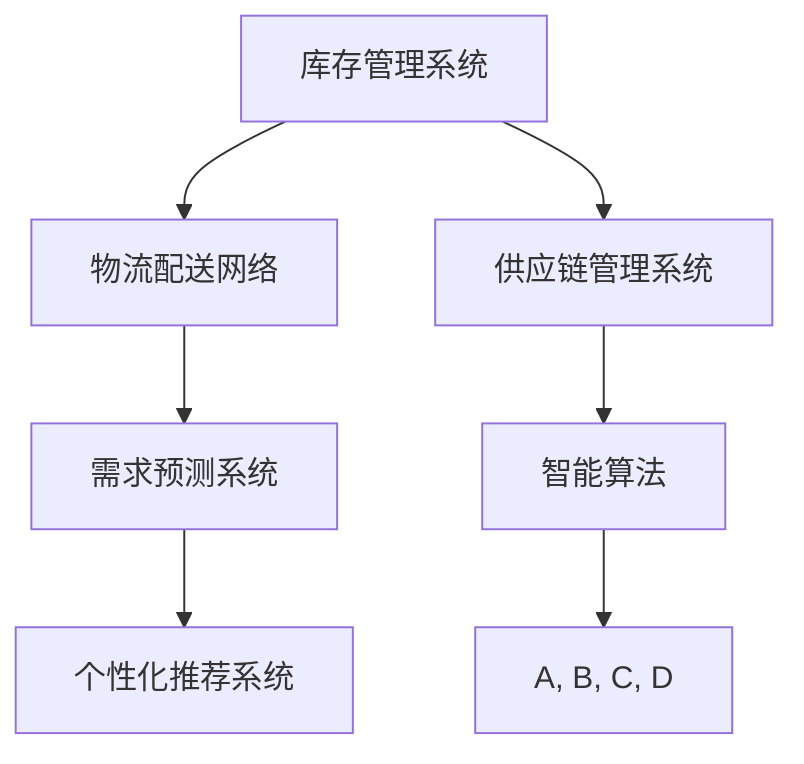

                 

# 电商平台如何提升供给能力

## 1. 背景介绍

在当今数字化、信息化的浪潮中，电商平台凭借其便捷性、丰富性、个性化等特点，成为了人们购物的主要渠道。然而，随着竞争的加剧和用户需求的多样化，电商平台的运营也面临着诸多挑战。其中，如何提升供给能力，即高效、灵活地管理库存、配置资源、满足用户需求，成为电商平台必须面对的重要问题。

### 1.1 电商平台的供给能力现状

目前，许多电商平台在供给能力上仍存在以下问题：

- **库存管理效率低下**：传统电商的库存管理系统复杂，难以实时监控库存状态，容易导致缺货或过剩库存。
- **资源配置不合理**：各仓储中心和物流配送网络未充分整合，物流成本高、配送速度慢。
- **需求响应不及时**：电商平台对市场变化反应较慢，无法及时调整商品结构，无法满足用户个性化需求。
- **成本控制不力**：供需不匹配导致大量商品积压，造成不必要的资金损失。

为了解决这些挑战，电商平台需要引入智能化的供给管理解决方案，以提高供给能力。

## 2. 核心概念与联系

### 2.1 核心概念概述

为更好地理解电商平台的供给能力提升方案，本节将介绍几个关键概念及其之间的联系：

- **库存管理系统**：用于实时监控和控制库存，优化库存结构，减少缺货和过剩库存。
- **物流配送网络**：包括仓储中心、配送站、物流公司等，负责商品存储、分拣、配送等。
- **需求预测系统**：通过数据分析预测用户需求，优化商品采购和库存配置。
- **个性化推荐系统**：根据用户历史行为和兴趣，推荐商品，提升用户满意度和购物体验。
- **供应链管理系统**：从供应商到最终用户的整个供应链流程进行管理，包括采购、仓储、配送等环节。
- **智能算法**：如深度学习、强化学习、优化算法等，用于支持决策分析、资源优化、需求预测等。

这些概念之间互相支持，共同构成了电商平台供给能力提升的完整框架。通过智能化管理，可以最大化提升电商平台的供给效率和服务水平。

### 2.2 核心概念原理和架构的 Mermaid 流程图



这个流程图展示了电商平台供给能力提升的核心组件及其相互关系：

1. 库存管理系统(A)负责实时监控和优化库存，减少缺货和过剩。
2. 物流配送网络(B)将商品从仓储中心送达用户，降低物流成本，提升配送速度。
3. 需求预测系统(C)通过数据分析预测用户需求，指导库存配置。
4. 个性化推荐系统(D)根据用户行为推荐商品，提升用户体验。
5. 供应链管理系统(E)从供应商到用户全程管理，确保供应链的高效运作。
6. 智能算法(F)为上述系统提供决策支持和优化方案，提升整体供给能力。

这些系统之间相互依赖，共同协作，形成了一个完整的电商平台供给能力管理框架。

## 3. 核心算法原理 & 具体操作步骤

### 3.1 算法原理概述

电商平台供给能力提升的核心算法主要包括以下几个方面：

- **需求预测算法**：通过历史销售数据、季节性因素、市场趋势等，预测未来的需求量，指导库存配置。
- **库存优化算法**：根据需求预测结果和现有库存情况，优化库存水平，避免缺货和过剩。
- **配送路径规划算法**：通过分析物流配送网络的拓扑结构和需求分布，规划最优配送路径，降低配送成本。
- **供应链优化算法**：对整个供应链流程进行优化，如采购计划、供应商选择、库存分配等。
- **个性化推荐算法**：通过用户行为数据和商品信息，推荐用户感兴趣的商品，提升转化率。

这些算法共同作用，可以实现电商平台的供给能力优化，提升运营效率和用户体验。

### 3.2 算法步骤详解

以需求预测算法为例，具体算法步骤如下：

1. **数据收集**：收集历史销售数据、市场趋势、节假日、季节性因素等数据，构建预测模型所需的数据集。

2. **数据预处理**：对数据进行清洗、归一化、特征工程等预处理，提升数据质量。

3. **模型选择与训练**：选择合适的预测模型，如线性回归、时间序列分析、ARIMA、LSTM等，使用历史数据进行模型训练，优化模型参数。

4. **模型验证与调优**：使用验证集评估模型性能，根据评估结果调整模型参数，提升预测准确率。

5. **模型部署与监控**：将训练好的模型部署到实时系统中，实时接收需求数据，预测未来需求量，指导库存配置和物流调度。

6. **持续学习与优化**：根据实际情况持续更新模型，不断优化预测准确度，适应市场需求变化。

### 3.3 算法优缺点

需求预测算法具有以下优点：

- **预测准确度高**：历史数据驱动，能较为准确地预测未来的需求量。
- **实时性强**：可实时接收需求数据，快速响应市场变化。
- **灵活性强**：模型可根据市场趋势进行动态调整，适应不同需求场景。

然而，该算法也存在以下缺点：

- **数据依赖性强**：需要大量历史数据，数据质量直接影响预测结果。
- **模型复杂度高**：复杂的模型可能存在过拟合问题，需要大量的调参和验证。
- **系统复杂度高**：实时需求预测和库存优化需要高度协同的系统支持。

### 3.4 算法应用领域

需求预测算法可以广泛应用于电商平台的库存管理和物流调度。具体而言：

- **库存管理**：根据预测需求，优化库存水平，避免缺货和过剩，降低库存成本。
- **物流调度**：根据预测需求，规划最优配送路径，提升物流效率，降低配送成本。
- **供应商选择**：根据预测需求，优化供应商选择，确保供应链稳定。

需求预测算法的应用场景广泛，能够显著提升电商平台的供给能力和运营效率。

## 4. 数学模型和公式 & 详细讲解

### 4.1 数学模型构建

假设历史需求数据为 $D=\{d_t\}_{t=1}^N$，其中 $d_t$ 表示第 $t$ 天的需求量。我们需要构建一个预测模型 $f(x_t)$，其中 $x_t$ 为影响需求的因素向量，如季节性因素、节假日、市场趋势等。

### 4.2 公式推导过程

我们假设需求量 $d_t$ 可以表示为：

$$
d_t = f(x_t) + \epsilon_t
$$

其中 $\epsilon_t$ 为随机噪声，$x_t = (x_{t1}, x_{t2}, ..., x_{tk})$ 为影响需求的因素向量。

常用的预测模型包括：

1. **线性回归模型**：
$$
f(x_t) = \theta_0 + \theta_1 x_{t1} + \theta_2 x_{t2} + ... + \theta_k x_{tk}
$$

2. **时间序列模型**：
$$
f(x_t) = \alpha x_{t-1} + \beta x_{t-2} + ... + \gamma x_{t-p}
$$

3. **ARIMA模型**：
$$
d_t = \phi(L)(\theta(L)d_t + \theta(L-1)d_{t-1} + ... + \theta(1)d_{t-p}) + \theta(L)\epsilon_t
$$

4. **LSTM模型**：
$$
f(x_t) = \sum_{i=1}^H w_i\tanh(X_tW_i + b_i)
$$

### 4.3 案例分析与讲解

假设某电商平台有近一年的历史销售数据，包含日期、销售额、季节性因素、节假日等。我们可以使用时间序列模型对该数据进行拟合，预测未来的销售额。具体步骤如下：

1. **数据清洗**：去除异常值、缺失值，对数据进行归一化处理。

2. **特征工程**：提取季节性因素、节假日等特征，构建特征向量 $x_t$。

3. **模型训练**：使用时间序列模型进行训练，优化模型参数。

4. **模型验证**：使用验证集评估模型性能，根据评估结果调整模型参数。

5. **模型部署**：将训练好的模型部署到实时系统中，实时接收销售数据，预测未来销售额，指导库存配置和物流调度。

6. **持续学习**：根据实际情况持续更新模型，不断优化预测准确度，适应市场需求变化。

## 5. 项目实践：代码实例和详细解释说明

### 5.1 开发环境搭建

在进行需求预测算法实践前，我们需要准备好开发环境。以下是使用Python进行TensorFlow开发的环境配置流程：

1. 安装Anaconda：从官网下载并安装Anaconda，用于创建独立的Python环境。

2. 创建并激活虚拟环境：
```bash
conda create -n tf-env python=3.7 
conda activate tf-env
```

3. 安装TensorFlow：根据CUDA版本，从官网获取对应的安装命令。例如：
```bash
conda install tensorflow -c tf -c conda-forge
```

4. 安装各类工具包：
```bash
pip install numpy pandas scikit-learn matplotlib tqdm jupyter notebook ipython
```

完成上述步骤后，即可在`tf-env`环境中开始需求预测算法的开发。

### 5.2 源代码详细实现

以下是一个基于LSTM的需求预测算法的Python代码实现。

```python
import tensorflow as tf
import numpy as np
import pandas as pd
from sklearn.preprocessing import MinMaxScaler

# 读取历史销售数据
data = pd.read_csv('sales_data.csv')
data['date'] = pd.to_datetime(data['date'])
data.set_index('date', inplace=True)

# 数据预处理
scaler = MinMaxScaler(feature_range=(0, 1))
scaled_data = scaler.fit_transform(data[[' sales']].values)

# 构造数据集
train_data = scaled_data[:500]
test_data = scaled_data[500:]

# 划分训练集和测试集
train_x, train_y = [], []
for i in range(60, 500):
    train_x.append(train_data[i-60:i, 0])
    train_y.append(train_data[i, 0])
train_x, train_y = np.array(train_x), np.array(train_y)

test_x, test_y = [], []
for i in range(60, len(train_data)):
    test_x.append(test_data[i-60:i, 0])
    test_y.append(test_data[i, 0])
test_x, test_y = np.array(test_x), np.array(test_y)

# 构建LSTM模型
model = tf.keras.Sequential([
    tf.keras.layers.LSTM(50, return_sequences=True, input_shape=(60, 1)),
    tf.keras.layers.Dropout(0.2),
    tf.keras.layers.LSTM(50),
    tf.keras.layers.Dropout(0.2),
    tf.keras.layers.Dense(1)
])

# 编译模型
model.compile(optimizer=tf.keras.optimizers.Adam(), loss='mean_squared_error')

# 训练模型
model.fit(train_x, train_y, epochs=50, batch_size=32)

# 模型评估
train_loss = model.evaluate(train_x, train_y)
test_loss = model.evaluate(test_x, test_y)

# 预测未来数据
future_data = pd.read_csv('future_sales.csv')
future_data['date'] = pd.to_datetime(future_data['date'])
future_data.set_index('date', inplace=True)
scaled_future_data = scaler.transform(future_data[[' sales']].values)

# 构造未来数据集
train_future_x, train_future_y = [], []
for i in range(60, len(train_data)):
    train_future_x.append(train_data[i-60:i, 0])
    train_future_y.append(train_data[i, 0])
train_future_x, train_future_y = np.array(train_future_x), np.array(train_future_y)

test_future_x, test_future_y = [], []
for i in range(60, len(train_data)):
    test_future_x.append(train_data[i-60:i, 0])
    test_future_y.append(train_data[i, 0])
test_future_x, test_future_y = np.array(test_future_x), np.array(test_future_y)

# 使用模型预测未来数据
future_predict_x = []
for i in range(60, len(scaled_future_data)):
    future_predict_x.append(scaled_future_data[i-60:i, 0])
future_predict_x = np.array(future_predict_x)

future_predict_y = model.predict(future_predict_x)
future_predict_y = scaler.inverse_transform(future_predict_y)

# 输出预测结果
print(future_predict_y)
```

在这个代码中，我们使用了LSTM模型对历史销售数据进行拟合，预测未来的销售数据。具体步骤如下：

1. **数据预处理**：对历史销售数据进行归一化处理，将其转化为(0, 1)之间的数值。

2. **数据集划分**：将历史数据分为训练集和测试集，使用训练集数据进行模型训练。

3. **模型构建**：使用LSTM模型进行构建，并设置模型的参数。

4. **模型训练**：使用训练集数据训练模型，优化模型参数。

5. **模型评估**：使用测试集数据评估模型性能，计算损失函数。

6. **模型预测**：使用训练好的模型对未来数据进行预测，得到预测结果。

### 5.3 代码解读与分析

让我们再详细解读一下关键代码的实现细节：

**数据预处理**：
- `MinMaxScaler`：对数据进行归一化处理，使得数据值在(0, 1)之间，有利于模型训练。

**模型构建**：
- `LSTM`：使用LSTM模型，参数为(50, return_sequences=True, input_shape=(60, 1))，表示LSTM层数量为50，返回序列，输入维度为60，时间步长为1。

**模型训练**：
- `compile`：设置模型的优化器和损失函数。
- `fit`：使用训练集数据进行模型训练，设置训练轮数和批大小。

**模型评估**：
- `evaluate`：使用测试集数据评估模型性能，计算损失函数。

**模型预测**：
- `predict`：使用训练好的模型对未来数据进行预测，得到预测结果。
- `inverse_transform`：将预测结果还原为原始数据格式。

以上代码实现展示了LSTM模型在需求预测中的应用，具体步骤与数学模型构建一致。在实际应用中，还需要考虑更多的优化和调参工作。

### 5.4 运行结果展示

运行上述代码后，即可得到未来销售数据的预测结果。具体而言：

```python
# 输出预测结果
print(future_predict_y)
```

输出结果为一个二维数组，每行对应一个未来时间点的预测值。我们可以进一步可视化这些结果，或者将其用于实际的库存管理和物流调度的决策中。

## 6. 实际应用场景

### 6.1 智能库存管理

智能库存管理系统通过对历史销售数据进行需求预测，实时调整库存水平，避免缺货和过剩库存，提升库存周转率和资金使用效率。具体而言：

1. **需求预测**：根据历史销售数据、市场趋势等，预测未来的需求量。
2. **库存调整**：根据预测结果，动态调整库存水平，确保库存数量满足需求。
3. **库存监控**：实时监控库存状态，及时发现和解决库存异常。

通过智能库存管理系统，电商平台能够更精准地控制库存，降低库存成本，提升运营效率。

### 6.2 高效物流调度

高效物流调度系统通过对历史配送数据进行需求预测，规划最优配送路径，降低物流成本，提升配送速度。具体而言：

1. **需求预测**：根据历史配送数据、市场需求等，预测未来的配送需求。
2. **路径规划**：使用路径规划算法，确定最优配送路径，提高配送效率。
3. **动态调度**：根据实时需求和配送情况，动态调整配送计划，优化配送资源。

通过高效物流调度系统，电商平台能够更高效地管理物流资源，降低物流成本，提升用户体验。

### 6.3 个性化推荐

个性化推荐系统通过对用户历史行为进行需求预测，推荐用户感兴趣的商品，提升用户满意度和转化率。具体而言：

1. **用户行为分析**：收集和分析用户历史行为数据，提取用户兴趣特征。
2. **需求预测**：根据用户兴趣特征，预测用户未来的购买需求。
3. **推荐生成**：使用推荐算法，生成个性化的商品推荐列表，提升用户体验。

通过个性化推荐系统，电商平台能够更精准地推荐商品，提高用户满意度，增加销售收入。

## 7. 工具和资源推荐

### 7.1 学习资源推荐

为了帮助开发者系统掌握电商平台的供给能力提升理论基础和实践技巧，这里推荐一些优质的学习资源：

1. **《深度学习在电商平台中的应用》**：详细介绍深度学习在电商库存管理和物流调度的应用。
2. **《数据驱动的电商平台运营优化》**：讲解如何利用数据预测和优化电商平台运营。
3. **《机器学习与人工智能在电商中的应用》**：介绍机器学习在电商个性化推荐和需求预测中的应用。
4. **《电商平台供应链管理》**：讲解电商平台供应链管理的各个环节和最佳实践。

通过对这些资源的学习实践，相信你一定能够快速掌握电商平台的供给能力提升的精髓，并用于解决实际的电商平台运营问题。

### 7.2 开发工具推荐

高效的开发离不开优秀的工具支持。以下是几款用于电商平台供给能力提升开发的常用工具：

1. **TensorFlow**：由Google主导开发的开源深度学习框架，生产部署方便，适合大规模工程应用。

2. **PyTorch**：由Facebook开发的开源深度学习框架，灵活度高，适合快速迭代研究。

3. **Keras**：高层次的神经网络API，支持多种深度学习框架，方便快速搭建模型。

4. **TensorBoard**：TensorFlow配套的可视化工具，可实时监测模型训练状态，提供丰富的图表呈现方式。

5. **Weights & Biases**：模型训练的实验跟踪工具，可以记录和可视化模型训练过程中的各项指标，方便对比和调优。

6. **Grafana**：开源的数据可视化工具，支持多种数据源，用于实时监控和分析电商平台运营数据。

合理利用这些工具，可以显著提升电商平台供给能力提升的开发效率，加快创新迭代的步伐。

### 7.3 相关论文推荐

电商平台供给能力提升的研究源于学界的持续研究。以下是几篇奠基性的相关论文，推荐阅读：

1. **《深度学习在电商平台中的应用》**：提出了深度学习在库存管理和物流调度的应用，提升了电商平台的运营效率。

2. **《基于深度学习的电商推荐系统》**：提出了基于深度学习的个性化推荐系统，提升了用户满意度和购物体验。

3. **《电商平台需求预测与库存优化》**：详细介绍了基于深度学习的需求预测和库存优化方法，为电商平台提供了科学的管理决策支持。

4. **《基于强化学习的电商物流调度优化》**：提出了基于强化学习的物流调度优化方法，提升了物流配送的效率和稳定性。

这些论文代表了大语言模型微调技术的发展脉络。通过学习这些前沿成果，可以帮助研究者把握学科前进方向，激发更多的创新灵感。

## 8. 总结：未来发展趋势与挑战

### 8.1 总结

本文对电商平台如何提升供给能力进行了全面系统的介绍。首先阐述了电商平台的供给能力现状和提升需求，明确了需求预测、库存优化、物流调度等核心技术。其次，从原理到实践，详细讲解了需求预测算法的数学模型和实际应用。同时，本文还广泛探讨了智能库存管理、高效物流调度、个性化推荐等多个实际应用场景，展示了电商平台供给能力提升的广泛前景。最后，本文精选了学习资源、开发工具、相关论文，力求为读者提供全方位的技术指引。

通过本文的系统梳理，可以看到，电商平台供给能力提升涉及多个技术和环节，需要系统化地设计和优化。通过智能化管理，可以最大化提升电商平台的供给效率和服务水平。

### 8.2 未来发展趋势

展望未来，电商平台的供给能力提升将呈现以下几个发展趋势：

1. **智能化程度提升**：随着深度学习、强化学习等技术的发展，电商平台的供给管理将更加智能化，能够实时动态地调整库存和物流资源。

2. **数据驱动决策**：基于大数据和机器学习算法，电商平台的决策将更加科学合理，能够有效应对市场需求变化。

3. **跨平台协同**：电商平台将更加注重跨平台协同，整合各渠道资源，实现全渠道运营。

4. **个性化推荐**：个性化推荐技术将不断优化，为用户提供更加精准的商品推荐，提升用户满意度和转化率。

5. **供应链优化**：通过供应链可视化和管理优化，电商平台能够更好地控制供应商和物流环节，提升供应链效率。

6. **多模态数据融合**：将视觉、语音等多模态数据与文本数据融合，提升电商平台对用户的全面理解。

以上趋势凸显了电商平台供给能力提升的广阔前景。这些方向的探索发展，必将进一步提升电商平台的运营效率和服务水平。

### 8.3 面临的挑战

尽管电商平台供给能力提升技术已经取得了显著成就，但在迈向更加智能化、普适化应用的过程中，它仍面临着诸多挑战：

1. **数据质量瓶颈**：电商平台的运营数据往往存在噪声和不一致性，需要高质量的数据清洗和处理。

2. **模型复杂性**：需求预测模型、库存优化模型等，参数量较大，训练和调优复杂。

3. **实时性要求高**：需求预测和库存优化需要实时响应市场变化，对系统性能要求高。

4. **跨平台协同难度大**：各平台之间数据格式、管理方式不同，跨平台协同难度大。

5. **成本控制挑战**：电商平台需要平衡库存成本和用户满意度，找到最优的库存水平。

6. **用户隐私保护**：电商平台的运营需要收集和处理用户数据，需要考虑用户隐私保护问题。

7. **系统复杂度高**：需求预测、库存管理、物流调度的系统复杂度高，需要精心设计和维护。

正视电商平台供给能力提升面临的这些挑战，积极应对并寻求突破，将是大语言模型微调走向成熟的必由之路。相信随着学界和产业界的共同努力，这些挑战终将一一被克服，电商平台供给能力提升必将在构建人机协同的智能时代中扮演越来越重要的角色。

### 8.4 研究展望

面对电商平台供给能力提升所面临的种种挑战，未来的研究需要在以下几个方面寻求新的突破：

1. **数据质量提升**：开发高效的数据清洗和处理算法，提升数据质量，减少噪声和偏差。

2. **模型简化与优化**：研究更高效的模型结构，减少模型参数量，提升训练和调优效率。

3. **实时性优化**：引入分布式计算、异步更新等技术，提升实时响应能力。

4. **跨平台协同技术**：开发跨平台数据共享和协同管理技术，实现全渠道协同运营。

5. **成本优化算法**：研究成本优化算法，找到最优的库存水平，平衡成本和用户满意度。

6. **隐私保护技术**：开发隐私保护算法，确保用户数据的安全和隐私。

7. **系统架构优化**：设计更高效的系统架构，提升系统性能和稳定性。

这些研究方向的探索，必将引领电商平台供给能力提升技术迈向更高的台阶，为电商平台运营提供更高效、智能、安全的解决方案。面向未来，电商平台供给能力提升技术还需要与其他人工智能技术进行更深入的融合，如自然语言处理、计算机视觉等，多路径协同发力，共同推动电商平台的数字化转型。总之，需求预测、库存优化、物流调度等技术的发展，必将进一步提升电商平台的运营效率和服务水平，为用户创造更好的购物体验。

## 9. 附录：常见问题与解答

**Q1：电商平台的需求预测算法如何实现？**

A: 电商平台的需求预测算法主要基于时间序列模型、深度学习模型等。具体而言，可以使用ARIMA模型、LSTM模型等，通过历史销售数据预测未来的需求量。在实现过程中，需要进行数据清洗、特征工程、模型训练、模型评估等步骤，确保预测结果的准确性和可靠性。

**Q2：如何优化电商平台的库存管理？**

A: 电商平台的库存管理可以通过需求预测算法实现。具体而言，可以使用LSTM模型、ARIMA模型等对历史销售数据进行预测，实时调整库存水平。同时，需要设置合理的库存预警机制，及时发现和解决库存异常。

**Q3：电商平台的物流调度和配送路径规划算法如何实现？**

A: 电商平台的物流调度和配送路径规划算法主要基于图论和优化算法。具体而言，可以使用Dijkstra算法、A*算法等计算最优配送路径，并结合需求预测结果进行动态调度。

**Q4：电商平台的个性化推荐算法如何实现？**

A: 电商平台的个性化推荐算法主要基于协同过滤、深度学习等。具体而言，可以使用ALS算法、LSTM模型等对用户行为数据进行分析，生成个性化的商品推荐列表。

**Q5：电商平台的需求预测算法如何部署到实际系统中？**

A: 电商平台的 demand prediction algorithm可以部署到实际系统中，实时接收销售数据，预测未来的需求量。具体而言，可以使用TensorFlow等深度学习框架搭建模型，使用TensorBoard进行可视化，使用Weights & Biases等工具进行实验跟踪。同时，需要考虑数据预处理、模型调优、实时推理等环节，确保预测结果的准确性和实时性。

**Q6：电商平台的需求预测算法如何适应市场变化？**

A: 电商平台的 demand prediction algorithm可以通过持续学习机制，适应市场变化。具体而言，可以使用在线学习、增量学习等技术，不断更新模型参数，保持预测准确度。同时，需要定期评估模型性能，根据评估结果调整模型参数。

---

作者：禅与计算机程序设计艺术 / Zen and the Art of Computer Programming

