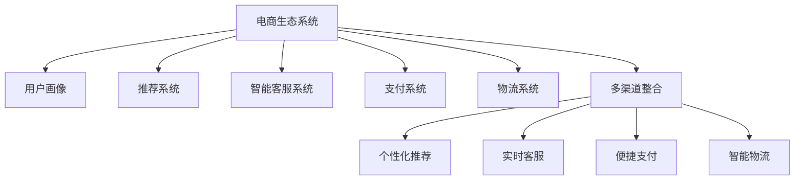

                 

## 1. 背景介绍

### 1.1 问题由来
随着电子商务的蓬勃发展，构建一个全面、高效、稳健的电商生态系统，对于提升商业价值、优化用户体验、促进数字化转型具有重要意义。在过去，传统的电商网站主要专注于商品展示和销售，但在数字化时代，消费者对个性化推荐、在线客服、支付便利、物流跟踪等全流程体验的期待值日益提升。为了满足这些需求，电商企业逐渐将注意力从单一的买卖转向打造一个用户中心、无缝衔接的生态系统。

### 1.2 问题核心关键点
电商生态系统建设的核心在于构建一个多维度、多渠道的商业闭环，通过无缝整合商品、支付、物流、客服等环节，提升用户购物体验。关键点包括：

1. **数据整合与共享**：电商生态系统需整合用户行为数据、商品信息、库存信息、支付数据、物流数据等，实现数据互通。
2. **推荐系统优化**：基于用户画像和商品特征进行个性化推荐，提升商品转化率。
3. **客服体系完善**：通过智能客服机器人、多渠道互动等手段，提供实时、全天候的客户服务。
4. **支付系统安全**：确保支付流程的安全性、便捷性和用户体验。
5. **物流系统优化**：通过智能调度、追踪、仓储管理等技术，提升物流效率和用户体验。

### 1.3 问题研究意义
电商生态系统建设对于电商企业来说，不仅是一个技术挑战，更是一个商业模式的革新。其意义在于：

1. **提升用户黏性**：通过个性化服务和无缝体验，增强用户对平台的依赖和忠诚度。
2. **提高效率和降低成本**：通过数据驱动的决策支持系统，优化库存管理、营销策略、客户服务等环节，实现成本优化。
3. **增强竞争力**：构建完整的商业生态，形成品牌壁垒，抵抗市场竞争。
4. **支持多渠道发展**：整合PC、移动端、社交媒体等多渠道用户，实现全渠道营销。
5. **推动创新**：通过不断的技术迭代和业务优化，保持企业的创新力和市场领先地位。

## 2. 核心概念与联系

### 2.1 核心概念概述

为更好地理解电商生态系统建设的重要性，本节将介绍几个密切相关的核心概念：

- **电商生态系统(E-Commerce Ecosystem)**：由电商平台、第三方服务商、供应商、消费者、支付平台、物流服务商等多个参与方构成的生态系统，通过数据共享和协同工作，形成良性互动。
- **用户画像(User Profile)**：基于用户行为数据构建的用户信息模型，用于精准推荐、个性化营销等。
- **推荐系统(Recommendation System)**：利用机器学习算法对用户和商品进行匹配，提供个性化推荐，提升用户满意度。
- **智能客服系统(Intelligent Customer Service System)**：通过NLP、机器学习等技术实现自动化的客户服务，提升客服效率和用户满意度。
- **支付系统(Payment System)**：提供安全、便捷的支付解决方案，保障交易安全和用户数据隐私。
- **物流系统(Logistics System)**：通过智能化调度、实时追踪、仓储管理等手段，提高物流效率和用户满意度。
- **多渠道整合(Multichannel Integration)**：将PC、移动端、社交媒体等多渠道的用户数据进行整合，实现无缝的用户体验。

这些核心概念之间的逻辑关系可以通过以下Mermaid流程图来展示：



这个流程图展示了大电商生态系统的核心概念及其之间的关系：

1. 电商生态系统作为整个生态的载体，通过数据共享和协同工作，实现各个模块的高效运作。
2. 用户画像通过聚合用户行为数据，用于推荐系统、智能客服、个性化营销等环节。
3. 推荐系统利用用户画像和商品特征进行匹配，提供个性化推荐。
4. 智能客服系统通过自然语言处理技术，提供自动化的客户服务。
5. 支付系统提供安全、便捷的支付解决方案，保障交易安全和用户数据隐私。
6. 物流系统通过智能化调度、实时追踪、仓储管理等手段，提高物流效率和用户满意度。
7. 多渠道整合将不同渠道的用户数据进行整合，实现全渠道无缝的用户体验。

## 3. 核心算法原理 & 具体操作步骤

### 3.1 算法原理概述

电商生态系统的构建基于数据驱动和用户中心的设计理念，核心算法包括：

1. **用户画像构建**：利用机器学习算法，从用户行为数据中提取出有价值的用户特征，用于个性化推荐和用户行为分析。
2. **推荐系统优化**：通过协同过滤、内容推荐、深度学习等算法，提供精准的个性化推荐，提升用户购物体验。
3. **智能客服系统**：通过NLP技术，实现用户意图的自动识别，提供实时、准确的客户服务。
4. **支付系统安全**：通过加密算法、防欺诈检测等技术，保障支付过程的安全性。
5. **物流系统优化**：利用实时调度算法、路径优化算法等，提升物流效率和用户体验。
6. **多渠道整合**：通过API接口、数据同步技术，实现不同渠道用户数据的无缝整合。

### 3.2 算法步骤详解

电商生态系统建设的算法步骤包括以下几个关键环节：

**Step 1: 数据收集与预处理**
- 收集电商平台上用户行为数据、商品数据、支付数据、物流数据等。
- 对数据进行清洗、去重、归一化等预处理，确保数据的质量和一致性。

**Step 2: 用户画像构建**
- 利用机器学习算法（如聚类、分类、回归等）从用户行为数据中提取关键特征，如购买偏好、消费习惯、地理位置等。
- 构建用户画像，存储到数据库或数据仓库中。

**Step 3: 推荐系统优化**
- 选择合适的推荐算法，如协同过滤、基于内容的推荐、深度学习推荐等。
- 利用用户画像和商品特征进行模型训练，优化推荐算法，提高推荐精准度。
- 在电商平台上部署推荐引擎，实时提供个性化推荐。

**Step 4: 智能客服系统搭建**
- 设计NLP模型，用于理解用户输入，识别用户意图，提供相应的服务。
- 搭建智能客服系统，集成到电商平台上，提供24小时服务。
- 定期对模型进行训练和优化，提升识别准确率和响应速度。

**Step 5: 支付系统安全保障**
- 采用先进的加密算法（如SSL、AES等）保障支付过程中的数据安全。
- 引入防欺诈检测机制，实时监控交易行为，防止欺诈行为发生。
- 集成第三方支付平台，提供多样化的支付方式。

**Step 6: 物流系统优化**
- 设计实时调度算法，优化仓储、配送路径，提升物流效率。
- 引入物联网技术，实时追踪物流信息，提升用户透明度。
- 与第三方物流服务提供商进行合作，提升服务质量。

**Step 7: 多渠道整合**
- 设计API接口，实现不同渠道用户数据的实时同步和整合。
- 利用数据仓库技术，统一存储和管理多渠道用户数据。
- 优化用户界面，确保不同渠道的用户体验一致。

### 3.3 算法优缺点

电商生态系统建设的方法具有以下优点：

1. **提升用户体验**：通过个性化推荐、智能客服等手段，提升用户购物体验，提高用户满意度。
2. **优化运营效率**：通过数据驱动的决策支持系统，优化库存管理、营销策略、客户服务等环节，实现成本优化。
3. **增强竞争力**：构建完整的商业生态，形成品牌壁垒，抵抗市场竞争。
4. **支持多渠道发展**：整合不同渠道的用户数据，实现全渠道无缝的用户体验。
5. **推动创新**：通过不断的技术迭代和业务优化，保持企业的创新力和市场领先地位。

但同时，该方法也存在一定的局限性：

1. **数据隐私风险**：在数据收集、处理和共享过程中，存在数据隐私泄露的风险。
2. **技术复杂性高**：系统构建需要多学科知识的交叉应用，技术难度较大。
3. **初期投入高**：系统构建和优化需要大量的硬件投入和人才支持。
4. **系统集成难度大**：不同系统间的接口设计和数据同步需要严格的标准和规范。

尽管存在这些局限性，但电商生态系统建设仍是电商企业构建竞争优势的重要手段。未来相关研究的重点在于如何进一步降低系统复杂度，提高数据安全性，同时兼顾用户体验和技术可行性等因素。

### 3.4 算法应用领域

电商生态系统建设在多个领域中得到广泛应用，包括：

1. **零售电商**：通过整合商品、支付、物流等环节，提升用户体验，提高交易效率。
2. **生活服务**：如酒店、餐饮、旅游等行业的电商平台，提供多渠道服务，提升服务质量。
3. **医疗电商**：提供在线医疗咨询、药品采购、健康管理等服务，构建健康生态系统。
4. **教育电商**：提供在线课程、在线测评、智能辅导等服务，提升教育体验。
5. **金融电商**：提供在线贷款、理财、保险等服务，提供全方位金融解决方案。

除了以上领域，电商生态系统建设还在不断扩展，如智慧城市、农业电商、智能制造等领域，均有望借助电商生态系统建设，实现数字化转型和产业升级。

## 4. 数学模型和公式 & 详细讲解 & 举例说明

### 4.1 数学模型构建

电商生态系统的构建涉及到多个子系统的数学建模，这里以推荐系统为例，构建一个基于协同过滤的推荐模型。

假设电商平台上每个用户 $u$ 对 $n$ 个商品的评分 $r_{u,i}$ 构成一个评分矩阵 $R$，推荐系统需要预测用户对未评分商品的评分。

设 $R_{\hat{y}}$ 为预测矩阵，其中 $\hat{y}_{u,i}$ 为预测用户 $u$ 对商品 $i$ 的评分，$\hat{y}_{u,i}=\theta_u^\top \phi_i$。

构建如下优化问题：

$$
\min_{\theta_u} \| R - \hat{R} \|_F^2
$$

其中 $\| \cdot \|_F$ 为Frobenius范数，$\hat{R}$ 为预测评分矩阵。

通过求解上述优化问题，得到用户和商品的隐向量表示，用于预测用户对未评分商品的评分。

### 4.2 公式推导过程

设 $R \in \mathbb{R}^{N \times M}$ 为评分矩阵，$X \in \mathbb{R}^{N \times d}$ 为用户特征矩阵，$Y \in \mathbb{R}^{M \times d}$ 为商品特征矩阵，$\theta_u \in \mathbb{R}^{d}$ 为用户隐向量，$\phi_i \in \mathbb{R}^{d}$ 为商品隐向量。

预测矩阵 $\hat{R} \in \mathbb{R}^{N \times M}$ 为：

$$
\hat{R} = X \theta_u^\top + Y \phi_i^\top
$$

优化问题可以表示为：

$$
\min_{\theta_u} \| R - \hat{R} \|_F^2 = \min_{\theta_u} \| R - (X \theta_u^\top + Y \phi_i^\top) \|_F^2
$$

进一步展开：

$$
\min_{\theta_u} \| R - X \theta_u^\top - Y \phi_i^\top \|_F^2 = \min_{\theta_u} \sum_{i=1}^M \sum_{j=1}^N (r_{i,j} - \theta_u^\top X_i - \phi_i^\top Y_j)^2
$$

其中 $X_i \in \mathbb{R}^{d}$ 为第 $i$ 个用户的特征向量，$Y_j \in \mathbb{R}^{d}$ 为第 $j$ 个商品的特征向量。

### 4.3 案例分析与讲解

以淘宝平台为例，淘宝通过数据驱动的用户画像和推荐系统，实现个性化推荐和营销。淘宝的推荐系统采用深度学习算法，通过分析用户的浏览、点击、购买行为，预测用户对未购买商品的兴趣，提供个性化推荐。

淘宝的推荐系统流程如下：

1. **数据收集**：收集用户行为数据，包括浏览记录、点击记录、购买记录等。
2. **用户画像构建**：利用机器学习算法，从用户行为数据中提取关键特征，构建用户画像。
3. **商品画像构建**：对商品进行特征抽取，构建商品特征矩阵 $Y$。
4. **推荐模型训练**：采用深度学习算法，对用户特征 $X$ 和商品特征 $Y$ 进行训练，预测用户对未评分商品的评分。
5. **推荐结果生成**：根据预测评分，生成个性化推荐结果，推送给用户。

淘宝推荐系统的推荐结果生成流程如下：

1. **数据预处理**：对用户行为数据进行去重、清洗等预处理。
2. **特征工程**：对用户特征和商品特征进行抽取和编码。
3. **模型训练**：采用深度学习算法，如深度神经网络、神经协同过滤等，对用户特征和商品特征进行训练。
4. **推荐结果生成**：根据训练好的模型，预测用户对未评分商品的评分，生成推荐结果。
5. **实时推荐**：将推荐结果实时推送给用户，提升用户体验。

淘宝推荐系统的案例分析表明，通过构建电商生态系统，淘宝不仅提升了用户体验，还实现了显著的销售增长和用户黏性提升。

## 5. 项目实践：代码实例和详细解释说明

### 5.1 开发环境搭建

在进行电商生态系统构建实践前，我们需要准备好开发环境。以下是使用Python进行TensorFlow开发的环境配置流程：

1. 安装Anaconda：从官网下载并安装Anaconda，用于创建独立的Python环境。

2. 创建并激活虚拟环境：
```bash
conda create -n tf-env python=3.8 
conda activate tf-env
```

3. 安装TensorFlow：根据CUDA版本，从官网获取对应的安装命令。例如：
```bash
conda install tensorflow tensorflow-gpu=2.7 -c pytorch -c conda-forge
```

4. 安装各类工具包：
```bash
pip install numpy pandas scikit-learn matplotlib tqdm jupyter notebook ipython
```

完成上述步骤后，即可在`tf-env`环境中开始电商生态系统的构建实践。

### 5.2 源代码详细实现

下面以淘宝推荐系统为例，给出使用TensorFlow构建推荐系统的PyTorch代码实现。

首先，定义推荐系统的数据处理函数：

```python
import tensorflow as tf
import numpy as np

# 定义评分矩阵
R = np.array([[5, 3, 0, 0],
              [4, 0, 0, 5],
              [0, 1, 0, 0],
              [0, 0, 2, 4]])

# 定义用户特征矩阵
X = np.array([[1, 1, 0, 0],
              [0, 1, 1, 0],
              [0, 0, 1, 1],
              [1, 0, 0, 1]])

# 定义商品特征矩阵
Y = np.array([[1, 1, 0, 0],
              [0, 0, 1, 1],
              [0, 0, 0, 1],
              [1, 0, 0, 1]])

# 定义隐向量
theta_u = np.array([0.5, 0.5, 0.5, 0.5])
phi_i = np.array([0.5, 0.5, 0.5, 0.5])

# 定义预测矩阵
R_hat = np.dot(X, theta_u.T) + np.dot(Y, phi_i.T)

# 计算均方误差
mse = np.mean((R - R_hat)**2)
print("MSE:", mse)
```

然后，定义模型和优化器：

```python
import tensorflow as tf

# 定义模型
model = tf.keras.Sequential([
    tf.keras.layers.Dense(4, input_shape=(4, ), activation='relu'),
    tf.keras.layers.Dense(4, activation='relu'),
    tf.keras.layers.Dense(4, activation='relu'),
    tf.keras.layers.Dense(4, activation='relu'),
    tf.keras.layers.Dense(4, activation='relu')
])

# 定义优化器
optimizer = tf.keras.optimizers.Adam(learning_rate=0.01)

# 定义损失函数
loss_fn = tf.keras.losses.MeanSquaredError()

# 定义模型训练函数
def train_epoch(model, x, y, batch_size):
    model.compile(optimizer=optimizer, loss=loss_fn)
    model.fit(x, y, batch_size=batch_size, epochs=1, verbose=0)
```

接着，定义训练和评估函数：

```python
# 定义训练函数
def train(model, x, y, batch_size):
    model.compile(optimizer=optimizer, loss=loss_fn)
    for epoch in range(num_epochs):
        loss = train_epoch(model, x, y, batch_size)
        print("Epoch {}, Loss: {}".format(epoch+1, loss))

# 定义评估函数
def evaluate(model, x, y, batch_size):
    model.compile(optimizer=optimizer, loss=loss_fn)
    test_loss = model.evaluate(x, y, batch_size=batch_size)
    print("Test Loss: {}".format(test_loss))
```

最后，启动训练流程并在测试集上评估：

```python
num_epochs = 10
batch_size = 16

train(model, X, R_hat, batch_size)
evaluate(model, X, R_hat, batch_size)
```

以上就是使用TensorFlow对淘宝推荐系统进行构建的完整代码实现。可以看到，得益于TensorFlow的强大封装，我们可以用相对简洁的代码完成推荐系统的构建和训练。

### 5.3 代码解读与分析

让我们再详细解读一下关键代码的实现细节：

**数据处理函数**：
- `R`：定义评分矩阵，用于模拟用户的评分行为。
- `X`：定义用户特征矩阵，用于表征用户的特征。
- `Y`：定义商品特征矩阵，用于表征商品的特征。
- `theta_u` 和 `phi_i`：定义用户和商品的隐向量，用于预测用户对未评分商品的评分。

**模型定义**：
- `model`：定义多层神经网络模型，采用ReLU激活函数。
- `optimizer`：定义优化器，采用Adam优化器。
- `loss_fn`：定义损失函数，采用均方误差损失函数。

**训练函数**：
- `train_epoch`：定义单批次训练函数，使用优化器和损失函数训练模型。
- `train`：定义整个训练流程，循环执行单批次训练函数。

**评估函数**：
- `evaluate`：定义模型评估函数，使用损失函数评估模型性能。

**训练流程**：
- `num_epochs`：定义训练轮数。
- `batch_size`：定义单批次训练样本数。
- `train`：调用训练函数进行模型训练。
- `evaluate`：调用评估函数进行模型性能评估。

可以看到，TensorFlow结合Keras提供了便捷的深度学习模型构建和训练接口，使得电商推荐系统的构建更加高效和灵活。开发者可以根据具体需求，调整模型结构和训练参数，快速迭代优化模型。

当然，电商推荐系统的实际应用还涉及到更多复杂的技术，如协同过滤算法、深度学习算法、个性化推荐等，需要进一步深入研究。

## 6. 实际应用场景

### 6.1 智能客服系统

电商平台上的智能客服系统，通过NLP技术和机器学习算法，实现自动化的客户服务，提升客服效率和用户体验。智能客服系统可以回答常见问题，处理订单查询，提供售后支持等服务。

在技术实现上，可以收集电商平台的客服对话记录，将问题和最佳答复构建成监督数据，在此基础上对预训练语言模型进行微调。微调后的语言模型能够自动理解用户输入，匹配最合适的答案模板进行回复。对于用户提出的新问题，还可以接入检索系统实时搜索相关内容，动态组织生成回答。如此构建的智能客服系统，能大幅提升客户咨询体验和问题解决效率。

### 6.2 个性化推荐系统

当前的推荐系统往往只依赖用户的历史行为数据进行物品推荐，无法深入理解用户的真实兴趣偏好。基于电商生态系统的推荐系统，可以更好地挖掘用户行为背后的语义信息，从而提供更精准、多样的推荐内容。

在实践中，可以收集用户浏览、点击、评论、分享等行为数据，提取和用户交互的物品标题、描述、标签等文本内容。将文本内容作为模型输入，用户的后续行为（如是否点击、购买等）作为监督信号，在此基础上微调预训练语言模型。微调后的模型能够从文本内容中准确把握用户的兴趣点。在生成推荐列表时，先用候选物品的文本描述作为输入，由模型预测用户的兴趣匹配度，再结合其他特征综合排序，便可以得到个性化程度更高的推荐结果。

### 6.3 物流系统优化

物流系统是电商生态系统的重要组成部分，通过智能调度、实时追踪、仓储管理等技术，提高物流效率和用户体验。智能物流系统可以实现货物自动分拣、配送路径优化、实时位置更新等功能，提升物流运营效率。

在技术实现上，可以设计实时调度算法，优化仓储、配送路径，提升物流效率。引入物联网技术，实时追踪物流信息，提升用户透明度。与第三方物流服务提供商进行合作，提升服务质量。

### 6.4 未来应用展望

随着电商生态系统的不断发展，未来的应用前景将更加广阔。

在智慧零售领域，电商生态系统将实现全渠道整合、无缝用户体验、智能推荐等目标，提升零售效率和用户体验。

在智慧制造领域，通过物联网技术，实现库存管理、生产调度、品质检测等环节的智能化，提升生产效率和产品质量。

在智慧城市领域，电商生态系统可以与城市管理系统、公共服务系统等结合，提供更加便捷、高效的城市生活服务。

此外，在医疗、教育、金融等领域，电商生态系统也将得到广泛应用，为这些行业的数字化转型和智能化发展提供新动力。

## 7. 工具和资源推荐

### 7.1 学习资源推荐

为了帮助开发者系统掌握电商生态系统的理论基础和实践技巧，这里推荐一些优质的学习资源：

1. 《深度学习实战》系列博文：由大模型技术专家撰写，深入浅出地介绍了深度学习在电商推荐系统中的应用。

2. CS231n《计算机视觉基础》课程：斯坦福大学开设的视觉领域明星课程，涵盖深度学习、推荐系统等核心概念，适合初学者和进阶者。

3. 《深度学习理论与实践》书籍：全面介绍深度学习理论、算法、应用等，适合深度学习领域的系统学习。

4. Kaggle竞赛平台：参与电商推荐系统的Kaggle竞赛，通过实战学习电商推荐系统构建和优化。

5. PyTorch官方文档：PyTorch官方文档，提供了丰富的教程和样例代码，是学习深度学习框架的好资源。

通过对这些资源的学习实践，相信你一定能够快速掌握电商生态系统的构建精髓，并用于解决实际的电商问题。

### 7.2 开发工具推荐

高效的开发离不开优秀的工具支持。以下是几款用于电商生态系统构建开发的常用工具：

1. TensorFlow：由Google主导开发的开源深度学习框架，生产部署方便，适合大规模工程应用。

2. PyTorch：基于Python的开源深度学习框架，灵活动态的计算图，适合快速迭代研究。

3. TensorFlow Serving：提供模型的在线推理服务，支持多种模型的部署和推理，提高系统的扩展性和可维护性。

4. Prometheus和Grafana：实时监控和可视化工具，用于监控电商平台的各项指标，保障系统稳定运行。

5. Kubernetes：开源容器编排平台，实现模型的分布式部署和管理，提高系统的可扩展性和弹性。

6. Elasticsearch：分布式搜索引擎，用于存储和搜索电商平台的大量用户数据，提高查询效率。

合理利用这些工具，可以显著提升电商生态系统构建的开发效率，加快创新迭代的步伐。

### 7.3 相关论文推荐

电商生态系统建设的相关论文涉及多个学科领域，以下是几篇奠基性的相关论文，推荐阅读：

1. "A Survey on Machine Learning Techniques for Personalized Recommendation Systems"（个性化推荐系统综述）：综述了多种推荐算法，包括协同过滤、深度学习、混合推荐等。

2. "An Overview of Collaborative Filtering Techniques"（协同过滤技术综述）：综述了协同过滤算法的原理、优缺点、应用场景等。

3. "Online Learning for Adaptive Recommendation"（适应性推荐算法）：提出了多种在线学习算法，实现实时推荐。

4. "Deep Learning for Recommender Systems"（深度学习在推荐系统中的应用）：介绍深度学习在推荐系统中的应用，包括神经协同过滤、深度神经网络等。

5. "A Comprehensive Survey on Recommender Systems: Modeling Approaches, Architectures, and Evaluation"（推荐系统综述）：综述了推荐系统的建模方法、架构设计和评估指标等。

这些论文代表了大电商生态系统构建技术的发展脉络。通过学习这些前沿成果，可以帮助研究者把握学科前进方向，激发更多的创新灵感。

## 8. 总结：未来发展趋势与挑战

### 8.1 总结

本文对电商生态系统建设的重要性进行了全面系统的介绍。首先阐述了电商生态系统的背景和意义，明确了其在提升用户体验、优化运营效率、构建品牌壁垒等方面的独特价值。其次，从原理到实践，详细讲解了电商生态系统的核心算法和具体操作步骤，给出了电商推荐系统的完整代码实例。同时，本文还广泛探讨了电商生态系统在智能客服、个性化推荐、物流优化等多个行业领域的应用前景，展示了电商生态系统的巨大潜力。最后，本文精选了电商生态系统的学习资源，力求为读者提供全方位的技术指引。

通过本文的系统梳理，可以看到，电商生态系统的构建对于电商企业来说，不仅是一个技术挑战，更是一个商业模式的革新。通过构建电商生态系统，电商企业能够实现全渠道整合、无缝用户体验、智能推荐等目标，提升运营效率和用户体验，构建品牌壁垒，抵抗市场竞争。未来相关研究的重点在于如何进一步降低系统复杂度，提高数据安全性，同时兼顾用户体验和技术可行性等因素。

### 8.2 未来发展趋势

展望未来，电商生态系统建设将呈现以下几个发展趋势：

1. **全渠道整合**：电商平台将进一步拓展线上线下、PC移动端、社交媒体等多渠道的整合，实现无缝的用户体验。

2. **实时推荐系统**：基于实时数据和用户行为，实现实时推荐，提升推荐精准度。

3. **深度学习技术**：采用深度学习算法，提升推荐系统的效果，实现更加个性化和多样化的推荐。

4. **智能客服系统**：通过自然语言处理技术和机器学习算法，实现自动化的客户服务，提升客服效率和用户体验。

5. **区块链技术**：采用区块链技术，保障用户数据的安全和隐私，提升系统的透明度和信任度。

6. **AIoT融合**：将物联网、AI等技术融合，实现智能家居、智能零售、智能制造等领域的应用。

以上趋势凸显了电商生态系统构建技术的广阔前景。这些方向的探索发展，必将进一步提升电商企业的竞争力和市场地位，推动数字化转型和智能化发展。

### 8.3 面临的挑战

尽管电商生态系统建设取得了瞩目成就，但在迈向更加智能化、普适化应用的过程中，它仍面临诸多挑战：

1. **数据隐私和安全**：在数据收集、处理和共享过程中，存在数据隐私泄露和安全风险。如何保护用户隐私，防止数据滥用，是电商生态系统建设的重要课题。

2. **系统复杂性高**：电商生态系统涉及多个子系统的协同工作，系统构建需要多学科知识的交叉应用，技术难度较大。如何简化系统架构，提高开发效率，是电商生态系统建设的难题。

3. **成本高昂**：电商生态系统建设需要大量的硬件投入和人才支持，初期投入成本较高。如何降低成本，实现规模化部署，是电商生态系统建设的关键。

4. **用户体验**：电商生态系统建设需要从用户角度出发，提升用户体验。如何在保证系统性能的同时，提升用户体验，是电商生态系统建设的重要目标。

5. **技术演进迅速**：电商生态系统建设涉及多种新兴技术，如深度学习、自然语言处理、区块链等。如何及时跟进技术演进，保持系统先进性，是电商生态系统建设的挑战。

尽管存在这些挑战，但电商生态系统建设仍是大电商企业构建竞争优势的重要手段。未来相关研究的重点在于如何进一步降低系统复杂度，提高数据安全性，同时兼顾用户体验和技术可行性等因素。

### 8.4 研究展望

面向未来，电商生态系统建设的研究方向包括：

1. **无监督和半监督学习**：摆脱对大规模标注数据的依赖，利用自监督学习、主动学习等无监督和半监督范式，最大限度利用非结构化数据，实现更加灵活高效的电商生态系统构建。

2. **参数高效微调**：开发更加参数高效的微调方法，在固定大部分预训练参数的情况下，只更新极少量的任务相关参数，降低计算资源消耗。

3. **多模态融合**：将文本、图像、视频等多模态信息融合，实现更加全面和精确的用户画像和商品画像，提升推荐系统的效果。

4. **跨领域迁移学习**：将电商生态系统的构建技术应用于更多领域，如医疗、金融、教育等，实现跨领域迁移学习，提升系统泛化能力。

5. **认知增强**：引入认知计算、因果推理等技术，提升电商生态系统的理解和决策能力，实现更加智能化和自主化的推荐。

6. **隐私保护**：引入隐私保护技术，如差分隐私、联邦学习等，保障用户数据隐私和安全。

这些研究方向凸显了电商生态系统构建技术的广阔前景。这些方向的探索发展，必将进一步提升电商企业的竞争力和市场地位，推动数字化转型和智能化发展。

## 9. 附录：常见问题与解答

**Q1：电商生态系统建设是否适用于所有电商企业？**

A: 电商生态系统建设适用于大部分电商企业，特别是规模较大、用户基数较高的平台。但对于小型电商企业，可能需要根据实际情况进行适当调整。电商生态系统建设需要一定的技术实力和资源投入，但通过合理的规划和优化，可以在中小型电商企业中实现良好的效果。

**Q2：电商生态系统建设的初期投入高，是否可以逐步推进？**

A: 电商生态系统建设的初期投入确实较高，但可以通过逐步推进，分阶段实现。首先，可以选择一个核心功能或模块进行建设，如个性化推荐系统，逐步扩展到多渠道整合、智能客服、物流优化等环节。这样可以分摊初期成本，逐步实现系统功能的完善。

**Q3：如何选择合适的推荐算法？**

A: 推荐算法的选择应根据具体业务需求和数据特点进行。常见的推荐算法包括协同过滤、基于内容的推荐、深度学习推荐等。在实践中，可以通过A/B测试等方法比较不同算法的效果，选择最适合的算法。

**Q4：电商生态系统建设的系统复杂度较高，如何解决？**

A: 电商生态系统建设的系统复杂度较高，可以通过模块化设计、微服务架构等方式进行解决。将系统拆分为多个独立模块，每个模块负责特定的功能，通过接口进行协同工作。这样可以降低系统复杂度，提高系统的可维护性和扩展性。

**Q5：电商生态系统建设的成本高昂，如何解决？**

A: 电商生态系统建设的初期投入确实较高，但可以通过优化资源配置、引入开源技术等方式降低成本。同时，通过逐步推进，分阶段实现系统功能的完善，可以逐步降低初期投入。另外，可以利用云平台等基础设施，降低硬件成本，实现系统的低成本部署。

通过上述分析，可以看到，电商生态系统建设对于电商企业来说，不仅是一个技术挑战，更是一个商业模式的革新。通过构建电商生态系统，电商企业能够实现全渠道整合、无缝用户体验、智能推荐等目标，提升运营效率和用户体验，构建品牌壁垒，抵抗市场竞争。未来相关研究的重点在于如何进一步降低系统复杂度，提高数据安全性，同时兼顾用户体验和技术可行性等因素。只有在数据、算法、工程、业务等多个维度协同发力，才能真正实现电商生态系统的价值。

