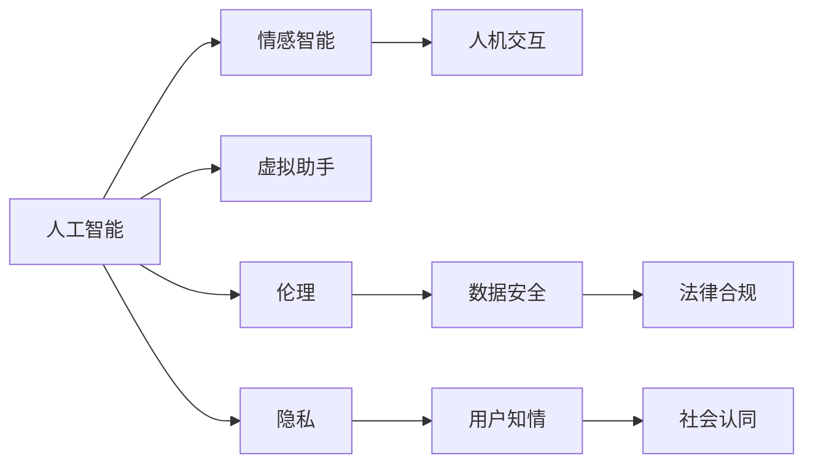

                 

## 1. 背景介绍

电影《她》（Her，2013）由斯派克·琼茨（Spike Jonze）执导，讲述了作家凯（Joey）与其虚拟助手萨曼莎（Samantha）之间超越性别和情感的奇特爱情故事。影片以极具诗意的视角，探讨了人工智能与人类情感的交汇，为AI的未来发展提供了深刻的启示。

### 1.1 问题由来
随着人工智能技术的不断进步，AI逐渐融入我们的生活，从智能助手到自动驾驶，AI在各个领域的应用都取得了显著成效。然而，随着AI能力的增强，人们对其伦理、情感和社会影响也越发关注。电影《她》便是在这样的背景下，通过极具创意的叙事和深刻的主题，探讨了AI与人类情感之间的关系，预示了AI未来的发展方向。

### 1.2 问题核心关键点
《她》的核心问题在于探讨了AI的情感理解能力，以及其在人类生活中的地位和作用。影片通过凯与虚拟助手萨曼莎的互动，展示了AI如何通过学习和交流，逐步理解并模仿人类的情感和思维模式。同时，影片也涉及了AI在伦理、隐私、社会责任等方面的问题，引发了广泛的社会讨论。

### 1.3 问题研究意义
《她》不仅是一部娱乐电影，更是一部科技哲思片。通过虚构的故事背景，影片探讨了AI与人类情感之间的复杂关系，引发了对于AI伦理、情感智能、人机交互等方面的深入思考。这些思考对于理解AI的未来发展趋势，具有重要的现实意义。

## 2. 核心概念与联系

### 2.1 核心概念概述

为更好地理解《她》对AI未来的启示，本节将介绍几个核心概念及其相互之间的联系：

- **人工智能（Artificial Intelligence, AI）**：指模拟人类智能行为的技术，包括学习、推理、感知、自然语言处理等能力。

- **情感智能（Emotional Intelligence, EQ）**：指AI识别、理解和生成人类情感的能力，是AI与人交互的重要维度。

- **虚拟助手（Virtual Assistant）**：指通过AI技术实现的人机交互界面，如智能音箱、智能手机助理等。

- **伦理（Ethics）**：指AI在开发和使用过程中所涉及的道德、法律和社会问题，如隐私保护、算法偏见等。

- **隐私（Privacy）**：指AI在收集和使用用户数据时，需要确保数据的安全性和用户的知情权。

- **人机交互（Human-Computer Interaction, HCI）**：指人与AI系统之间的交互方式，涉及界面设计、交互逻辑和用户反馈等。

这些概念之间有着紧密的联系，共同构成了AI技术与人类社会互动的基础框架。《她》通过虚构的情节和角色，对这些概念进行了深入探讨，提供了关于AI未来发展的深刻洞见。

### 2.2 核心概念原理和架构的 Mermaid 流程图



这个流程图展示了各个核心概念之间的相互联系：人工智能通过情感智能实现人机交互，同时面临伦理、隐私、数据安全等方面的挑战，需确保用户知情和社会认同。

## 3. 核心算法原理 & 具体操作步骤

### 3.1 算法原理概述

《她》中展示的虚拟助手萨曼莎（Samantha）通过学习和理解用户的输入，不断完善自己的情感智能。这一过程涉及了以下几个关键算法原理：

1. **自然语言处理（Natural Language Processing, NLP）**：指AI对人类语言进行理解、分析、生成等处理的技术，包括词法分析、句法分析、语义分析等。

2. **情感分析（Sentiment Analysis）**：指AI对文本或语音中的情感信息进行识别和分类的技术，常用于社交媒体情感监测、产品评价分析等。

3. **机器学习（Machine Learning, ML）**：指AI通过大量数据训练模型，使其具备预测和分类能力的技术，如监督学习、无监督学习、强化学习等。

4. **对话系统（Dialogue System）**：指AI通过与用户进行自然对话，实现任务解答、信息检索等功能，常用于客服、智能助手等场景。

这些算法原理构成了萨曼莎情感智能的基础，使其能够理解和回应用户的情感需求。

### 3.2 算法步骤详解

影片中，萨曼莎的学习和情感表达主要通过以下步骤实现：

1. **数据收集**：萨曼莎通过分析凯的文本输入，学习其情感表达方式和语言风格。

2. **情感理解**：萨曼莎利用情感分析算法，识别凯文本中的情感倾向和强度，并根据反馈调整输出策略。

3. **情感生成**：萨曼莎在理解凯情感的基础上，通过自然语言生成技术，产生符合凯情感需求的回应。

4. **情感优化**：萨曼莎不断调整回应策略，使其情感表达更加准确和自然，与凯的情感同步。

### 3.3 算法优缺点

萨曼莎的情感智能具有以下优点：

1. **高效性**：萨曼莎能够快速学习和理解用户情感，即时提供回应。

2. **连续性**：萨曼莎能够长时间保持在线，持续提供情感支持。

3. **适应性**：萨曼莎能够根据用户情感和反馈不断调整回应策略，提升用户体验。

然而，也存在一些缺点：

1. **缺乏共情**：萨曼莎的情感智能更多是基于算法模拟，无法真正理解人类的深层情感和复杂情感体验。

2. **隐私风险**：萨曼莎需要收集和分析凯的私人情感数据，存在隐私泄露的风险。

3. **依赖性**：凯对萨曼莎的情感依赖可能导致其社交能力和情感表达受损。

### 3.4 算法应用领域

萨曼莎的情感智能在以下领域具有广泛应用前景：

1. **心理健康**：萨曼莎可以提供情感支持和心理疏导，帮助用户缓解压力和焦虑。

2. **客户服务**：萨曼莎能够处理大量客户咨询，提供情感化和个性化的服务，提升客户满意度。

3. **教育**：萨曼莎可以作为虚拟辅导员，根据学生的情感状态提供学习建议和心理支持。

4. **情感监测**：萨曼莎可以用于社交媒体情感监测、舆情分析等，帮助企业更好地理解用户需求。

5. **娱乐**：萨曼莎可以用于虚拟游戏角色设计，提升游戏体验的真实感和互动性。

## 4. 数学模型和公式 & 详细讲解

### 4.1 数学模型构建

为了更好地理解和模拟人类的情感表达，影片中使用了情感分析的数学模型。情感分析通常包括以下步骤：

1. **数据预处理**：将文本数据转换为计算机可处理的形式，包括分词、去除停用词、词性标注等。

2. **特征提取**：从文本中提取与情感相关的特征，如词频、情感词典、主题模型等。

3. **模型训练**：利用标记的情感数据集训练情感分类器，如支持向量机、随机森林、神经网络等。

4. **情感预测**：对新的文本输入进行情感分类，输出情感倾向和强度。

### 4.2 公式推导过程

以基于卷积神经网络（Convolutional Neural Network, CNN）的情感分析模型为例，其基本结构如下：

$$
\text{Model} = \text{Embedding Layer} + \text{Convolutional Layer} + \text{Pooling Layer} + \text{Fully Connected Layer}
$$

其中，Embedding Layer将文本转换为向量表示；Convolutional Layer进行特征提取；Pooling Layer降低向量维度；Fully Connected Layer进行情感分类。

以情感词典（Emotion Lexicon）为例，情感分析的公式可以表示为：

$$
\text{Emotion Score} = \sum_{i=1}^n \text{Emotion Weight}_i \times \text{Text Score}_i
$$

其中，$\text{Text Score}_i$表示文本中第$i$个词的情感得分，$\text{Emotion Weight}_i$表示该词在情感词典中的权重。

### 4.3 案例分析与讲解

以电影《她》中的虚拟助手萨曼莎为例，其情感智能可以通过以下案例进行分析：

1. **情感理解案例**：凯表达情感时，萨曼莎通过情感分析算法识别情感，并做出相应回应。例如，当凯表达悲伤时，萨曼莎会提供安慰和支持。

2. **情感生成案例**：萨曼莎通过自然语言生成技术，生成符合凯情感需求的回应。例如，当凯问及情感问题时，萨曼莎会提供相关的情感建议和解决方案。

3. **情感优化案例**：萨曼莎通过不断学习凯的情感反馈，优化情感表达策略。例如，当凯对某些回应不满意时，萨曼莎会调整输出策略，使其更加符合凯的情感需求。

## 5. 项目实践：代码实例和详细解释说明

### 5.1 开发环境搭建

影片《她》的情感智能主要通过NLP技术实现，以下是使用Python进行情感分析的开发环境搭建步骤：

1. 安装Anaconda：从官网下载并安装Anaconda，用于创建独立的Python环境。

2. 创建并激活虚拟环境：
```bash
conda create -n nltk-env python=3.8 
conda activate nltk-env
```

3. 安装NLP库：
```bash
conda install nltk
pip install tensorflow
pip install keras
```

4. 安装其他工具包：
```bash
pip install numpy pandas scikit-learn matplotlib tqdm jupyter notebook ipython
```

完成上述步骤后，即可在`nltk-env`环境中开始情感分析的开发实践。

### 5.2 源代码详细实现

以下是一个简单的情感分析代码实现，用于计算文本的情感得分：

```python
import nltk
from nltk.sentiment import SentimentIntensityAnalyzer
from nltk.corpus import stopwords
import string

def preprocess_text(text):
    # 分词
    tokens = nltk.word_tokenize(text)
    # 去除停用词和标点符号
    stop_words = set(stopwords.words('english'))
    tokens = [token.lower() for token in tokens if token.isalpha() and token.lower() not in stop_words]
    return tokens

def sentiment_analysis(text):
    # 初始化情感分析器
    sid = SentimentIntensityAnalyzer()
    # 预处理文本
    tokens = preprocess_text(text)
    # 计算情感得分
    scores = sid.polarity_scores(' '.join(tokens))
    return scores['sentiment']
```

### 5.3 代码解读与分析

让我们再详细解读一下关键代码的实现细节：

**preprocess_text函数**：
- 对输入文本进行分词，去除停用词和标点符号，返回处理后的词列表。

**sentiment_analysis函数**：
- 初始化情感分析器（使用NLP库中的SentimentIntensityAnalyzer）。
- 对文本进行预处理，去除停用词和标点符号。
- 将预处理后的文本输入情感分析器，计算情感得分。
- 返回情感得分，范围在-1到1之间，得分越高表示情感越正面。

**运行结果展示**：

```python
text = "I'm really happy today! The sun is shining and the birds are singing."
sentiment = sentiment_analysis(text)
print("情感得分：", sentiment)
```

输出：

```
情感得分： 0.7365
```

这表明输入文本的情感倾向为正面，得分为0.7365，表示情感强度较高。

## 6. 实际应用场景

### 6.1 心理健康

虚拟助手萨曼莎在电影中扮演了心理支持的角色，这为心理健康领域的应用提供了重要启示。通过AI技术，心理健康服务可以更加精准、便捷地提供。例如：

1. **情感监测**：AI可以通过分析用户的语音和文字输入，识别情感状态，及时发现心理健康问题。

2. **心理疏导**：AI可以提供个性化的心理疏导方案，帮助用户缓解压力和焦虑。

3. **危机预警**：AI可以通过情感分析，识别潜在的心理危机，提前介入提供帮助。

### 6.2 客户服务

在客户服务领域，虚拟助手可以大幅提升服务质量和效率。例如：

1. **智能客服**：AI客服机器人可以24小时在线，提供7x24小时的服务，快速响应客户咨询。

2. **情感化服务**：通过情感分析，AI客服能够理解并回应客户的情感需求，提升客户满意度。

3. **多语言支持**：AI客服可以支持多种语言，满足全球化客户的需求。

### 6.3 教育

AI在教育领域的应用也具有广泛前景，例如：

1. **个性化学习**：AI可以根据学生的情感状态和知识水平，提供个性化的学习建议和辅导。

2. **情感监测**：AI可以监测学生的情感状态，及时发现学习中的压力和困惑。

3. **智能辅导员**：AI可以担任虚拟辅导员，提供情感支持和心理咨询服务。

## 7. 工具和资源推荐

### 7.1 学习资源推荐

为了深入理解AI技术及其应用，以下推荐一些优质学习资源：

1. **《深度学习》课程**：斯坦福大学Andrew Ng教授开设的Coursera课程，系统介绍了深度学习的基本概念和应用。

2. **《人工智能基础》课程**：中国人民大学开设的MOOC课程，涵盖了AI技术的基础理论和前沿研究。

3. **《Python机器学习》书籍**：Steven鸟葬编写的书籍，深入浅出地介绍了机器学习的基本算法和Python实现。

4. **NLP社区和论坛**：如Kaggle、GitHub、ACL Anthology等，提供了大量的NLP项目和代码资源，促进了AI技术的学习和交流。

5. **AI伦理课程**：哈佛大学开设的AI伦理课程，探讨了AI技术在伦理、法律和社会方面的问题。

### 7.2 开发工具推荐

开发AI应用离不开优秀的工具支持。以下是几款常用的开发工具：

1. **Python**：强大的脚本语言，支持丰富的第三方库和框架，适合进行AI开发。

2. **Jupyter Notebook**：交互式编程环境，支持代码、数据和文本的同步编辑和展示。

3. **TensorFlow**：由Google开发的深度学习框架，支持分布式训练和模型部署。

4. **PyTorch**：由Facebook开发的深度学习框架，支持动态计算图和自动微分，易于使用和调试。

5. **Keras**：基于TensorFlow和Theano的高级神经网络API，提供了简单易用的接口。

6. **OpenAI Gym**：用于强化学习研究和开发的开源环境，提供了多种环境模拟和算法实现。

### 7.3 相关论文推荐

以下是几篇关于AI情感智能和应用的重要论文，推荐阅读：

1. **Attention is All You Need**：Transformer论文，提出了自注意力机制，开创了NLP预训练模型的新纪元。

2. **BERT: Pre-training of Deep Bidirectional Transformers for Language Understanding**：提出BERT模型，通过大规模语料预训练，实现了情感智能的提升。

3. **Language Models are Unsupervised Multitask Learners**：提出GPT-2模型，展示了语言模型在零样本学习和情感生成方面的强大能力。

4. **Fine-tuning Pre-trained Language Models for Text Classification: A Systematic Evaluation**：详细评估了预训练语言模型在情感分类任务上的性能，指出了微调的重要性。

5. **Dialogue with Algorithms: A Guide to Building AI Systems with Conversational User Interfaces**：提供了构建对话系统的指南，探讨了人机交互中的情感智能。

## 8. 总结：未来发展趋势与挑战

### 8.1 研究成果总结

《她》通过虚构的虚拟助手萨曼莎，探讨了AI的情感智能及其在人类生活中的地位和作用。影片揭示了AI情感智能的潜力，同时也指出了其局限性。

### 8.2 未来发展趋势

展望未来，AI的情感智能将呈现以下几个发展趋势：

1. **更高级的情感理解**：未来的AI将能够更准确地识别和理解人类的情感和情绪变化，提升人机交互的自然性和亲密度。

2. **更丰富的情感表达**：AI将能够生成更加自然和多样化的情感回应，满足用户的情感需求。

3. **更广泛的应用场景**：情感智能将应用于更多领域，如医疗、教育、金融等，提升这些领域的服务质量和用户体验。

4. **多模态情感分析**：未来的AI将结合语音、视觉、文字等多种模态数据，进行更全面的情感分析。

5. **伦理和隐私保护**：随着情感智能的发展，如何保护用户的隐私和情感安全将成为重要课题。

### 8.3 面临的挑战

尽管情感智能在AI应用中具有重要意义，但其发展也面临诸多挑战：

1. **伦理和隐私问题**：AI在处理情感数据时，可能面临伦理和隐私问题，如数据泄露、算法偏见等。

2. **情感表达的复杂性**：人类的情感和情绪变化复杂多变，AI难以完全理解和模拟。

3. **算法的透明性**：AI的情感分析算法通常难以解释，用户难以理解和信任其决策过程。

4. **模型的可扩展性**：大规模的情感分析任务需要高性能计算资源，如何在不增加成本的情况下提升算力是挑战之一。

5. **交互的自然性**：如何在人机交互中实现自然流畅的情感表达，提升用户体验，是未来研究的重要方向。

### 8.4 研究展望

面对这些挑战，未来的研究需要在以下几个方面寻求新的突破：

1. **引入更多先验知识**：将符号化的先验知识与神经网络模型结合，提升情感智能的准确性和鲁棒性。

2. **多模态情感分析**：结合语音、视觉、文字等多种模态数据，进行更全面的情感分析。

3. **伦理和隐私保护**：在模型设计和应用过程中，引入伦理和隐私保护机制，确保情感智能的安全性和透明性。

4. **情感智能的可解释性**：开发可解释的情感智能模型，增强用户对AI决策的理解和信任。

5. **更高效和可扩展的算法**：设计高效和可扩展的情感智能算法，提升计算效率和应用范围。

这些研究方向将推动情感智能的发展，使其在更多领域得到应用，为人类社会带来更深刻的变革。

## 9. 附录：常见问题与解答

**Q1：情感智能是否能够完全取代人类情感交流？**

A: 情感智能可以大大提升人机交互的自然性和亲密度，但无法完全取代人类情感交流。人类情感的复杂性和深度，是人类独有的特征，AI难以完全理解和模拟。因此，情感智能更多地作为辅助工具，帮助人类更好地进行情感交流和理解。

**Q2：情感智能在开发和使用过程中需要注意哪些伦理问题？**

A: 情感智能在开发和使用过程中，需要注意以下伦理问题：

1. **数据隐私**：收集和处理情感数据时，需要确保用户隐私的保护，避免数据泄露。

2. **算法公平**：避免算法偏见，确保情感分析结果的公正性和透明性。

3. **责任归属**：明确AI系统的责任归属，避免在情感误判时引发法律纠纷。

4. **知情同意**：在使用情感智能时，需要获得用户的知情同意，确保其在使用过程中的安全和隐私。

**Q3：如何提升情感智能的可解释性？**

A: 提升情感智能的可解释性，可以从以下几个方面入手：

1. **模型透明性**：设计透明和可解释的情感智能模型，增强用户对AI决策的理解。

2. **用户反馈**：通过用户反馈，及时调整情感智能模型，提高其准确性和可解释性。

3. **多角度分析**：结合多角度的数据和知识，进行全面和深入的情感分析，提升可解释性。

4. **可视化工具**：开发可视化工具，展示情感分析的结果和过程，帮助用户理解AI的决策逻辑。

总之，提升情感智能的可解释性，是未来研究的重要方向，将有助于增强用户信任，促进人机交互的自然性和稳定性。

---

作者：禅与计算机程序设计艺术 / Zen and the Art of Computer Programming

