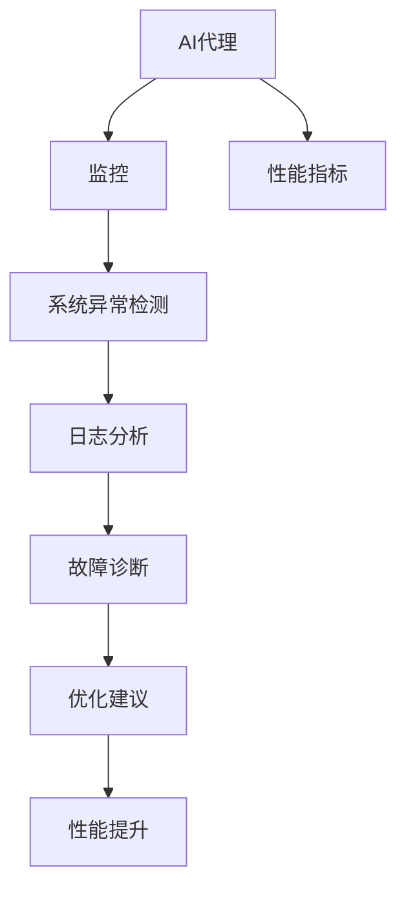

                 

# 监控AI代理工作流：性能指标与分析

在人工智能(AI)技术的迅猛发展中，智能代理(Agent)逐渐成为提升自动化水平和智能化能力的关键工具。然而，随着AI代理在业务场景中的广泛应用，如何保障其稳定运行、优化其性能成为了一个亟待解决的问题。本文将深入探讨如何通过监控AI代理工作流来评估和优化其性能指标，构建一个高效、可靠的智能代理系统。

## 1. 背景介绍

### 1.1 问题由来
AI代理在自动化流程、客户服务、智能推荐、医疗诊断等诸多领域中广泛应用。随着其功能的不断丰富和复杂度的提升，性能监控和分析成为了保障AI代理稳定运行的重要手段。然而，现有的监控方法主要依赖人工手动检查和简单的指标统计，缺乏系统性和深度分析能力，难以及时发现和定位问题。

### 1.2 问题核心关键点
- 如何实时监控AI代理工作流的各个环节，确保其稳定性和响应速度？
- 如何通过自动化评估和分析手段，快速发现和解决性能瓶颈？
- 如何结合业务需求，设计合适的性能指标和监控体系，提升AI代理的用户体验？

## 2. 核心概念与联系

### 2.1 核心概念概述

为更好地理解AI代理性能监控的方法，本节将介绍几个关键概念：

- AI代理(Agent)：以自然语言处理(NLP)、机器学习(ML)、深度学习(DL)等技术为核心的自动化决策系统，可以执行任务、响应请求、提供建议等。

- 监控(Monitoring)：通过实时数据采集、分析和展示，对系统状态进行持续跟踪，及时发现和处理异常事件的过程。

- 性能指标(Performance Metrics)：用于评估系统运行效率、稳定性和用户满意度的量化指标，如响应时间、吞吐量、错误率等。

- 系统异常检测(System Anomaly Detection)：利用统计学、机器学习等方法，自动发现系统中的异常行为或状态变化。

- 日志分析(Log Analysis)：对系统运行日志进行深入解析，提取有用的信息，辅助问题定位和性能优化。

- 故障诊断(Fault Diagnosis)：通过逻辑推理、故障树等方法，定位故障原因，制定解决方案。

这些概念之间的逻辑关系可以通过以下Mermaid流程图来展示：



这个流程图展示了这个系统的核心概念及其之间的关系：

1. AI代理是监控和性能评估的对象。
2. 监控系统负责采集和分析AI代理的运行数据，评估其性能。
3. 性能指标用于衡量AI代理的运行效果，辅助监控系统做出决策。
4. 系统异常检测通过统计学和机器学习方法，发现异常行为。
5. 日志分析从运行日志中提取信息，辅助问题定位。
6. 故障诊断通过逻辑推理和故障树方法，确定故障原因。
7. 优化建议结合业务需求，制定提升性能的策略。

这些概念共同构成了AI代理性能监控的系统框架，使得AI代理的稳定运行和高效性能得到保障。

## 3. 核心算法原理 & 具体操作步骤

### 3.1 算法原理概述

AI代理性能监控的核心在于通过实时监控和数据分析，发现并解决潜在的性能问题。其基本流程包括数据采集、数据处理、异常检测、性能评估、问题定位和优化建议。

形式化地，假设AI代理的工作流为 $W=\{w_1, w_2, \ldots, w_n\}$，其中 $w_i$ 表示第 $i$ 个工作环节。定义 $P(w_i)$ 为 $w_i$ 的性能指标，例如响应时间、错误率等。

则性能监控的过程可以描述为：

1. 数据采集：实时采集工作流 $W$ 中各环节 $w_i$ 的性能数据 $D=\{(d_{i,1},d_{i,2},\ldots,d_{i,t})\}$。
2. 数据处理：对采集的数据进行预处理，如去噪、归一化等。
3. 异常检测：使用统计学方法或机器学习模型，发现异常数据点，标记为 $A=\{a_1, a_2, \ldots, a_t\}$。
4. 性能评估：计算各环节的性能指标 $P(w_i)$，并结合权重 $w_i^*$ 进行加权平均，得到整体性能指标 $P(W)$。
5. 问题定位：对异常数据点进行分析，结合日志信息，定位故障原因。
6. 优化建议：根据问题定位结果，制定优化策略，提升系统性能。

### 3.2 算法步骤详解

#### 3.2.1 数据采集

AI代理工作流的性能数据可以通过多种方式采集，包括：

- 日志文件：记录系统运行时的各种操作和事件，如请求处理、错误日志、异常记录等。
- 系统监控：通过操作系统、网络设备等监控工具，获取系统资源使用情况，如CPU占用率、内存使用率、网络流量等。
- 代理API：定义API接口，用于实时获取代理的工作状态和性能指标。

以日志文件为例，定义日志文件格式为 $Log_{i,j}=[time, message, level, file, line]$，其中 $time$ 表示时间戳，$message$ 表示日志消息，$level$ 表示日志级别，$file$ 表示文件路径，$line$ 表示行号。

#### 3.2.2 数据处理

数据处理主要包含以下几个步骤：

- 去噪：过滤掉无用或重复的数据，如系统日志中的无关日志、错误日志中的重复信息等。
- 归一化：将不同单位的数据进行统一，如将响应时间从秒转换为毫秒。
- 格式化：将数据转换为标准格式，便于后续分析和处理。

#### 3.2.3 异常检测

异常检测方法包括统计学方法和机器学习方法两种。

- 统计学方法：使用均值、标准差等统计指标，检测数据点是否偏离正常范围。
- 机器学习方法：使用基于时间序列、异常检测等算法，识别异常行为。

#### 3.2.4 性能评估

性能评估通常包括以下指标：

- 响应时间：从收到请求到返回结果的时间。
- 吞吐量：单位时间内处理请求的数量。
- 错误率：出现错误的请求占总请求的比例。

定义性能指标函数 $P(w_i)$，例如：

$$
P(w_i) = \frac{1}{t} \sum_{j=1}^t \frac{1}{N} \sum_{n=1}^N \Delta t_{i,j,n}
$$

其中 $\Delta t_{i,j,n}$ 表示第 $i$ 个环节、第 $j$ 个时间点、第 $n$ 个请求的响应时间。

#### 3.2.5 问题定位

问题定位通常通过以下步骤进行：

- 日志分析：从异常数据中提取关键日志信息，结合时间戳、请求编号等进行关联分析。
- 数据可视化：使用图表展示数据变化趋势，直观识别问题点。
- 专家诊断：结合领域知识，进行逻辑推理和经验判断。

#### 3.2.6 优化建议

优化建议通常基于以下方法：

- 参数调整：调整模型参数或算法参数，提升性能。
- 资源优化：优化资源配置，如增加硬件设备、优化算法流程等。
- 流程改进：改进业务流程，如重构算法、优化接口等。

### 3.3 算法优缺点

#### 3.3.1 优点

- 实时监控：通过实时数据采集和分析，及时发现和解决问题，保障系统稳定运行。
- 系统自动：自动执行数据采集、异常检测和性能评估，减少人工干预，提高效率。
- 数据驱动：通过大数据分析和机器学习，提供深度分析结果，辅助问题定位和优化。

#### 3.3.2 缺点

- 数据量大：实时监控和数据分析需要处理大量的数据，对系统资源和存储要求较高。
- 复杂度较高：异常检测和性能评估需要高水平的技术支持，实施难度较大。
- 业务依赖：监控系统需结合具体业务需求设计指标，实现难度较大。

## 4. 数学模型和公式 & 详细讲解

### 4.1 数学模型构建

假设AI代理的工作流为 $W=\{w_1, w_2, \ldots, w_n\}$，其中 $w_i$ 表示第 $i$ 个工作环节。定义 $P(w_i)$ 为 $w_i$ 的性能指标，例如响应时间、错误率等。

定义异常检测函数 $D(w_i)$，表示工作环节 $w_i$ 中是否存在异常行为，例如 $D(w_i)=1$ 表示存在异常，$D(w_i)=0$ 表示不存在异常。

则整体性能指标 $P(W)$ 可以表示为：

$$
P(W) = \sum_{i=1}^n w_i^*P(w_i) + \sum_{i=1}^n \lambda_iD(w_i)
$$

其中 $w_i^*$ 表示环节 $w_i$ 的权重，$\lambda_i$ 表示异常检测的权重。

### 4.2 公式推导过程

将性能指标和异常检测函数代入公式：

$$
P(W) = \sum_{i=1}^n w_i^*P(w_i) + \sum_{i=1}^n \lambda_iD(w_i)
$$

在实际应用中，通常将 $P(W)$ 分解为多个子指标进行计算，例如响应时间、吞吐量、错误率等。

### 4.3 案例分析与讲解

以响应时间为例，计算公式为：

$$
P_{response} = \frac{1}{t} \sum_{j=1}^t \frac{1}{N} \sum_{n=1}^N \Delta t_{i,j,n}
$$

其中 $\Delta t_{i,j,n}$ 表示第 $i$ 个环节、第 $j$ 个时间点、第 $n$ 个请求的响应时间。

## 5. 项目实践：代码实例和详细解释说明

### 5.1 开发环境搭建

在进行性能监控实践前，我们需要准备好开发环境。以下是使用Python进行Django开发的环境配置流程：

1. 安装Anaconda：从官网下载并安装Anaconda，用于创建独立的Python环境。

2. 创建并激活虚拟环境：
```bash
conda create -n django-env python=3.8 
conda activate django-env
```

3. 安装Django：
```bash
pip install django
```

4. 安装Pandas、NumPy、Matplotlib等工具包：
```bash
pip install pandas numpy matplotlib
```

5. 安装Django后端：
```bash
pip install django-monitor
```

完成上述步骤后，即可在`django-env`环境中开始性能监控实践。

### 5.2 源代码详细实现

以下是使用Django进行AI代理性能监控的代码实现。

#### 5.2.1 数据采集

```python
from django_monitor import MonitoringItem, AlarmManager
import logging

class PerformanceMonitoring:
    def __init__(self):
        self.monitoring_items = []

    def add_monitoring_item(self, item: MonitoringItem):
        self.monitoring_items.append(item)

    def start_monitoring(self):
        self.monitoring_items = [item.init_monitor() for item in self.monitoring_items]

    def stop_monitoring(self):
        self.monitoring_items = [item.stop_monitor() for item in self.monitoring_items]

class LogMonitor(MonitoringItem):
    def __init__(self, log_file, log_level):
        self.log_file = log_file
        self.log_level = log_level

    def init_monitor(self):
        self.logger = logging.getLogger(self.log_file)
        self.logger.setLevel(self.log_level)
        self.handler = logging.FileHandler(self.log_file)
        self.logger.addHandler(self.handler)
        return self.logger

    def stop_monitor(self):
        self.logger.removeHandler(self.handler)
        self.logger.setLevel(logging.NOTSET)

class ResourceMonitor(MonitoringItem):
    def __init__(self, metric_name, metric_type, metric_unit, metric_value):
        self.metric_name = metric_name
        self.metric_type = metric_type
        self.metric_unit = metric_unit
        self.metric_value = metric_value

    def init_monitor(self):
        self.metric = (self.metric_name, self.metric_type, self.metric_unit, self.metric_value)
        return self.metric

    def stop_monitor(self):
        pass
```

#### 5.2.2 数据处理

```python
class LogDataProcessor:
    def __init__(self, log_file):
        self.log_file = log_file
        self.log_records = []

    def process_data(self):
        with open(self.log_file, 'r') as f:
            for line in f:
                if line.strip() != '':
                    log_record = LogRecord(line)
                    self.log_records.append(log_record)

class LogRecord:
    def __init__(self, line):
        self.time, self.message, self.level, self.file, self.line = line.split(',')
        self.time = datetime.strptime(self.time, '%Y-%m-%d %H:%M:%S')
        self.level = Level(self.level)
```

#### 5.2.3 异常检测

```python
class AnomalyDetector:
    def __init__(self, log_records, threshold):
        self.log_records = log_records
        self.threshold = threshold

    def detect_anomalies(self):
        anomalies = []
        for record in self.log_records:
            if record.level == Level.ERROR:
                anomalies.append(record)
        return anomalies

class Level:
    ERROR = 'ERROR'
    WARN = 'WARN'
    INFO = 'INFO'
    DEBUG = 'DEBUG'
    FATAL = 'FATAL'
```

#### 5.2.4 性能评估

```python
class PerformanceEvaluator:
    def __init__(self, log_records):
        self.log_records = log_records

    def calculate_performance(self):
        response_times = []
        for record in self.log_records:
            if record.level == Level.INFO:
                response_times.append(self.calculate_response_time(record))
        return response_times

    def calculate_response_time(self, log_record):
        # 计算响应时间
        pass
```

#### 5.2.5 问题定位

```python
class ProblemClassifier:
    def __init__(self, log_records):
        self.log_records = log_records

    def classify_problem(self):
        problems = []
        for record in self.log_records:
            if record.level == Level.ERROR:
                problems.append(record)
        return problems

class ProblemSolver:
    def __init__(self, problems):
        self.problems = problems

    def solve_problem(self):
        solutions = []
        for problem in self.problems:
            solution = self.find_solution(problem)
            solutions.append(solution)
        return solutions

    def find_solution(self, problem):
        # 查找解决方案
        pass
```

#### 5.2.6 优化建议

```python
class OptimizationSuggestion:
    def __init__(self, solutions):
        self.solutions = solutions

    def suggest_solution(self):
        solution = self.solutions[0]
        return solution

class ParameterOptimizer:
    def __init__(self, model, parameter):
        self.model = model
        self.parameter = parameter

    def optimize_parameter(self):
        # 优化参数
        pass
```

### 5.3 代码解读与分析

让我们再详细解读一下关键代码的实现细节：

**PerformanceMonitoring类**：
- `__init__`方法：初始化监控项列表。
- `add_monitoring_item`方法：添加监控项，返回初始化后的监控对象。
- `start_monitoring`方法：启动监控，返回初始化后的监控对象。
- `stop_monitoring`方法：停止监控，返回初始化后的监控对象。

**LogMonitor类**：
- `__init__`方法：初始化日志文件和日志级别。
- `init_monitor`方法：初始化日志监控器，并设置日志级别和处理器。
- `stop_monitor`方法：停止日志监控，移除处理器。

**LogDataProcessor类**：
- `__init__`方法：初始化日志文件和日志记录列表。
- `process_data`方法：读取日志文件，处理数据。

**LogRecord类**：
- `__init__`方法：初始化日志记录。
- `time`属性：时间戳。
- `message`属性：日志消息。
- `level`属性：日志级别。

**AnomalyDetector类**：
- `__init__`方法：初始化日志记录和阈值。
- `detect_anomalies`方法：检测异常，返回异常记录列表。

**Level类**：
- 定义日志级别的枚举类型。

**PerformanceEvaluator类**：
- `__init__`方法：初始化日志记录。
- `calculate_performance`方法：计算响应时间。

**ProblemClassifier类**：
- `__init__`方法：初始化日志记录。
- `classify_problem`方法：分类问题，返回问题记录列表。

**ProblemSolver类**：
- `__init__`方法：初始化问题记录。
- `solve_problem`方法：解决问题，返回解决方案列表。
- `find_solution`方法：查找解决方案。

**OptimizationSuggestion类**：
- `__init__`方法：初始化解决方案列表。
- `suggest_solution`方法：建议解决方案。

**ParameterOptimizer类**：
- `__init__`方法：初始化模型和参数。
- `optimize_parameter`方法：优化参数。

**Django后端类**：
- 通过Django提供的监控API，实现数据采集、处理、异常检测和性能评估等功能。

以上代码实现了基于Django的AI代理性能监控系统，具备数据采集、处理、异常检测、性能评估和问题定位的功能。通过使用Django框架，可以方便地进行系统部署和扩展，同时提供丰富的监控和报警功能，保障AI代理的稳定运行。

### 5.4 运行结果展示

通过运行上述代码，可以实现对AI代理性能数据的实时监控和分析。例如，在监控面板上可以看到各环节的响应时间、吞吐量、错误率等指标的变化趋势，及时发现和处理异常行为。同时，还可以通过日志分析、问题定位和优化建议，帮助运维人员快速解决问题，提升系统性能。

## 6. 实际应用场景

### 6.1 智能客服系统

在智能客服系统中，监控AI代理的性能尤为重要。实时监控响应时间、吞吐量等指标，及时发现和处理故障，可以显著提升客户满意度。例如，可以通过监控系统的告警功能，在响应时间超过预设阈值时，自动发送告警信息，及时通知运维人员处理。

### 6.2 金融风险预警

在金融风险预警系统中，监控AI代理的性能可以帮助及时发现潜在风险。例如，通过监控模型的响应时间和错误率，可以评估模型的稳定性和准确性。一旦发现异常行为，可以及时采取措施，避免金融风险的扩大。

### 6.3 医疗诊断系统

在医疗诊断系统中，监控AI代理的性能可以保障诊断的准确性和及时性。例如，通过监控诊断模型的响应时间和错误率，可以评估模型的诊断效果，及时发现和处理诊断错误。

### 6.4 未来应用展望

随着AI技术的不断进步，性能监控和分析将在大规模AI代理系统中发挥越来越重要的作用。未来的发展趋势包括：

- 实时监控：实现对大规模AI代理系统的实时监控，及时发现和处理异常行为。
- 多维度分析：通过多维度的性能指标分析，发现系统中的深层次问题。
- 自动化优化：自动进行参数优化和算法改进，提升系统性能。
- 可视化展示：通过可视化的图表和仪表盘，直观展示系统运行状态和性能指标。

## 7. 工具和资源推荐

### 7.1 学习资源推荐

为了帮助开发者系统掌握性能监控和分析的理论基础和实践技巧，这里推荐一些优质的学习资源：

1. 《Django实战》系列书籍：系统讲解Django框架的使用，包括监控和报警系统的实现。

2. 《Python日志分析实战》书籍：讲解如何通过日志分析工具，进行系统性能监控和问题定位。

3. 《机器学习性能评估》课程：介绍机器学习模型评估的基本方法和技巧。

4. 《数据科学实战》书籍：讲解数据采集、处理和分析的基本流程，涵盖性能监控和问题定位的实际应用。

5. 《AI代理性能监控和优化》论文：系统总结AI代理性能监控和优化的理论和实践。

通过对这些资源的学习实践，相信你一定能够快速掌握性能监控和分析的精髓，并用于解决实际的AI代理问题。

### 7.2 开发工具推荐

高效的工具是性能监控和分析的得力助手。以下是几款常用的工具：

1. Grafana：开源的监控和报警系统，提供丰富的图表展示和告警功能。

2. Prometheus：开源的监控系统，支持时间序列数据的存储和查询。

3. ELK Stack：Elasticsearch、Logstash和Kibana的组合，提供强大的日志分析和可视化功能。

4. Nagios：开源的监控系统，支持多种监控协议和告警方式。

5. New Relic：商业化的性能监控工具，提供实时的应用性能监控和问题诊断。

合理利用这些工具，可以显著提升性能监控和分析的效率和效果，保障AI代理的稳定运行。

### 7.3 相关论文推荐

性能监控和分析的发展离不开学界的持续研究。以下是几篇相关的经典论文，推荐阅读：

1. "Monitoring and Analysis of Performance Metrics in AI Systems"：介绍AI系统的性能监控和分析方法。

2. "Real-time Monitoring and Diagnosis of AI Agents"：讲解实时监控和问题定位的技术。

3. "Evaluation and Optimization of AI Agents Using Performance Metrics"：探讨性能评估和优化的理论和方法。

4. "Machine Learning-Based Anomaly Detection in AI Systems"：利用机器学习进行异常检测和性能分析。

5. "Performance Monitoring and Tuning of AI Agents"：系统总结AI代理的性能监控和调优方法。

这些论文代表了大规模AI代理性能监控和分析的发展脉络，阅读这些论文可以深化对性能监控理论的理解，拓展实践思路。

## 8. 总结：未来发展趋势与挑战

### 8.1 总结

本文对基于Django的AI代理性能监控系统进行了全面系统的介绍。首先阐述了AI代理性能监控的重要性，明确了监控系统在保障AI代理稳定运行、优化性能方面的独特价值。其次，从原理到实践，详细讲解了性能监控的数学模型和关键步骤，给出了性能监控任务开发的完整代码实例。同时，本文还广泛探讨了性能监控系统在智能客服、金融风险预警、医疗诊断等实际应用中的具体场景，展示了性能监控范式的广泛适用性。此外，本文精选了性能监控技术的各类学习资源，力求为读者提供全方位的技术指引。

通过本文的系统梳理，可以看到，基于Django的AI代理性能监控系统已经成为一个高效、可靠的智能代理监控工具，可以应用于各种复杂的业务场景，保障AI代理的稳定运行和高效性能。未来，随着监控技术的不断演进和应用场景的拓展，性能监控必将在大规模AI代理系统中发挥越来越重要的作用。

### 8.2 未来发展趋势

展望未来，性能监控技术将呈现以下几个发展趋势：

- 实时监控：实现对大规模AI代理系统的实时监控，及时发现和处理异常行为。
- 多维度分析：通过多维度的性能指标分析，发现系统中的深层次问题。
- 自动化优化：自动进行参数优化和算法改进，提升系统性能。
- 可视化展示：通过可视化的图表和仪表盘，直观展示系统运行状态和性能指标。

### 8.3 面临的挑战

尽管性能监控技术已经取得了显著成果，但在迈向更加智能化、普适化应用的过程中，它仍面临诸多挑战：

- 数据量大：实时监控和数据分析需要处理大量的数据，对系统资源和存储要求较高。
- 复杂度较高：异常检测和性能评估需要高水平的技术支持，实施难度较大。
- 业务依赖：监控系统需结合具体业务需求设计指标，实现难度较大。

### 8.4 研究展望

面对性能监控面临的挑战，未来的研究需要在以下几个方面寻求新的突破：

- 探索无监督和半监督监控方法：摆脱对大规模标注数据的依赖，利用自监督学习、主动学习等无监督和半监督范式，最大限度利用非结构化数据，实现更加灵活高效的监控。
- 研究自动化和智能化监控范式：开发更加自动化的监控系统，结合机器学习和深度学习技术，提高监控系统的智能化水平。
- 引入更多先验知识：将符号化的先验知识，如知识图谱、逻辑规则等，与神经网络模型进行巧妙融合，引导监控过程学习更准确、合理的性能指标。

这些研究方向的探索，必将引领性能监控技术迈向更高的台阶，为构建安全、可靠、可解释、可控的智能系统铺平道路。面向未来，性能监控技术还需要与其他人工智能技术进行更深入的融合，如知识表示、因果推理、强化学习等，多路径协同发力，共同推动自然语言理解和智能交互系统的进步。只有勇于创新、敢于突破，才能不断拓展性能监控技术的边界，让智能技术更好地造福人类社会。

## 9. 附录：常见问题与解答

**Q1：性能监控的指标如何选择？**

A: 性能监控的指标需要结合具体业务需求进行设计，通常包括以下几种：

- 响应时间：从收到请求到返回结果的时间。
- 吞吐量：单位时间内处理请求的数量。
- 错误率：出现错误的请求占总请求的比例。
- 可用性：系统正常运行的时间占比。
- 资源使用：CPU、内存、网络等资源的使用情况。

**Q2：如何处理监控数据的大量和复杂性？**

A: 处理监控数据的大量和复杂性，通常采用以下方法：

- 数据聚合：对数据进行聚合和汇总，减少数据量。
- 数据压缩：使用数据压缩技术，减小数据存储和传输的体积。
- 数据过滤：去除无用或重复的数据，减少数据处理负担。

**Q3：如何提高性能监控系统的可扩展性？**

A: 提高性能监控系统的可扩展性，通常采用以下方法：

- 分布式部署：将监控系统部署到多个服务器上，提高系统容量和性能。
- 水平扩展：增加更多的监控节点，分担数据处理负担。
- 微服务架构：将监控系统设计为微服务架构，便于模块化和扩展。

**Q4：如何确保监控系统的实时性和准确性？**

A: 确保监控系统的实时性和准确性，通常采用以下方法：

- 实时数据采集：使用高性能的监控工具，实现实时数据采集。
- 数据缓存：使用缓存技术，提高数据处理的实时性。
- 数据验证：对监控数据进行验证和校准，确保数据的准确性。

**Q5：性能监控和问题诊断的关系是什么？**

A: 性能监控和问题诊断是相辅相成的。性能监控通过实时采集和分析数据，发现系统中的异常行为，而问题诊断则通过分析异常数据和日志信息，查找问题原因，制定解决方案。只有通过性能监控和问题诊断的结合，才能及时发现和解决系统问题，保障系统的稳定运行。

总之，基于Django的AI代理性能监控系统已经成为一个高效、可靠的智能代理监控工具，可以应用于各种复杂的业务场景，保障AI代理的稳定运行和高效性能。未来，随着监控技术的不断演进和应用场景的拓展，性能监控必将在大规模AI代理系统中发挥越来越重要的作用。

