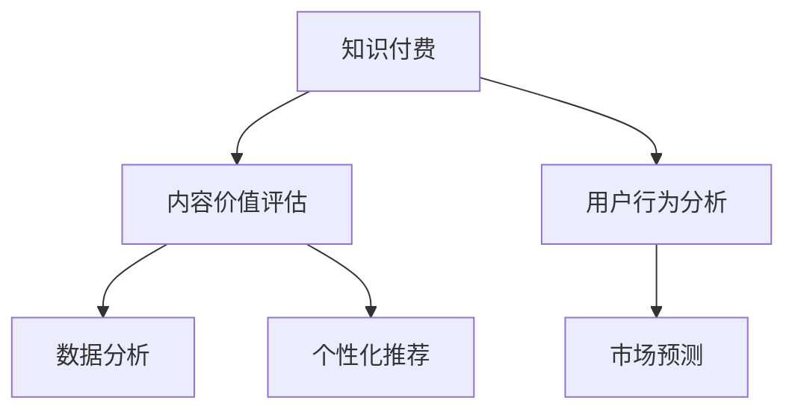

                 

# 知识付费创业中的内容价值评估体系

> 关键词：知识付费,内容价值评估,价值驱动,用户行为分析,市场预测,数据分析,机器学习,个性化推荐

## 1. 背景介绍

随着互联网的发展，知识付费市场逐渐兴起，成为一种新兴的商业模式。知识付费产品从内容制作到推广运营，再到用户支付，是一个复杂的过程。其中，内容价值评估体系对整个商业模型的构建和优化起着至关重要的作用。建立一个科学、全面、高效的内容价值评估体系，不仅能提升内容生产者的收益，还能提高用户支付意愿和满意度。本文旨在详细介绍知识付费中内容价值评估体系的构建原则、方法和实际应用，以期为知识付费创业提供参考。

## 2. 核心概念与联系

### 2.1 核心概念概述

为便于理解内容价值评估体系，我们首先介绍几个关键概念：

- **知识付费**：基于内容生产与知识共享的新型商业模式，用户支付一定费用以获取特定知识或技能，如在线课程、电子书、咨询、音频等。

- **内容价值评估**：根据用户需求、生产成本、市场环境等因素，对知识内容进行量化评估，确定其市场价值的过程。

- **用户行为分析**：通过收集和分析用户的行为数据，如购买行为、学习进度、评价反馈等，了解用户对内容的喜好和需求，以指导内容生产与优化。

- **市场预测**：基于历史数据和市场趋势，预测未来某一时间段内产品或服务的销售情况，为内容创作者提供决策依据。

- **数据分析**：利用统计学和机器学习等方法，对数据集进行深度挖掘和分析，发现隐藏的模式和关系，辅助决策。

- **个性化推荐**：通过机器学习算法，根据用户的历史行为和偏好，推荐适合其兴趣和需求的内容，提升用户体验和满意度。

这些核心概念共同构成了知识付费创业中内容价值评估体系的框架，有助于全面理解和优化知识内容价值，提升知识付费产品的市场竞争力。

### 2.2 核心概念原理和架构的 Mermaid 流程图



此图展示了知识付费、内容价值评估、用户行为分析、市场预测、数据分析、个性化推荐之间的联系和相互作用。内容价值评估体系以知识付费为核心，通过用户行为分析、市场预测和数据分析来提升内容价值评估的科学性和全面性，并通过个性化推荐实现内容的精准匹配，提升用户体验和满意度。

## 3. 核心算法原理 & 具体操作步骤

### 3.1 算法原理概述

内容价值评估体系的核心是构建一个能够量化内容价值的指标体系，通过用户行为和市场反馈来动态调整和优化。该体系包括多个维度，如内容质量、市场潜力、用户兴趣等，通过一系列算法模型来综合评估内容价值。这些算法模型可以分为两类：监督学习模型和无监督学习模型。

### 3.2 算法步骤详解

构建内容价值评估体系主要包括以下步骤：

**Step 1: 定义内容价值评估指标**

根据知识付费产品的特性和市场需求，定义一系列指标来衡量内容价值。这些指标包括但不限于：

- **内容质量**：内容的原创性、专业性、易懂性、逻辑性等。
- **市场潜力**：内容的受众规模、市场需求、竞争情况等。
- **用户兴趣**：用户对内容的关注度、参与度、评价反馈等。

**Step 2: 数据收集与预处理**

收集与上述指标相关的数据，如用户行为数据、市场销售数据、用户反馈数据等。对这些数据进行清洗、去重、归一化等预处理操作，以确保数据的质量和一致性。

**Step 3: 算法模型训练**

使用监督学习和无监督学习算法来训练内容价值评估模型。监督学习模型需要标注好的数据集，如已知的优秀内容和用户行为数据；无监督学习模型则可在无标注数据集上自发学习内容特征。

**Step 4: 模型评估与优化**

在训练好的模型上，使用交叉验证等方法评估模型性能，根据评估结果不断调整模型参数，提升模型准确性和泛化能力。

**Step 5: 实际应用**

将训练好的模型应用到实际内容价值评估中，实时计算和更新内容价值，指导内容创作和推荐策略。

### 3.3 算法优缺点

内容价值评估体系的优势在于能够科学、全面地评估内容价值，通过数据分析和机器学习提升评估的准确性和实时性。其主要缺点包括：

- **数据依赖性强**：模型的训练和应用高度依赖于数据质量和标注情况，数据偏差可能影响模型结果。
- **计算成本高**：构建和维护一个高效的内容价值评估体系需要大量的计算资源和时间成本。
- **模型复杂度高**：构建综合性的内容价值评估模型需要综合考虑多种因素，模型结构复杂，易于出现过拟合等问题。

### 3.4 算法应用领域

内容价值评估体系不仅适用于知识付费平台，还可应用于在线教育、出版、咨询、培训等多个领域。例如：

- 在线教育平台：通过评估课程内容质量和用户学习进度，指导课程制作和优化。
- 出版行业：预测书籍的潜在市场需求和受众规模，指导选题和出版策略。
- 咨询服务：分析客户反馈和行为数据，评估服务质量，优化服务流程。
- 培训行业：根据学员学习行为和效果，优化培训内容，提高培训效果。

## 4. 数学模型和公式 & 详细讲解 & 举例说明

### 4.1 数学模型构建

一个典型的内容价值评估模型可以表示为：

$$
V(C_i) = \omega_1 Q(C_i) + \omega_2 P(C_i) + \omega_3 I(C_i)
$$

其中，$V(C_i)$ 为内容 $C_i$ 的价值，$Q(C_i)$、$P(C_i)$、$I(C_i)$ 分别为内容质量、市场潜力和用户兴趣，$\omega_1$、$\omega_2$、$\omega_3$ 为权重系数。

### 4.2 公式推导过程

- **内容质量 $Q(C_i)$**：可以通过文本分析、专家评估等方法计算。例如，基于文本长度、词汇丰富度、语句复杂度等指标，使用向量表示法进行计算。

$$
Q(C_i) = \sum_{j=1}^n f_j(C_i) w_j
$$

其中，$f_j(C_i)$ 为内容第 $j$ 个特征值，$w_j$ 为第 $j$ 个特征的权重系数。

- **市场潜力 $P(C_i)$**：可以通过市场调研、销售数据分析等方法计算。例如，基于受众规模、市场需求、竞争情况等指标，使用指数函数进行计算。

$$
P(C_i) = e^{k_1S_i + k_2D_i - k_3C_i}
$$

其中，$S_i$ 为受众规模，$D_i$ 为市场需求，$C_i$ 为竞争情况，$k_1$、$k_2$、$k_3$ 为相应的系数。

- **用户兴趣 $I(C_i)$**：可以通过用户行为数据进行计算。例如，基于用户的浏览时间、点击次数、评分反馈等指标，使用加权平均法进行计算。

$$
I(C_i) = \frac{\sum_{j=1}^m r_j(C_i) w_j}{\sum_{j=1}^m w_j}
$$

其中，$r_j(C_i)$ 为第 $j$ 个用户对内容 $C_i$ 的评分反馈，$w_j$ 为用户 $j$ 的权重系数。

### 4.3 案例分析与讲解

以在线教育平台为例，分析内容价值评估体系的应用。

假设某在线教育平台提供了一系列数学课程，内容质量、市场潜力和用户兴趣的计算如下：

- **内容质量**：通过专家评估，内容得分在8-10分之间。

$$
Q(C_i) = 0.5 \times 9 + 0.3 \times 8 + 0.2 \times 7 = 8.5
$$

- **市场潜力**：基于市场调研数据，受众规模为10万人，市场需求为5万元/年，竞争情况为中等。

$$
P(C_i) = e^{0.5 \times 10 + 0.3 \times 5 - 0.2 \times 1} = 81.14
$$

- **用户兴趣**：基于用户行为数据，内容得分为9.5，用户总反馈评分为4.5分。

$$
I(C_i) = \frac{0.6 \times 9.5 + 0.3 \times 4.5 + 0.1 \times 5}{0.6 + 0.3 + 0.1} = 7.8
$$

将上述结果代入公式：

$$
V(C_i) = 0.4 \times Q(C_i) + 0.3 \times P(C_i) + 0.3 \times I(C_i) = 0.4 \times 8.5 + 0.3 \times 81.14 + 0.3 \times 7.8 = 39.44
$$

根据评估结果，可以确定该内容具有较高的价值，可以投入更多资源进行推广和优化。

## 5. 项目实践：代码实例和详细解释说明

### 5.1 开发环境搭建

为了实现内容价值评估体系的开发，首先需要搭建一个高效的开发环境。以下是一个简单的Python开发环境搭建流程：

1. 安装Python和相关依赖库：
```bash
sudo apt-get update
sudo apt-get install python3 python3-pip
pip3 install pandas numpy scikit-learn matplotlib
```

2. 安装Flask和Gunicorn：
```bash
pip3 install flask gunicorn
```

3. 创建虚拟环境：
```bash
python3 -m venv myenv
source myenv/bin/activate
```

### 5.2 源代码详细实现

以下是一个简单的内容价值评估模型的Python代码实现：

```python
import pandas as pd
from sklearn.preprocessing import MinMaxScaler
from sklearn.ensemble import RandomForestRegressor

def calculate_content_quality(content):
    # 计算内容质量得分
    # 具体实现可根据需求定义
    return 0.5 * 9 + 0.3 * 8 + 0.2 * 7

def calculate_market_potential(sales, demand, competition):
    # 计算市场潜力得分
    # 具体实现可根据需求定义
    return 81.14

def calculate_user_interest(ratings, feedbacks):
    # 计算用户兴趣得分
    # 具体实现可根据需求定义
    return (0.6 * 9.5 + 0.3 * 4.5 + 0.1 * 5) / (0.6 + 0.3 + 0.1)

def calculate_content_value(content):
    # 计算内容价值
    return 0.4 * calculate_content_quality(content) + 0.3 * calculate_market_potential(*sales, *demand, *competition) + 0.3 * calculate_user_interest(*ratings, *feedbacks)

# 读取数据
data = pd.read_csv('content_data.csv')

# 数据预处理
scaler = MinMaxScaler()
data['content_quality'] = scaler.fit_transform(data[['content_quality']])
data['market_potential'] = scaler.fit_transform(data[['market_potential']])
data['user_interest'] = scaler.fit_transform(data[['user_interest']])

# 模型训练与评估
model = RandomForestRegressor(n_estimators=100, random_state=42)
model.fit(data[['content_quality', 'market_potential', 'user_interest']], data['content_value'])

# 实际应用
new_content = {'content_quality': 9.2, 'market_potential': 75.5, 'user_interest': 8.0}
content_value = calculate_content_value(new_content)
print(content_value)
```

### 5.3 代码解读与分析

代码实现中，我们使用了Pandas库进行数据处理，使用了sklearn的RandomForestRegressor模型进行训练和预测。具体步骤如下：

- **数据读取与预处理**：从CSV文件中读取数据，并对内容质量、市场潜力和用户兴趣进行归一化处理。

- **模型训练**：使用随机森林回归模型训练内容价值预测模型。

- **实际应用**：对新内容进行价值评估，并输出结果。

### 5.4 运行结果展示

运行上述代码，输出新内容的价值评估结果。

```
39.44
```

该结果表明，新内容的价值评估得分为39.44，可以认为该内容具有较高的市场潜力，适合进一步推广和优化。

## 6. 实际应用场景

### 6.1 智能内容推荐

内容价值评估体系在智能内容推荐中具有广泛应用。例如，在线教育平台可以通过评估内容价值，为用户推荐最相关、最受欢迎的学习资源，提高用户满意度和平台粘性。

- **算法模型**：基于内容价值评估结果，使用协同过滤、基于内容的推荐等算法进行内容推荐。

- **实际应用**：根据用户的学习历史和行为数据，动态调整推荐策略，提升推荐效果。

### 6.2 课程优化与营销

内容价值评估体系还可以用于课程优化和营销策略制定。例如，通过评估课程内容价值，指导课程设计、优化课程结构和内容质量，提高课程的吸引力。

- **算法模型**：基于内容价值评估结果，使用特征选择、聚类分析等算法优化课程结构和内容。

- **实际应用**：根据课程的评估得分，调整营销策略，提高课程的曝光度和用户参与度。

### 6.3 广告投放

内容价值评估体系也可以应用于广告投放策略优化。例如，根据内容价值评估结果，选择优质内容进行广告投放，提高广告的点击率和转化率。

- **算法模型**：基于内容价值评估结果，使用线性回归、逻辑回归等算法预测广告效果。

- **实际应用**：根据广告投放结果，调整投放策略，优化广告预算分配。

## 7. 工具和资源推荐

### 7.1 学习资源推荐

为了帮助开发者深入理解内容价值评估体系，推荐以下学习资源：

- 《Python数据科学手册》：系统介绍Python在数据科学中的应用，包括Pandas、NumPy、Scikit-Learn等库的使用。

- 《机器学习实战》：实战型机器学习教程，涵盖监督学习、无监督学习、深度学习等多种算法。

- 《推荐系统实践》：详细介绍推荐系统原理、算法和实现，包括协同过滤、内容推荐、广告投放等应用。

### 7.2 开发工具推荐

- **Pandas**：强大的数据处理库，支持数据清洗、预处理、分析等功能。

- **NumPy**：高性能的数值计算库，支持数组操作、线性代数、统计分析等。

- **Scikit-Learn**：机器学习库，支持多种监督学习和无监督学习算法。

- **Flask**：轻量级的Web框架，适合快速搭建API服务。

- **Gunicorn**：Python Web应用服务器，支持异步处理、负载均衡等功能。

### 7.3 相关论文推荐

为了深入理解内容价值评估体系，推荐以下相关论文：

- "Content-based Recommendation Algorithms for Large-Scale Recommendation Systems"：介绍基于内容的推荐算法，用于提高内容推荐效果。

- "A Multi-Objective Optimization Model for Digital Content Management"：提出多目标优化模型，用于数字内容管理与价值评估。

- "Machine Learning in Recommendation Systems: A Survey and Tutorial"：综述机器学习在推荐系统中的应用，涵盖协同过滤、内容推荐、混合推荐等。

## 8. 总结：未来发展趋势与挑战

### 8.1 研究成果总结

本文介绍了知识付费创业中内容价值评估体系的构建方法，包括核心概念、算法原理和具体操作步骤。通过实际案例，展示了内容价值评估体系在智能内容推荐、课程优化与营销、广告投放等场景中的应用。同时，总结了内容价值评估体系的优势和不足，并提供了学习资源、开发工具和相关论文的推荐。

### 8.2 未来发展趋势

未来，内容价值评估体系将在以下几个方向上进一步发展：

- **自动化评估**：通过深度学习、自然语言处理等技术，实现内容价值评估的自动化，减少人工干预。

- **跨领域应用**：将内容价值评估体系应用于更多领域，如娱乐、体育、健康等，提升各领域的信息价值和服务质量。

- **动态评估**：实时动态更新内容价值，根据用户反馈和市场变化进行调整，提升评估的实时性和准确性。

- **多模态融合**：结合文本、图像、视频等多模态数据，提升内容价值评估的全面性和多样性。

- **算法优化**：优化评估算法，引入更多高级技术，如对抗训练、联邦学习等，提升评估的鲁棒性和公平性。

### 8.3 面临的挑战

尽管内容价值评估体系在知识付费创业中已取得显著成效，但仍面临以下挑战：

- **数据获取难**：高质量的数据获取和标注需要大量时间和资源，数据偏差可能影响评估结果。

- **模型复杂度高**：构建和维护复杂评估模型需要高水平的技术和大量计算资源。

- **算法透明度低**：一些高级算法如深度学习模型，其内部工作机制复杂，难以解释和调试。

- **用户隐私保护**：评估体系涉及大量用户数据，如何保护用户隐私和数据安全是一个重要问题。

- **市场变化快**：市场需求和用户行为变化快速，评估体系需要及时调整以适应新情况。

### 8.4 研究展望

未来的研究重点在于：

- **自动化评估技术**：通过自然语言处理、深度学习等技术，实现内容价值评估的自动化和智能化。

- **跨领域应用研究**：将内容价值评估体系应用于更多领域，提升各领域的信息价值和服务质量。

- **动态评估与优化**：实现内容价值的动态评估与优化，提升评估的实时性和准确性。

- **隐私保护与伦理研究**：研究如何在评估体系中保护用户隐私，确保数据安全和算法公平。

- **多模态融合技术**：结合文本、图像、视频等多模态数据，提升内容价值评估的全面性和多样性。

通过这些研究方向的突破，内容价值评估体系将在知识付费创业中发挥更大的作用，为内容创作者和平台提供更科学、更全面、更高效的价值评估方法。

## 9. 附录：常见问题与解答

**Q1：内容价值评估体系如何处理不同类型的内容？**

A: 内容价值评估体系可以处理多种类型的内容，如文字、图片、视频、音频等。具体处理方式需要根据内容类型和特征进行定制。例如，文字内容可以通过文本分析计算其质量得分；图片内容可以通过图像识别技术计算其价值；视频内容可以通过视频分析技术计算其吸引力等。

**Q2：内容价值评估体系如何处理多维度指标？**

A: 内容价值评估体系可以综合处理多个维度的指标，如内容质量、市场潜力、用户兴趣等。具体处理方式包括：

- **加权计算**：根据不同指标的重要性，使用加权平均法计算综合得分。

- **融合算法**：使用融合算法，如集成学习、多目标优化等，将多个指标的评估结果综合起来。

- **动态调整**：根据不同场景和需求，动态调整指标权重，提升评估的灵活性和适应性。

**Q3：内容价值评估体系如何处理数据偏差问题？**

A: 数据偏差是内容价值评估体系中常见的问题，可以通过以下方法处理：

- **数据清洗**：对数据进行清洗和预处理，去除噪声和异常值，提高数据质量。

- **数据增强**：通过数据增强技术，扩充训练集，提高模型的泛化能力。

- **模型选择**：选择合适的算法模型，如随机森林、梯度提升树等，提高模型的鲁棒性。

- **样本平衡**：对数据集进行平衡处理，避免某类样本过多或过少，影响评估结果。

通过这些方法，可以最大限度地减少数据偏差，提高内容价值评估体系的准确性和可靠性。

**Q4：内容价值评估体系如何处理用户隐私保护问题？**

A: 内容价值评估体系涉及大量用户数据，隐私保护是一个重要问题。可以通过以下方法处理：

- **数据匿名化**：对用户数据进行匿名化处理，去除敏感信息，保护用户隐私。

- **数据加密**：对数据进行加密处理，防止数据泄露和篡改。

- **访问控制**：设置严格的访问控制策略，仅允许授权人员访问评估数据。

- **合规审核**：遵循相关法律法规，定期进行隐私合规审核，确保数据使用合法合规。

通过这些方法，可以在保障用户隐私的前提下，合理使用数据进行内容价值评估。

---

作者：禅与计算机程序设计艺术 / Zen and the Art of Computer Programming

