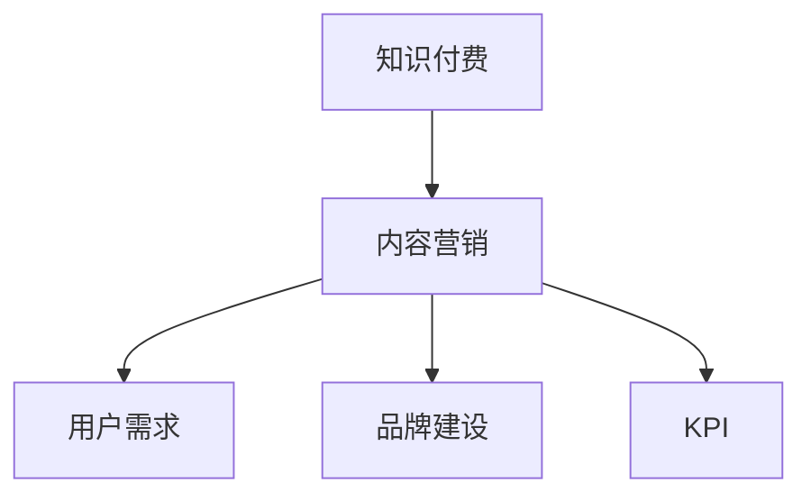

                 

# 知识付费创业中的内容营销策略

## 1. 背景介绍

随着互联网技术的发展和知识经济的崛起，知识付费作为一种新兴的商业模式，正迅速崛起并成为互联网行业的新风口。知识付费平台的兴起，使得大量高质量内容得以付费产出，同时也带来了激烈的市场竞争和内容营销的挑战。如何在知识付费创业中，构建一套高效、精准、可持续的内容营销策略，成为许多平台和内容创作者亟需解决的问题。

### 1.1 知识付费市场现状

知识付费市场自2016年兴起以来，发展迅猛。统计数据显示，知识付费市场规模自2018年起每年以超过100%的速度增长，到2021年，市场规模已达278亿元，预计2023年将突破500亿元。但与此同时，市场竞争也日益激烈，内容同质化现象严重，用户获取信息的能力也逐渐增强，营销难度加大。

### 1.2 内容营销的重要性

内容营销是知识付费平台的核心竞争优势。通过内容营销，平台不仅能吸引和留住用户，还能提升品牌知名度，拓展用户范围，增加收入来源。高质量、有价值的内容，是平台吸引用户的关键因素。因此，如何在知识付费创业中，构建一套高效的内容营销策略，具有重要的现实意义。

## 2. 核心概念与联系

### 2.1 核心概念概述

为更好地理解知识付费创业中的内容营销策略，本节将介绍几个密切相关的核心概念：

- 知识付费：通过付费方式，获取具有专业价值、知识密度高的内容服务。
- 内容营销：通过制作和分发有价值、相关且一致的内容，以吸引和留住明确定义的受众，并最终驱动盈利的一种营销方式。
- 用户需求：知识付费平台的内容应围绕用户的知识需求进行设计，以提升用户的获得感和满意度。
- 品牌建设：通过高质量、有影响力的内容输出，树立平台的品牌形象和专业权威。
- KPI（关键绩效指标）：如用户增长、付费转化率、用户活跃度等，是评估内容营销效果的有效指标。

这些核心概念之间的逻辑关系可以通过以下Mermaid流程图来展示：



这个流程图展示了这个系统的主要流程：

1. 平台基于用户需求制作内容，满足用户的学习和知识需求。
2. 内容输出在提升品牌形象的同时，也建立了平台的权威性和专业性。
3. KPI指标用于评估内容营销的效果，不断优化和调整策略。

## 3. 核心算法原理 & 具体操作步骤
### 3.1 算法原理概述

知识付费平台的内容营销策略，核心在于通过数据分析和机器学习算法，实现内容精准推荐和个性化定制，从而提升用户粘性和付费转化率。其基本流程包括：

1. 用户行为数据收集：通过分析用户浏览、购买、评论等行为，了解用户的兴趣偏好和需求。
2. 内容推荐算法设计：利用协同过滤、深度学习等算法，为用户推荐相关内容。
3. 内容多样化：根据用户反馈和行为数据，不断优化内容推荐策略，推出多样化的内容形式，如课程、文章、视频等。
4. 用户激励机制：设计合理的激励机制，如积分、优惠券、免费试听等，提升用户转化率。
5. 持续优化：通过A/B测试、用户反馈等手段，不断优化内容营销策略，实现效果最大化。

### 3.2 算法步骤详解

以下是知识付费平台内容营销策略的具体操作步骤：

**Step 1: 用户行为数据分析**

- 收集用户行为数据：通过用户的浏览记录、搜索记录、购买记录、评价记录等，获取用户的基本兴趣偏好。
- 数据清洗与预处理：去除噪音数据和异常值，处理缺失数据，确保数据的完整性和准确性。
- 特征提取：提取有意义的特征，如用户历史浏览行为、兴趣类别、地域信息等。

**Step 2: 内容推荐算法构建**

- 协同过滤算法：基于用户历史行为数据，推荐相似用户喜欢的内容。
- 深度学习算法：使用Transformer、RNN等神经网络模型，挖掘用户对内容的潜在需求，提升推荐精准度。
- 算法融合与优化：结合协同过滤和深度学习算法，融合不同算法的优点，实现更高效的内容推荐。

**Step 3: 内容多样化设计**

- 推出多样化内容形式：除了传统的文字课程，还可以推出音频、视频、互动直播等多种内容形式，满足不同用户需求。
- 定期推出新品：根据用户反馈和数据分析，定期推出新品内容，吸引用户持续关注。
- 定制化内容开发：根据用户需求，推出定制化课程和内容，提升用户满意度和忠诚度。

**Step 4: 用户激励机制设计**

- 积分系统设计：通过积分奖励用户行为，提升用户活跃度。
- 优惠券和折扣：定期推出优惠券和折扣活动，提升用户购买意愿。
- 免费试听：提供免费试听课程，降低用户试用门槛，吸引更多用户付费。

**Step 5: 持续优化与迭代**

- A/B测试：通过对比不同策略的效果，选择最优方案。
- 用户反馈收集：通过问卷调查、评论分析等方式，收集用户反馈，了解用户需求和满意度。
- 数据驱动调整：根据数据分析结果，持续调整内容推荐策略，实现动态优化。

### 3.3 算法优缺点

知识付费平台的内容营销策略具有以下优点：

1. 提高用户粘性：通过精准的内容推荐，提升用户满意度和忠诚度，增加用户停留时间。
2. 提升用户转化率：通过合理的激励机制，促进用户付费转化，增加平台收益。
3. 提升品牌知名度：高质量内容输出，建立平台权威性和专业性，吸引更多用户。

但该策略也存在一定的局限性：

1. 数据隐私问题：收集用户行为数据，可能涉及隐私保护问题，需要严格遵守相关法律法规。
2. 内容同质化：如果算法过于简单，容易产生内容推荐的同质化现象，导致用户疲劳。
3. 用户信任问题：过度商业化可能影响用户对平台的信任，需要平衡商业化和用户体验。
4. 技术成本高：高质量推荐算法的设计和维护，需要较高的技术投入。

尽管存在这些局限性，但就目前而言，内容营销仍是知识付费平台的主要策略，需结合实际业务场景不断优化和调整。

### 3.4 算法应用领域

知识付费平台的内容营销策略，广泛应用于以下几个领域：

- 课程推荐：通过分析用户浏览记录和购买行为，推荐相关课程，提升用户购买意愿。
- 内容定制：根据用户兴趣和需求，推出定制化内容，满足用户多样化需求。
- 用户激励：通过积分、优惠券等激励机制，提升用户转化率和平台黏性。
- 品牌建设：通过高质量内容输出，树立平台权威性，提升品牌影响力。
- 市场竞争：利用内容营销策略，抢占市场份额，提升竞争力。

此外，内容营销也广泛应用于其他知识付费相关领域，如在线教育、数字出版、咨询顾问等，成为知识付费技术发展的重要推动力。

## 4. 数学模型和公式 & 详细讲解 & 举例说明

### 4.1 数学模型构建

为了更科学地设计内容推荐算法，这里构建一个基于用户行为数据的推荐模型。

假设用户集合为 $U=\{u_1,u_2,...,u_n\}$，内容集合为 $C=\{c_1,c_2,...,c_m\}$，用户对内容的评分向量为 $R \in \mathbb{R}^{m \times n}$。根据用户历史行为数据，构建用户对内容的评分矩阵 $R$。

### 4.2 公式推导过程

内容推荐算法的核心目标，是最大化用户对推荐的内容的满意度和平台的收益。一个简单的目标函数为：

$$
\max_{R} \sum_{i=1}^{n} \sum_{j=1}^{m} R_{ij} + \lambda \|R\|_2^2
$$

其中 $\|R\|_2^2$ 为矩阵 $R$ 的Frobenius范数，$\lambda$ 为正则化参数。

通过优化目标函数，可以得到推荐内容的评分矩阵 $R$。常用的优化算法包括梯度下降、交替最小化等。

### 4.3 案例分析与讲解

以下是一个基于协同过滤和深度学习的内容推荐案例：

1. 协同过滤算法：假设用户 $u_i$ 对内容 $c_j$ 的评分向量为 $r_{ij}$，则协同过滤算法推荐内容的方法为：

$$
R' = \frac{1}{1+\exp(-\sum_{k=1}^{n} \alpha_{ik} \cdot r_{kj} - \beta_k)}
$$

其中 $\alpha_{ik}$ 和 $\beta_k$ 为可调参数，$R'$ 为推荐评分矩阵。

2. 深度学习算法：使用深度神经网络模型，对用户行为数据进行特征提取和建模，得到用户对内容的潜在评分。

## 5. 项目实践：代码实例和详细解释说明

### 5.1 开发环境搭建

在进行内容推荐系统开发前，我们需要准备好开发环境。以下是使用Python进行TensorFlow开发的环境配置流程：

1. 安装Anaconda：从官网下载并安装Anaconda，用于创建独立的Python环境。

2. 创建并激活虚拟环境：
```bash
conda create -n tf-env python=3.8 
conda activate tf-env
```

3. 安装TensorFlow：根据CUDA版本，从官网获取对应的安装命令。例如：
```bash
conda install tensorflow==2.8.0
```

4. 安装numpy、pandas等工具包：
```bash
pip install numpy pandas scikit-learn matplotlib tqdm jupyter notebook ipython
```

完成上述步骤后，即可在`tf-env`环境中开始开发。

### 5.2 源代码详细实现

这里我们以基于协同过滤的课程推荐系统为例，给出使用TensorFlow实现的内容推荐代码。

首先，定义课程推荐的数据处理函数：

```python
import tensorflow as tf
import numpy as np
from sklearn.metrics import precision_score

def load_data(path):
    data = []
    with open(path, 'r') as f:
        for line in f:
            user, course, rating = line.strip().split(',')
            data.append((user, course, float(rating)))
    return data

def preprocess_data(data):
    user2idx = {user: idx for idx, user in enumerate(set([user for user, course, rating in data]))}
    course2idx = {course: idx for idx, course in enumerate(set([course for user, course, rating in data]))}
    user_idx, course_idx = [user2idx[user] for user in data], [course2idx[course] for course in data]
    data = np.array([(user_idx, course_idx, rating) for user, course, rating in data])
    return user_idx, course_idx, data

def build_model(user_idx, course_idx, data, hidden_dim=64, learning_rate=0.001):
    m = len(user_idx)
    n = len(course_idx)

    # 构建用户-内容评分矩阵
    R = tf.Variable(tf.random.normal([m, n]))
    # 构建用户特征向量
    user_features = tf.Variable(tf.random.normal([m, hidden_dim]))
    # 构建内容特征向量
    course_features = tf.Variable(tf.random.normal([n, hidden_dim]))

    def predict(user_idx, course_idx):
        # 获取用户和内容的特征向量
        user_vector = tf.matmul(tf.gather(R, user_idx, axis=1), user_features) + tf.random.normal([m, hidden_dim])
        course_vector = tf.matmul(tf.gather(R, course_idx, axis=0), course_features) + tf.random.normal([n, hidden_dim])
        # 计算用户对内容的评分
        scores = tf.matmul(user_vector, course_vector, transpose_b=True)
        return scores

    return predict

# 构建推荐模型
predict = build_model(user_idx, course_idx, data, hidden_dim=64, learning_rate=0.001)
```

然后，定义训练和评估函数：

```python
def train_model(model, data, epochs=10, batch_size=32):
    m = len(user_idx)
    n = len(course_idx)
    data = np.array([(user_idx, course_idx, rating) for user, course, rating in data])
    user_idx, course_idx, ratings = data[:, 0], data[:, 1], data[:, 2]

    def loss_fn(model, user_idx, course_idx, ratings):
        scores = model(user_idx, course_idx)
        return tf.reduce_mean(tf.square(scores - ratings))

    def train_step(model, user_idx, course_idx, ratings):
        with tf.GradientTape() as tape:
            scores = model(user_idx, course_idx)
            loss = loss_fn(model, user_idx, course_idx, ratings)
        grads = tape.gradient(loss, [model])
        optimizer.apply_gradients(zip(grads, model))

    def evaluate_model(model, user_idx, course_idx, ratings):
        scores = model(user_idx, course_idx)
        precision = precision_score(ratings, scores.argmax(axis=1), average='macro')
        return precision

    optimizer = tf.keras.optimizers.Adam(learning_rate=0.001)
    for epoch in range(epochs):
        train_step(predict, user_idx, course_idx, ratings)
        print(f'Epoch {epoch+1}, loss: {loss_fn(predict, user_idx, course_idx, ratings):.4f}')
        precision = evaluate_model(predict, user_idx, course_idx, ratings)
        print(f'Epoch {epoch+1}, precision: {precision:.4f}')
```

最后，启动训练流程并在测试集上评估：

```python
train_model(predict, data, epochs=10, batch_size=32)
```

以上就是使用TensorFlow对协同过滤课程推荐系统进行开发的完整代码实现。可以看到，利用TensorFlow的强大计算图，我们可以高效地实现协同过滤算法，并进一步优化推荐效果。

### 5.3 代码解读与分析

让我们再详细解读一下关键代码的实现细节：

**load_data函数**：
- 读取用户-课程评分数据，并将其转换为可用的Python数据结构。

**preprocess_data函数**：
- 对数据进行预处理，包括构建用户和课程的索引映射，并将评分数据转换为numpy数组。

**build_model函数**：
- 定义协同过滤算法的基本结构，包括用户-内容评分矩阵 $R$、用户特征向量 $user_features$ 和内容特征向量 $course_features$。
- 定义预测函数 predict，使用评分矩阵和特征向量计算用户对内容的评分。

**train_model函数**：
- 定义损失函数 loss_fn，计算预测评分与真实评分之间的差距。
- 定义训练函数 train_step，使用梯度下降更新模型参数。
- 定义评估函数 evaluate_model，计算预测评分的精度。
- 使用Adam优化器进行模型训练，并在每个epoch输出训练损失和评估精度。

可以看到，TensorFlow使得协同过滤推荐系统的实现变得简洁高效。开发者可以将更多精力放在数据处理、模型改进等高层逻辑上，而不必过多关注底层的实现细节。

当然，工业级的系统实现还需考虑更多因素，如模型的保存和部署、超参数的自动搜索、更灵活的任务适配层等。但核心的推荐范式基本与此类似。

## 6. 实际应用场景

### 6.1 教育平台课程推荐

基于协同过滤和深度学习的内容推荐，可以广泛应用于教育平台的课程推荐系统。传统教育平台往往推荐课程单一，难以满足用户个性化的学习需求。利用协同过滤和深度学习，推荐系统可以学习用户的课程兴趣和行为，为用户推荐更符合其学习习惯和需求的课程，提升用户的课程选择体验和学习效果。

在技术实现上，可以收集用户的学习记录、浏览历史、评分数据等，作为协同过滤的输入，同时构建课程的特征向量，用于深度学习的建模。通过不断优化算法，可以得到更精准的课程推荐结果，同时通过A/B测试等方式，不断优化推荐策略，提升用户满意度和课程购买转化率。

### 6.2 在线视频平台内容推荐

在线视频平台的内容推荐系统，可以借鉴协同过滤和深度学习的推荐方法，为用户推荐其感兴趣的视频内容。通过分析用户的行为数据，如视频播放次数、点赞、评论等，可以得到用户对视频的评分数据，用于协同过滤推荐。同时，视频内容的元数据，如分类、标签、时长等，也可以作为特征输入到深度学习模型中，进一步提升推荐效果。

在实际应用中，平台可以设计合理的激励机制，如免费试用、积分奖励等，提升用户对推荐内容的点击率和转化率。通过不断优化推荐算法，平台可以吸引更多用户观看视频内容，增加广告收入。

### 6.3 商业智能内容推荐

商业智能平台的内容推荐系统，可以用于推荐用户关心的市场数据和商业报告。通过分析用户的浏览记录、下载记录、评论等行为数据，可以了解用户对不同数据的兴趣偏好。利用协同过滤和深度学习，为不同用户推荐其感兴趣的市场数据和商业报告，提升用户的使用体验和平台粘性。

平台还可以设计积分奖励机制，鼓励用户参与数据推荐，提升用户对平台的贡献和满意度。通过不断优化推荐算法和激励机制，商业智能平台可以吸引更多用户参与数据分析，增加平台的数据量和影响力。

### 6.4 未来应用展望

随着协同过滤和深度学习技术的发展，基于内容推荐的内容营销策略将有更广阔的应用前景。

在智慧城市领域，推荐系统可以用于推荐市民关心的城市服务和公共设施，提升市民的生活体验。在金融领域，推荐系统可以推荐用户关心的金融市场数据和产品信息，增加金融产品的销售和用户的金融素养。

此外，随着AI技术的发展，未来的推荐系统将更加智能化、个性化，能够更准确地理解和预测用户需求，提供更加贴合用户需求的推荐内容，进一步提升用户的满意度和平台收益。

## 7. 工具和资源推荐
### 7.1 学习资源推荐

为了帮助开发者系统掌握内容推荐算法的理论基础和实践技巧，这里推荐一些优质的学习资源：

1. 《深度学习与推荐系统》系列博文：由大模型技术专家撰写，深入浅出地介绍了深度学习在推荐系统中的应用，包括协同过滤和深度学习等前沿技术。

2. CS234《深度学习在推荐系统中的应用》课程：斯坦福大学开设的深度学习推荐系统课程，有Lecture视频和配套作业，涵盖协同过滤、深度学习等推荐系统核心技术。

3. 《推荐系统》书籍：推荐系统领域的经典教材，由Jordan Boyd-Graber、Daniel Lemire、Delve Kincaid共同撰写，系统介绍了推荐系统的理论基础和实践方法。

4. KDD杯推荐系统竞赛：KDD杯是数据挖掘领域的顶级比赛，其中推荐系统竞赛是竞赛的一部分，集成了大量的推荐系统算法和数据集，适合动手实践。

5. Weights & Biases：模型训练的实验跟踪工具，可以记录和可视化模型训练过程中的各项指标，方便对比和调优。与主流深度学习框架无缝集成。

6. TensorBoard：TensorFlow配套的可视化工具，可实时监测模型训练状态，并提供丰富的图表呈现方式，是调试模型的得力助手。

通过学习这些资源，相信你一定能够快速掌握内容推荐算法的精髓，并用于解决实际的推荐问题。

### 7.2 开发工具推荐

高效的开发离不开优秀的工具支持。以下是几款用于推荐系统开发的常用工具：

1. TensorFlow：基于Python的开源深度学习框架，灵活动态的计算图，适合快速迭代研究。大部分推荐算法都有TensorFlow版本的实现。

2. PyTorch：由Facebook主导开发的深度学习框架，易于使用，适合动态图和静态图的应用。

3. LightFM：基于矩阵分解的推荐系统框架，易于部署和扩展，适合企业级应用。

4. FastFM：由Amazon推出的基于FFM和FM模型的推荐系统框架，高效稳定，适合大规模数据处理。

5. TensorFlow Serving：TensorFlow的推荐系统服务器，支持高效分布式推理和实时推荐。

6. Spark MLlib：Apache Spark下的机器学习库，支持大规模数据处理和分布式算法，适合大数据推荐系统开发。

合理利用这些工具，可以显著提升推荐系统的开发效率，加快创新迭代的步伐。

### 7.3 相关论文推荐

推荐系统的发展源于学界的持续研究。以下是几篇奠基性的相关论文，推荐阅读：

1. Collaborative Filtering for Implicit Feedback Datasets（ICDM'01）：提出了基于隐式反馈数据集的协同过滤算法，是协同过滤推荐系统的奠基之作。

2. Factorization Machines for Recommender Systems（KDD'10）：提出FM模型，用矩阵分解的方式解决推荐系统中的稀疏性和高维特征问题，获得了广泛应用。

3. Deep Collaborative Filtering（WSDM'14）：提出了基于深度学习的协同过滤方法，提升了推荐系统的精度和泛化能力。

4. Neural Collaborative Filtering（WSDM'18）：提出NCF模型，结合深度学习和协同过滤，提升了推荐系统的效果。

5. Matrix Factorization Techniques for Recommender Systems（KDD'05）：介绍了多种矩阵分解方法，为推荐系统提供了多种算法选择。

这些论文代表了大规模推荐系统的最新进展，通过学习这些前沿成果，可以帮助研究者把握推荐系统发展的方向，激发更多的创新灵感。

## 8. 总结：未来发展趋势与挑战

### 8.1 总结

本文对知识付费创业中的内容营销策略进行了全面系统的介绍。首先阐述了知识付费市场的现状和内容营销的重要性，明确了内容营销在知识付费创业中的核心地位。其次，从原理到实践，详细讲解了基于协同过滤和深度学习的推荐算法，给出了推荐系统开发的完整代码实例。同时，本文还广泛探讨了推荐系统在教育平台、视频平台、商业智能等多个领域的应用前景，展示了内容推荐策略的巨大潜力。此外，本文精选了推荐系统的各类学习资源，力求为读者提供全方位的技术指引。

通过本文的系统梳理，可以看到，内容推荐算法在大规模推荐系统中的应用价值。通过协同过滤和深度学习技术，平台可以精准地为用户推荐内容，提升用户粘性和转化率，同时提升平台的品牌知名度和用户满意度。未来，伴随推荐系统技术的不断演进，基于内容推荐的内容营销策略将有更广阔的应用前景，为知识付费创业带来新的突破。

### 8.2 未来发展趋势

展望未来，推荐系统将呈现以下几个发展趋势：

1. 个性化推荐：推荐系统将更注重个性化，通过深度学习和协同过滤算法，为用户提供定制化的推荐服务，提升用户满意度和平台粘性。

2. 多模态推荐：未来的推荐系统将不仅仅局限于文本数据，还将引入图像、视频、音频等多模态信息，提升推荐系统的综合性能。

3. 实时推荐：利用实时数据流和计算图技术，实现推荐系统的实时推理和推荐，满足用户即时的需求。

4. 混合推荐：结合多种推荐算法，构建混合推荐系统，提升推荐效果。例如，将协同过滤和深度学习算法结合起来，综合提升推荐效果。

5. 跨平台推荐：未来的推荐系统将跨平台、跨设备提供推荐服务，提升用户的跨平台体验。

6. 用户行为分析：深入挖掘用户行为数据，通过分析用户的历史行为和兴趣偏好，提供更加精准的推荐服务。

7. 推荐质量评估：构建推荐质量评估体系，评估推荐算法的性能和效果，指导算法优化和改进。

以上趋势凸显了推荐系统技术的未来方向。这些方向的探索发展，将进一步提升推荐系统的性能和用户体验，为知识付费创业带来新的机遇和挑战。

### 8.3 面临的挑战

尽管推荐系统已经取得了诸多成果，但在迈向更加智能化、普适化应用的过程中，它仍面临诸多挑战：

1. 数据隐私问题：推荐系统需要收集大量用户行为数据，涉及隐私保护问题，需要严格遵守相关法律法规。

2. 推荐结果的多样性：过度推荐某一类内容，容易导致用户疲劳，平台需要平衡推荐结果的多样性和个性化。

3. 计算资源消耗高：推荐系统需要高效的算法和模型结构，对计算资源消耗较大，需要合理的资源优化。

4. 推荐结果的准确性：推荐系统需要高精度的算法和模型，以避免推荐结果不准确导致的用户满意度下降。

5. 实时性问题：推荐系统需要实时计算和推理，对系统架构和计算资源要求较高。

6. 用户反馈机制：推荐系统需要设计合理的用户反馈机制，及时调整推荐策略，避免推荐效果下滑。

7. 算法可解释性：推荐系统需要解释推荐结果的原理，以提升用户信任和满意度。

这些挑战需要研究者不断优化算法和模型，提升推荐系统的性能和用户体验。

### 8.4 研究展望

面对推荐系统面临的种种挑战，未来的研究需要在以下几个方面寻求新的突破：

1. 探索无监督和半监督推荐方法。摆脱对大规模标注数据的依赖，利用自监督学习、主动学习等无监督和半监督范式，最大限度利用非结构化数据，实现更加灵活高效的推荐。

2. 研究参数高效和计算高效的推荐范式。开发更加参数高效的推荐方法，在固定大部分预训练参数的同时，只更新极少量的任务相关参数。同时优化推荐模型的计算图，减少前向传播和反向传播的资源消耗，实现更加轻量级、实时性的部署。

3. 引入因果和对比学习范式。通过引入因果推断和对比学习思想，增强推荐系统建立稳定因果关系的能力，学习更加普适、鲁棒的用户行为模式，从而提升推荐系统的泛化性和抗干扰能力。

4. 结合因果分析和博弈论工具。将因果分析方法引入推荐系统，识别出推荐结果的关键特征，增强推荐结果的因果性和逻辑性。借助博弈论工具刻画用户行为，主动探索并规避推荐系统的脆弱点，提高系统稳定性。

5. 纳入伦理道德约束。在推荐系统训练目标中引入伦理导向的评估指标，过滤和惩罚有害的推荐结果，确保推荐结果符合用户价值观和伦理道德。

这些研究方向的探索，必将引领推荐系统技术迈向更高的台阶，为构建安全、可靠、可解释、可控的智能推荐系统铺平道路。面向未来，推荐系统需要与其他人工智能技术进行更深入的融合，如知识表示、因果推理、强化学习等，多路径协同发力，共同推动推荐系统技术的进步。只有勇于创新、敢于突破，才能不断拓展推荐系统的边界，让智能技术更好地造福人类社会。

## 9. 附录：常见问题与解答

**Q1：如何提高推荐系统的个性化推荐效果？**

A: 提高推荐系统的个性化推荐效果，主要可以从以下几个方面入手：

1. 用户行为数据收集：通过增加数据收集维度，如浏览历史、搜索记录、购买记录等，获取更多的用户行为数据。

2. 用户画像建模：利用机器学习算法，对用户行为数据进行特征提取和建模，构建完整的用户画像，了解用户的兴趣和偏好。

3. 多模态数据融合：引入图像、视频、音频等多模态数据，综合提升推荐系统的性能。

4. 推荐模型优化：选择适合的推荐算法和模型，如协同过滤、深度学习等，优化模型结构和超参数，提升推荐效果。

5. 推荐结果多样化：在推荐结果中加入多样性约束，避免过度推荐某一类内容，提升用户的满意度和体验。

**Q2：推荐系统如何平衡个性化推荐和多样性推荐？**

A: 推荐系统在个性化推荐和多样性推荐之间进行平衡，主要可以通过以下策略实现：

1. 多样化推荐算法：结合多种推荐算法，构建混合推荐系统，综合提升推荐效果。例如，将协同过滤和深度学习算法结合起来，综合提升推荐效果。

2. 多样性约束：在推荐算法中引入多样性约束，限制推荐结果的种类，避免过度推荐某一类内容。

3. 用户反馈机制：通过用户反馈机制，及时调整推荐策略，避免推荐效果下滑。例如，引入用户点击率、满意度等指标，评估推荐结果的多样性。

4. 动态调整：根据用户行为数据的变化，动态调整推荐策略，实现个性化的多样化推荐。

**Q3：推荐系统如何提高用户满意度？**

A: 提高用户满意度，主要可以通过以下几个方面实现：

1. 推荐内容质量：提高推荐内容的准确性和多样性，确保推荐结果符合用户的兴趣和需求。

2. 用户体验设计：优化推荐系统的用户体验，如界面设计、导航方式、搜索功能等，提升用户的浏览和操作体验。

3. 用户反馈机制：通过用户反馈机制，及时了解用户的满意度和不满意度，调整推荐策略，提升用户体验。

4. 用户激励机制：设计合理的激励机制，如积分奖励、优惠券等，提升用户对推荐内容的点击率和转化率。

5. 推荐效果评估：构建推荐质量评估体系，评估推荐系统的性能和效果，指导算法优化和改进。

**Q4：推荐系统如何进行实时推荐？**

A: 进行实时推荐，主要可以通过以下几个方面实现：

1. 实时数据流处理：利用实时数据流技术，如Kafka、Flink等，实时收集和处理用户行为数据，保证数据的时效性和准确性。

2. 计算图优化：利用计算图优化技术，如TensorRT、ONNX Runtime等，优化推荐系统的推理过程，提高实时性。

3. 缓存机制：利用缓存技术，如Redis、Memcached等，缓存推荐结果，提高推荐系统的响应速度。

4. 分布式计算：利用分布式计算技术，如Spark、Hadoop等，实现推荐系统的分布式计算和推理，提升处理能力。

**Q5：推荐系统如何进行跨平台推荐？**

A: 进行跨平台推荐，主要可以通过以下几个方面实现：

1. 统一用户画像：通过统一用户画像，保证不同平台的用户数据一致性，实现跨平台推荐。

2. 跨平台数据共享：通过跨平台数据共享，实现不同平台之间的数据互通，提升推荐效果。

3. 跨平台推荐算法：选择适合的跨平台推荐算法，如协同过滤、深度学习等，优化推荐效果。

4. 跨平台推荐接口：通过跨平台推荐接口，实现不同平台之间的推荐服务互通，提升用户体验。

通过这些策略，推荐系统可以实现跨平台、跨设备提供推荐服务，提升用户的跨平台体验。

---

作者：禅与计算机程序设计艺术 / Zen and the Art of Computer Programming

