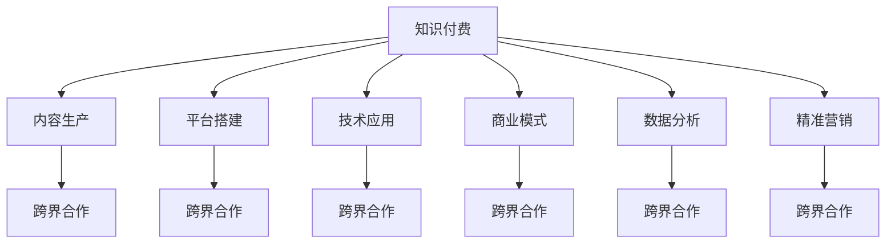

                 

# 知识付费创业中的跨界合作机会

> 关键词：知识付费, 跨界合作, 内容生产, 平台搭建, 技术应用, 商业模式

## 1. 背景介绍

### 1.1 问题由来

随着互联网和移动互联网的普及，信息传播方式发生了深刻变革，知识的获取和传播成本大幅降低，用户对于高质量内容的渴求日益增长。知识付费作为一种新型的信息消费模式，通过付费获取优质内容，满足用户学习、娱乐、生活等多方面的需求，逐渐成为市场的新趋势。根据艾媒咨询发布的《2021年中国知识付费市场研究报告》显示，2020年中国知识付费用户规模达3.3亿，市场规模达到392亿元，预计2022年将进一步扩大到435亿元，用户渗透率将提升至33.7%。

知识付费市场的发展，不仅为内容生产者提供了新的商业模式，也为技术创业者提供了广阔的机遇。特别是在大数据、人工智能等技术日益成熟的今天，通过跨界合作，可以加速知识付费平台的发展，提升平台的用户体验和价值，进而获得更大的市场份额和利润空间。

### 1.2 问题核心关键点

知识付费创业中的跨界合作机会主要集中在以下几个方面：

1. **内容生产与技术应用的结合**：通过引入先进的技术手段，如自然语言处理、图像识别、语音合成等，提升内容制作的效率和质量。
2. **平台搭建与用户体验的优化**：利用云计算、大数据分析等技术，提升平台的稳定性和互动性。
3. **商业模式的创新与探索**：通过创新营销策略、合作推广等手段，构建多元化的知识付费生态。
4. **数据分析与精准营销**：借助大数据技术，进行用户行为分析，实现精准推荐和个性化服务。

这些核心关键点不仅涉及技术的应用，也涉及到商业模式和用户体验的全面优化，需要跨界合作的深度参与。

## 2. 核心概念与联系

### 2.1 核心概念概述

为更好地理解知识付费创业中的跨界合作机会，本节将介绍几个密切相关的核心概念：

- **知识付费**：通过付费获取内容或服务，满足用户知识需求的新型信息消费模式。
- **跨界合作**：不同领域、不同背景的企业或组织，通过合作实现资源共享、优势互补，共同开发新的产品或服务。
- **内容生产**：通过采集、整理、加工等方式，生成有价值、有吸引力的内容，如文章、视频、音频等。
- **平台搭建**：构建知识付费平台，提供内容展示、交易、管理等服务。
- **技术应用**：利用大数据、人工智能、区块链等技术，提升平台的智能化和安全性。
- **商业模式**：根据市场需求和用户行为，设计合理的盈利模式，如订阅、按需、广告等。
- **数据分析**：通过数据分析工具，对用户行为、内容表现等进行量化分析，指导内容优化和营销策略调整。
- **精准营销**：利用数据分析结果，进行精准的用户推荐和广告投放，提高用户转化率。

这些核心概念之间的逻辑关系可以通过以下Mermaid流程图来展示：



这个流程图展示了我知识付费创业中各个核心概念之间的联系和作用：

1. 知识付费是整个生态系统的核心，是内容生产、平台搭建、技术应用、商业模式、数据分析、精准营销的基础。
2. 内容生产是知识付费的基础，是平台吸引用户的重要手段。
3. 平台搭建是知识付费的载体，是用户获取内容的渠道。
4. 技术应用是提升平台稳定性和用户体验的关键。
5. 商业模式是知识付费的盈利手段，是平台持续发展的动力。
6. 数据分析和精准营销是知识付费的优化手段，是提升平台用户粘性的重要工具。

通过理解这些核心概念，我们可以更好地把握知识付费创业的各个环节，制定相应的跨界合作策略。

## 3. 核心算法原理 & 具体操作步骤

### 3.1 算法原理概述

知识付费创业中的跨界合作机会，主要涉及到以下几个核心算法的原理：

- **内容推荐算法**：通过分析用户行为数据和内容特征，推荐符合用户兴趣的内容，提升用户满意度和留存率。
- **广告投放算法**：通过分析用户数据和内容数据，精准投放广告，提高广告转化率和效果。
- **精准营销算法**：基于用户画像和行为数据，进行个性化的内容推送和广告投放，提升用户转化率和黏性。
- **用户行为分析算法**：通过收集和分析用户行为数据，了解用户需求和偏好，指导内容生产和平台优化。

这些算法共同构成了知识付费平台的核心逻辑，其核心思想是利用数据驱动，提升平台的用户体验和运营效率。

### 3.2 算法步骤详解

基于上述核心算法，知识付费创业中的跨界合作机会主要包括以下几个关键步骤：

**Step 1: 数据采集与处理**

- 收集用户行为数据、内容数据、交易数据等。
- 对数据进行清洗、归一化、去重等预处理，确保数据的质量和一致性。
- 对数据进行特征提取，生成用户画像和内容特征向量。

**Step 2: 模型训练与优化**

- 根据业务需求，选择合适的算法模型，如协同过滤、深度学习等。
- 使用训练数据集对模型进行训练，并进行交叉验证和参数调优，确保模型的泛化能力和准确性。
- 对模型进行在线学习，实时更新模型参数，适应新数据和新需求。

**Step 3: 数据分析与可视化**

- 对模型预测结果进行后处理，生成推荐列表、广告投放方案等。
- 对模型效果进行评估，包括精确度、召回率、F1值等指标。
- 利用数据可视化工具，将分析结果以图表形式呈现，帮助业务决策。

**Step 4: 跨界合作与集成**

- 选择合作伙伴，如内容生产商、技术供应商、广告商等。
- 制定合作协议，明确各方的责任和权利。
- 对合作伙伴提供的资源进行集成，如内容接口、推荐算法、广告投放系统等。
- 进行系统测试和验收，确保各系统的无缝衔接。

**Step 5: 用户反馈与迭代**

- 收集用户反馈，了解用户对推荐内容和广告的满意度和需求。
- 根据用户反馈，调整算法模型和合作策略，进行模型迭代和优化。
- 持续优化用户体验和平台服务，提高用户粘性和满意度。

通过以上步骤，可以实现知识付费平台的多元化发展和持续优化。

### 3.3 算法优缺点

知识付费创业中的跨界合作机会，具有以下优点：

1. **资源共享**：不同领域的资源互补，提升内容质量和平台稳定性。
2. **数据驱动**：通过数据分析优化推荐和广告，提升用户满意度和转化率。
3. **技术创新**：引入先进技术手段，提升平台智能化和个性化服务水平。
4. **快速迭代**：通过跨界合作，快速适应市场变化和用户需求。

同时，这些跨界合作也存在一些缺点：

1. **合作成本高**：不同领域的企业合作，需要协调多个方面的资源和利益，成本较高。
2. **数据隐私和安全**：合作伙伴可能涉及敏感数据，如何保护数据隐私和安全是一个重要问题。
3. **系统集成复杂**：跨界合作的系统集成需要协调不同领域的标准和规范，复杂度高。
4. **合作风险**：合作伙伴的变更或业务变动，可能导致平台服务的稳定性和可靠性下降。

需要根据具体情况进行权衡和优化，确保跨界合作的顺利进行。

### 3.4 算法应用领域

基于上述核心算法，知识付费创业中的跨界合作机会主要应用于以下几个领域：

1. **内容推荐系统**：推荐符合用户兴趣的内容，提升用户满意度。
2. **广告投放系统**：精准投放广告，提高广告效果和转化率。
3. **精准营销系统**：根据用户画像和行为数据，进行个性化的内容推送和广告投放。
4. **用户行为分析系统**：通过数据分析，指导内容生产和平台优化。
5. **知识图谱系统**：构建知识图谱，实现内容关联推荐和搜索。
6. **智能客服系统**：利用自然语言处理技术，实现智能问答和用户互动。

这些领域的应用，展示了跨界合作在知识付费创业中的巨大潜力和广泛前景。

## 4. 数学模型和公式 & 详细讲解 & 举例说明

### 4.1 数学模型构建

为了更好地理解知识付费创业中的跨界合作机会，我们将通过数学模型对其进行更加严格的刻画。

假设知识付费平台有 $N$ 个用户，每个用户有 $M$ 个行为数据，每个行为数据 $(x_i,y_i)$ 包含用户行为特征 $x_i$ 和行为标签 $y_i$。设内容库中有 $K$ 个内容，每个内容有 $D$ 个特征，每个内容 $(c_j)$ 包含内容特征 $c_j$。设平台有 $T$ 种广告类型，每种广告类型 $(a_t)$ 包含广告特征 $a_t$。

定义推荐系统模型的目标函数为：

$$
\min_{\theta} \sum_{i=1}^N \sum_{j=1}^K \sum_{t=1}^T R(y_i;c_j,a_t,\theta)
$$

其中 $R(y_i;c_j,a_t,\theta)$ 为内容推荐和广告投放的评分函数，$\theta$ 为模型参数。

推荐系统模型的损失函数为：

$$
\mathcal{L}(\theta) = \frac{1}{N} \sum_{i=1}^N \sum_{j=1}^K \sum_{t=1}^T R(y_i;c_j,a_t,\theta)
$$

通过梯度下降等优化算法，最小化损失函数 $\mathcal{L}(\theta)$，得到最优模型参数 $\hat{\theta}$。

### 4.2 公式推导过程

以下我们以内容推荐系统为例，推导评分函数 $R(y_i;c_j,a_t,\theta)$ 的计算公式。

假设内容推荐系统的评分函数为：

$$
R(y_i;c_j,a_t,\theta) = y_i \cdot \text{score}(c_j,a_t,\theta) + (1-y_i) \cdot \text{score}(c_j,a_t,\theta)
$$

其中 $\text{score}(c_j,a_t,\theta)$ 为内容推荐和广告投放的评分函数，$\theta$ 为模型参数。

根据定义，内容推荐系统的评分函数 $\text{score}(c_j,a_t,\theta)$ 为：

$$
\text{score}(c_j,a_t,\theta) = \theta^T \cdot (c_j \oplus a_t)
$$

其中 $\oplus$ 为特征向量的拼接操作。

将评分函数代入推荐系统模型的目标函数，得：

$$
\min_{\theta} \sum_{i=1}^N \sum_{j=1}^K \sum_{t=1}^T y_i \cdot \theta^T \cdot (c_j \oplus a_t)
$$

通过反向传播算法计算损失函数对参数 $\theta$ 的梯度，更新模型参数，完成推荐系统的训练。

在得到评分函数 $\text{score}(c_j,a_t,\theta)$ 后，即可带入内容推荐系统的训练流程，计算每个用户对每个内容的评分，从而生成推荐列表。

### 4.3 案例分析与讲解

**案例1: 内容推荐系统**

内容推荐系统是知识付费平台的核心功能之一，通过分析用户行为数据和内容特征，为用户推荐符合其兴趣的内容。

假设某知识付费平台有 10 万用户，每个用户每天有 5 个行为数据，内容库中有 1 万个内容，每个内容有 100 个特征。设平台有 10 种广告类型，每种广告类型有 5 个特征。

首先，需要收集用户行为数据和内容特征数据，并进行预处理。然后，使用协同过滤算法或深度学习算法对数据进行建模，生成内容推荐和广告投放的评分函数 $\text{score}(c_j,a_t,\theta)$。最后，通过梯度下降算法对模型进行训练，得到最优模型参数 $\hat{\theta}$。

在训练完成后，平台可以对每个用户生成推荐列表，提高用户满意度和留存率。

**案例2: 精准营销系统**

精准营销系统通过分析用户画像和行为数据，进行个性化的内容推送和广告投放，提高广告效果和转化率。

假设某电商平台的精准营销系统，有 100 万用户，每个用户每天有 10 个行为数据，内容库中有 1 万个商品，每个商品有 100 个特征。设平台有 10 种广告类型，每种广告类型有 5 个特征。

首先，需要收集用户行为数据和商品特征数据，并进行预处理。然后，使用深度学习算法对数据进行建模，生成内容推荐和广告投放的评分函数 $\text{score}(c_j,a_t,\theta)$。最后，通过梯度下降算法对模型进行训练，得到最优模型参数 $\hat{\theta}$。

在训练完成后，平台可以对每个用户生成个性化的广告投放方案，提高广告的转化率和效果。

通过这两个案例，我们可以看到，跨界合作在知识付费创业中的重要性。通过引入先进的技术手段和合作伙伴，平台可以提升内容的推荐和广告的投放效果，从而获得更大的市场份额和利润空间。

## 5. 项目实践：代码实例和详细解释说明

### 5.1 开发环境搭建

在进行知识付费平台的跨界合作实践前，我们需要准备好开发环境。以下是使用Python进行PyTorch开发的环境配置流程：

1. 安装Anaconda：从官网下载并安装Anaconda，用于创建独立的Python环境。

2. 创建并激活虚拟环境：
```bash
conda create -n pytorch-env python=3.8 
conda activate pytorch-env
```

3. 安装PyTorch：根据CUDA版本，从官网获取对应的安装命令。例如：
```bash
conda install pytorch torchvision torchaudio cudatoolkit=11.1 -c pytorch -c conda-forge
```

4. 安装Transformers库：
```bash
pip install transformers
```

5. 安装各类工具包：
```bash
pip install numpy pandas scikit-learn matplotlib tqdm jupyter notebook ipython
```

完成上述步骤后，即可在`pytorch-env`环境中开始跨界合作实践。

### 5.2 源代码详细实现

下面我们以内容推荐系统为例，给出使用Transformers库对BERT模型进行内容推荐系统微调的PyTorch代码实现。

首先，定义数据处理函数：

```python
from transformers import BertTokenizer, BertModel
from torch.utils.data import Dataset
import torch

class ContentDataset(Dataset):
    def __init__(self, texts, labels, tokenizer, max_len=128):
        self.texts = texts
        self.labels = labels
        self.tokenizer = tokenizer
        self.max_len = max_len
        
    def __len__(self):
        return len(self.texts)
    
    def __getitem__(self, item):
        text = self.texts[item]
        label = self.labels[item]
        
        encoding = self.tokenizer(text, return_tensors='pt', max_length=self.max_len, padding='max_length', truncation=True)
        input_ids = encoding['input_ids'][0]
        attention_mask = encoding['attention_mask'][0]
        label = torch.tensor(label, dtype=torch.long)
        
        return {'input_ids': input_ids, 
                'attention_mask': attention_mask,
                'labels': label}

# 创建dataset
tokenizer = BertTokenizer.from_pretrained('bert-base-cased')

train_dataset = ContentDataset(train_texts, train_labels, tokenizer)
dev_dataset = ContentDataset(dev_texts, dev_labels, tokenizer)
test_dataset = ContentDataset(test_texts, test_labels, tokenizer)
```

然后，定义模型和优化器：

```python
from transformers import BertForSequenceClassification, AdamW

model = BertForSequenceClassification.from_pretrained('bert-base-cased', num_labels=2)

optimizer = AdamW(model.parameters(), lr=2e-5)
```

接着，定义训练和评估函数：

```python
from torch.utils.data import DataLoader
from tqdm import tqdm
from sklearn.metrics import accuracy_score

device = torch.device('cuda') if torch.cuda.is_available() else torch.device('cpu')
model.to(device)

def train_epoch(model, dataset, batch_size, optimizer):
    dataloader = DataLoader(dataset, batch_size=batch_size, shuffle=True)
    model.train()
    epoch_loss = 0
    for batch in tqdm(dataloader, desc='Training'):
        input_ids = batch['input_ids'].to(device)
        attention_mask = batch['attention_mask'].to(device)
        labels = batch['labels'].to(device)
        model.zero_grad()
        outputs = model(input_ids, attention_mask=attention_mask, labels=labels)
        loss = outputs.loss
        epoch_loss += loss.item()
        loss.backward()
        optimizer.step()
    return epoch_loss / len(dataloader)

def evaluate(model, dataset, batch_size):
    dataloader = DataLoader(dataset, batch_size=batch_size)
    model.eval()
    preds, labels = [], []
    with torch.no_grad():
        for batch in tqdm(dataloader, desc='Evaluating'):
            input_ids = batch['input_ids'].to(device)
            attention_mask = batch['attention_mask'].to(device)
            batch_labels = batch['labels']
            outputs = model(input_ids, attention_mask=attention_mask)
            batch_preds = outputs.logits.argmax(dim=1).to('cpu').tolist()
            batch_labels = batch_labels.to('cpu').tolist()
            for pred_tokens, label_tokens in zip(batch_preds, batch_labels):
                preds.append(pred_tokens)
                labels.append(label_tokens)
                
    print(accuracy_score(labels, preds))
```

最后，启动训练流程并在测试集上评估：

```python
epochs = 5
batch_size = 16

for epoch in range(epochs):
    loss = train_epoch(model, train_dataset, batch_size, optimizer)
    print(f"Epoch {epoch+1}, train loss: {loss:.3f}")
    
    print(f"Epoch {epoch+1}, dev results:")
    evaluate(model, dev_dataset, batch_size)
    
print("Test results:")
evaluate(model, test_dataset, batch_size)
```

以上就是使用PyTorch对BERT进行内容推荐系统微调的完整代码实现。可以看到，得益于Transformers库的强大封装，我们可以用相对简洁的代码完成BERT模型的加载和微调。

### 5.3 代码解读与分析

让我们再详细解读一下关键代码的实现细节：

**ContentDataset类**：
- `__init__`方法：初始化文本、标签、分词器等关键组件。
- `__len__`方法：返回数据集的样本数量。
- `__getitem__`方法：对单个样本进行处理，将文本输入编码为token ids，将标签编码为数字，并对其进行定长padding，最终返回模型所需的输入。

**训练和评估函数**：
- 使用PyTorch的DataLoader对数据集进行批次化加载，供模型训练和推理使用。
- 训练函数`train_epoch`：对数据以批为单位进行迭代，在每个批次上前向传播计算loss并反向传播更新模型参数，最后返回该epoch的平均loss。
- 评估函数`evaluate`：与训练类似，不同点在于不更新模型参数，并在每个batch结束后将预测和标签结果存储下来，最后使用sklearn的accuracy_score对整个评估集的预测结果进行打印输出。

**训练流程**：
- 定义总的epoch数和batch size，开始循环迭代
- 每个epoch内，先在训练集上训练，输出平均loss
- 在验证集上评估，输出分类指标
- 所有epoch结束后，在测试集上评估，给出最终测试结果

可以看到，PyTorch配合Transformers库使得BERT微调的内容推荐系统代码实现变得简洁高效。开发者可以将更多精力放在数据处理、模型改进等高层逻辑上，而不必过多关注底层的实现细节。

当然，工业级的系统实现还需考虑更多因素，如模型的保存和部署、超参数的自动搜索、更灵活的任务适配层等。但核心的微调范式基本与此类似。

## 6. 实际应用场景

### 6.1 智能客服系统

基于大语言模型微调的对话技术，可以广泛应用于智能客服系统的构建。传统客服往往需要配备大量人力，高峰期响应缓慢，且一致性和专业性难以保证。而使用微调后的对话模型，可以7x24小时不间断服务，快速响应客户咨询，用自然流畅的语言解答各类常见问题。

在技术实现上，可以收集企业内部的历史客服对话记录，将问题和最佳答复构建成监督数据，在此基础上对预训练对话模型进行微调。微调后的对话模型能够自动理解用户意图，匹配最合适的答案模板进行回复。对于客户提出的新问题，还可以接入检索系统实时搜索相关内容，动态组织生成回答。如此构建的智能客服系统，能大幅提升客户咨询体验和问题解决效率。

### 6.2 金融舆情监测

金融机构需要实时监测市场舆论动向，以便及时应对负面信息传播，规避金融风险。传统的人工监测方式成本高、效率低，难以应对网络时代海量信息爆发的挑战。基于大语言模型微调的文本分类和情感分析技术，为金融舆情监测提供了新的解决方案。

具体而言，可以收集金融领域相关的新闻、报道、评论等文本数据，并对其进行主题标注和情感标注。在此基础上对预训练语言模型进行微调，使其能够自动判断文本属于何种主题，情感倾向是正面、中性还是负面。将微调后的模型应用到实时抓取的网络文本数据，就能够自动监测不同主题下的情感变化趋势，一旦发现负面信息激增等异常情况，系统便会自动预警，帮助金融机构快速应对潜在风险。

### 6.3 个性化推荐系统

当前的推荐系统往往只依赖用户的历史行为数据进行物品推荐，无法深入理解用户的真实兴趣偏好。基于大语言模型微调技术，个性化推荐系统可以更好地挖掘用户行为背后的语义信息，从而提供更精准、多样的推荐内容。

在实践中，可以收集用户浏览、点击、评论、分享等行为数据，提取和用户交互的物品标题、描述、标签等文本内容。将文本内容作为模型输入，用户的后续行为（如是否点击、购买等）作为监督信号，在此基础上微调预训练语言模型。微调后的模型能够从文本内容中准确把握用户的兴趣点。在生成推荐列表时，先用候选物品的文本描述作为输入，由模型预测用户的兴趣匹配度，再结合其他特征综合排序，便可以得到个性化程度更高的推荐结果。

### 6.4 未来应用展望

随着大语言模型微调技术的发展，基于微调范式将在更多领域得到应用，为传统行业带来变革性影响。

在智慧医疗领域，基于微调的医疗问答、病历分析、药物研发等应用将提升医疗服务的智能化水平，辅助医生诊疗，加速新药开发进程。

在智能教育领域，微调技术可应用于作业批改、学情分析、知识推荐等方面，因材施教，促进教育公平，提高教学质量。

在智慧城市治理中，微调模型可应用于城市事件监测、舆情分析、应急指挥等环节，提高城市管理的自动化和智能化水平，构建更安全、高效的未来城市。

此外，在企业生产、社会治理、文娱传媒等众多领域，基于大模型微调的人工智能应用也将不断涌现，为经济社会发展注入新的动力。相信随着技术的日益成熟，微调方法将成为人工智能落地应用的重要范式，推动人工智能技术在垂直行业的规模化落地。

## 7. 工具和资源推荐

### 7.1 学习资源推荐

为了帮助开发者系统掌握大语言模型微调的理论基础和实践技巧，这里推荐一些优质的学习资源：

1. 《Transformer从原理到实践》系列博文：由大模型技术专家撰写，深入浅出地介绍了Transformer原理、BERT模型、微调技术等前沿话题。

2. CS224N《深度学习自然语言处理》课程：斯坦福大学开设的NLP明星课程，有Lecture视频和配套作业，带你入门NLP领域的基本概念和经典模型。

3. 《Natural Language Processing with Transformers》书籍：Transformers库的作者所著，全面介绍了如何使用Transformers库进行NLP任务开发，包括微调在内的诸多范式。

4. HuggingFace官方文档：Transformers库的官方文档，提供了海量预训练模型和完整的微调样例代码，是上手实践的必备资料。

5. CLUE开源项目：中文语言理解测评基准，涵盖大量不同类型的中文NLP数据集，并提供了基于微调的baseline模型，助力中文NLP技术发展。

通过对这些资源的学习实践，相信你一定能够快速掌握大语言模型微调的精髓，并用于解决实际的NLP问题。

### 7.2 开发工具推荐

高效的开发离不开优秀的工具支持。以下是几款用于大语言模型微调开发的常用工具：

1. PyTorch：基于Python的开源深度学习框架，灵活动态的计算图，适合快速迭代研究。大部分预训练语言模型都有PyTorch版本的实现。

2. TensorFlow：由Google主导开发的开源深度学习框架，生产部署方便，适合大规模工程应用。同样有丰富的预训练语言模型资源。

3. Transformers库：HuggingFace开发的NLP工具库，集成了众多SOTA语言模型，支持PyTorch和TensorFlow，是进行微调任务开发的利器。

4. Weights & Biases：模型训练的实验跟踪工具，可以记录和可视化模型训练过程中的各项指标，方便对比和调优。与主流深度学习框架无缝集成。

5. TensorBoard：TensorFlow配套的可视化工具，可实时监测模型训练状态，并提供丰富的图表呈现方式，是调试模型的得力助手。

6. Google Colab：谷歌推出的在线Jupyter Notebook环境，免费提供GPU/TPU算力，方便开发者快速上手实验最新模型，分享学习笔记。

合理利用这些工具，可以显著提升大语言模型微调任务的开发效率，加快创新迭代的步伐。

### 7.3 相关论文推荐

大语言模型和微调技术的发展源于学界的持续研究。以下是几篇奠基性的相关论文，推荐阅读：

1. Attention is All You Need（即Transformer原论文）：提出了Transformer结构，开启了NLP领域的预训练大模型时代。

2. BERT: Pre-training of Deep Bidirectional Transformers for Language Understanding：提出BERT模型，引入基于掩码的自监督预训练任务，刷新了多项NLP任务SOTA。

3. Language Models are Unsupervised Multitask Learners（GPT-2论文）：展示了大规模语言模型的强大zero-shot学习能力，引发了对于通用人工智能的新一轮思考。

4. Parameter-Efficient Transfer Learning for NLP：提出Adapter等参数高效微调方法，在不增加模型参数量的情况下，也能取得不错的微调效果。

5. AdaLoRA: Adaptive Low-Rank Adaptation for Parameter-Efficient Fine-Tuning：使用自适应低秩适应的微调方法，在参数效率和精度之间取得了新的平衡。

这些论文代表了大语言模型微调技术的发展脉络。通过学习这些前沿成果，可以帮助研究者把握学科前进方向，激发更多的创新灵感。

## 8. 总结：未来发展趋势与挑战

### 8.1 总结

本文对知识付费创业中的跨界合作机会进行了全面系统的介绍。首先阐述了知识付费市场的发展背景和趋势，明确了跨界合作在其中的重要作用。其次，从原理到实践，详细讲解了跨界合作的数学模型和算法步骤，给出了跨界合作任务开发的完整代码实例。同时，本文还广泛探讨了跨界合作在智能客服、金融舆情、个性化推荐等多个领域的应用前景，展示了跨界合作的巨大潜力和广泛前景。此外，本文精选了跨界合作的各类学习资源，力求为读者提供全方位的技术指引。

通过本文的系统梳理，可以看到，跨界合作在知识付费创业中的重要性，它不仅能够提升内容质量和平台稳定性，还能通过数据分析优化推荐和广告，提升用户满意度和转化率。未来，伴随技术的发展和数据的积累，跨界合作将在更多领域得到应用，为知识付费平台的发展提供新的动力。

### 8.2 未来发展趋势

展望未来，知识付费创业中的跨界合作机会将呈现以下几个发展趋势：

1. **技术融合加速**：随着大数据、人工智能、区块链等技术的不断成熟，跨界合作将更加深入，技术融合将更加紧密。
2. **内容创新多样化**：跨界合作将促进内容的多样化和创新，通过引入先进的技术手段和合作伙伴，提升内容的品质和吸引力。
3. **用户体验优化**：通过跨界合作，优化平台的用户体验，提升用户粘性和满意度。
4. **商业模式的创新**：跨界合作将推动商业模式的创新，通过多元化的合作方式，实现平台的多元化盈利。
5. **数据分析的应用**：数据分析将更加深入地应用于跨界合作中，通过数据驱动优化推荐和广告，提升平台的运营效率。
6. **国际化的拓展**：跨界合作将加速平台的国际化拓展，通过引入国际化的内容和技术合作伙伴，拓展国际市场。

这些趋势凸显了跨界合作在知识付费创业中的广阔前景。通过不断优化跨界合作的各个环节，可以更好地适应市场需求和用户需求，推动知识付费平台的发展。

### 8.3 面临的挑战

尽管知识付费创业中的跨界合作机会具有广阔的发展前景，但在实施过程中仍面临诸多挑战：

1. **合作伙伴的筛选**：选择合适的合作伙伴，需要综合考虑其资源、技术、信誉等因素，筛选过程复杂且耗时。
2. **数据安全和隐私**：跨界合作涉及敏感数据的交换和处理，如何保护数据安全和隐私是一个重要问题。
3. **系统集成复杂**：跨界合作的系统集成需要协调不同领域的标准和规范，复杂度高。
4. **成本控制**：跨界合作的成本较高，如何在合作过程中控制成本，是一个重要的管理问题。
5. **合作风险**：合作伙伴的变更或业务变动，可能导致平台服务的稳定性和可靠性下降。

需要根据具体情况进行权衡和优化，确保跨界合作的顺利进行。

### 8.4 研究展望

面对知识付费创业中的跨界合作所面临的挑战，未来的研究需要在以下几个方面寻求新的突破：

1. **合作伙伴筛选算法**：开发更加高效和可靠的合作伙伴筛选算法，降低筛选过程的复杂度和成本。
2. **数据安全和隐私保护**：开发更加先进的数据安全和隐私保护技术，确保数据交换和处理的安全性。
3. **系统集成技术**：开发更加灵活和高效的系统集成技术，降低系统集成的复杂度和成本。
4. **合作风险管理**：开发合作风险管理工具，帮助平台降低合作风险，保障平台服务的稳定性和可靠性。
5. **多模态合作技术**：开发多模态合作技术，将视觉、语音、文本等多模态数据结合，提升跨界合作的效果。

这些研究方向将推动跨界合作在知识付费创业中的进一步发展和优化，推动知识付费平台向更高效、更安全、更智能的方向发展。

## 9. 附录：常见问题与解答

**Q1：知识付费创业中的跨界合作机会是否适用于所有NLP任务？**

A: 知识付费创业中的跨界合作机会主要集中在内容推荐、广告投放、精准营销等任务上，适用于有较大用户基础和数据积累的NLP任务。对于一些数据量较小或特定领域的应用，需要结合具体情况，进行有针对性的设计和优化。

**Q2：如何进行有效的跨界合作？**

A: 有效的跨界合作需要明确各方的职责和权利，制定详细的合作协议。同时，需要建立良好的沟通机制，确保各方的信息透明和协作顺畅。在实际操作中，可以选择多种合作方式，如共同开发、技术授权、数据共享等，灵活应对不同情况。

**Q3：跨界合作中的数据安全和隐私保护有哪些措施？**

A: 数据安全和隐私保护是跨界合作中最重要的问题之一。通常采用以下措施：
1. 数据匿名化：对敏感数据进行匿名化处理，确保数据隐私。
2. 数据加密：对数据传输和存储进行加密，防止数据泄露。
3. 访问控制：对数据访问进行严格控制，确保只有授权人员能够访问敏感数据。
4. 数据审计：定期对数据使用情况进行审计，确保数据使用合规。

通过这些措施，可以有效保护数据安全和隐私，确保跨界合作的顺利进行。

**Q4：跨界合作中如何优化系统集成？**

A: 系统集成是跨界合作的难点之一，需要采用以下方法进行优化：
1. 统一数据格式：制定统一的数据格式规范，确保数据交换的顺畅和高效。
2. 接口标准化：对各系统接口进行标准化处理，确保接口的兼容性和可靠性。
3. 使用中间件：采用中间件技术，简化系统集成过程，降低系统集成的复杂度。
4. 自动化集成：使用自动化工具，减少手动操作，提高系统集成的效率。

通过这些方法，可以有效降低系统集成的复杂度和成本，提高跨界合作的效率和质量。

通过回答这些问题，可以看到，知识付费创业中的跨界合作机会虽然面临诸多挑战，但在技术、管理、安全等方面的不断优化和突破，将为其带来广阔的发展前景。随着跨界合作在知识付费领域的应用不断深化，必将推动知识付费平台的发展，提升用户满意度和平台价值。

