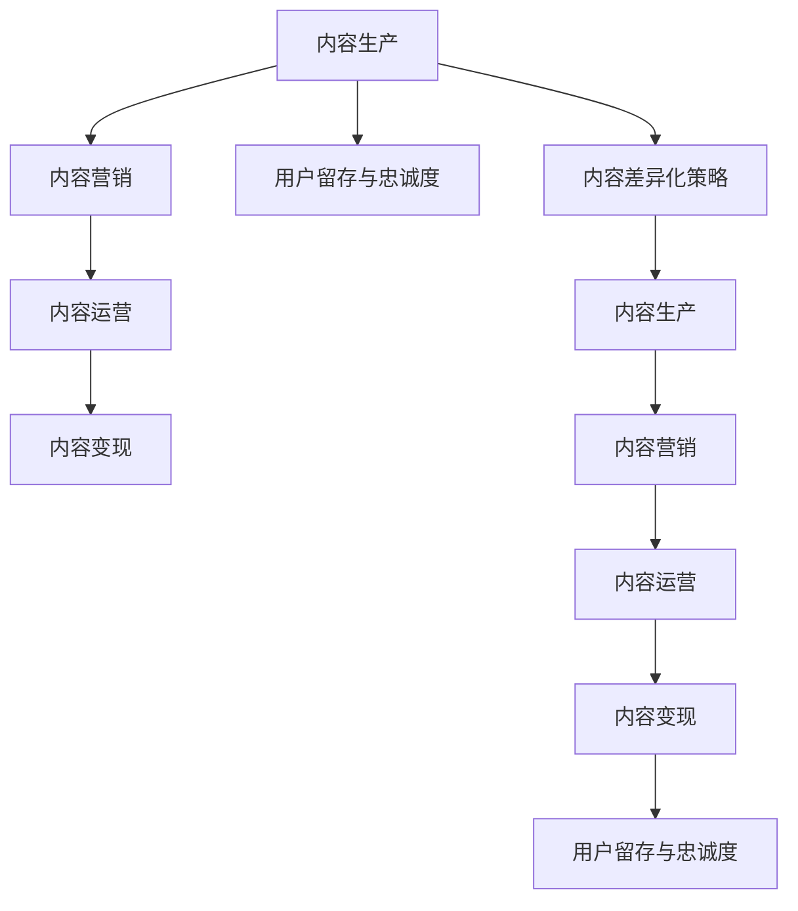

                 

## 1. 背景介绍

随着知识经济的崛起，知识付费平台逐渐成为连接知识创作者和需求者的重要桥梁。然而，海量知识资源和内容的同质化现象严重，用户获取知识体验难以突破，平台盈利模式单一，这些因素都制约了知识付费市场的健康发展。内容差异化作为知识付费创业的核心策略，旨在通过独特的、有价值的、多样化的内容资源，形成平台的核心竞争力，满足用户深层次的需求，拓展平台的盈利空间。本文将探讨知识付费创业中内容差异化的策略，包括内容生产、内容营销、内容运营、内容变现等环节的关键方法和实践案例。

## 2. 核心概念与联系

### 2.1 核心概念概述

**内容差异化策略**：通过独特的、有价值的、多样化的内容资源，形成平台的核心竞争力，满足用户深层次的需求，拓展平台的盈利空间。

**内容生产**：创建高质量、有价值、具有吸引力且符合用户需求的内容。内容包括但不限于视频、音频、图文、直播、互动课堂等形式。

**内容营销**：通过各类线上线下渠道推广内容，吸引用户关注和参与，形成用户粘性，提高平台流量和用户转化率。

**内容运营**：通过精准推荐、数据分析、内容激励等方式，提升内容的曝光度和参与度，持续优化用户内容消费体验。

**内容变现**：通过付费订阅、按需付费、版权分成、广告投放、内容合作等形式，实现内容的商业价值转化，形成平台的核心盈利模式。

**用户留存与忠诚度**：通过持续提供优质、有价值的内容，增强用户粘性，提升用户满意度和忠诚度，构建平台的长期竞争优势。

这些核心概念之间通过复杂的互动关系，共同构成了知识付费创业的内容差异化策略生态圈。内容生产是基础，内容营销是推广，内容运营是保障，内容变现是目标，用户留存与忠诚度是最终成果。

### 2.2 核心概念原理和架构的 Mermaid 流程图



此流程图展示了知识付费创业内容差异化策略中的核心概念和它们之间的联系。内容生产是起点，最终目标是通过用户留存与忠诚度，形成平台的长期竞争优势。

## 3. 核心算法原理 & 具体操作步骤

### 3.1 算法原理概述

内容差异化策略涉及多个环节，每一步都需运用不同的算法和技术实现。以内容推荐算法为例，算法原理如下：

1. **协同过滤**：根据用户历史行为数据和物品属性数据，找到与目标用户兴趣相符的其他用户和物品，从而推荐相关内容。

2. **基于内容的推荐**：根据物品属性数据，找到与目标用户兴趣相似的物品，进行内容推荐。

3. **混合推荐**：结合协同过滤和基于内容的推荐，提供更为准确和多样化的内容推荐。

4. **模型训练与优化**：利用机器学习算法，对推荐模型进行训练和优化，提高推荐精度和覆盖度。

### 3.2 算法步骤详解

1. **数据收集**：收集用户行为数据、物品属性数据、用户画像数据等。

2. **数据处理与特征工程**：清洗数据，提取特征，构建数据集。

3. **模型训练**：选择适合的机器学习算法，如协同过滤、决策树、随机森林、神经网络等，对推荐模型进行训练。

4. **模型优化**：通过交叉验证、调参等手段，优化模型性能。

5. **实时推荐**：将训练好的推荐模型部署到实时推荐系统中，根据用户行为和特征，实时推荐相关内容。

### 3.3 算法优缺点

**优点**：

- 提高内容推荐的个性化和多样性。
- 能够有效提升用户满意度和粘性。
- 增加平台流量和转化率。
- 提高内容变现能力。

**缺点**：

- 数据收集和处理成本较高。
- 模型训练和优化复杂度高，对技术要求高。
- 推荐效果受数据质量和模型选择影响大。

### 3.4 算法应用领域

内容差异化策略在知识付费创业中的应用领域非常广泛，以下是几个典型的应用场景：

1. **在线教育平台**：通过个性化推荐，提高课程完成率和用户满意度，同时增加平台订阅用户和付费用户数。

2. **智能健身应用**：利用数据分析和推荐算法，为用户推荐个性化健身计划、营养食谱，提升用户粘性和留存率。

3. **职场培训平台**：通过内容差异化，提供精准职业技能培训，满足不同行业和职位的需求，提升平台用户转化率和盈利能力。

4. **在线心理咨询平台**：通过推荐算法，为不同需求的用户推荐适合的咨询师和课程，提高平台的用户体验和满意度。

## 4. 数学模型和公式 & 详细讲解 & 举例说明

### 4.1 数学模型构建

假设推荐系统中有 $N$ 个用户和 $M$ 个物品，用户 $u_i$ 对物品 $i_j$ 的评分 $r_{ij}$ 服从伯努利分布，即 $r_{ij} \sim Bernoulli(\theta_{ij})$。其中 $\theta_{ij}$ 为物品 $i_j$ 对用户 $u_i$ 的评分概率，根据协同过滤和基于内容的推荐算法，推荐模型可以表示为：

$$
\theta_{ij} = f_\theta(x_i,x_j)
$$

其中 $x_i$ 为用户 $u_i$ 的属性特征，$x_j$ 为物品 $i_j$ 的属性特征，$f_\theta$ 为推荐模型的函数，$\theta$ 为模型参数。

### 4.2 公式推导过程

以协同过滤为例，推荐模型公式为：

$$
\hat{r}_{ij} = \frac{1}{N}\sum_{k=1}^{N} \frac{r_{ik}r_{kj}}{1+e^{-\alpha \vec{x}_i \cdot \vec{x}_k}+\beta}
$$

其中 $\alpha$ 和 $\beta$ 为调节参数，$\vec{x}_i$ 和 $\vec{x}_k$ 为用户和物品的属性特征向量。

### 4.3 案例分析与讲解

以在线教育平台为例，推荐系统可以利用协同过滤算法，推荐用户感兴趣的课程。推荐模型的训练和优化步骤如下：

1. **数据准备**：收集用户历史学习数据和课程属性数据。

2. **特征工程**：对数据进行预处理，提取用户和课程的特征。

3. **模型训练**：利用训练数据训练协同过滤模型，如矩阵分解、基于隐层的协同过滤等。

4. **模型评估**：利用验证集评估模型性能，选择最佳的模型参数。

5. **模型应用**：将训练好的模型部署到推荐系统中，实时推荐相关课程。

## 5. 项目实践：代码实例和详细解释说明

### 5.1 开发环境搭建

**环境准备**：

1. **Python 环境**：安装 Python 3.6+。

2. **库安装**：安装推荐算法相关库，如 scikit-learn、pandas、numpy、scipy 等。

3. **数据准备**：准备用户和课程数据，存储在 CSV 或 Excel 文件中。

4. **系统部署**：搭建推荐系统服务器，安装必要的依赖。

### 5.2 源代码详细实现

以下是使用 Python 实现协同过滤推荐系统的代码示例：

```python
from sklearn.neighbors import NearestNeighbors
import numpy as np
import pandas as pd

# 读取用户和课程数据
users = pd.read_csv('user_data.csv', header=None)
courses = pd.read_csv('course_data.csv', header=None)

# 构建用户-课程评分矩阵
user_course = pd.merge(users, courses, on=0).drop(0, axis=1).to_numpy()

# 构建推荐模型
model = NearestNeighbors(metric='cosine', algorithm='brute')
model.fit(user_course)

# 推荐课程
def recommend_course(user, k=10):
    dist, idx = model.kneighbors([user_course[user]])
    courses = pd.read_csv('course_data.csv', header=None)
    return courses.iloc[idx[0]][1:].values.tolist()

user = 0  # 推荐用户ID
courses = recommend_course(user)
print(courses)
```

### 5.3 代码解读与分析

以上代码展示了如何用 Python 实现基于余弦相似度的协同过滤推荐算法。首先，读取用户和课程数据，构建用户-课程评分矩阵。然后，使用 NearestNeighbors 类构建推荐模型，利用余弦相似度计算用户与课程之间的相似度。最后，通过调用推荐函数，返回与用户最相似的课程列表。

## 6. 实际应用场景

### 6.1 在线教育平台

**案例**：某在线教育平台，利用推荐算法提高课程推荐精度，提升用户满意度。

**策略**：

1. **数据收集与处理**：收集用户学习行为数据和课程属性数据，构建特征向量。

2. **模型训练与优化**：训练基于协同过滤的推荐模型，优化模型参数，提高推荐精度。

3. **实时推荐**：将训练好的模型部署到推荐系统中，实时推荐用户感兴趣的新课程，提升用户粘性和留存率。

4. **内容创新**：结合用户反馈和市场趋势，不断创新课程内容，满足用户多样化的学习需求。

### 6.2 智能健身应用

**案例**：某智能健身应用，通过推荐算法提升用户健身计划和营养食谱的个性化推荐效果。

**策略**：

1. **数据收集与处理**：收集用户健身数据、饮食数据、身体指标等，构建特征向量。

2. **模型训练与优化**：训练基于协同过滤的推荐模型，优化模型参数，提高推荐精度。

3. **实时推荐**：将训练好的模型部署到推荐系统中，实时推荐个性化健身计划和营养食谱，提升用户粘性和留存率。

4. **行为引导**：利用用户行为数据，引导用户坚持健身计划，调整饮食结构，提升健康效果。

### 6.3 职场培训平台

**案例**：某职场培训平台，通过推荐算法提供精准职业技能培训，提升用户转化率和盈利能力。

**策略**：

1. **数据收集与处理**：收集用户职业数据、技能数据、培训课程属性数据，构建特征向量。

2. **模型训练与优化**：训练基于协同过滤的推荐模型，优化模型参数，提高推荐精度。

3. **实时推荐**：将训练好的模型部署到推荐系统中，实时推荐相关职业技能培训，提升用户转化率和盈利能力。

4. **内容更新**：根据市场需求和反馈，不断更新培训课程内容，提升平台核心竞争力。

## 7. 工具和资源推荐

### 7.1 学习资源推荐

1. **《机器学习实战》**：介绍机器学习基础和应用，包含推荐系统相关内容。

2. **Coursera 《推荐系统》课程**：由斯坦福大学教授主讲，涵盖推荐系统理论和实践。

3. **Kaggle 推荐系统竞赛**：参与竞赛，提升推荐系统设计能力。

4. **《推荐系统实战》**：详细讲解推荐系统设计、开发、优化过程。

5. **GitHub 推荐系统代码库**：包含多种推荐系统代码实现，可供参考。

### 7.2 开发工具推荐

1. **Python**：推荐算法实现的主要语言。

2. **scikit-learn**：用于机器学习算法实现，包含多种推荐算法库。

3. **TensorFlow**：用于深度学习算法实现，包含多种推荐模型。

4. **PyTorch**：用于深度学习算法实现，支持动态计算图。

5. **Jupyter Notebook**：用于编写和运行推荐系统代码，支持代码共享和协作。

### 7.3 相关论文推荐

1. **《推荐系统实战》**：详细讲解推荐系统理论和实践。

2. **《协同过滤推荐算法》**：介绍协同过滤算法的原理和实现。

3. **《深度学习在推荐系统中的应用》**：介绍深度学习在推荐系统中的应用。

4. **《推荐系统中的特征工程》**：介绍推荐系统特征工程方法和案例。

5. **《推荐系统的最新研究进展》**：综述推荐系统最新研究进展和技术趋势。

## 8. 总结：未来发展趋势与挑战

### 8.1 研究成果总结

本文探讨了知识付费创业中内容差异化策略的多个环节，包括内容生产、内容营销、内容运营和内容变现。通过实例分析，展示了不同环节的实现方法和优化技巧，为知识付费创业提供了有力的理论和技术支撑。

### 8.2 未来发展趋势

1. **AI 推荐技术的发展**：随着 AI 技术的进步，推荐系统将更加智能化和个性化，能够更好地满足用户需求。

2. **用户行为分析**：利用大数据和机器学习技术，深入分析用户行为，精准推荐内容，提升用户体验。

3. **多模态推荐**：结合文本、图片、音频等多种数据类型，提供更加丰富和多样化的推荐内容。

4. **实时推荐**：利用流计算技术，实现实时推荐，提升用户粘性和留存率。

5. **个性化推荐**：结合用户历史行为数据和兴趣标签，提供高度个性化的推荐内容。

### 8.3 面临的挑战

1. **数据获取和处理**：推荐系统需要大量的用户行为数据和物品属性数据，数据获取和处理成本较高。

2. **模型选择和优化**：推荐系统涉及多种算法，选择和优化合适的算法模型是一个复杂的过程。

3. **系统性能和稳定性**：推荐系统需要处理海量数据，系统性能和稳定性要求较高，需要持续优化和维护。

4. **用户隐私和安全**：推荐系统涉及用户隐私和数据安全问题，需要严格遵守法律法规和隐私保护标准。

### 8.4 研究展望

1. **推荐系统的改进**：进一步改进推荐算法，提升推荐精度和多样性，满足用户多样化的需求。

2. **个性化推荐**：结合用户画像和行为分析，提供高度个性化的推荐内容，提升用户满意度和粘性。

3. **多模态推荐**：结合多种数据类型，提供更加丰富和多样化的推荐内容，提升用户体验。

4. **实时推荐**：利用流计算技术，实现实时推荐，提升用户粘性和留存率。

5. **用户隐私和安全**：严格遵守法律法规和隐私保护标准，保障用户数据安全。

## 9. 附录：常见问题与解答

**Q1: 内容差异化策略在知识付费创业中的重要性是什么？**

A: 内容差异化策略能够提升平台的用户满意度和粘性，从而增加平台的流量和用户转化率。同时，通过高质量、有价值、多样化的内容，提高内容变现能力，形成平台的长期竞争优势。

**Q2: 推荐算法如何提升内容推荐精度？**

A: 推荐算法通过分析用户历史行为数据和物品属性数据，找到与目标用户兴趣相符的其他用户和物品，从而推荐相关内容。通过协同过滤、基于内容的推荐等算法，提升推荐精度和覆盖度。

**Q3: 数据获取和处理在推荐系统中的重要性是什么？**

A: 推荐系统需要大量的用户行为数据和物品属性数据，数据获取和处理是推荐系统成功的关键。高质量的数据能够提高推荐精度，提升用户体验。

**Q4: 推荐系统如何实现实时推荐？**

A: 推荐系统利用流计算技术，实时处理用户行为数据和物品属性数据，及时更新推荐模型，实现实时推荐。实时推荐能够提高用户粘性和留存率，提升平台流量和转化率。

**Q5: 推荐系统的未来发展趋势是什么？**

A: 推荐系统的未来发展趋势包括 AI 推荐技术的发展、用户行为分析、多模态推荐、实时推荐和个性化推荐。通过这些技术的发展，推荐系统能够更好地满足用户需求，提升用户体验和平台竞争力。

---

作者：禅与计算机程序设计艺术 / Zen and the Art of Computer Programming

