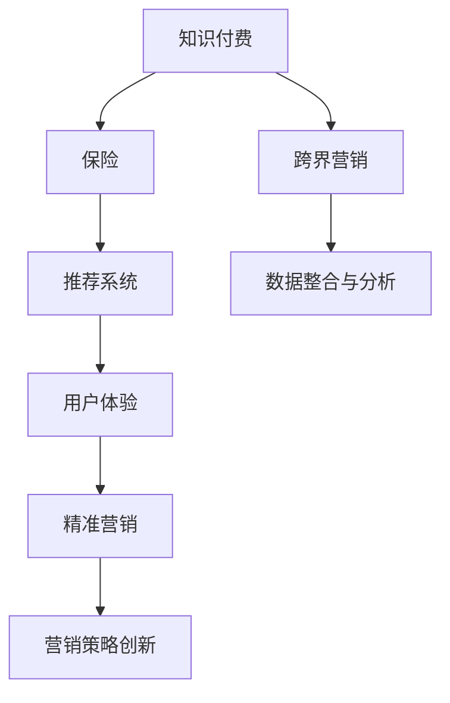

                 

# 知识付费如何实现跨界营销与保险跨界？

> 关键词：知识付费, 跨界营销, 保险, 技术融合, 数据驱动, 用户体验, 精准营销

## 1. 背景介绍

### 1.1 问题由来
知识付费近年来迅速崛起，成为了内容消费市场的重要组成部分。在这个过程中，如何提升用户参与度、增强用户粘性、实现商业变现，成为知识付费平台的重要课题。

与此同时，保险行业面临着业务转型、客户需求多元化的挑战，亟需创新营销手段，以提高品牌影响力、增加保单销售。

基于此，知识付费平台与保险行业的跨界合作成为了一个值得探索的新方向。通过将知识付费与保险业务深度结合，不仅能够拓展知识付费的变现渠道，还能提升保险公司的营销效率，为客户提供更优质的服务和产品。

### 1.2 问题核心关键点
知识付费平台与保险行业的跨界合作，核心在于如何将知识与保险产品相结合，通过数据和技术驱动精准营销和个性化服务。这需要：

1. **数据整合与分析**：整合用户行为数据、保险产品数据等，进行深度分析，挖掘用户需求和行为规律。
2. **算法驱动的推荐系统**：构建基于机器学习的推荐系统，根据用户兴趣和需求推荐最合适的保险产品。
3. **用户体验优化**：提升用户界面、支付体验等，提高用户满意度和转化率。
4. **营销策略创新**：设计多样化的营销活动和优惠方案，吸引用户参与和购买。

### 1.3 问题研究意义
探索知识付费与保险跨界合作，不仅能够帮助知识付费平台扩大商业变现渠道，还能为保险公司提供更加精准、高效的营销策略，提升用户参与度和转化率。此外，这种跨界合作模式，还能为其他行业提供借鉴，推动各行业的数字化转型和创新发展。

## 2. 核心概念与联系

### 2.1 核心概念概述

为更好地理解知识付费与保险跨界合作的原理和架构，本节将介绍几个关键概念：

- **知识付费**：通过付费方式获取知识、信息、技能等内容的消费模式，主要包括在线课程、电子书、音频讲座等形式。
- **跨界营销**：不同行业或领域之间的合作营销，通过资源共享、优势互补，实现协同营销效果。
- **保险**：一种风险转移机制，通过保险产品提供经济保障，帮助用户应对意外风险。
- **推荐系统**：利用算法推荐用户可能感兴趣的内容或产品，提升用户满意度和转化率。
- **用户体验**：指用户在使用产品或服务时的主观感受和体验，直接影响到用户满意度和忠诚度。
- **精准营销**：基于用户数据和行为分析，进行有针对性的营销活动，提高营销效率和转化率。

这些概念之间的逻辑关系可以通过以下Mermaid流程图来展示：



这个流程图展示了知识付费与保险跨界合作的核心概念及其相互关系：

1. **知识付费**：提供内容服务，吸引用户付费。
2. **跨界营销**：不同行业之间的合作，提升营销效果。
3. **保险**：提供风险保障服务，满足用户需求。
4. **推荐系统**：根据用户兴趣推荐内容或产品。
5. **用户体验**：提升用户使用体验，提高满意度。
6. **精准营销**：基于数据驱动的营销活动，提高转化率。

这些概念共同构成了知识付费与保险跨界合作的基础框架，为其发展提供了方向和方法。

## 3. 核心算法原理 & 具体操作步骤
### 3.1 算法原理概述

知识付费与保险跨界合作的算法原理，主要是通过整合用户行为数据、保险产品数据等，构建基于推荐系统的个性化营销策略。具体来说，包括以下几个关键步骤：

1. **数据收集与预处理**：收集用户行为数据（如课程浏览、购买、评论等）、保险产品数据（如保险类型、价格、保障范围等），并进行清洗、归一化等预处理。
2. **用户画像构建**：通过机器学习算法，分析用户行为数据，构建用户画像，识别用户兴趣和需求。
3. **保险产品推荐**：根据用户画像，使用推荐算法推荐最合适的保险产品，并提供相应的优惠信息。
4. **用户体验优化**：通过UI/UX设计，提升用户界面和支付体验，提高用户满意度。
5. **精准营销策略**：设计多样化的营销活动和优惠方案，吸引用户参与和购买。

### 3.2 算法步骤详解

以推荐系统为例，详细讲解其构建和应用过程：

**Step 1: 数据收集与预处理**

- 收集用户行为数据：包括课程浏览、购买、评分、评论等。
- 收集保险产品数据：包括保险类型、保障范围、价格、条款等。
- 数据清洗与归一化：去除噪声和异常值，进行特征编码和归一化。

**Step 2: 用户画像构建**

- 特征工程：提取用户行为特征（如浏览时间、购买频率、评分高低等）。
- 建模：使用协同过滤、内容推荐等算法构建用户画像。

**Step 3: 保险产品推荐**

- 特征提取：提取保险产品特征（如保障范围、保费、保险公司信誉等）。
- 相似度计算：计算用户画像与保险产品的相似度。
- 推荐排序：根据相似度排序，推荐最合适的保险产品。

**Step 4: 用户体验优化**

- UI设计：提升用户界面的美观度和易用性。
- UX设计：优化用户支付流程，提高支付体验。
- A/B测试：进行多版本测试，选择最佳设计方案。

**Step 5: 精准营销策略**

- 活动设计：设计多样化的营销活动，如优惠券、限时折扣、会员特权等。
- 数据驱动：基于用户行为和画像数据，设计个性化营销策略。
- 效果评估：通过转化率、留存率等指标评估营销效果，优化策略。

### 3.3 算法优缺点

知识付费与保险跨界合作的算法具有以下优点：

1. **精准营销**：通过数据分析，实现精准推荐，提高转化率。
2. **提升用户体验**：通过UI/UX设计，提升用户满意度。
3. **资源共享**：不同行业之间合作，实现资源共享和优势互补。
4. **多渠道变现**：通过知识付费与保险销售，实现多渠道变现。

同时，该算法也存在一些缺点：

1. **数据隐私问题**：用户行为数据和保险产品数据涉及隐私问题，需要严格的数据保护措施。
2. **算法复杂性**：推荐系统等算法的实现需要较深的技术背景，开发成本较高。
3. **效果依赖数据质量**：算法效果很大程度上依赖于数据质量和完整性，数据不足或偏差可能影响推荐结果。

### 3.4 算法应用领域

知识付费与保险跨界合作的算法，在以下几个领域有广泛应用：

- **在线教育平台**：通过知识付费吸引用户，提供个性化学习方案，推荐适合的保险产品。
- **在线金融服务平台**：为用户提供个性化理财方案，推荐适合的保险产品。
- **健康管理平台**：提供健康知识服务，推荐适合的医疗保险产品。
- **旅游平台**：提供旅行知识服务，推荐旅行保险产品。

除了上述这些典型应用外，知识付费与保险跨界合作的算法，还在多个行业领域展现出巨大的应用潜力，为各行业的数字化转型和创新发展提供了新思路。

## 4. 数学模型和公式 & 详细讲解 & 举例说明

### 4.1 数学模型构建

知识付费与保险跨界合作的数学模型，主要涉及推荐系统和精准营销。以下将详细构建这些数学模型。

**推荐系统模型**：

- 输入：用户行为数据 $U$ 和保险产品数据 $I$。
- 输出：推荐结果 $R$。

推荐系统模型的基本结构为：

$$
R = f(U, I)
$$

其中 $f$ 为推荐算法函数。

**精准营销模型**：

- 输入：用户数据 $U$、营销活动数据 $C$。
- 输出：营销效果 $E$。

精准营销模型的基本结构为：

$$
E = g(U, C)
$$

其中 $g$ 为营销活动评估函数。

### 4.2 公式推导过程

**推荐系统公式推导**：

1. **用户画像构建**

$$
u = h(U)
$$

其中 $h$ 为用户画像构建函数。

2. **保险产品推荐**

$$
R = \max_{i \in I} \langle u, i \rangle
$$

其中 $\langle u, i \rangle$ 为用户画像 $u$ 与保险产品 $i$ 的相似度计算。

3. **推荐排序**

$$
R = \sigma(\langle u, i \rangle)
$$

其中 $\sigma$ 为推荐排序函数，如最大似然估计、排序算法等。

**精准营销公式推导**：

1. **营销活动设计**

$$
C = \omega(U)
$$

其中 $\omega$ 为营销活动设计函数。

2. **效果评估**

$$
E = \phi(C)
$$

其中 $\phi$ 为营销效果评估函数。

### 4.3 案例分析与讲解

以在线教育平台为例，分析知识付费与保险跨界合作的应用。

**推荐系统应用**：

- **用户画像构建**：收集用户浏览、购买、评分等行为数据，构建用户画像。
- **保险产品推荐**：根据用户画像，推荐适合的保险产品，如意外险、重疾险等。

**精准营销应用**：

- **营销活动设计**：设计优惠券、限时折扣等活动，吸引用户购买保险产品。
- **效果评估**：通过用户参与度和转化率等指标评估营销效果，优化活动设计。

## 5. 项目实践：代码实例和详细解释说明

### 5.1 开发环境搭建

在进行知识付费与保险跨界合作的项目开发前，需要准备好开发环境。以下是使用Python进行TensorFlow开发的开发环境配置流程：

1. 安装Anaconda：从官网下载并安装Anaconda，用于创建独立的Python环境。

2. 创建并激活虚拟环境：
```bash
conda create -n pytorch-env python=3.8 
conda activate pytorch-env
```

3. 安装TensorFlow：根据CUDA版本，从官网获取对应的安装命令。例如：
```bash
conda install tensorflow
```

4. 安装各类工具包：
```bash
pip install numpy pandas scikit-learn matplotlib tqdm jupyter notebook ipython
```

完成上述步骤后，即可在`pytorch-env`环境中开始开发实践。

### 5.2 源代码详细实现

下面我们以推荐系统为例，给出使用TensorFlow进行推荐系统开发的PyTorch代码实现。

首先，定义推荐系统的输入和输出：

```python
import tensorflow as tf
from tensorflow.keras.layers import Input, Embedding, Dot, Dense
from tensorflow.keras.models import Model

user_input = Input(shape=(1,), name='user')
item_input = Input(shape=(1,), name='item')
user_emb = Embedding(1000, 10, name='user_emb')(user_input)
item_emb = Embedding(1000, 10, name='item_emb')(item_input)
dot_product = Dot(axes=(2, 2))([user_emb, item_emb])
output = Dense(1, activation='sigmoid')(dot_product)
model = Model(inputs=[user_input, item_input], outputs=output)
```

然后，定义推荐系统的训练和评估函数：

```python
from tensorflow.keras.losses import BinaryCrossentropy
from tensorflow.keras.optimizers import Adam

# 训练函数
def train_model(model, user_input, item_input, user_labels, item_labels):
    loss = BinaryCrossentropy()(model(user_input, item_input), user_labels * item_labels)
    optimizer = Adam(learning_rate=0.001)
    model.compile(optimizer=optimizer, loss=loss, metrics=['accuracy'])
    model.fit([user_input, item_input], user_labels * item_labels, epochs=10, batch_size=64)

# 评估函数
def evaluate_model(model, user_input, item_input, user_labels, item_labels):
    test_loss, test_acc = model.evaluate([user_input, item_input], user_labels * item_labels)
    print('Test Loss:', test_loss)
    print('Test Accuracy:', test_acc)
```

最后，启动推荐系统的训练流程并在测试集上评估：

```python
# 加载数据
user_input = ...  # 用户行为数据
item_input = ...  # 保险产品数据
user_labels = ...  # 用户是否购买保险的标签数据
item_labels = ...  # 保险产品是否被推荐的标签数据

# 训练模型
train_model(model, user_input, item_input, user_labels, item_labels)

# 评估模型
evaluate_model(model, user_input, item_input, user_labels, item_labels)
```

以上就是使用TensorFlow进行推荐系统开发的完整代码实现。可以看到，TensorFlow提供了强大的计算图和自动微分功能，使得模型构建和训练变得简单高效。

### 5.3 代码解读与分析

让我们再详细解读一下关键代码的实现细节：

**推荐系统模型**：
- 定义用户输入和物品输入，通过Embedding层将输入转换为向量表示。
- 计算用户向量和物品向量之间的点积，得到相似度分数。
- 使用Dense层将相似度分数转化为0-1之间的概率，进行二分类。
- 构建模型，并编译优化器和损失函数，准备训练。

**训练和评估函数**：
- 定义BinaryCrossentropy损失函数，用于计算预测值与真实标签的交叉熵损失。
- 使用Adam优化器进行模型训练，设定学习率。
- 使用evaluate函数在测试集上评估模型性能，输出测试损失和准确率。

**训练和评估流程**：
- 定义训练集和测试集的数据，包括用户行为数据、保险产品数据、用户标签、物品标签等。
- 调用训练函数进行模型训练，设定训练轮数和批次大小。
- 调用评估函数在测试集上评估模型性能，输出测试结果。

可以看到，TensorFlow提供了丰富的工具和函数，可以大大简化模型的开发和训练过程。通过这种高效的开发方式，开发者能够更专注于算法设计和实验优化，提升工作效率。

## 6. 实际应用场景

### 6.1 在线教育平台

在线教育平台可以通过知识付费与保险跨界合作，实现以下应用：

- **课程推荐**：根据用户历史浏览和购买行为，推荐适合的保险产品，如留学保险、进修保险等。
- **学生保障**：为学生提供意外险、医疗险等保障，降低家长和学生的后顾之忧。
- **教育补贴**：提供教育补贴方案，如免息贷款、保险优惠等，吸引用户参与付费课程。

### 6.2 在线金融服务平台

在线金融服务平台可以通过知识付费与保险跨界合作，实现以下应用：

- **理财方案推荐**：根据用户投资偏好和风险承受能力，推荐适合的保险产品，如定期寿险、意外险等。
- **风险管理**：提供风险评估和保险方案，帮助用户管理财务风险。
- **投资补贴**：提供投资补贴方案，如保险返现、奖励积分等，吸引用户参与理财活动。

### 6.3 健康管理平台

健康管理平台可以通过知识付费与保险跨界合作，实现以下应用：

- **健康知识教育**：提供健康知识课程，推荐适合的医疗保险产品，如重疾险、医疗保险等。
- **健康保障**：提供健康保障方案，如定期体检、疾病住院保障等。
- **健康补贴**：提供健康补贴方案，如医疗报销、健康保险优惠等，吸引用户参与健康管理。

### 6.4 旅游平台

旅游平台可以通过知识付费与保险跨界合作，实现以下应用：

- **行程推荐**：根据用户旅游偏好，推荐适合的旅游保险产品，如旅行意外险、医疗保险等。
- **行程保障**：提供行程保障方案，如行李丢失保险、旅行延误险等。
- **旅游补贴**：提供旅游补贴方案，如保险返现、旅游优惠等，吸引用户参与旅游活动。

## 7. 工具和资源推荐

### 7.1 学习资源推荐

为了帮助开发者系统掌握知识付费与保险跨界合作的技术基础和实践技巧，这里推荐一些优质的学习资源：

1. **《深度学习理论与实践》**：斯坦福大学深度学习课程，全面介绍深度学习原理和实践，涵盖推荐系统和精准营销等内容。
2. **《Python深度学习》**：由斯坦福大学教授Francois Chollet撰写的经典书籍，详细介绍TensorFlow、Keras等深度学习工具的使用。
3. **《推荐系统实战》**：综合性的推荐系统实战指南，涵盖推荐算法、用户画像构建、个性化营销等内容。
4. **《保险知识与数据分析》**：保险行业从业者必读，涵盖保险产品设计、数据分析、风险管理等内容。
5. **《用户体验设计》**：UI/UX设计指南，涵盖用户界面设计、交互设计、用户体验评估等内容。

通过对这些资源的学习实践，相信你一定能够快速掌握知识付费与保险跨界合作的核心技术，并用于解决实际的营销问题。

### 7.2 开发工具推荐

高效的开发离不开优秀的工具支持。以下是几款用于知识付费与保险跨界合作开发的常用工具：

1. **TensorFlow**：由Google主导开发的深度学习框架，生产部署方便，适合大规模工程应用。
2. **Keras**：高层次的深度学习API，易于使用，适合快速原型开发。
3. **Scikit-learn**：机器学习算法库，提供丰富的机器学习算法和工具。
4. **Pandas**：数据处理库，支持高效的数据清洗、转换和分析。
5. **Matplotlib**：数据可视化库，支持绘制各种图表和数据可视化。

合理利用这些工具，可以显著提升知识付费与保险跨界合作的开发效率，加快创新迭代的步伐。

### 7.3 相关论文推荐

知识付费与保险跨界合作的研究源于学界的持续研究。以下是几篇奠基性的相关论文，推荐阅读：

1. **《推荐系统基础》**：介绍推荐系统的基本原理、算法和实现方法，涵盖协同过滤、基于内容的推荐等。
2. **《用户画像构建》**：介绍用户画像的构建方法，涵盖用户行为分析、特征提取、聚类等。
3. **《精准营销策略》**：介绍精准营销策略的设计和实施方法，涵盖营销活动设计、效果评估、优化等。
4. **《跨界营销研究》**：探讨不同行业之间的合作营销策略，涵盖资源共享、优势互补、协同营销等。
5. **《知识付费平台案例研究》**：分析知识付费平台的应用案例，探讨跨界合作的应用模式和效果。

这些论文代表了大语言模型微调技术的发展脉络。通过学习这些前沿成果，可以帮助研究者把握学科前进方向，激发更多的创新灵感。

## 8. 总结：未来发展趋势与挑战

### 8.1 总结

本文对知识付费与保险跨界合作的算法原理和操作步骤进行了全面系统的介绍。首先阐述了知识付费平台与保险行业合作的背景和意义，明确了跨界合作在提升用户参与度、增强用户粘性、实现商业变现方面的独特价值。其次，从原理到实践，详细讲解了推荐系统和精准营销的数学模型和算法步骤，给出了知识付费与保险跨界合作的完整代码实现。同时，本文还广泛探讨了跨界合作在在线教育、金融、健康、旅游等领域的实际应用前景，展示了跨界合作范式的巨大潜力。此外，本文精选了推荐系统和精准营销的相关学习资源，力求为读者提供全方位的技术指引。

通过本文的系统梳理，可以看到，知识付费与保险跨界合作的技术已经逐渐成熟，具备广阔的应用前景。这种跨界合作模式，不仅能够拓展知识付费平台的变现渠道，还能为保险公司提供更加精准、高效的营销策略，提升用户参与度和转化率。未来，伴随技术的不断进步和应用场景的拓展，知识付费与保险跨界合作必将在更多领域大放异彩。

### 8.2 未来发展趋势

展望未来，知识付费与保险跨界合作的发展趋势将呈现以下几个方向：

1. **数据驱动的精准营销**：随着数据量的积累和分析技术的提升，推荐系统将能够提供更加个性化的营销策略，提高用户满意度和转化率。
2. **多渠道的联合营销**：知识付费平台与保险公司的跨界合作将延伸到更多渠道，如社交媒体、线下活动等，实现多渠道协同营销。
3. **智能客服和推荐助手**：通过智能客服和推荐助手，实现24小时在线服务，提升用户体验和转化率。
4. **个性化保险产品**：基于用户画像，设计更加个性化的保险产品，满足用户多样化的需求。
5. **实时反馈与优化**：通过实时反馈机制，不断优化推荐系统和营销策略，提升效果。

这些趋势凸显了知识付费与保险跨界合作的技术潜力和市场前景。这些方向的探索发展，必将进一步提升知识付费平台的变现能力，同时为保险公司提供更加精准、高效的营销策略，实现双赢。

### 8.3 面临的挑战

尽管知识付费与保险跨界合作的技术已经取得了一定的进展，但在迈向更加智能化、普适化应用的过程中，它仍面临着诸多挑战：

1. **数据隐私问题**：用户行为数据和保险产品数据涉及隐私问题，需要严格的数据保护措施。
2. **算法复杂性**：推荐系统等算法的实现需要较深的技术背景，开发成本较高。
3. **效果依赖数据质量**：算法效果很大程度上依赖于数据质量和完整性，数据不足或偏差可能影响推荐结果。
4. **用户信任问题**：用户对知识付费平台和保险公司的信任度不高，需要通过透明化操作和客户反馈机制来增强信任。
5. **监管合规**：金融保险行业的监管要求严格，需要符合相关法律法规，确保营销活动的合规性。

正视这些挑战，积极应对并寻求突破，将是大语言模型微调走向成熟的必由之路。相信随着学界和产业界的共同努力，这些挑战终将一一被克服，知识付费与保险跨界合作必将在构建人机协同的智能时代中扮演越来越重要的角色。

### 8.4 研究展望

面对知识付费与保险跨界合作所面临的种种挑战，未来的研究需要在以下几个方面寻求新的突破：

1. **数据隐私保护**：引入隐私保护技术，如差分隐私、联邦学习等，保护用户隐私数据。
2. **算法简化与优化**：开发更加轻量级、高效的推荐算法，降低开发和运行成本。
3. **实时优化与反馈**：通过实时优化和反馈机制，不断提升推荐系统的效果。
4. **多模态融合**：结合用户行为数据、金融数据、社交数据等多模态信息，提供更加全面、精准的推荐。
5. **用户体验优化**：设计更加便捷、友好的用户界面和交互体验，提升用户满意度。
6. **监管合规与透明**：建立透明、合规的营销机制，确保营销活动的合法合规。

这些研究方向的探索，必将引领知识付费与保险跨界合作技术迈向更高的台阶，为构建安全、可靠、可解释、可控的智能系统铺平道路。面向未来，知识付费与保险跨界合作技术还需要与其他人工智能技术进行更深入的融合，如知识表示、因果推理、强化学习等，多路径协同发力，共同推动自然语言理解和智能交互系统的进步。只有勇于创新、敢于突破，才能不断拓展语言模型的边界，让智能技术更好地造福人类社会。

## 9. 附录：常见问题与解答

**Q1：知识付费与保险跨界合作是否适用于所有领域？**

A: 知识付费与保险跨界合作在多个领域都有广泛应用，特别是在在线教育、金融、健康、旅游等行业。但不同领域的应用场景和需求有所不同，需要根据具体情况进行调整。例如，在金融领域，需要关注风险管理和合规性；在教育领域，需要关注学习效果和用户参与度等。

**Q2：如何进行有效的用户画像构建？**

A: 用户画像构建是推荐系统的重要基础。一般可以通过以下步骤进行：
1. 收集用户行为数据，如浏览、购买、评分等。
2. 进行特征工程，提取用户行为特征。
3. 使用协同过滤、内容推荐等算法进行用户画像建模。
4. 进行用户画像评估和优化，确保画像的准确性和完整性。

**Q3：如何设计多样化的营销活动？**

A: 设计多样化的营销活动需要结合用户画像和业务需求。一般可以从以下几个方面入手：
1. 优惠券、限时折扣、会员特权等活动。
2. 广告投放、社交媒体营销等线上活动。
3. 线下活动、体验课程等线下活动。
4. 个性化推荐、精准投放等定向活动。

**Q4：如何优化推荐系统的性能？**

A: 推荐系统的性能优化可以从以下几个方面进行：
1. 数据清洗和预处理，去除噪声和异常值。
2. 特征工程，提取和构建用户行为特征。
3. 模型选择和调参，选择合适的推荐算法并进行参数调优。
4. 实时优化和反馈，通过实时反馈机制不断优化推荐效果。

**Q5：如何进行用户体验优化？**

A: 用户体验优化需要从用户界面和交互体验两方面入手。一般可以从以下几个方面进行：
1. 用户界面设计，提升界面的简洁度和美观度。
2. 交互设计，优化用户的支付流程和操作体验。
3. A/B测试，进行多版本测试，选择最佳设计方案。

**Q6：如何保障数据隐私和安全？**

A: 数据隐私和安全是跨界合作中的重要问题。一般可以通过以下措施保障数据隐私：
1. 数据脱敏和匿名化，保护用户隐私。
2. 差分隐私和联邦学习，保护数据隐私。
3. 安全传输和存储，防止数据泄露和篡改。

这些措施可以有效地保障用户数据的安全和隐私，增强用户信任和满意度。

---

作者：禅与计算机程序设计艺术 / Zen and the Art of Computer Programming

