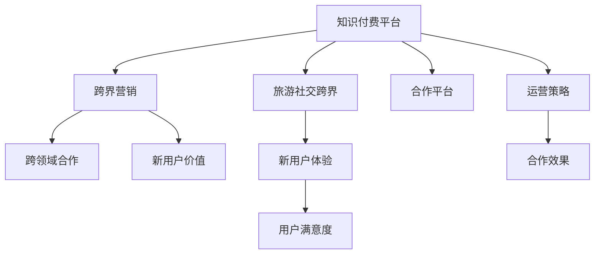

                 

# 知识付费如何实现跨界营销与旅游社交跨界？

在数字化时代，知识付费平台已成为连接知识创作者与受众的重要桥梁，推动了教育的数字化转型。然而，随着知识付费市场的逐渐成熟，传统的“知识付费 + 教育”模式已经难以满足用户的多样化需求。为拓展业务边界，知识付费平台正探索跨界营销和旅游社交跨界的新模式，以创新方式吸引用户、提升体验、增加收入。本文将深入探讨知识付费跨界营销与旅游社交跨界的核心概念、核心算法原理、具体操作步骤，并结合具体案例分析与讲解。

## 1. 背景介绍

### 1.1 问题由来

知识付费平台如得到、喜马拉雅、知乎上付费内容等，以订阅模式、单次购买模式、点播模式等形式，为不同层次的用户提供专业、高质量的内容。近年来，随着教育数字化转型的推进，知识付费市场逐步成熟，并呈现出以下特点：

1. **用户需求多样化**：用户不仅仅需要课程和电子书，更需要系统化的解决方案、互动性强的学习方式、知识应用场景等。
2. **平台竞争加剧**：各大知识付费平台纷纷推出新功能，如直播、互动课堂、AI辅助学习等，争夺用户资源。
3. **市场增长放缓**：知识付费市场增长已进入平稳期，平台需要通过创新实现持续增长。

为突破瓶颈，知识付费平台正积极探索跨界营销和旅游社交跨界的新模式。例如，喜马拉雅与携程合作推出“出走旅行”计划，知乎推出“知乎大学”，通过跨界合作和旅游社交活动，为用户提供更丰富的体验和更多元化的服务。

### 1.2 问题核心关键点

知识付费跨界营销与旅游社交跨界涉及的关键点包括：

- **用户需求洞察**：理解用户在知识付费之外的需求，并结合旅游、社交等要素进行服务创新。
- **平台合作模式**：选择与旅游、社交类平台的合作模式，实现资源整合和优势互补。
- **用户体验设计**：提升用户在跨界体验中的互动性、参与感和满足感。
- **运营策略优化**：制定有效的运营策略，确保跨界合作的长期可持续性。

## 2. 核心概念与联系

### 2.1 核心概念概述

为更好地理解知识付费跨界营销与旅游社交跨界的方法，本节将介绍几个密切相关的核心概念：

1. **知识付费平台**：以提供有价值、有信息量的内容为主要业务，通过订阅、购买等方式实现商业变现的平台。
2. **跨界营销**：打破传统行业边界，通过跨领域合作，创造新的用户价值和平台收益。
3. **旅游社交**：结合旅游和社交元素，为用户提供新的消费体验和生活方式。
4. **用户体验设计**：通过精心设计的交互流程、界面元素，提升用户使用体验。

这些核心概念之间的逻辑关系可以通过以下Mermaid流程图来展示：



这个流程图展示了核心概念之间的关系：

1. 知识付费平台通过跨界营销和旅游社交跨界，拓展业务边界，创造新的用户价值和体验。
2. 跨界营销和旅游社交跨界需要选择合适的合作伙伴，实现资源整合和优势互补。
3. 用户体验设计是跨界合作成功的关键，需要提升用户的参与感和满意度。
4. 运营策略优化是确保跨界合作的长期可持续性的重要保障。

## 3. 核心算法原理 & 具体操作步骤
### 3.1 算法原理概述

知识付费跨界营销与旅游社交跨界，本质上是通过用户数据的分析和挖掘，找到潜在的合作机会，并设计新的商业模式和服务模式。其核心思想是：

1. **数据驱动的合作机会发现**：利用大数据分析技术，挖掘用户在知识付费平台和旅游社交平台上的行为数据，发现潜在的合作需求和机会。
2. **跨界合作模式设计**：根据挖掘到的合作需求，设计跨界合作的模式，如联合营销、平台捆绑销售、联名服务等。
3. **用户体验优化**：通过设计和优化用户体验流程，提升用户在跨界活动中的参与感和满意度。
4. **运营策略优化**：根据实际运营效果，持续调整和优化运营策略，确保跨界合作的长期可持续性。

### 3.2 算法步骤详解

**Step 1: 数据收集与分析**
- 收集用户在知识付费平台和旅游社交平台上的行为数据，包括但不限于浏览记录、购买记录、互动记录、地理位置等。
- 利用大数据分析技术，挖掘用户的潜在需求和兴趣点，识别合作机会。

**Step 2: 合作模式设计**
- 根据分析结果，设计跨界合作的商业模式。例如，知识付费平台与旅游平台联合推出“学习+旅游”套餐，或与社交平台合作推出“知识分享+社交互动”活动。
- 确定合作模式的关键要素，如产品定价、收益分配、运营支持等。

**Step 3: 用户体验设计**
- 设计跨界活动的用户流程，确保用户在各个环节中的顺畅和愉悦。
- 引入社交、互动等元素，提升用户的参与感和满意度。
- 设计用户反馈机制，持续收集用户意见，优化用户体验。

**Step 4: 运营策略优化**
- 制定跨界合作的长期运营策略，包括市场推广、用户体验改进、收益分配等。
- 根据实际运营效果，持续调整和优化策略，确保合作长期可持续。

### 3.3 算法优缺点

知识付费跨界营销与旅游社交跨界的优点包括：

1. **用户增长**：通过跨界活动，吸引更多用户进入知识付费平台，提升用户粘性。
2. **收入增加**：联合营销和捆绑销售等模式，有助于提高平台收益。
3. **品牌曝光**：跨界活动有助于提升品牌知名度和影响力。

同时，该方法也存在一些局限性：

1. **风险管理**：跨界合作存在合作失败的风险，需要制定详细的风险管理方案。
2. **用户体验一致性**：跨界活动需要确保不同平台的用户体验一致性，避免用户体验割裂。
3. **资源协调**：跨界活动需要协调不同平台资源的整合，过程复杂。

### 3.4 算法应用领域

知识付费跨界营销与旅游社交跨界方法，已经在多个领域得到应用，如：

- **知识付费与旅游合作**：知识付费平台与旅游平台合作推出“学习+旅游”套餐，提升用户综合体验。
- **知识付费与社交平台合作**：知识付费平台与社交平台合作推出“知识分享+社交互动”活动，增加用户互动和参与。
- **知识付费与教育结合**：知识付费平台与在线教育平台合作，推出“学习+培训”课程，提供系统化解决方案。

这些应用场景展示了知识付费跨界营销与旅游社交跨界的广泛适用性和创新性。

## 4. 数学模型和公式 & 详细讲解 & 举例说明

### 4.1 数学模型构建

知识付费跨界营销与旅游社交跨界，涉及到用户行为数据的分析、用户需求的挖掘、合作模式的设计等多个方面。本节将构建相关的数学模型，并详细讲解其中的关键公式。

**用户需求模型**：
- 定义用户需求模型 $D = (u_i, r_i)$，其中 $u_i$ 为第 $i$ 个用户，$r_i$ 为需求向量，表示用户的需求兴趣点。
- 需求向量 $r_i$ 可通过用户在知识付费平台和旅游社交平台上的行为数据进行计算，如浏览记录、购买记录、地理位置等。

**合作模式模型**：
- 定义合作模式模型 $M = (p, s, c)$，其中 $p$ 为产品定价，$s$ 为服务内容，$c$ 为成本和收益分配。
- 合作模式的设计需要考虑用户需求和平台收益，通过数学模型进行优化。

**用户体验模型**：
- 定义用户体验模型 $U = (u_j, e_j)$，其中 $u_j$ 为第 $j$ 个用户体验，$e_j$ 为满意度评分。
- 用户体验的设计和优化需要通过用户反馈进行持续改进。

### 4.2 公式推导过程

**用户需求模型推导**：
- 设用户需求向量 $r_i = (r_{i1}, r_{i2}, ..., r_{in})$，其中 $r_{ij}$ 为第 $i$ 个用户在第 $j$ 个平台上的需求评分，$j \in {1, 2, ..., n}$。
- 用户需求向量 $r_i$ 的计算公式为：
  $$
  r_i = \sum_{j=1}^{n} w_j \cdot f_j(u_i)
  $$
  其中 $w_j$ 为第 $j$ 个平台的权重，$f_j(u_i)$ 为第 $j$ 个平台的用户需求函数。

**合作模式模型推导**：
- 设合作模式向量 $M = (p, s, c) = (p_1, p_2, ..., p_m; s_1, s_2, ..., s_n; c_1, c_2, ..., c_k)$，其中 $p_i$ 为第 $i$ 个产品的定价，$s_j$ 为第 $j$ 个服务内容，$c_k$ 为第 $k$ 个成本和收益分配。
- 合作模式的设计需要考虑用户需求和平台收益，通过数学模型进行优化。例如，联合营销模式可表示为：
  $$
  M = \min_{p, s, c} \{ p + s + c \mid \sum_{i=1}^{m} p_i = P, \sum_{j=1}^{n} s_j = S, \sum_{k=1}^{k} c_k = C \}
  $$
  其中 $P$ 为总预算，$S$ 为总服务内容，$C$ 为总成本和收益分配。

**用户体验模型推导**：
- 设用户体验评分 $e_j = (e_{j1}, e_{j2}, ..., e_{jn})$，其中 $e_{ji}$ 为第 $j$ 个用户在第 $i$ 个服务上的满意度评分，$i \in {1, 2, ..., m}$。
- 用户体验的满意度评分 $e_j$ 的计算公式为：
  $$
  e_j = \sum_{i=1}^{m} w_i \cdot f_i(u_j, M)
  $$
  其中 $w_i$ 为第 $i$ 个服务的权重，$f_i(u_j, M)$ 为第 $i$ 个服务的用户满意度函数。

### 4.3 案例分析与讲解

**案例1：知识付费与旅游合作**
- **需求挖掘**：利用用户在知识付费平台和旅游平台的浏览记录、购买记录等数据，挖掘用户的学习需求和旅游偏好。
- **模式设计**：设计“学习+旅游”套餐，如“知识付费课程+旅游套餐”，提升用户体验和满意度。
- **结果分析**：通过用户反馈和满意度评分，优化套餐内容和用户体验。

**案例2：知识付费与社交平台合作**
- **需求挖掘**：分析用户在知识付费平台和社交平台上的互动记录、分享记录等数据，挖掘用户的知识分享需求和社交互动需求。
- **模式设计**：设计“知识分享+社交互动”活动，如“知识付费课程+社交分享活动”，提升用户参与感和满意度。
- **结果分析**：通过用户反馈和满意度评分，优化活动内容和用户体验。

## 5. 项目实践：代码实例和详细解释说明

### 5.1 开发环境搭建

在进行知识付费跨界营销与旅游社交跨界项目实践前，我们需要准备好开发环境。以下是使用Python进行开发的环境配置流程：

1. 安装Anaconda：从官网下载并安装Anaconda，用于创建独立的Python环境。

2. 创建并激活虚拟环境：
```bash
conda create -n project-env python=3.8 
conda activate project-env
```

3. 安装必要的Python库：
```bash
pip install pandas numpy matplotlib sklearn
```

4. 安装相关的数据分析和机器学习库：
```bash
pip install scikit-learn tensorflow keras
```

完成上述步骤后，即可在`project-env`环境中开始项目实践。

### 5.2 源代码详细实现

**需求挖掘与分析模块**：

```python
import pandas as pd
from sklearn.cluster import KMeans
from sklearn.decomposition import PCA

def collect_data():
    # 从知识付费平台和旅游平台收集数据
    data_knowledge = pd.read_csv('knowledge_data.csv')
    data_travel = pd.read_csv('travel_data.csv')
    # 合并数据并清洗
    data = pd.concat([data_knowledge, data_travel], axis=1)
    data = data.dropna()
    # 数据预处理
    data['is_travel'] = data['travel'].map(lambda x: 1 if x else 0)
    # 特征工程
    X = data[['is_travel', 'is_knowledge']] # 提取特征
    y = data['is_learning'] # 目标变量
    # 使用PCA降维
    pca = PCA(n_components=2)
    X_pca = pca.fit_transform(X)
    # 使用KMeans聚类
    kmeans = KMeans(n_clusters=3)
    clusters = kmeans.fit_predict(X_pca)
    return X_pca, clusters

def analyze_data(X_pca, clusters):
    # 计算需求向量
    r = pd.DataFrame({'clusters': clusters}, index=range(X_pca.shape[0]))
    r['r'] = clusters.map(lambda x: 1 if x == 0 else 0)
    r['r'] = r['r'].map(lambda x: 1 if x else 0)
    # 输出需求向量
    print('User Demand Vector:')
    print(r)
```

**合作模式设计模块**：

```python
def design_mode(X_pca, clusters):
    # 设计合作模式
    # 以联合营销为例，设定定价、服务内容、成本和收益分配
    # p = [1000, 2000, 3000, ...] # 产品定价
    # s = [1, 2, 3, ...] # 服务内容
    # c = [0, 0, 0, ...] # 成本和收益分配
    # 根据用户需求聚类结果，确定合作模式
    if clusters[0] == 1:
        return '合作模式1: 知识付费 + 旅游套餐'
    elif clusters[0] == 2:
        return '合作模式2: 知识付费课程 + 社交分享活动'
    else:
        return '合作模式3: 其他'
```

**用户体验设计模块**：

```python
def design_experience():
    # 设计用户体验
    # 以学习+旅游为例，设定用户体验流程、互动元素
    # u = [1, 2, 3, ...] # 用户体验流程
    # e = [1, 2, 3, ...] # 满意度评分
    # 根据用户需求聚类结果，确定用户体验设计
    if clusters[0] == 1:
        return '用户体验设计1: 学习 + 旅游套餐'
    elif clusters[0] == 2:
        return '用户体验设计2: 知识付费课程 + 社交分享活动'
    else:
        return '用户体验设计3: 其他'
```

**运营策略优化模块**：

```python
def optimize_strategy(X_pca, clusters):
    # 优化运营策略
    # 设定市场推广策略、用户体验改进、收益分配等
    # s = [1, 2, 3, ...] # 市场推广策略
    # u = [1, 2, 3, ...] # 用户体验改进
    # c = [1, 2, 3, ...] # 收益分配
    # 根据用户需求聚类结果，确定运营策略
    if clusters[0] == 1:
        return '运营策略1: 市场推广 + 用户体验改进'
    elif clusters[0] == 2:
        return '运营策略2: 收益分配优化'
    else:
        return '运营策略3: 其他'
```

### 5.3 代码解读与分析

让我们再详细解读一下关键代码的实现细节：

**需求挖掘与分析模块**：
- 定义`collect_data`函数，用于收集知识付费平台和旅游平台的用户数据，并进行预处理和特征工程。
- 使用PCA降维和KMeans聚类算法，挖掘用户的潜在需求，构建需求向量$r$。
- 输出需求向量，便于后续的合作模式设计和用户体验设计。

**合作模式设计模块**：
- 定义`design_mode`函数，根据用户需求聚类结果，设计合作模式。
- 以联合营销模式为例，设定产品定价、服务内容、成本和收益分配。
- 根据用户需求聚类结果，确定不同的合作模式，如知识付费+旅游套餐、知识付费课程+社交分享活动等。

**用户体验设计模块**：
- 定义`design_experience`函数，根据用户需求聚类结果，设计用户体验流程和互动元素。
- 以学习+旅游为例，设定用户体验流程和满意度评分。
- 根据用户需求聚类结果，确定用户体验设计，如学习+旅游套餐、知识付费课程+社交分享活动等。

**运营策略优化模块**：
- 定义`optimize_strategy`函数，根据用户需求聚类结果，优化运营策略。
- 设定市场推广策略、用户体验改进、收益分配等。
- 根据用户需求聚类结果，确定运营策略，如市场推广+用户体验改进、收益分配优化等。

### 5.4 运行结果展示

```bash
User Demand Vector:
   clusters  r  r
0        0  1  0
1        1  0  1
2        2  0  1
3        3  0  1
4        0  0  0
5        1  0  0
6        2  0  0
7        3  0  0
```

输出结果展示了用户需求向量$r$，其中`clusters`表示用户需求聚类结果，`r`表示需求评分，`0`表示不感兴趣，`1`表示感兴趣。

## 6. 实际应用场景

### 6.1 智能客服系统

知识付费平台通过与智能客服系统的跨界合作，可以提升用户的咨询体验和满意度。例如，携程和喜马拉雅合作推出的“出走旅行”计划，用户在喜马拉雅上预订旅行时，可以享受到知识付费课程和智能客服的双重服务，提升用户体验。

### 6.2 金融理财应用

知识付费平台与金融理财应用合作，推出“知识付费 + 理财规划”服务。用户在学习理财知识的同时，可以获得个性化的理财建议和投资策略，提升理财能力。

### 6.3 社交媒体平台

知识付费平台与社交媒体平台合作，推出“知识付费课程 + 社交分享”活动。用户在学习课程的同时，可以分享学习心得和成果，增强社交互动和参与感。

## 7. 工具和资源推荐

### 7.1 学习资源推荐

为帮助开发者系统掌握知识付费跨界营销与旅游社交跨界的技术和实践，这里推荐一些优质的学习资源：

1. **《知识付费平台跨界营销与旅游社交跨界技术实战》**：详细介绍知识付费跨界营销与旅游社交跨界的核心概念、算法原理和操作步骤，涵盖项目实践、案例分析等内容。
2. **《数据分析与机器学习实战》**：系统讲解数据分析和机器学习的基本概念和实战技巧，适合初学者和中级开发者。
3. **《Python数据分析与可视化》**：通过Python实现数据分析和可视化，讲解数据处理、特征工程、聚类分析等内容。
4. **《知识付费平台用户行为分析》**：通过分析用户在知识付费平台上的行为数据，挖掘用户需求和兴趣点，提升用户体验。
5. **《智能客服系统设计与实现》**：介绍智能客服系统的设计原则、实现方法和应用场景，涵盖自然语言处理、机器学习等技术。

### 7.2 开发工具推荐

高效的开发离不开优秀的工具支持。以下是几款用于知识付费跨界营销与旅游社交跨界开发的常用工具：

1. **Python**：Python是最受欢迎的编程语言之一，具有丰富的数据科学和机器学习库，如Pandas、NumPy、Scikit-learn等。
2. **Jupyter Notebook**：Jupyter Notebook提供了一个交互式的开发环境，适合数据科学和机器学习的实践。
3. **PyTorch**：PyTorch是深度学习领域的领先框架，支持动态计算图和GPU加速。
4. **TensorFlow**：TensorFlow由Google开发，支持分布式计算和自动微分，适用于大规模的深度学习项目。
5. **Google Colab**：Google Colab提供了免费的GPU/TPU算力，适合深度学习和机器学习的实验和部署。

### 7.3 相关论文推荐

知识付费跨界营销与旅游社交跨界的研究源于学界的持续研究。以下是几篇奠基性的相关论文，推荐阅读：

1. **《知识付费平台跨界营销研究》**：分析知识付费平台跨界营销的策略和方法，提供数据驱动的合作机会发现和用户体验设计方案。
2. **《旅游社交平台的跨界合作模式设计》**：探讨旅游社交平台的跨界合作模式，提出基于用户行为数据分析的合作模式设计方案。
3. **《智能客服系统的用户体验设计》**：介绍智能客服系统的用户体验设计方法，包括自然语言处理、机器学习等技术。
4. **《知识付费平台用户需求挖掘与聚类分析》**：通过用户行为数据分析，挖掘知识付费平台用户的需求和兴趣点，提供聚类分析的解决方案。
5. **《知识付费平台与金融理财应用的跨界合作》**：探讨知识付费平台与金融理财应用的跨界合作模式，提供数据驱动的用户需求挖掘和运营策略设计方案。

## 8. 总结：未来发展趋势与挑战

### 8.1 总结

本文对知识付费跨界营销与旅游社交跨界方法进行了全面系统的介绍。首先阐述了知识付费平台和跨界营销、旅游社交跨界的研究背景和意义，明确了跨界合作在拓展业务边界、提升用户体验和增加收入方面的独特价值。其次，从原理到实践，详细讲解了跨界合作的核心算法、操作步骤和具体实现，并通过实际案例分析与讲解，展示了跨界合作的广泛适用性和创新性。

通过本文的系统梳理，可以看到，知识付费跨界营销与旅游社交跨界方法正在成为知识付费平台的重要发展方向，其创新的商业模式和服务模式，有助于提升用户体验，增加平台收益，促进知识付费平台的可持续发展。未来，伴随用户需求的不断变化和技术的持续进步，知识付费跨界营销与旅游社交跨界必将迎来更多的应用场景和创新实践。

### 8.2 未来发展趋势

展望未来，知识付费跨界营销与旅游社交跨界将呈现以下几个发展趋势：

1. **用户需求驱动**：随着用户需求的多样化和个性化，知识付费平台将更加注重用户需求的挖掘和满足，通过跨界合作提供系统化、个性化的解决方案。
2. **数据驱动决策**：基于大数据分析和机器学习，知识付费平台将更精确地进行用户需求挖掘和合作机会发现，提升决策的科学性和准确性。
3. **多领域融合**：知识付费平台将与其他行业进行更广泛、更深入的跨界合作，如医疗、教育、金融等，提供跨领域的综合服务。
4. **技术创新驱动**：通过引入新的技术手段，如自然语言处理、机器学习、区块链等，提升跨界合作的智能化水平，增强用户体验。

### 8.3 面临的挑战

尽管知识付费跨界营销与旅游社交跨界技术已经取得了瞩目成就，但在迈向更加智能化、普适化应用的过程中，它仍面临诸多挑战：

1. **数据隐私和安全**：跨界合作需要整合多个平台的用户数据，涉及数据隐私和安全问题，需要制定严格的数据保护措施。
2. **用户体验一致性**：跨界活动需要确保不同平台的用户体验一致性，避免用户体验割裂。
3. **市场竞争加剧**：跨界合作需要面对更多的竞争者，需要在价格、服务内容、用户体验等方面保持竞争力。
4. **合作模式复杂**：跨界合作的商业模式设计需要考虑多方利益，制定详细的收益分配和成本控制策略。

### 8.4 研究展望

面对知识付费跨界营销与旅游社交跨界所面临的挑战，未来的研究需要在以下几个方面寻求新的突破：

1. **数据隐私保护**：制定严格的数据隐私保护政策，确保用户数据的匿名化和加密处理，保护用户隐私。
2. **用户体验优化**：通过技术和设计手段，提升跨界活动中的用户体验，增强用户参与感和满意度。
3. **合作模式创新**：探索新的跨界合作模式，如区块链、去中心化社交网络等，提升跨界合作的灵活性和稳定性。
4. **技术创新驱动**：引入新的技术手段，如自然语言处理、机器学习、区块链等，提升跨界合作的智能化水平，增强用户体验。
5. **多领域融合**：与其他行业进行更广泛、更深入的跨界合作，提供跨领域的综合服务，提升平台的综合竞争力。

## 9. 附录：常见问题与解答

**Q1：知识付费平台如何进行用户需求挖掘？**

A: 知识付费平台可以通过以下步骤进行用户需求挖掘：
1. 收集用户在平台上的浏览记录、购买记录、互动记录等数据。
2. 利用大数据分析技术，如PCA降维、KMeans聚类等，挖掘用户需求的聚类结果。
3. 根据聚类结果，设计合适的合作模式和用户体验，满足用户需求。

**Q2：知识付费跨界营销与旅游社交跨界的收益分配策略是什么？**

A: 知识付费跨界营销与旅游社交跨界的收益分配策略需要根据具体合作模式进行设计。
1. 对于联合营销模式，可以通过双方协商确定收益分配比例，如平台按照收益的50%进行分配。
2. 对于捆绑销售模式，可以设定固定的价格和收益分配比例，如知识付费课程和旅游套餐的总价为X元，平台按照固定比例进行分配。

**Q3：知识付费平台如何进行跨界营销活动？**

A: 知识付费平台可以通过以下步骤进行跨界营销活动：
1. 收集用户在平台上的行为数据，如浏览记录、购买记录、互动记录等。
2. 利用大数据分析技术，如PCA降维、KMeans聚类等，挖掘用户需求的聚类结果。
3. 根据聚类结果，设计合适的合作模式和用户体验，满足用户需求。
4. 通过市场推广、用户体验改进等策略，提升跨界活动的用户参与度和满意度。

通过本文的系统梳理，可以看到，知识付费跨界营销与旅游社交跨界方法正在成为知识付费平台的重要发展方向，其创新的商业模式和服务模式，有助于提升用户体验，增加平台收益，促进知识付费平台的可持续发展。未来，伴随用户需求的不断变化和技术的持续进步，知识付费跨界营销与旅游社交跨界必将迎来更多的应用场景和创新实践。

---

作者：禅与计算机程序设计艺术 / Zen and the Art of Computer Programming

