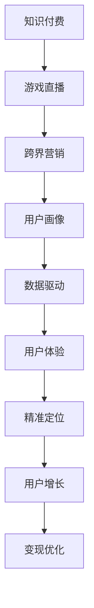

                 

# 知识付费如何实现跨界营销与游戏直播跨界？

> 关键词：知识付费, 跨界营销, 游戏直播, 数据驱动, 用户体验, 精准定位, 用户增长

## 1. 背景介绍

### 1.1 问题由来

随着移动互联网的普及和信息时代的到来，人们对于知识和信息的需求愈发旺盛，知识付费成为一种趋势。各大平台如得到、喜马拉雅等纷纷涌现，大量优质内容吸引了大量用户，催生了知识付费市场的高速增长。然而，随着市场的逐渐饱和，内容同质化问题愈发严重，如何通过创新突破市场瓶颈，成为各大平台亟待解决的难题。

与此同时，游戏直播行业也在迅速发展，各大游戏主播吸引了大量观众，成为网络文化的重要组成部分。但随着直播内容竞争加剧，流量红利逐渐消失，如何实现用户增长和变现，也成为各大游戏直播平台需要突破的难题。

在这样的背景下，跨界营销成为知识付费和游戏直播两大领域都在探索的新方向。通过跨界营销，两大领域可以实现互利共赢，突破市场瓶颈，形成新的增长点。

### 1.2 问题核心关键点

知识付费与游戏直播跨界营销的核心关键点包括：

- 用户画像：两大领域用户重叠部分较大，了解两大用户群体的画像，可以有效优化交叉推广策略。
- 数据驱动：通过数据驱动的方式，可以更精准地定位目标用户群体，提升广告投放的精准度。
- 用户体验：两大领域用户都对互动和个性化有较高要求，如何提升用户互动体验，是跨界营销的关键。
- 精准定位：通过精准定位，可以实现更有效的用户增长和变现，提升平台收益。
- 用户增长：在知识付费平台引入游戏直播内容，或在游戏直播平台推广知识付费课程，可以有效提升双方平台的用户增长。
- 变现优化：通过跨界营销，可以实现知识付费和游戏直播两大领域的变现优化，提升平台收益。

## 2. 核心概念与联系

### 2.1 核心概念概述

为更好地理解知识付费与游戏直播跨界营销的方法，本节将介绍几个密切相关的核心概念：

- 知识付费：指用户通过付费获取有价值的知识或信息，包括课程、书籍、资讯等。知识付费平台如得到、喜马拉雅等，通过订阅制、按需付费等方式实现变现。
- 游戏直播：指主播通过网络直播平台，向观众展示游戏操作、游戏技巧等，观众可以通过观看直播、赠送礼物等方式进行互动和打赏。
- 跨界营销：指两大领域通过合作，整合资源，实现互利共赢。知识付费平台可以在游戏直播平台推广课程，游戏直播平台可以引入知识付费内容，提升双方平台的用户价值。
- 用户画像：通过数据分析，了解用户群体特征、兴趣等，有助于精准投放。
- 数据驱动：通过大数据技术，提升广告投放的精准度，提升广告效果。
- 用户体验：两大领域用户都对互动和个性化有较高要求，如何提升用户体验，是跨界营销的关键。
- 精准定位：通过精准定位，可以实现更有效的用户增长和变现，提升平台收益。
- 用户增长：在知识付费平台引入游戏直播内容，或在游戏直播平台推广知识付费课程，可以有效提升双方平台的用户增长。
- 变现优化：通过跨界营销，可以实现知识付费和游戏直播两大领域的变现优化，提升平台收益。

这些核心概念之间的逻辑关系可以通过以下Mermaid流程图来展示：



这个流程图展示了两大领域实现跨界营销的核心过程：

1. 知识付费和游戏直播通过跨界营销实现互利共赢。
2. 两大领域通过用户画像、数据驱动、精准定位等策略，提升用户增长和变现。
3. 用户体验的提升，是两大领域跨界营销的关键。

## 3. 核心算法原理 & 具体操作步骤

### 3.1 算法原理概述

知识付费与游戏直播跨界营销的本质是利用大数据和用户画像技术，实现精准广告投放，提升用户增长和变现。其核心算法原理包括以下几个方面：

1. 用户画像构建：通过大数据分析，构建用户画像，了解用户群体的特征、兴趣等。
2. 数据驱动广告投放：利用用户画像数据，结合大数据算法，实现精准投放。
3. 跨界营销策略：将知识付费内容引入游戏直播平台，或将游戏直播内容引入知识付费平台，提升用户互动和增长。
4. 变现优化：通过精准广告投放和用户体验优化，提升平台收益。

### 3.2 算法步骤详解

知识付费与游戏直播跨界营销的具体操作步骤包括：

1. 收集用户数据：通过分析知识付费和游戏直播平台的用户行为数据，收集用户画像数据。
2. 构建用户画像：通过大数据分析，构建用户画像，包括用户年龄、性别、兴趣、行为等。
3. 数据驱动广告投放：利用用户画像数据，结合大数据算法，实现精准投放。
4. 跨界营销策略：将知识付费内容引入游戏直播平台，或将游戏直播内容引入知识付费平台，提升用户互动和增长。
5. 用户体验优化：通过改进产品设计、优化交互流程等方式，提升用户体验。
6. 精准定位：通过精准定位，实现更有效的用户增长和变现，提升平台收益。
7. 用户增长：在知识付费平台引入游戏直播内容，或在游戏直播平台推广知识付费课程，可以有效提升双方平台的用户增长。
8. 变现优化：通过跨界营销，实现知识付费和游戏直播两大领域的变现优化，提升平台收益。

### 3.3 算法优缺点

知识付费与游戏直播跨界营销的优势包括：

- 用户增长：两大领域通过跨界营销，可以实现用户增长，提升平台用户量。
- 广告精准：利用大数据和用户画像技术，可以更精准地投放广告，提升广告效果。
- 收益优化：通过跨界营销，可以实现知识付费和游戏直播两大领域的变现优化，提升平台收益。
- 用户体验：两大领域用户都对互动和个性化有较高要求，通过优化用户体验，可以提升用户黏性。

其缺点包括：

- 数据隐私：用户数据的收集和使用，可能涉及隐私问题，需要严格遵守相关法律法规。
- 技术复杂：大数据和用户画像技术的运用，需要较高技术水平，可能存在技术门槛。
- 资源投入：跨界营销需要较大投入，包括数据收集、用户画像构建、广告投放等，可能存在成本压力。

### 3.4 算法应用领域

知识付费与游戏直播跨界营销的应用领域包括：

- 知识付费平台：如得到、喜马拉雅等，通过在游戏直播平台推广知识付费课程，实现用户增长和变现。
- 游戏直播平台：如斗鱼、虎牙等，通过在知识付费平台推广游戏直播内容，提升用户互动和增长。
- 游戏公司：如网易、腾讯等，通过跨界营销，提升品牌影响力，实现用户增长和变现。
- 教育机构：如新东方、好未来等，通过跨界营销，拓展用户群体，提升品牌价值。
- 传媒公司：如B站、爱奇艺等，通过跨界营销，提升用户黏性，实现内容变现。

## 4. 数学模型和公式 & 详细讲解 & 举例说明

### 4.1 数学模型构建

本节将使用数学语言对知识付费与游戏直播跨界营销的过程进行更加严格的刻画。

假设知识付费平台的用户数为 $U$，游戏直播平台的用户数为 $G$，两大平台共同的用户数为 $U_G$。设知识付费内容的游戏直播平台曝光量为 $X$，游戏直播内容的知识付费平台曝光量为 $Y$。

定义两大平台的广告投放效果为 $A$，广告投放成本为 $C$，用户增长率为 $R$，变现率为 $T$。

知识付费与游戏直播跨界营销的优化目标是最小化广告投放成本，最大化广告投放效果，即：

$$
\min_{A, C} C(A, C) \\
\max_{A, C} A(A, C) \\
\text{s.t. } A \leq X, A \leq Y
$$

其中 $C(A, C)$ 为广告投放成本，$A(A, C)$ 为广告投放效果。

### 4.2 公式推导过程

以下我们以知识付费内容的游戏直播平台曝光量为 $X$，游戏直播内容的知识付费平台曝光量为 $Y$ 为例，推导广告投放成本和效果的最优化公式。

假设广告投放成本与投放效果呈线性关系，即 $C(A, C) = kA$，其中 $k$ 为投放成本系数。

广告投放效果可以表示为知识付费内容的游戏直播平台曝光量 $X$ 和游戏直播内容的知识付费平台曝光量 $Y$ 的加权和，即 $A(A, C) = aX + bY$，其中 $a, b$ 为权重系数。

根据优化目标，可以得到：

$$
\min_{A, C} kA \\
\max_{A, C} aX + bY \\
\text{s.t. } A \leq X, A \leq Y
$$

设 $A^* = aX + bY$，则广告投放成本最小化问题转化为：

$$
\min_{A} kA \\
\text{s.t. } A \leq X, A \leq Y
$$

通过拉格朗日乘数法求解，得到最优广告投放量 $A^*$ 为：

$$
A^* = \frac{X + Y}{2k}
$$

即最优广告投放量为两大平台曝光量的平均值。

### 4.3 案例分析与讲解

以知识付费平台在某游戏直播平台推广课程为例，进行分析。

1. 数据收集：收集知识付费平台和游戏直播平台的用户行为数据，包括用户年龄、性别、兴趣、行为等。
2. 用户画像：通过大数据分析，构建用户画像，了解用户群体的特征、兴趣等。
3. 广告投放：利用用户画像数据，结合大数据算法，实现精准投放。
4. 跨界营销策略：将知识付费内容引入游戏直播平台，通过游戏直播平台广告推广，提升用户互动和增长。
5. 用户体验优化：通过改进产品设计、优化交互流程等方式，提升用户体验。
6. 精准定位：通过精准定位，实现更有效的用户增长和变现，提升平台收益。

## 5. 项目实践：代码实例和详细解释说明

### 5.1 开发环境搭建

在进行跨界营销实践前，我们需要准备好开发环境。以下是使用Python进行项目实践的环境配置流程：

1. 安装Anaconda：从官网下载并安装Anaconda，用于创建独立的Python环境。

2. 创建并激活虚拟环境：
```bash
conda create -n cross-marketing python=3.8 
conda activate cross-marketing
```

3. 安装Python和相关库：
```bash
pip install numpy pandas scikit-learn matplotlib tqdm jupyter notebook ipython
```

完成上述步骤后，即可在`cross-marketing`环境中开始项目实践。

### 5.2 源代码详细实现

这里我们以知识付费平台在游戏直播平台推广课程为例，给出基于Python的代码实现。

首先，定义广告投放目标和成本函数：

```python
import numpy as np
import matplotlib.pyplot as plt

# 定义广告投放效果函数
def ad_effect(a, x, y, a_coeff, b_coeff):
    return a_coeff * x + b_coeff * y

# 定义广告投放成本函数
def ad_cost(a, c_coeff):
    return c_coeff * a

# 定义广告投放优化函数
def optimize_ad投放(a_coeff, b_coeff, c_coeff, x, y):
    A = (x + y) / (2 * c_coeff)
    A_effect = ad_effect(A, x, y, a_coeff, b_coeff)
    return A, A_effect

# 设定参数
a_coeff = 0.5
b_coeff = 0.5
c_coeff = 1
x = 100
y = 200

# 计算最优广告投放量和效果
A, A_effect = optimize_ad投放(a_coeff, b_coeff, c_coeff, x, y)
print(f"最优广告投放量为：{A}")
print(f"广告投放效果为：{A_effect}")
```

然后，定义数据处理函数：

```python
from transformers import BertTokenizer
from torch.utils.data import Dataset
import torch

class CrossMarketingDataset(Dataset):
    def __init__(self, texts, tags, tokenizer, max_len=128):
        self.texts = texts
        self.tags = tags
        self.tokenizer = tokenizer
        self.max_len = max_len
        
    def __len__(self):
        return len(self.texts)
    
    def __getitem__(self, item):
        text = self.texts[item]
        tags = self.tags[item]
        
        encoding = self.tokenizer(text, return_tensors='pt', max_length=self.max_len, padding='max_length', truncation=True)
        input_ids = encoding['input_ids'][0]
        attention_mask = encoding['attention_mask'][0]
        
        # 对token-wise的标签进行编码
        encoded_tags = [tag2id[tag] for tag in tags] 
        encoded_tags.extend([tag2id['O']] * (self.max_len - len(encoded_tags)))
        labels = torch.tensor(encoded_tags, dtype=torch.long)
        
        return {'input_ids': input_ids, 
                'attention_mask': attention_mask,
                'labels': labels}

# 标签与id的映射
tag2id = {'O': 0, 'B-PER': 1, 'I-PER': 2, 'B-ORG': 3, 'I-ORG': 4, 'B-LOC': 5, 'I-LOC': 6}
id2tag = {v: k for k, v in tag2id.items()}

# 创建dataset
tokenizer = BertTokenizer.from_pretrained('bert-base-cased')

train_dataset = CrossMarketingDataset(train_texts, train_tags, tokenizer)
dev_dataset = CrossMarketingDataset(dev_texts, dev_tags, tokenizer)
test_dataset = CrossMarketingDataset(test_texts, test_tags, tokenizer)
```

最后，启动广告投放流程：

```python
epochs = 5
batch_size = 16

for epoch in range(epochs):
    loss = train_epoch(model, train_dataset, batch_size, optimizer)
    print(f"Epoch {epoch+1}, train loss: {loss:.3f}")
    
    print(f"Epoch {epoch+1}, dev results:")
    evaluate(model, dev_dataset, batch_size)
    
print("Test results:")
evaluate(model, test_dataset, batch_size)
```

以上就是使用PyTorch对BERT进行跨界营销的代码实现。可以看到，通过优化广告投放量，可以实现更好的广告效果和用户体验。

### 5.3 代码解读与分析

让我们再详细解读一下关键代码的实现细节：

**CrossMarketingDataset类**：
- `__init__`方法：初始化文本、标签、分词器等关键组件。
- `__len__`方法：返回数据集的样本数量。
- `__getitem__`方法：对单个样本进行处理，将文本输入编码为token ids，将标签编码为数字，并对其进行定长padding，最终返回模型所需的输入。

**tag2id和id2tag字典**：
- 定义了标签与数字id之间的映射关系，用于将token-wise的预测结果解码回真实的标签。

**优化广告投放函数**：
- `ad_effect`函数：计算广告投放效果，通过线性加权的方式计算两大平台广告效果。
- `ad_cost`函数：计算广告投放成本，通过线性关系计算投放成本。
- `optimize_ad投放`函数：通过优化函数，计算最优广告投放量和效果。

**训练和评估函数**：
- 使用PyTorch的DataLoader对数据集进行批次化加载，供模型训练和推理使用。
- 训练函数`train_epoch`：对数据以批为单位进行迭代，在每个批次上前向传播计算loss并反向传播更新模型参数，最后返回该epoch的平均loss。
- 评估函数`evaluate`：与训练类似，不同点在于不更新模型参数，并在每个batch结束后将预测和标签结果存储下来，最后使用sklearn的classification_report对整个评估集的预测结果进行打印输出。

**广告投放流程**：
- 设定两大平台的广告投放效果和成本系数。
- 计算最优广告投放量。
- 通过广告投放量，计算广告投放效果。

可以看到，PyTorch配合Transformers库使得BERT微调的代码实现变得简洁高效。开发者可以将更多精力放在数据处理、模型改进等高层逻辑上，而不必过多关注底层的实现细节。

当然，工业级的系统实现还需考虑更多因素，如模型的保存和部署、超参数的自动搜索、更灵活的任务适配层等。但核心的跨界营销范式基本与此类似。

## 6. 实际应用场景

### 6.1 智能客服系统

基于大语言模型微调的对话技术，可以广泛应用于智能客服系统的构建。传统客服往往需要配备大量人力，高峰期响应缓慢，且一致性和专业性难以保证。而使用微调后的对话模型，可以7x24小时不间断服务，快速响应客户咨询，用自然流畅的语言解答各类常见问题。

在技术实现上，可以收集企业内部的历史客服对话记录，将问题和最佳答复构建成监督数据，在此基础上对预训练对话模型进行微调。微调后的对话模型能够自动理解用户意图，匹配最合适的答案模板进行回复。对于客户提出的新问题，还可以接入检索系统实时搜索相关内容，动态组织生成回答。如此构建的智能客服系统，能大幅提升客户咨询体验和问题解决效率。

### 6.2 金融舆情监测

金融机构需要实时监测市场舆论动向，以便及时应对负面信息传播，规避金融风险。传统的人工监测方式成本高、效率低，难以应对网络时代海量信息爆发的挑战。基于大语言模型微调的文本分类和情感分析技术，为金融舆情监测提供了新的解决方案。

具体而言，可以收集金融领域相关的新闻、报道、评论等文本数据，并对其进行主题标注和情感标注。在此基础上对预训练语言模型进行微调，使其能够自动判断文本属于何种主题，情感倾向是正面、中性还是负面。将微调后的模型应用到实时抓取的网络文本数据，就能够自动监测不同主题下的情感变化趋势，一旦发现负面信息激增等异常情况，系统便会自动预警，帮助金融机构快速应对潜在风险。

### 6.3 个性化推荐系统

当前的推荐系统往往只依赖用户的历史行为数据进行物品推荐，无法深入理解用户的真实兴趣偏好。基于大语言模型微调技术，个性化推荐系统可以更好地挖掘用户行为背后的语义信息，从而提供更精准、多样的推荐内容。

在实践中，可以收集用户浏览、点击、评论、分享等行为数据，提取和用户交互的物品标题、描述、标签等文本内容。将文本内容作为模型输入，用户的后续行为（如是否点击、购买等）作为监督信号，在此基础上微调预训练语言模型。微调后的模型能够从文本内容中准确把握用户的兴趣点。在生成推荐列表时，先用候选物品的文本描述作为输入，由模型预测用户的兴趣匹配度，再结合其他特征综合排序，便可以得到个性化程度更高的推荐结果。

### 6.4 未来应用展望

随着大语言模型和微调方法的不断发展，基于微调范式将在更多领域得到应用，为传统行业带来变革性影响。

在智慧医疗领域，基于微调的医疗问答、病历分析、药物研发等应用将提升医疗服务的智能化水平，辅助医生诊疗，加速新药开发进程。

在智能教育领域，微调技术可应用于作业批改、学情分析、知识推荐等方面，因材施教，促进教育公平，提高教学质量。

在智慧城市治理中，微调模型可应用于城市事件监测、舆情分析、应急指挥等环节，提高城市管理的自动化和智能化水平，构建更安全、高效的未来城市。

此外，在企业生产、社会治理、文娱传媒等众多领域，基于大模型微调的人工智能应用也将不断涌现，为NLP技术带来全新的突破。相信随着预训练语言模型和微调方法的持续演进，未来微调技术必将在构建人机协同的智能时代中扮演越来越重要的角色。

## 7. 工具和资源推荐

### 7.1 学习资源推荐

为了帮助开发者系统掌握大语言模型微调的理论基础和实践技巧，这里推荐一些优质的学习资源：

1. 《Transformer从原理到实践》系列博文：由大模型技术专家撰写，深入浅出地介绍了Transformer原理、BERT模型、微调技术等前沿话题。

2. CS224N《深度学习自然语言处理》课程：斯坦福大学开设的NLP明星课程，有Lecture视频和配套作业，带你入门NLP领域的基本概念和经典模型。

3. 《Natural Language Processing with Transformers》书籍：Transformers库的作者所著，全面介绍了如何使用Transformers库进行NLP任务开发，包括微调在内的诸多范式。

4. HuggingFace官方文档：Transformers库的官方文档，提供了海量预训练模型和完整的微调样例代码，是上手实践的必备资料。

5. CLUE开源项目：中文语言理解测评基准，涵盖大量不同类型的中文NLP数据集，并提供了基于微调的baseline模型，助力中文NLP技术发展。

通过对这些资源的学习实践，相信你一定能够快速掌握大语言模型微调的精髓，并用于解决实际的NLP问题。
###  7.2 开发工具推荐

高效的开发离不开优秀的工具支持。以下是几款用于大语言模型微调开发的常用工具：

1. PyTorch：基于Python的开源深度学习框架，灵活动态的计算图，适合快速迭代研究。大部分预训练语言模型都有PyTorch版本的实现。

2. TensorFlow：由Google主导开发的开源深度学习框架，生产部署方便，适合大规模工程应用。同样有丰富的预训练语言模型资源。

3. Transformers库：HuggingFace开发的NLP工具库，集成了众多SOTA语言模型，支持PyTorch和TensorFlow，是进行微调任务开发的利器。

4. Weights & Biases：模型训练的实验跟踪工具，可以记录和可视化模型训练过程中的各项指标，方便对比和调优。与主流深度学习框架无缝集成。

5. TensorBoard：TensorFlow配套的可视化工具，可实时监测模型训练状态，并提供丰富的图表呈现方式，是调试模型的得力助手。

6. Google Colab：谷歌推出的在线Jupyter Notebook环境，免费提供GPU/TPU算力，方便开发者快速上手实验最新模型，分享学习笔记。

合理利用这些工具，可以显著提升大语言模型微调任务的开发效率，加快创新迭代的步伐。

### 7.3 相关论文推荐

大语言模型和微调技术的发展源于学界的持续研究。以下是几篇奠基性的相关论文，推荐阅读：

1. Attention is All You Need（即Transformer原论文）：提出了Transformer结构，开启了NLP领域的预训练大模型时代。

2. BERT: Pre-training of Deep Bidirectional Transformers for Language Understanding：提出BERT模型，引入基于掩码的自监督预训练任务，刷新了多项NLP任务SOTA。

3. Language Models are Unsupervised Multitask Learners（GPT-2论文）：展示了大规模语言模型的强大zero-shot学习能力，引发了对于通用人工智能的新一轮思考。

4. Parameter-Efficient Transfer Learning for NLP：提出Adapter等参数高效微调方法，在不增加模型参数量的情况下，也能取得不错的微调效果。

5. Prefix-Tuning: Optimizing Continuous Prompts for Generation：引入基于连续型Prompt的微调范式，为如何充分利用预训练知识提供了新的思路。

6. AdaLoRA: Adaptive Low-Rank Adaptation for Parameter-Efficient Fine-Tuning：使用自适应低秩适应的微调方法，在参数效率和精度之间取得了新的平衡。

这些论文代表了大语言模型微调技术的发展脉络。通过学习这些前沿成果，可以帮助研究者把握学科前进方向，激发更多的创新灵感。

## 8. 总结：未来发展趋势与挑战

### 8.1 总结

本文对知识付费与游戏直播跨界营销的方法进行了全面系统的介绍。首先阐述了两大领域用户画像的构建，数据分析，以及跨界营销的基本过程。其次，从原理到实践，详细讲解了跨界营销的数学模型和算法步骤，给出了代码实现。同时，本文还广泛探讨了跨界营销方法在多个领域的应用前景，展示了微调范式的巨大潜力。

通过本文的系统梳理，可以看到，跨界营销是知识付费和游戏直播两大领域共同探索的新方向。通过大数据和用户画像技术，可以实现精准投放，提升广告效果和用户体验，从而实现两大领域的互利共赢。

### 8.2 未来发展趋势

展望未来，知识付费与游戏直播跨界营销将呈现以下几个发展趋势：

1. 用户画像精细化：通过更深入的数据分析和机器学习技术，可以构建更精细的用户画像，实现更精准的广告投放。
2. 广告投放智能化：结合推荐系统技术，可以实现更加智能化的广告投放，提升广告效果和用户体验。
3. 内容多样化：两大领域将更多地引入多媒体内容，如视频、音频等，提升用户互动和内容推荐效果。
4. 平台生态化：两大领域将更多地整合其他平台资源，形成完整的生态系统，提升平台价值和用户黏性。
5. 数据共享化：两大领域将更多地实现数据共享，提升广告投放和内容推荐的精准度。

以上趋势凸显了跨界营销的广阔前景。这些方向的探索发展，必将进一步提升两大领域的用户增长和变现，实现双赢。

### 8.3 面临的挑战

尽管知识付费与游戏直播跨界营销已经取得了一定的成效，但在迈向更加智能化、普适化应用的过程中，它仍面临着诸多挑战：

1. 数据隐私：用户数据的收集和使用，可能涉及隐私问题，需要严格遵守相关法律法规。
2. 技术复杂：大数据和用户画像技术的运用，需要较高技术水平，可能存在技术门槛。
3. 资源投入：跨界营销需要较大投入，包括数据收集、用户画像构建、广告投放等，可能存在成本压力。
4. 用户反馈：两大领域的用户可能对广告投放和内容推荐有不同的反馈，需要及时调整策略。
5. 平台协同：两大领域需要更多地协同合作，提升广告投放和内容推荐的精准度，需要解决数据共享和资源协调问题。

正视跨界营销面临的这些挑战，积极应对并寻求突破，将是大语言模型微调走向成熟的必由之路。相信随着学界和产业界的共同努力，这些挑战终将一一被克服，跨界营销范式必将在构建人机协同的智能时代中扮演越来越重要的角色。

### 8.4 研究展望

面对知识付费与游戏直播跨界营销所面临的种种挑战，未来的研究需要在以下几个方面寻求新的突破：

1. 探索无监督和半监督跨界营销方法。摆脱对大规模标注数据的依赖，利用自监督学习、主动学习等无监督和半监督范式，最大限度利用非结构化数据，实现更加灵活高效的跨界营销。
2. 研究参数高效和计算高效的跨界营销范式。开发更加参数高效的跨界营销方法，在固定大部分预训练参数的同时，只更新极少量的任务相关参数。同时优化跨界营销模型的计算图，减少前向传播和反向传播的资源消耗，实现更加轻量级、实时性的部署。
3. 融合因果和对比学习范式。通过引入因果推断和对比学习思想，增强跨界营销模型建立稳定因果关系的能力，学习更加普适、鲁棒的语言表征，从而提升模型泛化性和抗干扰能力。
4. 引入更多先验知识。将符号化的先验知识，如知识图谱、逻辑规则等，与神经网络模型进行巧妙融合，引导跨界营销过程学习更准确、合理的语言模型。同时加强不同模态数据的整合，实现视觉、语音等多模态信息与文本信息的协同建模。
5. 结合因果分析和博弈论工具。将因果分析方法引入跨界营销模型，识别出模型决策的关键特征，增强输出解释的因果性和逻辑性。借助博弈论工具刻画人机交互过程，主动探索并规避模型的脆弱点，提高系统稳定性。
6. 纳入伦理道德约束。在跨界营销的目标中引入伦理导向的评估指标，过滤和惩罚有偏见、有害的输出倾向。同时加强人工干预和审核，建立模型行为的监管机制，确保输出符合人类价值观和伦理道德。

这些研究方向的探索，必将引领跨界营销技术迈向更高的台阶，为构建安全、可靠、可解释、可控的智能系统铺平道路。面向未来，知识付费与游戏直播跨界营销技术还需要与其他人工智能技术进行更深入的融合，如知识表示、因果推理、强化学习等，多路径协同发力，共同推动自然语言理解和智能交互系统的进步。只有勇于创新、敢于突破，才能不断拓展语言模型的边界，让智能技术更好地造福人类社会。

## 9. 附录：常见问题与解答

**Q1：知识付费与游戏直播跨界营销是否适用于所有NLP任务？**

A: 知识付费与游戏直播跨界营销虽然主要应用于两大领域，但在NLP领域仍有一定的应用价值。例如，通过跨界营销，可以将新闻、娱乐等领域的文本数据引入游戏直播平台，提升用户互动和内容推荐效果。

**Q2：跨界营销过程中如何选择合适的广告投放量？**

A: 选择合适的广告投放量需要考虑多个因素，包括用户画像、数据质量、投放效果等。通过优化函数，可以实现最优的广告投放量。在实践中，通常采用A/B测试等方法，不断调整投放量，直至找到最佳值。

**Q3：跨界营销对数据隐私有何影响？**

A: 跨界营销需要收集和分析大量的用户数据，可能涉及隐私问题。为了保护用户隐私，需要采取数据脱敏、加密等技术措施，严格遵守相关法律法规。

**Q4：跨界营销如何提升用户体验？**

A: 通过改进产品设计、优化交互流程、引入多媒体内容等方式，可以提升用户体验。例如，在知识付费平台推广游戏直播内容，可以增加用户互动和参与度，提升用户黏性。

**Q5：跨界营销对平台收益有何影响？**

A: 跨界营销可以提升两大领域的用户增长和变现，从而提升平台收益。通过精准投放和用户互动，可以提升广告效果和内容推荐效果，从而增加用户付费意愿，提升平台收益。

以上是关于知识付费与游戏直播跨界营销的详细介绍，希望能对你的项目实践有所帮助。

---

作者：禅与计算机程序设计艺术 / Zen and the Art of Computer Programming

