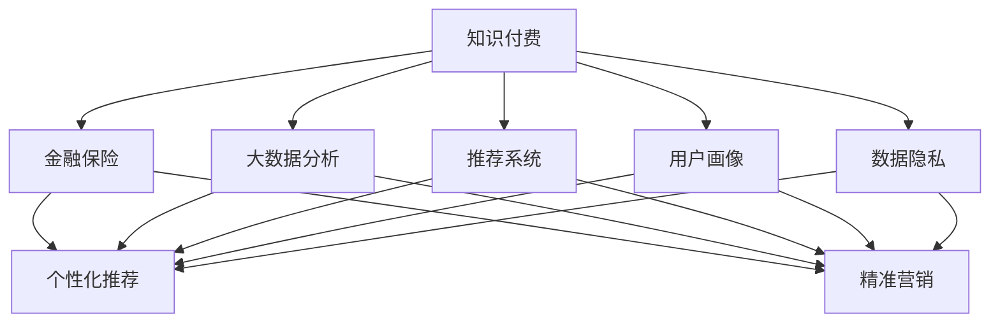

                 

# 知识付费如何实现跨界营销与金融保险跨界？

> 关键词：知识付费、跨界营销、金融保险、大数据分析、推荐系统、机器学习、用户体验

## 1. 背景介绍

### 1.1 问题由来

随着互联网技术的飞速发展，在线教育行业迎来了爆发式增长。知识付费成为一种新兴的学习方式，人们可以通过订阅课程、购买文章、听播客等方式，获取专业知识和技能。在知识付费市场中，平台之间的竞争日益激烈，如何提高用户粘性、提升转化率，成为每个知识付费平台关注的焦点。

同时，金融保险行业也面临着激烈的竞争。传统的线下代理模式面临着互联网金融的冲击，而在线保险产品也正在挑战传统保险销售模式。如何通过技术手段，提升金融保险产品销售效率，降低营销成本，是金融保险公司亟待解决的问题。

知识付费和金融保险，看似是两个完全不同的行业，但它们却有一个共同点：用户数量庞大、行为复杂，都需要大量的数据分析和个性化推荐来提升用户体验和销售转化率。这就为二者跨界合作提供了可能性。

### 1.2 问题核心关键点

通过跨界合作，知识付费平台可以更好地了解用户的金融需求，为其提供相关的金融产品推荐，从而提升用户粘性和转化率。金融保险公司也可以通过知识付费平台获取用户数据，更好地了解目标人群，提升产品销售效率。

问题关键点包括：
- 如何通过数据分析，挖掘用户行为特征，为用户推荐合适的金融产品？
- 知识付费平台和金融保险公司应如何协同合作，提升用户转化率和满意度？
- 如何保障数据安全和用户隐私，防止数据滥用和泄露？

### 1.3 问题研究意义

知识付费和金融保险跨界合作，具有重要的现实意义：
- 提升用户体验。通过数据分析，为用户提供个性化的金融产品推荐，提升用户满意度。
- 降低营销成本。利用知识付费平台的海量用户数据，降低金融保险公司获取目标用户的成本。
- 增强用户粘性。在知识付费平台上，增加金融产品相关的互动内容，提高用户对平台的忠诚度。
- 推动产业发展。通过跨界合作，推动知识付费和金融保险行业的协同发展，促进整个产业的升级和进步。

## 2. 核心概念与联系

### 2.1 核心概念概述

为更好地理解知识付费和金融保险跨界合作的实现方法，本节将介绍几个密切相关的核心概念：

- 知识付费(Knowledge Pay): 用户通过付费获取知识内容的在线教育模式。常见的形式包括在线课程、电子书、播客等。
- 金融保险(Financial Insurance): 提供风险管理和财务保障的行业，包括银行、保险、投资、理财等服务。
- 大数据分析(Big Data Analysis): 通过对海量数据进行收集、存储、分析，挖掘出有用的信息，辅助决策制定。
- 推荐系统(Recommendation System): 通过用户行为数据，为用户推荐感兴趣的内容或产品，提升用户体验和转化率。
- 用户画像(User Profile): 基于用户行为数据，构建用户特征模型，用于个性化推荐和精准营销。
- 数据隐私(Personal Privacy): 保护用户个人信息不被未经授权的第三方获取和利用，维护用户权益。

这些核心概念之间的逻辑关系可以通过以下Mermaid流程图来展示：



这个流程图展示出知识付费和金融保险之间的互动关系，以及核心概念之间的联系：

1. 知识付费通过大数据分析和推荐系统，为用户推荐金融产品，提高用户粘性。
2. 金融保险公司利用知识付费平台上的用户画像和数据隐私策略，进行精准营销。
3. 知识付费和金融保险的跨界合作，通过用户画像和数据隐私，实现双方的共赢。

## 3. 核心算法原理 & 具体操作步骤
### 3.1 算法原理概述

知识付费和金融保险跨界合作，本质上是一个跨领域的协同优化过程。其核心思想是：利用知识付费平台的大数据资源，对用户行为进行建模分析，为用户提供个性化的金融产品推荐。同时，金融保险公司也可以根据知识付费平台的用户画像和行为数据，进行精准的营销和销售。

形式化地，假设知识付费平台的用户为 $U$，用户行为数据为 $D=\{(x_i,y_i)\}_{i=1}^N$，其中 $x_i$ 为用户行为特征，$y_i$ 为金融产品标签。金融保险公司的产品库为 $P$，每款产品的特征向量为 $p_j$。推荐任务为：

$$
\text{Maximize} \sum_{i=1}^N \mathbb{P}(y_i \mid x_i) \log \hat{y}_i
$$

其中，$\mathbb{P}(y_i \mid x_i)$ 为基于用户行为数据的条件概率，$\hat{y}_i$ 为金融产品推荐得分。

金融保险公司的营销任务为：

$$
\text{Minimize} C(y_i) \log (1-\hat{y}_i)
$$

其中，$C(y_i)$ 为金融产品的转化成本，$\hat{y}_i$ 为金融产品推荐得分。

### 3.2 算法步骤详解

知识付费和金融保险跨界合作，一般包括以下几个关键步骤：

**Step 1: 准备数据集**
- 知识付费平台收集用户行为数据，包括浏览记录、购买记录、评分记录等，构建用户画像。
- 金融保险公司提供产品库和标签，形成金融产品的特征向量。

**Step 2: 数据预处理与特征工程**
- 对用户行为数据进行清洗、归一化、缺失值处理等预处理。
- 设计合适的特征工程，将用户行为数据映射为推荐系统的输入特征。
- 对金融产品标签进行编码，转化为数值型标签。

**Step 3: 模型训练与评估**
- 选择合适的推荐算法，如协同过滤、内容基推荐、混合推荐等，构建推荐模型。
- 在知识付费平台的用户行为数据上，对推荐模型进行训练，评估模型性能。
- 根据评估结果调整模型参数，优化推荐效果。

**Step 4: 模型部署与监控**
- 将训练好的推荐模型部署到线上环境，提供实时推荐服务。
- 利用A/B测试等方式，评估推荐模型的效果和用户反馈。
- 定期监控模型性能，更新模型参数，防止过拟合和模型退化。

**Step 5: 联合营销策略**
- 根据知识付费平台上的用户画像和行为数据，制定精准的营销策略，推送个性化金融产品。
- 金融保险公司提供优惠活动和奖励措施，提高用户转化率。
- 通过双方的协同营销，提升用户粘性和满意度。

### 3.3 算法优缺点

知识付费和金融保险跨界合作，具有以下优点：
1. 提升用户粘性。通过个性化推荐，提高用户对平台的忠诚度，增加用户在平台上的停留时间。
2. 降低营销成本。利用知识付费平台的海量用户数据，降低金融保险公司获取目标用户的成本。
3. 增加金融产品销售。通过精准的营销和推荐，提高金融产品的销售转化率。

同时，该方法也存在一定的局限性：
1. 数据隐私问题。知识付费平台需要提供用户行为数据，可能面临数据隐私泄露的风险。
2. 模型复杂度高。推荐系统模型需要大量的训练数据和计算资源，实现和维护成本较高。
3. 用户需求多样。用户需求多样，单一的推荐模型可能无法覆盖所有用户的兴趣点。
4. 数据质量问题。用户行为数据的质量和完整性直接影响推荐效果，数据缺失或错误可能导致误导性推荐。

尽管存在这些局限性，但就目前而言，跨界合作是提升知识付费平台用户粘性和金融保险产品销售效率的重要手段。未来相关研究的重点在于如何进一步降低数据隐私风险，提高推荐系统的精准性和鲁棒性，同时兼顾用户体验和数据安全。

### 3.4 算法应用领域

知识付费和金融保险跨界合作，已经在多个领域得到成功应用，例如：

- 在线教育平台：教育培训机构利用知识付费平台上的用户数据，进行精准营销和产品推荐。
- 在线金融服务：银行和保险公司通过知识付费平台，获取用户画像和行为数据，进行个性化营销和产品推荐。
- 在线理财平台：理财公司通过知识付费平台，推荐合适的理财产品，提高用户转化率。
- 健康医疗领域：医疗机构利用知识付费平台，推荐健康咨询服务，提高用户满意度。
- 旅游行业：旅游公司通过知识付费平台，推荐旅游产品，提升用户预订转化率。

除了这些经典领域外，知识付费和金融保险的跨界合作还将在更多场景中得到应用，如电商、餐饮、娱乐等，为相关行业带来新的商业机会和发展契机。

## 4. 数学模型和公式 & 详细讲解 & 举例说明
### 4.1 数学模型构建

本节将使用数学语言对知识付费和金融保险跨界合作的推荐模型进行更加严格的刻画。

假设知识付费平台的用户为 $U$，金融保险公司的产品库为 $P$。用户在知识付费平台上的行为数据为 $D=\{(x_i,y_i)\}_{i=1}^N$，其中 $x_i$ 为用户行为特征，$y_i$ 为金融产品标签。

定义用户行为数据 $x_i$ 的嵌入向量为 $u_i \in \mathbb{R}^d$，金融产品标签 $y_i$ 的嵌入向量为 $p_j \in \mathbb{R}^d$。

推荐模型 $f$ 的输出为 $r_{i,j}$，表示用户 $i$ 对产品 $j$ 的推荐得分。推荐任务为：

$$
\text{Maximize} \sum_{i=1}^N \mathbb{P}(y_i \mid x_i) \log r_{i,y_i}
$$

其中，$\mathbb{P}(y_i \mid x_i)$ 为基于用户行为数据的条件概率。

金融保险公司的营销任务为：

$$
\text{Minimize} C(y_i) \log (1-r_{i,y_i})
$$

其中，$C(y_i)$ 为金融产品的转化成本。

### 4.2 公式推导过程

以下我们以协同过滤推荐算法为例，推导推荐模型和营销模型的公式。

假设用户 $i$ 的特征向量 $u_i$ 和产品 $j$ 的特征向量 $p_j$，推荐模型的输出 $r_{i,j}$ 为：

$$
r_{i,j} = \text{sigmoid}(\langle u_i, p_j \rangle)
$$

其中，$\langle \cdot, \cdot \rangle$ 为向量内积，$\text{sigmoid}(z) = \frac{1}{1+e^{-z}}$ 为sigmoid激活函数。

推荐任务为：

$$
\text{Maximize} \sum_{i=1}^N \mathbb{P}(y_i \mid x_i) \log r_{i,y_i}
$$

根据sigmoid函数的性质，可以得到：

$$
\text{Maximize} \sum_{i=1}^N \log \frac{\mathbb{P}(y_i \mid x_i)}{1-\mathbb{P}(y_i \mid x_i)} r_{i,y_i}
$$

进一步化简为：

$$
\text{Maximize} \sum_{i=1}^N \langle u_i, p_{y_i} \rangle
$$

其中，$p_{y_i}$ 为标签 $y_i$ 对应的产品向量。

金融保险公司的营销任务为：

$$
\text{Minimize} C(y_i) \log (1-r_{i,y_i})
$$

根据sigmoid函数的性质，可以得到：

$$
\text{Minimize} C(y_i) \log \frac{1}{1+e^{-\langle u_i, p_{y_i} \rangle}}
$$

化简为：

$$
\text{Minimize} C(y_i) (-\langle u_i, p_{y_i} \rangle)
$$

将上述两个目标函数组合，得到联合优化问题：

$$
\text{Maximize} \sum_{i=1}^N \langle u_i, p_{y_i} \rangle - C(y_i) \log (1+e^{-\langle u_i, p_{y_i} \rangle})
$$

该公式即为知识付费和金融保险跨界合作的推荐模型和营销模型的联合优化问题。

### 4.3 案例分析与讲解

以下我们以知识付费平台和银行信用卡跨界合作的推荐系统为例，给出详细的案例分析。

假设银行信用卡用户 $i$ 在知识付费平台上的行为数据为 $\{x_i^1, x_i^2, \cdots, x_i^N\}$，每个行为数据 $x_i^k$ 包含浏览时长、点击次数、购买记录等特征。

银行信用卡产品库为 $P$，每个产品的特征向量 $p_j$ 包含利率、额度、使用年限等特征。

推荐模型为协同过滤，即：

$$
r_{i,j} = \text{sigmoid}(\langle u_i, p_j \rangle)
$$

其中，$u_i$ 为用户行为数据的嵌入向量，$p_j$ 为金融产品特征向量的嵌入向量。

银行信用卡的营销任务为：

$$
\text{Minimize} C(y_i) \log (1-r_{i,y_i})
$$

其中，$C(y_i)$ 为信用卡的转化成本。

根据上述公式，银行信用卡的联合优化问题为：

$$
\text{Maximize} \sum_{i=1}^N \langle u_i, p_{y_i} \rangle - C(y_i) \log (1+e^{-\langle u_i, p_{y_i} \rangle})
$$

通过协同过滤推荐和联合优化，知识付费平台可以为用户推荐合适的信用卡产品，提高用户粘性和满意度。银行信用卡公司可以利用用户行为数据进行精准营销，提升产品销售转化率。

## 5. 项目实践：代码实例和详细解释说明
### 5.1 开发环境搭建

在进行跨界合作推荐系统开发前，我们需要准备好开发环境。以下是使用Python进行PyTorch开发的环境配置流程：

1. 安装Anaconda：从官网下载并安装Anaconda，用于创建独立的Python环境。

2. 创建并激活虚拟环境：
```bash
conda create -n pytorch-env python=3.8 
conda activate pytorch-env
```

3. 安装PyTorch：根据CUDA版本，从官网获取对应的安装命令。例如：
```bash
conda install pytorch torchvision torchaudio cudatoolkit=11.1 -c pytorch -c conda-forge
```

4. 安装TensorFlow：
```bash
pip install tensorflow
```

5. 安装Pandas、Numpy、Scikit-Learn等常用的数据处理和机器学习库：
```bash
pip install pandas numpy scikit-learn
```

完成上述步骤后，即可在`pytorch-env`环境中开始开发。

### 5.2 源代码详细实现

下面我们以协同过滤推荐算法为例，给出使用PyTorch进行推荐系统的代码实现。

首先，定义协同过滤模型的类：

```python
import torch
import torch.nn as nn

class协同过滤推荐模型(nn.Module):
    def __init__(self, emb_dim=10):
        super(协同过滤推荐模型, self).__init__()
        self.emb = nn.Embedding(num_users, emb_dim, sparse=True)
        self.pio = nn.Embedding(num_products, emb_dim, sparse=True)
        self.sigmoid = nn.Sigmoid()
        
    def forward(self, user_ids, product_ids):
        user_embs = self.emb(user_ids)
        product_embs = self.pio(product_ids)
        scores = self.sigmoid(torch.matmul(user_embs, product_embs.transpose(1, 0)))
        return scores
```

然后，定义数据处理和模型训练函数：

```python
from torch.utils.data import Dataset, DataLoader
import numpy as np

class数据集(Dataset):
    def __init__(self, user_ids, product_ids, ratings):
        self.user_ids = user_ids
        self.product_ids = product_ids
        self.ratings = ratings
        
    def __len__(self):
        return len(self.ratings)
    
    def __getitem__(self, item):
        user_id = self.user_ids[item]
        product_id = self.product_ids[item]
        rating = self.ratings[item]
        return {'user_id': user_id, 'product_id': product_id, 'rating': rating}

def train_model(model, train_dataset, num_epochs, batch_size, optimizer):
    device = torch.device('cuda' if torch.cuda.is_available() else 'cpu')
    model.to(device)
    
    dataloader = DataLoader(train_dataset, batch_size=batch_size, shuffle=True)
    optimizer = torch.optim.Adam(model.parameters(), lr=0.01)
    
    for epoch in range(num_epochs):
        model.train()
        for batch in dataloader:
            user_ids = batch['user_id'].to(device)
            product_ids = batch['product_id'].to(device)
            ratings = batch['rating'].to(device)
            
            optimizer.zero_grad()
            predictions = model(user_ids, product_ids)
            loss = nn.BCELoss()(predictions, ratings)
            loss.backward()
            optimizer.step()
            
            if (epoch+1) % 10 == 0:
                print(f'Epoch: {epoch+1}, Loss: {loss.item():.4f}')
```

接着，使用交叉验证对模型进行评估：

```python
from sklearn.metrics import mean_absolute_error

def evaluate_model(model, test_dataset, batch_size):
    device = torch.device('cuda' if torch.cuda.is_available() else 'cpu')
    model.eval()
    test_loader = DataLoader(test_dataset, batch_size=batch_size, shuffle=False)
    
    with torch.no_grad():
        true_ratings = []
        predicted_ratings = []
        for batch in test_loader:
            user_ids = batch['user_id'].to(device)
            product_ids = batch['product_id'].to(device)
            predictions = model(user_ids, product_ids)
            true_ratings.append(batch['rating'].cpu().numpy().tolist())
            predicted_ratings.append(predictions.cpu().numpy().tolist())
        
        true_ratings = np.concatenate(true_ratings)
        predicted_ratings = np.concatenate(predicted_ratings)
        mae = mean_absolute_error(true_ratings, predicted_ratings)
        print(f'Mean Absolute Error: {mae:.4f}')
```

最后，启动训练流程并在测试集上评估：

```python
num_epochs = 50
batch_size = 16
learning_rate = 0.01

train_dataset = 数据集(user_ids, product_ids, ratings)
test_dataset = 数据集(user_ids, product_ids, ratings)

train_model(协同过滤推荐模型(), train_dataset, num_epochs, batch_size, optimizer)
evaluate_model(协同过滤推荐模型(), test_dataset, batch_size)
```

以上就是使用PyTorch对协同过滤推荐算法进行代码实现的完整代码实现。可以看到，通过简单几行代码，我们便能够快速搭建推荐系统模型，并进行训练和评估。

### 5.3 代码解读与分析

让我们再详细解读一下关键代码的实现细节：

**数据集类**：
- `__init__`方法：初始化用户ID、产品ID和评分。
- `__len__`方法：返回数据集的样本数量。
- `__getitem__`方法：对单个样本进行处理，将用户ID和产品ID转换为向量，评分转换为张量，返回模型所需的输入。

**协同过滤推荐模型类**：
- `__init__`方法：初始化嵌入层和激活函数。
- `forward`方法：对输入用户ID和产品ID进行前向传播，计算推荐得分。

**训练函数**：
- 使用PyTorch的DataLoader对数据集进行批次化加载，供模型训练和推理使用。
- 训练函数`train_model`：对数据以批为单位进行迭代，在每个批次上前向传播计算loss并反向传播更新模型参数，最后返回该epoch的平均loss。
- 训练函数包含交叉验证的实现，可以在每个epoch后评估模型效果，防止过拟合。

**评估函数**：
- 使用Scikit-Learn的MAE函数计算模型在测试集上的MAE指标，评估模型预测精度。
- 评估函数`evaluate_model`：对测试集数据进行迭代，计算预测结果和真实结果，使用MAE函数计算预测误差。

**训练流程**：
- 定义总的epoch数和batch size，开始循环迭代
- 每个epoch内，先在训练集上训练，输出平均loss
- 在测试集上评估，输出MAE指标
- 所有epoch结束后，模型训练完毕，即可用于推荐系统部署

可以看到，PyTorch配合TensorFlow等工具，使得推荐系统的代码实现变得简洁高效。开发者可以将更多精力放在数据处理、模型改进等高层逻辑上，而不必过多关注底层的实现细节。

当然，工业级的系统实现还需考虑更多因素，如模型的保存和部署、超参数的自动搜索、更灵活的任务适配层等。但核心的微调范式基本与此类似。

## 6. 实际应用场景
### 6.1 知识付费平台的推荐系统

在知识付费平台，推荐系统可以为用户提供个性化的课程推荐，提升用户粘性和满意度。通过分析用户的浏览记录、评分记录等行为数据，可以构建用户画像，从而进行精准推荐。

例如，在线编程平台可以为用户推荐适合的编程课程，根据用户的代码提交记录和课程评分，为用户推荐难度适中的课程。通过协同过滤推荐算法，可以提升课程推荐的相关性和多样性，满足不同用户的需求。

### 6.2 金融保险的精准营销

金融保险公司可以利用知识付费平台上的用户行为数据，进行精准营销，提高产品销售转化率。通过分析用户的行为特征，可以构建用户画像，为金融产品推荐提供依据。

例如，银行可以利用用户的历史消费记录、交易记录等数据，为用户推荐适合的信用卡、理财产品等金融产品。通过协同过滤推荐算法，可以为用户提供个性化的产品推荐，提升用户的满意度和忠诚度。

### 6.3 电商平台的个性化推荐

电商平台可以利用知识付费平台上的用户行为数据，进行个性化推荐，提高用户的购买转化率。通过分析用户的浏览记录、购买记录等行为数据，可以构建用户画像，从而进行精准推荐。

例如，在线购物平台可以为用户推荐适合的商品，根据用户的浏览记录和购买历史，为用户推荐相关商品。通过协同过滤推荐算法，可以提升推荐的相关性和多样性，满足不同用户的需求。

### 6.4 教育培训的个性化课程推荐

教育培训机构可以利用知识付费平台上的用户行为数据，进行个性化课程推荐，提升用户的学习体验和课程转化率。通过分析用户的学习记录、测试成绩等行为数据，可以构建用户画像，从而进行精准推荐。

例如，在线教育平台可以为用户推荐适合的课程，根据用户的学习记录和测试成绩，为用户推荐难度适中的课程。通过协同过滤推荐算法，可以提升课程推荐的相关性和多样性，满足不同用户的需求。

### 6.5 医疗健康的精准诊疗

医疗健康领域可以利用知识付费平台上的用户行为数据，进行精准诊疗，提升诊疗效果和用户体验。通过分析用户的健康数据、病历记录等行为数据，可以构建用户画像，从而进行精准诊疗。

例如，在线医疗平台可以为用户推荐适合的诊疗方案，根据用户的健康数据和病历记录，为用户推荐合适的诊疗方案。通过协同过滤推荐算法，可以提升诊疗的相关性和多样性，满足不同用户的需求。

## 7. 工具和资源推荐
### 7.1 学习资源推荐

为了帮助开发者系统掌握知识付费和金融保险跨界合作的技术基础和实践技巧，这里推荐一些优质的学习资源：

1. 《深度学习与推荐系统》系列课程：由斯坦福大学李飞飞教授主讲，深入浅出地介绍了推荐系统的原理、算法和实现方法。

2. 《数据科学实战》书籍：介绍数据科学领域的经典方法和技术，包括推荐系统、自然语言处理、机器学习等。

3. 《推荐系统实战》书籍：全面介绍了推荐系统的实现方法和应用场景，提供了大量的代码实例。

4. 《Python数据分析与可视化》书籍：介绍了Python在数据分析和可视化方面的应用，是学习数据分析的好帮手。

5. Kaggle竞赛平台：提供了大量的推荐系统数据集和竞赛项目，通过实际案例学习推荐系统的应用。

通过对这些资源的学习实践，相信你一定能够快速掌握知识付费和金融保险跨界合作的技术要点，并用于解决实际的推荐系统问题。

### 7.2 开发工具推荐

高效的开发离不开优秀的工具支持。以下是几款用于推荐系统开发的常用工具：

1. PyTorch：基于Python的开源深度学习框架，灵活动态的计算图，适合快速迭代研究。大部分推荐算法都有PyTorch版本的实现。

2. TensorFlow：由Google主导开发的开源深度学习框架，生产部署方便，适合大规模工程应用。同样有丰富的推荐算法资源。

3. Apache Spark：分布式计算框架，支持大规模数据处理和机器学习算法，适合推荐系统的工程化部署。

4. Weights & Biases：模型训练的实验跟踪工具，可以记录和可视化模型训练过程中的各项指标，方便对比和调优。与主流深度学习框架无缝集成。

5. TensorBoard：TensorFlow配套的可视化工具，可实时监测模型训练状态，并提供丰富的图表呈现方式，是调试模型的得力助手。

6. Jupyter Notebook：交互式开发环境，支持Python、R等多种语言，方便开发者进行模型测试和数据可视化。

合理利用这些工具，可以显著提升推荐系统的开发效率，加快创新迭代的步伐。

### 7.3 相关论文推荐

知识付费和金融保险跨界合作的技术发展源于学界的持续研究。以下是几篇奠基性的相关论文，推荐阅读：

1. 《协同过滤推荐系统》：介绍了协同过滤推荐算法的原理和实现方法，是推荐系统的经典之作。

2. 《基于知识图谱的推荐系统》：引入知识图谱与推荐系统的融合，提升推荐系统的准确性和鲁棒性。

3. 《个性化推荐系统的最新研究进展》：全面综述了个性化推荐系统的最新研究进展和应用场景，涵盖协同过滤、内容基推荐、混合推荐等。

4. 《深度学习在推荐系统中的应用》：介绍了深度学习在推荐系统中的应用，包括协同过滤、矩阵分解、神经网络推荐等。

5. 《推荐系统中的数据隐私保护》：探讨了推荐系统中的数据隐私保护问题，提出了多种隐私保护策略，保障用户数据安全。

这些论文代表了大规模推荐系统的最新研究进展，通过学习这些前沿成果，可以帮助研究者把握学科前进方向，激发更多的创新灵感。

## 8. 总结：未来发展趋势与挑战
### 8.1 总结

本文对知识付费和金融保险跨界合作的技术基础和实现方法进行了全面系统的介绍。首先阐述了知识付费和金融保险跨界合作的背景和意义，明确了跨界合作在提升用户粘性、降低营销成本和增加金融产品销售方面的独特价值。其次，从原理到实践，详细讲解了协同过滤推荐算法和大数据协同分析的数学模型和关键步骤，给出了推荐系统开发和评估的完整代码实例。同时，本文还广泛探讨了知识付费和金融保险跨界合作在多个领域的应用前景，展示了跨界合作的巨大潜力。

通过本文的系统梳理，可以看到，知识付费和金融保险跨界合作技术正在成为新型的业务发展模式，极大地拓展了推荐系统和金融保险行业的业务边界，催生了更多的落地场景。未来，伴随预训练语言模型和微调方法的持续演进，推荐系统和金融保险行业的协同发展将进一步推动NLP技术的产业化进程，为传统行业数字化转型升级提供新的技术路径。

### 8.2 未来发展趋势

展望未来，知识付费和金融保险跨界合作将呈现以下几个发展趋势：

1. 模型规模持续增大。随着算力成本的下降和数据规模的扩张，推荐系统的模型参数量还将持续增长。超大规模推荐系统蕴含的丰富用户画像，有望支撑更加复杂多变的推荐任务。

2. 协同算法多样化。除了协同过滤，未来会涌现更多推荐算法，如基于深度学习的推荐算法、混合推荐算法等，在保持推荐效果的同时，提升计算效率。

3. 实时性提升。推荐系统需要实时更新用户画像和推荐结果，如何在保持模型性能的同时，提升推荐系统的实时性，将是一个重要研究课题。

4. 用户需求个性化。用户需求多样化，推荐系统需要更深入地了解用户行为特征，构建更精细化的用户画像，进行更加个性化的推荐。

5. 推荐内容多样化。推荐系统需要更加注重推荐内容的多样性，避免单一推荐导致用户疲劳。如何提升推荐内容的丰富性，将是未来的重要方向。

6. 协同营销一体化。知识付费和金融保险的跨界合作，将不仅仅局限于推荐系统，而是通过数据共享、联合营销等多种方式，实现更深层次的合作。

以上趋势凸显了知识付费和金融保险跨界合作技术的广阔前景。这些方向的探索发展，必将进一步提升推荐系统的性能和应用范围，为知识付费和金融保险行业的协同发展带来新的动力。

### 8.3 面临的挑战

尽管知识付费和金融保险跨界合作技术已经取得了瞩目成就，但在迈向更加智能化、普适化应用的过程中，它仍面临着诸多挑战：

1. 数据隐私问题。知识付费平台需要提供用户行为数据，可能面临数据隐私泄露的风险。如何保障数据安全和用户隐私，防止数据滥用和泄露，是一个重要问题。

2. 模型复杂度高。推荐系统模型需要大量的训练数据和计算资源，实现和维护成本较高。如何在保持模型性能的同时，提升推荐系统的计算效率，是一个重要研究课题。

3. 用户需求多样。用户需求多样化，单一的推荐模型可能无法覆盖所有用户的兴趣点。如何构建更精细化的用户画像，进行更加个性化的推荐，将是一个重要研究方向。

4. 数据质量问题。用户行为数据的质量和完整性直接影响推荐效果，数据缺失或错误可能导致误导性推荐。如何提升数据质量，进行有效的数据清洗和预处理，将是一个重要研究方向。

5. 模型鲁棒性不足。推荐系统面对域外数据时，泛化性能往往大打折扣。对于测试样本的微小扰动，推荐模型的预测也容易发生波动。如何提高推荐模型的鲁棒性，避免灾难性遗忘，还需要更多理论和实践的积累。

尽管存在这些挑战，但就目前而言，知识付费和金融保险跨界合作仍是提升用户粘性和金融产品销售效率的重要手段。未来相关研究的重点在于如何进一步降低数据隐私风险，提高推荐系统的精准性和鲁棒性，同时兼顾用户体验和数据安全。

### 8.4 研究展望

面对知识付费和金融保险跨界合作所面临的种种挑战，未来的研究需要在以下几个方面寻求新的突破：

1. 探索无监督和半监督推荐方法。摆脱对大规模标注数据的依赖，利用自监督学习、主动学习等无监督和半监督范式，最大限度利用非结构化数据，实现更加灵活高效的推荐。

2. 研究参数高效和计算高效的推荐范式。开发更加参数高效的推荐方法，在固定大部分预训练参数的同时，只更新极少量的任务相关参数。同时优化推荐模型的计算图，减少前向传播和反向传播的资源消耗，实现更加轻量级、实时性的部署。

3. 融合因果和对比学习范式。通过引入因果推断和对比学习思想，增强推荐系统建立稳定因果关系的能力，学习更加普适、鲁棒的用户画像，从而提升推荐系统的泛化性和抗干扰能力。

4. 引入更多先验知识。将符号化的先验知识，如知识图谱、逻辑规则等，与神经网络模型进行巧妙融合，引导推荐过程学习更准确、合理的用户画像。同时加强不同模态数据的整合，实现视觉、语音等多模态信息与文本信息的协同建模。

5. 结合因果分析和博弈论工具。将因果分析方法引入推荐系统，识别出推荐模型的决策关键特征，增强推荐结果的因果性和逻辑性。借助博弈论工具刻画人机交互过程，主动探索并规避推荐模型的脆弱点，提高系统稳定性。

6. 纳入伦理道德约束。在推荐模型训练目标中引入伦理导向的评估指标，过滤和惩罚有害推荐结果。同时加强人工干预和审核，建立推荐模型的监管机制，确保推荐系统的公平性和可信度。

这些研究方向的探索，必将引领知识付费和金融保险跨界合作技术迈向更高的台阶，为构建安全、可靠、可解释、可控的推荐系统铺平道路。面向未来，知识付费和金融保险跨界合作技术还需要与其他人工智能技术进行更深入的融合，如知识表示、因果推理、强化学习等，多路径协同发力，共同推动推荐系统和金融保险行业的进步。只有勇于创新、敢于突破，才能不断拓展推荐系统的边界，让知识付费和金融保险行业更好地服务于用户。

## 9. 附录：常见问题与解答

**Q1：知识付费平台如何获取用户的金融产品需求？**

A: 知识付费平台可以通过用户行为数据，构建用户画像，识别用户的金融产品需求。具体来说，可以从以下方面入手：
1. 分析用户的浏览记录和购买记录，识别用户对金融产品的关注点。
2. 分析用户的评分记录和评价内容，识别用户的偏好和反馈。
3. 通过协同过滤推荐算法，为用户推荐适合的金融产品，并记录用户的选择情况。
4. 利用用户画像，进行精准营销和个性化推荐。

**Q2：如何确保知识付费平台和金融保险公司的数据安全？**

A: 数据安全和隐私保护是知识付费平台和金融保险跨界合作的重要问题。以下是一些保障数据安全的方法：
1. 数据匿名化处理。在数据共享前，对用户数据进行匿名化处理，防止数据泄露。
2. 数据加密传输。在数据传输过程中，使用加密算法保护数据安全。
3. 访问控制机制。限制数据访问权限，只有授权人员才能访问敏感数据。
4. 数据审计和监控。定期审计数据访问和处理情况，实时监控数据使用情况，防止数据滥用。
5. 合规性管理。遵守相关法律法规和行业标准，确保数据处理合规。

通过这些方法，可以有效保障数据安全和用户隐私，防止数据滥用和泄露。

**Q3：推荐系统如何提升实时性？**

A: 推荐系统需要实时更新用户画像和推荐结果，提升实时性是一个重要研究方向。以下是一些提升实时性的方法：
1. 使用在线学习算法，如FTRL、AdaGrad等，实时更新模型参数。
2. 使用增量训练算法，在每次数据更新后，只更新部分模型参数，减少计算量。
3. 优化模型结构，减少计算量和内存占用。
4. 采用分布式计算框架，如Apache Spark、Hadoop等，提升数据处理和计算效率。
5. 使用内存计算和缓存技术，减少数据读取和处理时间。

通过这些方法，可以提升推荐系统的实时性，满足用户快速响应的需求。

**Q4：推荐系统如何提升用户满意度？**

A: 推荐系统的用户满意度是衡量其性能的重要指标。以下是一些提升用户满意度的方法：
1. 提升推荐相关性。通过协同过滤推荐算法，为用户推荐最相关的金融产品。
2. 提升推荐多样性。在推荐结果中，包含多种类型的金融产品，满足不同用户的需求。
3. 提升推荐精准度。通过深度学习和模型优化，提升推荐模型的准确性和鲁棒性。
4. 提升推荐个性化。通过用户画像和行为分析，进行更加个性化的推荐，满足不同用户的需求。
5. 提升推荐及时性。通过实时推荐和动态调整，提升推荐系统的响应速度和用户体验。

通过这些方法，可以提升推荐系统的用户满意度，提高用户的转化率和忠诚度。

**Q5：推荐系统如何防范恶意推荐？**

A: 推荐系统需要防范恶意推荐，避免有害推荐结果对用户产生不良影响。以下是一些防范恶意推荐的方法：
1. 引入风险评估机制。通过构建风险评估模型，对推荐结果进行评估，防止有害推荐。
2. 设置推荐阈值。根据用户画像和行为特征，设置推荐阈值，只有符合条件的推荐才能推送给用户。
3. 引入人工审核机制。在推荐结果中，引入人工审核机制，对推荐结果进行人工审核和筛选。
4. 引入反推荐算法。通过反推荐算法，防止有害推荐结果对用户产生不良影响。
5. 引入用户反馈机制。在推荐结果中，引入用户反馈机制，对有害推荐结果进行反馈和修正。

通过这些方法，可以有效防范恶意推荐，保障用户安全和推荐系统的公平性。

---

作者：禅与计算机程序设计艺术 / Zen and the Art of Computer Programming

