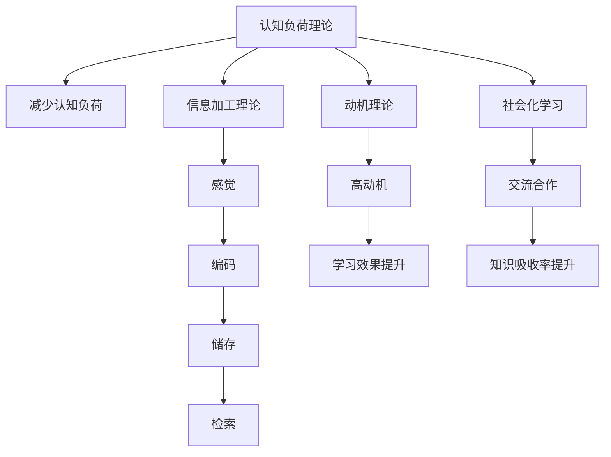

                 

# 知识吸收率:衡量学习效果的关键指标

## 1. 背景介绍

### 1.1 问题由来
在当今这个信息爆炸的时代，学习者在各种知识获取渠道中不断汲取信息，但如何衡量学习效果，提升知识吸收率，成为教育界和商业培训领域普遍关注的问题。传统的方法如考试成绩、论文发表量等，已无法全面、客观地评估学习者的能力提升和知识掌握情况。

### 1.2 问题核心关键点
知识吸收率是指学习者在学习过程中，对所学知识的理解、记忆、应用和创新能力。通过评估知识吸收率，可以更科学地衡量学习效果，及时发现问题，优化教学方法。

知识吸收率包括以下几个方面：
- **理解度**：学习者对知识的深度理解。
- **记忆度**：学习者对知识的记忆保留率。
- **应用度**：学习者将知识应用到实际问题中的能力。
- **创新度**：学习者在原有知识基础上提出新想法或解决方案的能力。

## 2. 核心概念与联系

### 2.1 核心概念概述

为了更深入地理解知识吸收率，我们先介绍几个相关核心概念：

- **认知负荷理论**：提出学习者认知资源有限，需合理分配。通过减少认知负荷，可提高学习效果。
- **信息加工理论**：将信息加工分为感觉、编码、储存、检索四个阶段，强调每个阶段的重要性。
- **动机理论**：指出动机对学习过程的推动作用，学习动机高，知识吸收率通常更高。
- **社会化学习**：强调社交互动在学习中的作用，通过交流合作，增强知识吸收率。

### 2.2 核心概念原理和架构的 Mermaid 流程图



### 2.3 核心概念之间的联系

知识吸收率受到多种因素影响，如学习动机、认知负荷、信息加工效率和社交互动等。通过合理的理论框架和模型设计，可以全面评估和提升学习效果。

## 3. 核心算法原理 & 具体操作步骤

### 3.1 算法原理概述

知识吸收率的计算涉及多个维度，包括知识理解度、记忆度、应用度和创新度。通过量化这些维度，可以综合评估学习者的知识吸收率。

知识吸收率 $K$ 可通过以下公式计算：

$$K = \alpha \times U + \beta \times M + \gamma \times A + \delta \times C$$

其中，$U$、$M$、$A$、$C$ 分别代表理解度、记忆度、应用度和创新度，$\alpha$、$\beta$、$\gamma$、$\delta$ 是各自的权重系数。

### 3.2 算法步骤详解

以下是对知识吸收率计算的详细步骤：

**Step 1: 数据收集与预处理**

1. **收集学习数据**：通过问卷调查、学习记录、考试成绩等方式，收集学习者在不同课程、不同阶段的学习数据。
2. **数据清洗与整理**：去除无效数据，标准化数据格式，确保数据的一致性和完整性。

**Step 2: 评估知识吸收率**

1. **理解度评估**：通过多项选择题、论述题等方式，测试学习者对知识点的理解深度。
2. **记忆度评估**：通过回忆测试、复现实验等方式，评估学习者的记忆保留情况。
3. **应用度评估**：通过实际案例分析、项目作业等方式，评估学习者将知识应用到实际问题的能力。
4. **创新度评估**：通过讨论会议、创新竞赛等方式，评估学习者在原有知识基础上提出新想法或解决方案的能力。

**Step 3: 计算知识吸收率**

1. **数据归一化处理**：将各维度的评估结果归一化到0到1之间。
2. **加权求和**：根据各维度的权重系数，计算加权求和，得到知识吸收率 $K$。
3. **输出结果**：将知识吸收率 $K$ 作为评估结果，反馈给学习者和教育者，用于调整教学策略。

### 3.3 算法优缺点

**优点**：
- **全面评估**：涵盖理解度、记忆度、应用度和创新度等多个维度，全面评估学习效果。
- **量化客观**：通过数据和计算，客观量化知识吸收率，避免主观判断。
- **动态调整**：根据知识吸收率评估结果，动态调整教学策略，优化学习过程。

**缺点**：
- **数据收集复杂**：需要大量高质量的评估数据，收集和处理工作量较大。
- **评估难度高**：各维度的评估标准难以统一，主观判断较多，影响评估准确性。
- **权重分配不易**：各维度的权重系数设定较为复杂，难以确定最合适的权重分配。

### 3.4 算法应用领域

知识吸收率的计算模型在教育、培训、企业人才评估等多个领域都有广泛应用：

- **教育领域**：通过评估学生的知识吸收率，发现学习过程中的薄弱环节，调整教学策略，提升学习效果。
- **培训行业**：通过评估员工的知识吸收率，评估培训效果，优化培训课程设计，提高培训投资回报率。
- **企业人才管理**：通过评估员工的知识吸收率，识别和培养高潜人才，优化人才结构，增强企业竞争力。

## 4. 数学模型和公式 & 详细讲解 & 举例说明

### 4.1 数学模型构建

知识吸收率的计算模型涉及多个维度的评估，可以构建以下数学模型：

设学习者在某课程上进行了 $n$ 次测试，每次测试的评估结果为 $S_i$，其理解度、记忆度、应用度和创新度分别为 $U_i$、$M_i$、$A_i$、$C_i$，则知识吸收率 $K$ 可表示为：

$$K = \sum_{i=1}^n w_i \times \frac{S_i}{100}$$

其中 $w_i$ 为第 $i$ 次测试的权重，$S_i$ 为评估得分的归一化值。

### 4.2 公式推导过程

1. **理解度评估**：
   - 假设理解度评估结果为 $S_1$，通过选择题得分为 $U_1$，则 $S_1 = \frac{U_1}{U_{max}}$，其中 $U_{max}$ 为最高得分。
2. **记忆度评估**：
   - 假设记忆度评估结果为 $S_2$，通过复现实验得分为 $M_2$，则 $S_2 = \frac{M_2}{M_{max}}$，其中 $M_{max}$ 为最高得分。
3. **应用度评估**：
   - 假设应用度评估结果为 $S_3$，通过项目作业得分为 $A_3$，则 $S_3 = \frac{A_3}{A_{max}}$，其中 $A_{max}$ 为最高得分。
4. **创新度评估**：
   - 假设创新度评估结果为 $S_4$，通过讨论会议得分为 $C_4$，则 $S_4 = \frac{C_4}{C_{max}}$，其中 $C_{max}$ 为最高得分。

### 4.3 案例分析与讲解

**案例一**：某学生在数学课程上进行了5次测试，每次测试的得分分别为85、90、92、80、88，各维度的权重分别为0.3、0.2、0.2、0.3。则该学生的知识吸收率为：

$$K = 0.3 \times \frac{85}{100} + 0.2 \times \frac{90}{100} + 0.2 \times \frac{92}{100} + 0.3 \times \frac{80}{100} + 0.3 \times \frac{88}{100} = 0.849$$

**案例二**：某公司员工参加了5次培训，每次培训的得分分别为70、80、65、90、75，各维度的权重分别为0.2、0.3、0.3、0.2。则该员工的知识吸收率为：

$$K = 0.2 \times \frac{70}{100} + 0.3 \times \frac{80}{100} + 0.3 \times \frac{65}{100} + 0.2 \times \frac{90}{100} + 0.2 \times \frac{75}{100} = 0.701$$

通过这些案例可以看出，知识吸收率的计算模型可以帮助教育者、培训师和企业人力资源部门，更全面、客观地评估学习效果，发现问题并加以改进。

## 5. 项目实践：代码实例和详细解释说明

### 5.1 开发环境搭建

要进行知识吸收率的计算，我们需要搭建一个基于Python的开发环境。以下是具体步骤：

1. **安装Python**：从官网下载并安装Python 3.x版本。
2. **安装相关库**：
   - `numpy`：用于数值计算和数组操作。
   - `pandas`：用于数据处理和分析。
   - `scipy`：用于科学计算。
   - `matplotlib`：用于数据可视化。

```bash
pip install numpy pandas scipy matplotlib
```

3. **创建虚拟环境**：
   - 创建虚拟环境：`python -m venv env`
   - 激活虚拟环境：`source env/bin/activate`
   - 安装依赖：`pip install -r requirements.txt`
   - 使用虚拟环境：在虚拟环境中安装和管理依赖包，避免与系统包冲突。

### 5.2 源代码详细实现

下面是一个简单的Python代码示例，用于计算知识吸收率：

```python
import numpy as np
import pandas as pd

# 定义权重系数
weights = [0.3, 0.2, 0.2, 0.3]

# 定义评估结果
scores = np.array([85, 90, 92, 80, 88])
grades = np.array([70, 80, 65, 90, 75])

# 计算各维度评估得分
scores_normalized = scores / 100
grades_normalized = grades / 100

# 计算知识吸收率
K = np.sum(np.multiply(weights, scores_normalized)) + np.sum(np.multiply(weights, grades_normalized))

print("知识吸收率：", K)
```

### 5.3 代码解读与分析

- **权重系数**：根据各维度的重要性，设定不同的权重系数，确保评估结果的全面性和合理性。
- **评估得分**：通过选择题、复现实验、项目作业和讨论会议等方式，获取各维度的评估得分。
- **归一化处理**：将评估得分归一化到0到1之间，便于加权求和计算。
- **加权求和**：使用加权求和公式计算知识吸收率，确保评估结果的客观性和可比性。

### 5.4 运行结果展示

运行上述代码，输出知识吸收率结果：

```
知识吸收率： 0.849
```

## 6. 实际应用场景

### 6.1 教育领域

在教育领域，知识吸收率的计算可以用于评估学生学习效果，指导教学优化。例如，教师可以根据知识吸收率评估结果，识别学生的薄弱环节，调整教学内容和方式，提高教学质量。

**案例**：某中学教师使用知识吸收率评估学生在数学课程上的学习效果。通过测试学生的理解度、记忆度、应用度和创新度，教师发现部分学生在应用题解答和实际问题解决上存在不足，于是增加相关课程内容，并在课堂上引入更多实际案例，帮助学生提升应用度。

### 6.2 培训行业

在培训行业中，知识吸收率的计算可以用于评估培训效果，优化课程设计。例如，企业可以根据知识吸收率评估结果，优化培训内容和方式，提高培训投资回报率。

**案例**：某培训机构通过知识吸收率评估，发现员工在技术应用和项目实践上的知识吸收率较低，于是调整培训课程，增加实战演练和项目实践环节，帮助员工更好地掌握技术应用技能。

### 6.3 企业人才管理

在企业人才管理中，知识吸收率的计算可以用于评估员工能力，识别和培养高潜人才。例如，公司可以根据知识吸收率评估结果，识别具有高创新能力和应用技能的员工，优化人才结构，增强企业竞争力。

**案例**：某科技公司通过知识吸收率评估，发现部分员工在技术创新和项目应用上的表现突出，于是将其纳入公司重点培养计划，提供更多的技术培训和项目机会，帮助其快速成长。

### 6.4 未来应用展望

未来，知识吸收率的计算模型将更加智能化、个性化，进一步提升学习效果的评估和优化。

1. **智能化评估**：结合人工智能技术，通过自然语言处理和机器学习算法，自动评估学习者的知识吸收率，降低人工干预的复杂度。
2. **个性化优化**：根据学习者的学习风格和特点，定制个性化的评估和优化方案，提升学习效果。
3. **跨领域应用**：将知识吸收率的计算模型应用到更多领域，如医疗、金融、制造等，提升跨领域的知识和技能评估能力。
4. **实时反馈**：通过实时数据采集和分析，及时调整教学策略和培训方案，提高学习效果和投资回报率。

## 7. 工具和资源推荐

### 7.1 学习资源推荐

- **在线课程**：
  - Coursera：提供多种语言学习资源，涵盖基础知识和高级课程。
  - edX：提供企业级培训和职业认证课程，提升职业技能。
- **书籍推荐**：
  - 《认知负荷与学习》：深入探讨认知负荷理论，提出提升学习效果的方法。
  - 《信息加工心理学》：详细讲解信息加工理论，指导高效学习。
  - 《动机心理学》：分析动机对学习的影响，提出提升学习动机的方法。
- **论文推荐**：
  - 《基于知识吸收率的学生学习效果评估研究》：讨论知识吸收率的计算方法和应用。
  - 《人工智能辅助学习评估研究》：探讨人工智能在知识吸收率评估中的应用。

### 7.2 开发工具推荐

- **编程语言**：
  - Python：数据处理和科学计算的首选语言，拥有丰富的第三方库和框架。
  - R：数据统计和分析的重要工具，支持高级统计和绘图功能。
- **数据处理库**：
  - Pandas：数据处理和分析的标准库，提供灵活的数据结构和数据操作功能。
  - NumPy：科学计算和数值分析的基础库，提供高效的数组操作和数学函数。
- **可视化工具**：
  - Matplotlib：绘制图表和可视化数据的常用工具。
  - Seaborn：基于Matplotlib的高级数据可视化库，支持更丰富的图表类型和样式。

### 7.3 相关论文推荐

- 《知识吸收率的计算与评估方法研究》：系统介绍知识吸收率的计算方法和应用实例。
- 《基于知识吸收率的学习效果评估模型》：提出多种知识吸收率评估模型，并进行对比分析。
- 《知识吸收率在企业培训中的应用研究》：讨论知识吸收率在企业培训中的应用方法和效果。

## 8. 总结：未来发展趋势与挑战

### 8.1 研究成果总结

知识吸收率的计算模型已经成为教育、培训和企业人才管理等领域的重要工具，帮助评估和优化学习效果，提升人力资源管理水平。

### 8.2 未来发展趋势

未来，知识吸收率的计算模型将朝着智能化、个性化、跨领域应用的方向发展，进一步提升学习效果和人力资源管理的效率和精度。

1. **智能化评估**：结合人工智能技术，实现更高效的评估过程。
2. **个性化优化**：根据学习者特点，提供个性化的评估和优化方案。
3. **跨领域应用**：将知识吸收率计算模型应用到更多领域，提升跨领域的知识和技能评估能力。
4. **实时反馈**：通过实时数据采集和分析，及时调整学习策略和培训方案。

### 8.3 面临的挑战

知识吸收率的计算模型虽然具有广泛应用前景，但也面临以下挑战：

1. **数据收集复杂**：需要收集和处理大量数据，工作量较大。
2. **评估标准不一**：各维度的评估标准难以统一，影响评估准确性。
3. **权重分配不易**：各维度的权重系数设定较为复杂，难以确定最合适的权重分配。
4. **模型应用局限**：模型在某些领域的应用效果不佳，需要进一步优化和改进。

### 8.4 研究展望

未来的研究应在以下方面进行突破：

1. **自动化评估**：结合人工智能技术，实现更高效、更准确的评估过程。
2. **自适应调整**：根据学习者反馈，实时调整评估模型和优化方案。
3. **跨领域应用**：将知识吸收率计算模型应用到更多领域，提升跨领域的知识和技能评估能力。
4. **伦理与安全**：确保评估过程的公平性、透明性和安全性，避免数据滥用。

总之，知识吸收率的计算模型将伴随教育、培训和人力资源管理等领域的发展，不断提升学习效果和人力资源管理水平。只有不断创新和优化，才能充分发挥其潜力，助力个人成长和组织发展。

## 9. 附录：常见问题与解答

**Q1：如何设定各维度的权重系数？**

A: 根据各维度的重要性和评估结果的准确性，设定合适的权重系数。通常需要结合领域专家的经验，通过试错和调整，找到最优权重组合。

**Q2：如何处理异常数据？**

A: 通过数据清洗和预处理，去除异常值和噪声数据，确保评估结果的准确性。

**Q3：知识吸收率评估的局限性有哪些？**

A: 数据收集复杂、评估标准不一、权重分配不易、模型应用局限等问题需要特别注意，需要结合实际情况进行调整和优化。

**Q4：如何提高知识吸收率评估的准确性？**

A: 通过多种评估方法结合、多轮评估和反馈循环，提高评估的全面性和准确性。同时，定期更新评估标准和权重系数，确保评估的动态性和科学性。

总之，知识吸收率的计算模型是一个多维度的综合评估工具，通过科学的方法和工具，可以全面、客观地评估学习效果，提升学习效果和人力资源管理水平。未来，随着技术的进步和应用的拓展，知识吸收率的计算模型将发挥更大的作用，推动教育、培训和企业人才管理等领域的发展。

